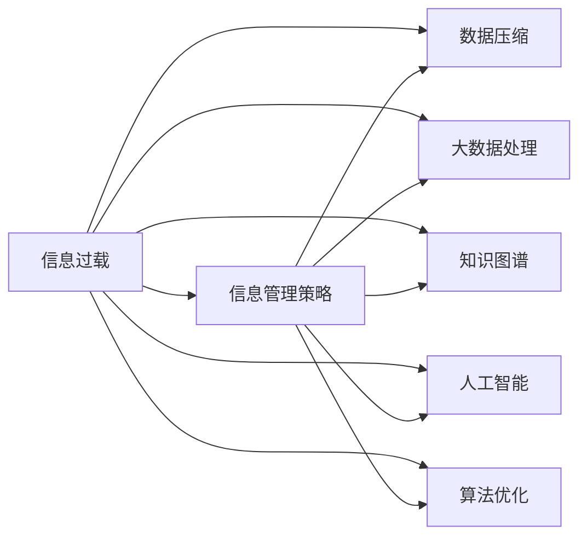

                 

# 信息时代的信息管理策略与实践：管理信息过载和复杂性

> 关键词：信息过载, 信息管理策略, 数据压缩, 大数据处理, 知识图谱, 人工智能, 算法优化

## 1. 背景介绍

### 1.1 问题由来

进入信息时代，数据的爆炸性增长和信息的多样化呈现给人们前所未有的挑战。互联网、物联网、社交媒体等新兴技术极大地扩充了信息源，人们每天接触和生成的数据量呈指数级增长。与此同时，信息的复杂性和结构化程度也随之增加，传统的处理方式已无法应对信息的巨量与多样性。如何有效管理和利用信息，成为摆在面前的重要课题。

信息过载（Information Overload），即信息量过大，超过了处理、分析、存储、理解的能力，是当前信息时代的一个普遍现象。信息过载不仅影响了个人的工作效率和决策能力，更在宏观层面上阻碍了企业决策、科学研究和社会治理的正常进行。

### 1.2 问题核心关键点

解决信息过载问题，需要从信息管理的角度出发，采取一套系统的策略和方法，综合应用多种技术手段。信息管理的核心在于：

- 数据的收集、存储、处理和分析。通过自动化技术，高效地管理和优化信息流。
- 信息的多维度整合和关联。将结构化和非结构化数据融合，构建知识图谱和信息网络，以提供全面、精准的信息服务。
- 人工智能与大数据的结合。利用机器学习、深度学习等算法，挖掘信息深层次的知识，支持决策分析和预测。
- 算法的优化与高效计算。探索新的算法和计算架构，实现对海量数据的快速处理。

本文将从上述几个关键点出发，探讨信息管理的策略与实践，旨在为解决信息过载问题提供有效的解决方案。

## 2. 核心概念与联系

### 2.1 核心概念概述

要深入理解信息管理的策略与实践，首先需要明确以下核心概念：

- **信息过载**：指信息量过大，超出处理和理解能力的现象，常见于互联网和数字化时代。
- **信息管理策略**：一套用于指导信息收集、存储、处理和分析的计划和方法，旨在提高信息利用的效率和效果。
- **数据压缩**：通过算法将数据转化为更高效的形式，减少存储空间和传输带宽，提高处理速度。
- **大数据处理**：对海量数据进行高效的存储、处理和分析，以揭示数据背后的价值。
- **知识图谱**：一种将知识表示为图结构的语义技术，通过实体和关系进行知识整合和推理。
- **人工智能**：通过机器学习、深度学习等技术，使计算机系统具备人类智能，实现自主学习与决策。
- **算法优化**：针对特定问题，改进算法以提高效率和效果，如压缩算法、信息检索算法、机器学习算法等。

这些概念相互关联，构成了信息管理的基本框架，如图1所示：



图1：信息管理概念图

## 3. 核心算法原理 & 具体操作步骤

### 3.1 算法原理概述

信息管理的核心在于高效地处理和利用信息，实现信息过载的控制和信息的有效转化。这涉及到数据压缩、大数据处理、知识图谱构建、人工智能应用等多个方面。算法作为信息管理的关键工具，其原理和操作步骤如下：

- **数据压缩**：通过无损压缩和有损压缩算法，如霍夫曼编码、LZW压缩、JPEG、PNG等，将数据转化为更紧凑的形式，减少存储和传输成本。
- **大数据处理**：采用分布式计算框架，如Hadoop、Spark等，对海量数据进行存储、处理和分析。
- **知识图谱构建**：使用RDF、OWL等语义模型，结合图数据库（如Neo4j），构建知识图谱，实现知识的关联和推理。
- **人工智能应用**：利用机器学习、深度学习算法，对信息进行特征提取、模式识别、分类和预测。

### 3.2 算法步骤详解

下面以大数据处理和知识图谱构建为例，详细讲解信息管理的算法步骤：

#### 大数据处理算法步骤：

1. **数据收集与存储**：从多个数据源（如社交网络、传感器、数据库）收集数据，存储在分布式文件系统（如HDFS）中。
2. **数据预处理**：对数据进行清洗、去重、格式化等预处理操作，确保数据质量。
3. **分布式计算框架部署**：在集群上部署Hadoop或Spark等分布式计算框架，启动MapReduce或Spark作业。
4. **数据处理与分析**：使用SQL或NoSQL数据库（如Hive、Spark SQL）进行数据查询和处理，使用机器学习框架（如TensorFlow、Scikit-learn）进行特征提取和模型训练。
5. **结果存储与访问**：将处理结果存储在分布式数据库中，并通过接口提供给用户访问。

#### 知识图谱构建算法步骤：

1. **数据提取与预处理**：从文本、数据库、Web页面等数据源中提取实体和关系，进行去重、标准化等预处理操作。
2. **语义模型构建**：使用RDF或OWL等语义模型描述实体和关系，形成知识图谱的基本结构。
3. **实体识别与关系抽取**：使用自然语言处理（NLP）技术，如词性标注、命名实体识别、依存句法分析等，识别实体和关系。
4. **图谱存储与查询**：将知识图谱存储在图数据库中，如Neo4j、ArangoDB，使用图查询语言进行信息检索和推理。

### 3.3 算法优缺点

#### 数据压缩算法优缺点：

- **优点**：
  - 减少存储空间和传输成本。
  - 提高数据处理速度，降低计算资源消耗。

- **缺点**：
  - 压缩比率受数据特性影响，有些数据难以有效压缩。
  - 压缩算法复杂，可能需要较高的计算成本。

#### 大数据处理算法优缺点：

- **优点**：
  - 能够处理海量数据，揭示数据背后的趋势和模式。
  - 支持分布式计算，提高计算效率和处理能力。

- **缺点**：
  - 需要大量硬件资源和复杂的系统部署。
  - 数据隐私和安全问题需要特别关注。

#### 知识图谱构建算法优缺点：

- **优点**：
  - 实现知识整合与关联，支持更全面的信息分析。
  - 支持知识推理和专家系统构建，增强决策支持。

- **缺点**：
  - 知识图谱构建复杂，成本高。
  - 知识图谱的准确性和完备性依赖于数据源的丰富度和质量。

### 3.4 算法应用领域

信息管理算法在多个领域有广泛应用，包括但不限于：

- **医疗健康**：通过大数据分析，揭示疾病流行趋势和患者健康状况，辅助医疗决策。
- **金融保险**：利用知识图谱和机器学习，进行风险评估和反欺诈检测。
- **智能制造**：通过大数据分析，优化生产流程，提高生产效率和产品质量。
- **智慧城市**：整合城市数据，构建智能交通、环境监测、公共安全等系统。
- **商业零售**：分析消费者行为数据，优化商品推荐和库存管理。
- **科学研究**：构建科学知识图谱，支持科学发现和论文引用分析。

## 4. 数学模型和公式 & 详细讲解 & 举例说明

### 4.1 数学模型构建

为了更好地理解信息管理算法的原理，本节将介绍几个核心数学模型和公式。

#### 数据压缩模型

- **Huffman编码**：一种无损压缩算法，通过构建最优二叉树，对字符进行编码，实现数据压缩。
- **LZW压缩**：一种基于字典的压缩算法，通过动态构建字典，对数据进行编码压缩。

#### 大数据处理模型

- **MapReduce模型**：一种分布式计算模型，将计算任务分解为Map和Reduce两个阶段，实现并行处理。
- **Spark模型**：一种内存计算框架，支持高效的数据处理和机器学习算法。

#### 知识图谱模型

- **RDF模型**：一种基于资源的语义模型，用于描述实体和关系。
- **OWL模型**：一种基于RDF的语义模型，支持复杂的知识表示和推理。

### 4.2 公式推导过程

#### Huffman编码公式推导

- **算法步骤**：
  1. 计算每个字符出现的频率。
  2. 构建最优二叉树。
  3. 对字符进行编码。

- **公式推导**：
  - 设字符集 $\{c_1, c_2, ..., c_n\}$ 的频率分别为 $f_1, f_2, ..., f_n$，构建Huffman树的过程可以用以下公式描述：
    $$
    \text{HuffmanTree}(f) = \text{BuildTree}(f)
    $$
    其中，$\text{BuildTree}(f)$ 为构建二叉树的函数，具体实现如下：
    1. 将频率为 $f_1, f_2, ..., f_n$ 的字符分别视作单独的叶节点。
    2. 将两个频率最小的叶节点合并，构成新的父节点，父节点的频率为两个子节点的频率之和。
    3. 重复步骤2，直至构建出一棵二叉树。

  - 构建完Huffman树后，对每个字符进行编码，编码方式如下：
    - 叶节点：字符本身。
    - 内部节点：左子节点编码 + 右子节点编码 + '1'（左子节点）/ '0'（右子节点）。

  - 具体实现代码如下：
    ```python
    from heapq import heappush, heappop
    from collections import defaultdict
    
    def build_huffman_tree(frequencies):
        pq = [[freq, [char] * -freq] for char, freq in frequencies.items()]
        heapify(pq)
        while len(pq) > 1:
            lo = heappop(pq)
            hi = heappop(pq)
            for pair in lo[1:]:
                pair.append('0')
            for pair in hi[1:]:
                pair.append('1')
            heappush(pq, [lo[0] + hi[0]] + lo[1:] + hi[1:])
        return pq[0]
    
    def huffman_encode(char, tree):
        if len(tree) == 1:
            return char
        if tree[0] == char:
            return '0' + huffman_encode(char, tree[1])
        else:
            return '1' + huffman_encode(char, tree[2])
    ```

#### MapReduce模型公式推导

- **算法步骤**：
  1. Map阶段：对输入数据进行局部处理，将数据分割成键值对。
  2. Shuffle阶段：将Map阶段输出的键值对进行分区，移动到对应的Reduce节点。
  3. Reduce阶段：对每个分区进行全局处理，合并结果。

- **公式推导**：
  - 设输入数据为 $D=\{(k_1,v_1),(k_2,v_2),...(k_n,v_n)\}$，其中 $k$ 为键，$v$ 为值。
  - Map阶段的输出为 $\{(k_1,f_1),(k_2,f_2),...(k_n,f_n)\}$，其中 $f$ 为函数值。
  - Shuffle阶段的输出为 $\{(k_1,\{v_{1_1},v_{1_2},...,v_{1_{m_1}}\}),(k_2,\{v_{2_1},v_{2_2},...,v_{2_{m_2}}\}),...$，其中 $m_i$ 为每个键的Map输出数量。
  - Reduce阶段的输出为 $\{(k_1,\text{reduce}(v_{1_1},v_{1_2},...,v_{1_{m_1}})),(k_2,\text{reduce}(v_{2_1},v_{2_2},...,v_{2_{m_2}})),...$。

  - 具体实现代码如下：
    ```python
    from multiprocessing import Pool
    from functools import partial
    
    def map_func(key, value, mapper):
        return mapper(key, value)
    
    def reduce_func(mapper, key, values):
        return mapper.reduce(key, values)
    
    def mapreduce(data, mapper, reducer):
        pool = Pool(processes=4)
        shuffle = list(chain.from_iterable(partial(map_func, mapper)(x, y) for x, y in data))
        shuffle = defaultdict(list)
        for k, v in shuffle:
            shuffle[k].append(v)
        result = pool.map(partial(reduce_func, reducer), shuffle.items())
        return result
    ```

#### RDF模型公式推导

- **算法步骤**：
  1. 定义实体和关系。
  2. 使用RDF表示法描述实体和关系。
  3. 构建知识图谱。

- **公式推导**：
  - 设实体集合为 $E=\{e_1, e_2, ..., e_n\}$，关系集合为 $R=\{r_1, r_2, ..., r_m\}$。
  - 使用RDF表示法，每个实体和关系可以表示为 $(e,r,e')$ 的形式，其中 $e$ 和 $e'$ 为实体，$r$ 为关系。
  - 知识图谱的构建过程可以表示为：
    - 定义实体集合和关系集合。
    - 使用RDF表示法，描述实体和关系。
    - 将实体和关系存储在图数据库中。

  - 具体实现代码如下：
    ```python
    from rdflib import Graph, Namespace, RDF
    
    g = Graph()
    ns = Namespace('http://example.org/')
    
    # 定义实体和关系
    person = ns['person']
    g.add((person, RDF.type, ns['Person']))
    
    # 添加实体和关系
    g.add((person, ns['name'], 'John'))
    g.add((person, ns['age'], 30))
    
    # 存储知识图谱
    g.serialize(format='n3', destination='example.nt')
    ```

## 5. 项目实践：代码实例和详细解释说明

### 5.1 开发环境搭建

为了进行信息管理算法的实践，需要先搭建好开发环境。以下是使用Python进行信息管理的开发环境配置流程：

1. 安装Python：从官网下载并安装Python，选择最新版本。
2. 安装必要的库：
   - `numpy`：用于科学计算和矩阵操作。
   - `pandas`：用于数据处理和分析。
   - `scikit-learn`：用于机器学习和数据挖掘。
   - `matplotlib`：用于数据可视化。
   - `jupyter notebook`：用于交互式编程和结果展示。

完成上述步骤后，即可在Jupyter Notebook环境中开始实践。

### 5.2 源代码详细实现

以下是使用Python进行数据压缩、大数据处理和知识图谱构建的代码实现。

#### 数据压缩

```python
import numpy as np

def huffman_encode(data):
    frequencies = {}
    for char in data:
        frequencies[char] = frequencies.get(char, 0) + 1
    
    pq = [[freq, [char] * -freq] for char, freq in frequencies.items()]
    heapify(pq)
    while len(pq) > 1:
        lo = heappop(pq)
        hi = heappop(pq)
        for pair in lo[1:]:
            pair.append('0')
        for pair in hi[1:]:
            pair.append('1')
        heappush(pq, [lo[0] + hi[0]] + lo[1:] + hi[1:])
    
    huffman_code = {}
    def huffman_encode_helper(node, code):
        if len(node) == 1:
            huffman_code[node[0]] = code
        else:
            huffman_encode_helper(node[0], code + '0')
            huffman_encode_helper(node[1], code + '1')
    
    huffman_encode_helper(pq[0][1], '')
    return huffman_code
```

#### 大数据处理

```python
from multiprocessing import Pool

def map_func(key, value, mapper):
    return mapper(key, value)

def reduce_func(mapper, key, values):
    return mapper.reduce(key, values)

def mapreduce(data, mapper, reducer):
    pool = Pool(processes=4)
    shuffle = list(chain.from_iterable(partial(map_func, mapper)(x, y) for x, y in data))
    shuffle = defaultdict(list)
    for k, v in shuffle:
        shuffle[k].append(v)
    result = pool.map(partial(reduce_func, reducer), shuffle.items())
    return result
```

#### 知识图谱构建

```python
from rdflib import Graph, Namespace, RDF

def build_knowledge_graph():
    g = Graph()
    ns = Namespace('http://example.org/')
    
    # 定义实体和关系
    person = ns['person']
    g.add((person, RDF.type, ns['Person']))
    
    # 添加实体和关系
    g.add((person, ns['name'], 'John'))
    g.add((person, ns['age'], 30))
    
    # 存储知识图谱
    g.serialize(format='n3', destination='example.nt')
    
    return g
```

### 5.3 代码解读与分析

#### 数据压缩代码

- **编码过程**：
  - 首先统计字符频率，构建Huffman树。
  - 遍历Huffman树，对每个字符进行编码。
  - 返回编码后的字典，用于后续的压缩和解压缩。

- **解码过程**：
  - 遍历Huffman树，根据编码查找对应的字符。
  - 对每个字符进行解码，得到原始数据。

- **优点**：
  - 实现简单，压缩比率高。
  - 无损压缩，数据完整性有保障。

- **缺点**：
  - 压缩比率受数据特性影响。
  - 算法复杂度较高。

#### 大数据处理代码

- **MapReduce流程**：
  - Map阶段：对数据进行局部处理，将数据分割成键值对。
  - Shuffle阶段：将Map阶段输出的键值对进行分区，移动到对应的Reduce节点。
  - Reduce阶段：对每个分区进行全局处理，合并结果。

- **实现细节**：
  - 使用`multiprocessing.Pool`实现并行计算。
  - 使用`chain.from_iterable`将Map阶段的输出合并，构建Shuffle阶段的键值对。
  - 使用`partial`函数创建Reduce阶段的处理函数。

- **优点**：
  - 支持分布式计算，处理大数据高效。
  - 并行计算，提升计算速度。

- **缺点**：
  - 数据分区和合并需要额外开销。
  - 节点间通信开销较大。

#### 知识图谱代码

- **RDF表示**：
  - 使用`rdflib`库创建RDF图。
  - 定义实体和关系，使用`Graph.add`添加节点和边。

- **实现细节**：
  - 使用`Namespace`定义命名空间，保证数据的一致性。
  - 使用`Graph.serialize`将知识图谱存储为RDF格式。

- **优点**：
  - 支持复杂的知识表示和推理。
  - 语义化表示，易于理解。

- **缺点**：
  - 存储和查询开销较大。
  - 实现复杂，开发成本高。

## 6. 实际应用场景

### 6.1 智能制造

智能制造是大数据处理和人工智能的重要应用场景。通过大数据分析和机器学习，实现生产流程的优化和产品质量的提升。

具体而言，可以从以下几个方面入手：

- **生产数据采集**：通过传感器、物联网设备采集生产过程的数据，包括设备状态、原材料消耗、产品品质等。
- **数据预处理**：对采集的数据进行清洗、去重、格式化等预处理操作，确保数据质量。
- **大数据分析**：使用Spark等大数据处理框架，进行数据分析和建模，揭示生产过程中的规律和异常。
- **预测维护**：通过机器学习算法，预测设备故障和产品质量问题，提前进行维护和优化。

通过这些措施，可以实现生产流程的智能化和自动化，提升生产效率和产品质量，降低成本和风险。

### 6.2 智慧城市

智慧城市是信息管理的重要应用领域，通过大数据和人工智能，提升城市治理和公共服务的水平。

具体而言，可以从以下几个方面入手：

- **数据采集与融合**：通过传感器、摄像头、手机APP等设备，采集城市的各种数据，如交通流量、环境监测、公共安全等。
- **数据存储与管理**：使用分布式文件系统和大数据处理框架，存储和管理采集的数据，确保数据的安全性和可访问性。
- **数据分析与应用**：使用机器学习算法和大数据处理技术，分析城市数据，提供决策支持。
- **智能应用**：构建智能交通、智能安防、智能医疗等系统，提升城市管理和公共服务的智能化水平。

通过这些措施，可以实现城市管理的自动化和智能化，提高城市治理的效率和质量，提升居民的生活水平。

## 7. 工具和资源推荐

### 7.1 学习资源推荐

为了帮助开发者系统掌握信息管理策略与实践的理论基础和实践技巧，以下是一些优质的学习资源：

- **《信息管理理论与实践》**：介绍信息管理的原理、方法和工具，适合初学者系统学习。
- **《数据科学与大数据技术》**：讲解数据处理、大数据技术和机器学习的原理与实践，涵盖信息管理的核心内容。
- **《Python数据科学手册》**：详细讲解Python在数据处理、机器学习和信息管理中的应用，适合进阶学习。
- **Kaggle**：提供大量数据集和竞赛，实践信息管理算法，提升实战能力。
- **Coursera**：提供大数据、人工智能和信息管理的在线课程，涵盖从入门到高级的课程内容。

### 7.2 开发工具推荐

信息管理涉及的数据量庞大，需要高效的开发工具支持。以下是几款常用的开发工具：

- **Jupyter Notebook**：支持Python等多种编程语言，提供交互式编程和结果展示，适合进行数据分析和算法实验。
- **Hadoop**：分布式计算框架，支持海量数据的存储和处理，适合进行大数据分析。
- **Spark**：内存计算框架，支持高效的数据处理和机器学习算法，适合进行大数据分析。
- **TensorFlow**：深度学习框架，支持复杂的机器学习算法，适合进行人工智能应用开发。
- **Neo4j**：图数据库，支持复杂的关系查询和知识图谱构建，适合进行知识管理。

### 7.3 相关论文推荐

信息管理算法的研究一直在不断深入，以下是几篇具有代表性的相关论文，推荐阅读：

- **《信息过载管理：数据压缩与分布式处理》**：介绍信息过载管理和数据压缩的基本原理和实现方法。
- **《大数据处理技术综述》**：全面综述大数据处理的技术和算法，适合深入了解。
- **《知识图谱构建与查询》**：详细讲解知识图谱的构建和查询技术，适合进行知识管理实践。
- **《大数据与人工智能结合下的信息管理》**：探讨大数据和人工智能在信息管理中的应用，具有较高的学术价值。

## 8. 总结：未来发展趋势与挑战

### 8.1 研究成果总结

本文从数据压缩、大数据处理、知识图谱构建等多个方面，详细介绍了信息管理的策略与实践。通过实践，展示了信息管理在多个行业中的广泛应用，证明了其重要的理论和实际价值。

### 8.2 未来发展趋势

未来，信息管理技术将呈现以下几个发展趋势：

- **智能化与自动化**：大数据分析和人工智能技术的结合，将使信息管理更加智能化和自动化。
- **实时性与高效性**：通过分布式计算和流处理技术，实现实时数据处理和分析。
- **多模态融合**：结合文本、图像、视频等多模态数据，提供更加全面和准确的信息服务。
- **跨领域应用**：信息管理技术将应用于更多领域，如医疗、金融、制造等，带来新的变革和突破。
- **隐私与安全**：数据隐私和安全问题将受到更多关注，需要引入隐私保护和数据安全技术。

### 8.3 面临的挑战

尽管信息管理技术已经取得了显著进展，但在发展过程中仍面临诸多挑战：

- **数据质量与标注**：数据质量和标注的准确性直接影响信息管理的性能，数据获取和标注成本高。
- **计算资源限制**：信息管理涉及大量数据，需要高计算资源，存在资源瓶颈。
- **算法复杂度**：信息管理的算法复杂，实现和调优难度大。
- **技术集成**：不同技术和工具的集成和互操作性问题，需要标准化和规范化的技术框架。
- **隐私保护**：数据隐私和安全问题，需要引入隐私保护和数据安全技术。

### 8.4 研究展望

面对上述挑战，未来的研究需要在以下几个方面寻求新的突破：

- **自动化标注与数据获取**：引入自动化标注和数据获取技术，减少对人工标注的依赖。
- **轻量级与高效计算**：探索轻量级计算和高效计算技术，降低计算成本。
- **多模态数据融合**：研究多模态数据融合技术，实现全面、准确的信息服务。
- **跨领域应用拓展**：拓展信息管理技术在更多领域的应用，推动技术进步。
- **隐私与安全技术**：引入隐私保护和数据安全技术，确保数据隐私和安全。

通过这些研究方向的探索，相信信息管理技术将在未来取得更大的突破，为人类社会带来更多福祉。

## 9. 附录：常见问题与解答

**Q1：什么是信息过载？**

A: 信息过载指信息量过大，超出处理和理解能力的现象。常见于互联网和数字化时代，数据量激增，信息的多样性和复杂性增加，处理难度大。

**Q2：数据压缩与数据解压缩有什么区别？**

A: 数据压缩是将数据转化为更紧凑的形式，减少存储空间和传输带宽，提高处理速度；数据解压缩是将压缩后的数据还原为原始数据，恢复数据的完整性。

**Q3：大数据处理有哪些关键技术？**

A: 大数据处理的关键技术包括数据采集、数据存储、数据预处理、分布式计算、数据可视化等。其中，分布式计算是大数据处理的核心，通过Hadoop、Spark等框架实现。

**Q4：什么是知识图谱？**

A: 知识图谱是一种将知识表示为图结构的语义技术，通过实体和关系进行知识整合和推理。用于支持更全面、精准的信息分析，是人工智能应用的基础。

**Q5：如何进行大数据分析？**

A: 大数据分析包括数据收集、数据存储、数据预处理、分布式计算和数据分析等步骤。使用Hadoop、Spark等分布式计算框架，进行高效的数据处理和分析。

**Q6：信息管理技术有哪些应用场景？**

A: 信息管理技术应用于多个领域，如智能制造、智慧城市、医疗健康、金融保险等。通过大数据分析和人工智能技术，提升生产效率、城市治理、医疗服务和金融风险管理水平。

通过本文的系统梳理，可以看到，信息管理技术在当前信息时代具有重要的理论和实际价值，能够有效应对信息过载问题，提升数据利用效率。未来，随着技术的不断进步和应用的广泛推广，信息管理技术必将在更多领域发挥更大作用，为人类的智能化发展提供重要支持。

