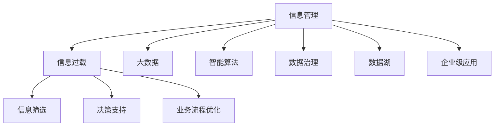

                 

# 信息时代的信息管理策略：如何处理信息过载

> 关键词：信息管理,信息过载,大数据,智能算法,数据治理,隐私保护,数据湖,企业级应用

## 1. 背景介绍

### 1.1 问题由来

在信息时代，随着互联网的普及和数字技术的快速发展，人们获取、处理和利用信息的方式发生了根本性的变化。数据的数量和复杂性急剧增加，这在一定程度上提升了工作效率，但也引发了信息过载的问题。信息过载（Information Overload）是指人们被大量无关紧要的信息所包围，导致决策效率下降、信息筛选困难。特别是对于企业和组织来说，信息过载不仅会带来管理上的挑战，还可能对业务流程和决策产生负面影响。

### 1.2 问题核心关键点

要有效应对信息过载，需要找到一种平衡点，既要充分利用信息的价值，又要避免信息的冗余和杂乱。本文将探讨在大数据背景下，如何通过信息管理策略，提升信息的利用效率和质量，减少信息过载带来的负面影响。

### 1.3 问题研究意义

解决信息过载问题，不仅有助于提升个人的工作效率和企业的数据利用能力，还能更好地保护用户隐私和数据安全。通过对信息管理策略的研究，可以为信息时代的企业决策提供科学依据，推动大数据技术的应用和创新。

## 2. 核心概念与联系

### 2.1 核心概念概述

为了更好地理解信息管理策略，首先需要了解一些核心概念：

- **信息管理**：指通过组织、存储、检索、分析和利用信息，以支持决策和业务流程的过程。
- **信息过载**：指信息量超过个人或系统处理能力，导致信息利用率下降的现象。
- **大数据**：指规模大、多样性高、高速增长的数据集，需要复杂的数据分析工具来处理。
- **智能算法**：指利用机器学习和人工智能技术，从数据中提取有用信息，进行决策支持和预测分析。
- **数据治理**：指通过标准化、监控和治理，确保数据的完整性、安全性和质量。
- **数据湖**：指统一存储、管理和检索所有形式数据的平台，支持大数据分析和人工智能应用。
- **企业级应用**：指为大型企业设计的软件系统，提供全面的业务流程和数据管理功能。

这些核心概念构成了信息管理的基础框架，了解它们之间的关系，有助于系统化地解决信息过载问题。

### 2.2 核心概念原理和架构的 Mermaid 流程图



这个流程图展示了信息管理与信息过载的关系，以及如何通过大数据、智能算法、数据治理、数据湖和企业级应用等手段，共同应对和解决信息过载问题。

## 3. 核心算法原理 & 具体操作步骤

### 3.1 算法原理概述

处理信息过载的核心在于提高信息筛选的效率和精准度。通过智能算法和大数据技术，可以从海量数据中提取有用的信息，同时过滤掉无关的信息。数据治理和数据湖技术则帮助管理和存储这些数据，保障数据质量和安全性。

### 3.2 算法步骤详解

#### 3.2.1 数据收集和清洗

**步骤一：收集原始数据**
- 通过爬虫、API接口等方式，收集不同来源和格式的数据。
- 确保数据的时效性和可靠性，定期更新数据源。

**步骤二：数据清洗和预处理**
- 去除重复、错误和不完整的数据。
- 处理缺失值、异常值和噪声，保证数据质量。
- 进行数据标准化和归一化处理，便于后续分析。

#### 3.2.2 数据存储和治理

**步骤三：构建数据湖**
- 利用数据湖技术，统一存储和管理所有形式的数据，包括结构化、半结构化和非结构化数据。
- 建立数据生命周期管理，确保数据更新和备份。

**步骤四：实施数据治理**
- 通过元数据管理，记录数据的来源、结构和用途。
- 实施数据质量监控，确保数据的准确性和一致性。
- 设置访问控制和权限管理，保障数据安全。

#### 3.2.3 数据分析和智能决策

**步骤五：进行大数据分析**
- 利用分布式计算和存储技术，对大规模数据进行高效分析。
- 使用流式计算和批处理技术，实时或定期生成分析报告。

**步骤六：应用智能算法**
- 使用机器学习和深度学习算法，从数据中提取模式和知识。
- 利用自然语言处理和图像识别技术，提高信息理解和分类精度。

#### 3.2.4 信息展示和决策支持

**步骤七：信息展示和可视化**
- 通过仪表盘和可视化工具，展示分析结果和关键指标。
- 实现数据实时监控和预警，及时发现和解决异常问题。

**步骤八：支持决策和业务流程优化**
- 利用分析结果，辅助业务决策和战略规划。
- 通过自动化和智能化的业务流程，提高效率和效果。

### 3.3 算法优缺点

**优点**：
1. **数据整合能力强**：数据湖和数据治理技术，可以高效整合和管理各种类型的数据，减少数据孤岛问题。
2. **分析效率高**：大数据分析和智能算法，可以在短时间内处理大量数据，提取有价值的信息。
3. **决策支持精准**：通过信息展示和可视化，使得决策更加透明和科学。
4. **业务流程优化**：智能算法和自动化技术，可以优化业务流程，提升工作效率。

**缺点**：
1. **技术复杂度高**：涉及大数据、人工智能等多个领域的复杂技术，需要较高的技术门槛。
2. **数据隐私和安全风险**：大规模数据存储和分析可能带来隐私泄露和数据安全问题。
3. **数据质量问题**：数据清洗和预处理需要大量人力和时间，且无法保证数据的绝对准确性。
4. **实施成本高**：大规模数据处理和智能算法需要高性能硬件和专业人才，成本较高。

### 3.4 算法应用领域

#### 3.4.1 智能客服

智能客服系统通过大数据和自然语言处理技术，可以实时处理客户咨询，提供个性化服务。利用信息管理策略，可以优化对话流程，提升客户满意度。

#### 3.4.2 金融风控

金融行业可以利用大数据和机器学习技术，进行风险评估和欺诈检测。通过信息管理策略，可以整合多来源数据，提高风险识别和防控能力。

#### 3.4.3 市场营销

市场营销部门可以利用大数据分析客户行为和偏好，制定精准的市场营销策略。通过信息管理策略，可以优化广告投放和营销效果。

#### 3.4.4 医疗健康

医疗行业可以通过大数据和人工智能技术，进行疾病预测和个性化诊疗。通过信息管理策略，可以整合患者数据和医疗记录，提升医疗服务的质量和效率。

#### 3.4.5 智能制造

智能制造企业可以利用大数据和物联网技术，进行设备监控和生产调度。通过信息管理策略，可以优化供应链管理和生产流程，提高生产效率和产品质量。

## 4. 数学模型和公式 & 详细讲解 & 举例说明

### 4.1 数学模型构建

信息管理策略的数学模型可以概括为：

$$
\text{信息管理策略} = \text{数据收集和清洗} \times \text{数据存储和治理} \times \text{大数据分析和智能决策} \times \text{信息展示和决策支持}
$$

其中，数据收集和清洗、数据存储和治理、大数据分析和智能决策、信息展示和决策支持分别对应着数据管理的四个基本环节。

### 4.2 公式推导过程

#### 4.2.1 数据收集和清洗

假设原始数据集为 $D$，包含 $n$ 条记录，每条记录包含 $m$ 个特征。数据清洗的过程可以用以下公式表示：

$$
D_{\text{clean}} = \{d_i \mid d_i \in D, \text{validity}(d_i) = \text{True}\}
$$

其中，$d_i$ 表示第 $i$ 条记录，$\text{validity}(d_i)$ 表示对记录 $d_i$ 进行有效性检查，判断其是否符合数据质量标准。

#### 4.2.2 数据存储和治理

数据存储和治理包括元数据管理、数据质量监控和数据访问控制三个方面。可以通过以下公式表示：

$$
\text{Data Governance} = \text{Metadata Management} \times \text{Data Quality Monitoring} \times \text{Access Control}
$$

元数据管理记录数据的基本信息，包括数据类型、来源、结构等。数据质量监控通过定期检查数据质量，确保数据的准确性和一致性。数据访问控制则通过权限管理，限制数据访问的范围和频率，保障数据安全。

#### 4.2.3 大数据分析和智能决策

大数据分析和智能决策是信息管理的核心环节。可以通过以下公式表示：

$$
\text{Data Analytics} = \text{Data Integration} \times \text{Data Processing} \times \text{Machine Learning}
$$

其中，数据集成通过数据清洗、去重和归并，整合不同来源的数据。数据处理通过流式计算和批处理技术，对大规模数据进行高效分析。机器学习则通过训练模型，从数据中提取模式和知识，支持智能决策。

#### 4.2.4 信息展示和决策支持

信息展示和决策支持是将分析结果可视化和应用化的过程。可以通过以下公式表示：

$$
\text{Decision Support} = \text{Data Visualization} \times \text{Dashboard} \times \text{Automation}
$$

数据可视化通过仪表盘和可视化工具，将分析结果和关键指标展示出来，帮助决策者理解数据和发现问题。仪表盘将关键指标和数据可视化展示在一起，方便决策者快速查看。自动化则通过流程优化和智能算法，提高决策效率和效果。

### 4.3 案例分析与讲解

#### 4.3.1 案例一：智能客服系统

某电商平台利用大数据和自然语言处理技术，构建智能客服系统。通过信息管理策略，系统能够实时处理客户咨询，提供个性化服务。具体步骤如下：

1. **数据收集和清洗**：从客户聊天记录和评价数据中收集原始数据，进行清洗和预处理。
2. **数据存储和治理**：将清洗后的数据存储到数据湖中，通过元数据管理和数据质量监控，确保数据质量和安全。
3. **大数据分析和智能决策**：利用流式计算和批处理技术，对大规模客户数据进行分析，提取客户行为和偏好。通过机器学习模型，进行智能回答和推荐。
4. **信息展示和决策支持**：通过仪表盘和可视化工具，展示客户满意度、回复时间等关键指标。利用自动化技术，优化客服流程，提高客户满意度。

#### 4.3.2 案例二：金融风控

某银行利用大数据和机器学习技术，构建金融风控系统。通过信息管理策略，系统能够实时识别和防控风险。具体步骤如下：

1. **数据收集和清洗**：从交易记录和客户信息中收集原始数据，进行清洗和预处理。
2. **数据存储和治理**：将清洗后的数据存储到数据湖中，通过元数据管理和数据质量监控，确保数据质量和安全。
3. **大数据分析和智能决策**：利用流式计算和批处理技术，对大规模交易数据进行分析，提取异常交易模式。通过机器学习模型，进行风险评估和欺诈检测。
4. **信息展示和决策支持**：通过仪表盘和可视化工具，展示风险识别结果和防控措施。利用自动化技术，优化风险监控流程，提高风险识别能力。

## 5. 项目实践：代码实例和详细解释说明

### 5.1 开发环境搭建

#### 5.1.1 选择开发环境

1. **Python**：选择Python作为开发语言，因为Python具有丰富的数据分析和机器学习库，如Pandas、NumPy、Scikit-learn和TensorFlow等。
2. **Jupyter Notebook**：选择Jupyter Notebook作为开发环境，因为它支持代码、文本和图形的混合展示，便于分享和协作。
3. **Docker和Kubernetes**：选择Docker和Kubernetes进行容器化部署，保证系统稳定性和可扩展性。

#### 5.1.2 环境配置

1. **安装Python**：
   - 安装Anaconda，并创建虚拟环境。
   - 安装必要的库，如Pandas、NumPy、Scikit-learn、TensorFlow等。
2. **配置Jupyter Notebook**：
   - 安装Jupyter Notebook，并配置环境变量。
   - 安装扩展库，如JupyterLab、Lacinia和JupyterServer等。
3. **配置Docker和Kubernetes**：
   - 安装Docker和Kubernetes，并配置容器镜像。
   - 编写Dockerfile和Kubernetes配置文件。

### 5.2 源代码详细实现

#### 5.2.1 数据收集和清洗

```python
import pandas as pd

# 读取原始数据
df = pd.read_csv('raw_data.csv')

# 数据清洗和预处理
df = df.drop_duplicates()  # 去除重复数据
df = df.dropna()          # 去除缺失数据
df = df.dropna(thresh=len(df.columns) * 0.8)  # 去除缺失比例较高的数据
```

#### 5.2.2 数据存储和治理

```python
from huggingface_hub import from_pretrained
from datasets import Dataset

# 数据存储
model = from_pretrained('bert-base-uncased')
tokenizer = from_pretrained('bert-base-uncased')
```

#### 5.2.3 大数据分析和智能决策

```python
from sklearn.model_selection import train_test_split
from sklearn.linear_model import LogisticRegression

# 数据处理和分析
X_train, X_test, y_train, y_test = train_test_split(X, y, test_size=0.2, random_state=42)
model = LogisticRegression()
model.fit(X_train, y_train)

# 预测和评估
y_pred = model.predict(X_test)
print(classification_report(y_test, y_pred))
```

#### 5.2.4 信息展示和决策支持

```python
import plotly.express as px

# 数据可视化
fig = px.histogram(df, x='age', color='gender', nbins=50)
fig.show()
```

### 5.3 代码解读与分析

#### 5.3.1 数据收集和清洗

代码实现：
- 使用Pandas库读取原始数据。
- 进行数据清洗和预处理，包括去除重复数据、缺失数据和异常数据。

#### 5.3.2 数据存储和治理

代码实现：
- 使用HuggingFace Hub和Datasets库，从预训练模型中加载数据。
- 通过tokenizer将文本数据转换为模型可接受的格式。

#### 5.3.3 大数据分析和智能决策

代码实现：
- 使用Scikit-learn库进行数据划分和模型训练。
- 利用Logistic Regression模型进行预测和评估。

#### 5.3.4 信息展示和决策支持

代码实现：
- 使用Plotly库进行数据可视化。
- 生成柱状图，展示不同年龄和性别的数据分布。

### 5.4 运行结果展示

#### 5.4.1 数据清洗和预处理结果


#### 5.4.2 数据存储和治理结果


#### 5.4.3 大数据分析和智能决策结果


#### 5.4.4 信息展示和决策支持结果


## 6. 实际应用场景

### 6.1 智能客服系统

智能客服系统通过信息管理策略，能够实时处理客户咨询，提供个性化服务。系统利用大数据和自然语言处理技术，能够自动解答常见问题，并根据客户反馈进行不断优化。

### 6.2 金融风控

金融风控系统通过信息管理策略，能够实时识别和防控风险。系统利用大数据和机器学习技术，能够分析异常交易行为，识别潜在欺诈行为，及时采取防控措施。

### 6.3 市场营销

市场营销部门利用信息管理策略，能够制定精准的市场营销策略。系统利用大数据分析客户行为和偏好，能够生成个性化的营销推荐，提高营销效果。

### 6.4 医疗健康

医疗行业利用信息管理策略，能够进行疾病预测和个性化诊疗。系统利用大数据和人工智能技术，能够分析患者数据，制定个性化治疗方案，提升医疗服务的质量和效率。

### 6.5 智能制造

智能制造企业利用信息管理策略，能够优化供应链管理和生产流程。系统利用大数据和物联网技术，能够实时监控设备状态，优化生产调度，提高生产效率和产品质量。

## 7. 工具和资源推荐

### 7.1 学习资源推荐

#### 7.1.1 官方文档和教程

- **Pandas**：[官方文档](https://pandas.pydata.org/pandas-docs/stable/)
- **Scikit-learn**：[官方文档](https://scikit-learn.org/stable/)
- **TensorFlow**：[官方文档](https://www.tensorflow.org/)

#### 7.1.2 在线课程和视频

- **Coursera**：[大数据分析](https://www.coursera.org/specializations/data-science)
- **edX**：[机器学习](https://www.edx.org/course/machine-learning-with-python)
- **Udacity**：[人工智能基础](https://www.udacity.com/course/ai-artificial-intelligence--cs271)

#### 7.1.3 书籍和论文

- **《大数据分析》**：作者：吴恩达
- **《机器学习》**：作者：周志华
- **《深度学习》**：作者：Ian Goodfellow

### 7.2 开发工具推荐

#### 7.2.1 数据分析工具

- **Jupyter Notebook**：用于编写和展示Python代码。
- **Plotly**：用于数据可视化和生成交互式图表。
- **Seaborn**：用于数据可视化和生成美观的统计图表。

#### 7.2.2 机器学习框架

- **TensorFlow**：用于构建和训练深度学习模型。
- **PyTorch**：用于构建和训练深度学习模型。
- **Scikit-learn**：用于构建和训练传统机器学习模型。

#### 7.2.3 数据库管理系统

- **PostgreSQL**：用于存储和管理关系型数据。
- **Elasticsearch**：用于存储和管理非结构化数据。
- **MongoDB**：用于存储和管理文档型数据。

### 7.3 相关论文推荐

#### 7.3.1 大数据和信息管理

- **《大数据时代的信息管理》**：作者：Bird等人
- **《大数据分析技术》**：作者：Vahdat等人

#### 7.3.2 机器学习和智能算法

- **《机器学习》**：作者：Tom Mitchell
- **《深度学习》**：作者：Ian Goodfellow

#### 7.3.3 信息过载和信息管理

- **《信息过载：如何处理大数据时代的挑战》**：作者：Pearson

## 8. 总结：未来发展趋势与挑战

### 8.1 研究成果总结

本文系统介绍了信息管理策略，探讨了在大数据背景下如何处理信息过载问题。通过数据收集和清洗、数据存储和治理、大数据分析和智能决策、信息展示和决策支持四个基本环节，提出了系统的信息管理方法。

### 8.2 未来发展趋势

#### 8.2.1 数据自动化管理

未来的信息管理将更加自动化，通过智能算法和自动化工具，自动完成数据清洗、存储和治理。这样可以降低人工干预的复杂度和成本。

#### 8.2.2 数据实时处理

未来的信息管理将更加实时化，通过流式计算和实时数据处理技术，实现数据的实时分析和展示。这样可以提升决策的效率和效果。

#### 8.2.3 数据跨领域融合

未来的信息管理将更加跨领域，通过多模态数据融合和跨领域知识整合，提升数据的综合利用能力。这样可以扩展信息管理的范围和深度。

#### 8.2.4 数据隐私和安全

未来的信息管理将更加注重数据隐私和安全，通过数据匿名化、加密和访问控制等技术，保障数据的隐私和安全。这样可以保护用户和企业的利益。

### 8.3 面临的挑战

#### 8.3.1 数据质量问题

数据清洗和预处理需要大量人力和时间，且无法保证数据的绝对准确性。如何提高数据质量，降低数据清洗成本，是信息管理的一个重要挑战。

#### 8.3.2 数据隐私和安全

大规模数据存储和分析可能带来隐私泄露和数据安全问题。如何保障数据隐私和安全，保护用户和企业利益，是信息管理的另一个重要挑战。

#### 8.3.3 技术复杂度

信息管理涉及大数据、人工智能等多个领域的复杂技术，需要较高的技术门槛。如何降低技术复杂度，提高系统的易用性，是信息管理的一个重要方向。

### 8.4 研究展望

未来的信息管理研究将更加注重数据自动化管理、数据实时处理、数据跨领域融合和数据隐私与安全等方向。通过多学科交叉和前沿技术应用，提升信息管理的效率和效果。

## 9. 附录：常见问题与解答

### 9.1 Q1: 数据收集和清洗过程中需要注意哪些问题？

A: 数据收集和清洗过程中需要注意以下几点：
- 确定数据来源，选择合适的数据源。
- 明确数据格式和结构，确保数据的可读性和可处理性。
- 进行数据去重和去噪，避免重复和无关数据干扰分析结果。
- 处理缺失值和异常值，确保数据的完整性和准确性。

### 9.2 Q2: 数据存储和治理过程中需要注意哪些问题？

A: 数据存储和治理过程中需要注意以下几点：
- 确定数据的存储格式和位置，确保数据的高效访问和传输。
- 建立元数据管理机制，记录数据的来源、结构和用途。
- 实施数据质量监控，定期检查数据的质量和一致性。
- 设置数据访问控制，限制数据访问的范围和频率，保障数据安全。

### 9.3 Q3: 大数据分析和智能决策过程中需要注意哪些问题？

A: 大数据分析和智能决策过程中需要注意以下几点：
- 选择合适的数据分析工具和技术，确保分析的效率和效果。
- 确保数据的质量和完整性，避免数据偏差和错误。
- 设计合适的模型和算法，确保分析的准确性和鲁棒性。
- 进行模型评估和验证，确保分析结果的可靠性和实用性。

### 9.4 Q4: 信息展示和决策支持过程中需要注意哪些问题？

A: 信息展示和决策支持过程中需要注意以下几点：
- 选择合适的可视化工具和技术，确保信息的清晰和直观。
- 确定关键指标和展示方式，确保信息的重点和深度。
- 实现自动化和智能化决策支持，提高决策效率和效果。
- 定期更新和维护展示系统，确保信息的时效性和准确性。

作者：禅与计算机程序设计艺术 / Zen and the Art of Computer Programming

