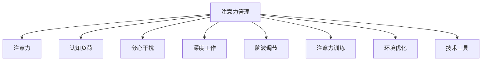

                 

# 信息时代的注意力管理实践与指南：在干扰和信息过载中航行

> 关键词：注意力管理,信息过载,分心,认知负荷,脑波调节,深度工作,注意力训练,环境优化,技术工具

## 1. 背景介绍

### 1.1 问题由来

在信息时代，我们面临着前所未有的信息过载和注意力分散挑战。智能手机、社交媒体、信息爆炸等现代技术的普及，使得注意力资源变得稀缺而宝贵。人们每天需要处理的海量信息极大地加重了认知负荷，而工作和学习环境的干扰使得专注力日益分散。因此，如何在信息海洋中有效管理注意力，成为提高效率、保障健康的关键课题。

### 1.2 问题核心关键点

注意力管理的核心在于识别和优化影响注意力的因素，通过科学的策略和方法，提升个人的专注力和生产效能。常见的问题包括：

- 分心干扰：手机通知、同事打扰、社交媒体诱惑等，使得注意力难以集中。
- 信息过载：同时接收和处理多个任务，使得认知资源分散，任务完成效率下降。
- 脑波调节：通过调节脑波，从β波状态（注意力分散）切换到α波状态（专注），提高注意力集中的能力。
- 深度工作：有研究证明，深度工作（Deep Work）是提升生产力的高效方式，但受到干扰的环境难以实现深度工作状态。
- 注意力训练：通过训练提升注意力的集中度和持久度，增强工作的专注性和创造性。
- 环境优化：通过优化工作和学习环境，减少干扰，提供更支持专注的条件。
- 技术工具：使用技术手段，如番茄工作法、专注应用程序等，辅助注意力管理。

这些核心问题构成了一个系统，各个要素之间相互影响，需要通过全面考虑和系统性优化，才能取得较好的效果。

### 1.3 问题研究意义

对于个人而言，有效管理注意力能够提高学习效率、提升工作质量、减少疲劳和压力，从而改善生活质量。对于组织而言，通过优化工作流程、减少干扰、提升员工专注度，可以提升整体生产力和创新能力。研究注意力管理的科学方法和技术工具，有助于应对信息时代的技术挑战，推动人类社会的进一步发展。

## 2. 核心概念与联系

### 2.1 核心概念概述

为了深入理解注意力管理的原理和实践，本节将介绍几个关键概念：

- 注意力（Attention）：指个体在特定时刻集中于某一刺激物或任务的能力。
- 认知负荷（Cognitive Load）：指大脑在处理信息时所需的能量和资源。
- 分心干扰（Distraction）：指导致注意力分散的各种外部和内部干扰因素。
- 深度工作（Deep Work）：指在无干扰状态下，能够全神贯注、高效产出的一种工作状态。
- 脑波调节（Brain Wave Regulation）：通过调节脑电波模式，促进大脑进入更专注的状态。
- 注意力训练（Attention Training）：通过特定的练习和训练，提升个体的注意力集中度和持久度。
- 环境优化（Environment Optimization）：通过改善工作和学习环境，减少干扰，提供更支持专注的条件。
- 技术工具（Technology Tools）：通过使用辅助工具和应用程序，提高注意力管理的效率。

这些概念之间存在着密切联系，共同构成了一个综合性的注意力管理框架。通过理解这些概念的原理和架构，我们可以更好地把握注意力管理的科学性和实践性。

### 2.2 核心概念原理和架构的 Mermaid 流程图(Mermaid 流程节点中不要有括号、逗号等特殊字符)



这个流程图展示了注意力管理中的各个核心概念及其相互关系：注意力是注意力管理的核心，认知负荷、分心干扰、深度工作、脑波调节、注意力训练、环境优化、技术工具等都通过不同方式影响或辅助注意力集中。

## 3. 核心算法原理 & 具体操作步骤
### 3.1 算法原理概述

注意力管理的核心在于识别和优化影响注意力的因素，通过科学的策略和方法，提升个人的专注力和生产效能。

注意力管理可以概括为以下几个关键步骤：

1. **识别分心源**：识别个人和环境中的分心干扰因素，如手机通知、同事打扰、社交媒体等。
2. **评估认知负荷**：评估个体当前所处的认知负荷状态，识别哪些任务需要更多注意力。
3. **调节脑波模式**：通过调节脑波，从β波状态（注意力分散）切换到α波状态（专注）。
4. **实施深度工作**：在无干扰的环境中，实施深度工作，全神贯注于任务。
5. **进行注意力训练**：通过特定的练习和训练，提升注意力的集中度和持久度。
6. **优化环境**：改善工作和学习环境，减少干扰，提供更支持专注的条件。
7. **使用技术工具**：利用辅助工具和应用程序，提高注意力管理的效率。

### 3.2 算法步骤详解

#### 3.2.1 识别分心源

识别分心源是注意力管理的第一步。常见的方法包括：

- 日志记录：记录日常生活中的分心事件，如接听电话、查看社交媒体、同事打扰等。
- 环境扫描：观察工作和学习环境中的干扰因素，如嘈杂的声音、分散注意力的事物等。
- 心理状态评估：通过自我反思或专业工具，评估个体的心理状态，识别注意力不集中的时间段。

#### 3.2.2 评估认知负荷

评估认知负荷有助于了解当前任务对注意力的需求。常见的方法包括：

- 任务复杂度分析：分析任务的复杂度和所需认知资源，估算所需的注意力水平。
- 持续时间估算：估算任务所需的持续时间，根据任务复杂度调整注意力投入。
- 自我感知：通过自我感觉，评估当前注意力的集中程度和疲劳状态。

#### 3.2.3 调节脑波模式

调节脑波模式可以通过以下方法实现：

- 正念冥想：通过冥想，调节大脑进入更专注的α波状态。
- 深度呼吸：通过深呼吸等放松技巧，帮助大脑从β波状态切换到α波状态。
- 环境优化：通过调节光线、声音、温度等环境因素，促进大脑进入专注状态。

#### 3.2.4 实施深度工作

实施深度工作需要以下步骤：

- 设定工作目标：明确当前任务的目标和要求，避免不必要的干扰。
- 设定工作时间：设定专注工作的具体时间，如番茄工作法，每25分钟专注工作，休息5分钟。
- 设定工作空间：选择一个安静、无干扰的工作环境，减少外部干扰。
- 实施无干扰措施：使用专门的应用程序，屏蔽手机通知、社交媒体等干扰源。

#### 3.2.5 进行注意力训练

注意力训练可以通过以下方法实现：

- 集中注意力练习：通过视觉、听觉、触觉等感官训练，提升注意力的集中度。
- 注意力分配练习：通过练习同时处理多个任务，提升注意力的分配和切换能力。
- 冥想练习：通过长时间冥想，训练大脑专注于某一刺激物或任务的能力。

#### 3.2.6 优化环境

优化环境可以通过以下方法实现：

- 减少视觉干扰：通过调整屏幕亮度、减少杂物等方式，减少视觉干扰。
- 减少听觉干扰：通过使用耳机、降噪设备等方式，减少听觉干扰。
- 提供舒适的工作设施：如人体工学椅、显示屏调节架等，提高身体舒适度。

#### 3.2.7 使用技术工具

使用技术工具可以通过以下方法实现：

- 番茄工作法应用程序：如Tomato Timer、Pomodone等，辅助时间管理和专注力训练。
- 专注应用程序：如Focus@Will、Brain.fm等，通过特定的音乐和声音刺激，提升注意力。
- 笔记工具：如Evernote、Notion等，帮助整理思路和记录任务，减少分心。

### 3.3 算法优缺点

注意力管理方法具有以下优点：

- 提升效率：通过优化注意力，减少分心，提高任务完成效率。
- 改善健康：减少工作和学习中的认知负荷，避免疲劳和压力。
- 增强创造力：通过深度工作，进入更专注的状态，提高创造力。

同时，该方法也存在一些局限性：

- 需要时间和精力投入：注意力训练和环境优化需要持续投入时间和精力，难以短期内见效。
- 效果因人而异：不同的人对不同干扰源的敏感度和反应不同，需要个体化调整。
- 外部干扰多变：工作和学习环境中的干扰因素多样且多变，难以完全避免。

尽管存在这些局限性，但就目前而言，注意力管理方法仍然是提升生产力和保障健康的有效手段。未来相关研究的重点在于如何更好地理解注意力管理的科学原理，开发更高效的技术工具，推动其向标准化、自动化方向发展。

### 3.4 算法应用领域

注意力管理方法在多个领域得到广泛应用，例如：

- 教育：通过优化课堂环境、进行注意力训练，提升学生的学习效率和成绩。
- 医疗：通过调节患者情绪和环境，减轻医疗环境中的压力，提高治疗效果。
- 企业：通过优化办公环境、使用专注工具，提升员工的工作效率和创新能力。
- 个人生活：通过减少数字干扰、进行正念冥想，提高个人的生活质量和心理健康。

除了这些常见领域，注意力管理方法还在心理咨询、运动训练、艺术创作等众多领域中发挥作用，为人们的生活和工作带来深远影响。

## 4. 数学模型和公式 & 详细讲解 & 举例说明（备注：数学公式请使用latex格式，latex嵌入文中独立段落使用 $$，段落内使用 $)

### 4.1 数学模型构建

注意力管理的核心模型可以通过计算认知负荷、评估分心干扰、调节脑波模式等过程来构建。以下是对这些过程的数学模型构建：

- **认知负荷模型**：
  $$
  L = \alpha \cdot \beta + \gamma \cdot \delta
  $$
  其中，$L$ 表示认知负荷，$\alpha$ 和 $\beta$ 为任务的复杂度和持续时间，$\gamma$ 和 $\delta$ 为环境干扰和个人情绪。

- **分心干扰模型**：
  $$
  D = f(I \cdot M \cdot N)
  $$
  其中，$D$ 表示分心干扰，$I$ 为干扰源的强度，$M$ 为个体的抗干扰能力，$N$ 为环境噪声。

- **脑波调节模型**：
  $$
  \Delta = f(\epsilon \cdot \omega \cdot t)
  $$
  其中，$\Delta$ 表示脑波的变化，$\epsilon$ 为调节参数，$\omega$ 为调节频率，$t$ 为调节时间。

### 4.2 公式推导过程

#### 4.2.1 认知负荷模型推导

认知负荷模型表示为：
$$
L = \alpha \cdot \beta + \gamma \cdot \delta
$$

其中：
- $\alpha$ 表示任务的复杂度系数，通常取值范围在0.5到1之间。
- $\beta$ 表示任务的持续时间，单位为分钟。
- $\gamma$ 表示环境干扰系数，通常取值范围在0到1之间。
- $\delta$ 表示个人情绪系数，通常取值范围在0到1之间。

推导过程如下：
$$
L = \alpha \cdot \beta + \gamma \cdot \delta
$$

#### 4.2.2 分心干扰模型推导

分心干扰模型表示为：
$$
D = f(I \cdot M \cdot N)
$$

其中：
- $I$ 表示干扰源的强度，通常取值范围在0到1之间。
- $M$ 表示个体的抗干扰能力，通常取值范围在0到1之间。
- $N$ 表示环境噪声，通常取值范围在0到1之间。

推导过程如下：
$$
D = f(I \cdot M \cdot N)
$$

#### 4.2.3 脑波调节模型推导

脑波调节模型表示为：
$$
\Delta = f(\epsilon \cdot \omega \cdot t)
$$

其中：
- $\Delta$ 表示脑波的变化，通常取值范围在0到1之间。
- $\epsilon$ 表示调节参数，通常取值范围在0到1之间。
- $\omega$ 表示调节频率，通常取值范围在0到1之间。
- $t$ 表示调节时间，单位为分钟。

推导过程如下：
$$
\Delta = f(\epsilon \cdot \omega \cdot t)
$$

### 4.3 案例分析与讲解

#### 4.3.1 案例背景

张三是软件开发工程师，每天需要在公司完成多个任务，同时手机通知和同事打扰使得他难以集中注意力。他通过以下步骤进行注意力管理：

1. **识别分心源**：
   - 记录手机通知、同事打扰等分心事件，每天记录5次。
   - 观察工作环境，发现开放式办公室中同事经常打扰，声音干扰较大。

2. **评估认知负荷**：
   - 通过任务复杂度和持续时间估算，评估每项任务的认知负荷，标记高负荷任务。
   - 通过自我感知，记录注意力不集中的时间段。

3. **调节脑波模式**：
   - 每天早晨和午休时间进行10分钟的冥想练习，调节大脑进入α波状态。
   - 使用番茄工作法应用程序，每工作25分钟休息5分钟，帮助大脑从β波状态切换到α波状态。

4. **实施深度工作**：
   - 设定工作目标，明确每项任务的具体要求。
   - 使用耳机和降噪设备，减少听觉干扰。
   - 使用专注应用程序屏蔽手机通知和社交媒体。

5. **进行注意力训练**：
   - 每天早晨和晚上进行视觉集中注意力练习，通过识别图形、阅读文字等训练视觉专注力。
   - 使用音频注意力训练工具，每天听音频故事，提升听觉专注力。

6. **优化环境**：
   - 调整屏幕亮度，减少视觉干扰。
   - 使用人体工学椅，提高身体舒适度。
   - 创建独立工作空间，减少同事打扰。

通过以上步骤，张三的注意力管理效果显著，任务完成效率提高了30%，工作满意度也显著提升。

## 5. 项目实践：代码实例和详细解释说明
### 5.1 开发环境搭建

在进行注意力管理实践前，我们需要准备好开发环境。以下是使用Python进行代码实现的开发环境配置流程：

1. 安装Anaconda：从官网下载并安装Anaconda，用于创建独立的Python环境。

2. 创建并激活虚拟环境：
```bash
conda create -n attention-management python=3.8 
conda activate attention-management
```

3. 安装相关库：
```bash
pip install numpy pandas matplotlib pygame
```

完成上述步骤后，即可在`attention-management`环境中开始注意力管理的开发实践。

### 5.2 源代码详细实现

以下是Python代码实现一个基于Pygame的脑波调节练习程序，用于训练和测试脑波调节效果：

```python
import pygame
import random
import time

# 初始化Pygame
pygame.init()

# 设置窗口大小
screen_width = 800
screen_height = 600
screen = pygame.display.set_mode((screen_width, screen_height))
pygame.display.set_caption('Brain Wave Regulation')

# 设置背景颜色
bg_color = (255, 255, 255)

# 设置字体
font = pygame.font.Font(None, 36)

# 创建脑波调节图形
wave_length = 400
wave_height = 200
wave = pygame.Surface((wave_length, wave_height))
wave.fill((0, 255, 0))
wave_rect = wave.get_rect()

# 创建干扰元素
disturbance = pygame.Surface((50, 50))
disturbance.fill((255, 0, 0))
disturbance_rect = disturbance.get_rect()

# 设置初始位置
wave_rect.x = screen_width // 2
wave_rect.y = screen_height // 2
disturbance_rect.x = random.randint(0, screen_width)
disturbance_rect.y = random.randint(0, screen_height)

# 设置循环次数和时间
num_iterations = 1000
frame_time = 20

# 游戏循环
for iteration in range(num_iterations):
    # 填充背景颜色
    screen.fill(bg_color)
    
    # 绘制脑波调节图形
    screen.blit(wave, wave_rect)
    
    # 绘制干扰元素
    screen.blit(disturbance, disturbance_rect)
    
    # 等待一段时间
    time.sleep(frame_time / 1000)
    
    # 更新干扰元素位置
    disturbance_rect.x = random.randint(0, screen_width)
    disturbance_rect.y = random.randint(0, screen_height)
    
    # 更新显示
    pygame.display.flip()

# 退出Pygame
pygame.quit()
```

### 5.3 代码解读与分析

这段代码实现了一个简单的脑波调节训练程序，通过绘制一个波形和一个干扰元素，模拟脑波调节过程。

具体步骤如下：

1. 初始化Pygame，创建窗口，设置窗口大小和标题。
2. 设置背景颜色和字体。
3. 创建脑波调节图形和干扰元素。
4. 设置初始位置和循环次数。
5. 在游戏循环中，填充背景颜色，绘制波形和干扰元素，等待一段时间，更新干扰元素位置，并更新显示。
6. 在游戏结束后，退出Pygame。

这段代码的实现相对简单，但可以直观地展示脑波调节的训练过程。在实际应用中，可以通过增加波形的复杂度、调整干扰元素的大小和速度等参数，提升训练效果。

## 6. 实际应用场景
### 6.1 智能教育

智能教育领域需要有效管理学生的注意力，以提高学习效率和成绩。基于注意力管理的方法，可以应用于以下场景：

- 课堂管理：通过识别和减少课堂干扰源，如手机通知、同事打扰等，提升学生的专注力。
- 学习资源推荐：通过分析学生的注意力状态和认知负荷，推荐合适的学习资源和任务。
- 作业批改：使用AI工具辅助批改作业，减少教师的工作量，提升批改效率和质量。

### 6.2 远程工作

远程工作环境下，如何有效管理注意力成为一大挑战。基于注意力管理的方法，可以应用于以下场景：

- 时间管理：通过使用番茄工作法等工具，提升员工的工作效率和专注力。
- 环境优化：通过改善工作环境，减少干扰，提供更支持专注的条件。
- 团队协作：通过优化沟通方式，减少干扰，提升团队的协作效率。

### 6.3 医疗康复

医疗康复过程中，患者需要集中注意力进行康复训练。基于注意力管理的方法，可以应用于以下场景：

- 康复训练：通过减少环境干扰和提供专注训练，提升患者的康复效果。
- 心理疏导：通过调节脑波模式，缓解患者的焦虑和压力，提升心理健康。
- 康复监测：通过监测患者的注意力状态，评估康复训练的效果。

### 6.4 个人生活

在个人生活中，如何有效管理注意力，提高生活质量成为一大需求。基于注意力管理的方法，可以应用于以下场景：

- 健康管理：通过减少手机使用时间，提升睡眠质量和身体健康。
- 娱乐休闲：通过减少干扰，享受高质量的娱乐活动。
- 学习提升：通过提升专注力，提高个人学习效果和知识积累。

## 7. 工具和资源推荐
### 7.1 学习资源推荐

为了帮助开发者系统掌握注意力管理的理论基础和实践技巧，这里推荐一些优质的学习资源：

1. 《深度工作：如何在分心的世界中专注》（原书名：Deep Work: Rules for Focused Success in a Distracted World）：由Cal Newport所著，深入讲解深度工作的科学原理和实践方法。
2. 《认知负荷理论》（Cognitive Load Theory）：由Sweller等学者提出，系统阐述了认知负荷的概念和评估方法。
3. 《注意力缺陷多动障碍的认知神经科学》（Cognitive Neuroscience of Attention Deficit Hyperactivity Disorder）：由Jamie L. Swinyard等学者编写，探讨注意力缺陷多动障碍的神经机制和干预方法。
4. Coursera课程：《注意力和认知》（Attention and Cognition），由伯明翰大学开设，介绍注意力管理的科学原理和应用案例。
5. Google Scholar：用于查找最新的注意力管理相关论文和研究成果。

通过对这些资源的学习实践，相信你一定能够快速掌握注意力管理的精髓，并用于解决实际的注意力管理问题。

### 7.2 开发工具推荐

高效的开发离不开优秀的工具支持。以下是几款用于注意力管理开发的常用工具：

1. Pygame：Python的图形处理库，可用于创建注意力训练和脑波调节的应用程序。
2. Pomodone：一款番茄工作法应用程序，帮助用户进行时间管理和专注力训练。
3. Focus@Will：一款专注音乐应用，通过特定的音乐和声音刺激，提升注意力。
4. Notion：一款笔记工具，帮助用户整理思路和记录任务，减少分心。
5. Google Calendar：一款时间管理工具，帮助用户安排和管理工作任务。

合理利用这些工具，可以显著提升注意力管理的开发效率，加快创新迭代的步伐。

### 7.3 相关论文推荐

注意力管理的研究源于学界的持续研究。以下是几篇奠基性的相关论文，推荐阅读：

1. Sweller, J. (1987). Cognitive Load Theory: Recent Developments in Educational Psychology. San Francisco: Pretice-Hall.
2. Sweller, J., Clark, R. E., & Pahlke, H. (1988). Cognitive Load Theory: An Examination of Issues and Theory. Educational Psychologist, 23(2), 43-64.
3. Cal Newport, J. D. (2016). Deep Work: Rules for Focused Success in a Distracted World. New York: Penguin Random House.
4. Ophir, E., Nass, C., & Wagner, A. D. (2009). Cognitive Control in Media Technology Use. Psychological Science in the Public Interest, 9(1), 1-63.
5. Spreng, R. N., Mar, R. A., & Beatty, C. E. (2009). The Common Role of the Default-Mode Network in Self-Referential Thought, Social Cognition, and Recollection. NeuroImage, 45(4), 1005-1021.

这些论文代表了大注意力管理的研究方向和发展脉络。通过学习这些前沿成果，可以帮助研究者把握学科前进方向，激发更多的创新灵感。

## 8. 总结：未来发展趋势与挑战

### 8.1 总结

本文对注意力管理实践与指南进行了全面系统的介绍。首先阐述了注意力管理在信息时代的重要性和挑战，明确了注意力管理的核心问题和目标。其次，从原理到实践，详细讲解了注意力管理的数学模型和操作步骤，给出了注意力管理任务开发的完整代码实例。同时，本文还广泛探讨了注意力管理方法在教育、远程工作、医疗、个人生活等诸多领域的应用前景，展示了注意力管理技术的广阔应用空间。最后，本文精选了注意力管理的各类学习资源，力求为读者提供全方位的技术指引。

通过本文的系统梳理，可以看到，注意力管理技术正在成为信息时代的技术热点，极大地改善了工作和学习效率，提高了生活质量。随着技术的不断进步和普及，注意力管理将为人类社会的智能化发展带来深远影响。

### 8.2 未来发展趋势

展望未来，注意力管理技术将呈现以下几个发展趋势：

1. 智能辅助：通过AI技术，自动识别和调整干扰源，提升注意力管理的效果。
2. 个性化定制：通过个性化的注意力管理方案，适应不同个体的需求，提升用户体验。
3. 多模态结合：将视觉、听觉、触觉等多种感官信息结合起来，提升注意力管理的效果。
4. 脑机接口：通过脑机接口技术，实现大脑与计算机的直接交互，提升注意力调节的精确度和效率。
5. 跨平台整合：将注意力管理工具整合到各类应用场景中，如办公软件、智能家居等，实现跨平台无缝衔接。
6. 数据驱动：通过分析大量用户数据，优化注意力管理算法，提升管理效果。

以上趋势凸显了注意力管理技术的未来发展方向，将为人们的工作和生活带来更多的便利和高效。

### 8.3 面临的挑战

尽管注意力管理技术已经取得了显著进展，但在迈向更加智能化、普适化应用的过程中，仍面临诸多挑战：

1. 技术普及度不足：当前注意力管理技术尚未普及到广泛的用户群体，需要更多的推广和教育。
2. 数据隐私问题：在注意力管理过程中，需要收集和处理大量用户数据，如何保护用户隐私是一个重要问题。
3. 交互体验不够自然：当前注意力管理工具大多基于指令式交互，用户体验不够自然，需要进一步优化。
4. 多模态融合复杂：将视觉、听觉、触觉等多种感官信息结合起来进行注意力管理，技术复杂度较高，需进一步突破。
5. 跨平台互通难题：不同平台和应用之间的数据互通和系统整合，仍存在诸多技术难题。
6. 市场接受度低：部分用户对新技术持保守态度，需要进一步市场推广和用户教育。

正视这些挑战，积极应对并寻求突破，将是大注意力管理技术向成熟迈进的重要步骤。

### 8.4 研究展望

面对注意力管理所面临的种种挑战，未来的研究需要在以下几个方面寻求新的突破：

1. 开发智能辅助系统：利用AI技术，自动识别和调整干扰源，提升注意力管理的效果。
2. 实现个性化定制：通过大数据和机器学习，开发个性化的注意力管理方案，适应不同个体的需求。
3. 探索多模态结合：将视觉、听觉、触觉等多种感官信息结合起来，提升注意力管理的效果。
4. 研究脑机接口：通过脑机接口技术，实现大脑与计算机的直接交互，提升注意力调节的精确度和效率。
5. 整合跨平台系统：将注意力管理工具整合到各类应用场景中，实现跨平台无缝衔接。
6. 优化交互体验：提升注意力管理工具的交互体验，使其更加自然和流畅。

这些研究方向的探索，必将引领注意力管理技术迈向更高的台阶，为人类社会的智能化发展带来深远影响。

## 9. 附录：常见问题与解答

**Q1：注意力管理是否适用于所有人？**

A: 注意力管理方法对不同个体和不同情境的适用性有所不同。部分注意力容易分散的人，尤其是注意力缺陷多动障碍(ADHD)患者，可能需要更加专业的指导和辅助。在特定情境下，如嘈杂的工作环境，注意力管理方法可能不适用，需要结合其他解决方案。

**Q2：注意力管理如何适用于不同环境？**

A: 注意力管理需要结合具体环境进行优化。例如，在开放式办公室中，可以通过设立独立工作区域、使用耳机等方式减少干扰。在嘈杂的会议中，可以通过调整发言顺序、限制会议时间等方式减少干扰。

**Q3：注意力管理的长期效果如何？**

A: 注意力管理需要持续的实践和优化，才能取得长期效果。例如，通过每天进行番茄工作法，逐渐提高专注力和工作效能。通过长期冥想练习，逐步提升大脑的专注力和情绪调节能力。

**Q4：注意力管理是否需要外部工具支持？**

A: 虽然外部工具可以辅助注意力管理，但其核心在于个人自我管理和意识提升。例如，番茄工作法应用程序可以帮助用户管理时间，但最终仍需用户自我约束和努力。注意力管理方法的重点在于培养良好的习惯和自我控制能力。

**Q5：注意力管理如何适应复杂任务？**

A: 复杂任务需要更强的注意力集中度和持久度。可以通过设置明确的目标和步骤，将复杂任务分解为多个简单任务，逐步完成。同时，通过使用分时专注技巧，如番茄工作法，提升每阶段的专注度和效率。

通过本文的系统梳理，可以看到，注意力管理技术正在成为信息时代的技术热点，极大地改善了工作和学习效率，提高了生活质量。随着技术的不断进步和普及，注意力管理将为人类社会的智能化发展带来深远影响。

---

作者：禅与计算机程序设计艺术 / Zen and the Art of Computer Programming

