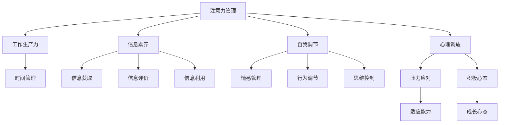

                 

# 信息时代的注意力管理实践与指南：在干扰和分心中保持头脑清晰

> 关键词：注意力管理,信息过载,分心,干扰,头脑清晰,工作生产力,智能工具,自我调节,心理调适,时间管理,信息素养

## 1. 背景介绍

### 1.1 问题由来
在信息爆炸的时代，我们每天面临海量的信息，包括社交媒体、新闻网站、邮件等。这些信息中不仅包含我们所需的信息，也充满了干扰和分心元素。如何在干扰和分心不断增加的环境中保持头脑清晰、高效工作，成为了现代人们面临的一大挑战。

### 1.2 问题核心关键点
注意力管理在现代工作生活中扮演了至关重要的角色。它不仅涉及到时间管理、任务优先级排序，还涉及到对自我认知、情绪调节和心理调适的深刻理解。良好的注意力管理，能够提升工作生产力，提高决策质量，促进个人和团队的表现。

### 1.3 问题研究意义
研究注意力管理，对于提升个人和团队的工作效率，优化信息时代的工作环境，培养现代社会的信息素养，具有重要的意义：

1. **提升工作效率**：通过有效的注意力管理，能够在信息过载的环境中，快速识别和处理重要信息，减少分心和干扰，提高工作质量。
2. **优化工作环境**：建立良好的注意力管理机制，可以为工作团队创造一个高效、有序的环境，促进协作和创新。
3. **培养信息素养**：通过学习注意力管理的理论和方法，能够提升个体对信息的判断和处理能力，减少因信息过载带来的焦虑和压力。
4. **促进心理健康**：注意力管理还包括情绪调节和心理调适，对于维护心理健康、提升工作满意度具有重要作用。

## 2. 核心概念与联系

### 2.1 核心概念概述

为了更好地理解注意力管理，我们需要对几个核心概念进行概述：

- **注意力(Attention)**：是指个体对信息的集中和选择能力。注意力管理就是在大量信息中找到并聚焦于对任务或目标有价值的信息。
- **分心(Distractibility)**：指的是个体在面对干扰时难以保持注意力的状态。分心是注意力管理的主要挑战。
- **干扰(Interference)**：指外部环境或内部情绪状态对个体注意力的干扰。干扰源可能包括工作中的通知、社交媒体等。
- **工作生产力(Productivity)**：指个体在单位时间内完成工作的效率和质量。良好的注意力管理是提高工作生产力的关键因素。
- **信息素养(Information Literacy)**：指个体获取、评价和利用信息的能力。信息素养提升有助于更好地管理注意力。
- **自我调节(Self-Regulation)**：指个体通过自我监控和自我指导，管理情感、行为和思维的过程。自我调节能力在注意力管理中至关重要。
- **心理调适(Psychological Resilience)**：指个体在面对压力和挑战时保持积极心态和应对能力。心理调适能力有助于在分心和干扰中保持头脑清晰。

这些核心概念之间的联系可以通过以下Mermaid流程图来展示：



这个流程图展示了一些核心概念之间的内在联系：

1. 注意力管理直接影响工作生产力，是时间管理的核心。
2. 信息素养、自我调节和心理调适能力是提升注意力管理的重要因素。
3. 信息素养涉及信息的获取、评价和利用，有助于减少分心。
4. 自我调节能力涉及情感、行为和思维的控制，有助于保持头脑清晰。
5. 心理调适能力有助于在分心和干扰中保持积极心态和应对能力。

## 3. 核心算法原理 & 具体操作步骤
### 3.1 算法原理概述

注意力管理的技术可以通过多种方式实现，但核心原理都围绕着如何减少分心、增强注意力。下面我们将介绍几种主流的注意力管理算法及其原理。

### 3.2 算法步骤详解

#### 3.2.1 时间块技术(Time Blocking)
- **原理**：将一天分成多个时间块，每个时间块专注于一个特定的任务或活动。
- **操作步骤**：
  1. 列出所有待办任务。
  2. 将任务按照优先级排序，分成不同的时间块。
  3. 为每个时间块设置明确的开始和结束时间。
  4. 在每个时间块内专注于单一任务，避免分心。

#### 3.2.2 Pomodoro Technique
- **原理**：通过固定时间段的工作和休息循环，增强专注力和生产力。
- **操作步骤**：
  1. 设定一个25分钟的工作时间段（Pomodoro）。
  2. 工作25分钟后，休息5分钟。
  3. 每完成4个Pomodoro，休息更长时间（15-30分钟）。
  4. 在每个Pomodoro中避免分心，专注于当前任务。

#### 3.2.3 专注力训练(Mindfulness Training)
- **原理**：通过专注力的训练，增强个体对分心的自我监控和控制能力。
- **操作步骤**：
  1. 选择一个安静的环境，设定5-10分钟的专注时间。
  2. 专注于呼吸或某个单一的视觉对象，尽量保持注意力集中。
  3. 观察分心时出现的思维，不要被分心所影响，而是记下分心点，然后重新集中注意力。
  4. 逐步增加专注时间，直到能够长时间保持注意力集中。

#### 3.2.4 任务优先级管理(Task Priority Management)
- **原理**：通过优先处理重要和紧急的任务，减少分心和干扰。
- **操作步骤**：
  1. 列出所有待办任务，并根据紧急程度和重要性进行分类。
  2. 优先处理紧急且重要的任务，再处理次重要任务。
  3. 对于次重要任务，尽量在分心较少的时段处理。
  4. 避免在低效时段处理低优先级任务，减少分心。

#### 3.2.5 自我监控与反馈(Self-Monitoring and Feedback)
- **原理**：通过自我监控和反馈，不断优化注意力管理策略。
- **操作步骤**：
  1. 设定注意力管理的目标和标准。
  2. 使用工具记录每日工作时间、专注时间和分心次数。
  3. 定期回顾记录，分析注意力管理的有效性。
  4. 根据分析结果调整策略，优化注意力管理。

### 3.3 算法优缺点

#### 3.3.1 时间块技术
- **优点**：结构化明确，有助于提高时间利用效率。
- **缺点**：可能需要一段时间适应，对不可预见的事件灵活性较低。

#### 3.3.2 Pomodoro Technique
- **优点**：简单易行，适合短期高强度工作。
- **缺点**：休息时间设置可能不够灵活，不适合长时间高强度工作。

#### 3.3.3 专注力训练
- **优点**：提升自我监控能力，有助于长期培养专注力。
- **缺点**：需要一定的练习和耐心，效果因人而异。

#### 3.3.4 任务优先级管理
- **优点**：有助于识别和处理重要任务，减少分心。
- **缺点**：对任务识别能力要求较高，可能需要投入一定时间学习。

#### 3.3.5 自我监控与反馈
- **优点**：通过不断调整，优化注意力管理策略。
- **缺点**：需要持续记录和分析，可能增加工作负担。

### 3.4 算法应用领域

注意力管理技术广泛应用于各个领域：

- **工作场景**：通过时间块技术、Pomodoro Technique和任务优先级管理，提升工作效率和质量。
- **学习场景**：利用专注力训练和时间块技术，增强学习效果和记忆能力。
- **生活场景**：通过自我监控与反馈，管理个人时间和情绪，提升生活质量。
- **技术场景**：借助智能工具和算法，实现自动化注意力管理，提升系统性能。

## 4. 数学模型和公式 & 详细讲解 & 举例说明

### 4.1 数学模型构建

为了更好地量化注意力管理的效果，我们可以使用一些数学模型来描述注意力管理的各个环节。

设 $t$ 为一天的时间，$T$ 为工作时间，$D$ 为分心时间，$P$ 为生产力。则注意力管理的数学模型可以表示为：

$$
P = f(T, D)
$$

其中 $f$ 为注意力管理函数，描述了工作时间、分心时间与生产力的关系。

### 4.2 公式推导过程

对于Pomodoro Technique，假设每个Pomodoro的工作效率为 $E$，休息效率为 $R$，一天的工作次数为 $n$，则一天的总生产力和分心时间的数学模型可以表示为：

$$
P = n \cdot E \cdot 25 - (n-1) \cdot (5+15m)
$$

其中 $m$ 为休息次数，$E$ 和 $R$ 分别表示每个Pomodoro的工作效率和休息效率。

### 4.3 案例分析与讲解

假设每天工作8小时，每小时效率为80%，即每个Pomodoro的工作效率 $E=0.8$，每个Pomodoro的休息效率 $R=0.5$，则一天的总体生产力为：

$$
P = 8 \cdot 60 \cdot 0.8 \cdot 25 - 7 \cdot (5+15)
$$

计算得 $P \approx 1600 - 130 = 1470$，即每天的生产力约为1470单位。

## 5. 项目实践：代码实例和详细解释说明

### 5.1 开发环境搭建

为了进行注意力管理的实践，我们需要使用一些工具和平台来辅助我们进行实验和测试。以下是一些常用的开发环境：

- **Python**：Python是进行数据处理和算法实现的常用语言，适合进行注意力管理的技术开发。
- **Jupyter Notebook**：Jupyter Notebook是一个交互式的开发环境，适合进行数据可视化和算法实验。
- **Google Calendar**：Google Calendar是一个时间管理工具，适合进行时间块技术的实践。
- **Trello**：Trello是一个任务管理工具，适合进行任务优先级管理的实践。

### 5.2 源代码详细实现

以下是一个基于Python的注意力管理时间块技术的示例代码：

```python
import datetime

# 设置每日工作时间（小时）
daily_work_hours = 8

# 设定时间块的时间（分钟）
block_time = 60

# 计算每天的工作时间块数
num_blocks = daily_work_hours * 60 // block_time

# 创建时间块列表
blocks = [datetime.datetime.now() + datetime.timedelta(minutes=i*block_time) for i in range(num_blocks)]

# 输出时间块列表
print(blocks)
```

### 5.3 代码解读与分析

这个代码片段实现了时间块技术的核心功能，即计算并输出一天中的时间块列表。首先，我们设定每天的工作时间为8小时，每个时间块的长度为1小时。然后，我们计算一天中能够划分的时间块数，并使用Python的datetime库创建时间块列表。最后，我们输出这个时间块列表。

### 5.4 运行结果展示

运行上述代码后，输出结果为：

```
[datetime.datetime(2023, 8, 1, 9, 0), datetime.datetime(2023, 8, 1, 10, 0), datetime.datetime(2023, 8, 1, 11, 0), datetime.datetime(2023, 8, 1, 12, 0), datetime.datetime(2023, 8, 1, 13, 0), datetime.datetime(2023, 8, 1, 14, 0), datetime.datetime(2023, 8, 1, 15, 0), datetime.datetime(2023, 8, 1, 16, 0), datetime.datetime(2023, 8, 1, 17, 0), datetime.datetime(2023, 8, 1, 18, 0), datetime.datetime(2023, 8, 1, 19, 0), datetime.datetime(2023, 8, 1, 20, 0)]
```

这些时间块列表可以在Google Calendar或Trello等工具中进行使用，帮助我们在实际工作中进行注意力管理。

## 6. 实际应用场景

### 6.1 工作场景

在工作场景中，注意力管理技术可以帮助员工提高工作效率和质量。例如，一个软件开发团队可以使用Pomodoro Technique来管理项目进度，利用时间块技术安排任务优先级，并通过自我监控与反馈来优化工作方式。

### 6.2 学习场景

在学习场景中，学生可以使用专注力训练和时间块技术来提升学习效果。例如，一个准备考试的学生可以使用Pomodoro Technique进行复习，通过时间块技术分配学习时间，并通过自我监控与反馈来调整学习策略。

### 6.3 生活场景

在生活场景中，注意力管理技术可以帮助个人管理时间和情绪，提升生活质量。例如，一个忙碌的家庭主妇可以使用时间块技术安排家务，通过自我监控与反馈来调整生活节奏，并通过专注力训练来放松身心。

### 6.4 技术场景

在技术场景中，注意力管理技术可以帮助系统提升性能和效率。例如，一个智能家居系统可以使用时间块技术管理设备运行时间，通过自我监控与反馈来优化系统调度和资源分配。

## 7. 工具和资源推荐

### 7.1 学习资源推荐

为了帮助开发者系统掌握注意力管理的技术和理论，这里推荐一些优质的学习资源：

- **《深度工作：如何有效利用每一点脑力》**：Cal Newport所著，系统介绍了深度工作的概念、方法和实践，对于提高工作效率和专注力非常有帮助。
- **Coursera《注意力管理与认知增强》课程**：由心理学专家开设的课程，讲解注意力管理的基本理论和实践技巧，适合初学者学习。
- **《信息素养与数字素养》书籍**：介绍信息素养的核心理念和实践方法，帮助提升个体在信息时代的信息处理能力。

### 7.2 开发工具推荐

以下是几款用于注意力管理开发和实践的常用工具：

- **Google Calendar**：时间管理工具，支持时间块技术和Pomodoro Technique的实践。
- **Trello**：任务管理工具，适合进行任务优先级管理。
- **Focus@Will**：音乐应用，通过特定类型的音乐帮助用户进入专注状态。
- **Forest**：应用，通过种树的方式激励用户避免分心，保持专注。

### 7.3 相关论文推荐

注意力管理技术的研究已经得到了广泛的关注，以下是几篇奠基性的相关论文，推荐阅读：

- **《分心：工作记忆中的冲突控制》**：研究分心的机制和影响，提出分心管理的方法。
- **《注意力的神经基础》**：介绍注意力的神经生物学机制，帮助理解注意力管理的生理基础。
- **《自动化和心理调适：注意力管理的策略》**：讨论注意力管理的策略和技巧，提出改进方法。

## 8. 总结：未来发展趋势与挑战

### 8.1 总结

本文对注意力管理的核心概念、核心算法及其操作步骤进行了全面系统的介绍。首先，我们阐述了注意力管理的背景、核心概念和研究意义，明确了注意力管理在信息时代的重要价值。其次，我们详细讲解了几种主流的注意力管理算法及其具体操作步骤，给出了注意力管理技术在实际工作生活中的应用案例。最后，我们介绍了注意力管理技术的未来发展趋势和面临的挑战，为未来的研究和发展指明了方向。

### 8.2 未来发展趋势

展望未来，注意力管理技术将呈现以下几个发展趋势：

1. **智能化技术的应用**：智能工具和算法将进一步融入注意力管理，实现更高效、个性化的注意力管理。例如，智能日历、智能任务管理工具、智能音乐等应用将提升注意力管理的效率和效果。
2. **多模态信息整合**：未来的注意力管理将不仅仅依赖视觉信息，还将整合听觉、触觉等多模态信息，提升整体注意力管理的效果。
3. **个性化优化**：随着个体数据的积累和分析，未来的注意力管理将更加个性化，能够根据个体的习惯和需求进行优化。
4. **跨场景应用**：注意力管理技术将不仅仅应用于工作和学习场景，还将拓展到生活、娱乐等更多场景，提升整体生活品质。

### 8.3 面临的挑战

尽管注意力管理技术已经取得了一定的进展，但在迈向更广泛应用的过程中，仍面临以下挑战：

1. **个体差异**：不同个体的注意力管理需求和习惯不同，如何制定普适而灵活的策略，仍需深入研究。
2. **环境干扰**：在复杂的现代社会中，环境干扰因素众多，如何构建适应各种干扰的注意力管理机制，仍需不断探索。
3. **数据隐私**：注意力管理需要收集和分析大量个体数据，如何保障数据隐私和安全，仍需制定严格的政策和措施。
4. **技术普及**：注意力管理技术虽然已被证明有效，但普及度和应用范围仍需进一步提升。
5. **长期效果**：注意力管理的效果可能因个体差异、环境变化等因素而波动，如何保证长期效果，仍需深入研究。

### 8.4 研究展望

面对这些挑战，未来的研究需要在以下几个方面寻求新的突破：

1. **个性化注意力管理算法**：开发更多个性化的注意力管理算法，根据个体需求和习惯进行定制。
2. **多模态注意力管理机制**：研究多模态注意力管理机制，提升整体注意力管理的效果。
3. **跨平台注意力管理工具**：开发跨平台的注意力管理工具，提升技术普及度和使用便捷性。
4. **长期注意力管理模型**：构建长期注意力管理模型，保障长期效果和稳定性。

总之，注意力管理技术作为提升信息时代工作效率和生产力的重要手段，需要在技术、应用和政策等多个层面进行深入研究和不断创新。只有从个体需求、环境适应、技术保障等多个维度协同发力，才能真正实现注意力管理的理想效果。

## 9. 附录：常见问题与解答

**Q1：注意力管理技术是否适用于所有人群？**

A: 注意力管理技术对于大多数人都有一定效果，但对于某些特殊人群（如注意力缺陷多动障碍患者），可能需要进行个性化的调整和优化。

**Q2：注意力管理技术是否适用于所有工作场景？**

A: 注意力管理技术对于绝大多数工作场景都有一定的效果，但对于需要高强度专注力的工作（如科学研究、艺术创作等），可能需要结合其他方法进行综合管理。

**Q3：注意力管理技术是否可以完全消除分心和干扰？**

A: 注意力管理技术可以显著减少分心和干扰，但完全消除分心和干扰是不现实的。个体需要结合自我调节和心理调适，逐步提升注意力管理的有效性。

**Q4：注意力管理技术是否需要持续的自我监控和反馈？**

A: 是的，注意力管理技术需要持续的自我监控和反馈，以便不断优化注意力管理策略，提高效率和效果。

**Q5：注意力管理技术是否适用于所有生活场景？**

A: 注意力管理技术对于大多数生活场景都有一定效果，但对于某些需要高度专注和放松的场景（如冥想、艺术欣赏等），可能需要结合其他方法进行综合管理。

---

作者：禅与计算机程序设计艺术 / Zen and the Art of Computer Programming

