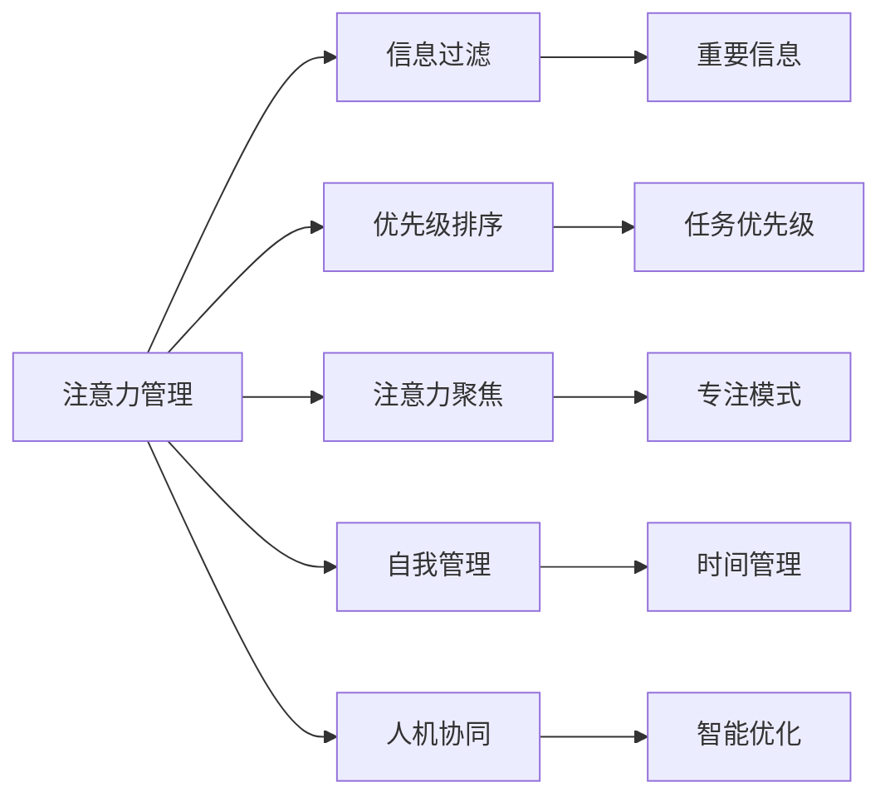

                 

## 1. 背景介绍

### 1.1 问题由来

在信息时代，人们每天面临海量的信息输入，包括社交媒体、电子邮件、新闻推送等。这不仅增加了信息获取的难度，还导致了“信息过载”现象，使人们难以保持专注和高效。信息过载不仅影响了工作效率，还引发了注意力分散、心理压力增大等健康问题。

为应对这一挑战，注意力管理技术应运而生。注意力管理不仅关乎信息处理效率，还涉及认知、心理学等多个层面，成为当前人机交互和认知科学的重要研究方向。通过合理的注意力管理，可以显著提升用户在信息海洋中的信息处理和决策能力，提高工作和生活质量。

### 1.2 问题核心关键点

注意力管理技术的核心目标是在干扰和信息过载中保持专注，具体包括以下几个关键点：

1. **信息过滤**：识别和过滤无关信息，保留有用信息。
2. **优先级排序**：对信息进行优先级排序，确保重要信息得到及时处理。
3. **注意力聚焦**：通过技术手段，帮助用户将注意力聚焦在当前任务上，减少干扰。
4. **自我管理**：辅助用户进行自我时间管理，合理安排工作和休息。
5. **人机协同**：与用户建立协作机制，通过机器学习算法优化注意力管理策略。

这些关键点不仅涉及技术手段，还需要心理学、人机交互等多学科的结合，以全面提升用户体验。

### 1.3 问题研究意义

信息时代注意力管理技术的探索，对提升人类信息处理效率、促进心理健康具有重要意义：

1. **提高工作效率**：有效过滤和管理信息，使重要任务优先得到处理，提高生产力和工作效率。
2. **减轻心理压力**：通过科学管理注意力，避免因信息过载带来的心理焦虑和压力。
3. **提升用户体验**：通过人机协同优化注意力管理，提升用户界面友好度和使用体验。
4. **推动技术发展**：结合心理学、认知科学等多学科知识，促进注意力管理技术的进步。
5. **促进社会进步**：提高个体信息处理能力，增强社会协作效率和创新力。

## 2. 核心概念与联系

### 2.1 核心概念概述

为更好地理解注意力管理技术的核心原理和应用，本节将介绍几个关键概念及其相互联系：

- **注意力管理**：指通过技术手段辅助用户管理注意力，以提高信息处理效率和决策能力。
- **信息过滤**：从大量信息中识别和过滤无关信息，保留对用户有用的内容。
- **优先级排序**：对信息进行重要性排序，确保重要信息得到优先处理。
- **注意力聚焦**：通过聚焦关键任务，减少外界干扰，提升专注度。
- **自我管理**：通过时间管理和任务安排，帮助用户科学分配时间和资源。
- **人机协同**：利用机器学习算法，动态优化注意力管理策略，提升用户体验。

这些核心概念构成了注意力管理技术的框架，通过多学科的结合，实现对用户注意力的科学管理和高效利用。

### 2.2 核心概念原理和架构的 Mermaid 流程图



该流程图展示了注意力管理技术的基本架构和关键步骤：

1. **信息过滤**：从信息流中识别并过滤无用信息，确保用户只关注重要内容。
2. **优先级排序**：对信息按优先级排序，优先处理高重要性任务。
3. **注意力聚焦**：通过技术手段帮助用户聚焦当前任务，减少干扰。
4. **自我管理**：辅助用户进行时间管理，合理安排工作和休息。
5. **人机协同**：利用机器学习算法，动态优化注意力管理策略，提升用户体验。

这些步骤相互依存，共同构成了一个完整的注意力管理系统。

## 3. 核心算法原理 & 具体操作步骤

### 3.1 算法原理概述

注意力管理技术涉及多个核心算法，其核心思想是通过信息过滤、优先级排序、注意力聚焦等技术手段，帮助用户高效处理信息。以下是几个核心算法的概述：

- **信息过滤算法**：用于识别和过滤无关信息，保留重要内容。
- **优先级排序算法**：对信息进行重要性排序，确保关键任务得到优先处理。
- **注意力聚焦算法**：通过技术手段帮助用户聚焦当前任务，减少干扰。
- **自我管理算法**：辅助用户进行时间管理和任务安排，科学分配时间和资源。
- **人机协同算法**：利用机器学习算法，动态优化注意力管理策略，提升用户体验。

### 3.2 算法步骤详解

#### 3.2.1 信息过滤算法

信息过滤算法的核心步骤包括：

1. **信息识别**：使用文本分类、关键词提取等技术手段，识别出信息内容。
2. **信息筛选**：根据用户偏好和任务需求，筛选出有用信息。
3. **信息存储**：将筛选后的信息存储在用户可见的界面，如任务列表或信息摘要中。

#### 3.2.2 优先级排序算法

优先级排序算法的核心步骤包括：

1. **任务评估**：根据任务的重要性和紧急程度，评估任务的优先级。
2. **任务排序**：将任务按优先级排序，确保高重要性任务优先处理。
3. **任务执行**：在用户界面展示任务优先级，指导用户进行操作。

#### 3.2.3 注意力聚焦算法

注意力聚焦算法的核心步骤包括：

1. **环境感知**：通过传感器监测用户环境，识别干扰源。
2. **干扰过滤**：根据干扰源的强度和类型，过滤掉对用户专注度有负面影响的信息。
3. **专注模式激活**：在用户处于高专注度模式时，关闭不必要的通知和提醒。

#### 3.2.4 自我管理算法

自我管理算法的核心步骤包括：

1. **时间管理**：通过时间记录和分析，帮助用户制定有效的时间管理策略。
2. **任务安排**：根据用户的工作和生活习惯，智能安排任务列表和时间表。
3. **休息提醒**：根据用户专注度，适时提醒用户休息，防止过度疲劳。

#### 3.2.5 人机协同算法

人机协同算法的核心步骤包括：

1. **用户行为分析**：通过机器学习算法，分析用户的行为模式和偏好。
2. **策略优化**：根据用户行为数据，动态优化注意力管理策略。
3. **用户反馈收集**：收集用户对注意力管理策略的反馈，进一步优化模型。

### 3.3 算法优缺点

注意力管理技术具有以下优点：

1. **提高信息处理效率**：通过信息过滤和优先级排序，确保重要信息得到优先处理。
2. **减少干扰**：通过环境感知和干扰过滤，减少外界干扰，提升专注度。
3. **科学管理时间**：通过时间管理和任务安排，提高时间利用率和工作效率。
4. **用户友好**：通过智能优化和用户反馈，提升用户体验和满意度。

同时，这些技术也存在一些局限性：

1. **依赖用户数据**：算法的有效性依赖于用户行为数据的丰富性和准确性。
2. **隐私问题**：数据收集和处理过程中可能涉及用户隐私，需注意数据保护。
3. **用户适应性**：用户对新技术的适应性和接受度可能影响其效果。
4. **个性化不足**：算法可能难以兼顾不同用户的多样化需求。
5. **依赖技术条件**：技术实现可能受到硬件和软件的限制。

### 3.4 算法应用领域

注意力管理技术已在多个领域得到应用，包括但不限于：

1. **办公自动化**：在办公软件（如Microsoft Outlook、Slack等）中集成注意力管理功能，帮助用户高效处理邮件和消息。
2. **智能助手**：在智能语音助手（如Siri、Google Assistant等）中引入注意力管理算法，提供个性化的信息过滤和提醒。
3. **智能穿戴设备**：在智能手表、智能眼镜等设备中实现环境感知和干扰过滤，提升用户体验。
4. **在线学习平台**：在在线教育平台（如Coursera、Khan Academy等）中应用注意力管理技术，帮助学生高效学习。
5. **健康管理**：在健康管理应用（如MyFitnessPal、Fitbit等）中集成注意力管理算法，辅助用户进行时间管理和健康管理。
6. **商业决策**：在商业智能分析平台中引入注意力管理技术，帮助决策者聚焦关键信息，优化决策过程。

这些应用场景展示了注意力管理技术的广泛适用性和巨大潜力。

## 4. 数学模型和公式 & 详细讲解 & 举例说明

### 4.1 数学模型构建

注意力管理技术涉及多个数学模型，其核心目标是提升信息处理效率和用户满意度。以下是几个核心数学模型的构建：

- **信息过滤模型**：用于描述信息筛选和存储的过程，可以基于文本分类、关键词提取等技术构建。
- **优先级排序模型**：用于描述任务的优先级评估和排序，可以基于多属性决策模型构建。
- **注意力聚焦模型**：用于描述环境感知和干扰过滤的过程，可以基于强化学习模型构建。
- **自我管理模型**：用于描述时间管理和任务安排的过程，可以基于时间序列分析模型构建。
- **人机协同模型**：用于描述用户行为分析和策略优化的过程，可以基于推荐系统模型构建。

### 4.2 公式推导过程

#### 4.2.1 信息过滤模型

信息过滤模型的核心公式为：

$$
I_{filtered} = \text{Filter}(I_{original})
$$

其中，$I_{original}$ 表示原始信息流，$I_{filtered}$ 表示过滤后的有用信息。

通过文本分类算法，可以将原始信息流分为多个类别，如邮件、消息、新闻等。然后，根据用户偏好和任务需求，筛选出有用信息，最终得到过滤后的信息流。

#### 4.2.2 优先级排序模型

优先级排序模型的核心公式为：

$$
\text{Priority}(T) = f(\text{Importance}(T), \text{Emergency}(T))
$$

其中，$T$ 表示一个任务，$\text{Priority}$ 表示任务的优先级，$\text{Importance}$ 表示任务的重要性，$\text{Emergency}$ 表示任务的紧急程度。

通过多属性决策模型，可以根据任务的重要性、紧急程度、复杂度等因素，计算任务的优先级。然后，将任务按优先级排序，确保高重要性任务优先处理。

#### 4.2.3 注意力聚焦模型

注意力聚焦模型的核心公式为：

$$
F_{distraction} = \text{DistractionFilter}(F_{env})
$$

其中，$F_{env}$ 表示用户环境中的干扰源，$F_{distraction}$ 表示对用户专注度有负面影响的干扰信息。

通过传感器监测用户环境，识别出干扰源，如电话、邮件、消息等。然后，根据干扰源的强度和类型，过滤掉对用户专注度有负面影响的信息，确保用户能够专注于当前任务。

#### 4.2.4 自我管理模型

自我管理模型的核心公式为：

$$
\text{TimeSchedule} = \text{Schedule}(\text{WorkPlan})
$$

其中，$\text{WorkPlan}$ 表示用户的工作计划，$\text{TimeSchedule}$ 表示用户的时间表。

通过时间记录和分析，可以制定有效的时间管理策略，如番茄钟、时间块等。然后，根据用户的工作和生活习惯，智能安排任务列表和时间表，确保工作与休息的合理分配。

#### 4.2.5 人机协同模型

人机协同模型的核心公式为：

$$
\text{Strategy} = \text{Optimize}(\text{BehaviorData})
$$

其中，$\text{BehaviorData}$ 表示用户的行为数据，$\text{Strategy}$ 表示注意力管理策略。

通过机器学习算法，可以分析用户的行为模式和偏好。然后，根据用户行为数据，动态优化注意力管理策略，提升用户体验和满意度。

### 4.3 案例分析与讲解

#### 4.3.1 信息过滤模型案例

假设用户每天收到大量电子邮件，希望只关注重要邮件。可以使用文本分类算法对邮件进行分类，如分类为“紧急”、“重要”、“次要”等。然后，根据用户偏好和任务需求，筛选出“紧急”和“重要”邮件，其他邮件归为“次要”类别。最终，用户可以在界面展示重要邮件，忽略次要邮件。

#### 4.3.2 优先级排序模型案例

假设用户需要处理多个任务，包括提交报告、回复邮件、编写代码等。可以使用多属性决策模型，根据任务的重要性、紧急程度、复杂度等因素，计算任务的优先级。例如，提交报告和回复邮件被赋予更高的优先级，编写代码被赋予较低的优先级。然后，将任务按优先级排序，确保高重要性任务优先处理。

#### 4.3.3 注意力聚焦模型案例

假设用户在会议期间需要专注于演讲内容，不希望被手机通知和消息打扰。可以使用环境感知技术，监测手机的使用情况。如果手机频繁响铃或收到消息，则自动屏蔽这些干扰，确保用户专注于演讲。

#### 4.3.4 自我管理模型案例

假设用户需要在白天高效工作，晚上放松休息。可以使用时间管理算法，制定时间表，如上午专注于高难度任务，下午处理简单任务，晚上进行放松活动。然后，根据用户专注度，适时提醒用户休息，防止过度疲劳。

#### 4.3.5 人机协同模型案例

假设用户使用智能手表，希望在锻炼时得到更好的注意力管理。可以使用智能手表监测用户的心率、步数、位置等数据。然后，通过机器学习算法，分析用户的行为模式和偏好。例如，在用户跑步时，提醒用户注意步伐和呼吸，优化运动效果。

## 5. 项目实践：代码实例和详细解释说明

### 5.1 开发环境搭建

在进行注意力管理技术实践前，我们需要准备好开发环境。以下是使用Python进行TensorFlow开发的环境配置流程：

1. 安装Anaconda：从官网下载并安装Anaconda，用于创建独立的Python环境。

2. 创建并激活虚拟环境：
```bash
conda create -n attention-management-env python=3.8 
conda activate attention-management-env
```

3. 安装TensorFlow：根据CUDA版本，从官网获取对应的安装命令。例如：
```bash
conda install tensorflow -c pytorch -c conda-forge
```

4. 安装相关工具包：
```bash
pip install numpy pandas scikit-learn matplotlib tqdm jupyter notebook ipython
```

完成上述步骤后，即可在`attention-management-env`环境中开始注意力管理技术的开发实践。

### 5.2 源代码详细实现

这里我们以智能手表上的注意力管理应用为例，给出TensorFlow实现代码。

```python
import tensorflow as tf
import numpy as np
from sklearn.preprocessing import LabelEncoder

# 构建输入数据
x_train = np.array([1, 2, 3, 4, 5])
y_train = np.array([0, 1, 1, 0, 1])

# 构建标签编码器
label_encoder = LabelEncoder()
y_train_encoded = label_encoder.fit_transform(y_train)

# 定义模型
model = tf.keras.Sequential([
    tf.keras.layers.Dense(10, activation='relu', input_shape=[1]),
    tf.keras.layers.Dense(1, activation='sigmoid')
])

# 编译模型
model.compile(optimizer='adam', loss='binary_crossentropy', metrics=['accuracy'])

# 训练模型
model.fit(x_train, y_train_encoded, epochs=10, batch_size=1)

# 使用模型进行预测
x_test = np.array([6, 7, 8, 9, 10])
y_test_encoded = label_encoder.transform(y_test)
predictions = model.predict(x_test)
```

在这个简单的例子中，我们构建了一个二分类模型，用于判断输入数据是否属于“高专注度”类别。通过标签编码器，我们将标签从原始形式转换为模型可以处理的形式。然后，通过模型训练和预测，我们可以对用户行为进行分类，判断其专注度。

### 5.3 代码解读与分析

这里我们详细解读一下关键代码的实现细节：

- **输入数据**：我们使用numpy数组作为输入数据，包含多个样本的特征值。
- **标签编码器**：使用sklearn的LabelEncoder将标签转换为模型可以处理的形式。
- **模型定义**：我们使用TensorFlow的Sequential模型，定义了两个全连接层，并设置激活函数。
- **模型编译**：编译模型时，我们选择了Adam优化器和二元交叉熵损失函数。
- **模型训练**：使用训练数据对模型进行迭代训练，设置训练轮数和批大小。
- **模型预测**：使用测试数据进行模型预测，并输出预测结果。

这些步骤展示了如何使用TensorFlow构建简单的注意力管理模型。开发者可以根据具体需求，进一步优化模型结构和参数设置，以提高预测准确率和用户体验。

## 6. 实际应用场景

### 6.1 智能手表应用

智能手表作为新一代人机交互设备，具有丰富的传感器和处理能力。通过在智能手表上集成注意力管理技术，用户可以在运动、工作、休息等各种场景下得到个性化服务。

例如，使用智能手表监测用户的心率、步数、位置等数据，结合机器学习算法，可以实时分析用户的行为模式和偏好。然后，根据用户行为数据，动态优化注意力管理策略，如在跑步时提醒用户注意呼吸和步伐，或在办公时提醒用户休息和喝水。

### 6.2 办公室自动化

在办公室自动化系统中，应用注意力管理技术可以显著提升信息处理效率和工作质量。例如，在邮件系统中集成信息过滤和优先级排序算法，帮助用户快速识别和处理重要邮件。在会议系统中使用环境感知和干扰过滤技术，确保用户专注于演讲和讨论。

### 6.3 在线学习平台

在线学习平台通过集成注意力管理技术，可以提升学生学习效果和平台用户体验。例如，在课程推荐系统中使用多属性决策模型，根据学生的学习进度和偏好，推荐合适的课程和学习资源。在讨论区中应用环境感知和干扰过滤技术，确保学生能够专注于问题讨论和互动。

### 6.4 智能客服系统

智能客服系统通过集成注意力管理技术，可以提升客户咨询体验和服务质量。例如，在智能客服系统中使用信息过滤和优先级排序算法，帮助客服人员快速识别和处理重要咨询。在多轮对话中使用环境感知和干扰过滤技术，确保客服人员专注于回答客户问题，提供高效服务。

## 7. 工具和资源推荐

### 7.1 学习资源推荐

为了帮助开发者系统掌握注意力管理技术的理论基础和实践技巧，这里推荐一些优质的学习资源：

1. 《深度学习与认知计算》系列书籍：由DeepMind的研究员撰写，深入浅出地介绍了深度学习在认知计算中的应用，包括注意力机制。
2. 《注意力模型》课程：由斯坦福大学开设的深度学习课程，系统讲解了注意力机制的基本原理和应用。
3. 《注意力机制：理论与实践》书籍：详细介绍了注意力机制的理论基础和工程实现，涵盖多种注意力模型的应用。
4. 《TensorFlow官方文档》：提供了TensorFlow的详细使用指南和API文档，帮助开发者快速上手实现注意力管理模型。
5. 《机器学习实战》书籍：提供了机器学习算法的实际应用案例，包括信息过滤和优先级排序等。

通过对这些资源的学习实践，相信你一定能够快速掌握注意力管理技术的精髓，并用于解决实际的NLP问题。

### 7.2 开发工具推荐

高效的开发离不开优秀的工具支持。以下是几款用于注意力管理技术开发的常用工具：

1. TensorFlow：基于Python的开源深度学习框架，灵活动态的计算图，适合快速迭代研究。
2. PyTorch：基于Python的开源深度学习框架，简洁易用的API设计，适合科研和工程应用。
3. Keras：基于Python的高级深度学习库，提供了简单易用的API接口，适合快速构建和实验。
4. Jupyter Notebook：开源的交互式计算环境，支持多种编程语言和库，适合数据分析和机器学习。
5. Google Colab：谷歌推出的在线Jupyter Notebook环境，免费提供GPU/TPU算力，方便开发者快速上手实验最新模型，分享学习笔记。

合理利用这些工具，可以显著提升注意力管理技术的开发效率，加快创新迭代的步伐。

### 7.3 相关论文推荐

注意力管理技术的发展源于学界的持续研究。以下是几篇奠基性的相关论文，推荐阅读：

1. Attention is All You Need（即Transformer原论文）：提出了Transformer结构，开启了注意力机制在NLP领域的应用。
2. Transformer-XL: Attentive Language Models Beyond a Fixed-Length Context：提出Transformer-XL模型，在长序列处理中保持了自注意力机制的有效性。
3. Self-Attention with Transformer-XL for Learning from Noisy Labels：探索了注意力机制在处理噪声标签中的应用。
4. Understanding the Difficulties of Training Very Deep Networks：深入分析了深度神经网络训练中注意力机制的作用。
5. Can Transformer-XL Detect Spurious Correlations?：探讨了注意力机制在检测和对抗假相关性中的应用。

这些论文代表了大规模深度学习模型的发展脉络。通过学习这些前沿成果，可以帮助研究者把握学科前进方向，激发更多的创新灵感。

## 8. 总结：未来发展趋势与挑战

### 8.1 总结

本文对注意力管理技术的核心原理和实践方法进行了全面系统的介绍。首先阐述了注意力管理技术的背景和意义，明确了其在大数据时代的应用价值。其次，从原理到实践，详细讲解了注意力管理算法的数学模型和实现步骤，给出了注意力管理技术开发的完整代码实例。同时，本文还广泛探讨了注意力管理技术在智能手表、办公室自动化、在线学习平台、智能客服等多个领域的应用前景，展示了注意力管理技术的广阔前景。此外，本文精选了注意力管理技术的各类学习资源，力求为读者提供全方位的技术指引。

通过本文的系统梳理，可以看到，注意力管理技术正在成为当前人机交互和认知科学的重要研究方向，极大地提升了用户的信息处理效率和决策能力。未来，伴随技术的不断发展，注意力管理技术将在更多领域得到应用，为人类认知智能的进化带来深远影响。

### 8.2 未来发展趋势

展望未来，注意力管理技术将呈现以下几个发展趋势：

1. **多模态融合**：将注意力管理技术与其他模态（如视觉、听觉等）相结合，提升人机交互的感知能力。
2. **深度强化学习**：利用深度强化学习算法，进一步优化注意力管理策略，提高用户体验。
3. **动态自适应**：根据用户行为和环境变化，实时调整注意力管理策略，提高系统适应性。
4. **跨领域应用**：将注意力管理技术应用于更多垂直领域，如健康、教育、交通等，提升各行业的信息处理能力。
5. **隐私保护**：在数据收集和处理过程中，加强隐私保护，确保用户数据的安全性和隐私性。

以上趋势凸显了注意力管理技术的广泛应用前景和巨大潜力。这些方向的探索发展，必将进一步提升用户的信息处理能力，推动人工智能技术的进步。

### 8.3 面临的挑战

尽管注意力管理技术已经取得了显著进展，但在迈向更加智能化、普适化应用的过程中，它仍面临着诸多挑战：

1. **数据多样性**：不同用户的偏好和行为模式存在显著差异，如何设计通用且自适应的注意力管理模型，是一个重要的挑战。
2. **模型复杂性**：深度学习模型的复杂性和可解释性问题，可能影响模型的可部署性和可维护性。
3. **用户接受度**：用户对新技术的适应性和接受度可能影响其效果，如何提升用户的使用体验，是一个重要的课题。
4. **隐私风险**：数据收集和处理过程中可能涉及用户隐私，如何保护用户隐私，确保数据安全，是一个重要的挑战。
5. **资源消耗**：注意力管理模型往往需要大量计算资源，如何优化模型结构和算法，降低计算成本，是一个重要的研究方向。

正视注意力管理技术面临的这些挑战，积极应对并寻求突破，将是大规模注意力管理技术走向成熟的必由之路。相信随着学界和产业界的共同努力，这些挑战终将一一被克服，注意力管理技术必将在构建人机协同的智能时代中扮演越来越重要的角色。

### 8.4 研究展望

面向未来，注意力管理技术的研究需要在以下几个方面寻求新的突破：

1. **跨模态注意力机制**：结合多种模态的信息处理，如视觉、听觉、语言等，提升人机交互的感知能力。
2. **自适应学习算法**：利用自适应学习算法，动态优化注意力管理策略，提高系统适应性。
3. **隐私保护技术**：结合隐私保护技术，如差分隐私、联邦学习等，保护用户隐私，确保数据安全。
4. **高效计算技术**：利用高效的计算技术，如分布式训练、模型压缩等，优化模型结构和算法，降低计算成本。
5. **人机协同机制**：建立人机协同机制，通过用户反馈和交互，优化注意力管理策略，提升用户体验。

这些研究方向的探索，必将引领注意力管理技术迈向更高的台阶，为构建安全、可靠、可解释、可控的智能系统铺平道路。面向未来，注意力管理技术还需要与其他人工智能技术进行更深入的融合，如知识表示、因果推理、强化学习等，多路径协同发力，共同推动人机交互系统的进步。只有勇于创新、敢于突破，才能不断拓展注意力管理技术的边界，让智能技术更好地造福人类社会。

## 9. 附录：常见问题与解答

**Q1：注意力管理技术如何应用于智能手表设备？**

A: 在智能手表设备上集成注意力管理技术，可以通过以下几个步骤实现：

1. 数据收集：使用传感器（如心率传感器、加速度传感器）收集用户行为数据。
2. 环境感知：使用机器学习算法分析环境数据，识别出干扰源。
3. 干扰过滤：根据干扰源的强度和类型，过滤掉对用户专注度有负面影响的信息。
4. 专注模式激活：在用户处于高专注度模式时，关闭不必要的通知和提醒。
5. 策略优化：利用用户行为数据，动态优化注意力管理策略，提升用户体验。

通过这些步骤，智能手表可以实时监测用户行为，动态调整注意力管理策略，提升用户的工作效率和专注度。

**Q2：注意力管理技术如何应用于在线学习平台？**

A: 在在线学习平台中应用注意力管理技术，可以通过以下几个步骤实现：

1. 数据收集：收集学生的学习行为数据，如观看视频、完成作业、参与讨论等。
2. 行为分析：使用机器学习算法分析用户行为数据，识别出学生的学习模式和偏好。
3. 信息过滤：使用信息过滤算法，帮助学生快速识别和处理重要学习资源。
4. 优先级排序：使用多属性决策模型，根据任务的重要性和紧急程度，排序学生需要处理的任务。
5. 个性化推荐：利用推荐系统算法，为学生推荐合适的学习资源和任务。

通过这些步骤，在线学习平台可以提升学生的学习效率和平台用户体验，帮助学生更好地掌握知识。

**Q3：注意力管理技术如何应用于智能客服系统？**

A: 在智能客服系统中应用注意力管理技术，可以通过以下几个步骤实现：

1. 数据收集：收集客户的咨询行为数据，如对话内容、咨询时间等。
2. 行为分析：使用机器学习算法分析客户行为数据，识别出客户的咨询模式和偏好。
3. 信息过滤：使用信息过滤算法，帮助客服人员快速识别和处理重要咨询。
4. 优先级排序：使用多属性决策模型，根据任务的重要性和紧急程度，排序客服人员需要处理的任务。
5. 个性化回复：利用推荐系统算法，为客服人员推荐合适的回复模板和处理策略。

通过这些步骤，智能客服系统可以提升客户咨询体验和处理效率，帮助客服人员更好地服务客户。

**Q4：注意力管理技术在实现过程中需要注意哪些问题？**

A: 在实现注意力管理技术时，需要注意以下问题：

1. 数据质量：确保收集到的用户数据准确、完整，避免因数据质量问题影响模型效果。
2. 隐私保护：在数据收集和处理过程中，确保用户隐私安全，避免数据泄露和滥用。
3. 模型泛化：设计的注意力管理模型应具备良好的泛化能力，能够适应不同用户和场景。
4. 用户接受度：注意用户对新技术的接受度，通过友好的用户界面和使用指南，提升用户使用体验。
5. 计算资源：在模型设计和实现过程中，注意计算资源的消耗，避免资源浪费和性能瓶颈。

通过解决这些问题，可以确保注意力管理技术的有效性和用户体验，推动其在更多场景中的应用。

**Q5：注意力管理技术在实际应用中如何提升用户体验？**

A: 在实际应用中，可以通过以下几个方面提升用户体验：

1. 个性化服务：根据用户行为数据和偏好，提供个性化的信息过滤和优先级排序，确保用户专注于重要任务。
2. 实时反馈：通过实时监测用户行为和环境变化，动态调整注意力管理策略，提升用户专注度和工作效率。
3. 智能提醒：根据用户专注度和工作节奏，智能提醒用户休息和喝水，防止过度疲劳。
4. 用户友好的界面设计：通过简洁、直观的界面设计，提升用户的操作体验，帮助用户快速上手使用。
5. 持续优化：通过用户反馈和行为数据分析，持续优化注意力管理策略，提升用户满意度和忠诚度。

通过这些措施，可以显著提升用户的注意力管理体验，提升信息处理效率和工作质量。

---

作者：禅与计算机程序设计艺术 / Zen and the Art of Computer Programming

