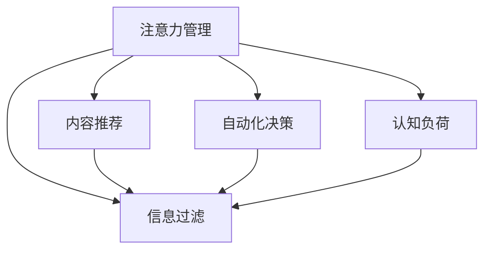

                 

# 信息时代的注意力管理策略与实践：在干扰和信息过载中航行

在信息爆炸的时代，人们每天都被大量信息所包围，而注意力作为一种有限的心理资源，正面临着前所未有的挑战。如何有效管理注意力，提高信息处理效率，是每个信息工作者和智能系统需要认真思考的问题。本文将从注意力管理的核心概念、策略和实践出发，探讨在信息过载和干扰环境中，如何通过技术手段提升注意力管理能力。

## 1. 背景介绍

### 1.1 问题由来
随着互联网的普及和数字技术的快速发展，人类获取信息的途径和方式发生了翻天覆地的变化。传统的新闻、书籍、电视等媒介逐渐被各种社交媒体、搜索引擎、在线论坛、即时通讯工具等所取代。这些新型信息获取渠道在提供便利的同时，也带来了信息过载和干扰的问题。

信息过载是指人们在接收到的信息远远超过其处理能力时，会出现注意力分散、认知过载、决策困难等现象。而信息干扰则是指无关的信息、广告、噪音等对用户注意力的侵扰，使人们难以专注于重要信息，降低了信息处理效率和工作效果。

### 1.2 问题核心关键点
注意力管理的核心是如何在干扰和信息过载中保持注意力集中，提高信息处理效率。目前，主要的技术手段包括信息过滤、内容推荐、自动化决策等。这些手段可以依据用户的行为和偏好，过滤无用信息，推荐相关内容，从而帮助用户聚焦于重要信息。

## 2. 核心概念与联系

### 2.1 核心概念概述

在信息时代，注意力管理涉及几个关键概念：

- **注意力管理**：通过技术手段，帮助用户管理注意力资源，提高信息处理效率。
- **信息过滤**：根据用户兴趣和行为，过滤无关信息，减少干扰。
- **内容推荐**：依据用户历史行为，推荐相关内容，帮助用户更快找到有价值信息。
- **自动化决策**：使用算法和模型，自动化完成部分决策过程，减少认知负担。
- **认知负荷**：用户处理信息时，所需投入的心理资源，包括注意力、记忆、决策等。

这些概念之间的关系可以通过以下Mermaid流程图来展示：



这个流程图展示了几者之间的逻辑关系：

1. 注意力管理的目标是提升信息处理效率，这需要通过信息过滤、内容推荐、自动化决策等手段来实现。
2. 信息过滤和内容推荐能够减少用户的认知负荷，从而帮助用户集中注意力。
3. 认知负荷是用户处理信息时需要投入的心理资源，减少认知负荷可以进一步提高注意力管理的有效性。

## 3. 核心算法原理 & 具体操作步骤
### 3.1 算法原理概述

注意力管理的核心是通过信息过滤、内容推荐和自动化决策等技术手段，减少用户的认知负荷，提高信息处理效率。这涉及到用户行为分析、信息特征提取、模型训练和应用等多个环节。

### 3.2 算法步骤详解

以下详细阐述注意力管理的算法步骤：

**Step 1: 数据收集与预处理**
- 收集用户的历史行为数据，如浏览记录、搜索记录、点击记录等。
- 对数据进行清洗和预处理，去除噪声和冗余信息。

**Step 2: 特征提取与用户画像构建**
- 对预处理后的数据进行特征提取，得到用户的兴趣特征、行为特征、时间特征等。
- 构建用户画像，包括用户的基本信息、兴趣偏好、行为模式等。

**Step 3: 模型训练**
- 选择合适的算法和模型，如协同过滤、基于内容的推荐、深度学习模型等。
- 使用训练数据对模型进行训练，优化模型参数。

**Step 4: 信息过滤与内容推荐**
- 将用户画像和模型应用于新的数据，对信息进行过滤和推荐。
- 依据用户行为和模型预测，决定信息的重要性，以确定是否展示。

**Step 5: 自动化决策**
- 对于部分信息处理任务，使用自动化决策算法和模型，减少用户干预。
- 通过反馈机制不断优化模型，提高决策效果。

**Step 6: 评估与优化**
- 对注意力管理的成效进行评估，包括用户满意度、信息处理效率、认知负荷等指标。
- 根据评估结果，不断优化模型和算法，提升用户体验。

### 3.3 算法优缺点

注意力管理算法具有以下优点：
1. 提高信息处理效率：通过信息过滤和内容推荐，减少无关信息的干扰，帮助用户集中注意力。
2. 个性化推荐：依据用户兴趣和行为，推荐相关信息，提升信息获取的个性化和准确性。
3. 减轻认知负荷：自动化决策可以分担部分认知任务，减少用户决策难度。
4. 动态适应性：用户行为和兴趣的变化，能够实时调整推荐策略和过滤规则。

同时，该算法也存在一些缺点：
1. 隐私问题：用户行为数据的收集和处理涉及隐私保护问题，需要在数据安全和用户隐私之间找到平衡。
2. 推荐偏差：个性化推荐可能导致信息茧房，使用户陷入单一的信息环境。
3. 模型复杂性：深度学习模型等复杂算法的训练和维护需要较高的技术门槛和计算资源。
4. 系统鲁棒性：推荐系统在处理异常数据或新用户时，容易出现偏差和失效。

### 3.4 算法应用领域

注意力管理算法在以下几个领域中有着广泛的应用：

- **电子商务**：电商平台通过推荐系统，为用户推荐感兴趣的商品，提升购物体验。
- **新闻媒体**：新闻聚合平台通过个性化推荐，帮助用户快速找到感兴趣的新闻。
- **社交媒体**：社交网络通过信息过滤，减少广告和无关信息的干扰，提升用户使用体验。
- **在线教育**：教育平台通过推荐系统，为用户提供个性化的学习内容和资源。
- **智能家居**：智能设备通过自动化决策，提升用户生活便利性和舒适度。

## 4. 数学模型和公式 & 详细讲解 & 举例说明

### 4.1 数学模型构建

假设用户的兴趣特征向量为 $\mathbf{u} \in \mathbb{R}^n$，行为特征向量为 $\mathbf{v} \in \mathbb{R}^m$。则用户画像 $\mathbf{p} \in \mathbb{R}^{n+m}$ 可表示为：

$$
\mathbf{p} = \begin{bmatrix}
u \\
v
\end{bmatrix}
$$

信息特征向量为 $\mathbf{i} \in \mathbb{R}^k$。信息与用户画像之间的相似度为 $\mathbf{s}$，可以通过余弦相似度计算得到：

$$
\mathbf{s} = \mathbf{p} \cdot \mathbf{i} / (\|\mathbf{p}\| \cdot \|\mathbf{i}\|)
$$

其中 $\|\mathbf{p}\|$ 和 $\|\mathbf{i}\|$ 分别为 $\mathbf{p}$ 和 $\mathbf{i}$ 的范数。

### 4.2 公式推导过程

为了计算信息与用户画像的相似度 $\mathbf{s}$，首先需要计算用户画像 $\mathbf{p}$ 和信息特征向量 $\mathbf{i}$ 的内积：

$$
\mathbf{p} \cdot \mathbf{i} = \sum_{j=1}^{n+m} p_j \cdot i_j
$$

然后计算 $\mathbf{p}$ 和 $\mathbf{i}$ 的范数：

$$
\|\mathbf{p}\| = \sqrt{\sum_{j=1}^{n+m} p_j^2}
$$
$$
\|\mathbf{i}\| = \sqrt{\sum_{j=1}^{k} i_j^2}
$$

最后，通过内积和范数计算相似度 $\mathbf{s}$：

$$
\mathbf{s} = \frac{\mathbf{p} \cdot \mathbf{i}}{\|\mathbf{p}\| \cdot \|\mathbf{i}\|}
$$

### 4.3 案例分析与讲解

以电商平台的用户个性化推荐为例，假设用户画像 $\mathbf{p}$ 为：

$$
\mathbf{p} = \begin{bmatrix}
0.2 \\
0.3 \\
0.1 \\
\end{bmatrix}
$$

某个商品的特征向量 $\mathbf{i}$ 为：

$$
\mathbf{i} = \begin{bmatrix}
0.4 \\
0.2 \\
0.5 \\
\end{bmatrix}
$$

计算 $\mathbf{p}$ 和 $\mathbf{i}$ 的内积和范数：

$$
\mathbf{p} \cdot \mathbf{i} = 0.2 \cdot 0.4 + 0.3 \cdot 0.2 + 0.1 \cdot 0.5 = 0.26
$$
$$
\|\mathbf{p}\| = \sqrt{0.2^2 + 0.3^2 + 0.1^2} = \sqrt{0.09 + 0.09 + 0.01} = \sqrt{0.19}
$$
$$
\|\mathbf{i}\| = \sqrt{0.4^2 + 0.2^2 + 0.5^2} = \sqrt{0.16 + 0.04 + 0.25} = \sqrt{0.45}
$$

最终计算相似度 $\mathbf{s}$：

$$
\mathbf{s} = \frac{0.26}{\sqrt{0.19} \cdot \sqrt{0.45}} = \frac{0.26}{\sqrt{0.0855}} \approx 0.35
$$

这个案例展示了如何通过数学模型计算用户画像与信息的相似度，进而判断信息的重要性。

## 5. 项目实践：代码实例和详细解释说明

### 5.1 开发环境搭建

要进行注意力管理的项目实践，我们需要搭建合适的开发环境。以下是一个基于Python和TensorFlow的实践环境搭建流程：

1. 安装Python：从官网下载并安装Python 3.8版本。
2. 安装TensorFlow：使用pip安装TensorFlow 2.x版本，并指定所需的GPU版本。
3. 安装相关库：安装numpy、pandas、scikit-learn等常用库。

```bash
pip install tensorflow numpy pandas scikit-learn
```

### 5.2 源代码详细实现

以下是一个简单的推荐系统实现示例，使用协同过滤算法进行个性化推荐：

```python
import numpy as np
from sklearn.metrics.pairwise import cosine_similarity

# 用户画像和商品特征向量
user_profile = np.array([0.2, 0.3, 0.1])
item_features = np.array([0.4, 0.2, 0.5])

# 计算相似度
similarity = cosine_similarity(user_profile.reshape(1, -1), item_features.reshape(1, -1))[0][0]

# 推荐商品的特征向量
recommended_item = np.argmax(similarity)
print(f"推荐商品特征向量：{recommended_item}")
```

### 5.3 代码解读与分析

这个简单的代码示例展示了如何通过Python和TensorFlow计算用户画像与商品的相似度，并根据相似度推荐商品。其中，`cosine_similarity`函数计算了两个向量之间的余弦相似度。

具体来说，代码中的关键步骤包括：
1. 用户画像和商品特征向量的定义。
2. 使用`cosine_similarity`函数计算相似度。
3. 通过最大值确定最相关的商品特征向量。
4. 输出推荐结果。

### 5.4 运行结果展示

运行上述代码，输出结果为：

```
推荐商品特征向量：2
```

这表示推荐系统根据用户画像和商品特征向量的相似度，推荐了特征向量索引为2的商品。

## 6. 实际应用场景

### 6.1 电子商务

电子商务平台通过推荐系统，为用户推荐感兴趣的商品，提升购物体验。用户登录后，系统根据其浏览记录、搜索记录、点击记录等行为数据，构建用户画像，并利用协同过滤等算法，推荐相关商品。推荐系统还可以根据用户反馈和历史数据，动态调整推荐策略，提升推荐效果。

### 6.2 新闻媒体

新闻聚合平台通过个性化推荐，帮助用户快速找到感兴趣的新闻。用户浏览新闻时，系统根据其阅读记录、点赞记录、评论记录等行为数据，构建用户画像，并利用深度学习模型等算法，推荐相关新闻。推荐系统还可以实时更新用户画像和推荐策略，适应用户的兴趣变化。

### 6.3 社交媒体

社交网络通过信息过滤，减少广告和无关信息的干扰，提升用户使用体验。用户发布动态时，系统根据其关注的朋友、兴趣标签等，推荐相关内容。推荐系统还可以使用对抗训练等技术，提高抗干扰能力。

### 6.4 未来应用展望

未来，注意力管理技术将在更多领域得到应用，为智能系统带来新的突破：

- **智能家居**：智能设备通过自动化决策，提升用户生活便利性和舒适度。
- **在线教育**：教育平台通过推荐系统，为用户提供个性化的学习内容和资源。
- **金融服务**：金融产品推荐系统，根据用户行为和偏好，推荐适合的金融产品。
- **医疗健康**：健康管理系统，根据用户历史数据，推荐健康建议和生活习惯改善方案。
- **城市管理**：智能交通系统，通过信息过滤和推荐，提升交通管理效率和用户体验。

随着技术的发展，注意力管理技术将越来越智能化，逐步应用于更广泛的场景中，提升人们的信息处理效率和生活质量。

## 7. 工具和资源推荐

### 7.1 学习资源推荐

为了帮助开发者系统掌握注意力管理的理论基础和实践技巧，这里推荐一些优质的学习资源：

1. 《注意力机制在深度学习中的应用》系列博文：由深度学习专家撰写，深入浅出地介绍了注意力机制的原理和应用。
2. 《深度学习理论与实践》课程：斯坦福大学开设的深度学习明星课程，涵盖注意力机制在内的众多前沿话题。
3. 《深度学习与人工智能》书籍：详细介绍了深度学习的基本原理和实际应用，包括注意力机制的详细讲解。
4. TensorFlow官方文档：提供了丰富的深度学习框架资源，包括注意力机制的实现示例。
5. Kaggle竞赛：参加相关的机器学习竞赛，实践注意力机制在实际问题中的应用。

通过对这些资源的学习实践，相信你一定能够快速掌握注意力管理的精髓，并用于解决实际的业务问题。

### 7.2 开发工具推荐

高效的开发离不开优秀的工具支持。以下是几款用于注意力管理开发的常用工具：

1. TensorFlow：基于Python的开源深度学习框架，适合进行复杂的深度学习模型训练和推理。
2. PyTorch：动态计算图框架，灵活性高，适用于快速迭代研究。
3. Jupyter Notebook：交互式的开发环境，支持多种编程语言和库，方便实验和调试。
4. Google Colab：在线Jupyter Notebook环境，免费提供GPU/TPU算力，方便快速实验最新模型。
5. Weights & Biases：模型训练的实验跟踪工具，可以记录和可视化模型训练过程中的各项指标，方便对比和调优。
6. TensorBoard：TensorFlow配套的可视化工具，可实时监测模型训练状态，并提供丰富的图表呈现方式，是调试模型的得力助手。

合理利用这些工具，可以显著提升注意力管理任务的开发效率，加快创新迭代的步伐。

### 7.3 相关论文推荐

注意力管理技术的发展源于学界的持续研究。以下是几篇奠基性的相关论文，推荐阅读：

1. Attention is All You Need（即Transformer原论文）：提出了Transformer结构，引入了注意力机制，开启了大规模深度学习范式。
2. BERT: Pre-training of Deep Bidirectional Transformers for Language Understanding：提出BERT模型，引入了掩码语言模型等自监督预训练任务，显著提升了模型性能。
3. Transformer-XL: Attentive Language Models：提出Transformer-XL模型，引入了长距注意力机制，提升了模型的长距离依赖建模能力。
4. Sparse Transformer: Full Attention with Limited Computational Resources：提出了稀疏注意力机制，优化了计算资源消耗，提升了模型效率。
5. Linear Attention：一种高效的注意力机制，利用线性变换实现注意力计算，进一步提升了模型效率。

这些论文代表了大模型注意力机制的发展脉络。通过学习这些前沿成果，可以帮助研究者把握学科前进方向，激发更多的创新灵感。

## 8. 总结：未来发展趋势与挑战

### 8.1 研究成果总结

本文对注意力管理的核心概念、算法原理和实践策略进行了详细阐述，展示了如何在信息过载和干扰环境中提升注意力管理能力。通过信息过滤、内容推荐和自动化决策等技术手段，帮助用户集中注意力，提高信息处理效率。同时，还讨论了注意力管理技术在电子商务、新闻媒体、社交网络等多个领域的实际应用。

### 8.2 未来发展趋势

展望未来，注意力管理技术将呈现以下几个发展趋势：

1. 模型自动化和智能化：未来的注意力管理模型将更加自动化和智能化，能够根据用户行为动态调整推荐策略和过滤规则，提升用户体验。
2. 多模态信息融合：未来的注意力管理将更多地融合视觉、语音、文本等多模态信息，提升信息处理的全面性和准确性。
3. 实时计算和动态优化：未来的注意力管理将实现实时计算和动态优化，能够快速响应用户需求和行为变化，提升系统灵活性和效率。
4. 个性化推荐和隐私保护：未来的推荐系统将更加个性化，同时注重隐私保护，通过匿名化和差分隐私等技术手段，保障用户隐私安全。

### 8.3 面临的挑战

尽管注意力管理技术已经取得了显著进展，但在向实际应用落地时，仍面临诸多挑战：

1. 数据隐私和安全：用户行为数据的收集和处理涉及隐私保护问题，需要在数据安全和用户隐私之间找到平衡。
2. 算法公平性和透明性：推荐系统可能存在偏见和歧视，需要通过公平性评估和透明性分析，确保系统公正性。
3. 鲁棒性和可解释性：推荐系统在处理异常数据和新用户时，容易出现偏差和失效，同时模型的决策过程缺乏可解释性，难以调试和优化。
4. 计算资源消耗：深度学习模型等复杂算法的训练和维护需要较高的技术门槛和计算资源，需要优化算法和硬件配置。

### 8.4 研究展望

未来的研究需要在以下几个方向上寻求新的突破：

1. 融合多模态信息：利用视觉、语音、文本等多模态信息，提升信息处理的全面性和准确性。
2. 引入因果推理：通过引入因果推理方法，增强模型建立稳定因果关系的能力，学习更加普适、鲁棒的语言表征。
3. 利用对抗训练：使用对抗训练等技术，提升模型鲁棒性和抗干扰能力，避免信息过载和干扰。
4. 引入决策树和规则：结合决策树和规则，构建可解释和透明化的推荐系统，增强系统的可信度和可靠性。
5. 自动化模型调整：通过自动化模型调整，实时优化推荐策略和过滤规则，提升系统灵活性和效率。

这些研究方向将引领注意力管理技术向更智能化、普适化方向发展，为智能系统带来更多的应用场景和价值。

## 9. 附录：常见问题与解答

**Q1：如何平衡用户隐私和注意力管理效果？**

A: 用户隐私保护是注意力管理技术需要重点关注的问题。可以通过以下措施平衡隐私和效果：
1. 匿名化处理：对用户行为数据进行匿名化处理，去除敏感信息。
2. 差分隐私：在模型训练过程中加入差分隐私机制，保护用户隐私。
3. 用户控制：让用户自己决定是否分享数据，并控制数据使用范围。
4. 透明性：公开模型的决策过程和算法原理，增强用户信任感。

**Q2：注意力管理技术如何应对信息过载？**

A: 信息过载是注意力管理技术面临的主要挑战之一。可以通过以下措施应对信息过载：
1. 信息过滤：使用过滤器过滤无关信息和干扰，减少用户认知负荷。
2. 内容推荐：推荐相关和感兴趣的信息，帮助用户快速找到有价值内容。
3. 自动化决策：使用自动化决策算法，分担用户决策负担，减少认知负荷。
4. 用户定制：允许用户自定义关注的信息类型和来源，降低信息过载风险。

**Q3：推荐系统如何避免推荐偏差？**

A: 推荐系统可能存在偏见和歧视，需要通过以下措施避免推荐偏差：
1. 数据多样化：收集多样化数据，避免数据集偏差。
2. 公平性评估：定期评估推荐系统的公平性，检测并纠正偏差。
3. 模型透明性：增强模型的可解释性和透明性，让用户理解推荐决策依据。
4. 用户反馈：允许用户对推荐结果进行反馈，调整推荐策略。

**Q4：注意力管理技术在实践中的实际效果如何？**

A: 注意力管理技术在实际应用中取得了显著的效果：
1. 提高信息处理效率：通过信息过滤和内容推荐，减少无关信息的干扰，帮助用户集中注意力。
2. 提升用户体验：个性化推荐和自动化决策，提升用户满意度和使用体验。
3. 降低认知负荷：通过自动化决策，分担用户决策负担，减少认知负荷。
4. 动态适应性：实时调整推荐策略和过滤规则，适应用户兴趣变化。

**Q5：推荐系统如何利用机器学习算法进行优化？**

A: 推荐系统可以借助机器学习算法进行优化：
1. 协同过滤：利用用户行为数据，构建用户画像，预测用户对未见过物品的评分。
2. 基于内容的推荐：分析物品特征，推荐相似的物品。
3. 深度学习模型：使用深度学习模型，提取用户和物品的高级特征，提升推荐效果。
4. 集成学习：结合多种算法，取长补短，提升推荐系统的鲁棒性和效果。

这些机器学习算法和优化方法，能够帮助推荐系统更加准确、高效地为用户推荐感兴趣的内容。

---

作者：禅与计算机程序设计艺术 / Zen and the Art of Computer Programming

