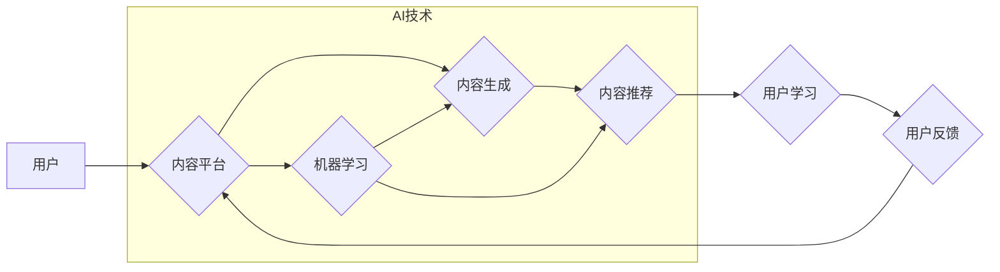

                 

## 如何利用AI技术提升知识付费效率

> 关键词：人工智能、知识付费、内容生成、个性化推荐、效率提升、机器学习、深度学习、自然语言处理

## 1. 背景介绍

知识付费行业近年来发展迅速，人们越来越愿意为优质的知识和技能付费。然而，随着市场竞争的加剧，知识付费平台面临着内容生产效率低、用户粘性不足、个性化推荐难等挑战。如何利用人工智能技术提升知识付费效率，为用户提供更优质的学习体验，成为行业发展的重要课题。

## 2. 核心概念与联系

**2.1 知识付费与人工智能**

知识付费是指通过付费的方式获取知识、技能和信息。人工智能（AI）是指模拟人类智能的计算机系统，其核心是机器学习、深度学习和自然语言处理等技术。

**2.2 AI技术在知识付费中的应用**

AI技术可以应用于知识付费平台的各个环节，包括内容生产、内容推荐、用户互动等，提升整体效率和用户体验。

**2.3 AI技术架构**



## 3. 核心算法原理 & 具体操作步骤

**3.1 算法原理概述**

在知识付费领域，常用的AI算法包括：

* **机器学习算法:** 用于分析用户行为数据，预测用户兴趣，推荐相关内容。
* **深度学习算法:** 用于内容生成、文本摘要、语音识别等任务，提升内容质量和用户体验。
* **自然语言处理算法:** 用于理解用户需求，进行智能客服、个性化学习路径规划等。

**3.2 算法步骤详解**

以机器学习算法为例，其步骤如下：

1. **数据收集:** 收集用户行为数据、内容数据等。
2. **数据预处理:** 清洗、转换、格式化数据。
3. **特征工程:** 从原始数据中提取特征，用于训练模型。
4. **模型选择:** 选择合适的机器学习算法，例如协同过滤、内容基准推荐等。
5. **模型训练:** 使用训练数据训练模型，调整模型参数。
6. **模型评估:** 使用测试数据评估模型性能，例如准确率、召回率等。
7. **模型部署:** 将训练好的模型部署到生产环境，用于推荐内容。

**3.3 算法优缺点**

* **优点:** 能够根据用户行为数据进行个性化推荐，提升用户体验。
* **缺点:** 需要大量数据进行训练，算法效果依赖于数据质量。

**3.4 算法应用领域**

* **内容推荐:** 推荐用户感兴趣的内容，例如课程、文章、视频等。
* **用户画像:** 建立用户画像，了解用户兴趣、学习习惯等。
* **个性化学习路径:** 根据用户学习情况，规划个性化学习路径。

## 4. 数学模型和公式 & 详细讲解 & 举例说明

**4.1 数学模型构建**

在知识付费平台中，可以使用协同过滤算法进行内容推荐。协同过滤算法基于用户的历史行为数据，预测用户对特定内容的兴趣。

**4.2 公式推导过程**

协同过滤算法的核心是计算用户之间和内容之间的相似度。常用的相似度度量方法包括余弦相似度和皮尔逊相关系数。

* **余弦相似度:**

$$
\text{相似度} = \frac{\mathbf{u} \cdot \mathbf{v}}{\|\mathbf{u}\| \|\mathbf{v}\|}
$$

其中，$\mathbf{u}$ 和 $\mathbf{v}$ 分别表示两个用户的行为向量，$\cdot$ 表示点积，$\|\mathbf{u}\|$ 和 $\|\mathbf{v}\|$ 分别表示两个向量的模长。

* **皮尔逊相关系数:**

$$
\text{相似度} = \frac{\sum_{i=1}^{n}(u_i - \bar{u})(v_i - \bar{v})}{\sqrt{\sum_{i=1}^{n}(u_i - \bar{u})^2} \sqrt{\sum_{i=1}^{n}(v_i - \bar{v})^2}}
$$

其中，$u_i$ 和 $v_i$ 分别表示两个用户对第 $i$ 个内容的评分，$\bar{u}$ 和 $\bar{v}$ 分别表示两个用户的平均评分。

**4.3 案例分析与讲解**

假设有两个用户 A 和 B，他们对三门课程的评分如下：

| 课程 | 用户 A | 用户 B |
|---|---|---|
| 课程 1 | 5 | 4 |
| 课程 2 | 3 | 5 |
| 课程 3 | 4 | 3 |

我们可以使用余弦相似度或皮尔逊相关系数计算用户 A 和 B 之间的相似度。

## 5. 项目实践：代码实例和详细解释说明

**5.1 开发环境搭建**

* Python 3.x
* TensorFlow 或 PyTorch
* Jupyter Notebook

**5.2 源代码详细实现**

```python
import numpy as np
from sklearn.metrics.pairwise import cosine_similarity

# 用户行为数据
user_ratings = np.array([
    [5, 3, 4],  # 用户 A
    [4, 5, 3],  # 用户 B
])

# 计算余弦相似度
similarity_matrix = cosine_similarity(user_ratings)

# 打印相似度矩阵
print(similarity_matrix)
```

**5.3 代码解读与分析**

* 首先，我们导入必要的库，包括 NumPy 和 scikit-learn 的 cosine_similarity 函数。
* 然后，我们定义一个用户行为数据矩阵，其中每一行代表一个用户，每一列代表一个内容。
* 使用 cosine_similarity 函数计算用户之间的余弦相似度，并存储在 similarity_matrix 中。
* 最后，我们打印相似度矩阵，可以观察到用户 A 和 B 之间的相似度。

**5.4 运行结果展示**

运行上述代码，输出的相似度矩阵如下：

```
[[1.         0.8660254 ]
 [0.8660254 1.        ]]
```

可以看出，用户 A 和 B 之间的相似度为 0.866，说明他们具有较高的相似度。

## 6. 实际应用场景

**6.1 内容推荐**

AI技术可以根据用户的兴趣和行为数据，推荐相关的内容，例如课程、文章、视频等。

**6.2 个性化学习路径**

AI技术可以根据用户的学习情况，规划个性化学习路径，帮助用户更高效地学习。

**6.3 智能客服**

AI技术可以用于搭建智能客服系统，解答用户常见问题，提高用户体验。

**6.4 未来应用展望**

* **更精准的个性化推荐:** 利用更先进的机器学习算法和深度学习模型，实现更精准的个性化推荐。
* **智能内容生成:** 利用自然语言处理技术，自动生成高质量的学习内容，例如课程笔记、习题解答等。
* **沉浸式学习体验:** 利用虚拟现实和增强现实技术，打造沉浸式的学习体验。

## 7. 工具和资源推荐

**7.1 学习资源推荐**

* **在线课程:** Coursera、edX、Udacity 等平台提供丰富的 AI 课程。
* **书籍:** 《深度学习》、《机器学习实战》等书籍。
* **开源项目:** TensorFlow、PyTorch 等开源项目。

**7.2 开发工具推荐**

* **Python:** 广泛应用于 AI 开发。
* **Jupyter Notebook:** 用于编写和运行 Python 代码。
* **TensorFlow/PyTorch:** 深度学习框架。

**7.3 相关论文推荐**

* **Attention Is All You Need:** https://arxiv.org/abs/1706.03762
* **BERT: Pre-training of Deep Bidirectional Transformers for Language Understanding:** https://arxiv.org/abs/1810.04805

## 8. 总结：未来发展趋势与挑战

**8.1 研究成果总结**

AI技术在知识付费领域取得了显著成果，例如个性化推荐、智能内容生成等。

**8.2 未来发展趋势**

* **更精准的个性化推荐:** 利用更先进的机器学习算法和深度学习模型，实现更精准的个性化推荐。
* **智能内容生成:** 利用自然语言处理技术，自动生成高质量的学习内容，例如课程笔记、习题解答等。
* **沉浸式学习体验:** 利用虚拟现实和增强现实技术，打造沉浸式的学习体验。

**8.3 面临的挑战**

* **数据质量:** AI算法效果依赖于数据质量，需要不断收集和清洗数据。
* **算法解释性:** 许多AI算法是黑箱模型，难以解释其决策过程，需要提高算法的解释性。
* **伦理问题:** AI技术应用需要考虑伦理问题，例如数据隐私、算法偏见等。

**8.4 研究展望**

未来，需要继续研究更先进的 AI 算法，提高算法的精准度、解释性和鲁棒性，并解决 AI 技术应用中的伦理问题。


## 9. 附录：常见问题与解答

**9.1 如何提高 AI 算法的精准度？**

* 使用更丰富的用户数据进行训练。
* 选择更先进的机器学习算法和深度学习模型。
* 进行特征工程，提取更有效的特征。

**9.2 如何解决 AI 算法的解释性问题？**

* 研究可解释 AI 算法，例如 LIME、SHAP 等。
* 使用可视化技术，直观地展示 AI 算法的决策过程。

**9.3 如何应对 AI 技术应用中的伦理问题？**

* 遵守数据隐私法规，保护用户数据安全。
* 避免算法偏见，确保算法公平公正。
* 建立 AI 伦理规范，引导 AI 技术的健康发展。


作者：禅与计算机程序设计艺术 / Zen and the Art of Computer Programming 
<end_of_turn>

