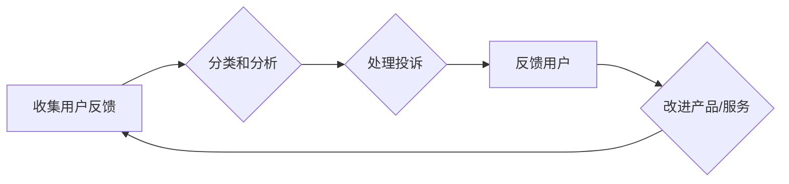

                 

## 如何处理用户反馈和投诉

> 关键词：用户反馈、投诉处理、客户关系管理、产品改进、用户体验

### 1. 背景介绍

在当今以用户为中心的数字时代，用户反馈和投诉已成为产品和服务的不可或缺的一部分。用户反馈可以帮助企业了解用户需求、发现产品缺陷和改进用户体验，而投诉则反映了用户对产品或服务的dissatisfaction，需要及时处理以维护用户关系和品牌形象。

然而，有效处理用户反馈和投诉并非易事。大量的反馈信息需要快速、准确地分类和分析，而投诉则需要经过合理的流程处理，才能有效解决用户问题并避免负面影响的扩大。

### 2. 核心概念与联系

用户反馈和投诉处理是一个复杂的过程，涉及多个环节和角色。

**2.1 核心概念**

* **用户反馈:** 用户对产品或服务的意见、建议、评价等信息，包括正面反馈、负面反馈和中性反馈。
* **投诉:** 用户对产品或服务出现问题或不满意的表达，通常带有强烈的情绪色彩。
* **客户关系管理 (CRM):**  企业用于管理客户关系的系统和策略，包括收集、分析和利用客户数据，以提升客户满意度和忠诚度。

**2.2 流程图**



**2.3 联系**

用户反馈和投诉处理与CRM息息相关。CRM系统可以帮助企业收集、存储和分析用户反馈和投诉数据，为产品改进和客户服务提供决策依据。

### 3. 核心算法原理 & 具体操作步骤

**3.1 算法原理概述**

处理用户反馈和投诉的核心算法通常基于自然语言处理 (NLP) 和机器学习 (ML) 技术。

* **自然语言处理 (NLP):** 用于理解和处理人类语言的计算机科学领域，可以用于分析用户反馈中的情感、主题和意图。
* **机器学习 (ML):**  使计算机能够从数据中学习和改进的算法，可以用于自动分类和优先级排序用户反馈和投诉。

**3.2 算法步骤详解**

1. **数据收集:** 从各种渠道收集用户反馈和投诉数据，例如用户评论、邮件、社交媒体帖子等。
2. **数据预处理:** 清洗和格式化数据，去除噪声和无关信息，例如HTML标签、特殊字符等。
3. **文本分析:** 使用NLP算法分析文本内容，提取情感、主题、意图等信息。
4. **分类和排序:** 使用ML算法对用户反馈和投诉进行分类和排序，例如根据严重程度、类型、主题等进行分级。
5. **自动回复:**  对于一些简单的反馈和投诉，可以使用预设的回复模板进行自动回复，例如感谢用户反馈、提供常见问题解答等。
6. **人工处理:**  对于复杂或需要专业处理的反馈和投诉，需要人工介入进行处理，例如调查问题原因、提供解决方案、进行赔偿等。
7. **反馈和改进:**  收集处理结果并进行分析，不断改进算法和流程，提升用户反馈和投诉处理效率和质量。

**3.3 算法优缺点**

* **优点:** 
    * 自动化处理，提高效率。
    * 数据分析，发现问题趋势。
    * 个性化回复，提升用户体验。
* **缺点:** 
    * 算法需要不断训练和优化。
    * 无法处理所有复杂情况。
    * 可能存在误判和偏见。

**3.4 算法应用领域**

* **电商平台:** 处理用户评价、售后服务投诉等。
* **社交媒体:**  识别和处理网络暴力、虚假信息等。
* **金融机构:**  处理客户咨询、投诉等。
* **医疗机构:**  处理患者反馈、医疗事故投诉等。

### 4. 数学模型和公式 & 详细讲解 & 举例说明

**4.1 数学模型构建**

用户反馈和投诉处理可以建模为一个分类问题，目标是将用户反馈和投诉数据分类到不同的类别中。

**4.2 公式推导过程**

可以使用贝叶斯公式来计算不同类别的概率：

$$P(C_i|X) = \frac{P(X|C_i)P(C_i)}{P(X)}$$

其中：

* $P(C_i|X)$ 是给定特征 $X$ 的情况下类别 $C_i$ 的概率。
* $P(X|C_i)$ 是类别 $C_i$ 的情况下特征 $X$ 的概率。
* $P(C_i)$ 是类别 $C_i$ 的先验概率。
* $P(X)$ 是特征 $X$ 的先验概率。

**4.3 案例分析与讲解**

假设我们想将用户反馈分为“正面”、“负面”和“中性”三类。我们可以使用文本分析算法提取用户反馈中的情感词，然后根据情感词的权重计算每个类别的概率。

例如，如果用户反馈中包含“很好”、“满意”等正面情感词，则其属于“正面”类别的概率会更高。反之，如果包含“糟糕”、“失望”等负面情感词，则其属于“负面”类别的概率会更高。

### 5. 项目实践：代码实例和详细解释说明

**5.1 开发环境搭建**

* Python 3.x
* NLTK 自然语言处理库
* Scikit-learn 机器学习库

**5.2 源代码详细实现**

```python
import nltk
from nltk.sentiment import SentimentIntensityAnalyzer

# 下载情感分析模型
nltk.download('vader_lexicon')

# 实例化情感分析器
analyzer = SentimentIntensityAnalyzer()

# 用户反馈文本
feedback = "这个产品真是太棒了，非常实用！"

# 分析情感强度
scores = analyzer.polarity_scores(feedback)

# 打印情感强度
print(scores)

# 根据情感强度分类
if scores['compound'] >= 0.05:
    category = "正面"
elif scores['compound'] <= -0.05:
    category = "负面"
else:
    category = "中性"

# 打印分类结果
print(f"用户反馈分类为：{category}")
```

**5.3 代码解读与分析**

* 该代码首先使用NLTK库下载情感分析模型。
* 然后实例化SentimentIntensityAnalyzer对象，用于分析用户反馈的情感强度。
* 使用analyzer.polarity_scores()方法分析用户反馈，得到情感强度分数。
* 根据情感强度分数，将用户反馈分类为“正面”、“负面”或“中性”。

**5.4 运行结果展示**

```
{'neg': 0.0, 'neu': 0.326, 'pos': 0.674, 'compound': 0.8957}
用户反馈分类为：正面
```

### 6. 实际应用场景

**6.1 电商平台**

* 处理用户评价，识别好评、差评和中性评价。
* 分析用户投诉，发现产品缺陷和服务问题。
* 提供个性化推荐，根据用户反馈和购买历史推荐相关产品。

**6.2 社交媒体**

* 识别和处理网络暴力、虚假信息等负面内容。
* 分析用户情绪，了解用户对品牌和产品的看法。
* 提供智能客服，自动回复用户常见问题。

**6.3 医疗机构**

* 处理患者反馈，了解患者对医生的满意度和服务质量。
* 分析医疗事故投诉，发现医疗风险和改进措施。
* 提供个性化医疗建议，根据患者反馈和病历信息提供个性化治疗方案。

**6.4 未来应用展望**

随着人工智能技术的不断发展，用户反馈和投诉处理将更加智能化和自动化。

* 更精准的分类和分析，能够更准确地识别用户需求和问题。
* 更个性化的回复，能够提供更符合用户需求的解决方案。
* 更主动的预警和预防，能够提前发现潜在问题并进行预警和预防。

### 7. 工具和资源推荐

**7.1 学习资源推荐**

* **书籍:**
    * 自然语言处理与情感分析
    * 机器学习实战
* **在线课程:**
    * Coursera: 自然语言处理
    * edX: 机器学习
* **博客和网站:**
    * NLP Progress
    * Machine Learning Mastery

**7.2 开发工具推荐**

* **Python:** 
    * NLTK
    * Scikit-learn
    * SpaCy
* **云平台:**
    * AWS Comprehend
    * Google Cloud Natural Language API
    * Azure Text Analytics

**7.3 相关论文推荐**

* **情感分析:**
    * Sentiment Analysis and Opinion Mining
* **机器学习:**
    * A Survey of Machine Learning Algorithms

### 8. 总结：未来发展趋势与挑战

**8.1 研究成果总结**

用户反馈和投诉处理领域取得了显著进展，NLP和ML技术为处理海量数据和识别复杂模式提供了强大的工具。

**8.2 未来发展趋势**

* 更精准的分类和分析，利用深度学习等先进算法提高分析精度。
* 更个性化的回复，结合用户画像和行为数据提供更精准的回复。
* 更主动的预警和预防，利用预测模型提前发现潜在问题并进行预警和预防。

**8.3 面临的挑战**

* 数据质量问题，用户反馈数据可能存在噪声、不完整等问题。
* 算法偏见问题，算法可能存在性别、种族等方面的偏见。
* 隐私保护问题，用户反馈数据可能包含敏感信息，需要妥善保护用户隐私。

**8.4 研究展望**

未来研究将重点关注以下几个方面：

* 开发更鲁棒、更准确的算法，能够处理更复杂、更多样化的用户反馈数据。
* 减少算法偏见，确保算法公平公正地处理所有用户反馈。
* 加强用户隐私保护，确保用户数据安全和隐私。


### 9. 附录：常见问题与解答

**9.1 如何处理负面用户反馈？**

* **及时回复:**  尽快回复用户，表达歉意并了解用户问题。
* **真诚沟通:**  真诚地与用户沟通，了解用户不满意的原因。
* **提供解决方案:**  尽力提供解决方案，解决用户问题。
* **持续改进:**  根据用户反馈进行产品和服务改进。

**9.2 如何防止用户投诉的恶意攻击？**

* **建立投诉规则:**  制定明确的投诉规则，防止恶意投诉。
* **人工审核:**  对投诉进行人工审核，识别恶意投诉。
* **使用机器学习:**  利用机器学习算法识别恶意投诉。
* **加强用户教育:**  引导用户理性投诉，避免恶意攻击。


作者：禅与计算机程序设计艺术 / Zen and the Art of Computer Programming 
<end_of_turn>

