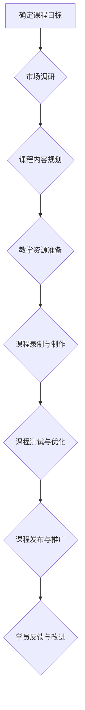

                 

## 如何将编程技能转化为在线课程

> 关键词：编程技能、在线课程、教学设计、课程开发、技术分享、知识传播、学习平台、市场定位

### 1. 背景介绍

在当今数字化时代，编程技能已成为一项至关重要的能力，它为个人发展和社会进步提供了无限的可能性。然而，传统的教育模式难以满足人们对编程学习的需求，在线课程作为一种灵活、便捷、高效的学习方式，逐渐成为编程技能学习的新趋势。

对于拥有扎实编程基础的开发者来说，将自己的技能转化为在线课程，不仅可以分享知识、帮助他人学习，更可以实现自我价值，获得经济回报。

### 2. 核心概念与联系

将编程技能转化为在线课程的核心在于将复杂的编程知识体系分解成易于理解和学习的模块，并通过多种教学手段，例如视频讲解、代码示例、练习题等，帮助学员掌握编程技能。

**课程开发流程**



### 3. 核心算法原理 & 具体操作步骤

#### 3.1  算法原理概述

在线课程开发的核心算法原理在于知识拆解和结构化。将复杂的编程知识体系分解成一个个独立的模块，每个模块都围绕一个特定的编程概念或技术进行讲解，并通过代码示例和练习题，帮助学员理解和掌握该概念或技术。

#### 3.2  算法步骤详解

1. **目标用户分析:** 确定目标用户的编程水平、学习目标和学习习惯。
2. **课程内容规划:** 根据目标用户分析结果，将编程知识体系分解成多个模块，每个模块包含特定的编程概念或技术。
3. **教学资源准备:** 为每个模块准备相应的教学资源，例如视频讲解、代码示例、练习题、课后作业等。
4. **课程录制与制作:** 将教学资源录制成视频课程，并进行剪辑、配音、字幕等制作工作。
5. **课程测试与优化:** 邀请测试学员进行课程测试，收集反馈意见，并对课程内容和教学方式进行优化。
6. **课程发布与推广:** 将课程发布到在线学习平台，并进行推广宣传。
7. **学员反馈与改进:** 收集学员反馈意见，并根据反馈意见不断改进课程内容和教学方式。

#### 3.3  算法优缺点

**优点:**

* **知识结构化:** 将复杂的编程知识体系分解成易于理解和学习的模块。
* **灵活便捷:** 在线课程可以随时随地学习，不受时间和地点限制。
* **互动性强:** 在线课程可以利用互动式教学手段，提高学员的学习兴趣和参与度。

**缺点:**

* **缺乏面对面交流:** 在线课程缺乏面对面交流的机会，可能会导致学员学习过程中遇到困难时难以及时获得帮助。
* **自律性要求高:** 在线课程需要学员具备较高的自律性，才能保证学习进度和效果。
* **课程质量参差不齐:** 在线课程市场鱼龙混杂，课程质量参差不齐，需要学员谨慎选择。

#### 3.4  算法应用领域

在线课程开发算法广泛应用于编程技能学习领域，例如：

* **编程语言学习:** 教学各种编程语言，例如Python、Java、C++等。
* **软件开发技能学习:** 教学软件开发相关的技能，例如算法设计、数据结构、软件测试等。
* **Web 开发学习:** 教学Web开发相关的技术，例如HTML、CSS、JavaScript等。
* **移动应用开发学习:** 教学移动应用开发相关的技术，例如Android开发、iOS开发等。

### 4. 数学模型和公式 & 详细讲解 & 举例说明

#### 4.1  数学模型构建

在线课程开发可以利用数学模型来分析学员学习进度和效果。例如，可以使用贝叶斯网络模型来预测学员完成课程的概率，或者使用回归模型来分析学员学习时间与学习成绩之间的关系。

#### 4.2  公式推导过程

假设学员完成课程的概率为P(C)，学习时间为T，学习成绩为S，则可以使用以下公式来预测学员完成课程的概率:

$$P(C) = f(T, S)$$

其中，f(T, S)为预测模型，可以是线性回归模型、逻辑回归模型等。

#### 4.3  案例分析与讲解

例如，可以使用线性回归模型来预测学员完成课程的概率，模型如下:

$$P(C) = aT + bS + c$$

其中，a、b、c为模型参数，可以通过训练数据进行估计。

### 5. 项目实践：代码实例和详细解释说明

#### 5.1  开发环境搭建

在线课程开发需要搭建相应的开发环境，例如：

* **视频录制软件:** OBS Studio、Camtasia等。
* **代码编辑器:** VS Code、Sublime Text等。
* **在线学习平台:** Udemy、Coursera、Teachable等。

#### 5.2  源代码详细实现

以下是一个简单的在线课程开发框架的代码示例，使用Python语言实现：

```python
class Course:
    def __init__(self, title, description, modules):
        self.title = title
        self.description = description
        self.modules = modules

    def display_info(self):
        print(f"课程名称: {self.title}")
        print(f"课程描述: {self.description}")
        print("课程模块:")
        for module in self.modules:
            print(f"- {module.title}")

class Module:
    def __init__(self, title, content):
        self.title = title
        self.content = content

# 创建课程实例
course = Course("Python编程入门", "这是一门介绍Python编程基础的课程", [
    Module("变量和数据类型", "介绍Python的基本数据类型和变量操作"),
    Module("控制流", "讲解Python的控制语句，例如if-else、for循环、while循环"),
    Module("函数", "介绍Python的函数定义和调用"),
])

# 显示课程信息
course.display_info()
```

#### 5.3  代码解读与分析

这段代码定义了两个类：`Course`和`Module`。`Course`类代表一个完整的在线课程，包含课程名称、描述和多个模块。`Module`类代表一个课程模块，包含模块名称和内容。

代码示例演示了如何创建课程实例和显示课程信息。

#### 5.4  运行结果展示

运行这段代码，将会输出以下信息：

```
课程名称: Python编程入门
课程描述: 这是一门介绍Python编程基础的课程
课程模块:
- 变量和数据类型
- 控制流
- 函数
```

### 6. 实际应用场景

在线课程已经成为编程技能学习的热门方式，应用场景广泛：

#### 6.1  个人学习

个人开发者可以利用在线课程学习新的编程语言和技术，提升自己的编程能力。

#### 6.2  企业培训

企业可以利用在线课程培训员工，提升员工的编程技能和工作效率。

#### 6.3  教育机构

教育机构可以利用在线课程开设编程课程，为学生提供编程学习的机会。

#### 6.4  未来应用展望

未来，在线课程将更加个性化、互动化和智能化。例如，可以根据学员的学习进度和学习风格，定制个性化的学习路径；可以利用人工智能技术，提供更智能化的学习辅导和答疑服务。

### 7. 工具和资源推荐

#### 7.1  学习资源推荐

* **Codecademy:** 提供各种编程语言的在线课程，适合初学者。
* **Udemy:** 提供丰富的编程课程，涵盖各种编程语言和技术。
* **Coursera:** 提供来自世界知名大学的在线课程，包括编程课程。
* **edX:** 提供来自世界知名大学的在线课程，包括编程课程。

#### 7.2  开发工具推荐

* **OBS Studio:** 视频录制软件，免费开源。
* **Camtasia:** 视频录制和编辑软件，付费软件。
* **VS Code:** 代码编辑器，免费开源。
* **Sublime Text:** 代码编辑器，付费软件。

#### 7.3  相关论文推荐

* **Towards Data Science:** 数据科学领域的研究论文平台。
* **arXiv:** 物理学、数学、计算机科学等领域的预印本平台。

### 8. 总结：未来发展趋势与挑战

#### 8.1  研究成果总结

将编程技能转化为在线课程，已经取得了显著的成果，为编程技能学习提供了新的途径。

#### 8.2  未来发展趋势

未来，在线课程将更加个性化、互动化和智能化，并与其他技术融合，例如虚拟现实、增强现实等。

#### 8.3  面临的挑战

在线课程开发也面临着一些挑战，例如课程质量控制、学员互动性提升、知识更新速度等。

#### 8.4  研究展望

未来研究将重点关注在线课程的个性化、互动性和智能化，以及如何更好地解决在线课程开发面临的挑战。

### 9. 附录：常见问题与解答

#### 9.1  如何确定课程目标？

课程目标应该明确、具体、可衡量、可实现、相关和时间限定。

#### 9.2  如何进行课程内容规划？

课程内容规划应该根据目标用户的编程水平、学习目标和学习习惯进行设计，并确保课程内容逻辑清晰、层次分明。

#### 9.3  如何制作高质量的教学资源？

教学资源应该清晰易懂、实用性强、互动性好。

#### 9.4  如何推广在线课程？

可以通过多种方式推广在线课程，例如社交媒体营销、搜索引擎优化、付费广告等。


作者：禅与计算机程序设计艺术 / Zen and the Art of Computer Programming 
<end_of_turn>

