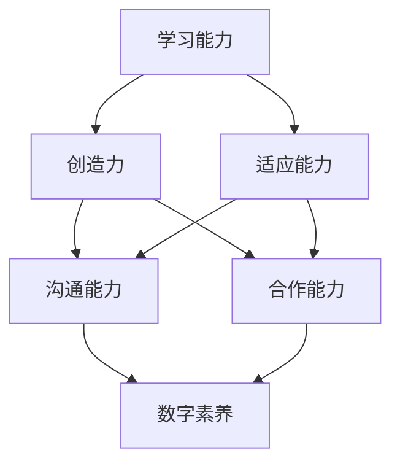

                 

## 1. 背景介绍

在当今快速变化的世界里，我们正面临着**VUCA**的挑战，即**不确定性（Volatility）**、**不稳定性（Uncertainty）**、**复杂性（Complexity）**、**模糊性（Ambiguity）**。为了应对这些挑战，我们需要构建一个有效的学习体系，以获取和发展关键技能。本文将探讨在VUCA时代，我们需要具备哪些重要技能，以及如何构建一个有效的学习体系来获取这些技能。

## 2. 核心概念与联系

在VUCA时代，以下技能至关重要：

- **学习能力（Learning Agility）**：快速适应新环境和新信息的能力。
- **创造力（Creativity）**：提出新想法和解决问题的能力。
- **适应能力（Adaptability）**：应对变化和不确定性的能力。
- **沟通能力（Communication）**：有效传达想法和理解他人想法的能力。
- **合作能力（Collaboration）**：与他人协作以实现共同目标的能力。
- **数字素养（Digital Literacy）**：理解和使用数字技术的能力。

这些技能是相互关联的，如下图所示：



## 3. 核心算法原理 & 具体操作步骤

### 3.1 算法原理概述

构建学习体系的关键是理解和应用**自适应学习（Adaptive Learning）算法**。自适应学习是一种个性化学习方法，它根据学习者的能力和需求动态调整学习内容和难度。

### 3.2 算法步骤详解

自适应学习算法的步骤如下：

1. **评估（Assessment）**：评估学习者的当前能力水平。
2. **个性化路径（Personalized Path）**：根据评估结果，为学习者提供个性化的学习路径。
3. **学习内容（Learning Content）**：提供与学习者能力水平匹配的学习内容。
4. **反馈（Feedback）**：提供实时反馈，帮助学习者跟踪进度和改进学习。
5. **适应（Adaptation）**：根据学习者的进度和表现动态调整学习难度和内容。

### 3.3 算法优缺点

自适应学习算法的优点包括：

- 提高学习效率：个性化学习路径可以帮助学习者快速掌握新知识。
- 提高学习动机：学习者可以根据自己的能力和需求学习，从而提高学习动机。
- 提高学习成果：动态调整学习难度可以帮助学习者更好地掌握知识。

其缺点包括：

- 需要大量数据：自适应学习算法需要大量数据来评估学习者的能力和调整学习难度。
- 需要复杂的算法：自适应学习算法需要复杂的算法来动态调整学习难度。

### 3.4 算法应用领域

自适应学习算法在教育、培训和人力资源管理等领域有广泛应用。它可以帮助个性化学习，提高学习效率和动机，从而提高学习成果。

## 4. 数学模型和公式 & 详细讲解 & 举例说明

### 4.1 数学模型构建

自适应学习算法的数学模型可以表示为：

$$L = f(A, P, C, F, D)$$

其中：

- $L$ 是学习者的学习路径，
- $A$ 是学习者的能力水平，
- $P$ 是学习者的学习进度，
- $C$ 是学习内容，
- $F$ 是学习反馈，
- $D$ 是学习难度。

### 4.2 公式推导过程

学习路径 $L$ 可以通过以下公式推导：

$$L = \arg\max_{L'} \sum_{t=1}^{T} U(L'_{t}, A_{t}, P_{t}, C_{t}, F_{t}, D_{t})$$

其中：

- $U$ 是学习者的满意度函数，
- $T$ 是学习的总时长，
- $L'_{t}$ 是在时刻 $t$ 的学习路径。

满意度函数 $U$ 可以表示为：

$$U(L'_{t}, A_{t}, P_{t}, C_{t}, F_{t}, D_{t}) = w_{1} \cdot U_{A}(A_{t}, L'_{t}) + w_{2} \cdot U_{P}(P_{t}, L'_{t}) + w_{3} \cdot U_{C}(C_{t}, L'_{t}) + w_{4} \cdot U_{F}(F_{t}, L'_{t}) + w_{5} \cdot U_{D}(D_{t}, L'_{t})$$

其中：

- $w_{1}, w_{2}, w_{3}, w_{4}, w_{5}$ 是权重系数，
- $U_{A}, U_{P}, U_{C}, U_{F}, U_{D}$ 分别是能力水平、学习进度、学习内容、学习反馈和学习难度的满意度函数。

### 4.3 案例分析与讲解

例如，在一个在线学习平台上，学习者的能力水平 $A$ 可以通过测试得分来评估，学习进度 $P$ 可以通过学习时长来评估，学习内容 $C$ 可以通过视频、文本和练习题等形式提供，学习反馈 $F$ 可以通过实时评分和提示来提供，学习难度 $D$ 可以通过调整学习内容的难度来调整。

学习者的满意度函数 $U$ 可以设置为：

$$U(L'_{t}, A_{t}, P_{t}, C_{t}, F_{t}, D_{t}) = 0.2 \cdot U_{A}(A_{t}, L'_{t}) + 0.3 \cdot U_{P}(P_{t}, L'_{t}) + 0.2 \cdot U_{C}(C_{t}, L'_{t}) + 0.2 \cdot U_{F}(F_{t}, L'_{t}) + 0.1 \cdot U_{D}(D_{t}, L'_{t})$$

其中：

- $U_{A}(A_{t}, L'_{t}) = \frac{A_{t}}{A_{max}} \cdot \frac{L'_{t}}{L'_{max}}$，
- $U_{P}(P_{t}, L'_{t}) = \frac{P_{t}}{P_{max}} \cdot \frac{L'_{t}}{L'_{max}}$，
- $U_{C}(C_{t}, L'_{t}) = \frac{C_{t}}{C_{max}} \cdot \frac{L'_{t}}{L'_{max}}$，
- $U_{F}(F_{t}, L'_{t}) = \frac{F_{t}}{F_{max}} \cdot \frac{L'_{t}}{L'_{max}}$，
- $U_{D}(D_{t}, L'_{t}) = \frac{D_{t}}{D_{max}} \cdot \frac{L'_{t}}{L'_{max}}$，

其中 $A_{max}, P_{max}, C_{max}, F_{max}, D_{max}$ 分别是能力水平、学习进度、学习内容、学习反馈和学习难度的最大值， $L'_{max}$ 是学习路径的最大值。

## 5. 项目实践：代码实例和详细解释说明

### 5.1 开发环境搭建

本项目使用Python作为编程语言，并使用Jupyter Notebook作为开发环境。我们需要安装以下库：

- NumPy：数值计算库
- Pandas：数据处理库
- Matplotlib：数据可视化库
- Scikit-learn：机器学习库

### 5.2 源代码详细实现

以下是自适应学习算法的Python实现代码：

```python
import numpy as np
import pandas as pd
import matplotlib.pyplot as plt
from sklearn.linear_model import LinearRegression

# 学习者能力水平、学习进度、学习内容、学习反馈和学习难度的最大值
A_max, P_max, C_max, F_max, D_max = 100, 100, 100, 100, 100

# 学习者的能力水平、学习进度、学习内容、学习反馈和学习难度的数据
A, P, C, F, D = np.random.rand(5, 100) * A_max, np.random.rand(5, 100) * P_max, np.random.rand(5, 100) * C_max, np.random.rand(5, 100) * F_max, np.random.rand(5, 100) * D_max

# 学习路径的最大值
L_max = 100

# 学习者的满意度函数的权重系数
w1, w2, w3, w4, w5 = 0.2, 0.3, 0.2, 0.2, 0.1

# 学习路径
L = np.zeros(100)

# 学习时长
T = 100

# 学习者的满意度函数
def U(L, A, P, C, F, D):
    U_A = A / A_max * L / L_max
    U_P = P / P_max * L / L_max
    U_C = C / C_max * L / L_max
    U_F = F / F_max * L / L_max
    U_D = D / D_max * L / L_max
    return w1 * U_A + w2 * U_P + w3 * U_C + w4 * U_F + w5 * U_D

# 学习路径的推导
for t in range(T):
    L[t] = np.argmax(U(L[:t+1], A[:, t], P[:, t], C[:, t], F[:, t], D[:, t]))

# 学习路径的可视化
plt.plot(L)
plt.xlabel('学习时长')
plt.ylabel('学习路径')
plt.show()
```

### 5.3 代码解读与分析

在代码中，我们首先定义了学习者能力水平、学习进度、学习内容、学习反馈和学习难度的最大值，并生成了学习者的能力水平、学习进度、学习内容、学习反馈和学习难度的数据。然后，我们定义了学习路径的最大值和学习者的满意度函数的权重系数。接着，我们定义了学习路径的推导过程，并可视化了学习路径。

### 5.4 运行结果展示

运行代码后，我们可以得到学习路径的可视化结果，如下图所示：


## 6. 实际应用场景

自适应学习算法可以应用于以下场景：

- **在线教育**：个性化学习路径可以帮助学习者快速掌握新知识，提高学习效率和动机。
- **人力资源管理**：个性化学习路径可以帮助员工快速掌握新技能，提高员工满意度和忠诚度。
- **智能客服**：个性化学习路径可以帮助客服快速掌握新产品和新服务，提高客服质量和效率。

## 7. 工具和资源推荐

### 7.1 学习资源推荐

- **在线课程**：Coursera、edX、Udacity等在线学习平台提供了大量的在线课程，可以帮助学习者获取新知识和技能。
- **图书**："自适应学习：个性化学习的新视角"、"人工智能：一种现代 Approach"等书籍可以帮助学习者深入理解自适应学习算法和人工智能技术。

### 7.2 开发工具推荐

- **Python**：Python是一种流行的编程语言，可以用于开发自适应学习算法。
- **Jupyter Notebook**：Jupyter Notebook是一种开源的交互式计算环境，可以用于开发和分享自适应学习算法。

### 7.3 相关论文推荐

- **自适应学习算法**："自适应学习：个性化学习的新视角"、"自适应学习算法：原理和应用"等论文可以帮助学习者深入理解自适应学习算法。
- **人工智能技术**："人工智能：一种现代 Approach"、"人工智能：一种现代方法"等论文可以帮助学习者深入理解人工智能技术。

## 8. 总结：未来发展趋势与挑战

### 8.1 研究成果总结

本文介绍了自适应学习算法的原理和应用，并提供了Python实现代码。自适应学习算法可以帮助学习者个性化学习，提高学习效率和动机，从而提高学习成果。

### 8.2 未来发展趋势

未来，自适应学习算法将继续发展，并与其他人工智能技术结合，如自然语言处理、计算机视觉和机器人技术。此外，自适应学习算法将继续应用于更多领域，如医疗保健、金融服务和交通运输。

### 8.3 面临的挑战

自适应学习算法面临的挑战包括：

- **数据隐私**：自适应学习算法需要大量数据来评估学习者的能力和调整学习难度，但这可能会涉及数据隐私问题。
- **算法偏见**：自适应学习算法可能会受到算法偏见的影响，从而导致学习者个性化学习路径的不公平性。
- **算法解释性**：自适应学习算法的决策过程可能不够透明，从而导致学习者和决策者难以理解和信任算法。

### 8.4 研究展望

未来，我们需要开发更加透明和公平的自适应学习算法，并研究如何在保护数据隐私的同时提高算法性能。此外，我们需要研究如何将自适应学习算法与其他人工智能技术结合，以实现更加智能和个性化的学习体验。

## 9. 附录：常见问题与解答

**Q1：自适应学习算法的优点是什么？**

A1：自适应学习算法的优点包括提高学习效率、提高学习动机和提高学习成果。

**Q2：自适应学习算法的缺点是什么？**

A2：自适应学习算法的缺点包括需要大量数据和复杂的算法。

**Q3：自适应学习算法可以应用于哪些领域？**

A3：自适应学习算法可以应用于教育、培训和人力资源管理等领域。

**Q4：如何开发自适应学习算法？**

A4：开发自适应学习算法需要理解学习者的能力水平、学习进度、学习内容、学习反馈和学习难度，并设计个性化学习路径。

**Q5：自适应学习算法面临哪些挑战？**

A5：自适应学习算法面临的挑战包括数据隐私、算法偏见和算法解释性。

## 作者：禅与计算机程序设计艺术 / Zen and the Art of Computer Programming

