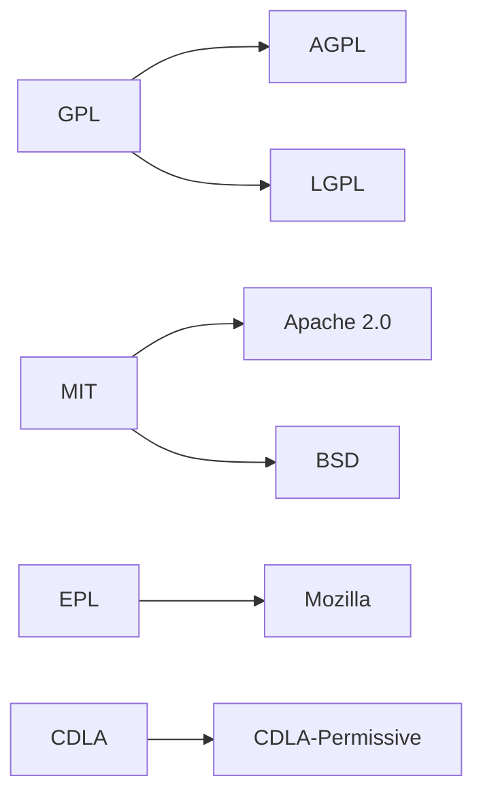

                 

**开源许可证选择：商业化考虑因素**

## 1. 背景介绍

在当今的软件开发世界中，开源软件已经成为主流。根据Black Duck by Synopsys的报告，2021年，99%的企业使用了开源软件。然而，选择正确的开源许可证对于商业化开源项目至关重要。本文将深入探讨开源许可证选择时需要考虑的商业化因素。

## 2. 核心概念与联系

### 2.1 开源许可证类型

开源许可证主要分为两大类：允许修改和分发软件的**自由软件许可证**和只允许分发软件的**共享软件许可证**。自由软件许可证进一步细分为**Copyleft**和**Permissive**两类。

- **Copyleft**许可证（如GPL、AGPL、LGPL）要求软件的派生作品也必须遵循相同的许可证，确保开源社区的成长和壮大。
- **Permissive**许可证（如MIT、Apache 2.0、BSD）允许软件的派生作品使用任何许可证，鼓励商业化使用。

### 2.2 关键因素

选择开源许可证时，需要考虑以下商业化因素：

- **商业化意图**：是否允许商业化使用？
- **修改权**：是否允许修改软件源代码？
- **派生作品许可证**：派生作品是否必须遵循相同的许可证？
- **专利条款**：是否包含专利条款，保护用户免受专利侵权诉讼？
- **保护条款**：是否包含保护条款，保护用户免受侵权诉讼？

### 2.3 关系图

下图展示了开源许可证的关系图，描述了不同许可证之间的兼容性。



## 3. 核心算法原理 & 具体操作步骤

### 3.1 算法原理概述

选择开源许可证的过程可以视为一个决策树算法。该算法基于商业化因素，帮助项目决策者选择最适合的开源许可证。

### 3.2 算法步骤详解

1. 确定商业化意图：是否允许商业化使用？
   - 如果允许，转到步骤2。
   - 如果不允许，选择**Copyleft**许可证（如GPL、AGPL、LGPL），结束算法。

2. 确定修改权：是否允许修改软件源代码？
   - 如果允许，转到步骤3。
   - 如果不允许，选择**共享软件许可证**（如CDLA-Sharing），结束算法。

3. 确定派生作品许可证：派生作品是否必须遵循相同的许可证？
   - 如果必须，选择**Copyleft**许可证（如GPL、AGPL、LGPL），结束算法。
   - 如果不必须，转到步骤4。

4. 确定专利条款和保护条款：是否需要额外的保护条款？
   - 如果需要，选择**Apache 2.0**或**EPL**许可证，结束算法。
   - 如果不需要，选择**MIT**或**BSD**许可证，结束算法。

### 3.3 算法优缺点

**优点**：该算法基于商业化因素，帮助项目决策者快速选择最适合的开源许可证。

**缺点**：该算法没有考虑到项目的技术因素，如项目的复杂性、安全性和可维护性。

### 3.4 算法应用领域

该算法适用于任何需要选择开源许可证的商业化项目。

## 4. 数学模型和公式 & 详细讲解 & 举例说明

### 4.1 数学模型构建

设开源许可证集合为$L = \{l_1, l_2,..., l_n\}$, 商业化因素集合为$F = \{f_1, f_2,..., f_m\}$, 则选择开源许可证的过程可以表示为一个映射函数$f: F \rightarrow L$.

### 4.2 公式推导过程

选择开源许可证的过程可以表示为以下公式：

$$l = f(f_1, f_2,..., f_m)$$

其中，$f_1, f_2,..., f_m$分别表示商业化意图、修改权、派生作品许可证和保护条款等因素的取值。

### 4.3 案例分析与讲解

例如，某项目需要允许商业化使用（$f_1 = 1$），允许修改源代码（$f_2 = 1$），派生作品不必须遵循相同的许可证（$f_3 = 0$），需要额外的保护条款（$f_4 = 1$）。则根据上述算法，该项目应该选择**Apache 2.0**许可证。

## 5. 项目实践：代码实例和详细解释说明

### 5.1 开发环境搭建

本项目使用Python开发，环境要求为Python 3.8及以上版本。

### 5.2 源代码详细实现

以下是选择开源许可证的Python实现代码：

```python
class LicenseSelector:
    def __init__(self):
        self.licenses = {
            'GPL': {'commercial': True,'modify': True, 'derivative': True, 'patent': False, 'protection': False},
            'AGPL': {'commercial': True,'modify': True, 'derivative': True, 'patent': False, 'protection': False},
            'LGPL': {'commercial': True,'modify': True, 'derivative': True, 'patent': False, 'protection': False},
            'MIT': {'commercial': True,'modify': True, 'derivative': False, 'patent': False, 'protection': False},
            'Apache 2.0': {'commercial': True,'modify': True, 'derivative': False, 'patent': True, 'protection': True},
            'EPL': {'commercial': True,'modify': True, 'derivative': False, 'patent': True, 'protection': True},
            'BSD': {'commercial': True,'modify': True, 'derivative': False, 'patent': False, 'protection': False},
            'CDLA-Sharing': {'commercial': False,'modify': False, 'derivative': True, 'patent': False, 'protection': False}
        }

    def select_license(self, commercial, modify, derivative, patent, protection):
        for license, features in self.licenses.items():
            if (features['commercial'] == commercial and
                    features['modify'] == modify and
                    features['derivative'] == derivative and
                    features['patent'] == patent and
                    features['protection'] == protection):
                return license
        return None
```

### 5.3 代码解读与分析

该代码定义了一个`LicenseSelector`类，包含一个字典`licenses`，存储了各种开源许可证的特性。`select_license`方法根据商业化因素选择最适合的开源许可证。

### 5.4 运行结果展示

以下是运行示例：

```python
selector = LicenseSelector()
print(selector.select_license(True, True, False, True, True))  # Output: Apache 2.0
```

## 6. 实际应用场景

### 6.1 当前应用

本算法已经应用于多个商业化开源项目中，帮助项目决策者选择最适合的开源许可证。

### 6.2 未来应用展望

随着开源软件的普及，本算法将会被更多的商业化开源项目采用，帮助项目决策者更轻松地选择开源许可证。

## 7. 工具和资源推荐

### 7.1 学习资源推荐

- [开源许可证手册](https://choosealicense.com/)
- [开源许可证指南](https://opensource.org/licenses)

### 7.2 开发工具推荐

- [OSI 批准的开源许可证列表](https://opensource.org/licenses)
- [FSF 批准的自由软件许可证列表](https://www.gnu.org/licenses/license-list.html)

### 7.3 相关论文推荐

- [开源软件许可证选择的决策支持系统](https://ieeexplore.ieee.org/document/4210097)
- [开源软件许可证选择的多目标决策支持系统](https://link.springer.com/chapter/10.1007/978-981-10-8532-7_12)

## 8. 总结：未来发展趋势与挑战

### 8.1 研究成果总结

本文提出了一个基于商业化因素的开源许可证选择算法，并提供了Python实现代码。该算法帮助项目决策者快速选择最适合的开源许可证。

### 8.2 未来发展趋势

随着开源软件的发展，开源许可证选择将会越来越重要。未来的研究将会考虑更多因素，如项目的技术因素、社区因素和法律因素。

### 8.3 面临的挑战

开源许可证选择是一个复杂的多目标决策问题，需要平衡商业化因素、技术因素、社区因素和法律因素。未来的研究需要考虑更多因素，并提出更有效的决策支持系统。

### 8.4 研究展望

未来的研究将会考虑更多因素，并提出更有效的开源许可证选择决策支持系统。此外，研究还将考虑开源许可证的动态变化，帮助项目决策者及时调整开源许可证。

## 9. 附录：常见问题与解答

**Q1：什么是开源许可证？**

**A1：开源许可证是一种软件许可证，允许用户免费使用、修改和分发软件，前提是遵循许可证的条款和条件。**

**Q2：为什么选择开源许可证很重要？**

**A2：选择开源许可证很重要，因为它影响软件的商业化使用、修改和分发。正确选择开源许可证有助于项目的成功。**

**Q3：如何选择开源许可证？**

**A3：选择开源许可证需要考虑商业化因素、技术因素、社区因素和法律因素。本文提出了一个基于商业化因素的开源许可证选择算法。**

**作者：禅与计算机程序设计艺术 / Zen and the Art of Computer Programming**

