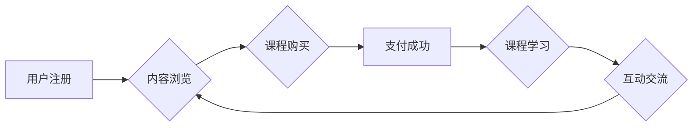

                 

## 打造垂直领域的知识付费产品:案例分析

> 关键词：知识付费、垂直领域、产品设计、市场分析、用户需求、内容运营、技术架构、商业模式

## 1. 背景介绍

知识付费行业近年来发展迅速，成为互联网经济的新增长点。随着人们对知识的需求不断增加，以及互联网技术的发展，知识付费模式也逐渐成熟，并开始向垂直领域拓展。垂直领域的知识付费产品，是指针对特定行业、专业或兴趣群体的知识付费服务。这类产品往往拥有更精准的用户群体，更容易建立用户粘性，并实现更高的盈利能力。

然而，打造成功的垂直领域知识付费产品并非易事。需要对目标用户、市场需求、内容运营、技术架构等多个方面进行深入研究和分析。本文将从多个角度探讨打造垂直领域知识付费产品的关键要素，并结合实际案例进行分析，为想要进入该领域的创业者和企业提供参考。

## 2. 核心概念与联系

### 2.1 垂直领域知识付费

垂直领域知识付费是指针对特定行业、专业或兴趣群体的知识付费服务。这类产品通常拥有以下特点：

* **专业性强:** 内容深度和专业性高，能够满足目标用户对特定领域的专业知识需求。
* **用户群体精准:** 针对特定用户群体，更容易建立用户粘性，并实现精准营销。
* **价值主张明确:** 产品提供独特的价值，能够解决目标用户痛点，并提升用户技能或知识水平。

### 2.2 知识付费产品架构

垂直领域知识付费产品的架构通常包含以下几个关键模块：

* **内容平台:** 用于存储、管理和发布知识付费内容，支持多种内容形式，如文字、视频、音频、直播等。
* **用户管理系统:** 用于用户注册、登录、支付、课程学习、互动交流等功能。
* **支付系统:** 用于处理用户付费，支持多种支付方式，并确保交易安全。
* **运营管理系统:** 用于内容运营、用户运营、数据分析等功能，帮助平台更好地管理和运营知识付费产品。

**Mermaid 流程图**



## 3. 核心算法原理 & 具体操作步骤

### 3.1 算法原理概述

垂直领域知识付费产品的核心算法主要围绕用户需求分析、内容推荐、学习路径规划等方面。

* **用户需求分析:** 通过分析用户注册信息、学习行为、评价反馈等数据，挖掘用户兴趣、学习目标、知识痛点等信息，为个性化内容推荐和学习路径规划提供依据。
* **内容推荐:** 基于用户需求分析结果，采用协同过滤、内容过滤、深度学习等算法，推荐用户感兴趣、有学习价值的内容。
* **学习路径规划:** 根据用户学习目标和知识水平，设计个性化的学习路径，引导用户循序渐进地学习，提升学习效率。

### 3.2 算法步骤详解

**用户需求分析算法步骤:**

1. 收集用户数据: 包括用户注册信息、学习行为数据、评价反馈数据等。
2. 数据清洗和预处理: 对收集到的数据进行清洗、转换、编码等预处理操作，确保数据质量。
3. 特征提取: 从用户数据中提取用户兴趣、学习目标、知识水平等特征。
4. 模型训练: 使用机器学习算法，训练用户需求分析模型。
5. 用户需求预测: 将新用户数据输入模型，预测用户的兴趣、学习目标、知识痛点等信息。

**内容推荐算法步骤:**

1. 建立内容特征库: 对平台上的所有内容进行分析，提取内容主题、标签、作者等特征。
2. 建立用户兴趣模型: 使用用户需求分析模型，构建用户兴趣模型。
3. 计算内容与用户兴趣匹配度: 根据用户兴趣模型和内容特征库，计算每个内容与用户的匹配度。
4. 推荐内容: 根据匹配度排序，推荐用户感兴趣的内容。

**学习路径规划算法步骤:**

1. 建立知识图谱: 建立平台上知识点的知识图谱，描述知识点之间的关系和层次结构。
2. 分析用户学习目标: 根据用户需求分析结果，分析用户的学习目标和知识水平。
3. 规划学习路径: 根据知识图谱和用户学习目标，规划个性化的学习路径。
4. 提供学习建议: 根据学习路径，向用户提供学习建议和资源。

### 3.3 算法优缺点

**优点:**

* **精准度高:** 基于用户数据和算法分析，能够精准推荐用户感兴趣的内容和学习路径。
* **效率提升:** 个性化学习路径和内容推荐，能够提升用户学习效率。
* **用户粘性强:** 精准的内容和学习体验，能够增强用户粘性，提高用户复购率。

**缺点:**

* **数据依赖:** 算法效果依赖于用户数据的质量和数量。
* **算法复杂:** 需要专业的技术人员进行算法开发和维护。
* **个性化程度:** 算法难以完全满足用户的个性化需求。

### 3.4 算法应用领域

* **在线教育:** 个性化课程推荐、学习路径规划、智能答疑等。
* **职业培训:** 根据用户职业目标，推荐相关课程和学习资源。
* **兴趣爱好:** 根据用户兴趣爱好，推荐相关内容和社群。
* **垂直行业:** 为特定行业用户提供专业知识和技能培训。

## 4. 数学模型和公式 & 详细讲解 & 举例说明

### 4.1 数学模型构建

用户需求分析模型可以采用协同过滤算法，构建用户-物品评分矩阵，并使用矩阵分解技术进行模型训练。

**用户-物品评分矩阵:**

```
用户 | 物品1 | 物品2 | 物品3
------- | -------- | -------- | --------
用户1 | 5 | 3 | 4
用户2 | 4 | 5 | 2
用户3 | 3 | 2 | 5
```

**矩阵分解模型:**

假设用户集合为U，物品集合为I，用户-物品评分矩阵为R，则矩阵分解模型可以表示为：

$$R \approx U \cdot V^T$$

其中，U为用户特征矩阵，V为物品特征矩阵。

### 4.2 公式推导过程

矩阵分解模型的目标是最小化预测误差，可以使用均方误差作为损失函数：

$$L(U, V) = \frac{1}{m} \sum_{u \in U, i \in I} (R_{ui} - \hat{R}_{ui})^2$$

其中，m为用户-物品评分矩阵中的非零元素个数，$\hat{R}_{ui}$为模型预测的用户对物品的评分。

可以使用梯度下降算法对模型参数U和V进行优化，最小化损失函数。

### 4.3 案例分析与讲解

假设用户1对物品1评分为5，模型预测的用户对物品1的评分为4.8，则预测误差为0.2。

通过不断迭代优化模型参数，可以使预测误差逐渐减小，最终得到一个能够准确预测用户对物品评分的模型。

## 5. 项目实践：代码实例和详细解释说明

### 5.1 开发环境搭建

* 操作系统: Ubuntu 20.04
* Python 版本: 3.8
* 框架: Django 3.2
* 数据库: PostgreSQL 13

### 5.2 源代码详细实现

```python
# models.py
from django.db import models

class User(models.Model):
    username = models.CharField(max_length=255)
    # 其他用户属性

class Course(models.Model):
    title = models.CharField(max_length=255)
    # 其他课程属性

class Rating(models.Model):
    user = models.ForeignKey(User, on_delete=models.CASCADE)
    course = models.ForeignKey(Course, on_delete=models.CASCADE)
    rating = models.IntegerField()
```

### 5.3 代码解读与分析

* models.py 文件定义了用户、课程和评分模型。
* User 模型定义了用户的基本属性，如用户名等。
* Course 模型定义了课程的基本属性，如课程标题等。
* Rating 模型定义了用户对课程的评分信息。

### 5.4 运行结果展示

* 用户可以注册账号，浏览课程信息，并对课程进行评分。
* 系统会根据用户评分数据，训练用户-物品评分矩阵，并使用矩阵分解算法进行内容推荐。

## 6. 实际应用场景

### 6.1 在线教育平台

* 为学生推荐个性化的学习课程和学习路径。
* 为老师提供学生学习情况分析和个性化教学建议。

### 6.2 职业培训机构

* 为求职者推荐相关职业技能培训课程。
* 为企业提供员工培训需求分析和个性化培训方案。

### 6.3 兴趣爱好社区

* 为用户推荐相关兴趣爱好内容和社群。
* 为社区运营者提供用户兴趣分析和内容运营建议。

### 6.4 未来应用展望

* **人工智能驱动的个性化学习:** 利用深度学习等人工智能技术，实现更精准的个性化学习推荐和学习路径规划。
* **沉浸式学习体验:** 利用虚拟现实、增强现实等技术，打造更沉浸式的学习体验。
* **元宇宙学习环境:** 在元宇宙环境中构建虚拟学习空间，提供更丰富的学习资源和互动体验。

## 7. 工具和资源推荐

### 7.1 学习资源推荐

* **在线课程:** Coursera, edX, Udemy
* **书籍:** 《推荐系统实践》、《深度学习》
* **博客:** Towards Data Science, Machine Learning Mastery

### 7.2 开发工具推荐

* **Python:** 编程语言
* **Django:** Web 框架
* **TensorFlow:** 深度学习框架
* **PyTorch:** 深度学习框架

### 7.3 相关论文推荐

* **Collaborative Filtering for Implicit Feedback Datasets**
* **Matrix Factorization Techniques for Recommender Systems**
* **Deep Learning for Recommender Systems**

## 8. 总结：未来发展趋势与挑战

### 8.1 研究成果总结

垂直领域知识付费产品的发展趋势是向更精准、更个性化、更沉浸式的方向发展。人工智能技术将进一步推动知识付费产品的智能化和个性化，为用户提供更优质的学习体验。

### 8.2 未来发展趋势

* **人工智能驱动:** 利用人工智能技术，实现更精准的个性化推荐和学习路径规划。
* **沉浸式体验:** 利用虚拟现实、增强现实等技术，打造更沉浸式的学习体验。
* **元宇宙学习:** 在元宇宙环境中构建虚拟学习空间，提供更丰富的学习资源和互动体验。

### 8.3 面临的挑战

* **数据质量:** 算法效果依赖于用户数据的质量和数量，需要不断积累和完善用户数据。
* **算法复杂度:** 算法开发和维护需要专业的技术人员，成本较高。
* **用户隐私:** 需要妥善处理用户隐私数据，确保用户数据安全。

### 8.4 研究展望

未来，垂直领域知识付费产品将更加智能化、个性化、沉浸式，为用户提供更优质的学习体验。同时，需要不断探索新的技术和模式，解决数据质量、算法复杂度和用户隐私等挑战，推动知识付费行业健康发展。

## 9. 附录：常见问题与解答

* **Q: 如何保证知识付费产品的质量？**

* **A:** 

    * 邀请行业专家和学者参与内容创作。
    * 建立严格的审核机制，对内容进行质量把控。
    * 鼓励用户反馈，不断改进内容质量。

* **Q: 如何吸引用户付费？**

* **A:** 

    * 提供高价值、独家、有实用性的内容。
    * 设计合理的付费模式，满足不同用户的需求。
    * 利用营销推广手段，提高产品知名度和用户粘性。

* **Q: 如何应对知识付费市场的竞争？**

* **A:** 

    * 差异化竞争，专注于特定领域或用户群体。
    * 持续创新，开发新的产品和服务。
    * 建立良好的用户关系，提升用户忠诚度。


作者：禅与计算机程序设计艺术 / Zen and the Art of Computer Programming 
<end_of_turn>

