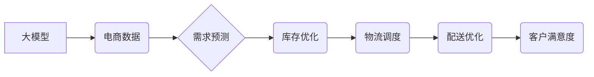

                 

## 探索基于大模型的电商智能供应链预测系统

> 关键词：大模型、电商供应链、预测系统、机器学习、深度学习、时间序列分析、自然语言处理

## 1. 背景介绍

在当今数据爆炸的时代，电商行业面临着日益激烈的竞争压力。高效、精准的供应链管理已成为企业核心竞争力的关键因素。传统的供应链预测系统往往依赖于历史数据和经验规则，难以应对市场变化的快速性和复杂性。近年来，大模型技术在自然语言处理、计算机视觉等领域取得了突破性进展，为电商智能供应链预测系统提供了新的机遇。

基于大模型的电商智能供应链预测系统能够利用海量数据，学习复杂的市场规律和商品需求模式，实现更精准、更灵活的预测，从而帮助企业优化库存管理、提高物流效率、降低运营成本，最终提升整体竞争力。

## 2. 核心概念与联系

### 2.1 核心概念

* **大模型 (Large Model):** 指参数量巨大、训练数据海量的人工智能模型，通常拥有强大的泛化能力和学习能力。
* **电商供应链:** 指从商品采购到最终用户配送的整个流程，包括采购、生产、仓储、物流、配送等环节。
* **智能预测:** 利用机器学习、深度学习等算法，对未来事件进行预测，并提供决策支持。

### 2.2 架构关系



## 3. 核心算法原理 & 具体操作步骤

### 3.1 算法原理概述

基于大模型的电商智能供应链预测系统通常采用以下核心算法：

* **时间序列分析:** 利用历史数据分析商品需求的趋势和季节性变化，预测未来需求。
* **机器学习:** 利用各种机器学习算法，例如线性回归、决策树、支持向量机等，从历史数据中学习预测模型。
* **深度学习:** 利用深度神经网络，例如循环神经网络 (RNN)、长短期记忆网络 (LSTM) 等，学习更复杂的非线性关系，提高预测精度。

### 3.2 算法步骤详解

1. **数据收集:** 收集电商平台的各种数据，包括商品销售数据、用户行为数据、市场趋势数据等。
2. **数据预处理:** 对收集到的数据进行清洗、转换、特征工程等处理，使其适合模型训练。
3. **模型选择:** 根据预测任务和数据特点，选择合适的算法模型。
4. **模型训练:** 利用训练数据训练模型，并进行参数调优。
5. **模型评估:** 利用测试数据评估模型的预测精度，并进行模型选择和优化。
6. **模型部署:** 将训练好的模型部署到生产环境中，用于实时预测。

### 3.3 算法优缺点

| 算法 | 优点 | 缺点 |
|---|---|---|
| 时间序列分析 | 简单易懂，易于实现 | 难以捕捉复杂非线性关系 |
| 机器学习 | 能够学习复杂的非线性关系 | 需要大量 labeled 数据 |
| 深度学习 | 能够学习更复杂的非线性关系，预测精度更高 | 需要大量数据和计算资源，训练时间长 |

### 3.4 算法应用领域

* **商品需求预测:** 预测未来商品需求量，帮助企业优化库存管理。
* **库存优化:** 根据预测需求，优化库存水平，降低库存成本。
* **物流调度:** 根据预测需求和物流信息，优化物流路线和配送时间。
* **配送优化:** 根据预测需求和配送信息，优化配送方式和配送员调度。

## 4. 数学模型和公式 & 详细讲解 & 举例说明

### 4.1 数学模型构建

基于时间序列分析的预测模型，通常采用 ARIMA 模型，其核心思想是利用过去的时间序列数据来预测未来的值。ARIMA 模型包含三个参数：p、d、q，分别代表自回归 (AR) 的阶数、差分 (I) 的阶数和移动平均 (MA) 的阶数。

### 4.2 公式推导过程

ARIMA 模型的预测公式如下：

$$
y_t = c + \phi_1 y_{t-1} + \phi_2 y_{t-2} + ... + \phi_p y_{t-p} + \theta_1 \epsilon_{t-1} + \theta_2 \epsilon_{t-2} + ... + \theta_q \epsilon_{t-q} + \epsilon_t
$$

其中：

* $y_t$ 是时间 t 的预测值
* $c$ 是截距项
* $\phi_i$ 是自回归系数
* $y_{t-i}$ 是时间 t-i 的历史值
* $\theta_i$ 是移动平均系数
* $\epsilon_i$ 是时间 t-i 的随机误差项

### 4.3 案例分析与讲解

假设我们想要预测某商品未来一周的需求量，并已收集到过去 12 周的需求数据。我们可以使用 ARIMA 模型进行预测。首先，需要确定 ARIMA 模型的参数 p、d、q。可以使用 ACF 和 PACF 图等方法进行参数选择。

假设最终确定 ARIMA(2,1,1) 模型，则模型的预测公式如下：

$$
y_t = c + \phi_1 y_{t-1} + \phi_2 y_{t-2} + \theta_1 \epsilon_{t-1} + \epsilon_t
$$

然后，利用历史数据训练模型，并根据训练好的模型参数进行预测。

## 5. 项目实践：代码实例和详细解释说明

### 5.1 开发环境搭建

* Python 3.7+
* TensorFlow/PyTorch
* scikit-learn
* pandas
* matplotlib

### 5.2 源代码详细实现

```python
import pandas as pd
from sklearn.model_selection import train_test_split
from sklearn.linear_model import LinearRegression
from sklearn.metrics import mean_squared_error

# 加载数据
data = pd.read_csv('sales_data.csv')

# 数据预处理
# ...

# 划分训练集和测试集
X_train, X_test, y_train, y_test = train_test_split(data[['feature1', 'feature2']], data['sales'], test_size=0.2)

# 创建线性回归模型
model = LinearRegression()

# 训练模型
model.fit(X_train, y_train)

# 预测测试集数据
y_pred = model.predict(X_test)

# 计算预测精度
mse = mean_squared_error(y_test, y_pred)
print(f'Mean Squared Error: {mse}')
```

### 5.3 代码解读与分析

* 代码首先加载销售数据，并进行必要的预处理，例如缺失值处理、特征工程等。
* 然后，将数据划分为训练集和测试集，用于模型训练和评估。
* 创建线性回归模型，并使用训练集数据进行模型训练。
* 利用训练好的模型预测测试集数据，并计算预测精度。

### 5.4 运行结果展示

运行结果展示预测精度，例如 Mean Squared Error (MSE)。

## 6. 实际应用场景

基于大模型的电商智能供应链预测系统已在一些电商平台得到应用，例如：

* **阿里巴巴:** 利用大模型预测商品需求，优化库存管理和物流调度。
* **京东:** 利用大模型预测用户购买行为，提供个性化商品推荐和促销活动。
* **亚马逊:** 利用大模型预测物流需求，优化配送路线和配送时间。

### 6.4 未来应用展望

未来，基于大模型的电商智能供应链预测系统将更加智能化、个性化和自动化。例如：

* **更精准的预测:** 利用更先进的深度学习算法和更丰富的预测数据，实现更精准的预测。
* **更个性化的服务:** 利用用户行为数据和市场趋势数据，为不同用户提供个性化的商品推荐和促销活动。
* **更自动化的运营:** 利用人工智能技术，实现供应链管理的自动化，例如自动生成采购订单、自动调度物流车辆等。

## 7. 工具和资源推荐

### 7.1 学习资源推荐

* **书籍:**
    * Deep Learning by Ian Goodfellow, Yoshua Bengio, and Aaron Courville
    * Hands-On Machine Learning with Scikit-Learn, Keras & TensorFlow by Aurélien Géron
* **在线课程:**
    * Coursera: Machine Learning by Andrew Ng
    * Udacity: Deep Learning Nanodegree

### 7.2 开发工具推荐

* **Python:** 
    * TensorFlow
    * PyTorch
    * scikit-learn
* **云平台:**
    * AWS
    * Azure
    * Google Cloud

### 7.3 相关论文推荐

* **Attention Is All You Need:** https://arxiv.org/abs/1706.03762
* **BERT: Pre-training of Deep Bidirectional Transformers for Language Understanding:** https://arxiv.org/abs/1810.04805

## 8. 总结：未来发展趋势与挑战

### 8.1 研究成果总结

基于大模型的电商智能供应链预测系统取得了显著的成果，能够实现更精准、更灵活的预测，帮助企业优化供应链管理，提升竞争力。

### 8.2 未来发展趋势

* **模型更深、更广:** 探索更深层次的深度学习模型，例如 Transformer、Graph Neural Network 等，并结合多模态数据，例如文本、图像、视频等，构建更强大的预测模型。
* **解释性更强:** 研究更具解释性的预测模型，能够解释预测结果背后的逻辑，提高用户信任度。
* **部署更灵活:** 研究更灵活的模型部署方式，例如边缘计算、微服务等，实现更实时、更低延迟的预测。

### 8.3 面临的挑战

* **数据质量:** 确保预测数据的质量和完整性，是构建准确预测模型的关键。
* **模型 interpretability:** 提高模型的解释性，帮助用户理解预测结果背后的逻辑，是未来研究的重要方向。
* **计算资源:** 训练大型模型需要大量的计算资源，如何降低训练成本，是需要解决的挑战。

### 8.4 研究展望

未来，基于大模型的电商智能供应链预测系统将继续发展，并应用于更广泛的领域，例如制造业、金融业等，为企业提供更智能、更高效的决策支持。

## 9. 附录：常见问题与解答

* **Q1: 如何选择合适的预测模型？**

A1: 选择合适的预测模型需要根据具体业务需求和数据特点进行分析。例如，如果数据具有明显的趋势性和季节性变化，可以使用 ARIMA 模型；如果数据具有复杂的非线性关系，可以使用深度学习模型。

* **Q2: 如何评估预测模型的精度？**

A2: 常见的评估指标包括 Mean Squared Error (MSE)、Root Mean Squared Error (RMSE)、Mean Absolute Error (MAE) 等。

* **Q3: 如何处理预测数据中的缺失值？**

A3: 可以使用多种方法处理缺失值，例如平均值填充、线性插值、KNN 填充等。

* **Q4: 如何提高模型的解释性？**

A4: 可以使用 LIME、SHAP 等方法解释模型的预测结果，帮助用户理解预测背后的逻辑。


作者：禅与计算机程序设计艺术 / Zen and the Art of Computer Programming 
<end_of_turn>

