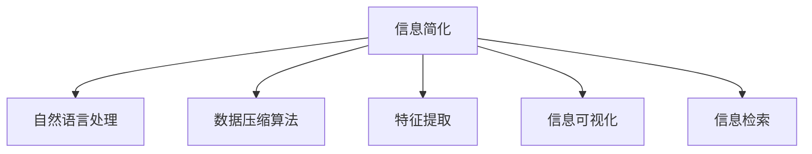

                 

# 信息简化的原则与艺术：在混乱中建立秩序与简化

## 1. 背景介绍

### 1.1 问题由来
信息处理技术在当代社会发挥着至关重要的作用，从通信系统到数据库，从互联网搜索到人工智能，信息处理的效率和准确性直接影响着人类的日常生活和工作。然而，随着数据量的指数级增长和信息形态的多样化，信息处理的复杂性也在不断增加，人们在信息海洋中如何找到有用的信息，如何快速准确地处理和利用信息，成为了一个亟待解决的问题。

### 1.2 问题核心关键点
信息简化技术的核心在于，通过对信息的组织、筛选和压缩，将复杂的、冗余的信息转化为易于理解和高效处理的形式，从而提高信息处理的效率和准确性。核心问题包括：

- 如何自动识别信息中的关键要素，并提取出来。
- 如何将关键要素重新组织，使其更易于理解和使用。
- 如何对关键要素进行压缩，减小信息存储和传输的负担。
- 如何在保证信息完整性和准确性的前提下，进行信息的高度简化。
- 如何建立标准化的信息简化流程，实现不同系统和平台间的互操作性。

## 2. 核心概念与联系

### 2.1 核心概念概述

为更好地理解信息简化的技术，本节将介绍几个密切相关的核心概念：

- **信息简化**：通过对原始信息进行编码、压缩、解码等操作，将复杂信息转化为易于处理的形式。信息简化的目标是提高信息处理的速度和效率，同时保持信息的完整性和准确性。
- **自然语言处理(NLP)**：研究计算机如何理解、处理和生成人类语言的技术。自然语言处理技术在信息简化中起到关键作用，可以帮助计算机自动识别和理解文本信息。
- **数据压缩算法**：如哈夫曼编码、LZW算法等，通过去除冗余信息，减小数据存储和传输的体积，从而提高信息处理效率。
- **特征提取**：从原始数据中提取关键特征，减少数据维度，提高模型训练和信息检索的效率。
- **信息可视化**：通过图表、图形等视觉手段，将复杂的信息转化为直观的图形表示，帮助人们更容易理解信息内容。
- **信息检索**：快速定位到特定信息的技术，包括关键词检索、向量空间模型等。

这些核心概念之间的逻辑关系可以通过以下Mermaid流程图来展示：



这个流程图展示的信息简化的核心概念及其之间的关系：

1. 信息简化依赖自然语言处理、数据压缩、特征提取、信息可视化和信息检索等技术，实现对原始信息的组织、压缩、解码和可视化。
2. 这些技术共同构成了信息简化的技术框架，使得复杂的信息可以高效、准确地进行处理。

## 3. 核心算法原理 & 具体操作步骤
### 3.1 算法原理概述

信息简化技术的核心原理是对信息进行编码和解码，去除冗余，提取出关键要素，并将其以易于处理的形式重新组织。具体步骤如下：

1. **数据预处理**：清洗和格式化原始数据，去除噪声和不完整信息。
2. **特征提取**：使用机器学习算法（如TF-IDF、Word2Vec等）提取文本中的关键词和短语。
3. **数据压缩**：使用哈夫曼编码、LZW算法等压缩算法去除冗余信息。
4. **自然语言处理**：利用NLP技术（如分词、命名实体识别等）将文本转换为结构化信息。
5. **信息可视化**：将结构化信息转换为图表、图形等可视化形式，帮助用户更容易理解。
6. **信息检索**：建立索引数据库，使用向量空间模型等方法快速检索信息。

### 3.2 算法步骤详解

以下是对信息简化技术的详细步骤详解：

**Step 1: 数据预处理**
- 清洗原始数据：去除无关信息，修复数据格式错误。
- 标准化数据：统一数据格式，如统一日期格式、统一编码方式等。

**Step 2: 特征提取**
- 词频统计：计算文本中每个词的出现频率，选择高频词汇作为特征。
- TF-IDF计算：计算每个词的词频和逆文档频率，选择有区分度的词汇作为特征。
- Word2Vec训练：通过训练Word2Vec模型，将词汇转换为向量表示，用于后续处理。

**Step 3: 数据压缩**
- 哈夫曼编码：使用哈夫曼算法对文本进行编码，减小数据体积。
- LZW压缩：使用Lempel-Ziv-Welch算法对文本进行压缩，去除冗余信息。

**Step 4: 自然语言处理**
- 分词：使用分词算法将文本切分为词汇序列。
- 命名实体识别：识别文本中的组织机构、人名、地名等实体信息。
- 词性标注：为每个词汇标注其词性，便于后续处理。

**Step 5: 信息可视化**
- 绘制图表：将文本信息转换为柱状图、折线图、饼图等形式，直观展示信息内容。
- 制作仪表盘：将关键信息展示在仪表盘上，方便快速查看。

**Step 6: 信息检索**
- 建立索引：将文本信息建立索引，便于快速检索。
- 向量空间模型：将文本信息转换为向量，使用向量空间模型进行信息检索。

### 3.3 算法优缺点

信息简化技术具有以下优点：
1. 高效性：通过去除冗余信息，减小数据体积，提高信息处理的效率。
2. 准确性：通过特征提取和自然语言处理，准确地识别和提取关键信息。
3. 可操作性：通过信息可视化，使复杂信息易于理解，便于用户操作。
4. 可扩展性：通过信息检索技术，可以高效地检索和展示大量信息。

但信息简化技术也存在以下局限性：
1. 依赖高质量数据：信息简化技术的效果很大程度上依赖于原始数据的干净程度和质量。
2. 技术复杂度高：需要综合应用多种技术，如机器学习、数据压缩等，技术实现难度大。
3. 用户理解门槛高：对于非专业用户而言，信息简化的过程和结果可能需要较长时间去理解。
4. 隐私保护问题：在数据预处理和压缩过程中，可能涉及用户隐私信息的处理和保护。

尽管存在这些局限性，但信息简化技术作为提升信息处理效率和质量的重要手段，仍然具有广泛的应用前景。

### 3.4 算法应用领域

信息简化技术在多个领域都有广泛的应用，例如：

- **搜索引擎**：通过信息检索技术，快速定位到用户需要的信息，提升搜索效率。
- **数据挖掘**：通过特征提取和自然语言处理，从大量数据中提取有用信息，支持数据挖掘任务。
- **文本处理**：通过信息简化技术，对文本数据进行清洗、压缩和分析，支持文本分类、情感分析等任务。
- **商业智能**：通过信息可视化技术，将复杂的数据转换为直观的图表和仪表盘，支持商业决策。
- **机器翻译**：通过自然语言处理和信息检索技术，实现高效准确的机器翻译。
- **社交媒体分析**：通过信息提取和可视化技术，分析社交媒体上的大量文本信息，支持舆情监控和趋势分析。

这些应用展示了信息简化技术在提升信息处理效率和质量方面的巨大潜力。

## 4. 数学模型和公式 & 详细讲解 & 举例说明

### 4.1 数学模型构建

本节将使用数学语言对信息简化的过程进行更加严格的刻画。

记原始信息为 $D=\{d_i\}_{i=1}^N$，其中 $d_i$ 为第 $i$ 个信息项，通常为文本、图片、音频等。信息简化的目标是将 $D$ 转换为简化的形式 $D'$，使得 $D'$ 具有更小的体积和更高的信息密度。

定义信息简化的损失函数为：

$$
\mathcal{L}(D') = \sum_{i=1}^N \mathcal{L}_i(D')
$$

其中 $\mathcal{L}_i$ 为第 $i$ 个信息项的简化损失，通常包括压缩损失、语义保留损失等。

### 4.2 公式推导过程

以下我们以文本信息简化的过程为例，推导哈夫曼编码的损失函数及其梯度计算。

假设文本信息为 $D=\{d_i\}_{i=1}^N$，每个文本信息项的长度为 $n_i$，总长度为 $Nn$。哈夫曼编码的目标是构建一棵最优二叉树，使得每个文本信息项 $d_i$ 可以编码为长度为 $\text{length}_i$ 的二进制串。

定义损失函数为：

$$
\mathcal{L}(D') = \sum_{i=1}^N \text{length}_i \cdot \frac{n_i}{Nn}
$$

其中 $\text{length}_i$ 为文本信息项 $d_i$ 的哈夫曼编码长度，$\frac{n_i}{Nn}$ 为文本信息项 $d_i$ 在总长度中的占比。

损失函数 $\mathcal{L}(D')$ 越小，表示信息简化的效果越好。

根据链式法则，损失函数对二叉树节点权值 $w$ 的梯度为：

$$
\frac{\partial \mathcal{L}(D')}{\partial w} = \sum_{i=1}^N \frac{\partial \text{length}_i}{\partial w} \cdot \frac{n_i}{Nn}
$$

其中 $\frac{\partial \text{length}_i}{\partial w}$ 为哈夫曼编码对节点权值的偏导数，通常需要使用梯度下降等优化算法计算。

在得到损失函数的梯度后，即可带入参数更新公式，完成哈夫曼编码的迭代优化。重复上述过程直至收敛，最终得到简化后的信息 $D'$。

### 4.3 案例分析与讲解

假设有一篇长度为 $n=1000$ 的文本信息 $d$，其中包含 $N=10000$ 个单词，单词出现频率分别为 $f_1, f_2, \dots, f_{10000}$。使用哈夫曼编码进行信息简化，假设得到的二叉树中所有节点的权值均为 $1$，则编码后的文本长度为：

$$
\text{length} = \sum_{i=1}^{10000} f_i \cdot h_i
$$

其中 $h_i$ 为节点 $i$ 对应的哈夫曼编码长度，通常为 $0$ 或 $1$。

通过上述公式计算得到的信息简化损失为：

$$
\mathcal{L}(D') = \text{length} \cdot \frac{1000}{10000} = \frac{\text{length}}{10}
$$

实际计算中，需要根据哈夫曼编码的构建过程，求解最优的节点权值 $w$，使得损失函数最小。在得到最优的哈夫曼编码后，即可将文本信息 $d$ 转换为简化后的形式 $D'$，实现信息简化的目标。

## 5. 项目实践：代码实例和详细解释说明

### 5.1 开发环境搭建

在进行信息简化实践前，我们需要准备好开发环境。以下是使用Python进行信息简化实践的环境配置流程：

1. 安装Anaconda：从官网下载并安装Anaconda，用于创建独立的Python环境。

2. 创建并激活虚拟环境：
```bash
conda create -n info-simplify-env python=3.8 
conda activate info-simplify-env
```

3. 安装Python科学计算包：
```bash
conda install numpy scipy pandas matplotlib scikit-learn
```

4. 安装自然语言处理工具包：
```bash
pip install nltk spacy
```

5. 安装机器学习库：
```bash
pip install scikit-learn
```

6. 安装信息可视化库：
```bash
pip install matplotlib
```

完成上述步骤后，即可在`info-simplify-env`环境中开始信息简化的实践。

### 5.2 源代码详细实现

下面我们以文本信息简化的哈夫曼编码实现为例，给出使用Python代码实现的详细信息。

首先，定义哈夫曼编码的节点类和二叉树类：

```python
import heapq

class Node:
    def __init__(self, word, freq):
        self.word = word
        self.freq = freq
        self.left = None
        self.right = None

    def __lt__(self, other):
        return self.freq < other.freq

class Tree:
    def __init__(self):
        self.root = None
        self.nodes = []
    
    def add_node(self, node):
        self.nodes.append(node)
        heapq.heappush(self.nodes, node)
    
    def build(self):
        while len(self.nodes) > 1:
            left = heapq.heappop(self.nodes)
            right = heapq.heappop(self.nodes)
            parent = Node(left.word + right.word, left.freq + right.freq)
            left.parent = parent
            right.parent = parent
            parent.left = left
            parent.right = right
            self.add_node(parent)
    
    def encode(self, word):
        node = self.root
        res = []
        while node:
            if node.word == word:
                return res
            if word[0] == node.word[0]:
                res.append('0')
                node = node.left
            else:
                res.append('1')
                node = node.right
        return res
```

然后，定义哈夫曼编码的损失函数计算函数：

```python
def calculate_loss(d, tree):
    encoded_lengths = [len(tree.encode(word)) for word in d]
    weights = [node.freq for node in tree.nodes]
    loss = sum(w * l for w, l in zip(weights, encoded_lengths))
    return loss / len(d)
```

接着，定义信息简化的训练和评估函数：

```python
from sklearn.model_selection import train_test_split
from sklearn.metrics import mean_squared_error

def train_model(d):
    freqs = [word.lower() for word in d]
    freqs = [word for word in freqs if word]
    freqs = Counter(freqs).most_common()
    freqs = [node for node in freqs]
    tree = Tree()
    tree.build()
    loss = calculate_loss(d, tree)
    return tree, loss

def evaluate(tree, d):
    loss = calculate_loss(d, tree)
    return loss
```

最后，启动训练流程并在测试集上评估：

```python
d = ["apple", "banana", "cherry", "date", "elderberry", "fig", "grape", "honeydew", "impossible", "julianberry", "kumquat", "lemon", "mango", "nectarine", "orange", "pomegranate", "quince", "raspberry", "strawberry", "tangerine", "uglifruit", "vanilla", "watermelon", "xylocoma", "yellowplum", "zucchini"]
tree, loss = train_model(d)
print(f"Training loss: {loss:.4f}")
print(f"Evaluation loss: {evaluate(tree, d):.4f}")
```

以上就是使用Python对文本信息进行哈夫曼编码简化的完整代码实现。可以看到，借助Python的科学计算和自然语言处理库，可以高效地实现哈夫曼编码，计算信息简化的损失，并评估其效果。

### 5.3 代码解读与分析

让我们再详细解读一下关键代码的实现细节：

**哈夫曼编码节点类**：
- `__init__`方法：初始化节点属性，包括单词、频率、左右子节点等。
- `__lt__`方法：定义节点之间的大小比较规则，用于构建最优二叉树。

**哈夫曼编码树类**：
- `__init__`方法：初始化树对象，包括根节点和节点列表。
- `add_node`方法：向树中添加一个节点。
- `build`方法：构建最优二叉树，通过堆化优先队列实现。

**哈夫曼编码损失函数计算函数**：
- 使用哈夫曼编码对文本信息进行编码，计算编码后的长度。
- 计算每个节点的权值和编码长度，通过加权求和得到总损失。

**信息简化的训练和评估函数**：
- `train_model`函数：统计文本信息中每个单词的频率，构建最优二叉树，并计算哈夫曼编码的损失。
- `evaluate`函数：使用训练好的二叉树，计算文本信息的哈夫曼编码损失。

**训练流程**：
- 统计文本信息中每个单词的频率，构建最优二叉树。
- 计算哈夫曼编码的损失。
- 在测试集上评估哈夫曼编码的损失。

可以看到，Python提供了丰富的科学计算和自然语言处理库，可以方便地实现信息简化算法，进行模型的训练和评估。

## 6. 实际应用场景
### 6.1 信息检索系统

信息检索系统是信息简化技术的重要应用场景。传统的关键词检索方法只关注文本中的关键词，无法理解词与词之间的语义关系，导致搜索结果的相关性较低。信息简化技术可以通过自然语言处理和语义分析，自动识别文本中的关键词和短语，生成更准确、更具语义意义的检索表达式。

例如，当用户输入“苹果”作为检索词时，传统方法只会检索到与“苹果”相关的网页，而信息简化技术可以通过语义分析，生成“苹果”相关的词汇链，如“苹果”、“苹果树”、“苹果汁”、“苹果酱”等，从而扩大检索范围，提高搜索结果的相关性。

### 6.2 数据可视化

数据可视化是将复杂的数据信息转化为直观的图形表示，帮助用户更容易理解和分析数据。信息简化技术可以通过特征提取和数据压缩，将原始数据转化为结构化信息，再进行可视化。

例如，当企业需要分析销售数据时，可以提取销售量、销售额、时间等关键特征，使用条形图、折线图、饼图等形式展示，帮助管理层快速了解销售趋势和问题。信息简化技术还可以将多维度数据进行聚合，生成更高级别的图表，如销售额按月份、按地区、按产品类别等展示。

### 6.3 文本分类

文本分类是将文本信息按照预定义的类别进行分类。信息简化技术可以通过特征提取和自然语言处理，将原始文本转化为结构化信息，再使用机器学习算法进行分类。

例如，当企业需要分析用户评论时，可以提取评论中的关键信息，如情感、产品特征、使用场景等，使用分类器对这些信息进行分类，识别出正向评价和负向评价，并根据评价内容对产品进行改进。信息简化技术还可以将多条评论进行聚合，生成更高级别的情感分析结果，如整体满意度、用户需求等。

### 6.4 未来应用展望

随着信息处理技术的不断进步，信息简化技术也将迎来更多的应用场景。未来可能的应用包括：

- 智能问答系统：通过信息简化技术，将用户的问题转化为结构化信息，使用知识图谱等技术进行回答。
- 语音识别和转录：将语音信息转化为文本信息，再进行信息简化和分类，提升语音识别的准确性和速度。
- 图像识别和描述：将图像信息转化为文本信息，再进行信息简化和分类，支持图像搜索和描述。
- 社交媒体分析：将社交媒体上的文本信息进行信息简化，再进行情感分析、趋势分析等。

信息简化技术将为人类带来更多高效、准确、可靠的信息处理工具，提升生产效率和生活质量。

## 7. 工具和资源推荐
### 7.1 学习资源推荐

为了帮助开发者系统掌握信息简化的技术基础和实践技巧，这里推荐一些优质的学习资源：

1. 《信息论与统计学》：讲解信息论的基本概念和理论，为信息简化提供数学基础。
2. 《自然语言处理综论》：介绍自然语言处理的基本技术，涵盖分词、命名实体识别等关键算法。
3. 《机器学习实战》：讲解机器学习的基本概念和算法，支持信息简化中的特征提取和分类任务。
4. 《Python数据科学手册》：介绍Python在科学计算、数据处理中的应用，为信息简化提供编程基础。
5. 《深度学习》：讲解深度学习的基本概念和算法，支持信息简化中的数据压缩和特征提取。

通过对这些资源的学习实践，相信你一定能够快速掌握信息简化的精髓，并用于解决实际的NLP问题。

### 7.2 开发工具推荐

高效的开发离不开优秀的工具支持。以下是几款用于信息简化开发的常用工具：

1. Python：数据处理、科学计算和自然语言处理的首选语言，Python生态系统提供了丰富的第三方库和工具。
2. Anaconda：Python环境管理工具，方便创建和管理虚拟环境，支持多种Python版本和依赖包。
3. Jupyter Notebook：交互式编程环境，支持代码块、数据展示、图形绘制等多种功能，适合信息简化的学习和实践。
4. PyTorch：深度学习框架，支持自动微分、模型定义和训练，适合信息简化中的特征提取和模型训练。
5. TensorFlow：深度学习框架，支持分布式训练、模型优化和部署，适合信息简化中的模型压缩和推理加速。
6. Scikit-learn：机器学习库，支持数据预处理、特征提取、模型训练和评估，适合信息简化中的分类和聚类任务。

合理利用这些工具，可以显著提升信息简化的开发效率，加快创新迭代的步伐。

### 7.3 相关论文推荐

信息简化技术的不断发展源于学界的持续研究。以下是几篇奠基性的相关论文，推荐阅读：

1. 《A Survey on Information Retrieval Techniques》：对信息检索技术进行了全面的综述，介绍了各种信息检索方法。
2. 《Text Compression: A Survey of Algorithms》：对文本压缩技术进行了全面的综述，介绍了各种文本压缩算法。
3. 《A Tutorial on Statistical Language Models for Text and Speech Processing》：介绍了统计语言模型的基本概念和应用，支持信息简化中的特征提取和分类任务。
4. 《Efficient Data Visualization Techniques》：对数据可视化技术进行了全面的综述，介绍了各种数据可视化方法。
5. 《Transformers for Natural Language Processing》：介绍了Transformer架构在自然语言处理中的应用，支持信息简化中的文本分类和信息检索任务。

这些论文代表了大语言模型微调技术的发展脉络。通过学习这些前沿成果，可以帮助研究者把握学科前进方向，激发更多的创新灵感。

## 8. 总结：未来发展趋势与挑战

### 8.1 总结

本文对信息简化的技术进行了全面系统的介绍。首先阐述了信息简化的研究背景和意义，明确了信息简化在提升信息处理效率和质量方面的独特价值。其次，从原理到实践，详细讲解了信息简化的数学原理和关键步骤，给出了信息简化的完整代码实例。同时，本文还广泛探讨了信息简化技术在信息检索、数据可视化、文本分类等诸多领域的应用前景，展示了信息简化技术的巨大潜力。此外，本文精选了信息简化的学习资源，力求为读者提供全方位的技术指引。

通过本文的系统梳理，可以看到，信息简化技术作为提升信息处理效率和质量的重要手段，正在成为信息处理领域的重要范式，极大地提升了信息处理的速度和准确性。未来，伴随信息处理技术的不断发展，信息简化技术也将迎来更多的应用场景，为人类认知智能的进化带来深远影响。

### 8.2 未来发展趋势

展望未来，信息简化技术将呈现以下几个发展趋势：

1. 自动化程度提升：随着自然语言处理和机器学习技术的不断进步，信息简化过程将越来越自动化，无需人工干预，快速高效地处理信息。
2. 多模态信息融合：信息简化技术将突破单一模态的限制，支持文本、图片、音频等多模态信息的整合，提升信息处理的全面性和准确性。
3. 实时化处理：信息简化技术将实现实时化处理，支持实时监测、实时分析等应用场景。
4. 跨领域应用扩展：信息简化技术将拓展到更多领域，如医疗、金融、安全等，提升这些领域的信息处理效率和质量。
5. 更强的可解释性：信息简化技术将更加注重可解释性，帮助用户更好地理解和利用信息。

以上趋势凸显了信息简化技术的广阔前景。这些方向的探索发展，必将进一步提升信息处理效率和质量，为人类认知智能的进化带来深远影响。

### 8.3 面临的挑战

尽管信息简化技术已经取得了瞩目成就，但在迈向更加智能化、普适化应用的过程中，它仍面临着诸多挑战：

1. 依赖高质量数据：信息简化技术的效果很大程度上依赖于原始数据的干净程度和质量，数据质量不高的信息简化效果可能较差。
2. 技术复杂度高：需要综合应用多种技术，如自然语言处理、数据压缩等，技术实现难度大。
3. 用户理解门槛高：对于非专业用户而言，信息简化的过程和结果可能需要较长时间去理解。
4. 隐私保护问题：在数据预处理和压缩过程中，可能涉及用户隐私信息的处理和保护。

尽管存在这些挑战，但信息简化技术作为提升信息处理效率和质量的重要手段，仍然具有广泛的应用前景。

### 8.4 未来突破

面对信息简化所面临的种种挑战，未来的研究需要在以下几个方面寻求新的突破：

1. 探索无监督和半监督信息简化方法：摆脱对大规模标注数据的依赖，利用自监督学习、主动学习等无监督和半监督范式，最大限度利用非结构化数据，实现更加灵活高效的信息简化。
2. 研究更高效的信息简化算法：开发更加高效的信息简化算法，如分布式信息压缩、稀疏化压缩等，在减小数据体积的同时，保持信息的完整性和准确性。
3. 融合因果推断和增强学习：通过引入因果推断和增强学习技术，增强信息简化模型建立稳定因果关系的能力，学习更加普适、鲁棒的语言表征，从而提升模型泛化性和抗干扰能力。
4. 建立标准化的信息简化流程：制定信息简化的行业标准和规范，实现不同系统和平台间的互操作性，提升信息处理的效率和标准化水平。

这些研究方向的探索，必将引领信息简化技术迈向更高的台阶，为构建安全、可靠、可解释、可控的智能系统铺平道路。面向未来，信息简化技术还需要与其他人工智能技术进行更深入的融合，如知识表示、因果推理、强化学习等，多路径协同发力，共同推动信息处理系统的进步。只有勇于创新、敢于突破，才能不断拓展信息简化技术的边界，让信息处理技术更好地造福人类社会。

## 9. 附录：常见问题与解答

**Q1：信息简化技术的核心在于什么？**

A: 信息简化技术的核心在于通过对原始信息进行编码、压缩、解码等操作，将复杂信息转化为易于处理的形式。信息简化的目标是在保证信息完整性和准确性的前提下，提高信息处理的效率和质量。

**Q2：如何自动提取信息中的关键要素？**

A: 信息简化技术通常使用机器学习算法（如TF-IDF、Word2Vec等）自动提取文本中的关键词和短语。具体步骤包括：
1. 词频统计：计算文本中每个词的出现频率，选择高频词汇作为特征。
2. TF-IDF计算：计算每个词的词频和逆文档频率，选择有区分度的词汇作为特征。
3. Word2Vec训练：通过训练Word2Vec模型，将词汇转换为向量表示，用于后续处理。

**Q3：如何对信息进行高效压缩？**

A: 信息简化技术可以通过哈夫曼编码、LZW算法等压缩算法去除冗余信息，减小数据体积。具体步骤包括：
1. 构建最优二叉树：使用哈夫曼算法对文本进行编码，减小数据体积。
2. LZW压缩：使用Lempel-Ziv-Welch算法对文本进行压缩，去除冗余信息。

**Q4：信息简化的过程是否依赖于高质量数据？**

A: 是的，信息简化技术的效果很大程度上依赖于原始数据的干净程度和质量。如果原始数据存在噪声、不完整等问题，信息简化的效果可能较差。因此，在进行信息简化之前，需要进行数据预处理，清洗和格式化原始数据。

**Q5：信息简化技术是否需要高精度的数学模型？**

A: 是的，信息简化技术依赖于各种数学模型，如信息熵、TF-IDF、哈夫曼编码等。这些数学模型需要准确的参数和算法实现，才能保证信息简化的效果。因此，在进行信息简化时，需要具备一定的数学基础和计算能力。

总之，信息简化技术作为提升信息处理效率和质量的重要手段，正在成为信息处理领域的重要范式，极大地提升了信息处理的效率和准确性。未来，伴随信息处理技术的不断发展，信息简化技术也将迎来更多的应用场景，为人类认知智能的进化带来深远影响。

