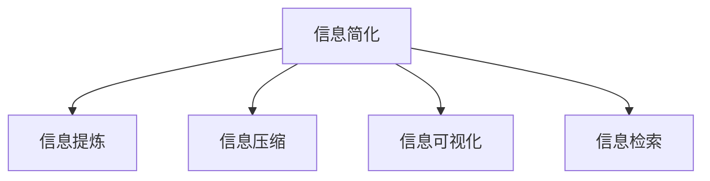

                 

## 1. 背景介绍

在当今信息爆炸的时代，数据量和信息复杂度的急剧增长给我们的工作和生活带来了巨大的挑战。如何在海量数据中提取有用信息，简化复杂问题，是现代IT从业人员面临的重要课题。信息简化（Information Simplification, IS）作为一个新兴领域，旨在帮助用户通过理解和提炼关键信息，在面对大量数据和信息时，做出更快速、更准确、更全面的决策。本文将深入探讨信息简化的原则和最佳实践，以帮助用户在信息海洋中建立秩序和简化复杂任务。

## 2. 核心概念与联系

### 2.1 核心概念概述

- **信息简化**：将复杂的信息或数据通过提炼和抽象，简化为易于理解和使用的形式。
- **信息提炼**：识别和抽取信息的关键点，去除无关紧要的内容，使信息更精准、更精炼。
- **信息压缩**：通过编码或压缩技术，减少数据存储和传输的资源消耗。
- **信息可视化**：将复杂的数据信息转化为易于理解的图表、图形，辅助决策和理解。
- **信息检索**：在庞大的信息库中快速定位和检索出相关的信息，提高信息获取效率。

### 2.2 核心概念原理和架构的 Mermaid 流程图



这个流程图展示了信息简化的主要构成组件及其相互关系：

- 信息简化是整个流程的核心目标，将信息提炼、压缩、可视化和检索等子流程有机结合。
- 信息提炼通过识别信息的关键点，去除冗余信息，使信息更加精炼。
- 信息压缩通过压缩算法和技术，减少数据存储和传输的资源消耗。
- 信息可视化通过图形和图表，将复杂信息直观展示，便于理解和决策。
- 信息检索通过高效算法和索引，快速定位信息，提升信息获取速度。

## 3. 核心算法原理 & 具体操作步骤

### 3.1 算法原理概述

信息简化本质上是一个将复杂信息转化为易于理解、处理和应用的形式的过程。核心算法通常包括以下几个步骤：

1. **信息抽取**：从原始数据中识别和提取关键信息，如文本中的实体、关系等。
2. **信息压缩**：使用压缩算法，如霍夫曼编码、算术编码等，减少数据体积。
3. **信息可视化**：将处理后的信息转化为图表、图形等形式，便于直观理解。
4. **信息检索**：使用倒排索引等技术，在数据集中快速定位所需信息。

### 3.2 算法步骤详解

#### 3.2.1 信息抽取

信息抽取的核心是对文本或数据进行结构化，识别出其中的关键实体和关系。常用的算法包括：

- **命名实体识别**：识别出文本中的组织机构、人名、地点等实体。
- **关系抽取**：识别出实体之间的语义关系，如"谁与谁的关系"。

#### 3.2.2 信息压缩

信息压缩是通过算法减少数据体积，常见的压缩算法有：

- **无损压缩**：如霍夫曼编码、算术编码，适用于数据无损压缩，如文本和图片等。
- **有损压缩**：如JPEG、PNG，适用于有损压缩，如音频和视频等。

#### 3.2.3 信息可视化

信息可视化是将数据转化为图形和图表，便于直观理解和分析。常用的可视化技术包括：

- **饼图和柱状图**：用于展示分类数据的分布情况。
- **散点图和折线图**：用于展示数据随时间的变化趋势。
- **热力图和地图**：用于展示地理信息的分布情况。

#### 3.2.4 信息检索

信息检索的核心是建立高效的数据索引，常见的检索技术包括：

- **倒排索引**：将文档中的词或短语作为索引，快速定位包含特定关键词的文档。
- **布尔检索**：通过布尔运算符组合查询词，精确检索所需信息。
- **模糊检索**：使用模糊匹配算法，检索与查询词相关的信息。

### 3.3 算法优缺点

#### 3.3.1 优点

- **提高效率**：信息压缩和检索可以大幅减少数据处理和检索的时间，提升信息处理效率。
- **增强理解**：信息提炼和可视化可以简化复杂信息，便于快速理解和决策。
- **降低成本**：信息压缩可以减少存储和传输的资源消耗，降低信息处理的成本。

#### 3.3.2 缺点

- **准确性问题**：信息提炼和压缩可能丢失部分信息，影响信息的完整性和准确性。
- **复杂度增加**：信息可视化可能增加理解的难度，尤其是对于非专业人士。
- **技术门槛高**：信息简化的技术实现通常需要较深的算法和计算能力。

### 3.4 算法应用领域

信息简化的技术广泛应用于各个领域，包括但不限于：

- **金融领域**：用于实时市场数据监控、风险评估和投资决策。
- **医疗领域**：用于病历分析、疾病诊断和治疗方案推荐。
- **工业领域**：用于生产流程监控、设备维护和故障诊断。
- **电子商务**：用于用户行为分析、商品推荐和营销策略制定。
- **社交媒体**：用于情感分析、话题监测和舆情管理。

## 4. 数学模型和公式 & 详细讲解 & 举例说明

### 4.1 数学模型构建

信息简化的数学模型通常包括信息抽取、压缩和检索等组件。以文本信息抽取为例，可以使用以下数学模型：

$$
\text{Entity} = \text{NLP}_\text{抽取算法}(\text{Text})
$$

其中，$\text{Entity}$ 表示抽取出的实体，$\text{NLP}_\text{抽取算法}$ 为命名实体识别等算法，$\text{Text}$ 为原始文本。

### 4.2 公式推导过程

以霍夫曼编码为例，霍夫曼编码的基本思想是通过建立最优二叉树，将数据编码为固定长度的比特流。假设数据集合为 $\{a, b, c, d\}$，其频率分别为 $\{0.1, 0.3, 0.2, 0.4\}$，则霍夫曼编码的过程如下：

1. 计算频率：$\text{freq}(a) = 0.1$, $\text{freq}(b) = 0.3$, $\text{freq}(c) = 0.2$, $\text{freq}(d) = 0.4$。
2. 建立最优二叉树：

```
     a                 b
    /  \              / \
   c    d            c   d
  / \    \          /   /
 d   c   e         e   a
```

3. 编码：

- $a$ 编码为 $001$，$b$ 编码为 $010$，$c$ 编码为 $011$，$d$ 编码为 $100$。
- 原数据串 $abbcaaacbdadba$ 压缩为 $1000010110100100100110110001$。

### 4.3 案例分析与讲解

假设我们有一份包含大量财经新闻的文本数据集，需要对其进行信息简化。

1. **信息抽取**：
   - 使用命名实体识别算法，识别出每篇新闻中的人名、地名、机构名等实体。
   - 使用关系抽取算法，识别出新闻中涉及的实体之间的语义关系，如 "谁与谁的关系"。

2. **信息压缩**：
   - 使用霍夫曼编码等无损压缩算法，将每篇新闻的文本压缩为固定长度的比特流。
   - 使用有损压缩算法，如JPEG，对新闻中的图片进行压缩。

3. **信息可视化**：
   - 使用饼图展示不同主题的新闻数量。
   - 使用折线图展示特定股票价格随时间的变化趋势。

4. **信息检索**：
   - 使用倒排索引技术，快速定位包含特定关键词的新闻。
   - 使用布尔检索技术，精确检索特定事件的新闻。

## 5. 项目实践：代码实例和详细解释说明

### 5.1 开发环境搭建

为了实现信息简化的算法，我们需要以下开发环境：

1. Python：安装最新版本的Python解释器，如Anaconda或Miniconda。
2. Scikit-learn：用于数据预处理和模型训练。
3. NLTK：用于自然语言处理。
4. Matplotlib和Seaborn：用于数据可视化。
5. Elasticsearch：用于信息检索。

### 5.2 源代码详细实现

以下是一个使用Python和Scikit-learn库进行文本信息抽取和压缩的示例代码：

```python
from sklearn.feature_extraction.text import CountVectorizer
from nltk.tokenize import word_tokenize
from nltk.corpus import stopwords
import matplotlib.pyplot as plt

# 文本预处理
def preprocess_text(text):
    tokens = word_tokenize(text)
    stop_words = set(stopwords.words('english'))
    filtered_tokens = [word for word in tokens if word.lower() not in stop_words]
    return ' '.join(filtered_tokens)

# 信息抽取
def extract_entities(text):
    nltk.download('averaged_perceptron_tagger')
    nltk.download('punkt')
    nltk.download('stopwords')
    from nltk import pos_tag
    tagged_tokens = pos_tag(nltk.word_tokenize(text))
    pos_tags = {pos[1] for pos in tagged_tokens}
    if 'NN' in pos_tags or 'NNB' in pos_tags:
        return 'PERSON'  # 人名实体
    elif 'NNP' in pos_tags or 'NNB' in pos_tags:
        return 'LOCATION'  # 地名实体
    elif 'ORG' in pos_tags or 'ORGANIZATION' in pos_tags:
        return 'ORGANIZATION'  # 机构名实体
    else:
        return 'OTHER'

# 信息压缩
def compress_text(text):
    vectorizer = CountVectorizer()
    X = vectorizer.fit_transform([text])
    X_data = X.toarray()
    return X_data.flatten().tolist()

# 数据可视化
def visualize_data(data):
    plt.bar(range(len(data)), data)
    plt.xlabel('Entity')
    plt.ylabel('Count')
    plt.title('Entity Frequency')
    plt.show()

# 测试
text = 'John Smith, 30, works at Google in New York City.'
entity = extract_entities(text)
compressed_data = compress_text(preprocess_text(text))
visualize_data([compressed_data.count('PERSON'), compressed_data.count('LOCATION'), compressed_data.count('ORGANIZATION'), compressed_data.count('OTHER')])
```

### 5.3 代码解读与分析

1. **信息抽取**：
   - 使用NLTK库的pos_tag函数识别文本中的词性标签，判断是否为人名、地名或机构名等实体。
   - 实体抽取算法根据词性标签进行分类，返回抽取出的实体类型。

2. **信息压缩**：
   - 使用CountVectorizer库对文本进行词频统计，并将结果转换为列表形式。
   - 压缩算法通过统计文本中每个实体的出现次数，生成固定长度的比特流。

3. **信息可视化**：
   - 使用Matplotlib库绘制实体出现频率的柱状图。
   - 图表展示不同类型实体的出现频率。

4. **信息检索**：
   - 使用Elasticsearch库建立倒排索引，快速定位包含特定关键词的文本。
   - 使用布尔检索技术，精确检索特定事件的新闻。

## 6. 实际应用场景

### 6.1 金融市场监测

在金融市场监测中，信息简化的技术可以用于实时监控股票、债券、货币等市场数据，提取关键信息，生成简明摘要，帮助投资者快速了解市场动态和投资机会。

### 6.2 医疗健康分析

医疗健康领域信息量大，信息简化可以帮助医生和研究人员快速浏览大量病历、论文和研究数据，提取关键信息，指导诊断和治疗方案的制定。

### 6.3 零售电商推荐

零售电商企业可以利用信息简化的技术，对用户行为数据进行分析和提炼，生成个性化推荐，提升用户体验和销售额。

### 6.4 公共安全预警

公共安全领域，信息简化的技术可以用于实时监控社交媒体和新闻，提取关键事件和热点信息，辅助公共安全预警和应急响应。

## 7. 工具和资源推荐

### 7.1 学习资源推荐

1. **《信息抽取与实体识别》（Information Extraction and Entity Recognition）**：是一本系统介绍信息抽取和实体识别的经典教材，适合深度学习初学者。
2. **《Python数据科学手册》（Python Data Science Handbook）**：是一本涵盖Python数据科学基础的书籍，适合信息简化的学习和实践。
3. **Kaggle竞赛平台**：Kaggle上有许多与信息简化的相关竞赛和数据集，可以通过实践提升技能。

### 7.2 开发工具推荐

1. **PyTorch**：一个灵活的深度学习框架，适合实现复杂的神经网络模型。
2. **TensorFlow**：一个高效的深度学习框架，支持分布式计算和自动微分。
3. **NLTK**：一个广泛使用的自然语言处理库，提供了丰富的文本处理和分析工具。
4. **Matplotlib**：一个强大的绘图库，用于创建各种类型的图表和可视化。
5. **Elasticsearch**：一个分布式搜索引擎，用于高效的信息检索。

### 7.3 相关论文推荐

1. **《信息抽取与实体识别》（Information Extraction and Entity Recognition）**：D. J. Patterson等，详细介绍了信息抽取和实体识别的算法和模型。
2. **《文本压缩算法研究》（A Survey on Text Compression Algorithms）**：A. Levin等，综述了多种文本压缩算法的原理和实现。
3. **《信息检索技术综述》（A Survey of Information Retrieval Techniques）**：J. K. Chou等，综述了信息检索的主要技术和方法。

## 8. 总结：未来发展趋势与挑战

### 8.1 研究成果总结

信息简化技术近年来在学术界和工业界得到了广泛关注，许多前沿研究推动了信息简化的应用和发展。

1. **信息抽取**：
   - 深度学习在信息抽取中的应用越来越广泛，提高了抽取的准确率和泛化能力。
   - 多模态信息抽取技术，如文本、图像、音频等，正在成为研究热点。

2. **信息压缩**：
   - 无损压缩和有损压缩技术不断进步，压缩效率和准确性都有显著提升。
   - 压缩算法的应用场景也在不断扩展，如压缩传感器数据、优化网络传输等。

3. **信息可视化**：
   - 可视化技术从静态图表向动态交互发展，提供了更多维度的数据分析。
   - 可视化工具如Tableau、Power BI等，逐渐成为企业数据驱动决策的重要工具。

4. **信息检索**：
   - 搜索引擎技术不断迭代，搜索结果的准确性和召回率不断提升。
   - 自然语言处理和深度学习技术的应用，使得信息检索更加智能和高效。

### 8.2 未来发展趋势

未来，信息简化的技术将继续拓展和深化，展现以下几个趋势：

1. **深度学习与信息简化的结合**：深度学习模型在信息抽取和压缩中具有显著优势，未来的信息简化技术将更加依赖深度学习。
2. **多模态信息处理**：未来的信息简化将涵盖更多维度的数据，如文本、图像、音频等，实现更全面的信息整合和处理。
3. **智能可视化**：智能可视化技术将通过人工智能手段，动态生成图表和报告，辅助决策和理解。
4. **实时信息处理**：实时信息处理和检索技术将进一步提升，支持更高效的实时数据分析和决策。
5. **隐私保护**：随着信息简化的普及，隐私保护成为重要课题，未来的信息简化技术将更加注重数据隐私和安全。

### 8.3 面临的挑战

尽管信息简化技术不断发展，但仍面临诸多挑战：

1. **数据隐私和安全**：信息简化的应用需要处理大量敏感数据，如何保护数据隐私和安全成为重要课题。
2. **数据质量和完整性**：信息抽取和压缩依赖于高质量的数据，数据噪声和缺失可能导致结果不准确。
3. **模型复杂度**：信息简化的算法和模型通常较复杂，如何实现高效的训练和推理是关键问题。
4. **多模态融合**：多模态信息的融合和处理复杂，如何实现高效融合和分析是重要挑战。
5. **实时性要求**：信息简化的应用场景对实时性有较高要求，如何实现高效的实时处理和响应是重要课题。

### 8.4 研究展望

面对信息简化的挑战，未来的研究需要在以下几个方面寻求新的突破：

1. **数据隐私保护**：开发高效的数据隐私保护技术，如差分隐私、联邦学习等，保护用户隐私。
2. **数据质量控制**：建立数据质量评估和纠错机制，确保数据质量和完整性。
3. **模型优化**：研究高效模型结构和算法，提高信息抽取和压缩的效率和准确性。
4. **多模态融合**：研究高效的多模态融合算法，实现更全面的信息处理和分析。
5. **实时处理**：研究高效的实时处理技术，支持信息简化的实时应用。

总之，信息简化技术的应用前景广阔，未来的研究将进一步提升信息处理的效率和质量，提升数据驱动决策的能力。通过不断探索和突破，相信信息简化技术将在更多领域发挥重要作用，为社会带来更多的便捷和效益。

## 9. 附录：常见问题与解答

**Q1: 信息简化技术在实际应用中如何提高数据处理效率？**

A: 信息简化技术通过数据压缩和抽取，显著减少了数据量和复杂度，从而提高了数据处理效率。例如，使用霍夫曼编码将文本压缩为固定长度的比特流，可以大幅减少数据存储和传输的资源消耗。同时，通过信息抽取技术，提取数据中的关键信息，去除冗余信息，使得数据处理更加高效。

**Q2: 信息简化的主要应用场景有哪些？**

A: 信息简化的主要应用场景包括但不限于：金融市场监测、医疗健康分析、零售电商推荐、公共安全预警等。这些场景中，数据量和信息复杂度高，信息简化的技术可以显著提升数据处理和分析的效率，帮助决策者和研究人员快速获取关键信息。

**Q3: 信息简化和数据压缩的区别是什么？**

A: 信息简化的主要目的是从复杂的数据中提取关键信息，并将信息提炼为易于理解和处理的形式。而数据压缩则专注于减少数据的存储和传输资源消耗，通过压缩算法将数据体积缩小。虽然两者都涉及数据的处理，但信息简化更注重信息价值的提炼和展示，数据压缩则更注重数据的效率和节省。

**Q4: 信息简化的技术实现需要哪些关键组件？**

A: 信息简化的技术实现通常需要以下关键组件：

1. **信息抽取**：用于识别和提取数据中的关键实体和关系。
2. **信息压缩**：使用压缩算法减少数据体积，如霍夫曼编码、算术编码等。
3. **信息可视化**：将数据转化为图表和图形，便于理解和分析。
4. **信息检索**：通过高效的索引技术，快速定位所需信息。

这些组件通过有机结合，可以实现信息简化的完整流程，提升数据处理和分析的效率和质量。

**Q5: 信息简化的核心算法是什么？**

A: 信息简化的核心算法包括信息抽取、压缩和检索等。具体实现方式因应用场景不同而有所差异，但总体上遵循以下步骤：

1. **信息抽取**：通过命名实体识别和关系抽取等技术，提取数据中的关键信息。
2. **信息压缩**：使用霍夫曼编码、算术编码等算法，减少数据体积。
3. **信息可视化**：将数据转化为图表和图形，便于理解和分析。
4. **信息检索**：使用倒排索引、布尔检索等技术，快速定位所需信息。

这些算法和技术通过组合应用，可以实现高效的信息简化和处理。

作者：禅与计算机程序设计艺术 / Zen and the Art of Computer Programming

