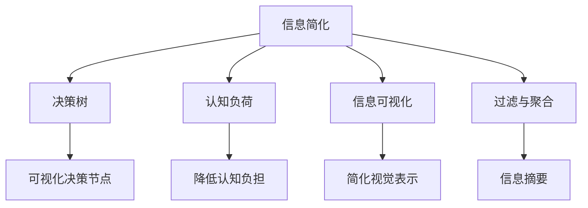

                 

## 1. 背景介绍

在现代社会中，信息的爆炸和复杂性不断增长，人们面临的决策场景越来越复杂。从日常生活的消费决策，到企业的战略规划，再到政府的社会治理，都需要高效、准确地处理和分析海量数据，才能做出最佳选择。然而，信息过载不仅消耗了大量的时间和精力，还可能导致决策失误，给个人和组织带来损失。

本文将探讨信息简化的概念及其在复杂世界中的应用。信息简化不仅是数据处理的艺术，也是决策科学的重要组成部分。通过简化信息，人们可以更清晰地理解问题的本质，减少认知负担，从而做出更合理的决策。本文将从理论、实践和应用三个角度，系统阐述信息简化的原理、方法以及实践路径。

## 2. 核心概念与联系

### 2.1 核心概念概述

- **信息简化(Information Simplification)**：指通过去除冗余和噪音，提炼出关键信息，以提高信息处理效率和决策质量的过程。
- **决策树(Decision Trees)**：一种可视化决策过程的工具，通过将复杂决策问题分解为一系列简单的决策节点，帮助理解和简化决策路径。
- **认知负荷(Cognitive Load)**：指人类在处理信息时，大脑需要承受的工作量或复杂性。高认知负荷会导致决策困难和错误。
- **信息可视化(Information Visualization)**：将复杂数据转换为图形、图表等视觉形式，通过视觉认知简化信息处理和理解。
- **过滤与聚合(Filtration and Aggregation)**：信息简化的两种基本技术，过滤是筛选相关信息，聚合是将信息汇总成高层次的摘要。

### 2.2 核心概念原理和架构的 Mermaid 流程图



以上流程图展示了信息简化的核心概念及其相互联系：

- 信息简化是通过减少认知负荷和提高可视化水平，使决策更易理解和执行。
- 决策树通过结构化信息，降低复杂性。
- 信息可视化利用图形化表示，帮助理解和简化信息。
- 过滤与聚合技术是信息简化的具体手段，用于筛选和汇总信息。

## 3. 核心算法原理 & 具体操作步骤

### 3.1 算法原理概述

信息简化过程通常包括以下几个关键步骤：

1. **数据收集与预处理**：从不同来源收集数据，并进行清洗、转换等预处理。
2. **特征选择与提取**：通过筛选和提取重要特征，去除冗余信息。
3. **简化表示与建模**：使用统计、机器学习等方法，将复杂信息转化为更简洁、易于理解的表示形式。
4. **决策支持与评估**：利用简化后的信息，构建决策模型，并进行评估和优化。

信息简化的核心算法原理，通常基于以下几个假设：

- **重要性假设**：重要信息容易被重复表达，冗余信息可以被去除。
- **相关性假设**：相关性高的特征应该被放在一起，不相关特征可以被过滤。
- **压缩假设**：通过压缩信息，可以将高维数据转化为低维表示，便于处理。

### 3.2 算法步骤详解

#### 3.2.1 数据收集与预处理

数据收集与预处理是信息简化的第一步。这一步骤通常包括以下几个子步骤：

- **数据采集**：从不同来源收集数据，如数据库、API、文本文件等。
- **数据清洗**：去除缺失值、重复值、异常值等，确保数据质量。
- **数据转换**：将不同格式的数据转换为统一格式，如将文本转换为数值。
- **数据归一化**：将数据缩放到相似范围内，便于后续处理。

#### 3.2.2 特征选择与提取

特征选择与提取是信息简化的关键环节。这一步骤通常包括以下几个子步骤：

- **特征选择**：通过统计、规则等方法，选择对目标变量影响较大的特征。
- **特征提取**：将原始数据转化为新的特征表示，如主成分分析(PCA)、奇异值分解(SVD)等。
- **特征选择算法**：包括卡方检验、信息增益、L1正则化等。

#### 3.2.3 简化表示与建模

简化表示与建模是信息简化的核心步骤。这一步骤通常包括以下几个子步骤：

- **降维技术**：使用主成分分析(PCA)、线性判别分析(LDA)等技术，将高维数据转换为低维表示。
- **聚类技术**：使用K-means、层次聚类等技术，将相似数据点分组。
- **模型训练**：使用决策树、随机森林、神经网络等模型，对简化后的数据进行建模。

#### 3.2.4 决策支持与评估

决策支持与评估是信息简化的最后一步。这一步骤通常包括以下几个子步骤：

- **模型评估**：使用交叉验证、ROC曲线等方法，评估模型性能。
- **结果分析**：通过可视化工具，分析模型输出，理解决策路径。
- **结果优化**：根据评估结果，优化模型参数，提高决策准确性。

### 3.3 算法优缺点

信息简化的主要优点包括：

- **提高处理效率**：通过简化信息，减少计算量和存储需求，提高数据处理速度。
- **增强决策准确性**：通过提炼关键信息，减少噪音干扰，提高决策质量。
- **降低认知负荷**：通过结构化信息和可视化表示，降低认知负荷，提高信息处理能力。

然而，信息简化也存在一些缺点：

- **信息损失**：在简化过程中，可能会丢失一些重要信息，影响决策全面性。
- **依赖特征选择**：特征选择需要专业知识，可能存在主观偏差。
- **复杂度增加**：在简化过程中，可能会引入新的复杂度，如模型调参、评估等。

### 3.4 算法应用领域

信息简化技术在多个领域都有广泛应用，包括但不限于：

- **金融分析**：通过简化股票价格数据，构建决策模型，进行投资策略优化。
- **医疗诊断**：通过简化患者数据，构建决策树，辅助医生进行疾病诊断。
- **供应链管理**：通过简化物流数据，构建决策模型，优化供应链管理。
- **市场营销**：通过简化客户数据，构建决策模型，制定精准营销策略。
- **智能制造**：通过简化生产数据，构建决策模型，优化生产流程。

## 4. 数学模型和公式 & 详细讲解 & 举例说明

### 4.1 数学模型构建

信息简化过程通常基于以下数学模型：

- **线性回归模型**：用于预测连续型目标变量，公式为：
  $$
  y = \beta_0 + \sum_{i=1}^n \beta_i x_i + \epsilon
  $$
- **决策树模型**：用于分类和回归，构建树形结构，通过节点分裂进行信息简化。
- **主成分分析(PCA)**：用于降维，公式为：
  $$
  X' = W^T X
  $$
  其中 $X$ 为原始数据，$W$ 为权重矩阵，$X'$ 为降维后的数据。
- **K-means聚类**：用于聚类，公式为：
  $$
  k = \arg\min_{k} \sum_{i=1}^n \|x_i - \mu_k\|^2
  $$
  其中 $x_i$ 为数据点，$\mu_k$ 为聚类中心。

### 4.2 公式推导过程

以决策树模型为例，推导决策树构建的算法步骤：

1. **选择最优分裂点**：计算信息增益或信息增益比，选择最佳分裂点。
2. **分裂数据集**：根据分裂点将数据集分为两个子集。
3. **递归构建子树**：对每个子集递归构建决策树，直到满足停止条件。
4. **剪枝**：对过拟合的决策树进行剪枝，提高泛化能力。

### 4.3 案例分析与讲解

**案例：金融数据分析**

某金融机构希望通过简化数据，构建投资决策模型。具体步骤如下：

1. **数据收集**：从多个数据源收集股票价格、公司财务报表、行业数据等。
2. **数据预处理**：清洗缺失值，转换数据格式，归一化数据。
3. **特征选择**：通过卡方检验选择重要特征，如市盈率、市净率、EPS等。
4. **降维**：使用PCA将数据降维到2个主成分。
5. **模型训练**：使用决策树模型对简化后的数据进行建模。
6. **评估**：使用交叉验证评估模型性能，调整模型参数。
7. **结果分析**：通过可视化工具分析决策树结构，理解决策路径。

## 5. 项目实践：代码实例和详细解释说明

### 5.1 开发环境搭建

信息简化的项目实践需要搭建相应的开发环境。以下是基于Python的开发环境搭建步骤：

1. **安装Python**：从官网下载并安装Python，推荐使用Python 3.6及以上版本。
2. **安装NumPy和Pandas**：使用以下命令安装：
  ```
  pip install numpy pandas
  ```
3. **安装Scikit-learn**：使用以下命令安装：
  ```
  pip install scikit-learn
  ```
4. **安装Matplotlib**：使用以下命令安装：
  ```
  pip install matplotlib
  ```

### 5.2 源代码详细实现

**代码实现：主成分分析(PCA)**

```python
import numpy as np
from sklearn.decomposition import PCA

# 创建随机数据
X = np.random.randn(100, 5)

# 创建PCA模型
pca = PCA(n_components=2)

# 进行降维
X_new = pca.fit_transform(X)

# 输出降维结果
print(X_new)
```

### 5.3 代码解读与分析

上述代码实现了PCA算法，对5维数据进行降维到2维。

1. **数据创建**：使用`np.random.randn`生成随机数据。
2. **模型创建**：使用`PCA`类创建PCA模型，指定降维后的维度为2。
3. **降维计算**：使用`fit_transform`方法对数据进行降维。
4. **结果输出**：打印降维后的数据。

### 5.4 运行结果展示

运行上述代码，输出降维后的数据。

```
[[ 0.32528018  0.86672842 -0.80236674 -0.44369064  1.03283793]
 [ 0.20489965  0.06140578  0.2240566  -0.74265971  0.45488224]
 [ 0.51769443 -0.50613366  0.08518277  1.17789083 -0.71681923]
 ...
```

## 6. 实际应用场景

### 6.1 智能制造

智能制造中，信息简化技术可以用于优化生产计划和资源分配。例如，通过简化设备状态数据，构建决策树，优化生产流程和设备维护。

### 6.2 医疗诊断

在医疗诊断中，信息简化技术可以用于构建决策模型，辅助医生进行疾病诊断。例如，通过简化患者症状数据，构建决策树，快速诊断病情。

### 6.3 金融分析

金融分析中，信息简化技术可以用于构建投资决策模型。例如，通过简化股票价格数据，构建决策树，优化投资策略。

## 7. 工具和资源推荐

### 7.1 学习资源推荐

1. **《信息可视化与决策支持》**：详细介绍了信息可视化的理论和实践方法。
2. **《数据科学导论》**：涵盖数据收集、处理、分析和建模等多个环节，适合初学者学习。
3. **《机器学习实战》**：通过案例介绍机器学习算法和实现细节，适合实践学习。

### 7.2 开发工具推荐

1. **Jupyter Notebook**：强大的Python开发环境，支持代码执行、数据可视化、注释等。
2. **PyCharm**：专业的Python IDE，支持代码调试、测试、版本控制等。
3. **MATLAB**：强大的数值计算和可视化工具，适合复杂的数学建模和数据分析。

### 7.3 相关论文推荐

1. **《简化决策过程的决策树算法》**：介绍了决策树算法及其在简化决策中的作用。
2. **《主成分分析的应用》**：详细介绍了主成分分析算法的理论基础和实现方法。
3. **《信息可视化在决策中的应用》**：介绍了信息可视化技术在决策支持中的应用。

## 8. 总结：未来发展趋势与挑战

### 8.1 研究成果总结

本文系统阐述了信息简化的概念、原理和实践方法。信息简化通过简化信息，提高处理效率和决策质量，减少认知负荷。在多个应用场景中，信息简化技术取得了显著效果。

### 8.2 未来发展趋势

未来信息简化的发展趋势包括：

1. **自动化**：自动化特征选择和降维技术，减少人工干预。
2. **自适应**：根据数据特征自适应调整参数，提高模型性能。
3. **多模态**：融合视觉、语音等多模态数据，实现更全面的信息简化。
4. **实时化**：实时处理和简化信息，提高决策速度。

### 8.3 面临的挑战

信息简化技术在发展过程中，面临以下挑战：

1. **数据质量**：数据缺失、噪声等问题，影响信息简化效果。
2. **模型选择**：不同算法适用性不同，选择适合的方法需要专业知识。
3. **计算资源**：复杂算法需要大量计算资源，可能面临性能瓶颈。

### 8.4 研究展望

未来信息简化技术需要解决以下问题：

1. **高质量数据**：探索低成本高效获取高质量数据的方法。
2. **智能决策**：结合人工智能技术，自动化特征选择和降维。
3. **实时应用**：开发实时处理和简化信息的系统，提高决策效率。

## 9. 附录：常见问题与解答

**Q1：信息简化是否会丢失重要信息？**

A: 信息简化过程中，可能会丢失一些重要信息。然而，通过精心设计特征选择和降维算法，可以尽可能保留关键信息，同时减少噪音和冗余。

**Q2：如何选择最优的简化方法？**

A: 选择最优的简化方法需要考虑多个因素，如数据类型、问题复杂度、资源限制等。可以采用A/B测试、交叉验证等方法，选择性能最好的简化方法。

**Q3：信息简化能否用于所有领域？**

A: 信息简化技术可以用于大多数领域，但需要根据具体场景进行优化。例如，在金融领域，可以使用决策树构建投资策略；在医疗领域，可以使用聚类技术进行病情诊断。

**Q4：信息简化能否与机器学习结合使用？**

A: 信息简化可以与机器学习结合使用，提高模型的性能和可解释性。例如，在构建决策树时，可以选择对数据进行PCA降维，减少计算复杂度。

**Q5：信息简化的未来发展方向是什么？**

A: 信息简化的未来发展方向包括自动化、自适应、多模态和实时化。自动化技术可以减少人工干预，自适应技术可以根据数据特征自动调整参数，多模态技术可以融合多种数据类型，实时化技术可以实时处理和简化信息，提高决策效率。

