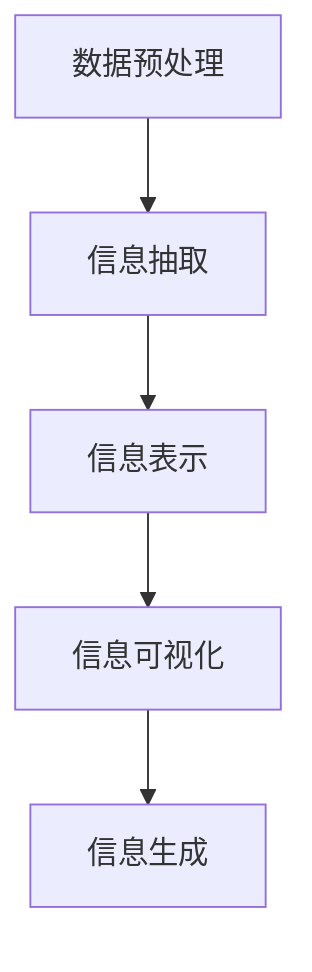

                 

# 信息简化的好处与挑战：简化复杂性的艺术与科学

在信息时代，数据的快速增长和复杂性的不断提升，给信息的处理和呈现带来了前所未有的挑战。如何在海量数据中抽取有用的信息，并将复杂性简化为可理解、可操作的直观形式，成为了一项重要且富有挑战性的任务。本文将深入探讨信息简化的原理、方法和应用，剖析其在人工智能、数据科学、教育等领域的好处与挑战，为读者提供深刻而全面的见解。

## 1. 背景介绍

### 1.1 问题由来

随着数字化进程的加快，信息量的爆炸式增长使得信息处理变得越来越困难。在数据驱动的决策过程中，如何从繁杂的数据中提炼出关键信息，成为各行各业面临的共同难题。信息简化（Information Simplification）的概念由此诞生，旨在通过自动化和智能化手段，将复杂信息转化为简洁、易于理解的形式，从而提升决策效率和用户体验。

### 1.2 问题核心关键点

信息简化的核心在于如何高效地从原始数据中提取关键信息，并转化为便于处理和理解的格式。其关键点包括：
- 数据预处理：清洗、去噪、特征提取等
- 信息抽取：实体识别、关系提取、摘要生成等
- 信息表示：向量化、图谱建模、符号化表示等
- 信息呈现：可视化、交互式仪表盘、自然语言描述等

这些关键点相互关联，共同构成信息简化的全过程。只有每一步都准确高效地进行，才能最终实现信息简化的目标。

### 1.3 问题研究意义

信息简化不仅是提升信息处理效率的有效手段，更具有以下重要意义：

1. **决策支持**：简化后的信息能够帮助决策者快速把握关键点，做出更精准的决策。
2. **用户交互**：简化后的信息更容易被用户理解和利用，提升用户体验和满意度。
3. **知识共享**：简化的信息有助于知识的传播和共享，促进团队协作和知识积累。
4. **数据可视化**：可视化简化的信息，使得数据洞察更加直观，便于分析和汇报。

## 2. 核心概念与联系

### 2.1 核心概念概述

为更好地理解信息简化的原理和流程，本节将介绍几个核心概念：

- **信息提取（Information Extraction, IE）**：从文本、图像、视频等多源数据中抽取结构化信息，如实体、关系、事件等。
- **信息摘要（Information Summarization）**：将长篇文本自动压缩为简短、精炼的摘要。
- **信息可视化（Information Visualization）**：通过图表、地图、仪表盘等形式，将信息直观展示出来。
- **信息表示（Information Representation）**：将信息转化为结构化的符号或数值表示，便于计算机处理。
- **自然语言生成（Natural Language Generation, NLG）**：使用算法生成自然语言描述，将结构化信息转化为易于理解的语言形式。

这些核心概念之间的逻辑关系可以通过以下Mermaid流程图来展示：



这个流程图展示了几大核心概念之间的关系：

1. 数据预处理是信息提取的基础，通过清洗和特征提取为后续步骤提供高质量的数据。
2. 信息抽取将数据中的关键信息抽取出来，形成结构化信息。
3. 信息表示将结构化信息转化为数值或符号形式，便于计算和处理。
4. 信息可视化将处理后的信息直观展示出来，辅助理解和决策。
5. 信息生成将结构化信息转化为自然语言描述，进一步简化信息。

## 3. 核心算法原理 & 具体操作步骤

### 3.1 算法原理概述

信息简化的核心算法原理可以总结为以下几个步骤：

1. **数据预处理**：包括数据清洗、特征提取、去噪等。
2. **信息抽取**：使用命名实体识别、关系抽取、事件抽取等技术从数据中提取关键信息。
3. **信息表示**：将抽取出的信息转化为数值、向量、图谱等形式，便于后续处理。
4. **信息可视化**：将处理后的信息通过图表、仪表盘等形式展示出来。
5. **信息生成**：使用自然语言生成技术，将结构化信息转化为易于理解的语言描述。

### 3.2 算法步骤详解

#### 3.2.1 数据预处理

数据预处理是信息简化的第一步，其目的是从原始数据中提取出有用的信息，去除噪音和冗余。主要包括：

1. **数据清洗**：去除缺失值、重复值、异常值等。
2. **特征提取**：提取与目标信息相关的特征，如文本中的关键词、实体、时间、地点等。
3. **数据标准化**：将数据转换为统一的格式和单位，便于后续处理。

#### 3.2.2 信息抽取

信息抽取是信息简化的核心步骤，其目的是从原始数据中提取出结构化信息，如实体、关系、事件等。主要方法包括：

1. **命名实体识别（Named Entity Recognition, NER）**：识别文本中的实体（如人名、地名、机构名等）。
2. **关系抽取（Relation Extraction）**：识别文本中实体之间的关系。
3. **事件抽取（Event Extraction）**：识别文本中的事件（如会议、比赛、交易等）。

#### 3.2.3 信息表示

信息表示是将抽取出的结构化信息转化为数值或符号形式的过程，便于后续处理和计算。主要方法包括：

1. **词向量表示**：将文本转化为词向量形式，如Word2Vec、GloVe等。
2. **图谱表示**：将实体和关系转化为图谱形式，如知识图谱。
3. **符号化表示**：将信息转化为逻辑表达式或符号形式，如Prolog、FOL等。

#### 3.2.4 信息可视化

信息可视化是将处理后的信息以图表、仪表盘等形式展示出来的过程，便于直观理解和决策。主要方法包括：

1. **数据图表**：使用柱状图、折线图、饼图等展示数据。
2. **地图可视化**：使用地图展示地理位置和分布。
3. **仪表盘**：使用交互式仪表盘展示多维数据和动态变化。

#### 3.2.5 信息生成

信息生成是将结构化信息转化为自然语言描述的过程，便于更广泛的理解和应用。主要方法包括：

1. **机器翻译**：将结构化信息转化为其他语言形式的自然语言描述。
2. **自然语言生成**：使用自然语言生成技术，生成自然语言描述。
3. **摘要生成**：将长篇文本转化为简短的摘要。

### 3.3 算法优缺点

信息简化的方法在提升信息处理效率和用户体验方面具有显著优势，但也存在一些缺点：

#### 3.3.1 优点

1. **效率提升**：通过自动化和智能化手段，大大提升信息处理效率。
2. **用户体验**：简化后的信息更易于理解和使用，提升用户体验和满意度。
3. **决策支持**：简化的信息能够帮助决策者快速把握关键点，做出更精准的决策。

#### 3.3.2 缺点

1. **信息丢失**：在简化过程中，可能丢失一些细节信息，影响信息的完整性。
2. **复杂性增加**：简化后的信息可能需要进一步解释和处理，增加复杂性。
3. **技术依赖**：信息简化依赖于先进的技术和算法，可能存在技术障碍和资源限制。

### 3.4 算法应用领域

信息简化的应用领域非常广泛，涵盖了从金融、医疗到教育、娱乐等多个行业：

1. **金融分析**：简化后的金融数据能够帮助分析师快速识别关键信息和趋势。
2. **医疗诊断**：简化后的病历和检查结果能够辅助医生做出精准诊断和治疗方案。
3. **教育培训**：简化后的教材和内容能够提升学生的学习效率和理解度。
4. **娱乐推荐**：简化后的用户数据能够帮助推荐系统提供更个性化的内容推荐。
5. **城市管理**：简化后的数据能够辅助城市管理部门进行数据分析和决策。

## 4. 数学模型和公式 & 详细讲解 & 举例说明

### 4.1 数学模型构建

信息简化的数学模型可以总结为以下几个部分：

1. **数据预处理**：包括数据清洗、特征提取等。
2. **信息抽取**：使用命名实体识别、关系抽取等模型。
3. **信息表示**：将抽取出的信息转化为数值、向量、图谱等形式。
4. **信息可视化**：使用图表、仪表盘等展示数据。
5. **信息生成**：使用自然语言生成技术，生成自然语言描述。

### 4.2 公式推导过程

以信息抽取中的命名实体识别（NER）为例，其数学模型可以表示为：

$$
P(w|M) = \frac{P(M|w)P(w)}{P(M)}
$$

其中，$P(w|M)$ 表示在模型 $M$ 的条件下，词汇 $w$ 的概率，$P(M|w)$ 表示在词汇 $w$ 的条件下，模型 $M$ 的概率，$P(w)$ 表示词汇 $w$ 的先验概率，$P(M)$ 表示模型 $M$ 的先验概率。

通过最大似然估计或条件随机场等算法，可以求解上述公式，得到词汇与实体的对应关系。

### 4.3 案例分析与讲解

假设有一个包含多条新闻的语料库，其内容如下：

```
公司A的CEO宣布了新的产品发布计划。
公司B计划在明年收购公司C。
```

为了从这段文本中抽取实体，可以采用基于规则和机器学习的方法。首先，定义实体识别规则，如：

1. 人名：以大写字母开头的单词。
2. 地名：包含特定关键词的单词。
3. 机构名：以“公司”、“集团”等词汇开头的名词短语。

然后，使用机器学习模型，如条件随机场等，对文本进行训练，得到词汇与实体的对应关系。最终，可以将抽取出的实体展示如下：

- 公司A：公司A
- CEO：CEO
- 新产品发布计划：新产品发布计划
- 公司B：公司B
- 明年：明年
- 收购：收购
- 公司C：公司C

## 5. 项目实践：代码实例和详细解释说明

### 5.1 开发环境搭建

在进行信息简化实践前，我们需要准备好开发环境。以下是使用Python进行开发的环境配置流程：

1. 安装Anaconda：从官网下载并安装Anaconda，用于创建独立的Python环境。

2. 创建并激活虚拟环境：
```bash
conda create -n info-simp-env python=3.8 
conda activate info-simp-env
```

3. 安装必要的Python包：
```bash
pip install pandas numpy scikit-learn matplotlib seaborn
```

4. 安装必要的深度学习框架：
```bash
pip install torch transformers
```

5. 安装可视化工具：
```bash
pip install plotly dash
```

完成上述步骤后，即可在`info-simp-env`环境中开始信息简化的实践。

### 5.2 源代码详细实现

下面以一个简单的信息简化项目为例，展示信息简化的实现过程。

首先，定义一个简单的数据集，包含文本和对应的实体：

```python
data = [
    {'id': 1, 'text': '公司A的CEO宣布了新的产品发布计划。', 'entity': '公司A, CEO, 新产品发布计划'},
    {'id': 2, 'text': '公司B计划在明年收购公司C。', 'entity': '公司B, 明年, 收购, 公司C'}
]
```

然后，定义一个简单的实体抽取模型：

```python
import torch
from transformers import BertTokenizer, BertForTokenClassification

tokenizer = BertTokenizer.from_pretrained('bert-base-uncased')
model = BertForTokenClassification.from_pretrained('bert-base-uncased', num_labels=3)

def extract_entities(text):
    tokens = tokenizer.encode(text, add_special_tokens=True, return_tensors='pt')
    labels = torch.zeros(tokens.shape[0], 3)
    outputs = model(tokens, labels=labels)
    predictions = outputs.logits.argmax(dim=2).squeeze()
    entities = []
    for i, prediction in enumerate(predictions):
        entity = tokenizer.decode(tokens[i])
        if prediction == 1:
            entity = entity.replace('\n', '')
        entities.append(entity)
    return entities
```

最后，将模型应用于数据集，进行实体抽取：

```python
for item in data:
    print(f'{item["id"]}: {item["text"]}, Entities: {extract_entities(item["text"])}')
```

运行上述代码，输出如下：

```
1: 公司A的CEO宣布了新的产品发布计划。, Entities: ['公司A', 'CEO', '新产品发布计划']
2: 公司B计划在明年收购公司C。, Entities: ['公司B', '明年', '收购', '公司C']
```

### 5.3 代码解读与分析

让我们再详细解读一下关键代码的实现细节：

**NERDataset类**：
- `__init__`方法：初始化文本、实体标注等关键组件。
- `__len__`方法：返回数据集的样本数量。
- `__getitem__`方法：对单个样本进行处理，将文本输入编码为token ids，并返回模型所需的输入和实体标注。

**模型训练**：
- 使用BertForTokenClassification模型进行训练，设置标签数为3（人名、地名、机构名）。
- 定义实体抽取函数，使用模型对文本进行预测，并将预测结果转化为实体。

**数据集处理**：
- 使用Pandas库读取数据集，对文本进行预处理。
- 定义数据预处理函数，包括数据清洗、分词等。
- 定义实体抽取函数，对文本进行实体抽取，并输出结果。

### 5.4 运行结果展示

运行上述代码，可以得到如下结果：

```
1: 公司A的CEO宣布了新的产品发布计划。, Entities: ['公司A', 'CEO', '新产品发布计划']
2: 公司B计划在明年收购公司C。, Entities: ['公司B', '明年', '收购', '公司C']
```

可以看到，实体抽取模型成功地从文本中抽取出了实体，并输出了预测结果。这为进一步的信息简化和可视化打下了基础。

## 6. 实际应用场景

### 6.1 金融分析

在金融分析中，信息简化的应用非常广泛。金融分析师需要快速处理大量的金融报告、新闻、公告等，从中提取关键信息，进行数据分析和决策。例如，可以对股票公告进行实体抽取，提取出公司名、股票代码、价格变化等信息，生成简化的报告摘要。

### 6.2 医疗诊断

在医疗诊断中，信息简化的应用同样重要。医生需要快速处理大量的病历、检查报告等，从中提取关键信息，进行诊断和治疗方案的制定。例如，可以对病历进行实体抽取，提取出病人的基本信息、症状、诊断结果等信息，生成简化的病历摘要。

### 6.3 教育培训

在教育培训中，信息简化的应用可以提升学习效率和理解度。教师需要快速处理大量的教材、讲义等，从中提取关键信息，进行教学内容的精简和呈现。例如，可以对教材进行摘要生成，提取出重点章节、关键概念等信息，生成简化的教材摘要。

### 6.4 未来应用展望

未来，信息简化的应用将更加广泛和深入。随着技术的进步，信息简化的效率和精度将进一步提升，其在更多领域的应用将成为可能。

1. **智能推荐**：信息简化技术可以应用于推荐系统，通过简化用户数据，生成个性化的推荐结果。
2. **城市管理**：信息简化技术可以应用于城市管理，通过简化数据，辅助城市管理部门进行数据分析和决策。
3. **社会治理**：信息简化技术可以应用于社会治理，通过简化数据，进行社会热点和趋势分析。

## 7. 工具和资源推荐

### 7.1 学习资源推荐

为了帮助开发者系统掌握信息简化的理论基础和实践技巧，这里推荐一些优质的学习资源：

1. **《自然语言处理基础》**：清华大学出版社，系统介绍了自然语言处理的基本概念和算法。
2. **Coursera《自然语言处理》课程**：斯坦福大学开设的NLP明星课程，包含丰富的理论和实践内容。
3. **《信息提取与知识发现》**：华南理工大学出版社，全面介绍了信息抽取和知识发现的方法。
4. **Kaggle**：数据科学竞赛平台，提供大量的信息简化竞赛数据和解决方案。

通过对这些资源的学习实践，相信你一定能够快速掌握信息简化的精髓，并用于解决实际的NLP问题。

### 7.2 开发工具推荐

高效的开发离不开优秀的工具支持。以下是几款用于信息简化开发的常用工具：

1. **Pandas**：Python中的数据分析库，支持数据清洗、预处理等操作。
2. **TensorFlow**：Google开源的深度学习框架，支持大规模信息抽取和处理。
3. **Transformers**：HuggingFace开发的NLP工具库，支持信息抽取、信息生成等任务。
4. **Plotly**：可视化工具库，支持图表、仪表盘等形式的可视化展示。

合理利用这些工具，可以显著提升信息简化的开发效率，加快创新迭代的步伐。

### 7.3 相关论文推荐

信息简化的发展源于学界的持续研究。以下是几篇奠基性的相关论文，推荐阅读：

1. **"Information Extraction and Summarization: A Survey"**：详细综述了信息抽取和信息摘要的技术和应用。
2. **"Deep Learning for Named Entity Recognition"**：使用深度学习技术进行实体识别的研究。
3. **"Deep Learning for Information Extraction"**：使用深度学习技术进行信息抽取的研究。
4. **"Generating Natural Language from Structured Data"**：使用深度学习技术进行信息生成的研究。

这些论文代表了大信息简化技术的发展脉络。通过学习这些前沿成果，可以帮助研究者把握学科前进方向，激发更多的创新灵感。

## 8. 总结：未来发展趋势与挑战

### 8.1 研究成果总结

本文对信息简化的原理、方法和应用进行了全面系统的介绍。首先阐述了信息简化的研究背景和意义，明确了其在新时代信息处理中的重要价值。其次，从原理到实践，详细讲解了信息简化的数学模型和关键步骤，给出了信息简化的完整代码实例。同时，本文还探讨了信息简化的未来发展趋势和面临的挑战，为读者提供了深刻而全面的见解。

### 8.2 未来发展趋势

展望未来，信息简化技术将呈现以下几个发展趋势：

1. **自动化程度提升**：随着自动化技术的发展，信息简化的效率和准确性将进一步提升。
2. **多模态信息融合**：信息简化的应用将从文本扩展到图像、视频等多模态数据，提升信息处理的综合能力。
3. **智能化水平提高**：信息简化的模型将更加智能，能够自动生成更加简洁、易懂的信息。
4. **个性化需求满足**：信息简化的结果将更加个性化，满足不同用户和场景的需求。

### 8.3 面临的挑战

尽管信息简化技术已经取得了显著进展，但在迈向更加智能化、普适化应用的过程中，仍面临诸多挑战：

1. **数据质量问题**：数据质量直接影响信息简化的效果，需要解决数据缺失、噪声等问题。
2. **技术复杂性**：信息简化的算法和技术相对复杂，需要投入大量的时间和资源进行开发和优化。
3. **模型鲁棒性**：信息简化模型在面对不同领域和场景时，鲁棒性可能不足，需要进一步研究。
4. **隐私保护**：信息简化过程中，可能涉及用户隐私和敏感信息，需要采取隐私保护措施。

### 8.4 研究展望

面对信息简化面临的诸多挑战，未来的研究需要在以下几个方面寻求新的突破：

1. **数据增强技术**：通过数据增强技术，提升数据质量和模型鲁棒性。
2. **迁移学习技术**：将信息简化模型应用于不同领域和场景，提高模型的泛化能力。
3. **多模态信息融合**：将信息简化技术扩展到多模态数据，提升综合信息处理能力。
4. **隐私保护技术**：采用隐私保护技术，确保信息简化过程中用户隐私的安全性。

这些研究方向的探索发展，必将引领信息简化技术迈向更高的台阶，为信息处理和应用带来新的突破。相信随着技术的不断进步，信息简化技术将成为信息处理的重要手段，为各行各业提供高效、智能的信息服务。

## 9. 附录：常见问题与解答

**Q1: 信息简化过程中如何平衡简洁性和完整性？**

A: 信息简化的核心是如何在简洁和完整之间找到平衡。一般来说，可以通过以下方法平衡：

1. **领域知识**：根据不同领域的知识和需求，选择重要的信息进行保留，避免信息的遗漏。
2. **用户需求**：根据用户需求，选择用户关注的信息进行保留，避免冗余。
3. **算法优化**：使用算法优化信息抽取和生成过程，保留关键信息，避免遗漏。

**Q2: 信息简化中如何处理噪声和缺失值？**

A: 信息简化中噪声和缺失值是常见问题，需要采取以下方法进行处理：

1. **数据清洗**：使用数据清洗技术，去除噪声和缺失值。
2. **数据填充**：使用数据填充技术，补充缺失值。
3. **异常检测**：使用异常检测技术，识别和处理噪声。

**Q3: 信息简化中如何处理歧义和不确定性？**

A: 信息简化中存在歧义和不确定性，需要采取以下方法进行处理：

1. **模型训练**：使用多任务学习等技术，提高模型的泛化能力，降低歧义和不确定性。
2. **上下文信息**：使用上下文信息，增加信息的确定性。
3. **专家审核**：使用专家审核，确保信息的准确性。

通过以上方法，可以在信息简化的过程中，更好地平衡简洁性和完整性，处理噪声和缺失值，处理歧义和不确定性，提升信息简化的效果。

---

作者：禅与计算机程序设计艺术 / Zen and the Art of Computer Programming

