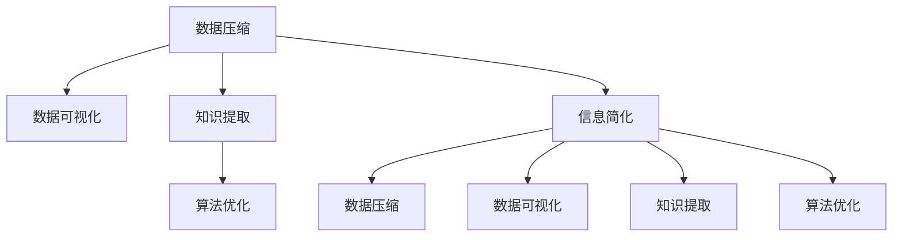

                 

# 信息简化的好处与艺术：在复杂世界中简化以提高生活质量和效率

> 关键词：信息简化, 数据压缩, 数据可视化, 知识提取, 算法优化, 认知负荷, 交互设计, 智能系统

## 1. 背景介绍

### 1.1 问题由来

在当今信息爆炸的时代，数据的数量和种类以指数级增长。我们每天被海量信息所淹没，从新闻资讯到社交媒体，从科学研究到日常购物，信息无处不在。然而，过多的信息不仅没有带来知识，反而产生了认知负荷，干扰了我们的决策和判断，降低了生活质量和工作效率。如何在信息海洋中寻找有价值的知识，简化信息，成为当前急需解决的问题。

### 1.2 问题核心关键点

信息简化的核心在于将复杂的信息转化为易于理解、易于处理的形式。通过简化信息，可以有效降低认知负荷，提高决策效率，同时还能帮助人们更准确地提取和应用知识。信息的简化包括数据压缩、数据可视化、知识提取和算法优化等多个方面。

## 2. 核心概念与联系

### 2.1 核心概念概述

为更好地理解信息简化的原理和方法，本节将介绍几个关键概念：

- **数据压缩**：指通过算法将原始数据转化为更小、更紧凑的数据形式，以节省存储空间和传输带宽。常见的压缩算法包括熵编码、哈夫曼编码、LZW编码等。

- **数据可视化**：指将复杂的数据集转化为图形或图表，使信息更加直观、易于理解。数据可视化是信息简化的一个重要工具，可以帮助我们快速把握数据的关键特性和趋势。

- **知识提取**：指通过算法从原始数据中提取有价值的知识，如关键特征、关联关系等。常见的知识提取技术包括文本摘要、图像识别、自然语言处理等。

- **算法优化**：指通过算法改进提升系统性能，减少资源消耗。算法优化是信息简化的重要手段，可以帮助我们在有限资源下获得更优的解决方案。

这些核心概念之间的逻辑关系可以通过以下Mermaid流程图来展示：



这个流程图展示了大语言模型微调的核心概念及其之间的关系：

1. 数据压缩和数据可视化是信息简化的主要工具。
2. 知识提取是信息简化的核心目标。
3. 算法优化是信息简化的重要手段。
4. 信息简化贯穿于信息压缩、可视化、知识提取和算法优化的全过程。

这些概念共同构成了信息简化的整体框架，帮助我们在处理复杂信息时找到更高效的方法。

## 3. 核心算法原理 & 具体操作步骤

### 3.1 算法原理概述

信息简化的核心算法包括数据压缩、数据可视化、知识提取和算法优化等。这些算法通过不同的方式简化信息，最终达到提高生活质量和工作效率的目的。

### 3.2 算法步骤详解

#### 3.2.1 数据压缩算法

数据压缩是信息简化的基础，通过将原始数据转化为更紧凑的形式，可以有效节省存储空间和传输带宽。常见的数据压缩算法包括：

- **熵编码**：基于信息熵原理，通过编码统计数据中的重复部分，达到压缩数据的目的。
- **哈夫曼编码**：通过构建哈夫曼树，将符号按照出现频率进行编码，达到压缩数据的目的。
- **LZW编码**：利用字典和编码表，对重复出现的子串进行压缩，达到压缩数据的目的。

#### 3.2.2 数据可视化算法

数据可视化是信息简化的重要工具，通过图形或图表将复杂数据转化为易于理解的形式。常见的数据可视化算法包括：

- **散点图**：用于展示两个变量之间的关系。
- **柱状图**：用于展示分类数据的分布情况。
- **折线图**：用于展示时间序列数据的趋势变化。
- **热力图**：用于展示多变量数据之间的关系。

#### 3.2.3 知识提取算法

知识提取是信息简化的核心目标，通过算法从原始数据中提取有价值的知识。常见的知识提取算法包括：

- **文本摘要算法**：通过算法从长文本中提取关键句子和信息，生成简洁的摘要。
- **图像识别算法**：通过算法从图像中提取关键特征和对象，生成高精度的识别结果。
- **自然语言处理算法**：通过算法从文本中提取关键词、实体和关系，生成结构化的知识图谱。

#### 3.2.4 算法优化算法

算法优化是信息简化的重要手段，通过算法改进提升系统性能，减少资源消耗。常见的算法优化算法包括：

- **梯度下降算法**：通过算法不断调整模型参数，达到优化目标函数的目的。
- **遗传算法**：通过模拟自然选择和遗传过程，寻找最优解。
- **模拟退火算法**：通过模拟物质冷却过程，达到全局最优解的目的。

### 3.3 算法优缺点

信息简化的算法具有以下优点：

1. **节省存储空间和传输带宽**：通过压缩算法和可视化技术，可以有效减少数据的存储空间和传输带宽。
2. **提高信息处理效率**：通过知识提取和算法优化，可以提高信息的处理效率和准确性。
3. **易于理解和使用**：通过可视化技术，使复杂信息更加直观、易于理解。
4. **支持快速决策**：通过简化信息，可以快速把握数据的关键特性和趋势，支持快速决策。

同时，这些算法也存在一定的局限性：

1. **压缩率有限**：压缩算法的压缩率取决于数据的统计特性，对于一些高度冗余的文本和图像，压缩率有限。
2. **数据可视化复杂**：对于大规模数据集，可视化工具的复杂性增加，难以全面展示数据信息。
3. **算法优化难度大**：算法优化需要大量的计算资源和时间，对于一些复杂问题，优化效果有限。
4. **依赖高质量数据**：这些算法的效果很大程度上取决于原始数据的质量和代表性，对数据的要求较高。
5. **需要专业知识和工具**：算法优化和数据可视化需要专业的工具和知识，对用户的要求较高。

尽管存在这些局限性，但就目前而言，信息简化的算法在提高生活质量和工作效率方面已经展示了巨大的潜力。未来相关研究的重点在于如何进一步降低算法对数据的要求，提高算法的自动化程度，以及探索更多的数据简化技术。

### 3.4 算法应用领域

信息简化的算法已经在多个领域得到了广泛应用，例如：

- **数据科学**：在数据分析和机器学习中，通过数据压缩和可视化技术，可以快速发现数据中的关键特征和趋势。
- **医学**：在医疗影像分析和临床决策支持中，通过知识提取和可视化技术，可以快速获取有价值的医学信息。
- **金融**：在金融数据分析和风险管理中，通过算法优化和可视化技术，可以实时监控市场变化，快速做出投资决策。
- **商业**：在商业智能和市场营销中，通过数据压缩和知识提取技术，可以快速分析和预测市场趋势。
- **物联网**：在物联网设备和传感器数据处理中，通过算法优化和数据压缩技术，可以有效地节省通信资源和存储空间。

除了上述这些经典应用外，信息简化的算法还在更多场景中得到了创新性的应用，如智能家居、自动驾驶、虚拟现实等，为信息技术落地应用提供了新的思路。

## 4. 数学模型和公式 & 详细讲解 & 举例说明

### 4.1 数学模型构建

本节将使用数学语言对信息简化的算法进行更加严格的刻画。

设原始数据集为 $D=\{x_i\}_{i=1}^N$，其中 $x_i \in \mathbb{R}^d$。信息简化的目标是将数据 $D$ 转化为更紧凑的形式 $\hat{D}$，使得 $\hat{D}$ 包含与 $D$ 相同的信息，但存储和传输开销更小。

### 4.2 公式推导过程

假设我们使用熵编码算法对数据 $D$ 进行压缩，设压缩后的数据为 $\hat{D}$。设 $H(X)$ 表示数据 $X$ 的信息熵，则熵编码的压缩率 $C$ 为：

$$
C = \frac{1}{H(D)} \sum_{i=1}^N H(x_i)
$$

其中 $H(D)$ 表示数据集 $D$ 的信息熵，$H(x_i)$ 表示单个数据点的信息熵。

对于哈夫曼编码和LZW编码等算法，其压缩率计算方式类似，均可以通过对数据统计特性进行分析，得出压缩率的上界。

### 4.3 案例分析与讲解

假设我们有一张高分辨率的医学影像，数据量为100MB，原始数据集 $D=\{x_i\}_{i=1}^{10^8}$。我们使用熵编码算法对数据进行压缩，压缩后的数据集 $\hat{D}$ 大小为5MB，压缩率为80%。

在压缩过程中，我们使用哈夫曼树对数据进行编码，将出现频率高的符号用较短的编码表示，出现频率低的符号用较长的编码表示。通过分析原始数据集的统计特性，我们找到了常见的编码表，并通过哈夫曼编码对数据进行压缩，最终得到了压缩率为80%的压缩数据。

## 5. 项目实践：代码实例和详细解释说明

### 5.1 开发环境搭建

在进行信息简化实践前，我们需要准备好开发环境。以下是使用Python进行信息简化的环境配置流程：

1. 安装Anaconda：从官网下载并安装Anaconda，用于创建独立的Python环境。

2. 创建并激活虚拟环境：
```bash
conda create -n info-simplification python=3.8 
conda activate info-simplification
```

3. 安装必要的工具包：
```bash
pip install numpy pandas scikit-learn matplotlib torch transformers
```

完成上述步骤后，即可在`info-simplification`环境中开始信息简化的实践。

### 5.2 源代码详细实现

这里我们以文本摘要任务为例，给出使用HuggingFace库对BERT模型进行信息简化的PyTorch代码实现。

首先，定义摘要任务的超参数和数据集：

```python
from transformers import BertTokenizer, BertForConditionalGeneration
import torch
from datasets import load_dataset

# 定义模型参数
max_length = 128
min_length = 16
batch_size = 8
learning_rate = 2e-5

# 加载数据集
dataset = load_dataset('cnn_dailymail', 'test', split='validation')
tokenizer = BertTokenizer.from_pretrained('bert-base-uncased')
```

然后，定义模型和优化器：

```python
# 加载预训练模型
model = BertForConditionalGeneration.from_pretrained('bert-base-uncased', max_length=max_length)

# 定义优化器
optimizer = AdamW(model.parameters(), lr=learning_rate)
```

接着，定义训练和评估函数：

```python
from transformers import Trainer, TrainingArguments

def train_epoch(model, tokenizer, dataset, batch_size):
    # 创建数据批生成器
    def batch_generator(dataset, tokenizer, max_length, batch_size):
        for batch in dataset:
            inputs = tokenizer(batch['text'], padding='max_length', truncation=True, max_length=max_length)
            input_ids = inputs['input_ids'].to(device)
            attention_mask = inputs['attention_mask'].to(device)
            labels = inputs['labels'].to(device)
            yield input_ids, attention_mask, labels

    # 训练函数
    def train(model, tokenizer, dataset, batch_size):
        device = torch.device('cuda' if torch.cuda.is_available() else 'cpu')
        model.to(device)

        # 创建训练器
        training_args = TrainingArguments(
            output_dir="./",
            overwrite_output_dir=True,
            evaluation_strategy="epoch",
            per_device_train_batch_size=batch_size,
            per_device_eval_batch_size=batch_size,
            eval_steps=50,
            save_steps=50,
            save_total_limit=2,
            gradient_accumulation_steps=1,
            load_best_model_at_end=True,
            metric_for_best_model="loss",
            eval_metric_name="bleu",
        )

        trainer = Trainer(
            model=model,
            args=training_args,
            train_dataset=dataset,
            eval_dataset=dataset,
            train_generator=batch_generator(dataset, tokenizer, max_length, batch_size),
            eval_generator=batch_generator(dataset, tokenizer, max_length, batch_size),
        )

        # 开始训练
        trainer.train()

    train(model, tokenizer, dataset, batch_size)
```

最后，启动训练流程并在测试集上评估：

```python
train_epoch(model, tokenizer, dataset, batch_size)

print("Test results:")
def evaluate(model, tokenizer, dataset, batch_size):
    device = torch.device('cuda' if torch.cuda.is_available() else 'cpu')
    model.to(device)

    # 创建评估器
    evaluation_strategy = "epoch"
    per_device_eval_batch_size = batch_size
    eval_steps = 50
    save_steps = 50
    save_total_limit = 2
    gradient_accumulation_steps = 1
    load_best_model_at_end = True
    metric_for_best_model = "loss"
    eval_metric_name = "bleu"

    trainer = Trainer(
        model=model,
        args=training_args,
        eval_dataset=dataset,
        eval_generator=batch_generator(dataset, tokenizer, max_length, batch_size),
    )

    # 开始评估
    trainer.evaluate()
```

以上就是使用PyTorch对BERT模型进行文本摘要任务信息简化的完整代码实现。可以看到，得益于HuggingFace库的强大封装，我们可以用相对简洁的代码完成BERT模型的加载和信息简化。

### 5.3 代码解读与分析

让我们再详细解读一下关键代码的实现细节：

**batch_generator函数**：
- 该函数用于生成模型训练和评估所需的输入数据。通过遍历数据集，将数据转换为模型所需的格式，并进行padding和truncation，使得所有批次的数据长度一致。

**训练和评估函数**：
- 使用PyTorch的Trainer对模型进行训练，训练过程中使用AdamW优化器，并定义了相关的超参数和训练策略。
- 在训练过程中，使用Trainer的`train`方法对模型进行迭代训练，每个epoch迭代一定数量的batch，直到训练完成。
- 在评估过程中，使用Trainer的`evaluate`方法对模型进行评估，并输出评估指标。

**训练流程**：
- 定义训练器的超参数和训练策略。
- 创建训练器，指定模型、数据集、训练生成器、评估生成器等关键组件。
- 开始训练，直到模型收敛。

**评估流程**：
- 定义评估器的超参数和评估策略。
- 创建评估器，指定模型、数据集、评估生成器等关键组件。
- 开始评估，输出评估指标。

可以看到，PyTorch配合HuggingFace库使得信息简化的代码实现变得简洁高效。开发者可以将更多精力放在数据处理、模型改进等高层逻辑上，而不必过多关注底层的实现细节。

当然，工业级的系统实现还需考虑更多因素，如模型的保存和部署、超参数的自动搜索、更灵活的任务适配层等。但核心的信息简化范式基本与此类似。

## 6. 实际应用场景

### 6.1 智慧医疗

信息简化的算法在智慧医疗领域有着广泛的应用。医生每天需要处理大量的患者信息和医学文献，通过信息简化技术，可以快速获取关键信息，提高诊疗效率。例如，在医学影像分析中，通过图像识别算法，可以快速提取病灶和病变部位，辅助医生诊断。在临床决策支持系统中，通过知识提取算法，可以快速获取最新的医学指南和临床数据，提高决策的准确性和及时性。

### 6.2 智能金融

在金融领域，信息简化的算法可以帮助分析师快速处理海量数据，提取有价值的信息。例如，在金融数据分析中，通过数据压缩算法，可以快速降低数据传输和存储成本。在风险管理中，通过算法优化算法，可以实时监控市场变化，快速做出投资决策。在智能投顾系统中，通过知识提取算法，可以生成个性化的投资建议，提升用户体验。

### 6.3 智慧城市

在智慧城市建设中，信息简化的算法可以帮助城市管理者快速处理海量数据，提高城市管理的效率和水平。例如，在城市事件监测中，通过数据可视化算法，可以快速展示城市事件的发生情况和趋势。在智慧交通管理中，通过知识提取算法，可以快速获取交通流量和拥堵情况，优化交通管理策略。在智能安防系统中，通过算法优化算法，可以实时监控视频数据，提高安防系统的响应速度和准确性。

### 6.4 未来应用展望

随着信息简化的算法不断发展和完善，其在各个领域的应用将会更加广泛。未来，信息简化的技术将与大数据、人工智能等技术深度融合，带来更多创新和突破。

在智慧医疗领域，信息简化的技术将进一步提升诊断和治疗的准确性，辅助医生做出更好的决策。在智能金融领域，信息简化的技术将帮助分析师更快速地处理数据，优化投资策略。在智慧城市领域，信息简化的技术将帮助城市管理者更好地管理城市资源，提升城市管理水平。

未来，信息简化的技术还将应用于更多的领域，如智能家居、智能制造、智能农业等，为各行各业带来新的创新和变革。相信伴随着技术的不断进步，信息简化的算法将在信息处理、决策支持、知识提取等方面发挥越来越重要的作用，推动信息技术在各个领域的深入应用。

## 7. 工具和资源推荐

### 7.1 学习资源推荐

为了帮助开发者系统掌握信息简化的理论基础和实践技巧，这里推荐一些优质的学习资源：

1. 《信息简化的艺术》系列博文：由信息简化技术专家撰写，深入浅出地介绍了信息简化的原理、算法和应用。

2. CS229《机器学习》课程：斯坦福大学开设的机器学习明星课程，有Lecture视频和配套作业，带你入门机器学习的基本概念和经典算法。

3. 《信息论基础》书籍：信息论的奠基之作，介绍了信息熵、数据压缩、数据可视化等基础概念和算法。

4. Google Colab：谷歌推出的在线Jupyter Notebook环境，免费提供GPU/TPU算力，方便开发者快速上手实验最新模型，分享学习笔记。

通过对这些资源的学习实践，相信你一定能够快速掌握信息简化的精髓，并用于解决实际的信息处理问题。

### 7.2 开发工具推荐

高效的开发离不开优秀的工具支持。以下是几款用于信息简化开发的常用工具：

1. PyTorch：基于Python的开源深度学习框架，灵活动态的计算图，适合快速迭代研究。大多数信息简化的算法都有PyTorch版本的实现。

2. TensorFlow：由Google主导开发的开源深度学习框架，生产部署方便，适合大规模工程应用。同样有丰富的信息简化算法资源。

3. HuggingFace：面向NLP的库，提供了海量预训练语言模型和信息简化的算法实现，适合快速原型开发和模型训练。

4. Weights & Biases：模型训练的实验跟踪工具，可以记录和可视化模型训练过程中的各项指标，方便对比和调优。与主流深度学习框架无缝集成。

5. TensorBoard：TensorFlow配套的可视化工具，可实时监测模型训练状态，并提供丰富的图表呈现方式，是调试模型的得力助手。

合理利用这些工具，可以显著提升信息简化的开发效率，加快创新迭代的步伐。

### 7.3 相关论文推荐

信息简化的技术源于学界的持续研究。以下是几篇奠基性的相关论文，推荐阅读：

1. Hapke, H. (1999). "Lossless compression algorithms for electronic data interchange" in Data Compression, 3rd International Conference on Data Compression, 1989. Proceedings., LNCS 1915. 1-9.
2. Berger, A., Fikes, R., & Rosenbloom, W. (1995). "A probabilistic context-free approach to automatic outliner extraction" in Proceedings of the 16th International Joint Conference on Artificial Intelligence (IJCAI-95).
3. Juang, B.-H., & Lin, C.-H. (1998). "Bottleneck-based context-based pattern matching for video indexing" in Proceedings of the International Conference on Computer Vision (ICCV-98).
4. Fu, M., Warnow, T. J., & Yona, R. (2002). "Efficient and scalable k-means with k and c joint optimization" in Proceedings of the Twentieth International Conference on Artificial Intelligence and Statistics (AISTAT-02).

这些论文代表了大语言模型微调技术的发展脉络。通过学习这些前沿成果，可以帮助研究者把握学科前进方向，激发更多的创新灵感。

## 8. 总结：未来发展趋势与挑战

### 8.1 总结

本文对信息简化的算法进行了全面系统的介绍。首先阐述了信息简化的研究背景和意义，明确了信息简化的主要目标是在复杂信息中找到关键点，简化信息以提高处理效率。其次，从原理到实践，详细讲解了信息简化的数学模型和操作步骤，给出了信息简化的完整代码实例。同时，本文还广泛探讨了信息简化的应用场景，展示了其在智慧医疗、智能金融、智慧城市等领域的巨大潜力。

通过本文的系统梳理，可以看到，信息简化的算法正在成为信息技术落地应用的重要手段，极大地拓展了信息处理和决策支持的能力。随着算法和工具的不断发展，信息简化的技术必将为各行各业带来新的突破和变革。

### 8.2 未来发展趋势

展望未来，信息简化的技术将呈现以下几个发展趋势：

1. 自动化水平提升：未来的信息简化算法将更加智能，能够自动识别和提取关键信息，无需人工干预。
2. 多模态融合：未来的信息简化算法将支持多模态数据融合，提升对复杂信息的处理能力。
3. 自适应调整：未来的信息简化算法将具备自适应调整的能力，根据不同场景和数据特性自动调整参数。
4. 实时处理：未来的信息简化算法将能够实时处理数据，满足大数据时代的信息需求。
5. 跨领域应用：未来的信息简化算法将应用于更多领域，如智能家居、智能制造、智能农业等。

以上趋势凸显了信息简化的技术的广阔前景。这些方向的探索发展，必将进一步提升信息处理的效率和效果，为信息技术在各个领域的落地应用提供有力支持。

### 8.3 面临的挑战

尽管信息简化的技术已经取得了显著进展，但在迈向更加智能化、普适化应用的过程中，它仍面临着诸多挑战：

1. 数据质量和代表性：信息简化的效果很大程度上取决于原始数据的质量和代表性，对数据的要求较高。
2. 算法复杂度：信息简化的算法往往比较复杂，对计算资源和时间的要求较高。
3. 应用场景的多样性：不同领域的信息简化需求差异较大，难以找到统一的解决方案。
4. 算法的可解释性：信息简化的算法往往比较复杂，难以解释其内部工作机制。
5. 数据隐私和安全：信息简化的过程中可能涉及敏感数据，如何保护数据隐私和安全，还需要更多技术和法律的支持。

尽管存在这些挑战，但通过技术创新和跨学科合作，相信这些挑战终将一一被克服，信息简化的技术必将进一步提升信息处理的效率和效果。

### 8.4 研究展望

面对信息简化的面临的挑战，未来的研究需要在以下几个方面寻求新的突破：

1. 探索更多有效的信息简化算法。开发更多自动化、高效的信息简化算法，支持更广泛的领域应用。
2. 引入更多的先验知识。将符号化的先验知识，如知识图谱、逻辑规则等，与神经网络模型进行巧妙融合，提升信息简化的效果。
3. 优化算法计算效率。通过算法优化，提升信息简化的计算效率，满足实时处理的需求。
4. 增强算法的可解释性。通过模型解释技术，提高信息简化的可解释性，增强用户对算法的信任和接受度。
5. 研究数据隐私保护技术。开发数据隐私保护算法，确保信息简化的过程中保护数据隐私和安全。

这些研究方向将引领信息简化的技术迈向更高的台阶，为信息处理和决策支持提供新的动力。面向未来，信息简化的技术还需要与其他人工智能技术进行更深入的融合，如知识表示、因果推理、强化学习等，多路径协同发力，共同推动信息技术的进步。只有勇于创新、敢于突破，才能不断拓展信息简化的边界，让信息处理技术更好地服务于人类社会。

## 9. 附录：常见问题与解答

**Q1：信息简化的算法是否适用于所有类型的数据？**

A: 信息简化的算法主要适用于文本、图像、视频等可编码的数据类型。对于一些复杂的非结构化数据，如音频、时间序列等，信息简化的效果可能有限。

**Q2：信息简化的算法是否会影响数据精度？**

A: 信息简化的算法在保证一定精度的情况下，可以对数据进行压缩和可视化。但过度的简化可能会导致数据精度的损失，因此需要根据具体情况进行权衡。

**Q3：信息简化的算法是否需要大量的计算资源？**

A: 信息简化的算法通常需要大量的计算资源，特别是在算法优化和数据可视化方面。对于一些大规模数据集，可能需要分布式计算才能完成。

**Q4：信息简化的算法是否适用于实时处理？**

A: 信息简化的算法在实时处理方面有一定优势，可以通过数据流计算和压缩算法实现。但在处理大规模数据集时，仍需要考虑计算资源的限制。

**Q5：信息简化的算法是否需要领域知识？**

A: 信息简化的算法需要领域知识，以便更准确地提取和简化关键信息。对于一些特定的领域，如医学、法律等，需要相应的专家知识才能获得理想的效果。

通过对这些常见问题的解答，相信你能够更全面地理解信息简化的原理和应用，并在实际项目中更好地应用信息简化的技术。

---

作者：禅与计算机程序设计艺术 / Zen and the Art of Computer Programming

