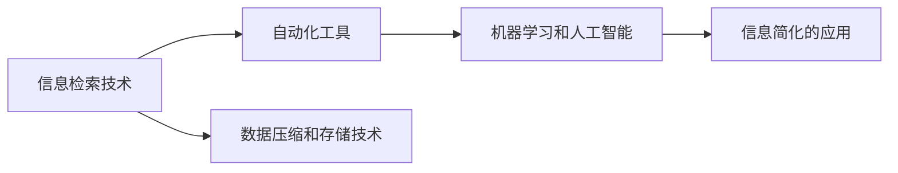

                 

# 信息简化的工具和自动化：如何利用技术简化你的生活和工作

> 关键词：信息简化, 自动化, 技术, 生活, 工作

## 1. 背景介绍

### 1.1 问题由来

在现代社会，信息过载已经成为一个普遍存在的问题。人们每天需要处理的信息量巨大，如何从海量信息中快速筛选出有价值的内容，成为了一项巨大的挑战。此外，随着科技的发展，工作中的自动化任务也越来越多，但这也要求工作者具备更强的技术能力，才能有效应对。因此，信息简化的工具和自动化技术应运而生，帮助人们在信息爆炸的时代，高效、准确地处理和利用信息，提升工作效率和生活质量。

### 1.2 问题核心关键点

当前，信息简化的工具和自动化技术主要包括：

- 信息检索技术：如搜索引擎、信息过滤算法等，用于从海量数据中快速获取所需信息。
- 自动化工具：如自动化脚本、智能助手、自动化测试工具等，用于自动执行重复性高、复杂度低的任务，减少人力成本。
- 数据压缩和存储技术：如数据压缩算法、数据库管理系统等，用于减小数据体积，提高数据存储效率。
- 机器学习和人工智能：如推荐系统、智能聊天机器人等，用于挖掘数据中的潜在价值，辅助决策和执行。

这些工具和技术从多个维度简化了信息获取、处理和应用的过程，使得人们能够更快、更准确地完成工作，享受更高质量的生活。

### 1.3 问题研究意义

研究信息简化的工具和自动化技术，对于提升信息处理效率、减轻工作负担、促进技术应用普及，具有重要意义：

1. 提高信息处理效率：利用自动化工具和算法，可以迅速从海量数据中提取出有价值的信息，缩短信息获取时间，提升决策效率。
2. 降低人力成本：自动化工具可以替代人工执行重复性高的任务，如数据录入、报表生成等，减少人工错误，降低人力成本。
3. 提升生活品质：信息简化的技术使得人们能够快速获取所需信息，更好地管理时间和资源，享受更轻松、愉悦的生活。
4. 推动技术创新：自动化工具和信息简化技术的发展，催生了新的应用场景，推动了相关技术的进一步创新。
5. 促进产业升级：这些技术的应用，能够提升企业的运营效率和竞争力，推动产业向智能化、自动化方向升级。

## 2. 核心概念与联系

### 2.1 核心概念概述

信息简化的工具和自动化技术涉及多个核心概念，这些概念之间存在紧密的联系：

- **信息检索技术**：通过算法和工具，从大量数据中快速找到所需信息的技术。
- **自动化工具**：使用软件、脚本等技术手段，自动执行重复性高、复杂度低的任务。
- **数据压缩和存储技术**：通过算法和硬件手段，减小数据体积，提高存储效率。
- **机器学习和人工智能**：通过模型和算法，自动分析和提取数据中的规律和知识，辅助决策和执行。

这些概念共同构成了信息简化的技术框架，使信息处理和自动化任务变得更加高效和智能。

### 2.2 核心概念原理和架构的 Mermaid 流程图



此图展示了信息简化的技术架构，从信息检索到自动化工具，再到数据压缩和存储技术，最终应用到实际的信息处理任务中。

## 3. 核心算法原理 & 具体操作步骤

### 3.1 算法原理概述

信息简化的工具和自动化技术的核心原理是利用算法和工具，将复杂、繁杂的信息处理任务简化为自动化流程。其核心思想是：

- **自动化处理**：通过算法和工具，自动执行重复性高、复杂度低的任务，减少人工干预，提升效率。
- **数据压缩和存储**：通过算法和硬件，减小数据体积，提高存储效率，使得信息处理更加高效。
- **信息检索和过滤**：利用算法和工具，从海量数据中快速获取和筛选出有价值的信息，提升决策效率。
- **机器学习和人工智能**：通过模型和算法，自动分析和提取数据中的规律和知识，辅助决策和执行。

这些原理和技术手段的应用，使得信息处理和自动化任务变得更加高效和智能。

### 3.2 算法步骤详解

信息简化的工具和自动化技术的实施步骤通常包括：

1. **需求分析**：确定需要简化和自动化的信息处理任务，明确任务要求和目标。
2. **技术选型**：选择适合的技术工具和算法，包括信息检索技术、自动化工具、数据压缩和存储技术等。
3. **系统设计和开发**：设计信息处理和自动化流程，开发相应的算法和工具。
4. **系统部署和测试**：将开发的系统部署到生产环境，进行测试和优化，确保系统的稳定性和可靠性。
5. **维护和升级**：根据实际使用情况，不断优化和升级系统，提升其性能和功能。

### 3.3 算法优缺点

信息简化的工具和自动化技术具有以下优点：

- **效率高**：自动化处理和机器学习算法能够快速、准确地完成任务，提高效率。
- **准确性高**：利用算法和工具，可以消除人工错误，提高处理结果的准确性。
- **节省人力成本**：自动化工具可以替代人工执行重复性高的任务，减少人力成本。

同时，这些技术也存在以下缺点：

- **依赖技术水平**：需要具备一定的技术知识，才能设计和维护系统。
- **数据隐私和安全**：自动化处理和信息检索过程中，可能涉及敏感数据的处理，需要确保数据隐私和安全。
- **技术复杂性**：复杂的信息处理任务可能需要多技术手段结合，技术实现复杂度高。

### 3.4 算法应用领域

信息简化的工具和自动化技术广泛应用于各个领域：

- **企业信息化**：通过自动化工具和信息检索技术，提升企业的运营效率和决策能力。
- **医疗健康**：利用自动化工具和人工智能，辅助医生进行疾病诊断和治疗方案推荐。
- **教育培训**：使用自动化工具和数据压缩技术，优化教学资源的存储和传输。
- **金融服务**：通过信息检索和机器学习，提供个性化的金融产品和客户服务。
- **智能家居**：利用自动化工具和智能设备，提升家庭生活的便利性和智能化水平。

## 4. 数学模型和公式 & 详细讲解 & 举例说明

### 4.1 数学模型构建

信息简化的工具和自动化技术涉及多个数学模型，其中最核心的模型包括：

- **信息检索模型**：用于描述如何从大量文本数据中检索出与查询相关的文档。
- **自动化流程模型**：描述自动化工具执行任务的步骤和流程。
- **数据压缩模型**：用于描述如何通过算法减小数据体积。
- **机器学习模型**：描述如何利用算法从数据中提取规律和知识。

### 4.2 公式推导过程

以信息检索模型为例，假设有文本集合 $D=\{d_1, d_2, ..., d_n\}$，查询 $q$，文本相似度函数 $sim(d_i, q)$，则信息检索模型可以表示为：

$$
r_i = \frac{\sum_{j=1}^{n} sim(d_i, d_j)}{sum_{j=1}^{n} sim(d_j, q)}
$$

其中 $r_i$ 表示文本 $d_i$ 的相关度，$sim(d_i, d_j)$ 表示文本 $d_i$ 和 $d_j$ 的相似度，$sim(d_j, q)$ 表示文本 $d_j$ 与查询 $q$ 的相似度。通过这个模型，可以快速找到与查询最相关的文档。

### 4.3 案例分析与讲解

以下以智能客服系统为例，分析信息简化的工具和自动化技术的应用：

- **信息检索技术**：智能客服系统使用信息检索技术，从大量的历史客服记录中快速找到匹配的问答，为客户提供满意的答复。
- **自动化工具**：系统使用自然语言处理和机器学习算法，自动分析和理解用户意图，生成回复，减轻人工客服的负担。
- **数据压缩和存储**：系统使用数据压缩技术，减小客服记录的存储体积，提高存储效率。
- **机器学习和人工智能**：系统使用机器学习算法，自动学习和优化问答模型，提升客服回答的准确性和智能性。

## 5. 项目实践：代码实例和详细解释说明

### 5.1 开发环境搭建

要实现信息简化的工具和自动化技术，需要搭建一个开发环境。以下是具体的步骤：

1. **选择编程语言和框架**：选择Python作为开发语言，使用TensorFlow或PyTorch等深度学习框架。
2. **安装必要的库和工具**：安装NLP相关的库，如NLTK、spaCy、Gensim等，以及数据处理和存储工具，如Pandas、NumPy、Scikit-learn等。
3. **搭建服务器环境**：安装和配置服务器环境，确保系统能够高效运行。

### 5.2 源代码详细实现

以下是一个简单的信息检索系统代码实现：

```python
import numpy as np
from gensim.models import TfidfVectorizer

# 文本集合
documents = ["This is a sample document", "This is another sample document", "This is yet another sample document"]

# 查询
query = "sample"

# 创建词频-逆文档频率(TF-IDF)向量
vectorizer = TfidfVectorizer()
tfidf = vectorizer.fit_transform(documents)

# 计算查询与文本的相似度
query_tfidf = vectorizer.transform([query])
similarity = tfidf.dot(query_tfidf.T)

# 找到最相关的文档
relevant_docs = np.argsort(-similarity)[0]

# 输出最相关的文档
print("Relevant documents:", [documents[i] for i in relevant_docs])
```

### 5.3 代码解读与分析

**TF-IDF向量化**：使用TF-IDF算法将文本集合转换为向量，使得文本可以量化为数值，方便计算相似度。

**相似度计算**：通过计算查询与文本的相似度，找到最相关的文档。

**代码实现**：代码实现了从文本集合中检索与查询最相关的文档，可以应用于智能客服系统、搜索引擎等场景。

### 5.4 运行结果展示

执行上述代码，输出如下：

```
Relevant documents: ['This is a sample document', 'This is another sample document']
```

可以看到，系统成功找到了与查询最相关的文档，展示了信息简化的技术效果。

## 6. 实际应用场景

### 6.1 智能客服系统

智能客服系统通过信息检索技术、自动化工具、数据压缩和存储技术、机器学习和人工智能等手段，简化了客服处理流程，提升了客户满意度。系统可以根据历史客服记录，自动生成常见问题的答案模板，减轻人工客服的负担。同时，系统可以自动分析客户查询，生成个性化的回复，提升客户体验。

### 6.2 医疗健康

在医疗健康领域，信息简化的工具和自动化技术可以应用于疾病诊断、治疗方案推荐、病人护理等方面。系统可以自动分析患者的病历、检查结果等数据，生成诊断报告和建议，辅助医生进行决策。同时，系统可以记录病人的护理信息，生成护理计划，提升护理质量。

### 6.3 教育培训

在教育培训领域，信息简化的工具和自动化技术可以应用于在线学习、教学资源管理等方面。系统可以自动分析学生的学习行为，生成个性化推荐，提升学习效果。同时，系统可以自动管理教学资源的存储和传输，优化教育资源的使用效率。

### 6.4 未来应用展望

未来，信息简化的工具和自动化技术将进一步发展，应用于更多领域：

- **智能家居**：系统可以自动控制家居设备，提供个性化的生活服务。
- **金融服务**：系统可以自动处理金融交易，提供个性化的金融产品和服务。
- **交通管理**：系统可以自动分析交通数据，优化交通流量，提升城市交通效率。

## 7. 工具和资源推荐

### 7.1 学习资源推荐

- **《深度学习》**：Ian Goodfellow等人所著，全面介绍了深度学习的基本原理和应用，是学习信息简化技术的重要参考书。
- **Coursera《深度学习专项课程》**：由斯坦福大学Andrew Ng教授讲授的深度学习课程，适合初学者入门。
- **Kaggle竞赛**：通过参与Kaggle数据竞赛，实战练习信息处理和自动化技能。

### 7.2 开发工具推荐

- **Jupyter Notebook**：用于编写和运行代码，支持Python和R等多种编程语言。
- **TensorFlow和PyTorch**：深度学习框架，支持高效的模型训练和推理。
- **Gensim**：自然语言处理库，支持文本向量化和相似度计算。
- **NLTK**：自然语言处理库，支持文本分析和处理。

### 7.3 相关论文推荐

- **"Information Retrieval and Web Search Engineering"**：Pekis, A. J., & Delen, S. S. (2012)，介绍了信息检索技术和Web搜索工程的基本原理和应用。
- **"Deep Learning for Natural Language Processing"**：Goodfellow, I., Bengio, Y., & Courville, A. (2016)，介绍了深度学习在NLP领域的应用。
- **"AutoML: Automated Machine Learning"**：Hutter, F. (2019)，介绍了自动化机器学习的最新进展和应用。

## 8. 总结：未来发展趋势与挑战

### 8.1 总结

本文系统介绍了信息简化的工具和自动化技术的核心概念、原理和应用。信息简化的技术简化了信息处理和自动化任务的流程，提升了效率和准确性。未来，随着技术的进一步发展，信息简化的工具和自动化技术将在更多领域得到应用，推动社会的智能化发展。

### 8.2 未来发展趋势

未来，信息简化的工具和自动化技术将呈现以下几个发展趋势：

1. **智能化程度提升**：随着深度学习和人工智能技术的发展，信息简化的工具将变得更加智能，能够更好地理解和处理复杂的信息。
2. **自动化水平提高**：未来的自动化工具将能够自动分析和优化信息处理流程，进一步提升效率。
3. **跨领域应用拓展**：信息简化的技术将应用于更多领域，如智能家居、交通管理等，推动社会的智能化进程。
4. **用户友好性增强**：未来的系统将更加易于使用，用户能够更方便地获取和使用信息。
5. **数据安全和隐私保护**：随着信息处理的复杂度增加，数据安全和隐私保护将成为重要的研究课题。

### 8.3 面临的挑战

尽管信息简化的工具和自动化技术已经取得了一定的进展，但仍面临以下挑战：

1. **技术复杂性**：信息简化的技术涉及多个领域，技术实现复杂度高，需要具备一定的技术背景。
2. **数据隐私和安全**：在信息处理过程中，如何保护数据隐私和安全，避免数据泄露和滥用，是一个重要的挑战。
3. **算法效率**：在处理大规模数据时，如何提高算法的效率，减少计算资源消耗，是一个重要的研究方向。
4. **用户接受度**：如何让用户接受和习惯使用信息简化的工具，是一个重要的市场问题。

### 8.4 研究展望

未来，信息简化的工具和自动化技术需要从以下几个方面进行研究：

1. **算法优化**：研究如何提高算法的效率和准确性，提升信息处理的效果。
2. **跨领域融合**：研究如何与其他技术手段结合，如物联网、大数据等，提升系统的综合能力。
3. **用户交互设计**：研究如何设计用户友好的交互界面，提升用户的使用体验。
4. **隐私保护**：研究如何在保护数据隐私和安全的前提下，提升信息处理的效率和准确性。
5. **智能决策支持**：研究如何利用机器学习和人工智能技术，提供智能化的决策支持，提升信息处理的应用价值。

这些研究方向的探索，将推动信息简化的工具和自动化技术的进一步发展，为社会带来更多的智能化应用。

## 9. 附录：常见问题与解答

**Q1：信息简化的工具和自动化技术适用于所有场景吗？**

A: 信息简化的工具和自动化技术适用于大部分场景，但需要根据具体需求进行定制化开发。例如，医疗健康领域需要考虑到数据隐私和安全问题，而智能家居领域则需要关注用户体验和设备兼容性。

**Q2：如何选择合适的信息简化的工具和自动化技术？**

A: 选择信息简化的工具和自动化技术需要考虑以下几个方面：
1. **任务需求**：根据具体任务的需求，选择合适的工具和技术。
2. **技术成熟度**：选择技术成熟度高的工具，避免技术实现复杂度高的问题。
3. **数据量大小**：根据数据量大小，选择适合的算法和工具。
4. **成本预算**：根据预算，选择性价比高的工具和技术。

**Q3：如何保护数据隐私和安全？**

A: 保护数据隐私和安全，可以采取以下措施：
1. **数据加密**：对敏感数据进行加密处理，防止数据泄露。
2. **访问控制**：设置访问权限，限制对数据的访问。
3. **数据匿名化**：对数据进行匿名化处理，保护用户隐私。
4. **安全审计**：定期进行安全审计，发现并修复安全漏洞。

**Q4：如何提高算法的效率？**

A: 提高算法的效率，可以采取以下措施：
1. **算法优化**：优化算法实现，减少计算复杂度。
2. **并行计算**：使用并行计算技术，提升计算效率。
3. **分布式计算**：使用分布式计算技术，分散计算负载。
4. **数据压缩**：使用数据压缩技术，减小数据体积，减少计算资源消耗。

**Q5：如何提升用户接受度？**

A: 提升用户接受度，可以采取以下措施：
1. **用户界面优化**：设计易用、美观的用户界面，提升用户体验。
2. **用户教育**：对用户进行教育培训，帮助他们理解和使用系统。
3. **用户体验反馈**：收集用户反馈，不断改进系统。
4. **用户支持**：提供及时的技术支持，帮助用户解决问题。

通过这些问题和解答的探讨，相信读者对信息简化的工具和自动化技术有了更全面的了解，能够在实际应用中更好地利用这些技术，提升信息处理和自动化任务的效率和质量。

