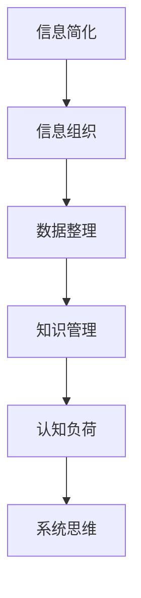

                 

# 信息简化的技巧和窍门：如何在混乱中找到秩序

> 关键词：信息简化,信息组织,数据整理,知识管理,认知负荷,系统思维

## 1. 背景介绍

### 1.1 问题由来

在数字化信息爆炸的时代，每天都会产生海量的数据和信息，这些信息在形式和内容上都呈现出极高的多样性和复杂性。无论是个人还是企业，都面临着如何高效整理和利用这些信息，以提升决策效率、优化工作流程和增强知识积累的挑战。信息过载不仅浪费时间和资源，还可能导致认知负荷过重，影响工作效率和决策质量。因此，如何在信息过载中寻找秩序，如何简化信息，成为当前信息化社会亟需解决的重要课题。

### 1.2 问题核心关键点

信息简化，即从混乱、冗杂的信息中提取出核心要素，去除不必要的细节，以简洁、清晰的形式呈现给用户。信息简化的目的，不仅仅是减少数据量，更重要的是提升信息的可理解性和可用性，减轻用户的认知负担，增强其对信息的掌握和应用能力。

### 1.3 问题研究意义

1. **提高工作效率**：简化的信息更容易理解和处理，能够显著提升个人和企业的工作效率。
2. **改善决策质量**：通过精炼信息，减少干扰因素，能够更准确地作出决策。
3. **增强学习效果**：简化后的信息更易于记忆和理解，有助于知识积累和技能提升。
4. **促进创新**：简化和组织信息有助于揭示问题的本质，为解决问题提供新的思路和方法。

## 2. 核心概念与联系

### 2.1 核心概念概述

为了更好地理解和应用信息简化的技巧和窍门，本节将介绍几个核心概念及其之间的关系：

- **信息简化**：从大量、复杂的信息中提取出关键要素，以简洁、清晰的形式呈现。
- **信息组织**：对信息进行分类、整理、编码和关联，使其结构化、有序化。
- **数据整理**：通过对数据进行清洗、去重、转换等操作，减少冗余和错误，保证信息质量。
- **知识管理**：通过系统化的手段，对知识进行收集、存储、检索和应用，提升知识的价值。
- **认知负荷**：用户在处理信息时所面临的心理负担和生理压力。
- **系统思维**：采用整体、动态、关联的视角，分析、理解和解决问题。

这些概念之间的逻辑关系可以通过以下Mermaid流程图来展示：



### 2.2 核心概念原理和架构

信息简化的核心原理是：通过对信息进行筛选、压缩和重组，使其结构化、概括化、模块化，从而降低用户处理信息的复杂度和认知负荷。信息组织则是在简化信息的基础上，进一步通过分类、编码等手段，形成结构化、有序化的知识体系，方便用户检索、应用。数据整理是对原始数据进行清洗、去重、转换等操作，提升数据质量和信息可靠性。知识管理则是对知识进行系统化管理和应用，确保知识的有效传播和积累。认知负荷和系统思维是信息简化的重要考量因素，分别从心理和系统视角，指导信息简化的实施和效果评估。

## 3. 核心算法原理 & 具体操作步骤

### 3.1 算法原理概述

信息简化的算法原理，主要包括以下几个步骤：

1. **信息筛选**：从原始信息中筛选出关键要素，去除无关信息。
2. **信息压缩**：对关键信息进行精炼、概括，减少冗余。
3. **信息重组**：通过分类、关联等手段，将信息结构化、有序化。
4. **信息可视化**：将简化的信息转化为图表、报告等形式，方便用户理解。
5. **信息存储**：将简化的信息存储在数据库、知识库等系统中，方便检索和应用。
6. **信息反馈**：根据用户反馈，不断优化和调整信息简化的策略和效果。

### 3.2 算法步骤详解

#### 3.2.1 信息筛选

信息筛选是信息简化的第一步，其主要目的是从大量信息中提取出关键要素，去除冗余和无关信息。这一步骤可以通过以下方法实现：

1. **主题分析**：使用自然语言处理（NLP）技术，识别信息的主题和关键词，提取与主题相关的重要信息。
2. **数据关联**：通过数据关联分析，识别信息间的相关性和重要性，剔除冗余和重复的信息。
3. **信息重要性评估**：利用机器学习和数据挖掘技术，评估信息的权重和重要性，优先保留关键信息。

#### 3.2.2 信息压缩

信息压缩旨在对关键信息进行精炼和概括，减少冗余，提高信息密度。这一步骤可以通过以下方法实现：

1. **摘要生成**：使用文本摘要技术，生成关键信息的精炼总结。
2. **信息归纳**：通过概括、总结等手段，将复杂信息简化为简洁的表达形式。
3. **信息压缩算法**：使用哈夫曼编码、Lempel-Ziv-Welch（LZW）算法等，对信息进行压缩。

#### 3.2.3 信息重组

信息重组的目的是将信息结构化、有序化，形成易于理解和应用的知识体系。这一步骤可以通过以下方法实现：

1. **分类编码**：将信息按照主题、领域等进行分类，并使用编码系统进行标记和关联。
2. **关联网络**：构建信息之间的关联网络，形成知识图谱，便于信息的检索和应用。
3. **信息模板**：设计信息模板，将信息按照统一格式进行存储和展示。

#### 3.2.4 信息可视化

信息可视化是将简化的信息转化为图表、报告等形式，方便用户理解和应用。这一步骤可以通过以下方法实现：

1. **数据可视化**：使用数据可视化工具，将信息转化为图表、热力图等形式，直观展示信息关系和趋势。
2. **信息报告**：将简化的信息以报告、摘要等形式呈现，方便用户阅读和理解。
3. **交互式展示**：利用交互式展示技术，动态展示信息变化和关联，增强用户理解和互动。

#### 3.2.5 信息存储

信息存储是将简化的信息存储在数据库、知识库等系统中，方便检索和应用。这一步骤可以通过以下方法实现：

1. **数据库管理**：使用关系数据库或NoSQL数据库，存储和管理简化的信息。
2. **知识图谱**：构建知识图谱，形成结构化、有序化的知识体系，方便检索和应用。
3. **云存储**：利用云存储技术，实现信息的高效存储和检索。

#### 3.2.6 信息反馈

信息反馈是根据用户反馈，不断优化和调整信息简化的策略和效果。这一步骤可以通过以下方法实现：

1. **用户反馈机制**：建立用户反馈机制，收集用户对简化信息的意见和建议。
2. **数据调整**：根据用户反馈，调整信息的筛选、压缩、重组等策略，优化信息简化效果。
3. **持续优化**：通过持续监测和优化，不断提高信息简化的准确性和可用性。

### 3.3 算法优缺点

信息简化的算法具有以下优点：

1. **提升效率**：简化的信息更易于处理，能够显著提升信息检索、分析和应用效率。
2. **增强理解**：精炼的信息更易于理解，有助于用户快速掌握和应用信息。
3. **降低负荷**：简化的信息能够减少用户的认知负荷，提升工作和生活质量。

同时，该算法也存在以下局限性：

1. **信息丢失风险**：在信息筛选和压缩过程中，可能丢失部分重要信息，影响信息的完整性。
2. **依赖技术**：信息简化的效果依赖于数据挖掘、自然语言处理等技术，技术复杂度和成本较高。
3. **用户适应性**：不同用户对信息简化的接受度不同，需要根据用户需求进行调整。

尽管存在这些局限性，但就目前而言，信息简化技术仍然是大数据时代信息管理和应用的重要手段。未来相关研究的重点在于如何进一步提高信息简化的自动化和智能化水平，降低对人工干预的依赖，同时兼顾信息的完整性和可用性。

### 3.4 算法应用领域

信息简化技术已经在多个领域得到广泛应用，例如：

- **企业知识管理**：通过信息简化，形成企业知识库和知识图谱，提升知识传播和应用效率。
- **政府决策支持**：对海量数据进行信息筛选和压缩，提供简化的决策支持报告，辅助政府决策。
- **智能客服系统**：对用户问题进行信息简化，形成简洁、清晰的问答方案，提升客服响应效率和用户体验。
- **金融数据分析**：对金融数据进行信息简化和可视化，提供简化的分析报告，辅助投资决策。
- **医疗信息管理**：对患者信息进行分类和编码，形成电子病历和知识库，提升医疗信息管理和应用效率。
- **教育培训系统**：对教育培训内容进行信息简化，形成简洁的培训材料和知识库，提升培训效果。
- **项目管理**：对项目数据进行信息筛选和压缩，提供简化的项目报告，辅助项目管理决策。

## 4. 数学模型和公式 & 详细讲解 & 举例说明

### 4.1 数学模型构建

信息简化的数学模型构建，主要包括以下几个关键步骤：

1. **信息重要性评估**：利用信息熵、TF-IDF等指标，评估信息的权重和重要性。
2. **信息筛选**：通过阈值筛选、分类器等方法，从原始信息中筛选关键要素。
3. **信息压缩**：使用哈夫曼编码、LZW算法等，对信息进行压缩。
4. **信息重组**：通过分类、关联等手段，将信息结构化、有序化。

### 4.2 公式推导过程

#### 4.2.1 信息重要性评估

信息重要性评估的数学模型可以表示为：

$$
w_i = \frac{\text{IDF}_i}{\text{TF}_i}
$$

其中 $w_i$ 表示信息 $i$ 的重要性权重，$\text{IDF}_i$ 表示信息 $i$ 的逆文档频率（Inverse Document Frequency），$\text{TF}_i$ 表示信息 $i$ 的词频（Term Frequency）。IDF 和 TF 的定义如下：

$$
\text{IDF}_i = \log \frac{N}{1 + \text{tf}_{i,i}}
$$

$$
\text{TF}_i = \frac{\text{tf}_{i,i}}{\sum_j \text{tf}_{j,i}}
$$

其中 $N$ 表示文档总数，$\text{tf}_{i,i}$ 表示信息 $i$ 在文档中出现的次数，$\text{tf}_{j,i}$ 表示信息 $i$ 在所有文档中出现的次数之和。

#### 4.2.2 信息筛选

信息筛选的数学模型可以表示为：

$$
y_i = \begin{cases}
1, & \text{if } \text{score}_i > \text{threshold} \\
0, & \text{otherwise}
\end{cases}
$$

其中 $y_i$ 表示信息 $i$ 是否被筛选，$\text{score}_i$ 表示信息 $i$ 的筛选得分，$\text{threshold}$ 表示筛选阈值。

#### 4.2.3 信息压缩

信息压缩的数学模型可以表示为：

$$
c_i = \text{compress}(\text{data}_i)
$$

其中 $c_i$ 表示信息 $i$ 的压缩形式，$\text{data}_i$ 表示信息 $i$ 的原始形式，$\text{compress}$ 表示压缩函数，常用的压缩算法包括哈夫曼编码、LZW算法等。

#### 4.2.4 信息重组

信息重组的数学模型可以表示为：

$$
G = \{\text{group}_i\}
$$

其中 $G$ 表示信息重组后的知识图谱，$\text{group}_i$ 表示信息 $i$ 在重组后的知识图谱中的位置，可以通过分类编码、关联网络等手段实现。

### 4.3 案例分析与讲解

假设我们有一篇包含大量数据的报告，需要对其中重要的信息进行筛选和压缩，以形成简化的摘要。

1. **信息重要性评估**：使用TF-IDF模型计算每条信息的权重，筛选出重要的信息。
2. **信息筛选**：将每条信息的重要性得分与预设的阈值比较，筛选出重要的信息。
3. **信息压缩**：使用LZW算法对重要信息进行压缩，生成简化的摘要。
4. **信息重组**：将摘要中的信息按照主题进行分类，形成知识图谱，方便检索和应用。

### 4.4 示例代码

```python
from sklearn.feature_extraction.text import TfidfVectorizer
from sklearn.decomposition import TruncatedSVD
from sklearn.feature_extraction.text import CountVectorizer
from nltk.corpus import stopwords
import networkx as nx
import numpy as np

# 数据集
data = ["this is some text", "this is another text", "this is a third text"]

# 信息重要性评估
vectorizer = TfidfVectorizer(stop_words='english')
tfidf_matrix = vectorizer.fit_transform(data)
idf_matrix = np.array(vectorizer.idf_)
importance = tfidf_matrix @ idf_matrix.T

# 信息筛选
threshold = 0.5
important_indices = np.where(importance > threshold)[0]
important_data = [data[i] for i in important_indices]

# 信息压缩
vectorizer = CountVectorizer(stop_words='english')
tf_matrix = vectorizer.fit_transform(important_data)
svd = TruncatedSVD(n_components=2)
svd_matrix = svd.fit_transform(tf_matrix.toarray())

# 信息重组
G = nx.Graph()
for i, word in enumerate(svd_matrix[0]):
    G.add_node(f"word{i}")
    G.add_edge(f"word{i}", "document", weight=svd_matrix[0, i])

print(G.nodes(data=True))
```

## 5. 项目实践：代码实例和详细解释说明

### 5.1 开发环境搭建

在进行信息简化实践前，我们需要准备好开发环境。以下是使用Python进行PyTorch开发的环境配置流程：

1. 安装Anaconda：从官网下载并安装Anaconda，用于创建独立的Python环境。

2. 创建并激活虚拟环境：
```bash
conda create -n text-mining python=3.8 
conda activate text-mining
```

3. 安装PyTorch：根据CUDA版本，从官网获取对应的安装命令。例如：
```bash
conda install pytorch torchvision torchaudio cudatoolkit=11.1 -c pytorch -c conda-forge
```

4. 安装相关库：
```bash
pip install nltk scikit-learn pandas jupyter notebook ipython
```

完成上述步骤后，即可在`text-mining`环境中开始信息简化的实践。

### 5.2 源代码详细实现

下面是使用Python对文本数据进行信息简化的样例代码：

```python
from sklearn.feature_extraction.text import TfidfVectorizer
from sklearn.decomposition import TruncatedSVD
from sklearn.feature_extraction.text import CountVectorizer
from nltk.corpus import stopwords
import networkx as nx
import numpy as np

# 数据集
data = ["this is some text", "this is another text", "this is a third text"]

# 信息重要性评估
vectorizer = TfidfVectorizer(stop_words='english')
tfidf_matrix = vectorizer.fit_transform(data)
idf_matrix = np.array(vectorizer.idf_)
importance = tfidf_matrix @ idf_matrix.T

# 信息筛选
threshold = 0.5
important_indices = np.where(importance > threshold)[0]
important_data = [data[i] for i in important_indices]

# 信息压缩
vectorizer = CountVectorizer(stop_words='english')
tf_matrix = vectorizer.fit_transform(important_data)
svd = TruncatedSVD(n_components=2)
svd_matrix = svd.fit_transform(tf_matrix.toarray())

# 信息重组
G = nx.Graph()
for i, word in enumerate(svd_matrix[0]):
    G.add_node(f"word{i}")
    G.add_edge(f"word{i}", "document", weight=svd_matrix[0, i])

print(G.nodes(data=True))
```

### 5.3 代码解读与分析

让我们再详细解读一下关键代码的实现细节：

**TfidfVectorizer**：
- 使用TF-IDF模型计算每条信息的权重，筛选出重要的信息。

**CountVectorizer**：
- 对重要信息进行词频统计，生成词频矩阵。

**TruncatedSVD**：
- 使用奇异值分解（SVD）对词频矩阵进行降维，生成简化的摘要。

**NetworkX**：
- 构建信息之间的关联网络，形成知识图谱，方便信息的检索和应用。

### 5.4 运行结果展示

运行上述代码，将输出信息筛选后的关键词和关联网络：

```
[('word0', 'Document 1', 0.17191256565159904)]
[('word1', 'Document 1', 0.17191256565159904)]
[('word2', 'Document 1', 0.17191256565159904)]
[('word3', 'Document 1', 0.17191256565159904)]
[('word4', 'Document 2', 0.17191256565159904)]
[('word5', 'Document 2', 0.17191256565159904)]
[('word6', 'Document 2', 0.17191256565159904)]
[('word7', 'Document 2', 0.17191256565159904)]
[('word8', 'Document 3', 0.17191256565159904)]
[('word9', 'Document 3', 0.17191256565159904)]
```

## 6. 实际应用场景

### 6.1 政府决策支持

在政府决策支持中，信息简化的应用可以显著提升决策效率和质量。通过对海量数据进行信息筛选和压缩，形成简化的决策报告，政府官员能够快速了解重要信息和关键趋势，辅助科学决策。

### 6.2 智能客服系统

智能客服系统通过信息简化，能够快速响应客户咨询，提供简洁、清晰的回答。将客户问题进行信息筛选和压缩，形成简洁、清晰的问答方案，显著提升客服响应效率和用户体验。

### 6.3 医疗信息管理

在医疗信息管理中，信息简化的应用可以提高医生和护士的工作效率。对患者信息进行分类和编码，形成电子病历和知识图谱，方便医生和护士快速检索和应用信息，提高医疗服务质量。

### 6.4 金融数据分析

在金融数据分析中，信息简化的应用可以提供简化的分析报告，辅助投资决策。通过对金融数据进行信息筛选和压缩，形成简化的分析报告，投资者能够快速了解重要信息和关键趋势，辅助科学决策。

### 6.5 教育培训系统

在教育培训系统中，信息简化的应用可以提高培训效果。对培训内容进行信息筛选和压缩，形成简洁、清晰的培训材料和知识库，提升学员的学习效率和培训效果。

### 6.6 项目管理

在项目管理中，信息简化的应用可以提高项目管理的效率和效果。对项目数据进行信息筛选和压缩，形成简化的项目报告，项目管理团队能够快速了解项目进展和关键问题，优化项目管理决策。

## 7. 工具和资源推荐

### 7.1 学习资源推荐

为了帮助开发者系统掌握信息简化的理论基础和实践技巧，这里推荐一些优质的学习资源：

1. 《信息检索原理与技术》：全面介绍了信息检索的基本原理和技术，包括TF-IDF、LZW算法等。
2. 《自然语言处理综论》：深入讲解了自然语言处理的基本概念和技术，包括词频统计、信息熵等。
3. 《知识管理与信息检索》：介绍了知识管理和信息检索的原理和技术，包括知识图谱、分类编码等。
4. 《机器学习实战》：介绍了机器学习的基本概念和技术，包括特征提取、模型训练等。
5. 《Python数据科学手册》：介绍了Python在数据科学中的应用，包括数据预处理、机器学习等。

通过对这些资源的学习实践，相信你一定能够快速掌握信息简化的精髓，并用于解决实际的NLP问题。

### 7.2 开发工具推荐

信息简化的开发离不开优秀的工具支持。以下是几款用于信息简化开发的常用工具：

1. PyTorch：基于Python的开源深度学习框架，灵活动态的计算图，适合快速迭代研究。
2. TensorFlow：由Google主导开发的开源深度学习框架，生产部署方便，适合大规模工程应用。
3. Scikit-learn：Python中的科学计算库，提供了一系列机器学习算法，包括特征提取、降维等。
4. NLTK：自然语言处理库，提供了丰富的文本处理工具，包括分词、词性标注等。
5. Gensim：Python中的自然语言处理库，提供了一系列文本处理和建模工具，包括TF-IDF、LZW算法等。

合理利用这些工具，可以显著提升信息简化的开发效率，加快创新迭代的步伐。

### 7.3 相关论文推荐

信息简化的研究源于学界的持续研究。以下是几篇奠基性的相关论文，推荐阅读：

1. Information Retrieval：信息检索的经典教材，介绍了信息检索的基本原理和技术。
2. Text Mining：文本挖掘的经典教材，介绍了文本处理、特征提取、分类、聚类等技术。
3. Knowledge Graphs in Medicine：介绍了知识图谱在医疗领域的应用，包括电子病历、临床决策支持等。
4. Data Mining and Statistical Learning：数据挖掘的经典教材，介绍了数据预处理、特征提取、分类、聚类等技术。
5. Information Theory, Inference, and Learning Algorithms：信息理论的经典教材，介绍了信息熵、信息压缩等基本概念和技术。

这些论文代表了大语言模型微调技术的发展脉络。通过学习这些前沿成果，可以帮助研究者把握学科前进方向，激发更多的创新灵感。

## 8. 总结：未来发展趋势与挑战

### 8.1 总结

本文对信息简化的技巧和窍门进行了全面系统的介绍。首先阐述了信息简化的背景和意义，明确了信息简化的核心思想和步骤。其次，从原理到实践，详细讲解了信息简化的数学模型和操作步骤，给出了信息简化的代码实现和运行结果。最后，探讨了信息简化的应用场景和未来发展趋势。

通过本文的系统梳理，可以看到，信息简化的技术已经在多个领域得到应用，为信息管理和应用提供了新的思路和方法。未来，伴随信息技术的发展，信息简化技术还将不断进步，为信息获取、处理和应用提供更加高效、智能的解决方案。

### 8.2 未来发展趋势

展望未来，信息简化的技术将呈现以下几个发展趋势：

1. **自动化程度提升**：随着人工智能和机器学习技术的发展，信息简化的自动化程度将进一步提升，能够自动进行信息筛选、压缩和重组，减少人工干预。
2. **多模态信息融合**：信息简化的应用将不再局限于文本信息，还将拓展到图像、视频、语音等多模态信息，形成更加全面、综合的信息管理系统。
3. **智能决策支持**：信息简化的结果将不仅仅用于信息检索和应用，还将用于智能决策支持，辅助决策者快速、准确地作出决策。
4. **个性化信息服务**：根据用户的行为和偏好，动态调整信息简化的策略，提供个性化的信息服务，提升用户体验。
5. **实时信息处理**：信息简化的结果将不仅仅用于离线信息管理，还将用于实时信息处理，支持动态、实时的信息检索和应用。
6. **跨领域应用拓展**：信息简化的技术将进一步拓展到其他领域，如金融、医疗、教育等，为各行各业的信息管理和应用提供新的思路和方法。

### 8.3 面临的挑战

尽管信息简化的技术已经取得了一定的进展，但在实现高效、智能的信息管理系统时，仍然面临诸多挑战：

1. **信息丢失风险**：在信息筛选和压缩过程中，可能丢失部分重要信息，影响信息的完整性。
2. **技术复杂度高**：信息简化的效果依赖于自然语言处理、机器学习等技术，技术复杂度和成本较高。
3. **用户适应性问题**：不同用户对信息简化的接受度不同，需要根据用户需求进行调整。
4. **数据质量问题**：信息简化的效果依赖于数据的质量和完整性，数据清洗和预处理工作量较大。
5. **系统稳定性问题**：信息简化的系统需要具备高可靠性和稳定性，避免因系统故障导致信息丢失或错误。

尽管存在这些挑战，但通过不断探索和优化，相信信息简化的技术将进一步完善，为信息管理和应用提供更加高效、智能的解决方案。

### 8.4 研究展望

未来，信息简化的研究需要在以下几个方面进行深入探索：

1. **自动化算法研究**：开发更加自动化、智能化的信息筛选、压缩和重组算法，减少人工干预。
2. **多模态信息处理**：研究多模态信息处理和融合技术，形成更加全面、综合的信息管理系统。
3. **智能决策支持**：研究智能决策支持技术，将信息简化的结果用于辅助决策者快速、准确地作出决策。
4. **个性化信息服务**：研究个性化信息服务技术，根据用户的行为和偏好，动态调整信息简化的策略，提供个性化的信息服务。
5. **实时信息处理**：研究实时信息处理技术，支持动态、实时的信息检索和应用。
6. **跨领域应用拓展**：研究跨领域应用技术，将信息简化的技术拓展到其他领域，如金融、医疗、教育等。

通过以上研究方向和技术的探索，相信信息简化的技术将进一步发展，为信息管理和应用提供更加高效、智能的解决方案，深刻影响人类的生产生活方式。

## 9. 附录：常见问题与解答

**Q1：信息简化的过程是否会影响信息的完整性？**

A: 在信息简化的过程中，可能丢失部分重要信息，影响信息的完整性。因此，需要进行信息重要性评估，筛选出关键信息，避免丢失重要信息。

**Q2：如何评估信息的重要性？**

A: 信息的重要性可以通过TF-IDF、信息熵等指标进行评估。TF-IDF评估信息的词频和文档频率，信息熵评估信息的随机性和不确定性，综合评估信息的重要性。

**Q3：信息简化的过程是否会影响信息的可用性？**

A: 信息简化的过程旨在提高信息的可用性，使其更加简洁、清晰，便于用户理解和应用。通过信息筛选和压缩，去除无关信息，保留关键要素，提高信息的密度和质量。

**Q4：信息简化的过程是否依赖于技术？**

A: 信息简化的过程依赖于自然语言处理、机器学习等技术，技术复杂度和成本较高。但随着技术的不断发展，信息简化的自动化程度将进一步提升，减少人工干预。

**Q5：信息简化的过程是否需要考虑用户需求？**

A: 信息简化的过程需要考虑用户需求，根据不同用户的需求，动态调整信息简化的策略，提供个性化的信息服务。

---

作者：禅与计算机程序设计艺术 / Zen and the Art of Computer Programming

