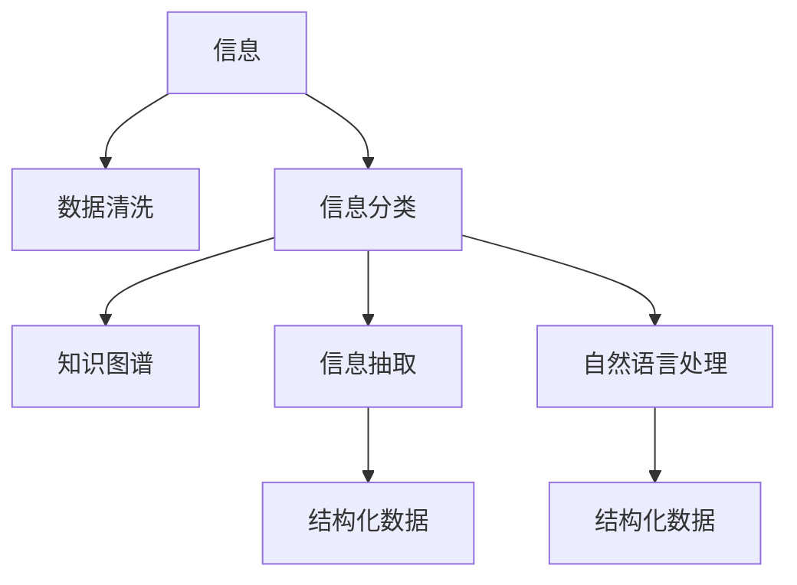

                 

# 信息简化的最佳实践：如何在混乱中建立秩序

## 1. 背景介绍

在当今数据爆炸的时代，信息处理已成为企业和个人面临的一项重大挑战。信息量的激增带来了便利，但也带来了混乱和噪声。如何高效地处理、分析和利用海量信息，是信息时代的一项关键技能。信息简化的最佳实践，旨在通过结构化、系统化的方法，帮助我们在混乱中建立秩序，提升信息处理的效率和质量。

### 1.1 问题由来

信息的爆炸式增长和无处不在的噪声，使得信息的筛选、处理和利用变得更加复杂和困难。传统的线性信息处理流程，如简单的筛选、分类和存储，已经无法满足日益增长的需求。如何从海量信息中提炼有价值的内容，构建高效的信息处理体系，成为了当前信息科学和工程的核心问题之一。

### 1.2 问题核心关键点

信息简化的最佳实践，核心在于如何系统化地处理信息，构建信息流的有序性。这包括但不限于：

- 数据清洗与预处理：去除噪声和冗余信息，构建清晰的数据结构。
- 信息分类与组织：将信息分类，建立知识体系，实现信息的高效检索和查询。
- 信息抽取与转化：从信息中抽取关键内容，转化为可操作的格式或结构。
- 知识管理和应用：将信息转化为知识，支持决策、学习和创新。

这些关键点共同构成了信息简化的目标，旨在通过高效的信息处理体系，提升信息的价值和应用效果。

### 1.3 问题研究意义

信息简化的最佳实践，不仅有助于企业和个人提升信息处理能力，还能够在多个领域带来深远影响：

- 提升决策质量：通过结构化的信息处理，决策者可以更准确地把握信息的关键点，做出更科学合理的决策。
- 促进创新和学习：系统化地组织和分析信息，有助于知识的学习和创新，推动技术进步和行业发展。
- 优化资源配置：通过高效的信息处理，可以优化资源配置，提升工作效率和质量。
- 增强信息安全：通过清洗和监控信息，可以减少潜在的安全威胁和风险。

总之，信息简化的最佳实践，是提升信息处理能力、优化资源配置、增强决策质量的重要手段，对于信息时代的发展具有重要意义。

## 2. 核心概念与联系

### 2.1 核心概念概述

为了更好地理解信息简化的最佳实践，我们首先介绍几个关键概念：

- **信息简化**：通过结构化、系统化的方法，去除冗余信息，构建清晰的信息结构，提升信息处理效率和质量。
- **数据清洗**：从原始数据中去除噪声和无用信息，构建干净、格式一致的数据集。
- **信息分类**：将信息按照一定的标准分类，建立结构化的知识体系。
- **知识图谱**：将信息转化为图形结构，通过节点和边的关系表示实体和属性，实现信息的直观展示和高效查询。
- **信息抽取**：从文本、图像、音频等非结构化信息中提取结构化数据，如实体、关系等。
- **自然语言处理**：通过算法和模型，实现对自然语言文本的自动化理解和处理，支持信息的分类、抽取和转化。

这些核心概念通过信息流图，可以直观地展现它们之间的关系：



## 3. 核心算法原理 & 具体操作步骤
### 3.1 算法原理概述

信息简化的最佳实践，本质上是通过一系列的数据清洗、分类、抽取和转化过程，构建清晰的信息结构。其核心算法原理包括以下几个步骤：

1. **数据清洗**：去除噪声和冗余信息，构建干净、格式一致的数据集。
2. **信息分类**：将信息按照一定的标准分类，建立结构化的知识体系。
3. **信息抽取**：从文本、图像、音频等非结构化信息中提取结构化数据，如实体、关系等。
4. **知识图谱构建**：将信息转化为图形结构，通过节点和边的关系表示实体和属性，实现信息的直观展示和高效查询。
5. **信息可视化**：将信息转化为图表、地图等可视化形式，帮助理解和分析信息。

### 3.2 算法步骤详解

信息简化的最佳实践可以分为以下几个关键步骤：

**Step 1: 数据收集与预处理**
- 收集所需的信息源，包括文本、图片、音频、视频等。
- 对收集到的数据进行预处理，如去除噪声、清洗缺失值、标准化格式等。

**Step 2: 信息分类与组织**
- 定义信息分类的标准和规则，如主题、时间、地点、人物等。
- 根据分类规则对信息进行自动或人工分类，建立知识体系。
- 对分类后的信息进行组织，如建立文件夹、标签等，便于检索和查询。

**Step 3: 信息抽取与转化**
- 根据具体任务，选择合适的信息抽取模型，如实体抽取、关系抽取等。
- 将抽取到的结构化数据转化为可操作的形式，如数据库记录、JSON数据等。

**Step 4: 知识图谱构建**
- 使用知识图谱构建工具，将抽取到的结构化数据转化为图形结构。
- 定义实体和关系，创建节点和边，建立知识图谱。

**Step 5: 信息可视化**
- 使用可视化工具，将知识图谱转化为图表、地图等形式，直观展示信息。
- 根据需求，选择不同的可视化形式，如关系图、时序图等。

### 3.3 算法优缺点

信息简化的最佳实践具有以下优点：

1. **提升信息处理效率**：通过结构化的信息处理，可以显著提升信息处理的效率和质量。
2. **增强信息可理解性**：信息分类、抽取和可视化，使得信息更加易于理解和应用。
3. **优化资源配置**：系统化地处理信息，有助于优化资源配置，提升工作效率。

同时，该方法也存在一定的局限性：

1. **数据清洗难度较大**：特别是面对非结构化数据，如文本、音频等，清洗和预处理的难度较大。
2. **需要专业知识**：信息分类、抽取和可视化，需要一定的专业知识，非专业领域的用户较难操作。
3. **成本较高**：系统化地处理信息，需要投入较高的成本，特别是在工具和算力方面。

尽管存在这些局限性，但信息简化的最佳实践仍然是大规模信息处理的有效手段，尤其适用于对信息处理要求较高的企业和机构。

### 3.4 算法应用领域

信息简化的最佳实践在多个领域得到了广泛应用，例如：

- **企业知识管理**：构建企业知识库，支持信息检索、知识共享和员工培训。
- **智能客服**：通过信息分类和抽取，提升客服系统对客户需求的理解和响应速度。
- **医疗诊断**：将医学数据转化为结构化形式，支持医疗诊断和辅助决策。
- **金融风险管理**：通过信息分类和抽取，监控金融市场动态，防范潜在风险。
- **社交媒体分析**：从社交媒体数据中提取信息，进行舆情分析和用户行为研究。

这些领域的信息处理需求，正是信息简化最佳实践的用武之地。通过系统化地处理信息，可以显著提升这些领域的决策效率和质量，促进业务创新和应用落地。

## 4. 数学模型和公式 & 详细讲解 & 举例说明

### 4.1 数学模型构建

信息简化的数学模型主要涉及数据清洗、信息分类、信息抽取和知识图谱构建等环节。以信息抽取为例，假设有如下文本信息：

```
John Smith is a software engineer at Google. He works in the San Francisco office.
```

我们需要从中抽取实体“John Smith”和“Google”，以及它们之间的关系“工作于”。为此，我们定义一个二元关系 $R$，表示“工作于”关系。设 $E$ 为实体集合，$N$ 为关系集合，则信息抽取过程可以表示为：

$$
R(E)=\{(e_1,e_2) \mid e_1 \in E, e_2 \in E, (e_1,e_2) \in R\}
$$

### 4.2 公式推导过程

在信息抽取中，我们通常使用命名实体识别(NER)和关系抽取(RE)等模型。以下以NER为例，推导模型训练的基本流程。

假设有标注数据集 $\{(x_i,y_i)\}_{i=1}^N$，其中 $x_i$ 为文本，$y_i$ 为实体的标签。我们需要训练一个模型 $f$，使其能够预测给定文本 $x$ 中的实体位置和类型。设模型输出为 $\hat{y}$，则信息抽取的目标函数为：

$$
\mathcal{L}(f)=\frac{1}{N} \sum_{i=1}^N \ell(f(x_i),y_i)
$$

其中 $\ell$ 为损失函数，通常选择交叉熵损失。模型训练过程如下：

1. 前向传播：输入文本 $x$，得到模型输出 $\hat{y}$。
2. 计算损失：将 $\hat{y}$ 与标签 $y$ 进行比较，计算损失 $\ell$。
3. 反向传播：计算损失对模型参数的梯度，更新模型参数。
4. 重复上述步骤，直至模型收敛。

### 4.3 案例分析与讲解

以NER为例，我们以下表数据为例，训练一个简单的BiLSTM-CRF模型：

| 文本 | 实体标签 |
| --- | --- |
| John Smith is a software engineer at Google. | [PER, ORG] |
| Bill Gates is the founder of Microsoft. | [PER, ORG] |
| I went to the movie The Social Network. | [PER, ORG] |

模型训练数据集为：

| 文本 | 实体标签 |
| --- | --- |
| John Smith is a software engineer at Google. | [PER, ORG, PER, ORG] |
| Bill Gates is the founder of Microsoft. | [PER, ORG, PER, ORG] |
| I went to the movie The Social Network. | [PER, ORG, PER, ORG] |

模型训练过程如下：

1. 前向传播：输入文本 $x$，得到模型输出 $\hat{y}$。
2. 计算损失：将 $\hat{y}$ 与标签 $y$ 进行比较，计算损失 $\ell$。
3. 反向传播：计算损失对模型参数的梯度，更新模型参数。
4. 重复上述步骤，直至模型收敛。

训练完成后，模型可以对新的文本进行实体识别。例如，对于文本 "Elon Musk is the CEO of Tesla."，模型输出为 [PER, ORG]，表示识别出了两个实体 "Elon Musk" 和 "Tesla"，并判断 "Elon Musk" 是人的实体，"Tesla" 是组织实体。

## 5. 项目实践：代码实例和详细解释说明

### 5.1 开发环境搭建

进行信息简化的最佳实践，需要搭建一个较为复杂的开发环境。以下是使用Python进行PyTorch开发的环境配置流程：

1. 安装Anaconda：从官网下载并安装Anaconda，用于创建独立的Python环境。

2. 创建并激活虚拟环境：
```bash
conda create -n pytorch-env python=3.8 
conda activate pytorch-env
```

3. 安装PyTorch：根据CUDA版本，从官网获取对应的安装命令。例如：
```bash
conda install pytorch torchvision torchaudio cudatoolkit=11.1 -c pytorch -c conda-forge
```

4. 安装Natural Language Toolkit（NLTK）：
```bash
pip install nltk
```

5. 安装Stanford Named Entity Recognizer：
```bash
pip install stanfordnlp
```

完成上述步骤后，即可在`pytorch-env`环境中开始信息简化的实践。

### 5.2 源代码详细实现

这里我们以命名实体识别(NER)为例，给出使用Stanford Named Entity Recognizer进行信息抽取的PyTorch代码实现。

首先，定义NER任务的输入数据：

```python
import nltk
from nltk.tokenize import word_tokenize
from stanfordnlp.server import CoreNLPClient

nltk.download('averaged_perceptron_tagger')
nltk.download('maxent_ne_chunker')
nltk.download('words')

tokenizer = word_tokenize
tagger = nltk.pos_tag
parser = nltk.ne_chunk

text = "John Smith is a software engineer at Google."
```

然后，构建Stanford Named Entity Recognizer模型：

```python
model = CoreNLPClient('http://localhost:9000')
ner_model = model.new_ner_model()
```

接着，对文本进行实体识别：

```python
ner_tags = ner_model(text)
result = []
for token in ner_tags:
    if token.text == "":
        continue
    if "O" in token.upos:
        continue
    if "B" in token.upos:
        result.append(token.text)
```

最后，输出识别结果：

```python
print(result)
```

以上就是使用Stanford Named Entity Recognizer进行信息抽取的完整代码实现。可以看到，通过调用Stanford NER模型，我们可以高效地从文本中抽取实体信息，支持进一步的分类和组织。

### 5.3 代码解读与分析

让我们再详细解读一下关键代码的实现细节：

**NER任务的输入数据**：
- 首先，使用NLTK库对文本进行分词和词性标注，得到文本的 token 和词性标签。
- 然后，使用Stanford NER模型对每个 token 进行命名实体识别，得到实体标签。

**Stanford NER模型构建**：
- 通过Stanford CoreNLP的Python API，构建命名实体识别模型。
- 使用构建好的模型对文本进行实体识别，得到每个 token 的实体标签。

**实体识别结果处理**：
- 对于每个 token，判断其是否为实体，如果是实体则加入结果列表。

**结果输出**：
- 输出识别出的实体信息，支持后续的分类和组织。

以上代码实现，展示了信息简化的基本流程和关键技术，包括数据预处理、模型构建、实体识别等。通过这些步骤，我们可以从文本中高效地抽取信息，构建清晰的信息结构，提升信息处理的效率和质量。

## 6. 实际应用场景

### 6.1 企业知识管理

企业知识管理的核心任务之一，是如何高效地组织和管理企业内部的知识和信息。通过信息简化的最佳实践，企业可以构建结构化的知识库，支持信息的检索、共享和更新。

在实践中，企业可以收集各类文档、邮件、会议记录等文本数据，通过信息分类和抽取，构建知识库。知识库可以采用知识图谱的形式，将信息转化为图形结构，支持高效的信息检索和查询。员工可以通过知识库，快速找到所需的信息和知识，提升工作效率和创新能力。

### 6.2 智能客服

智能客服系统需要处理大量的客户咨询和问题，通过信息简化的最佳实践，可以实现对客户需求的自动化理解和响应。

在实践中，智能客服系统可以收集历史客服对话记录，通过信息分类和抽取，构建知识库。知识库中包括常见问题和最佳答复，系统可以通过匹配客户问题，自动提供答案和解决方案。对于客户提出的新问题，系统可以通过检索知识库，动态生成回答，提高响应速度和准确性。

### 6.3 医疗诊断

医疗诊断需要处理大量的病历和医学数据，通过信息简化的最佳实践，可以实现对医学数据的结构化处理和分析。

在实践中，医疗诊断系统可以收集各类病历和医学报告，通过信息分类和抽取，构建知识库。知识库中包括病人的基本信息、病情描述、诊断结果等，系统可以通过匹配病历，辅助医生进行诊断。对于新的病历数据，系统可以通过检索知识库，动态生成诊断建议，支持医生决策。

### 6.4 金融风险管理

金融风险管理需要处理大量的市场数据和交易记录，通过信息简化的最佳实践，可以实现对市场动态的实时监控和分析。

在实践中，金融风险管理系统可以收集各类市场数据和交易记录，通过信息分类和抽取，构建知识库。知识库中包括市场走势、交易情况、风险指标等，系统可以通过实时监控市场动态，识别潜在的风险信号。对于新的市场数据，系统可以通过检索知识库，动态生成风险预警，支持决策和风险控制。

### 6.5 社交媒体分析

社交媒体分析需要处理大量的用户评论和互动数据，通过信息简化的最佳实践，可以实现对社交媒体数据的结构化处理和分析。

在实践中，社交媒体分析系统可以收集各类用户评论和互动数据，通过信息分类和抽取，构建知识库。知识库中包括用户评论、情感倾向、热点话题等，系统可以通过实时分析社交媒体数据，识别用户情绪和热点话题。对于新的社交媒体数据，系统可以通过检索知识库，动态生成分析报告，支持舆情监测和用户行为研究。

## 7. 工具和资源推荐

### 7.1 学习资源推荐

为了帮助开发者系统掌握信息简化的最佳实践，这里推荐一些优质的学习资源：

1. 《自然语言处理入门》系列博文：由NLP专家撰写，深入浅出地介绍了自然语言处理的原理和应用，适合初学者和进阶者学习。

2. 《Python自然语言处理》书籍：详细介绍了自然语言处理的Python实现，包括数据清洗、信息分类、信息抽取等，是NLP开发的必备资料。

3. 《斯坦福大学NLP课程》：斯坦福大学开设的NLP明星课程，内容涵盖了自然语言处理的各个方面，适合深入学习。

4. HuggingFace官方文档：提供了大量预训练语言模型和模型细粒度微调方法，是NLP开发的强大工具。

5. NLTK和spaCy官方文档：提供了丰富的自然语言处理工具和数据集，是NLP开发的好帮手。

通过对这些资源的学习实践，相信你一定能够快速掌握信息简化的最佳实践，并用于解决实际的NLP问题。

### 7.2 开发工具推荐

高效的开发离不开优秀的工具支持。以下是几款用于信息简化的开发工具：

1. PyTorch：基于Python的开源深度学习框架，灵活动态的计算图，适合快速迭代研究。

2. TensorFlow：由Google主导开发的开源深度学习框架，生产部署方便，适合大规模工程应用。

3. NLTK：Python自然语言处理库，提供了丰富的文本处理功能，支持数据清洗、信息分类等。

4. spaCy：Python自然语言处理库，提供了高效的实体识别和命名实体抽取功能。

5. Stanford CoreNLP：由斯坦福大学开发的自然语言处理工具，提供了丰富的语言处理功能，支持命名实体识别、关系抽取等。

6. Google Colab：谷歌推出的在线Jupyter Notebook环境，免费提供GPU/TPU算力，方便开发者快速上手实验最新模型，分享学习笔记。

合理利用这些工具，可以显著提升信息简化的开发效率，加快创新迭代的步伐。

### 7.3 相关论文推荐

信息简化的最佳实践源于学界的持续研究。以下是几篇奠基性的相关论文，推荐阅读：

1. "Deep Learning for Named Entity Recognition"：提出了基于深度学习的命名实体识别方法，取得了较高的准确率。

2. "Knowledge Graphs for Healthcare"：介绍了知识图谱在医疗领域的应用，支持医生诊断和治疗。

3. "Bridging the Gap Between Linguistic Knowledge and Machine Learning"：探讨了如何将知识图谱与自然语言处理结合，提升系统的智能化水平。

4. "Twitter Sentiment Analysis with Deep Learning"：介绍了基于深度学习的社交媒体情感分析方法，支持舆情监测和用户行为研究。

这些论文代表了大规模信息处理的最新进展，通过学习这些前沿成果，可以帮助研究者把握学科前进方向，激发更多的创新灵感。

## 8. 总结：未来发展趋势与挑战

### 8.1 总结

本文对信息简化的最佳实践进行了全面系统的介绍。首先阐述了信息简化的背景和意义，明确了信息简化的目标，即通过结构化、系统化的方法，提升信息处理的效率和质量。其次，从原理到实践，详细讲解了信息简化的核心算法和具体操作步骤，给出了信息简化的完整代码实例。同时，本文还广泛探讨了信息简化的应用场景，展示了其在企业知识管理、智能客服、医疗诊断等多个领域的实践。最后，本文精选了信息简化的学习资源、开发工具和相关论文，力求为读者提供全方位的技术指引。

通过本文的系统梳理，可以看到，信息简化的最佳实践正在成为信息处理的核心手段，极大地提升了信息处理的效率和质量。未来，伴随信息技术的不断发展，信息简化的应用将更加广泛和深入，为各行各业带来深远的影响。

### 8.2 未来发展趋势

展望未来，信息简化的最佳实践将呈现以下几个发展趋势：

1. **数据自动标注**：通过半监督学习和主动学习技术，自动标注大量数据，降低人工标注成本，提升数据质量和数量。
2. **多模态信息融合**：结合文本、图像、音频等多模态数据，提升信息处理的全面性和深度。
3. **智能抽取和转化**：利用深度学习和大模型，实现更加精准的信息抽取和转化，支持自动化、智能化信息处理。
4. **知识图谱和语义网络**：构建更加全面、精准的知识图谱和语义网络，支持复杂的信息处理和推理。
5. **自动化和可解释性**：通过自动化技术，提升信息处理的效率，同时提高系统的可解释性和透明度，确保决策的透明性和可解释性。

以上趋势凸显了信息简化的广阔前景，未来的发展将更加依赖于技术的进步和创新。只有在数据、算法、工具等多方面不断突破，才能真正实现高效、智能的信息处理。

### 8.3 面临的挑战

尽管信息简化的最佳实践已经取得了显著成效，但在迈向更加智能化、普适化应用的过程中，仍面临诸多挑战：

1. **数据质量和数量**：高质量数据的获取和标注成本较高，如何提升数据质量和数量，是一个重要问题。
2. **模型鲁棒性和泛化能力**：模型在面对新数据和噪声时，容易过拟合或泛化能力不足，如何提高模型的鲁棒性和泛化能力，仍需更多研究和实践。
3. **系统可解释性**：信息处理模型的可解释性不足，难以解释模型的决策逻辑，影响决策的透明性和可接受性。
4. **跨领域应用**：信息简化的最佳实践在不同领域的应用效果差异较大，如何提升模型的通用性和适应性，仍需更多研究和实践。
5. **隐私和安全**：信息处理过程中，如何保护用户隐私和数据安全，是一个重要问题。

面对这些挑战，信息简化的最佳实践需要在数据、模型、算法、工具等多个方面进行综合优化，才能真正实现高效、智能的信息处理。相信随着技术的不断发展，这些挑战将逐步得到解决，信息简化的最佳实践将为各行各业带来更深远的影响。

### 8.4 研究展望

未来，信息简化的最佳实践需要在以下几个方面寻求新的突破：

1. **跨领域数据融合**：结合不同领域的数据，构建更加全面、精准的知识图谱和语义网络，支持复杂的信息处理和推理。
2. **自动化和智能抽取**：利用深度学习和大模型，实现更加精准的信息抽取和转化，支持自动化、智能化信息处理。
3. **多模态信息融合**：结合文本、图像、音频等多模态数据，提升信息处理的全面性和深度。
4. **知识图谱和语义网络**：构建更加全面、精准的知识图谱和语义网络，支持复杂的信息处理和推理。
5. **自动化和可解释性**：通过自动化技术，提升信息处理的效率，同时提高系统的可解释性和透明度，确保决策的透明性和可解释性。

这些研究方向的探索，必将引领信息简化的最佳实践走向更高的台阶，为信息处理和决策提供更高效、智能的解决方案，推动各行各业的数字化转型和创新发展。面向未来，信息简化的最佳实践需要与更多领域的技术相结合，如知识表示、因果推理、强化学习等，多路径协同发力，共同推动信息处理和决策的进步。只有勇于创新、敢于突破，才能不断拓展信息简化的边界，让信息处理技术更好地服务于社会和人类发展。

## 9. 附录：常见问题与解答

**Q1: 什么是信息简化?**

A: 信息简化是指通过结构化、系统化的方法，去除冗余信息，构建清晰的信息结构，提升信息处理效率和质量的过程。其核心在于如何高效地处理、分析和利用海量信息，构建高效的信息处理体系。

**Q2: 信息简化的最佳实践包含哪些核心步骤?**

A: 信息简化的最佳实践包含数据清洗、信息分类、信息抽取、知识图谱构建和信息可视化等核心步骤。通过这些步骤，可以构建清晰的信息结构，提升信息处理的效率和质量。

**Q3: 信息简化的最佳实践在实际应用中面临哪些挑战?**

A: 信息简化的最佳实践在实际应用中面临数据质量和数量、模型鲁棒性和泛化能力、系统可解释性、跨领域应用和隐私和安全等挑战。解决这些问题需要多方面的综合优化和不断的研究和实践。

**Q4: 信息简化的最佳实践在不同领域的应用效果如何?**

A: 信息简化的最佳实践在不同领域的应用效果差异较大。例如，在企业知识管理、智能客服、医疗诊断等需要结构化信息处理的领域，信息简化的最佳实践可以显著提升信息处理效率和质量。但在某些领域，如自然语言处理，信息简化的最佳实践可能需要更多的优化和改进。

通过这些常见问题的解答，可以帮助读者更全面地理解信息简化的最佳实践，并应用于实际的NLP任务中。

---

作者：禅与计算机程序设计艺术 / Zen and the Art of Computer Programming

