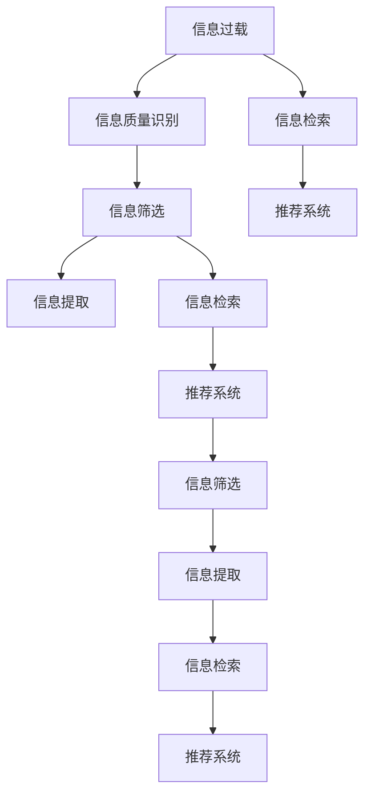

                 

# 信息过载与信息筛选技术：在信息洪流中找到有价值的信息

## 1. 背景介绍

### 1.1 问题由来

随着互联网的普及，人们每天接受的信息量呈爆炸性增长。从传统的报纸、电视到现在的社交媒体、在线论坛，再到直播、短视频等，信息形式的丰富多样进一步加剧了信息过载问题。过量的信息不仅使个人精力分散，还会引发认知过载，导致工作效率下降，错误率上升。如何在信息洪流中找到有价值的信息，提升信息处理效率，成为现代社会一个亟待解决的问题。

### 1.2 问题核心关键点

信息筛选技术旨在从海量信息中，快速、准确地识别和提取有价值的内容。核心在于：

- **识别信息质量**：区分信息的相关性、真实性、时效性等质量维度。
- **筛选有效信息**：根据任务需求，过滤冗余、噪音，保留有用信息。
- **提取关键信息**：从文本、图像、视频等各类信息源中，提取出关键内容或特征。

## 2. 核心概念与联系

### 2.1 核心概念概述

为更好地理解信息筛选技术，本节将介绍几个密切相关的核心概念：

- **信息过载**：在短时间内接收到的信息量超出个体处理能力的极限，导致信息处理效率降低，信息价值失真。

- **信息质量**：指信息的准确性、相关性、可靠性、时效性、完整性等，是信息筛选的重要依据。

- **信息筛选**：从大量信息中，通过一定算法或规则，识别出高质量、高价值的信息，以满足特定需求。

- **信息提取**：在信息源中，通过技术手段，提取出关键内容或特征，方便后续处理和应用。

- **信息检索**：利用索引、搜索等技术手段，快速定位到目标信息的过程。

- **推荐系统**：根据用户行为、兴趣、背景等数据，个性化地推荐相关信息。

这些核心概念之间存在密切的联系和交互，共同构成了信息筛选技术的框架，旨在帮助人们在信息过载的环境下，快速、高效地获取有价值的信息。

### 2.2 核心概念原理和架构的 Mermaid 流程图



这个流程图展示了大规模信息处理的全过程，每个环节都依赖于上一步的输出，同时向下环节提供支持。信息的筛选、提取、检索和推荐，共同构成了信息过载问题应对的完整解决方案。

## 3. 核心算法原理 & 具体操作步骤

### 3.1 算法原理概述

信息筛选技术的核心在于构建合理的模型和算法，实现信息的自动识别和有效过滤。其基本思路可以归纳为以下几步：

1. **数据预处理**：对原始数据进行清洗、归一化、分词等处理，准备输入模型。
2. **特征提取**：使用各种算法从文本、图像、音频等数据源中提取关键特征。
3. **模型训练**：根据任务需求，选择合适的模型进行训练，学习信息质量评估或信息筛选规则。
4. **结果输出**：利用训练好的模型对新数据进行评估或筛选，提取出有用的信息。

### 3.2 算法步骤详解

以文本信息筛选为例，详细讲解信息筛选技术的具体操作步骤：

**Step 1: 数据预处理**

对原始文本数据进行预处理，包括但不限于：
- 去除停用词和标点符号，减少噪音干扰。
- 分词和词性标注，方便特征提取。
- 文本标准化，统一不同格式的数据。

**Step 2: 特征提取**

选择合适的特征提取算法，对文本数据进行处理，提取出有意义的特征：
- **TF-IDF**：计算单词在文档和语料库中的权重，识别重要词汇。
- **word2vec**：通过词嵌入，将单词映射到高维空间，捕捉单词间的语义关系。
- **BERT**：利用预训练的语言模型，提取文本中的上下文信息。
- **图像特征提取**：使用CNN等深度学习算法，提取图像的视觉特征。

**Step 3: 模型训练**

选择合适的机器学习算法，对提取出的特征进行训练，学习信息质量评估或信息筛选规则：
- **分类算法**：如逻辑回归、SVM等，用于判断文本的垃圾邮件、情感极性等。
- **聚类算法**：如K-means、DBSCAN等，用于将文本数据分组，筛选出相关性高的文本。
- **排序算法**：如PageRank、LDA等，用于对文本进行排序，推荐重要的内容。

**Step 4: 结果输出**

利用训练好的模型对新数据进行评估或筛选，提取出有用的信息：
- **信息评估**：计算文本的相关性、真实性、时效性等指标，判断其价值。
- **信息过滤**：根据评估结果，去除无用信息，保留高质量信息。
- **信息推荐**：利用推荐算法，对用户进行个性化推荐。

### 3.3 算法优缺点

信息筛选技术具有以下优点：
1. **自动化处理**：通过模型训练，实现了信息筛选的自动化，大大提高了处理效率。
2. **可扩展性**：模型可以根据任务需求进行灵活调整，适用于多种类型的信息处理。
3. **精准筛选**：通过特征提取和模型训练，可以准确识别信息的质量和相关性，筛选出有用内容。

同时，该方法也存在一些局限性：
1. **模型依赖**：信息筛选的效果依赖于模型的质量，模型训练需要大量的标注数据和计算资源。
2. **特征局限**：特征提取的准确性和全面性直接影响信息筛选的效果，不同特征提取方法可能对结果有较大影响。
3. **泛化能力**：模型在不同数据集上的泛化能力，决定了其在实际应用中的表现。
4. **更新成本**：模型需要定期更新以适应数据分布的变化，更新成本较高。

尽管存在这些局限性，但信息筛选技术在处理大规模信息过载问题上，依然具有不可替代的优势。

### 3.4 算法应用领域

信息筛选技术在多个领域得到了广泛应用，以下是几个典型案例：

- **电子商务**：推荐系统利用用户行为数据和商品信息，个性化推荐商品，提高购物体验。
- **新闻媒体**：信息筛选技术用于新闻标题的推荐和过滤，帮助用户获取感兴趣的内容。
- **社交网络**：社交媒体平台利用算法推荐好友、帖子，帮助用户建立有价值的人际关系。
- **广告投放**：广告系统通过信息筛选技术，精准定位目标用户，提高广告点击率和转化率。
- **情报分析**：情报机构利用信息筛选技术，从大量公开数据中提取关键情报信息，辅助决策。
- **公共安全**：监控系统通过视频内容筛选，快速识别异常行为，提高安全预警能力。

这些应用场景展示了信息筛选技术的强大能力，帮助各类企业和机构在信息处理上取得了显著效果。

## 4. 数学模型和公式 & 详细讲解 & 举例说明

### 4.1 数学模型构建

信息筛选技术的数学模型主要涉及以下几个部分：

1. **数据表示**：将文本、图像、音频等数据表示为机器可以理解的形式，如词向量、图像特征等。
2. **特征提取**：从原始数据中提取出有意义的特征。
3. **模型训练**：通过机器学习算法，训练模型进行信息质量评估或信息筛选。
4. **结果评估**：使用评估指标，如准确率、召回率、F1分数等，衡量模型性能。

### 4.2 公式推导过程

以文本信息筛选为例，假设模型接受一个文本 $x$，需要评估其信息质量。常见的评估指标包括文本长度、TF-IDF值、情感极性等。

假设模型的输出为 $y$，其中 $y=1$ 表示高质量信息，$y=0$ 表示低质量信息。则信息筛选的模型可以表示为：

$$
y = \begin{cases}
1 & \text{如果 } f(x) > \tau \\
0 & \text{如果 } f(x) \leq \tau
\end{cases}
$$

其中 $f(x)$ 为特征提取和模型训练得到的评估函数，$\tau$ 为阈值，用于判断信息的价值。

### 4.3 案例分析与讲解

以下以情感分析为例，展示信息筛选技术的应用。

假设有一个新闻文章，需要判断其情感极性。可以将文本表示为词向量，然后使用SVM模型进行训练：

- **数据预处理**：对文本进行分词、去除停用词、计算TF-IDF等。
- **特征提取**：将文本表示为词向量。
- **模型训练**：使用SVM模型，对词向量进行训练，学习情感极性的分类规则。
- **结果输出**：将新文本输入模型，输出情感极性标签。

## 5. 项目实践：代码实例和详细解释说明

### 5.1 开发环境搭建

在进行信息筛选项目开发前，需要准备好开发环境。以下是使用Python进行Scikit-learn开发的Python环境配置流程：

1. 安装Anaconda：从官网下载并安装Anaconda，用于创建独立的Python环境。

2. 创建并激活虚拟环境：
```bash
conda create -n info-screening python=3.8 
conda activate info-screening
```

3. 安装Scikit-learn：
```bash
pip install scikit-learn
```

4. 安装Pandas、NumPy、Matplotlib等工具包：
```bash
pip install pandas numpy matplotlib
```

完成上述步骤后，即可在`info-screening`环境中开始信息筛选实践。

### 5.2 源代码详细实现

下面以情感分析为例，给出使用Scikit-learn库进行信息筛选的Python代码实现。

首先，定义数据集：

```python
import pandas as pd
from sklearn.model_selection import train_test_split

# 加载情感分析数据集
data = pd.read_csv('sentiment.csv')
X = data['text']
y = data['label']

# 分割数据集
X_train, X_test, y_train, y_test = train_test_split(X, y, test_size=0.2, random_state=42)
```

然后，进行特征提取和模型训练：

```python
from sklearn.feature_extraction.text import TfidfVectorizer
from sklearn.svm import SVC

# 特征提取
vectorizer = TfidfVectorizer(stop_words='english', max_features=5000)
X_train_tfidf = vectorizer.fit_transform(X_train)
X_test_tfidf = vectorizer.transform(X_test)

# 模型训练
clf = SVC(kernel='linear', C=1.0)
clf.fit(X_train_tfidf, y_train)
```

接着，进行模型评估和信息筛选：

```python
from sklearn.metrics import accuracy_score, classification_report

# 模型评估
y_pred = clf.predict(X_test_tfidf)
accuracy = accuracy_score(y_test, y_pred)
print(f"Accuracy: {accuracy:.2f}")

# 信息筛选
X_new = ['This movie is great!']
X_new_tfidf = vectorizer.transform(X_new)
y_new_pred = clf.predict(X_new_tfidf)
print(f"New Text Prediction: {id2tag[y_new_pred[0]]}")
```

以上就是使用Scikit-learn进行情感分析的完整代码实现。可以看到，借助Scikit-learn库，信息筛选的开发过程变得简洁高效。

### 5.3 代码解读与分析

让我们再详细解读一下关键代码的实现细节：

**加载数据**：
- 使用Pandas库加载情感分析数据集，并划分为训练集和测试集。

**特征提取**：
- 使用TfidfVectorizer对文本进行特征提取，计算TF-IDF值。
- 使用SVM模型进行训练，学习情感极性的分类规则。

**模型评估**：
- 在测试集上评估模型的准确率。
- 利用训练好的模型对新文本进行情感极性预测。

**信息筛选**：
- 将新文本转换为TF-IDF表示，输入模型进行预测。
- 输出预测结果，判断文本的情感极性。

可以看到，Scikit-learn库提供了丰富的机器学习工具和算法，可以便捷地实现信息筛选模型。开发者可以根据具体需求选择合适的模型和算法，快速迭代出有效的信息筛选方案。

## 6. 实际应用场景

### 6.1 电子商务

推荐系统是信息筛选技术的典型应用。通过分析用户历史行为数据和商品信息，推荐系统可以向用户推荐符合其兴趣和需求的商品。

在技术实现上，可以收集用户浏览、点击、购买等行为数据，提取商品的描述、价格、评分等信息，使用协同过滤、基于内容的推荐等算法进行训练。推荐系统会根据用户和商品的特征，计算它们之间的相似度，筛选出用户可能感兴趣的商品进行推荐。

### 6.2 新闻媒体

信息筛选技术在新闻媒体中的应用，主要体现在标题推荐和内容过滤上。新闻平台收集大量新闻标题，利用算法对标题进行筛选，推荐高质量、相关性高的内容，提高用户阅读体验。

在技术实现上，可以使用TF-IDF、word2vec等技术对新闻标题进行特征提取，使用分类算法训练模型进行情感极性、主题分类等评估。新闻平台可以基于用户的历史阅读数据，推荐可能感兴趣的新闻标题。同时，利用算法过滤低质量的新闻，减少垃圾信息的干扰。

### 6.3 社交网络

社交媒体平台利用信息筛选技术，推荐好友、帖子等，帮助用户建立有价值的人际关系。

在技术实现上，可以使用基于图的推荐算法，分析用户和帖子之间的关系网络，筛选出可能感兴趣的内容。同时，利用情感分析等技术，对帖子内容进行筛选，避免虚假信息和垃圾内容的传播。

### 6.4 广告投放

广告系统通过信息筛选技术，精准定位目标用户，提高广告点击率和转化率。

在技术实现上，可以收集用户的行为数据，提取用户的兴趣标签、浏览历史等信息，使用基于协同过滤、基于内容的推荐算法进行训练。广告系统可以根据用户的特征，筛选出符合其需求和兴趣的广告，进行个性化推荐。

### 6.5 情报分析

情报机构利用信息筛选技术，从大量公开数据中提取关键情报信息，辅助决策。

在技术实现上，可以使用文本挖掘、情感分析等技术，对公开数据进行分析，识别有价值的情报信息。情报机构可以利用信息筛选技术，快速获取关键情报，辅助制定政策和决策。

### 6.6 公共安全

监控系统通过视频内容筛选，快速识别异常行为，提高安全预警能力。

在技术实现上，可以使用深度学习算法，提取视频中的视觉特征，利用分类算法进行行为识别。监控系统可以根据视频中的异常行为，快速报警，提高公共安全水平。

## 7. 工具和资源推荐

### 7.1 学习资源推荐

为了帮助开发者系统掌握信息筛选技术，这里推荐一些优质的学习资源：

1. **《信息检索与文本挖掘》书籍**：系统介绍了信息检索和文本挖掘的基本原理和算法，适合初学者入门。

2. **Coursera《自然语言处理》课程**：由斯坦福大学开设的NLP明星课程，介绍了文本分类、情感分析等经典模型，讲解详细，适合深入学习。

3. **Kaggle**：数据科学竞赛平台，提供大量高质量的数据集和竞赛任务，可以锻炼实际处理信息的能力。

4. **ArXiv**：预印本服务器，收录了大量前沿研究成果，了解最新进展，获取最新的算法和技术。

5. **KDnuggets**：数据科学社区，提供丰富的学习资源和实践案例，适合快速上手。

通过对这些资源的学习实践，相信你一定能够快速掌握信息筛选技术的精髓，并用于解决实际的NLP问题。

### 7.2 开发工具推荐

高效的开发离不开优秀的工具支持。以下是几款用于信息筛选开发的常用工具：

1. **Jupyter Notebook**：开源的交互式开发环境，适合快速迭代和共享代码。

2. **Scikit-learn**：机器学习库，提供丰富的算法和工具，支持文本、图像等多种数据源。

3. **TensorFlow**：深度学习框架，支持分布式计算，适合大规模信息处理。

4. **Gensim**：文本处理库，支持主题建模、词向量等算法，方便文本处理。

5. **NLTK**：自然语言处理库，提供丰富的文本分析工具，支持NLP任务。

6. **PyTorch**：深度学习框架，支持动态计算图，适合动态模型开发。

合理利用这些工具，可以显著提升信息筛选任务的开发效率，加快创新迭代的步伐。

### 7.3 相关论文推荐

信息筛选技术的发展源于学界的持续研究。以下是几篇奠基性的相关论文，推荐阅读：

1. **Information Retrieval Theory and Applications**：讲述信息检索的基本理论和应用，是信息筛选技术的重要参考资料。

2. **Machine Learning for Text Classification**：介绍了基于机器学习的文本分类算法，适用于情感分析、主题分类等任务。

3. **Semantic Search**：探讨了语义搜索的基本原理和算法，适合了解高级信息检索技术。

4. **Deep Learning for Text Representation**：介绍了深度学习在文本表示中的应用，如word2vec、BERT等模型，适合了解现代信息筛选技术。

这些论文代表了大规模信息筛选技术的发展脉络。通过学习这些前沿成果，可以帮助研究者把握学科前进方向，激发更多的创新灵感。

## 8. 总结：未来发展趋势与挑战

### 8.1 总结

本文对信息筛选技术进行了全面系统的介绍。首先阐述了信息过载问题及其背景，明确了信息筛选技术的重要性和核心目标。其次，从原理到实践，详细讲解了信息筛选的数学模型和操作步骤，给出了信息筛选任务开发的完整代码实例。同时，本文还广泛探讨了信息筛选技术在电子商务、新闻媒体、社交网络等众多领域的应用前景，展示了信息筛选技术的强大能力。此外，本文精选了信息筛选技术的各类学习资源，力求为读者提供全方位的技术指引。

通过本文的系统梳理，可以看到，信息筛选技术在处理大规模信息过载问题上，具有不可替代的优势。其自动化、高效、精准的特点，帮助用户在信息爆炸的时代，快速、高效地获取有价值的信息。未来，伴随信息技术的持续演进，信息筛选技术必将进一步成熟和优化，更好地服务于各类场景和应用。

### 8.2 未来发展趋势

展望未来，信息筛选技术将呈现以下几个发展趋势：

1. **深度学习的应用**：深度学习模型在特征提取和分类任务中表现优异，未来将更多地应用于信息筛选。BERT、GPT等预训练模型可以进一步提升信息筛选的效果。

2. **多模态融合**：信息源的多样性决定了信息筛选需要处理多模态数据。未来，信息筛选技术将融合文本、图像、音频等多种信息源，实现更加全面、精准的信息处理。

3. **实时处理**：随着计算资源的增加和算法的优化，信息筛选技术将具备实时处理能力，实时分析和筛选信息，满足用户的即时需求。

4. **个性化推荐**：推荐算法的发展将推动信息筛选技术的个性化推荐能力，实现高度定制化的信息服务。

5. **联邦学习**：在保护用户隐私的前提下，通过联邦学习技术，实现分布式信息筛选，提高信息处理的效率和安全性。

6. **边缘计算**：将信息筛选任务部署在边缘计算设备上，减少延迟，提高响应速度，满足实时性要求。

以上趋势凸显了信息筛选技术的广阔前景。这些方向的探索发展，必将进一步提升信息处理的效果和应用范围，为信息筛选技术的未来发展铺平道路。

### 8.3 面临的挑战

尽管信息筛选技术已经取得了瞩目成就，但在迈向更加智能化、普适化应用的过程中，它仍面临诸多挑战：

1. **数据质量问题**：信息筛选的效果依赖于高质量的数据，但现实数据往往存在噪音和错误，如何提高数据质量是一个难题。

2. **算法效率**：信息筛选涉及大量的计算和存储，如何在保证精度的情况下，提高算法效率，降低计算成本，是一大挑战。

3. **模型泛化**：信息筛选模型在训练集和测试集上的泛化能力，决定了其在实际应用中的表现。如何提高模型的泛化能力，是一个长期的研究方向。

4. **隐私保护**：信息筛选涉及用户隐私数据的处理，如何在保护隐私的同时，实现有效的信息筛选，是一个重要的研究课题。

5. **计算资源**：信息筛选需要大量的计算资源，如何在资源受限的环境下，实现高效的信息处理，是一大挑战。

6. **模型更新**：信息筛选模型需要定期更新以适应数据分布的变化，更新成本较高。如何降低更新成本，提高模型维护的效率，是一个重要的研究方向。

尽管存在这些挑战，但通过不断的研究和实践，信息筛选技术必将在未来取得更大的突破，更好地服务于用户的信息需求。

### 8.4 研究展望

面对信息筛选技术所面临的种种挑战，未来的研究需要在以下几个方面寻求新的突破：

1. **无监督和半监督学习**：探索无监督和半监督学习的方法，在缺乏标注数据的情况下，进行信息筛选，提高模型的泛化能力。

2. **模型压缩和加速**：开发更加高效的信息筛选模型，减少计算资源消耗，提升实时处理能力。

3. **跨模态融合**：研究跨模态融合技术，将文本、图像、音频等多种信息源融合处理，提升信息筛选的全面性和准确性。

4. **知识图谱应用**：将知识图谱等外部知识融入信息筛选模型，提高模型的智能推理能力。

5. **深度学习与强化学习结合**：将深度学习和强化学习结合，优化信息筛选的策略和算法，提升模型效果。

6. **隐私保护与可解释性**：研究隐私保护和模型可解释性技术，确保信息筛选过程的透明度和安全性。

这些研究方向的探索，必将推动信息筛选技术向更高层次发展，更好地服务于信息时代的需求。面向未来，信息筛选技术需要不断突破现有技术的瓶颈，结合更多前沿技术，为信息处理带来新的突破。

## 9. 附录：常见问题与解答

**Q1：如何提高信息筛选的数据质量？**

A: 数据质量直接影响信息筛选的效果，可以通过以下方法提高数据质量：
1. **数据清洗**：去除噪音和错误，清洗不完整、不规范的数据。
2. **数据标注**：为数据集添加标注信息，提高数据的有标签比例。
3. **数据增强**：使用数据增强技术，如数据扩充、合成数据等，增加数据多样性。
4. **特征选择**：选择高质量的特征，减少噪音和冗余信息。
5. **模型优化**：使用优化的模型算法，提高信息筛选的准确性和鲁棒性。

**Q2：如何在资源受限的环境下进行信息筛选？**

A: 信息筛选需要大量的计算资源，可以通过以下方法优化资源使用：
1. **模型压缩**：使用模型压缩技术，减少模型参数和计算量。
2. **分布式计算**：利用分布式计算框架，如Hadoop、Spark等，实现大规模信息处理。
3. **边缘计算**：将信息筛选任务部署在边缘计算设备上，减少延迟，提高响应速度。
4. **算法优化**：优化算法实现，减少计算和存储开销。
5. **分阶段处理**：将信息筛选任务分为多个阶段，逐步处理，降低单次计算资源需求。

**Q3：如何在保护隐私的前提下进行信息筛选？**

A: 信息筛选涉及用户隐私数据的处理，可以通过以下方法保护隐私：
1. **差分隐私**：在数据处理过程中加入噪声，保护用户隐私。
2. **联邦学习**：通过联邦学习技术，在保护隐私的前提下，实现分布式信息筛选。
3. **匿名化处理**：对数据进行匿名化处理，减少敏感信息泄露风险。
4. **访问控制**：对数据访问进行严格控制，防止未授权访问。
5. **加密处理**：对数据进行加密处理，保护数据传输和存储安全。

**Q4：如何评估信息筛选的效果？**

A: 信息筛选的效果可以通过以下指标进行评估：
1. **准确率**：信息筛选的准确率，衡量模型对有用信息的识别能力。
2. **召回率**：信息筛选的召回率，衡量模型对有用信息的覆盖能力。
3. **F1分数**：综合考虑准确率和召回率，反映信息筛选的总体效果。
4. **ROC曲线**：通过ROC曲线，评估模型在不同阈值下的表现。
5. **混淆矩阵**：通过混淆矩阵，可视化信息筛选的效果。

**Q5：如何实现信息筛选的实时处理？**

A: 实现信息筛选的实时处理，可以通过以下方法：
1. **异步计算**：利用异步计算框架，如Apache Kafka、Apache Flink等，实现数据流处理。
2. **流式算法**：使用流式算法，如Apache Spark Streaming、Storm等，处理实时数据。
3. **分布式存储**：使用分布式存储系统，如Hadoop HDFS、Ceph等，存储实时数据。
4. **实时数据流**：使用实时数据流技术，如Kafka、RabbitMQ等，实现数据实时传输。
5. **低延迟算法**：使用低延迟算法，优化信息筛选的计算过程，提高响应速度。

这些方法可以综合应用，实现信息筛选的实时处理，满足用户的即时需求。

---

作者：禅与计算机程序设计艺术 / Zen and the Art of Computer Programming

