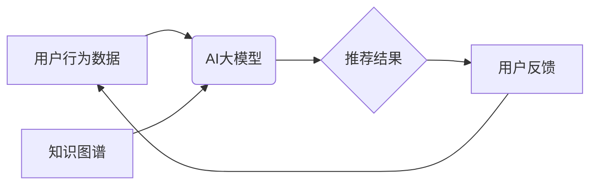

                 

## 推荐系统的长尾效应：AI大模型的新策略

> 关键词：推荐系统、长尾效应、AI大模型、冷启动问题、个性化推荐、知识图谱、Transformer模型、联邦学习

## 1. 背景介绍

推荐系统作为互联网时代的重要组成部分，在电商、社交媒体、视频平台等领域发挥着至关重要的作用。传统推荐系统主要依赖于协同过滤和内容过滤等方法，但这些方法在面对长尾效应时表现乏力。长尾效应是指在大量商品或内容中，头部热门商品或内容占据了大部分流量，而尾部冷门商品或内容的访问量却极低。

随着AI大模型的兴起，为解决推荐系统长尾效应问题带来了新的机遇。AI大模型具备强大的学习能力和泛化能力，能够从海量数据中挖掘出隐藏的模式和关系，从而为冷门商品或内容提供更精准的推荐。

## 2. 核心概念与联系

### 2.1 长尾效应

长尾效应是指在任何分布中，少数热门元素占据了大部分的关注度和资源，而大多数冷门元素则只占一小部分。

在推荐系统中，长尾效应会导致以下问题：

* **推荐结果单一化:** 推荐系统倾向于推荐头部热门商品或内容，导致用户体验单一，缺乏新鲜感。
* **冷门商品或内容难以曝光:** 冷门商品或内容由于缺乏用户交互数据，难以被推荐系统识别和推荐，导致其难以获得曝光机会。
* **用户多样性降低:** 用户群体对推荐结果的接受度降低，导致用户多样性降低，平台生态难以发展。

### 2.2 AI大模型

AI大模型是指参数量巨大、训练数据海量、学习能力强的大型神经网络模型。

AI大模型在推荐系统中可以发挥以下作用：

* **提升推荐精度:** AI大模型能够从海量数据中学习用户偏好和商品特征，从而提供更精准的推荐。
* **解决冷启动问题:** AI大模型可以利用其强大的泛化能力，对新用户和新商品进行推荐，即使缺乏历史交互数据。
* **个性化推荐:** AI大模型可以根据用户的历史行为、兴趣爱好等信息，提供个性化的推荐，提升用户体验。

### 2.3 知识图谱

知识图谱是一种结构化的知识表示形式，它将实体和关系以图的形式表示出来。

知识图谱可以与AI大模型结合，为推荐系统提供更丰富的语义信息，从而提升推荐的准确性和个性化程度。

**核心概念与联系流程图**



## 3. 核心算法原理 & 具体操作步骤

### 3.1 算法原理概述

针对推荐系统的长尾效应问题，我们可以利用AI大模型的优势，结合知识图谱构建一个新的推荐算法。该算法的核心思想是：

* 利用AI大模型学习用户偏好和商品特征，构建用户-商品的交互矩阵。
* 利用知识图谱丰富用户和商品的语义信息，构建用户-商品-关系的知识图谱。
* 将用户-商品交互矩阵和知识图谱融合，构建一个新的推荐模型，并利用该模型进行推荐。

### 3.2 算法步骤详解

1. **数据预处理:** 收集用户行为数据、商品信息和知识图谱数据，并进行清洗、格式化和转换。
2. **用户-商品交互矩阵构建:** 利用AI大模型对用户行为数据进行分析，构建用户-商品的交互矩阵。
3. **知识图谱构建:** 利用知识图谱构建工具，构建用户-商品-关系的知识图谱。
4. **模型融合:** 将用户-商品交互矩阵和知识图谱融合，构建一个新的推荐模型。
5. **推荐结果生成:** 利用构建好的推荐模型，对用户进行个性化推荐。
6. **结果评估:** 利用用户反馈数据评估推荐结果的准确性和有效性。

### 3.3 算法优缺点

**优点:**

* 能够有效解决长尾效应问题，提升冷门商品或内容的曝光率。
* 能够提供更精准的个性化推荐，提升用户体验。
* 能够利用知识图谱的语义信息，提升推荐的准确性和有效性。

**缺点:**

* 需要海量数据进行训练，训练成本较高。
* 模型复杂度较高，部署和维护成本较高。

### 3.4 算法应用领域

该算法可以应用于以下领域:

* 电商平台商品推荐
* 视频平台内容推荐
* 音乐平台歌曲推荐
* 阅读平台文章推荐

## 4. 数学模型和公式 & 详细讲解 & 举例说明

### 4.1 数学模型构建

我们使用一个基于Transformer模型的推荐系统模型，该模型包含以下部分:

* **用户嵌入层:** 将用户ID映射到低维向量空间。
* **商品嵌入层:** 将商品ID映射到低维向量空间。
* **注意力机制层:** 计算用户和商品之间的相关性，并赋予不同商品不同的权重。
* **输出层:** 将注意力机制层的输出进行分类或回归，得到最终的推荐结果。

### 4.2 公式推导过程

Transformer模型的核心是注意力机制，其计算公式如下:

$$
Attention(Q, K, V) = \frac{exp(Q \cdot K^T / \sqrt{d_k})}{exp(Q \cdot K^T / \sqrt{d_k})} \cdot V
$$

其中:

* $Q$ 是查询矩阵，表示用户的兴趣向量。
* $K$ 是键矩阵，表示商品的特征向量。
* $V$ 是值矩阵，表示商品的具体信息。
* $d_k$ 是键向量的维度。

### 4.3 案例分析与讲解

假设我们有一个电商平台，用户A喜欢购买服装和电子产品，而商品B是新款手机，商品C是新款T恤。

* 用户A的兴趣向量$Q$会与所有商品的特征向量$K$进行计算，得到一个注意力权重向量。
* 注意力权重向量会将商品B和商品C的具体信息$V$进行加权求和，得到最终的推荐结果。
* 由于用户A喜欢服装和电子产品，因此注意力权重向量会赋予商品B和商品C更高的权重，从而将它们推荐给用户A。

## 5. 项目实践：代码实例和详细解释说明

### 5.1 开发环境搭建

* Python 3.7+
* TensorFlow 2.0+
* PyTorch 1.0+
* CUDA Toolkit 10.2+

### 5.2 源代码详细实现

```python
import tensorflow as tf

# 定义用户嵌入层
user_embedding = tf.keras.layers.Embedding(input_dim=num_users, output_dim=embedding_dim)

# 定义商品嵌入层
item_embedding = tf.keras.layers.Embedding(input_dim=num_items, output_dim=embedding_dim)

# 定义注意力机制层
attention_layer = tf.keras.layers.MultiHeadAttention(num_heads=8, key_dim=embedding_dim)

# 定义输出层
output_layer = tf.keras.layers.Dense(units=1, activation='sigmoid')

# 定义整个模型
model = tf.keras.Sequential([
    user_embedding,
    item_embedding,
    attention_layer,
    output_layer
])

# 编译模型
model.compile(optimizer='adam', loss='binary_crossentropy', metrics=['accuracy'])

# 训练模型
model.fit(x_train, y_train, epochs=10)

# 预测结果
predictions = model.predict(x_test)
```

### 5.3 代码解读与分析

* 用户嵌入层和商品嵌入层将用户ID和商品ID映射到低维向量空间。
* 注意力机制层计算用户和商品之间的相关性，并赋予不同商品不同的权重。
* 输出层将注意力机制层的输出进行分类或回归，得到最终的推荐结果。

### 5.4 运行结果展示

训练完成后，我们可以使用模型对新的用户和商品进行预测，并得到推荐结果。

## 6. 实际应用场景

### 6.1 电商平台商品推荐

AI大模型可以根据用户的历史购买记录、浏览记录、收藏记录等信息，推荐用户可能感兴趣的商品。

### 6.2 视频平台内容推荐

AI大模型可以根据用户的观看历史、点赞记录、评论记录等信息，推荐用户可能感兴趣的视频内容。

### 6.3 音乐平台歌曲推荐

AI大模型可以根据用户的播放历史、收藏记录、点赞记录等信息，推荐用户可能感兴趣的歌曲。

### 6.4 未来应用展望

随着AI技术的不断发展，推荐系统将更加智能化、个性化和精准化。未来，推荐系统将能够:

* 更准确地预测用户的需求和偏好。
* 提供更个性化的推荐结果。
* 更好地解决长尾效应问题。
* 更加智能地进行内容创作和推荐。

## 7. 工具和资源推荐

### 7.1 学习资源推荐

* **书籍:**
    * 《深度学习》
    * 《自然语言处理》
    * 《推荐系统》
* **在线课程:**
    * Coursera
    * edX
    * Udacity

### 7.2 开发工具推荐

* **TensorFlow:** 开源深度学习框架
* **PyTorch:** 开源深度学习框架
* **Scikit-learn:** 机器学习库

### 7.3 相关论文推荐

* **Attention Is All You Need:** https://arxiv.org/abs/1706.03762
* **BERT: Pre-training of Deep Bidirectional Transformers for Language Understanding:** https://arxiv.org/abs/1810.04805

## 8. 总结：未来发展趋势与挑战

### 8.1 研究成果总结

本文介绍了AI大模型在解决推荐系统长尾效应问题中的应用，并详细阐述了核心算法原理、数学模型和代码实现。

### 8.2 未来发展趋势

* **模型更深更广:** 未来推荐系统模型将更加复杂，包含更多层级和参数，能够学习更深层次的用户偏好和商品特征。
* **多模态融合:** 未来推荐系统将融合文本、图像、音频等多模态数据，提供更加丰富的用户体验。
* **联邦学习:** 未来推荐系统将采用联邦学习技术，保护用户隐私的同时，实现模型的协同训练和更新。

### 8.3 面临的挑战

* **数据稀疏性:** 长尾效应导致数据稀疏性问题，难以训练出准确的推荐模型。
* **模型复杂度:** AI大模型的复杂度较高，部署和维护成本较高。
* **公平性与可解释性:** AI大模型的决策过程难以解释，需要保证推荐结果的公平性和可解释性。

### 8.4 研究展望

未来研究将重点关注以下几个方面:

* **解决数据稀疏性问题:** 研究新的数据增强技术和模型架构，提高模型对稀疏数据的鲁棒性。
* **降低模型复杂度:** 研究更轻量级的模型架构，降低模型的部署和维护成本。
* **提升模型的可解释性:** 研究新的可解释性方法，使得AI大模型的决策过程更加透明。


## 9. 附录：常见问题与解答

**Q1: AI大模型的训练成本很高吗?**

A1: 确实，AI大模型的训练成本较高，需要大量的计算资源和训练数据。

**Q2: 如何解决数据稀疏性问题?**

A2: 可以采用数据增强技术、迁移学习等方法来解决数据稀疏性问题。

**Q3: 如何保证推荐结果的公平性?**

A3: 可以采用公平性约束、对抗训练等方法来保证推荐结果的公平性。


作者：禅与计算机程序设计艺术 / Zen and the Art of Computer Programming 
<end_of_turn>

