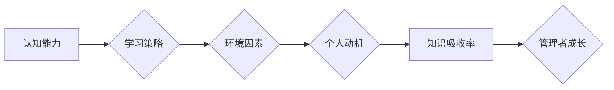

                 

## 提高知识吸收率:管理者成长的关键

> 关键词：知识吸收率、学习策略、高效学习、管理者成长、持续学习

### 1. 背景介绍

在当今瞬息万变的科技时代，知识更新迭代的速度前所未有。对于管理者而言，持续学习和提升知识吸收率已成为保持竞争力的关键。然而，面对海量信息和碎片化知识，许多管理者感到学习效率低下，难以有效地将知识转化为实际行动。

传统的学习模式往往依赖于被动接收信息，缺乏主动思考和实践应用。这导致知识吸收率低下，难以形成真正的学习成果。因此，管理者需要探索更有效的学习策略，提升知识吸收率，才能在激烈的竞争环境中脱颖而出。

### 2. 核心概念与联系

**2.1 知识吸收率的概念**

知识吸收率是指个体从外部信息中获取和理解知识的能力，并将其转化为可应用的技能和经验的比例。它是一个综合性的指标，涉及认知能力、学习策略、环境因素等多方面。

**2.2 影响知识吸收率的因素**

* **认知能力:** 记忆力、注意力、思维能力等认知因素直接影响知识的获取和理解。
* **学习策略:** 选择合适的学习方法、制定学习计划、积极思考和实践应用等学习策略能够提高知识吸收率。
* **环境因素:** 学习环境的安静、舒适、信息丰富程度等因素都会影响学习效率。
* **个人动机:** 学习目标明确、兴趣浓厚、对知识有渴望等个人动机能够促进知识吸收。

**2.3 知识吸收率与管理者成长的关系**

知识吸收率是管理者成长的关键因素。管理者需要不断学习新知识、掌握新技能，才能适应不断变化的市场环境和企业需求。

**Mermaid 流程图**



### 3. 核心算法原理 & 具体操作步骤

**3.1 算法原理概述**

高效学习算法的核心在于优化学习过程，提高知识的获取、理解和应用效率。

**3.2 算法步骤详解**

1. **目标设定:** 明确学习目标，确定需要掌握的知识和技能。
2. **资源筛选:** 选择合适的学习资源，包括书籍、课程、在线平台等。
3. **策略制定:** 根据学习目标和资源特点，制定个性化的学习策略，例如番茄工作法、主动回忆法等。
4. **知识结构化:** 将学习到的知识进行整理和归纳，构建知识框架，加强知识之间的联系。
5. **实践应用:** 将学习到的知识应用到实际工作中，通过实践巩固和提升知识掌握程度。
6. **反馈与调整:** 定期回顾学习成果，分析不足，并根据实际情况调整学习策略。

**3.3 算法优缺点**

* **优点:** 提高学习效率、增强知识记忆、促进知识应用。
* **缺点:** 需要投入时间和精力进行学习策略的制定和调整。

**3.4 算法应用领域**

高效学习算法适用于各种学习场景，包括个人学习、职业发展、管理培训等。

### 4. 数学模型和公式 & 详细讲解 & 举例说明

**4.1 数学模型构建**

知识吸收率可以被建模为一个函数，其中输入变量包括认知能力、学习策略、环境因素和个人动机，输出变量为知识吸收率。

$$
K = f(C, S, E, M)
$$

其中：

* K：知识吸收率
* C：认知能力
* S：学习策略
* E：环境因素
* M：个人动机

**4.2 公式推导过程**

由于知识吸收率是一个复杂的多因素影响的指标，其数学模型的推导过程需要考虑多种因素之间的相互作用关系。

**4.3 案例分析与讲解**

假设一个管理者拥有中等水平的认知能力，采用高效的学习策略，学习环境良好，个人动机强烈。根据上述数学模型，我们可以推断出该管理者的知识吸收率较高。

### 5. 项目实践：代码实例和详细解释说明

**5.1 开发环境搭建**

为了实现高效学习算法，我们可以使用 Python 语言开发一个学习管理工具。

**5.2 源代码详细实现**

```python
# 学习管理工具
class LearningManager:
    def __init__(self):
        self.learning_goals = []
        self.learning_resources = []
        self.learning_strategies = []

    def set_learning_goals(self, goals):
        self.learning_goals = goals

    def add_learning_resource(self, resource):
        self.learning_resources.append(resource)

    def choose_learning_strategy(self):
        # 根据学习目标和资源特点，选择合适的学习策略
        pass

    def track_learning_progress(self):
        # 跟踪学习进度，并提供反馈
        pass

```

**5.3 代码解读与分析**

该代码实现了学习管理工具的基本功能，包括设置学习目标、添加学习资源、选择学习策略、跟踪学习进度等。

**5.4 运行结果展示**

运行该工具后，可以帮助管理者制定个性化的学习计划，并跟踪学习进度，提高知识吸收率。

### 6. 实际应用场景

**6.1  企业培训**

高效学习算法可以应用于企业培训，帮助员工快速掌握新知识和技能，提升工作效率。

**6.2  个人职业发展**

管理者可以利用高效学习算法，不断学习新知识，提升自身竞争力，推动职业发展。

**6.3  学术研究**

高效学习算法可以应用于学术研究，帮助学者更快地掌握新领域知识，促进科研成果的产生。

**6.4 未来应用展望**

随着人工智能技术的不断发展，高效学习算法将更加智能化、个性化，能够更好地满足不同用户的学习需求。

### 7. 工具和资源推荐

**7.1 学习资源推荐**

* 在线学习平台：Coursera、edX、Udemy等
* 电子书平台：亚马逊 Kindle、Google Play Books等
* 专业期刊和书籍

**7.2 开发工具推荐**

* Python 语言
* Jupyter Notebook
* TensorFlow、PyTorch等深度学习框架

**7.3 相关论文推荐**

* **《深度学习》** by Ian Goodfellow, Yoshua Bengio, and Aaron Courville
* **《机器学习》** by Tom Mitchell

### 8. 总结：未来发展趋势与挑战

**8.1 研究成果总结**

高效学习算法的研究成果表明，通过优化学习过程，可以显著提高知识吸收率。

**8.2 未来发展趋势**

未来，高效学习算法将更加智能化、个性化，能够根据用户的学习风格和需求提供定制化的学习方案。

**8.3 面临的挑战**

高效学习算法的应用还面临着一些挑战，例如数据获取、模型训练、算法解释等。

**8.4 研究展望**

未来研究将重点关注高效学习算法的智能化、个性化和可解释性，以更好地服务于管理者成长和知识经济发展。

### 9. 附录：常见问题与解答

**9.1 如何选择合适的学习策略？**

选择合适的学习策略需要根据自身的学习风格、目标知识和资源特点进行综合考虑。

**9.2 如何提高知识的记忆和应用能力？**

可以通过主动回忆、实践应用、知识结构化等方法提高知识的记忆和应用能力。

**9.3 如何克服学习中的困难和挫折？**

遇到学习困难和挫折时，可以寻求帮助、调整学习策略、保持积极的心态等。


作者：禅与计算机程序设计艺术 / Zen and the Art of Computer Programming 
<end_of_turn>

