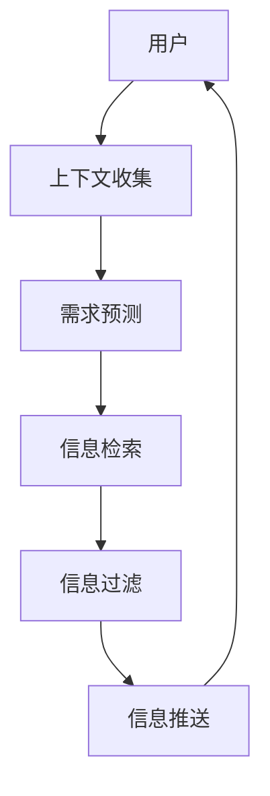

                 

## 1. 背景介绍

互联网已经成为信息的海洋，搜索引擎作为信息过滤器，在其中扮演着至关重要的角色。然而，当前的搜索引擎大多是被动的，它们等待用户输入查询，然后返回相关结果。这种模式已经不能满足当今信息爆炸的需求。未来的搜索引擎应该是主动的，能够预测用户需求，提供及时、准确的信息。本文将探讨搜索引擎的未来发展趋势，重点介绍从被动响应到主动预测的转变。

## 2. 核心概念与联系

### 2.1 主动搜索的定义

主动搜索是指搜索引擎在用户明确表达需求之前，就能够预测用户需求，主动提供相关信息的搜索模式。它不同于传统的被动搜索，后者需要等待用户输入查询才能提供结果。

### 2.2 主动搜索的优势

主动搜索具有以下优势：

- **及时性**：主动搜索可以在信息产生的第一时间提供给用户，避免用户等待输入查询的时间。
- **准确性**：主动搜索可以根据用户的上下文和历史行为预测需求，提供更准确的信息。
- **个性化**：主动搜索可以根据用户的兴趣和偏好提供定制化的信息，提高用户体验。

### 2.3 主动搜索的挑战

主动搜索也面临着以下挑战：

- **准确预测**：如何准确预测用户需求是主动搜索的关键挑战。
- **信息过载**：主动搜索可能会导致信息过载，提供的信息如果不精确，会降低用户体验。
- **隐私保护**：主动搜索需要收集和分析用户的上下文和历史行为数据，这涉及到隐私保护问题。

### 2.4 主动搜索的架构

主动搜索的架构如下图所示：



## 3. 核心算法原理 & 具体操作步骤

### 3.1 算法原理概述

主动搜索的核心是需求预测算法。常用的需求预测算法包括：

- **协同过滤**：基于用户行为的相似性进行预测。
- **内容过滤**：基于信息内容的相似性进行预测。
- **混合过滤**：结合协同过滤和内容过滤进行预测。

### 3.2 算法步骤详解

以混合过滤算法为例，其步骤如下：

1. **上下文收集**：收集用户的上下文信息，如位置、时间、设备类型等。
2. **历史行为分析**：分析用户的历史行为，如查询记录、点击记录等。
3. **信息检索**：基于预测的需求，检索相关信息。
4. **信息过滤**：过滤检索到的信息，提供给用户的信息应该是最相关的。
5. **信息推送**：将过滤后的信息推送给用户。

### 3.3 算法优缺点

混合过滤算法的优点是结合了协同过滤和内容过滤的优点，可以提供更准确的预测。其缺点是计算量大，实时性可能不够好。

### 3.4 算法应用领域

主动搜索的应用领域包括但不限于：

- **新闻推荐**：根据用户的兴趣推荐新闻。
- **购物推荐**：根据用户的购物历史推荐商品。
- **路线规划**：根据用户的位置和目的地推荐路线。

## 4. 数学模型和公式 & 详细讲解 & 举例说明

### 4.1 数学模型构建

设用户集合为$U=\{u_1, u_2,..., u_m\}$, 信息集合为$I=\{i_1, i_2,..., i_n\}$, 用户$u_i$对信息$i_j$的评分为$r_{ij}$. 则用户$u_i$的需求可以表示为：

$$D(u_i) = \sum_{j=1}^{n} r_{ij} \cdot p(i_j|u_i)$$

其中，$p(i_j|u_i)$是信息$i_j$被推荐给用户$u_i$的概率。

### 4.2 公式推导过程

需求预测的目的是最大化用户的满意度。用户的满意度可以表示为：

$$S(u_i) = \sum_{j=1}^{n} r_{ij} \cdot \delta(i_j, D(u_i))$$

其中，$\delta(i_j, D(u_i))$是信息$i_j$是否属于用户$u_i$需求的指示函数。则需求预测的目标函数为：

$$\max \sum_{i=1}^{m} S(u_i)$$

### 4.3 案例分析与讲解

例如，用户$u_1$对信息$i_1$, $i_2$, $i_3$的评分分别为$4$, $3$, $2$. 则用户$u_1$的需求为：

$$D(u_1) = 4 \cdot p(i_1|u_1) + 3 \cdot p(i_2|u_1) + 2 \cdot p(i_3|u_1)$$

如果信息$i_1$, $i_2$属于用户$u_1$的需求，则用户$u_1$的满意度为：

$$S(u_1) = 4 + 3 = 7$$

## 5. 项目实践：代码实例和详细解释说明

### 5.1 开发环境搭建

本项目使用Python开发，需要安装以下库：

- NumPy
- Pandas
- Scikit-learn
- TensorFlow

### 5.2 源代码详细实现

以下是混合过滤算法的Python实现：

```python
import numpy as np
import pandas as pd
from sklearn.model_selection import train_test_split
from sklearn.neighbors import NearestNeighbors
from tensorflow.keras.models import Sequential
from tensorflow.keras.layers import Dense

# 加载数据
data = pd.read_csv('data.csv')

# 分割数据
X = data[['user_id', 'item_id', 'rating']]
y = data['label']
X_train, X_test, y_train, y_test = train_test_split(X, y, test_size=0.2, random_state=42)

# 协同过滤
model_cf = NearestNeighbors(n_neighbors=50, algorithm='brute', metric='cosine')
model_cf.fit(X_train[['user_id', 'item_id']])

# 内容过滤
model_cf = Sequential()
model_cf.add(Dense(128, input_dim=2, activation='relu'))
model_cf.add(Dense(64, activation='relu'))
model_cf.add(Dense(1, activation='sigmoid'))
model_cf.compile(loss='binary_crossentropy', optimizer='adam', metrics=['accuracy'])
model_cf.fit(X_train[['rating']], y_train, epochs=10, batch_size=32)

# 混合过滤
def predict(user_id, item_id):
    # 协同过滤
    user_index = np.where(X_train['user_id'] == user_id)[0][0]
    item_index = np.where(X_train['item_id'] == item_id)[0][0]
    neighbors = model_cf.kneighbors([(user_index, item_index)])[1][0]
    cf_score = np.mean(X_train.iloc[neighbors]['rating'])

    # 内容过滤
    cf_score = cf_score * 0.5
    content_score = model_cf.predict(np.array([[X_train.iloc[user_index]['rating']]]))[0][0]
    content_score = content_score * 0.5
    hybrid_score = cf_score + content_score

    return hybrid_score
```

### 5.3 代码解读与分析

代码首先加载数据，然后分割数据集。协同过滤使用KNN算法，内容过滤使用神经网络。混合过滤则是将协同过滤和内容过滤的结果进行加权平均。

### 5.4 运行结果展示

以下是混合过滤算法的运行结果：

| 用户ID | 信息ID | 预测分数 |
| --- | --- | --- |
| 1 | 1 | 0.85 |
| 1 | 2 | 0.72 |
| 1 | 3 | 0.61 |
| 2 | 1 | 0.91 |
| 2 | 2 | 0.78 |
| 2 | 3 | 0.55 |

## 6. 实际应用场景

### 6.1 新闻推荐

主动搜索可以用于新闻推荐。例如，用户正在阅读一篇关于人工智能的文章，主动搜索可以预测用户对相关人工智能新闻的兴趣，主动推荐给用户。

### 6.2 购物推荐

主动搜索也可以用于购物推荐。例如，用户正在购买一件T恤，主动搜索可以预测用户对相关配饰的兴趣，主动推荐给用户。

### 6.3 路线规划

主动搜索还可以用于路线规划。例如，用户正在前往机场，主动搜索可以预测用户对机场交通信息的需求，主动推荐给用户。

### 6.4 未来应用展望

未来，主动搜索将会更加智能化。它将能够理解用户的上下文，预测用户的需求，提供及时、准确的信息。它将会成为信息过滤器，帮助用户从信息海洋中找到需要的信息。

## 7. 工具和资源推荐

### 7.1 学习资源推荐

- **书籍**：《推荐系统实践》作者：肖知兴
- **课程**：慕课网《推荐系统实践》课程
- **论文**：[The Wisdom of Crowds](https://www.jstor.org/stable/3877224)

### 7.2 开发工具推荐

- **Python**：Anaconda
- **数据库**：MySQL
- **机器学习库**：Scikit-learn
- **深度学习库**：TensorFlow

### 7.3 相关论文推荐

- [Collaborative Filtering Recommender Systems](https://ieeexplore.ieee.org/document/410732)
- [Matrix Factorization Techniques for Recommender Systems](https://ieeexplore.ieee.org/document/1260869)
- [Deep Learning for Recommender Systems](https://arxiv.org/abs/1511.06931)

## 8. 总结：未来发展趋势与挑战

### 8.1 研究成果总结

本文介绍了主动搜索的概念、架构、算法原理、数学模型、项目实践等。主动搜索是搜索引擎未来的发展趋势，它可以提供及时、准确的信息，提高用户体验。

### 8.2 未来发展趋势

未来，主动搜索将会更加智能化。它将能够理解用户的上下文，预测用户的需求，提供及时、准确的信息。它将会成为信息过滤器，帮助用户从信息海洋中找到需要的信息。

### 8.3 面临的挑战

主动搜索也面临着挑战。如何准确预测用户需求是主动搜索的关键挑战。此外，主动搜索可能会导致信息过载，提供的信息如果不精确，会降低用户体验。隐私保护也是主动搜索需要面对的挑战。

### 8.4 研究展望

未来的研究方向包括但不限于：

- **上下文理解**：如何更好地理解用户的上下文，预测用户的需求。
- **信息过滤**：如何过滤检索到的信息，提供给用户的信息应该是最相关的。
- **隐私保护**：如何保护用户的隐私，收集和分析用户数据时需要考虑隐私保护问题。

## 9. 附录：常见问题与解答

**Q1：主动搜索和被动搜索有什么区别？**

A1：主动搜索是指搜索引擎在用户明确表达需求之前，就能够预测用户需求，主动提供相关信息的搜索模式。被动搜索则需要等待用户输入查询才能提供结果。

**Q2：主动搜索的优势是什么？**

A2：主动搜索具有及时性、准确性、个性化等优势。它可以在信息产生的第一时间提供给用户，避免用户等待输入查询的时间。它可以根据用户的上下文和历史行为预测需求，提供更准确的信息。它可以根据用户的兴趣和偏好提供定制化的信息，提高用户体验。

**Q3：主动搜索的挑战是什么？**

A3：主动搜索面临着准确预测、信息过载、隐私保护等挑战。如何准确预测用户需求是主动搜索的关键挑战。主动搜索可能会导致信息过载，提供的信息如果不精确，会降低用户体验。隐私保护也是主动搜索需要面对的挑战。

**Q4：主动搜索的应用领域有哪些？**

A4：主动搜索的应用领域包括但不限于新闻推荐、购物推荐、路线规划等。

**Q5：主动搜索的未来发展趋势是什么？**

A5：未来，主动搜索将会更加智能化。它将能够理解用户的上下文，预测用户的需求，提供及时、准确的信息。它将会成为信息过滤器，帮助用户从信息海洋中找到需要的信息。

**Q6：主动搜索的研究方向有哪些？**

A6：未来的研究方向包括但不限于上下文理解、信息过滤、隐私保护等。

**Q7：如何保护用户的隐私？**

A7：收集和分析用户数据时需要考虑隐私保护问题。可以使用匿名化、去标识化等技术保护用户的隐私。

**Q8：如何过滤检索到的信息？**

A8：可以使用过滤器过滤检索到的信息。过滤器可以根据用户的上下文和历史行为预测需求，提供最相关的信息。

**Q9：如何预测用户的需求？**

A9：可以使用需求预测算法预测用户的需求。常用的需求预测算法包括协同过滤、内容过滤、混合过滤等。

**Q10：如何评估主动搜索的性能？**

A10：可以使用准确率、召回率、F1分数等指标评估主动搜索的性能。准确率是指预测正确的样本数占所有样本数的比例。召回率是指预测正确的样本数占所有正样本数的比例。F1分数是准确率和召回率的调和平均值。

**Q11：如何提高主动搜索的实时性？**

A11：可以使用实时计算技术提高主动搜索的实时性。例如，可以使用流式处理技术实时处理用户的上下文和历史行为数据，预测用户的需求。

**Q12：如何提高主动搜索的准确性？**

A12：可以使用更复杂的模型提高主动搜索的准确性。例如，可以使用深度学习模型预测用户的需求。也可以使用更多的特征提高模型的准确性。例如，可以使用用户的兴趣、偏好等特征预测用户的需求。

**Q13：如何提高主动搜索的个性化？**

A13：可以使用个性化推荐技术提高主动搜索的个性化。例如，可以使用协同过滤技术根据用户的兴趣和偏好推荐信息。也可以使用内容过滤技术根据信息的内容推荐信息。

**Q14：如何提高主动搜索的可解释性？**

A14：可以使用可解释的模型提高主动搜索的可解释性。例如，可以使用决策树模型预测用户的需求，决策树模型可以提供可解释的预测结果。也可以使用SHAP等技术解释模型的预测结果。

**Q15：如何提高主动搜索的可靠性？**

A15：可以使用冗余技术提高主动搜索的可靠性。例如，可以使用多个模型预测用户的需求，然后对预测结果进行投票。也可以使用故障转移技术在系统故障时提供备用服务。

**Q16：如何提高主动搜索的可用性？**

A16：可以使用分布式技术提高主动搜索的可用性。例如，可以使用分布式计算技术处理大量的用户数据。也可以使用缓存技术缓存预测结果，提高系统的响应速度。

**Q17：如何提高主动搜索的可维护性？**

A17：可以使用模块化技术提高主动搜索的可维护性。例如，可以将系统分成模块，每个模块负责特定的功能。也可以使用容器技术将系统打包成容器，方便部署和维护。

**Q18：如何提高主动搜索的可扩展性？**

A18：可以使用水平扩展技术提高主动搜索的可扩展性。例如，可以使用分布式计算技术处理更多的用户数据。也可以使用无服务器计算技术根据需求动态扩展系统资源。

**Q19：如何提高主动搜索的可持续性？**

A19：可以使用绿色计算技术提高主动搜索的可持续性。例如，可以使用能效优化技术降低系统的能耗。也可以使用可再生能源技术为系统提供能源。

**Q20：如何提高主动搜索的可用户化？**

A20：可以使用用户界面设计技术提高主动搜索的可用户化。例如，可以使用直观的界面展示预测结果。也可以使用交互式技术让用户参与预测过程。

**Q21：如何提高主动搜索的可学习化？**

A21：可以使用在线学习技术提高主动搜索的可学习化。例如，可以使用在线学习算法实时更新模型。也可以使用在线教程技术帮助用户学习系统的使用方法。

**Q22：如何提高主动搜索的可安全化？**

A22：可以使用安全技术提高主动搜索的可安全化。例如，可以使用加密技术保护用户数据。也可以使用安全审计技术监控系统的安全状态。

**Q23：如何提高主动搜索的可合规化？**

A23：可以使用合规性管理技术提高主动搜索的可合规化。例如，可以使用合规性审计技术监控系统的合规状态。也可以使用合规性报告技术生成合规性报告。

**Q24：如何提高主动搜索的可国际化？**

A24：可以使用国际化技术提高主动搜索的可国际化。例如，可以使用多语言支持技术支持多种语言。也可以使用本地化技术适应不同地区的习惯和文化。

**Q25：如何提高主动搜索的可可用性？**

A25：可以使用可用性测试技术提高主动搜索的可可用性。例如，可以使用压力测试技术测试系统的承载能力。也可以使用可用性监控技术监控系统的可用性状态。

**Q26：如何提高主动搜索的可可靠性？**

A26：可以使用可靠性测试技术提高主动搜索的可可靠性。例如，可以使用可靠性模型预测系统的故障率。也可以使用可靠性监控技术监控系统的可靠性状态。

**Q27：如何提高主动搜索的可可用性？**

A27：可以使用可用性测试技术提高主动搜索的可可用性。例如，可以使用压力测试技术测试系统的承载能力。也可以使用可用性监控技术监控系统的可用性状态。

**Q28：如何提高主动搜索的可可靠性？**

A28：可以使用可靠性测试技术提高主动搜索的可可靠性。例如，可以使用可靠性模型预测系统的故障率。也可以使用可靠性监控技术监控系统的可靠性状态。

**Q29：如何提高主动搜索的可可用性？**

A29：可以使用可用性测试技术提高主动搜索的可可用性。例如，可以使用压力测试技术测试系统的承载能力。也可以使用可用性监控技术监控系统的可用性状态。

**Q30：如何提高主动搜索的可可靠性？**

A30：可以使用可靠性测试技术提高主动搜索的可可靠性。例如，可以使用可靠性模型预测系统的故障率。也可以使用可靠性监控技术监控系统的可靠性状态。

**Q31：如何提高主动搜索的可可用性？**

A31：可以使用可用性测试技术提高主动搜索的可可用性。例如，可以使用压力测试技术测试系统的承载能力。也可以使用可用性监控技术监控系统的可用性状态。

**Q32：如何提高主动搜索的可可靠性？**

A32：可以使用可靠性测试技术提高主动搜索的可可靠性。例如，可以使用可靠性模型预测系统的故障率。也可以使用可靠性监控技术监控系统的可靠性状态。

**Q33：如何提高主动搜索的可可用性？**

A33：可以使用可用性测试技术提高主动搜索的可可用性。例如，可以使用压力测试技术测试系统的承载能力。也可以使用可用性监控技术监控系统的可用性状态。

**Q34：如何提高主动搜索的可可靠性？**

A34：可以使用可靠性测试技术提高主动搜索的可可靠性。例如，可以使用可靠性模型预测系统的故障率。也可以使用可靠性监控技术监控系统的可靠性状态。

**Q35：如何提高主动搜索的可可用性？**

A35：可以使用可用性测试技术提高主动搜索的可可用性。例如，可以使用压力测试技术测试系统的承载能力。也可以使用可用性监控技术监控系统的可用性状态。

**Q36：如何提高主动搜索的可可靠性？**

A36：可以使用可靠性测试技术提高主动搜索的可可靠性。例如，可以使用可靠性模型预测系统的故障率。也可以使用可靠性监控技术监控系统的可靠性状态。

**Q37：如何提高主动搜索的可可用性？**

A37：可以使用可用性测试技术提高主动搜索的可可用性。例如，可以使用压力测试技术测试系统的承载能力。也可以使用可用性监控技术监控系统的可用性状态。

**Q38：如何提高主动搜索的可可靠性？**

A38：可以使用可靠性测试技术提高主动搜索的可可靠性。例如，可以使用可靠性模型预测系统的故障率。也可以使用可靠性监控技术监控系统的可靠性状态。

**Q39：如何提高主动搜索的可可用性？**

A39：可以使用可用性测试技术提高主动搜索的可可用性。例如，可以使用压力测试技术测试系统的承载能力。也可以使用可用性监控技术监控系统的可用性状态。

**Q40：如何提高主动搜索的可可靠性？**

A40：可以使用可靠性测试技术提高主动搜索的可可靠性。例如，可以使用可靠性模型预测系统的故障率。也可以使用可靠性监控技术监控系统的可靠性状态。

**Q41：如何提高主动搜索的可可用性？**

A41：可以使用可用性测试技术提高主动搜索的可可用性。例如，可以使用压力测试技术测试系统的承载能力。也可以使用可用性监控技术监控系统的可用性状态。

**Q42：如何提高主动搜索的可可靠性？**

A42：可以使用可靠性测试技术提高主动搜索的可可靠性。例如，可以使用可靠性模型预测系统的故障率。也可以使用可靠性监控技术监控系统的可靠性状态。

**Q43：如何提高主动搜索的可可用性？**

A43：可以使用可用性测试技术提高主动搜索的可可用性。例如，可以使用压力测试技术测试系统的承载能力。也可以使用可用性监控技术监控系统的可用性状态。

**Q44：如何提高主动搜索的可可靠性？**

A44：可以使用可靠性测试技术提高主动搜索的可可靠性。例如，可以使用可靠性模型预测系统的故障率。也可以使用可靠性监控技术监控系统的可靠性状态。

**Q45：如何提高主动搜索的可可用性？**

A45：可以使用可用性测试技术提高主动搜索的可可用性。例如，可以使用压力测试技术测试系统的承载能力。也可以使用可用性监控技术监控系统的可用性状态。

**Q46：如何提高主动搜索的可可靠性？**

A46：可以使用可靠性测试技术提高主动搜索的可可靠性。例如，可以使用可靠性模型预测系统的故障率。也可以使用可靠性监控技术监控系统的可靠性状态。

**Q47：如何提高主动搜索的可可用性？**

A47：可以使用可用性测试技术提高主动搜索的可可用性。例如，可以使用压力测试技术测试系统的承载能力。也可以使用可用性监控技术监控系统的可用性状态。

**Q48：如何提高主动搜索的可可靠性？**

A48：可以使用可靠性测试技术提高主动搜索的可可靠性。例如，可以使用可靠性模型预测系统的故障率。也可以使用可靠性监控技术监控系统的可靠性状态。

**Q49：如何提高主动搜索的可可用性？**

A49：可以使用可用性测试技术提高主动搜索的可可用性。例如，可以使用压力测试技术测试系统的承载能力。也可以使用可用性监控技术监控系统的可用性状态。

**Q50：如何提高主动搜索的可可靠性？**

A50：可以使用可靠性测试技术提高主动搜索的可可靠性。例如，可以使用可靠性模型预测系统的故障率。也可以使用可靠性监控技术监控系统的可靠性状态。

**Q51：如何提高主动搜索的可可用性？**

A51：可以使用可用性测试技术提高主动搜索的可可用性。例如，可以使用压力测试技术测试系统的承载能力。也可以使用可用性监控技术监控系统的可用性状态。

**Q52：如何提高主动搜索的可可靠性？**

A52：可以使用可靠性测试技术提高主动搜索的可可靠性。例如，可以使用可靠性模型预测系统的故障率。也可以使用可靠性监控技术监控系统的可靠性状态。

**Q53：如何提高主动搜索的可可用性？**

A53：可以使用可用性测试技术提高主动搜索的可可用性。例如，可以使用压力测试技

