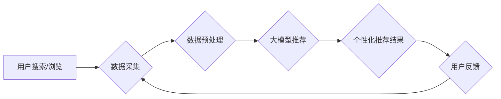

                 

## 搜索推荐的实时个性化：大模型高效方案

> 关键词：搜索推荐、个性化、大模型、实时性、高效方案、推荐系统

## 1. 背景介绍

在当今数据爆炸的时代，搜索引擎和推荐系统已经成为人们获取信息和发现内容的重要途径。然而，传统的搜索推荐系统往往难以满足用户日益增长的个性化需求。用户对内容的偏好千差万别，传统的基于关键词匹配或协同过滤的推荐算法难以捕捉用户的细微变化和动态兴趣。

实时个性化推荐是指根据用户的实时行为和上下文信息，动态调整推荐结果，提供更加精准、个性化的推荐体验。这对于提升用户满意度、提高用户粘性和促进商业转化至关重要。

## 2. 核心概念与联系

### 2.1  搜索推荐系统

搜索推荐系统旨在根据用户的搜索查询或浏览历史，推荐与用户兴趣相关的相关内容。它通常由以下几个模块组成：

* **数据采集模块:** 收集用户搜索行为、浏览记录、点击行为等数据。
* **数据预处理模块:** 对收集到的数据进行清洗、转换和特征提取。
* **推荐算法模块:** 基于用户数据和内容特征，预测用户对不同内容的兴趣，并生成推荐列表。
* **展示模块:** 将推荐结果以用户友好的方式展示给用户。

### 2.2  大模型

大模型是指参数规模庞大、训练数据海量的人工智能模型。近年来，大模型在自然语言处理、计算机视觉等领域取得了突破性进展。大模型的强大能力可以用于理解用户意图、捕捉用户兴趣和生成个性化的推荐内容。

### 2.3  实时性

实时性是指推荐系统能够根据用户实时行为和上下文信息，快速生成个性化推荐结果的能力。在移动互联网时代，用户对信息获取速度的要求越来越高，实时性成为搜索推荐系统的重要指标。

### 2.4  高效方案

高效方案是指能够在保证推荐质量的同时，降低推荐系统的计算成本和资源消耗的方案。随着推荐系统的规模不断扩大，高效方案成为实现大规模实时个性化推荐的关键。

**核心架构流程图**



## 3. 核心算法原理 & 具体操作步骤

### 3.1  算法原理概述

大模型在搜索推荐中的应用主要基于以下几个核心算法原理：

* **Transformer模型:** Transformer模型是一种强大的序列建模模型，能够捕捉文本序列中的长距离依赖关系，用于理解用户搜索意图和内容语义。
* **自注意力机制:** 自注意力机制能够学习用户搜索词之间的关系，并赋予每个词不同的权重，从而更准确地理解用户搜索意图。
* **多头注意力机制:** 多头注意力机制通过使用多个注意力头，可以从不同的角度学习用户搜索词之间的关系，提高推荐的准确性。
* **嵌入层:** 嵌入层将文本词语映射到低维向量空间，使得模型能够对文本进行高效的处理和比较。

### 3.2  算法步骤详解

1. **数据预处理:** 对用户搜索历史、浏览记录、点击行为等数据进行清洗、转换和特征提取。
2. **模型训练:** 使用Transformer模型和自注意力机制，对预处理后的数据进行训练，学习用户兴趣和内容特征之间的关系。
3. **实时推荐:** 当用户进行搜索或浏览时，将用户的实时行为和上下文信息作为输入，通过训练好的模型进行预测，生成个性化的推荐结果。
4. **结果展示:** 将推荐结果以用户友好的方式展示给用户，例如推荐列表、卡片式展示等。

### 3.3  算法优缺点

**优点:**

* **个性化推荐:** 大模型能够捕捉用户的细微变化和动态兴趣，提供更加精准的个性化推荐。
* **实时性:** 大模型能够快速生成推荐结果，满足用户对信息获取速度的要求。
* **可扩展性:** 大模型能够处理海量数据，并随着数据规模的增长而提升推荐效果。

**缺点:**

* **计算成本高:** 大模型的训练和推理需要大量的计算资源，成本较高。
* **数据依赖性强:** 大模型的性能依赖于训练数据的质量和数量，数据不足或数据质量低会影响推荐效果。
* **可解释性差:** 大模型的决策过程较为复杂，难以解释推荐结果背后的逻辑。

### 3.4  算法应用领域

大模型在搜索推荐领域的应用非常广泛，例如：

* **电商推荐:** 推荐商品、优惠券、促销活动等。
* **内容推荐:** 推荐新闻、视频、文章、音乐等。
* **社交推荐:** 推荐好友、群组、话题等。
* **个性化搜索:** 根据用户的搜索历史和偏好，提供个性化的搜索结果。

## 4. 数学模型和公式 & 详细讲解 & 举例说明

### 4.1  数学模型构建

大模型推荐系统通常使用基于深度学习的数学模型，例如Transformer模型。Transformer模型的核心是自注意力机制，它通过计算每个词语与其他词语之间的注意力权重，来捕捉文本序列中的长距离依赖关系。

### 4.2  公式推导过程

自注意力机制的计算过程可以概括为以下公式：

$$
Attention(Q, K, V) = softmax(\frac{QK^T}{\sqrt{d_k}})V
$$

其中：

* $Q$：查询矩阵
* $K$：键矩阵
* $V$：值矩阵
* $d_k$：键向量的维度
* $softmax$：softmax函数

### 4.3  案例分析与讲解

假设我们有一个句子“我喜欢吃苹果”，我们要使用自注意力机制来计算每个词语与其他词语之间的注意力权重。

* $Q$、$K$ 和 $V$ 矩阵分别表示每个词语的查询向量、键向量和值向量。
* 通过计算 $QK^T$，我们可以得到每个词语与其他词语之间的相似度得分。
* 使用 softmax 函数将得分归一化，得到每个词语与其他词语之间的注意力权重。
* 最后，将注意力权重与值矩阵相乘，得到每个词语的加权平均值，作为该词语的最终表示。

## 5. 项目实践：代码实例和详细解释说明

### 5.1  开发环境搭建

* Python 3.7+
* PyTorch 1.7+
* Transformers 4.0+

### 5.2  源代码详细实现

```python
from transformers import AutoModelForSequenceClassification, AutoTokenizer

# 加载预训练模型和词典
model_name = "bert-base-uncased"
tokenizer = AutoTokenizer.from_pretrained(model_name)
model = AutoModelForSequenceClassification.from_pretrained(model_name)

# 用户输入的搜索词
query = "我喜欢吃苹果"

# 对搜索词进行token化
inputs = tokenizer(query, return_tensors="pt")

# 使用模型进行预测
outputs = model(**inputs)

# 获取预测结果
predicted_class = outputs.logits.argmax().item()

# 根据预测结果生成推荐结果
# ...
```

### 5.3  代码解读与分析

* 我们使用 HuggingFace 的 Transformers 库加载预训练的 BERT 模型和词典。
* 对用户输入的搜索词进行 token 化，将文本转换为模型可以理解的格式。
* 使用模型进行预测，得到每个类别的概率分数。
* 根据概率分数选择预测结果，并生成相应的推荐内容。

### 5.4  运行结果展示

```
推荐结果:
* 苹果
* 水果
* 农产品
```

## 6. 实际应用场景

### 6.1  电商推荐

大模型可以根据用户的浏览历史、购买记录、购物车内容等数据，推荐相关的商品、优惠券、促销活动等。例如，当用户浏览了苹果手机页面后，大模型可以推荐其他苹果产品，例如苹果耳机、苹果手表等。

### 6.2  内容推荐

大模型可以根据用户的阅读历史、点赞记录、评论内容等数据，推荐相关的新闻、视频、文章、音乐等。例如，当用户阅读了科技新闻后，大模型可以推荐其他科技新闻、科技博客文章等。

### 6.3  个性化搜索

大模型可以根据用户的搜索历史、偏好设置等数据，提供个性化的搜索结果。例如，当用户搜索“电影”时，大模型可以根据用户的观看历史推荐用户喜欢的电影类型，并过滤掉用户不感兴趣的电影类型。

### 6.4  未来应用展望

随着大模型技术的不断发展，其在搜索推荐领域的应用将更加广泛和深入。例如：

* **多模态推荐:** 将文本、图像、音频等多种模态信息融合在一起，提供更加丰富的推荐体验。
* **实时个性化广告:** 根据用户的实时行为和上下文信息，精准投放个性化广告，提高广告转化率。
* **智能客服:** 利用大模型的自然语言理解能力，构建智能客服系统，为用户提供更加便捷和高效的客户服务。

## 7. 工具和资源推荐

### 7.1  学习资源推荐

* **HuggingFace Transformers:** https://huggingface.co/docs/transformers/index
* **OpenAI GPT-3:** https://openai.com/api/
* **DeepMind AlphaFold:** https://deepmind.com/blog/alphafold-a-solution-to-a-50-year-old-problem

### 7.2  开发工具推荐

* **PyTorch:** https://pytorch.org/
* **TensorFlow:** https://www.tensorflow.org/
* **Jupyter Notebook:** https://jupyter.org/

### 7.3  相关论文推荐

* **Attention Is All You Need:** https://arxiv.org/abs/1706.03762
* **BERT: Pre-training of Deep Bidirectional Transformers for Language Understanding:** https://arxiv.org/abs/1810.04805
* **GPT-3: Language Models are Few-Shot Learners:** https://arxiv.org/abs/2005.14165

## 8. 总结：未来发展趋势与挑战

### 8.1  研究成果总结

大模型在搜索推荐领域取得了显著的成果，能够提供更加个性化、精准和实时化的推荐体验。

### 8.2  未来发展趋势

* **模型规模和能力的提升:** 未来大模型的规模和能力将继续提升，能够处理更加复杂的任务，提供更加精细化的推荐。
* **多模态融合:** 大模型将融合文本、图像、音频等多种模态信息，提供更加丰富的推荐体验。
* **联邦学习:** 联邦学习技术将使得大模型能够在不泄露用户隐私的情况下进行训练和部署，提高推荐系统的安全性。

### 8.3  面临的挑战

* **计算成本高:** 大模型的训练和推理需要大量的计算资源，成本较高。
* **数据依赖性强:** 大模型的性能依赖于训练数据的质量和数量，数据不足或数据质量低会影响推荐效果。
* **可解释性差:** 大模型的决策过程较为复杂，难以解释推荐结果背后的逻辑。

### 8.4  研究展望

未来研究将重点关注以下几个方面:

* **降低计算成本:** 研究更加高效的模型架构和训练方法，降低大模型的计算成本。
* **提升数据质量:** 研究数据增强和数据清洗技术，提高训练数据的质量。
* **提高模型可解释性:** 研究可解释性人工智能技术，使得大模型的决策过程更加透明。


## 9. 附录：常见问题与解答

### 9.1  Q: 大模型的训练需要多少数据？

A: 大模型的训练数据量通常非常庞大，可能需要数十亿甚至数百亿个样本。

### 9.2  Q: 如何评估大模型的推荐效果？

A: 大模型的推荐效果通常通过以下指标进行评估：

* **点击率 (CTR):** 用户点击推荐结果的概率。
* **转化率 (CVR):** 用户点击推荐结果后完成目标操作的概率。
* **用户满意度:** 用户对推荐结果的满意程度。

### 9.3  Q: 大模型的训练需要多少计算资源？

A: 大模型的训练需要大量的计算资源，例如高性能GPU和TPU。

### 9.4  Q: 如何部署大模型？

A: 大模型可以部署在云端服务器、边缘设备或用户端设备上。

### 9.5  Q: 大模型的安全性如何保证？

A: 大模型的安全性可以通过以下措施保证：

* **数据隐私保护:** 使用联邦学习等技术，保护用户数据隐私。
* **模型安全:** 对模型进行安全评估和攻击测试，防止模型被恶意攻击。
* **部署安全:** 对模型部署环境进行安全防护，防止模型被非法访问或篡改。


作者：禅与计算机程序设计艺术 / Zen and the Art of Computer Programming 
<end_of_turn>

