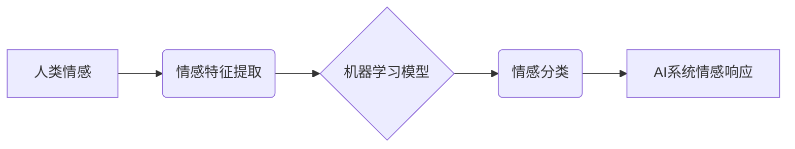

                 

## 数字化情感：AI如何影响人类感受

> 关键词：人工智能、情感计算、机器学习、自然语言处理、深度学习、人机交互、伦理问题

## 1. 背景介绍

人类情感是复杂而多样的，它影响着我们的思维、行为和决策。随着人工智能（AI）技术的飞速发展，AI系统开始能够识别、理解和模拟人类情感，这引发了人们对AI如何影响人类感受的深思熟虑。

传统的人工智能系统主要侧重于逻辑推理和数据处理，缺乏对情感的感知和理解能力。然而，近年来，随着深度学习和自然语言处理（NLP）技术的进步，AI系统开始具备识别和分析人类情感的能力。例如，一些聊天机器人能够识别用户的语气和情绪，并做出相应的回应。

AI对情感的理解和模拟不仅可以提升人机交互体验，还可以应用于各个领域，例如医疗保健、教育、市场营销等。例如，AI可以帮助医生识别患者的情绪状态，从而提供更精准的医疗建议；AI可以帮助老师了解学生的学习情绪，从而调整教学方法；AI可以帮助企业了解客户的情绪反馈，从而改进产品和服务。

然而，AI对情感的介入也引发了一些伦理问题。例如，AI系统是否能够真正理解人类情感？AI系统是否会利用情感信息进行操纵？AI系统如何保护用户隐私？这些问题需要我们认真思考和探讨。

## 2. 核心概念与联系

### 2.1 情感计算

情感计算是研究计算机如何识别、理解和模拟人类情感的一门学科。它涉及到自然语言处理、机器学习、心理学、认知科学等多个领域。

### 2.2 机器学习

机器学习是人工智能的一个分支，它使计算机能够从数据中学习，并根据学习到的知识进行预测或决策。在情感计算中，机器学习算法可以用来训练模型，识别不同情感的特征。

### 2.3 深度学习

深度学习是机器学习的一个子领域，它使用多层神经网络来模拟人类大脑的学习过程。深度学习算法在情感识别方面取得了显著的进展，能够识别更复杂和微妙的情感。

**核心概念与联系流程图**



## 3. 核心算法原理 & 具体操作步骤

### 3.1 算法原理概述

情感分析算法通常基于以下原理：

* **文本情感分类:** 分析文本内容中表达的情感倾向，将其归类为正向、负向或中性。
* **情感强度度量:** 评估文本中表达的情感强度，例如，强烈高兴、轻微悲伤等。
* **情感细粒度分类:** 将情感细分为更具体的类别，例如，快乐、悲伤、愤怒、恐惧等。

### 3.2 算法步骤详解

**文本情感分类算法步骤:**

1. **数据预处理:** 清洗文本数据，去除停用词、标点符号等，并将文本转换为标准格式。
2. **特征提取:** 从文本中提取情感相关的特征，例如，情感词、词性、语法结构等。
3. **模型训练:** 使用机器学习算法，例如支持向量机（SVM）、随机森林（RF）、深度神经网络（DNN）等，训练情感分类模型。
4. **模型评估:** 使用测试数据评估模型的性能，例如，准确率、召回率、F1-score等。
5. **情感分类:** 将新文本输入到训练好的模型中，预测其情感类别。

### 3.3 算法优缺点

**优点:**

* 能够自动识别和分类文本中的情感。
* 可以处理大量文本数据。
* 能够识别复杂和微妙的情感。

**缺点:**

* 算法的性能取决于训练数据的质量。
* 算法可能无法识别所有类型的感情。
* 算法可能受到文化和语言背景的影响。

### 3.4 算法应用领域

* **社交媒体分析:** 分析用户在社交媒体上的情感倾向，了解用户对品牌、产品或事件的看法。
* **客户服务:** 自动识别客户的投诉和反馈，提高客户服务效率。
* **市场营销:** 了解消费者对产品的感受，改进营销策略。
* **医疗保健:** 识别患者的情绪状态，提供更精准的医疗建议。

## 4. 数学模型和公式 & 详细讲解 & 举例说明

### 4.1 数学模型构建

情感分析算法通常使用概率模型来表示情感分类的可能性。例如，可以使用贝叶斯网络来表示不同情感类别之间的关系，以及文本特征与情感类别之间的概率。

### 4.2 公式推导过程

假设我们有一个文本分类任务，需要将文本分类为正向、负向或中性。我们可以使用朴素贝叶斯算法来构建一个情感分类模型。

**朴素贝叶斯公式:**

$$P(C|X) = \frac{P(X|C)P(C)}{P(X)}$$

其中：

* $P(C|X)$ 是给定文本 $X$ 的情况下情感类别 $C$ 的概率。
* $P(X|C)$ 是给定情感类别 $C$ 的情况下文本 $X$ 的概率。
* $P(C)$ 是情感类别 $C$ 的先验概率。
* $P(X)$ 是文本 $X$ 的先验概率。

**举例说明:**

假设我们有一个文本 "今天天气真好"，我们需要预测其情感类别。我们可以使用训练好的朴素贝叶斯模型来计算 $P(C|X)$。

* $P(X|C)$ 可以通过训练数据计算，例如，如果训练数据中 "今天天气真好" 的情感类别为正向，那么 $P(X|C)$ 就为正向的概率。
* $P(C)$ 可以通过训练数据计算，例如，如果训练数据中正向情感的比例为 60%，那么 $P(C)$ 就为 0.6。
* $P(X)$ 可以通过训练数据计算，例如，如果训练数据中包含 1000 个文本，其中 500 个文本是正向情感，那么 $P(X)$ 就为 0.5。

通过将这些值代入朴素贝叶斯公式，我们可以计算出 $P(C|X)$，并预测文本 "今天天气真好" 的情感类别。

### 4.3 案例分析与讲解

**案例:**

一个电商平台想要使用情感分析算法来分析用户对产品的评论。

**分析:**

* 首先，需要收集用户对产品的评论数据。
* 然后，需要对评论数据进行预处理，例如，去除停用词、标点符号等。
* 接下来，需要使用机器学习算法，例如 SVM、RF、DNN 等，训练情感分类模型。
* 最后，可以使用训练好的模型来分析用户对产品的评论，并根据评论的情感倾向进行相应的处理，例如，改进产品设计、优化客服服务等。

## 5. 项目实践：代码实例和详细解释说明

### 5.1 开发环境搭建

* Python 3.x
* TensorFlow 或 PyTorch
* NLTK 或 spaCy

### 5.2 源代码详细实现

```python
import nltk
from nltk.sentiment import SentimentIntensityAnalyzer

# 下载情感分析模型
nltk.download('vader_lexicon')

# 实例化情感分析器
analyzer = SentimentIntensityAnalyzer()

# 输入文本
text = "今天天气真好"

# 分析文本情感
scores = analyzer.polarity_scores(text)

# 打印情感得分
print(scores)
```

### 5.3 代码解读与分析

* 该代码使用 NLTK 库中的 SentimentIntensityAnalyzer 类来分析文本的情感。
* 首先，需要下载 VADER 情感词典。
* 然后，实例化 SentimentIntensityAnalyzer 对象。
* 最后，使用 `polarity_scores()` 方法分析文本的情感，并打印情感得分。

### 5.4 运行结果展示

```
{'neg': 0.0, 'neu': 0.291, 'pos': 0.709, 'compound': 0.8947}
```

结果表明，文本 "今天天气真好" 的情感倾向为正向。

## 6. 实际应用场景

### 6.1 社交媒体监控

* 监测用户对品牌、产品或事件的舆情，及时了解用户反馈和情绪变化。
* 识别负面评论，并采取措施进行危机公关。
* 分析用户对不同产品的喜好，为产品开发提供参考。

### 6.2 客户服务

* 自动识别客户的投诉和反馈，提高客户服务效率。
* 根据客户的情绪状态，提供个性化的服务建议。
* 分析客户服务数据，识别服务痛点，改进服务流程。

### 6.3 市场营销

* 了解消费者对产品的感受，改进营销策略。
* 分析广告效果，优化广告投放。
* 个性化推荐产品，提高用户转化率。

### 6.4 医疗保健

* 识别患者的情绪状态，提供更精准的医疗建议。
* 辅助医生诊断疾病，例如，识别抑郁症、焦虑症等。
* 监测患者的康复情况，及时提供支持和帮助。

### 6.4 未来应用展望

* **更精准的情感识别:** 随着人工智能技术的进步，AI系统将能够识别更复杂和微妙的情感。
* **多模态情感分析:** AI系统将能够分析多种模态数据，例如文本、语音、图像等，进行更全面的情感分析。
* **个性化情感交互:** AI系统将能够根据用户的个性化需求，提供更个性化的情感交互体验。

## 7. 工具和资源推荐

### 7.1 学习资源推荐

* **书籍:**
    * 《情感计算》
    * 《深度学习》
* **在线课程:**
    * Coursera: Natural Language Processing Specialization
    * edX: Artificial Intelligence

### 7.2 开发工具推荐

* **Python:** 
    * NLTK
    * spaCy
    * TensorFlow
    * PyTorch
* **其他工具:**
    * Google Cloud Natural Language API
    * Amazon Comprehend

### 7.3 相关论文推荐

* **情感分析论文:**
    * Pang, B., Lee, L., & Vaithyanathan, S. (2002). Thumbs up? Sentiment classification using machine learning techniques. Proceedings of the ACL-02 conference on Empirical methods in natural language processing-Volume 10, 79-86.
* **深度学习情感分析论文:**
    * Zhang, X., Zhao, J., & LeCun, Y. (2015). Character-level convolutional networks for text classification. arXiv preprint arXiv:1509.01621.

## 8. 总结：未来发展趋势与挑战

### 8.1 研究成果总结

近年来，情感计算领域取得了显著的进展，AI系统能够识别和理解人类情感，并应用于各个领域。

### 8.2 未来发展趋势

* **更精准的情感识别:** 随着人工智能技术的进步，AI系统将能够识别更复杂和微妙的情感。
* **多模态情感分析:** AI系统将能够分析多种模态数据，例如文本、语音、图像等，进行更全面的情感分析。
* **个性化情感交互:** AI系统将能够根据用户的个性化需求，提供更个性化的情感交互体验。

### 8.3 面临的挑战

* **数据标注问题:** 情感分析算法需要大量的标注数据，数据标注成本高，且标注质量难以保证。
* **跨文化差异:** 情感表达方式存在文化差异，跨文化情感分析是一个挑战。
* **伦理问题:** AI系统如何保护用户隐私，避免情感操纵等伦理问题需要认真思考和探讨。

### 8.4 研究展望

未来，情感计算领域将继续发展，AI系统将能够更深入地理解人类情感，并应用于更多领域，为人类社会带来更多福祉。

## 9. 附录：常见问题与解答

**常见问题:**

* **AI系统是否能够真正理解人类情感？**

**解答:** 目前，AI系统只能识别和模拟人类情感，但无法真正理解情感的复杂性和多层次性。

* **AI系统如何保护用户隐私？**

**解答:** 开发者需要采取措施保护用户隐私，例如，匿名化数据、加密传输等。

* **AI系统会利用情感信息进行操纵吗？**

**解答:** 这是个需要认真思考的伦理问题。开发者需要制定相应的规范和机制，避免AI系统被用于操纵和欺骗。


作者：禅与计算机程序设计艺术 / Zen and the Art of Computer Programming 
<end_of_turn>

