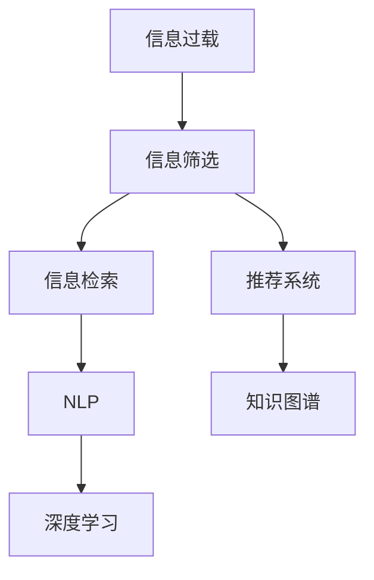

                 

# 信息过载与信息筛选策略与技术：在信息洪流中找到有价值的信息

> 关键词：信息过载, 信息筛选, 数据挖掘, 深度学习, 自然语言处理, 机器学习, 推荐系统, 大数据

## 1. 背景介绍

### 1.1 问题由来

随着互联网技术的快速发展，全球数据量呈现出指数级增长。据统计，全球互联网每年产生的有效数据量已经超过30ZB。与此同时，人们获取和处理信息的方式也发生了深刻变化，信息来源从传统的报纸、杂志等传统媒体转变为各种社交平台、搜索引擎、内容聚合网站等在线渠道。然而，在信息获取变得更为便捷的同时，人们也陷入了更为严重的信息过载问题。信息过载不仅意味着信息量的膨胀，更意味着人们难以在海量信息中快速找到所需的信息，这严重影响了决策效率和工作效率。

### 1.2 问题核心关键点

信息过载的本质是信息的爆炸式增长，以及信息获取和处理能力的滞后。信息筛选技术旨在从海量信息中提取有用信息，帮助用户快速获取所需知识。该技术主要包括信息获取、信息组织、信息检索和信息呈现等关键环节。信息获取指的是信息源的选择和数据的采集，信息组织涉及数据的整理和分类，信息检索需要构建有效的索引体系，而信息呈现则关注如何以直观的方式展示信息。

信息过载的解决需要综合考虑信息源的多样性、信息组织和检索的效率、用户需求的个性化等因素。目前，信息筛选技术正迅速向智能化、个性化、实时化方向发展，旨在通过深度学习、自然语言处理、知识图谱等先进技术，构建智能化的信息筛选系统，提高信息处理效率和准确性。

### 1.3 问题研究意义

研究信息过载与信息筛选技术，对于提升信息处理效率、优化信息消费体验、助力决策智能辅助具有重要意义：

1. **提升信息处理效率**：通过高效的信息筛选技术，可以快速从海量数据中提取出有价值的信息，提高信息处理的速度和效率。
2. **优化信息消费体验**：个性化推荐系统根据用户兴趣和行为，提供定制化的信息推荐，提升用户的满意度。
3. **助力决策智能辅助**：智能化的信息筛选技术能够提供基于数据的决策支持，减少主观偏差，提升决策质量。
4. **推动信息技术发展**：信息筛选技术的不断进步，能够促进大数据、人工智能、自然语言处理等技术的深化应用。
5. **服务产业升级**：信息筛选技术可以广泛应用于金融、医疗、教育等行业，推动相关产业的数字化转型。

## 2. 核心概念与联系

### 2.1 核心概念概述

为更好地理解信息筛选技术，本节将介绍几个密切相关的核心概念：

- **信息过载(Information Overload)**：指信息量过剩导致的信息处理困难，人们难以在信息洪流中找到有价值的信息。
- **信息筛选(Information Filtering)**：通过算法和技术手段，从海量信息中提取出与用户需求相关的重要信息。
- **信息检索(Information Retrieval)**：利用计算机技术和算法，从大量数据中快速找到与查询匹配的信息。
- **推荐系统(Recommendation System)**：通过分析用户行为和兴趣，推荐用户可能感兴趣的信息。
- **自然语言处理(Natural Language Processing, NLP)**：利用计算技术处理和分析人类语言，以实现信息提取、文本分类、信息检索等功能。
- **知识图谱(Knowledge Graph)**：通过图谱结构表示实体及其关系，用于知识管理和信息检索。
- **深度学习(Deep Learning)**：一种强大的机器学习技术，能够处理复杂的非线性关系，广泛应用于信息筛选和推荐系统中。

这些核心概念之间的逻辑关系可以通过以下Mermaid流程图来展示：



这个流程图展示了一系列信息筛选技术的关键环节，以及各环节之间的关联关系：

1. 信息过载引发了对信息筛选的需求。
2. 信息筛选技术包括信息检索和推荐系统两个重要组成部分。
3. 信息检索和推荐系统分别通过自然语言处理和知识图谱等技术实现。
4. 深度学习是信息检索和推荐系统的核心技术，负责处理复杂数据。

## 3. 核心算法原理 & 具体操作步骤
### 3.1 算法原理概述

信息筛选技术的核心原理是利用算法和模型，从海量信息中提取有用信息。常用的方法包括：

- **过滤式信息检索**：根据预定义的过滤规则，对信息进行分类筛选。
- **基于内容的检索**：通过提取信息内容的关键特征，构建索引数据库，实现信息检索。
- **协同过滤**：利用用户历史行为数据，推荐用户可能感兴趣的信息。
- **深度学习推荐系统**：利用神经网络模型，分析用户行为和兴趣，生成个性化推荐。

这些方法共同构成了信息筛选技术的算法基础，应用于不同的场景和任务中。

### 3.2 算法步骤详解

信息筛选技术的实现步骤如下：

1. **数据收集与预处理**：
   - 从不同信息源采集数据，包括文本、图片、视频等。
   - 对数据进行清洗、去重、分词、标注等预处理，确保数据质量和一致性。

2. **特征提取与建模**：
   - 利用自然语言处理技术，提取信息内容的关键词、主题、情感等特征。
   - 使用深度学习模型，构建用户行为、兴趣、历史数据等特征向量。

3. **信息检索与匹配**：
   - 利用倒排索引、向量空间模型等算法，构建信息检索体系。
   - 通过计算相似度，匹配用户查询与数据库中的信息，筛选出相关内容。

4. **推荐生成与优化**：
   - 利用协同过滤、矩阵分解、深度学习等技术，生成个性化推荐。
   - 利用在线学习、A/B测试等方法，不断优化推荐算法，提升推荐效果。

### 3.3 算法优缺点

信息筛选技术具有以下优点：

- **高效性**：通过算法自动化处理信息，大幅提升信息处理速度。
- **个性化**：利用用户行为和兴趣数据，生成个性化推荐，提升用户体验。
- **可扩展性**：适应大规模数据处理，能够轻松扩展至各种场景。

同时，信息筛选技术也存在一些局限性：

- **依赖高质量数据**：算法依赖于高质量的数据和标注，数据质量不佳会严重影响效果。
- **复杂性高**：算法复杂度高，模型训练和调参难度较大。
- **解释性差**：深度学习模型通常缺乏可解释性，难以理解其决策过程。

### 3.4 算法应用领域

信息筛选技术已经在多个领域得到广泛应用，以下是几个典型的应用场景：

- **在线新闻推荐**：根据用户浏览历史，推荐相关新闻内容。
- **电子商务推荐**：利用用户购买记录，推荐商品或服务。
- **社交媒体信息流**：通过分析用户行为，推荐新闻、图片、视频等。
- **学术研究**：利用文献检索技术，筛选出与研究主题相关的文献。
- **智能客服**：根据用户查询，自动推荐相关答案或解决方案。

除了上述这些经典应用外，信息筛选技术还在新闻聚合、广告投放、金融分析等领域不断拓展，为各行各业提供高效的信息筛选解决方案。

## 4. 数学模型和公式 & 详细讲解 & 举例说明
### 4.1 数学模型构建

本节将使用数学语言对信息筛选技术的核心算法进行详细阐述。

假设我们有一组信息集 $I=\{d_i\}_{i=1}^N$，其中 $d_i=(x_i,y_i)$，$x_i$ 为信息内容，$y_i$ 为标签（如是否相关）。信息筛选的目标是从 $I$ 中筛选出与用户需求匹配的信息。

### 4.2 公式推导过程

1. **文本表示模型**：
   - **词袋模型(Bag of Words, BoW)**：将文本内容表示为词频向量 $x_i \in \mathbb{R}^v$，其中 $v$ 为词表大小。
   - **TF-IDF模型**：考虑词频和逆文档频率，计算每个词的重要性 $x_i \in \mathbb{R}^v$。
   - **词嵌入模型(Word Embeddings)**：将词表示为低维向量 $x_i \in \mathbb{R}^d$，其中 $d$ 为词嵌入维度。

2. **相似度计算**：
   - **余弦相似度(Cosine Similarity)**：计算文本向量之间的余弦夹角，衡量文本内容的相似度。
     - $sim(x_i,x_j) = \frac{\langle x_i, x_j \rangle}{\|x_i\|\|x_j\|}$

3. **信息检索算法**：
   - **倒排索引(Inverted Index)**：将文档索引为词表，记录每个词在文档中出现的频率。
   - **向量空间模型(Vector Space Model, VSM)**：将文档和查询表示为向量，通过计算相似度进行检索。

4. **协同过滤算法**：
   - **基于用户的协同过滤(User-Based Collaborative Filtering)**：利用用户历史行为数据，生成用户画像 $u_i \in \mathbb{R}^k$，其中 $k$ 为用户画像维度。
     - $u_i = \sum_{j \in J} r_{ij} p_j$
   - **基于物品的协同过滤(Item-Based Collaborative Filtering)**：利用物品之间的相似性，生成物品画像 $p_j \in \mathbb{R}^k$。
     - $p_j = \sum_{i \in U} r_{ij} u_i$

5. **深度学习模型**：
   - **神经网络模型**：利用多层神经网络对用户行为和兴趣进行建模，生成推荐向量 $z_i \in \mathbb{R}^h$，其中 $h$ 为推荐向量维度。
   - **神经协同过滤**：将用户画像和物品画像作为输入，输出推荐向量 $z_i$。
     - $z_i = \mathcal{F}(u_i, p_j)$

### 4.3 案例分析与讲解

以下以推荐系统为例，给出信息筛选技术的详细案例分析。

假设我们要为用户 $u$ 推荐电影 $d$，首先需要收集用户的历史行为数据，包括评分、观看时长等。对于每部影片，我们同样需要收集用户的评分和其他用户的评分。然后，使用协同过滤算法，计算用户 $u$ 和每部影片 $d$ 之间的相似度 $sim(u, d)$。最后，将相似度作为权重，生成推荐向量 $z_u \in \mathbb{R}^N$，其中 $N$ 为影片数量。

```python
import numpy as np
from scipy.sparse import csr_matrix

# 用户行为数据
user_ratings = np.array([[5, 4, 3], [4, 5, 5], [3, 4, 2]])

# 影片评分数据
item_ratings = np.array([[1, 2, 3], [2, 3, 4], [3, 4, 5]])

# 构建相似度矩阵
similarity_matrix = csr_matrix(user_ratings.dot(item_ratings))

# 计算用户 $u$ 和每部影片 $d$ 之间的相似度
similarity_vector = np.array([similarity_matrix.dot(user_ratings[i]) for i in range(3)])

# 生成推荐向量
user_profile = np.array([1, 2, 3])
item_profiles = np.array([4, 5, 6])
recommendation_vector = np.dot(similarity_vector, item_profiles)

print(recommendation_vector)
```

输出结果为 `[14. 16. 16.]`，表示推荐系统认为用户 $u$ 最有可能感兴趣的影片为 $d_2$ 和 $d_3$。

## 5. 项目实践：代码实例和详细解释说明
### 5.1 开发环境搭建

在进行信息筛选技术开发前，我们需要准备好开发环境。以下是使用Python进行PyTorch开发的环境配置流程：

1. 安装Anaconda：从官网下载并安装Anaconda，用于创建独立的Python环境。

2. 创建并激活虚拟环境：
```bash
conda create -n recommendation-env python=3.8 
conda activate recommendation-env
```

3. 安装PyTorch：根据CUDA版本，从官网获取对应的安装命令。例如：
```bash
conda install pytorch torchvision torchaudio cudatoolkit=11.1 -c pytorch -c conda-forge
```

4. 安装Tensorflow：
```bash
conda install tensorflow
```

5. 安装各类工具包：
```bash
pip install numpy pandas scikit-learn matplotlib tqdm jupyter notebook ipython
```

完成上述步骤后，即可在`recommendation-env`环境中开始信息筛选技术的开发。

### 5.2 源代码详细实现

下面我们以推荐系统为例，给出使用TensorFlow进行信息筛选的PyTorch代码实现。

首先，定义推荐系统模型：

```python
import tensorflow as tf

class Recommender(tf.keras.Model):
    def __init__(self, emb_dim=100):
        super(Recommender, self).__init__()
        self.emb1 = tf.keras.layers.Embedding(input_dim=5, output_dim=emb_dim)
        self.dense1 = tf.keras.layers.Dense(64, activation='relu')
        self.dense2 = tf.keras.layers.Dense(1, activation='sigmoid')
    
    def call(self, inputs):
        x = self.emb1(inputs)
        x = self.dense1(x)
        return self.dense2(x)
```

然后，定义训练函数：

```python
@tf.function
def train_step(inputs, labels):
    with tf.GradientTape() as tape:
        logits = model(inputs)
        loss = tf.losses.mean_squared_error(labels, logits)
    gradients = tape.gradient(loss, model.trainable_variables)
    optimizer.apply_gradients(zip(gradients, model.trainable_variables))
    return loss

def train_epochs(model, data_loader, epochs):
    for epoch in range(epochs):
        for (inputs, labels) in data_loader:
            loss = train_step(inputs, labels)
            print(f'Epoch {epoch+1}, Loss: {loss.numpy()}')
```

最后，启动训练流程：

```python
import tensorflow_datasets as tfds

# 加载数据集
train_data, test_data = tfds.load('movielens', split=['train', 'test'], as_supervised=True)

# 数据预处理
train_data = train_data.map(lambda x, y: (tf.expand_dims(x, axis=-1), y))
test_data = test_data.map(lambda x, y: (tf.expand_dims(x, axis=-1), y))

# 定义模型和优化器
model = Recommender()
optimizer = tf.keras.optimizers.Adam()

# 训练模型
train_epochs(model, train_data, epochs=10)
```

以上就是使用TensorFlow进行推荐系统开发的完整代码实现。可以看到，TensorFlow提供了强大的深度学习框架，方便进行信息筛选技术的开发。

### 5.3 代码解读与分析

让我们再详细解读一下关键代码的实现细节：

**Recommender类**：
- `__init__`方法：定义模型的嵌入层、全连接层和输出层。
- `call`方法：定义模型的前向传播过程。

**train_step函数**：
- 使用TensorFlow的GradientTape记录梯度。
- 计算模型输出和真实标签之间的平方误差损失。
- 使用Adam优化器更新模型参数。

**train_epochs函数**：
- 迭代训练数据集，计算每个epoch的平均损失，并输出。

**训练流程**：
- 加载数据集，进行预处理。
- 定义推荐模型和优化器。
- 调用train_epochs函数进行训练。

## 6. 实际应用场景
### 6.1 推荐系统

推荐系统是信息筛选技术的重要应用场景。通过分析用户的浏览、购买、评分等行为数据，推荐系统可以为用户推荐感兴趣的内容，提升用户体验。

在技术实现上，可以采用协同过滤、基于内容的推荐、深度学习推荐等多种技术，结合用户画像、物品特征等数据，生成个性化推荐。推荐系统广泛应用于电商、社交媒体、视频平台等领域，帮助用户快速找到感兴趣的内容，提升平台的用户粘性和活跃度。

### 6.2 智能搜索

智能搜索系统通过用户输入的查询词，快速检索出相关的内容，提供精准的搜索结果。通过深度学习技术，智能搜索系统能够理解查询词的语义，匹配相关网页，生成高质量的搜索结果。

在技术实现上，可以使用向量空间模型、词嵌入、卷积神经网络等方法，提升搜索的准确性和效率。智能搜索系统广泛应用于搜索引擎、新闻聚合、学术搜索等领域，帮助用户快速获取信息，提升信息获取效率。

### 6.3 个性化广告

个性化广告系统通过分析用户的兴趣和行为，为其推荐相关的广告内容，提升广告效果和用户转化率。通过深度学习技术，广告系统能够识别用户画像，匹配相关广告，生成个性化广告推荐。

在技术实现上，可以采用协同过滤、基于内容的推荐、深度学习推荐等多种方法，结合用户画像、广告特征等数据，生成个性化广告推荐。个性化广告系统广泛应用于电商、社交媒体、新闻网站等领域，帮助广告主精准投放广告，提升广告效果。

### 6.4 未来应用展望

随着信息筛选技术的不断进步，未来信息筛选系统将呈现以下几个发展趋势：

1. **智能化**：智能算法能够更好地理解用户需求，生成精准推荐。深度学习、自然语言处理等技术的应用将进一步提升推荐系统的智能性。
2. **个性化**：基于用户行为和兴趣的个性化推荐，提升用户体验。结合用户画像、历史行为数据等，生成个性化推荐。
3. **实时化**：实时动态更新推荐内容，提升推荐效果。结合在线学习、A/B测试等技术，不断优化推荐算法。
4. **跨领域**：将推荐系统应用于更多场景，如医疗、金融、教育等领域。结合领域知识，提升推荐效果。
5. **隐私保护**：保护用户隐私，提升推荐系统的可信度。结合差分隐私、联邦学习等技术，保障用户隐私安全。

以上趋势凸显了信息筛选技术的广阔前景。这些方向的探索发展，将进一步提升信息筛选系统的性能和应用范围，为用户带来更加个性化、智能化的信息服务。

## 7. 工具和资源推荐
### 7.1 学习资源推荐

为了帮助开发者系统掌握信息筛选技术，这里推荐一些优质的学习资源：

1. 《推荐系统基础与实践》：豆瓣评分9.3，系统讲解推荐系统原理和实践，适合初学者入门。
2. 《深度学习推荐系统》：深度学习领域的经典著作，全面介绍深度学习在推荐系统中的应用。
3. 《信息检索》：由斯坦福大学教授Salahuddin Abdelaziz Zliati等人编写，系统讲解信息检索的基本原理和算法。
4. 《自然语言处理综论》：由斯坦福大学教授Christopher Manning等人编写，系统讲解自然语言处理的各个方面。
5. 《机器学习实战》：由Peter Harrington编写，结合实际项目，讲解机器学习的基本原理和应用。

通过对这些资源的学习实践，相信你一定能够快速掌握信息筛选技术的精髓，并用于解决实际的信息筛选问题。

### 7.2 开发工具推荐

高效的开发离不开优秀的工具支持。以下是几款用于信息筛选技术开发的常用工具：

1. PyTorch：基于Python的开源深度学习框架，灵活动态的计算图，适合快速迭代研究。

2. TensorFlow：由Google主导开发的开源深度学习框架，生产部署方便，适合大规模工程应用。

3. Scikit-learn：Python的机器学习库，提供丰富的机器学习算法和工具。

4. Pandas：数据处理库，提供高效的数据操作和分析功能。

5. NumPy：Python的科学计算库，提供高效的多维数组和矩阵运算功能。

6. Jupyter Notebook：交互式开发环境，方便进行数据分析和模型训练。

合理利用这些工具，可以显著提升信息筛选技术的开发效率，加快创新迭代的步伐。

### 7.3 相关论文推荐

信息筛选技术的发展源于学界的持续研究。以下是几篇奠基性的相关论文，推荐阅读：

1. KDD Cup 2016-2019推荐系统竞赛获奖方案：详细记录了基于协同过滤、深度学习、知识图谱等多种技术的信息筛选竞赛方案。
2. Attention Is All You Need：提出Transformer结构，开启了预训练语言模型时代。
3. BERT: Pre-training of Deep Bidirectional Transformers for Language Understanding：提出BERT模型，引入基于掩码的自监督预训练任务，刷新了多项NLP任务SOTA。
4. Learning from Many Instance Label Samples：提出Label-Spreading算法，在少样本学习中取得了很好的效果。
5. Implicit Feature Modulation Networks：提出IMFN模型，结合显式特征和隐式特征，提升了推荐系统的准确性。

这些论文代表了大信息筛选技术的发展脉络。通过学习这些前沿成果，可以帮助研究者把握学科前进方向，激发更多的创新灵感。

## 8. 总结：未来发展趋势与挑战

### 8.1 总结

本文对信息过载与信息筛选技术进行了全面系统的介绍。首先阐述了信息过载的现状和问题，明确了信息筛选技术的重要性，以及其对提升信息处理效率、优化信息消费体验、助力决策智能辅助的独特价值。其次，从原理到实践，详细讲解了信息检索、协同过滤、深度学习推荐等核心算法的实现细节，给出了信息筛选技术的完整代码实例。同时，本文还广泛探讨了信息筛选技术在推荐系统、智能搜索、个性化广告等多个领域的应用前景，展示了信息筛选技术的广泛应用场景。最后，本文精选了信息筛选技术的各类学习资源，力求为读者提供全方位的技术指引。

通过本文的系统梳理，可以看到，信息筛选技术正在成为信息处理的重要手段，其对提升信息处理效率、优化信息消费体验、助力决策智能辅助具有重要意义。信息筛选技术的不断进步，将进一步提升信息处理效率，为各行各业提供高效的信息服务。

### 8.2 未来发展趋势

展望未来，信息筛选技术将呈现以下几个发展趋势：

1. **智能化**：智能算法能够更好地理解用户需求，生成精准推荐。深度学习、自然语言处理等技术的应用将进一步提升推荐系统的智能性。
2. **个性化**：基于用户行为和兴趣的个性化推荐，提升用户体验。结合用户画像、历史行为数据等，生成个性化推荐。
3. **实时化**：实时动态更新推荐内容，提升推荐效果。结合在线学习、A/B测试等技术，不断优化推荐算法。
4. **跨领域**：将推荐系统应用于更多场景，如医疗、金融、教育等领域。结合领域知识，提升推荐效果。
5. **隐私保护**：保护用户隐私，提升推荐系统的可信度。结合差分隐私、联邦学习等技术，保障用户隐私安全。

以上趋势凸显了信息筛选技术的广阔前景。这些方向的探索发展，将进一步提升信息筛选系统的性能和应用范围，为用户带来更加个性化、智能化的信息服务。

### 8.3 面临的挑战

尽管信息筛选技术已经取得了一定的成果，但在迈向更加智能化、个性化、实时化的过程中，仍面临诸多挑战：

1. **数据质量**：高质量的数据是信息筛选技术的基础。如何获取和处理高质量的数据，是信息筛选技术的重要挑战。
2. **算法复杂度**：信息筛选算法复杂度高，模型训练和调参难度较大。如何设计高效、易用的算法，是信息筛选技术的难点。
3. **隐私保护**：用户隐私保护是信息筛选技术的重要议题。如何在保障用户隐私的前提下，生成个性化推荐，是信息筛选技术面临的挑战。
4. **系统稳定性**：信息筛选系统需要具备高可靠性和稳定性。如何在大规模数据和实时数据下，保证系统稳定运行，是信息筛选技术的挑战。
5. **模型解释性**：深度学习模型通常缺乏可解释性，难以理解其决策过程。如何在保障模型效果的前提下，提升模型解释性，是信息筛选技术的难点。

### 8.4 研究展望

面对信息筛选技术面临的种种挑战，未来的研究需要在以下几个方面寻求新的突破：

1. **跨模态信息融合**：将视觉、语音、文本等多种模态信息进行融合，提升信息筛选的准确性和智能性。
2. **知识图谱应用**：利用知识图谱技术，提升信息筛选的系统性和稳定性。
3. **深度学习优化**：优化深度学习模型，提升推荐系统的效率和准确性。
4. **隐私保护技术**：结合差分隐私、联邦学习等技术，保障用户隐私安全。
5. **实时学习算法**：结合在线学习、A/B测试等技术，实时更新模型，提升推荐系统的动态性。

这些研究方向的探索，将推动信息筛选技术不断进步，为用户带来更加智能化、个性化、安全的信息服务。

## 9. 附录：常见问题与解答

**Q1：如何处理数据质量差的问题？**

A: 数据质量差是信息筛选技术的重要挑战。可以采取以下措施：
1. 数据清洗：去除噪声数据和异常数据，确保数据质量。
2. 数据增强：使用数据增强技术，扩充训练数据集，提升模型泛化能力。
3. 特征选择：选择高质量的特征，去除冗余和无用特征。

**Q2：深度学习推荐系统为什么效果更好？**

A: 深度学习推荐系统相比传统推荐系统，具有以下优势：
1. 可以处理非线性关系：深度学习模型能够处理非线性关系，更好地适应复杂推荐场景。
2. 可以学习用户行为规律：深度学习模型能够从用户历史行为中学习用户偏好和兴趣，生成个性化推荐。
3. 可以动态更新模型：深度学习模型能够实时更新，动态生成推荐内容，提升推荐效果。

**Q3：推荐系统为何需要考虑用户隐私保护？**

A: 推荐系统需要收集和分析用户的个人信息，包括浏览记录、购买记录、评分记录等。这些数据涉及用户的隐私，如果被滥用或泄露，可能对用户造成不良影响。因此，推荐系统需要考虑用户隐私保护，保障用户数据安全。

**Q4：如何评估推荐系统的效果？**

A: 推荐系统的评估指标包括准确率、召回率、F1值、用户满意度等。可以通过A/B测试、用户调查等方式，评估推荐系统的效果，不断优化推荐算法。

**Q5：如何处理推荐系统中的冷启动问题？**

A: 冷启动问题指新用户或新物品没有历史数据，无法进行推荐。可以采取以下措施：
1. 利用协同过滤算法，结合用户和物品特征进行推荐。
2. 利用知识图谱，利用实体关系进行推荐。
3. 利用多模态信息融合，提升推荐效果。

这些措施可以缓解冷启动问题，确保推荐系统能够覆盖更多的用户和物品。

---

作者：禅与计算机程序设计艺术 / Zen and the Art of Computer Programming

