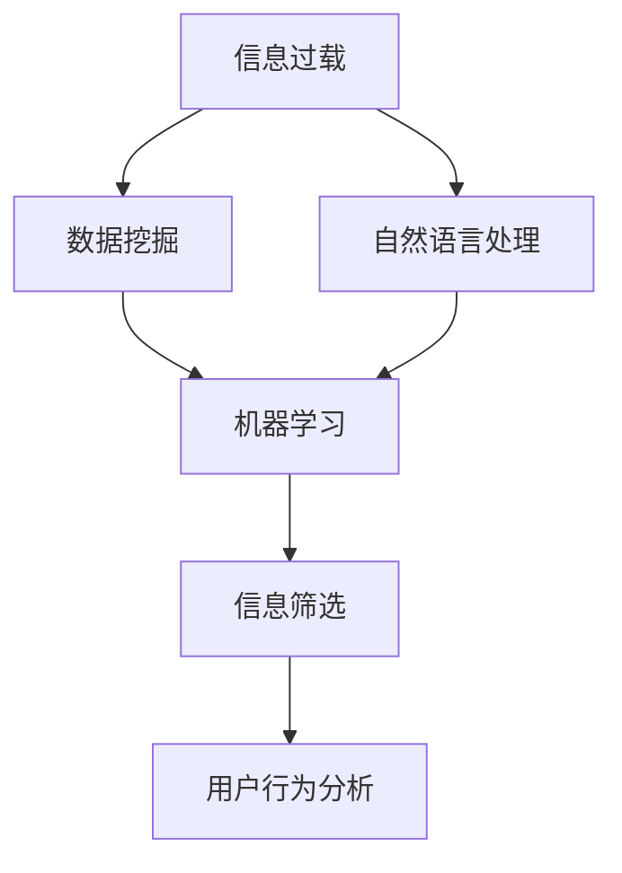

                 

# 信息过载与信息筛选策略：在信息洪流中找到有价值的信息

> 关键词：信息过载,信息筛选,数据挖掘,自然语言处理,NLP,机器学习,算法

## 1. 背景介绍

在现代社会，信息无处不在，人们每天都会接触到海量的文本、图片、视频等数据。无论是社交媒体、新闻网站、科学研究还是商业决策，信息过载都已成为影响我们判断、决策和生活的重大挑战。为了在信息洪流中找到有价值的信息，本文将深入探讨信息筛选的核心概念、算法原理和具体实施方法。

## 2. 核心概念与联系

### 2.1 核心概念概述

要理解信息筛选，首先需要掌握以下几个核心概念：

- **信息过载（Information Overload）**：指人们接受的信息量远远超出了其处理能力，导致注意力分散、决策困难甚至焦虑。
- **信息筛选（Information Filtering）**：通过算法或规则自动选择、排序或标记信息，帮助用户在海量数据中快速找到有用的内容。
- **数据挖掘（Data Mining）**：从大数据中挖掘有用的模式、规律或知识，涵盖文本挖掘、图像挖掘等多个方向。
- **自然语言处理（NLP）**：指计算机处理、理解、生成自然语言的技术，是信息筛选的重要工具。
- **机器学习（Machine Learning）**：通过数据训练模型，自动发现数据特征和规律，支持信息筛选的实现。

这些概念之间的联系可通过以下Mermaid流程图来展示：



该流程图展示了信息过载导致的数据挖掘需求，通过自然语言处理获取文本信息，再利用机器学习算法进行信息筛选，最终反馈用户行为，形成一个闭环。

## 3. 核心算法原理 & 具体操作步骤

### 3.1 算法原理概述

信息筛选的核心思想是通过算法模型自动识别和筛选文本中的关键信息，帮助用户快速定位有用内容。常见的信息筛选算法包括基于统计的方法、基于机器学习的方法、以及基于深度学习的方法。这些方法各有优缺点，适用于不同的场景和需求。

### 3.2 算法步骤详解

下面以基于机器学习的文本分类模型为例，详细阐述信息筛选的算法步骤：

1. **数据准备**：收集标注好的训练数据集，包括各类文本及其对应的类别标签。
2. **特征提取**：将文本转化为模型可以处理的向量形式，常用方法包括词袋模型、TF-IDF、词嵌入等。
3. **模型训练**：选择合适的分类模型（如朴素贝叶斯、支持向量机、随机森林等），使用训练数据训练模型，得到参数θ。
4. **模型评估**：使用验证集评估模型性能，如准确率、召回率、F1值等指标。
5. **模型应用**：将新文本数据转化为特征向量，输入训练好的模型，得到文本分类结果。

### 3.3 算法优缺点

基于机器学习的文本分类模型具有以下优点：

- **可扩展性强**：能够处理大规模数据集，适用于信息筛选的场景。
- **灵活性高**：可以根据不同的需求设计不同的特征和分类器。
- **效果显著**：在特定领域和任务上，能够取得较低的误差率和较高的准确率。

同时，该方法也存在以下缺点：

- **对数据质量要求高**：需要大量高质量的标注数据，数据标注成本较高。
- **模型泛化能力有限**：对于领域外的数据，模型可能表现不佳。
- **计算复杂度高**：大规模数据集和高维特征导致模型训练和推理复杂度高。

### 3.4 算法应用领域

基于机器学习的文本分类模型在多个领域都有广泛应用，例如：

- **新闻推荐**：通过分析用户的阅读历史和兴趣标签，自动推荐相关新闻内容。
- **广告投放**：根据用户浏览记录和行为特征，精准投放广告内容。
- **客户支持**：通过分析客户查询和反馈，自动分类和回复常见问题。
- **信息检索**：根据用户输入的查询词，自动筛选并排序相关文档。
- **舆情分析**：从海量社交媒体数据中提取关键信息，分析公众情绪和热点话题。

## 4. 数学模型和公式 & 详细讲解 & 举例说明

### 4.1 数学模型构建

假设文本集为 $D = \{(x_i, y_i)\}_{i=1}^N$，其中 $x_i$ 为文本，$y_i$ 为类别标签。

设文本 $x$ 的特征表示为 $x \in \mathbb{R}^d$，使用词袋模型，假设特征 $f_j$ 的出现频率为 $c_j$，则特征向量表示为 $x = \{(c_1, w_1), (c_2, w_2), \ldots, (c_d, w_d)\}$，其中 $w_j$ 为特征 $f_j$ 的权重。

### 4.2 公式推导过程

以朴素贝叶斯分类器为例，给定文本 $x$ 和类别 $y$，条件概率为：

$$
P(y|x) = \frac{P(x|y)P(y)}{P(x)}
$$

其中 $P(y|x)$ 为条件概率，$P(x|y)$ 为文本特征在给定类别下的概率，$P(y)$ 为类别 $y$ 的先验概率，$P(x)$ 为文本特征的边际概率。

通过贝叶斯定理，我们可以对任意文本 $x$ 进行分类：

$$
\hat{y} = \mathop{\arg\max}_{y} P(y|x) = \mathop{\arg\max}_{y} P(y)P(x|y)
$$

其中 $\hat{y}$ 为模型预测的类别。

### 4.3 案例分析与讲解

以情感分析为例，假设有以下两篇新闻：

- 标题：股票市场暴跌，投资者恐慌卖出
- 内容：昨天股市大跌，许多投资者纷纷抛售股票，导致市场恐慌。
- 情感：负面

- 标题：科技公司发布新产品，市场反应热烈
- 内容：科技公司发布了最新产品，市场反响热烈，预计销量将大幅增长。
- 情感：正面

使用朴素贝叶斯模型，首先对文本进行特征提取，得到特征向量 $x_1$ 和 $x_2$。然后，根据历史数据计算出各个特征在正负情感下的条件概率，以及正负情感的先验概率 $P(\text{负面})$ 和 $P(\text{正面})$。最后，对于新文本 $x_3$，通过计算 $P(\text{负面}|x_3)$ 和 $P(\text{正面}|x_3)$，判断其情感倾向。

## 5. 项目实践：代码实例和详细解释说明

### 5.1 开发环境搭建

在进行信息筛选实践前，我们需要准备好开发环境。以下是使用Python进行scikit-learn开发的环境配置流程：

1. 安装Anaconda：从官网下载并安装Anaconda，用于创建独立的Python环境。

2. 创建并激活虚拟环境：
```bash
conda create -n sklearn-env python=3.8 
conda activate sklearn-env
```

3. 安装必要的库：
```bash
conda install scikit-learn
```

完成上述步骤后，即可在`sklearn-env`环境中开始信息筛选实践。

### 5.2 源代码详细实现

以下是一个简单的情感分析模型的代码实现，假设我们已经有了一个包含情感标注的数据集。

```python
from sklearn.feature_extraction.text import CountVectorizer
from sklearn.naive_bayes import MultinomialNB
from sklearn.pipeline import make_pipeline
from sklearn.metrics import classification_report

# 数据集加载
from sklearn.datasets import fetch_20newsgroups
newsgroups_train = fetch_20newsgroups(subset='train', categories=['comp.graphics', 'comp.os.ms-windows.neutral'])

# 特征提取
vectorizer = CountVectorizer(stop_words='english')
X_train = vectorizer.fit_transform(newsgroups_train.data)

# 训练模型
clf = make_pipeline(vectorizer, MultinomialNB())
clf.fit(X_train, newsgroups_train.target)

# 预测
X_test = vectorizer.transform(newsgroups_test.data)
y_pred = clf.predict(X_test)

# 评估
print(classification_report(newsgroups_test.target, y_pred))
```

### 5.3 代码解读与分析

让我们再详细解读一下关键代码的实现细节：

**CountVectorizer**：
- 特征提取器，将文本转化为词频矩阵。

**MultinomialNB**：
- 朴素贝叶斯分类器，用于对文本进行情感分类。

**make_pipeline**：
- 管道，将特征提取和分类器封装为单一的模型，方便调用和评估。

**classification_report**：
- 评估函数，输出分类模型的性能指标，如精确率、召回率、F1值等。

该代码展示了从数据准备到模型评估的完整流程，包含特征提取、模型训练、预测和评估等多个环节。

## 6. 实际应用场景

### 6.1 新闻推荐

新闻推荐系统通过分析用户的历史阅读记录和兴趣标签，自动推荐相关新闻内容。信息筛选技术能够帮助系统在浩如烟海的新闻中，精准匹配用户的阅读偏好。

在实际应用中，可以通过对新闻标题和摘要进行文本挖掘，提取出关键特征，然后使用分类模型预测新闻的情感和主题，最后根据用户偏好进行个性化推荐。

### 6.2 广告投放

广告投放平台需要根据用户的历史行为数据，精准推送合适的广告内容。信息筛选技术可以帮助平台自动识别和筛选用户行为数据中的关键信息，提升广告投放的效果。

例如，可以利用用户的浏览记录、搜索记录、点击行为等信息，提取用户的兴趣标签，然后使用分类模型预测用户对不同广告的兴趣，从而实现精准投放。

### 6.3 客户支持

客户支持系统需要快速响应客户查询，自动分类和回复常见问题。信息筛选技术可以帮助系统自动分析客户查询内容，筛选出常见问题和相关解决方案，提高客户支持效率。

例如，可以构建一个问答系统，使用自然语言处理技术对客户查询进行文本挖掘和分类，然后使用分类模型预测查询所属的类别，并根据类别推荐相应的回答。

## 7. 工具和资源推荐

### 7.1 学习资源推荐

为了帮助开发者系统掌握信息筛选的核心概念和实践技巧，这里推荐一些优质的学习资源：

1. **《Python数据科学手册》**：介绍Python在数据科学中的应用，涵盖数据清洗、特征提取、模型训练等多个环节。
2. **《自然语言处理综论》**：系统介绍自然语言处理的基本概念和算法，包括文本挖掘、信息检索、情感分析等。
3. **《机器学习实战》**：实战教程，涵盖多种机器学习算法及其应用，包括分类、聚类、降维等。
4. **scikit-learn官方文档**：详细介绍了scikit-learn库的使用方法和经典案例，是学习信息筛选的重要参考。
5. **Kaggle**：数据科学竞赛平台，提供大量的数据集和竞赛题目，是实践信息筛选技术的绝佳平台。

通过对这些资源的学习实践，相信你一定能够快速掌握信息筛选的精髓，并用于解决实际的NLP问题。

### 7.2 开发工具推荐

高效的开发离不开优秀的工具支持。以下是几款用于信息筛选开发的常用工具：

1. **Jupyter Notebook**：交互式开发环境，支持Python、R等语言，方便代码调试和展示。
2. **Pandas**：数据处理库，支持多种数据格式，方便数据清洗和预处理。
3. **NumPy**：数值计算库，支持高效的数组和矩阵运算，是进行特征提取和模型训练的基础。
4. **Matplotlib**：绘图库，支持多种绘图类型，方便可视化分析。
5. **SciPy**：科学计算库，支持优化、统计、信号处理等功能，是进行复杂模型训练的重要工具。
6. **TensorFlow和PyTorch**：深度学习框架，支持高效的神经网络训练和推理。

合理利用这些工具，可以显著提升信息筛选任务的开发效率，加快创新迭代的步伐。

### 7.3 相关论文推荐

信息筛选技术的发展源于学界的持续研究。以下是几篇奠基性的相关论文，推荐阅读：

1. **TextRank算法**：提出了基于图模型的文本相似度计算方法，广泛应用于文本聚类和信息检索。
2. **PageRank算法**：提出了基于链接分析的网页排序方法，是搜索引擎的核心算法之一。
3. **Latent Semantic Analysis（LSA）**：通过奇异值分解(SVD)提取文本中的隐含语义信息，用于主题建模和文本分类。
4. **TextBlob**：一个Python库，提供了文本处理和情感分析的接口，简化了信息筛选任务的开发。
5. **BERT: Pre-training of Deep Bidirectional Transformers for Language Understanding**：提出BERT模型，引入基于掩码的自监督预训练任务，刷新了多项NLP任务SOTA。

这些论文代表了大语言模型微调技术的发展脉络。通过学习这些前沿成果，可以帮助研究者把握学科前进方向，激发更多的创新灵感。

## 8. 总结：未来发展趋势与挑战

### 8.1 总结

本文对基于机器学习的文本分类模型进行了全面系统的介绍。首先阐述了信息过载问题及其对数据挖掘和信息筛选的迫切需求，明确了信息筛选在减少信息过载、提升用户体验方面的重要价值。其次，从原理到实践，详细讲解了信息筛选的数学原理和关键步骤，给出了信息筛选任务开发的完整代码实例。同时，本文还广泛探讨了信息筛选方法在新闻推荐、广告投放、客户支持等多个行业领域的应用前景，展示了信息筛选技术的巨大潜力。此外，本文精选了信息筛选技术的各类学习资源，力求为读者提供全方位的技术指引。

通过本文的系统梳理，可以看到，基于机器学习的文本分类模型正在成为信息筛选的重要范式，极大地拓展了信息筛选技术的应用边界，催生了更多的落地场景。受益于大规模语料的预训练和机器学习模型的不断优化，信息筛选技术将在更多领域得到应用，为信息处理和决策支持提供新的解决方案。未来，伴随预训练语言模型和机器学习方法的持续演进，信息筛选技术将走向更加智能化、高效化，为人类认知智能的进化带来深远影响。

### 8.2 未来发展趋势

展望未来，信息筛选技术将呈现以下几个发展趋势：

1. **深度学习模型的广泛应用**：深度学习模型在特征提取和分类任务中具有更强的能力，能够处理更复杂的文本数据，取得更优的分类效果。
2. **预训练模型的融合**：利用预训练语言模型作为特征提取器，进一步提升信息筛选的准确率和泛化能力。
3. **多模态融合**：结合文本、图像、语音等多种信息，构建更加全面的信息筛选系统。
4. **自适应学习**：开发能够根据用户行为动态调整的模型，提供个性化的信息筛选服务。
5. **联邦学习**：通过分布式训练和模型共享，保护用户隐私，同时提升模型效果。
6. **实时计算**：利用流式数据处理技术，实现实时信息筛选和推荐。

以上趋势凸显了信息筛选技术的广阔前景。这些方向的探索发展，必将进一步提升信息筛选系统的性能和应用范围，为人类认知智能的进化带来深远影响。

### 8.3 面临的挑战

尽管信息筛选技术已经取得了瞩目成就，但在迈向更加智能化、普适化应用的过程中，它仍面临着诸多挑战：

1. **数据质量问题**：信息筛选的效果高度依赖于数据质量和标注数据的数量，高质量的标注数据往往难以获取。如何自动化标注、降低标注成本是未来的研究重点。
2. **模型泛化能力**：现有的模型往往对特定领域或特定任务表现较好，对领域外的数据泛化能力有限。如何构建更普适的模型，增强模型的泛化能力，是未来的研究难点。
3. **计算资源需求**：深度学习模型需要大量的计算资源，在大规模数据集上进行训练和推理。如何优化模型结构、降低计算资源需求，是信息筛选技术应用的关键。
4. **用户隐私保护**：信息筛选系统需要处理大量的用户数据，如何保护用户隐私，避免数据滥用，是亟待解决的重要问题。
5. **模型解释性**：深度学习模型的决策过程缺乏可解释性，难以对其内部工作机制进行调试和优化。如何增强模型的可解释性，提升用户信任，是未来的研究方向。

这些挑战需要学界和产业界共同努力，才能使信息筛选技术在更多场景中发挥更大的作用。

### 8.4 研究展望

面对信息筛选技术所面临的挑战，未来的研究需要在以下几个方面寻求新的突破：

1. **无监督学习和半监督学习**：开发不需要标注数据的信息筛选方法，利用自监督学习、主动学习等技术，提升信息筛选的自动化水平。
2. **跨领域迁移学习**：通过迁移学习技术，将信息筛选模型应用于不同领域，提高模型的泛化能力。
3. **模型压缩和加速**：开发更轻量级的模型结构，利用量化、剪枝等技术，降低模型的计算和存储需求。
4. **隐私保护技术**：引入差分隐私、联邦学习等技术，保护用户隐私，同时提升模型效果。
5. **模型解释和可解释性**：开发可解释性更强的模型，增强用户对信息筛选系统的信任和满意度。
6. **用户行为建模**：结合用户行为数据分析，构建更全面的用户画像，提供更个性化的信息筛选服务。

这些研究方向将推动信息筛选技术向更高效、普适、安全的方向发展，为构建人机协同的智能系统提供更强大的支持。总之，信息筛选技术的研究需要结合实际应用需求，不断优化模型、改进算法，方能实现更广泛的应用和更深刻的价值。

## 9. 附录：常见问题与解答

**Q1：信息筛选如何处理长文本？**

A: 对于长文本，通常采用分词、句子切分等技术进行预处理，将长文本切分成多个段落或句子。然后对每个段落或句子进行特征提取和分类。可以使用词袋模型、TF-IDF等方法进行特征提取，也可以使用深度学习模型（如BERT）进行端到端的处理。

**Q2：信息筛选如何处理噪声数据？**

A: 对于噪声数据，可以采用数据清洗、过滤等技术进行处理。例如，去除停用词、去除低频词、去除低质量数据等。同时，可以使用模型训练过程中的正则化技术，如L2正则、Dropout等，防止模型过拟合噪声数据。

**Q3：信息筛选如何处理情感极性变化？**

A: 对于情感极性变化，可以采用情感词典、情感分类器等技术进行处理。例如，可以使用情感词典标注文本情感，或者使用情感分类器对文本进行情感分类，从而识别情感极性变化。同时，可以使用时间序列分析等技术，预测情感极性变化趋势。

**Q4：信息筛选如何处理语义歧义？**

A: 对于语义歧义，可以采用语义消歧、上下文理解等技术进行处理。例如，可以使用上下文信息消除歧义，或者使用语义消歧模型识别歧义词汇。同时，可以结合领域知识，增强模型对特定领域的理解。

**Q5：信息筛选如何处理多语言数据？**

A: 对于多语言数据，可以采用多语言模型、跨语言对齐等技术进行处理。例如，可以使用跨语言对齐模型，将不同语言的文本进行对齐和转换。同时，可以使用多语言模型进行特征提取和分类，提高多语言数据的处理能力。

这些回答展示了信息筛选技术在实际应用中的挑战和解决方法，帮助开发者更好地应对这些挑战，提升信息筛选的效果。

---

作者：禅与计算机程序设计艺术 / Zen and the Art of Computer Programming

