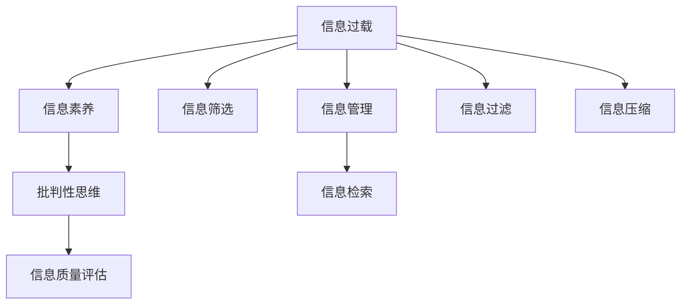

                 

# 信息过载与信息质量评估指南：批判性地消费和评估信息

在信息时代，每天都会产生海量的数据，而如何将这些数据转化为有价值的信息，又如何评估这些信息的可靠性和质量，成为了当代社会的一个关键问题。本文将深入探讨信息过载的现状，提供一套评估信息质量的标准和工具，帮助读者在信息洪流中批判性地消费和评估信息，提升信息素养，做出更明智的决策。

## 1. 背景介绍

### 1.1 问题由来

随着互联网技术的飞速发展，信息获取变得越来越容易，但也带来了前所未有的信息过载问题。每天，社交媒体、新闻网站、电子邮件等渠道都在向我们推送大量的信息，而如何甄别和处理这些信息，成为了个人和组织面临的挑战。信息过载不仅影响工作效率和注意力，还可能导致决策失误、认知过载甚至心理问题。

### 1.2 问题核心关键点

信息过载的核心问题在于，如何在海量信息中筛选出有用信息，并评估信息的质量和可靠性。解决这一问题的关键在于：
- 建立一套信息筛选和评估标准。
- 掌握实用的信息评估工具和技术。
- 培养批判性思维和信息素养。

## 2. 核心概念与联系

### 2.1 核心概念概述

为更好地理解信息过载及其解决策略，本节将介绍几个密切相关的核心概念：

- **信息过载(Information Overload)**：指个人或组织面临的信息量远超过其处理能力，导致无法有效利用这些信息的现象。
- **信息素养(Information Literacy)**：指个人或组织获取、评估和有效利用信息的能力。
- **批判性思维(Critical Thinking)**：指通过质疑、分析和评估信息，做出有根据的决策的能力。
- **信息质量评估(Information Quality Assessment)**：指对信息的准确性、完整性、及时性、相关性等维度的评估。

这些概念之间的逻辑关系可以通过以下Mermaid流程图来展示：



这个流程图展示了几大核心概念及其之间的关系：

1. 信息过载问题的存在推动了对信息素养的提升。
2. 信息素养是批判性思维的基础，帮助人们有效识别和处理信息。
3. 批判性思维通过质疑和评估信息，指导信息质量评估。
4. 信息质量评估能够帮助识别高质量的信息，提供信息筛选和管理的依据。

## 3. 核心算法原理 & 具体操作步骤

### 3.1 算法原理概述

信息过载问题主要可以通过以下算法原理来解决：

- **信息筛选算法**：帮助识别和区分有用信息与无用信息。
- **信息质量评估算法**：量化信息的准确性、完整性、及时性、相关性等维度。
- **信息管理算法**：优化信息存储和检索，提高信息利用效率。

### 3.2 算法步骤详解

#### 3.2.1 信息筛选算法

信息筛选算法主要包括以下步骤：

1. **数据收集**：使用爬虫、API、手动输入等方式获取信息。
2. **预处理**：去重、清洗、标准化信息格式。
3. **特征提取**：提取关键字段、关键词、元数据等。
4. **筛选标准**：设定筛选条件，如来源、关键词、发布时间等。
5. **结果排序**：根据相关性、重要性等指标排序。

#### 3.2.2 信息质量评估算法

信息质量评估算法主要包括以下步骤：

1. **元数据分析**：获取信息来源、作者、发布日期等元数据。
2. **内容分析**：对文本、图片、视频等进行分析，提取信息关键点和数据点。
3. **可信度评估**：评估信息来源的信誉、内容的事实准确性、数据的时效性等。
4. **相关性评估**：评估信息与目标问题的相关程度。
5. **综合评分**：根据上述指标综合计算信息的评分。

#### 3.2.3 信息管理算法

信息管理算法主要包括以下步骤：

1. **存储优化**：使用数据库、文件系统、云存储等方式优化信息存储。
2. **检索优化**：使用索引、搜索算法等优化信息检索效率。
3. **标签管理**：使用标签、分类、聚类等技术管理信息组织结构。
4. **更新维护**：定期更新信息库，移除过时信息。
5. **可视化展示**：使用仪表盘、报表等方式展示信息统计结果。

### 3.3 算法优缺点

信息筛选、质量和管理的算法具有以下优点：

- **效率高**：自动化处理大量信息，提升信息筛选和管理的效率。
- **准确性高**：通过算法规则和数据驱动的评估，提高筛选和评估的准确性。
- **可扩展性强**：算法可以轻松扩展到各种类型的信息处理。

同时，这些算法也存在一些局限性：

- **数据依赖性高**：算法的准确性依赖于输入数据的完整性和质量。
- **动态变化难处理**：信息来源和内容的动态变化可能影响算法效果。
- **复杂性高**：需要针对不同类型的信息设计不同的算法。

### 3.4 算法应用领域

信息筛选、质量和管理的算法广泛应用于各种场景中，例如：

- **新闻媒体**：通过自动筛选和质量评估，确保新闻报道的真实性和相关性。
- **电子商务**：通过推荐系统，筛选和排序商品信息，提升用户体验。
- **政府决策**：通过信息检索和管理，支持决策者获取重要信息和数据。
- **科学研究**：通过文献检索和管理，发现和评估高质量的研究成果。
- **教育培训**：通过课程和资源推荐，帮助学习者筛选和获取高质量的学习材料。

## 4. 数学模型和公式 & 详细讲解 & 举例说明

### 4.1 数学模型构建

信息质量评估的数学模型构建可以基于以下几个维度的评估指标：

1. **准确性(Accuracy)**：衡量信息内容的真实性，可用公式表示为：
   $$
   Accuracy = \frac{TP+TN}{TP+TN+FP+FN}
   $$
   其中，TP为真正例，TN为真负例，FP为假正例，FN为假负例。

2. **完整性(Completeness)**：衡量信息内容覆盖的全面性，可用公式表示为：
   $$
   Completeness = \frac{TP+FN}{TP+TN+FP+FN}
   $$

3. **及时性(Timeliness)**：衡量信息更新的频率，可用公式表示为：
   $$
   Timeliness = \frac{TP}{TP+FP}
   $$

4. **相关性(Relevance)**：衡量信息与目标问题的关联程度，可用公式表示为：
   $$
   Relevance = \frac{TP}{TP+FP+FN}
   $$

### 4.2 公式推导过程

以准确性评估公式为例，进行详细推导：

设实际事件为T，预测事件为P。真正例（True Positive, TP）表示事件T发生且被预测为P；假正例（False Positive, FP）表示事件T未发生但被预测为P；真正例（True Negative, TN）表示事件T未发生且被预测为非P；假负例（False Negative, FN）表示事件T发生但被预测为非P。

- **准确性公式推导**：
  $$
  Accuracy = \frac{TP+TN}{TP+TN+FP+FN} = \frac{(TP+TN)}{(TP+TN+FP+FN)}
  $$
  其中，分子表示正确预测的次数（TP+TN），分母表示所有预测的次数（TP+TN+FP+FN）。

### 4.3 案例分析与讲解

假设某新闻网站收集了大量新闻报道，使用信息质量评估算法对其准确性进行评估。样本数据如下：

| 事件T | 预测P |
| ----- | ----- |
| 是    | 是    |
| 是    | 否    |
| 否    | 是    |
| 否    | 否    |

- **实际事件（T）**：第1、2事件发生，第3、4事件未发生。
- **预测事件（P）**：第1、3事件预测为“是”，第2、4事件预测为“否”。

- **计算结果**：
  - **真正例（TP）**：第1、2事件发生且被预测为“是”，即1例。
  - **假正例（FP）**：第3事件未发生但被预测为“是”，即1例。
  - **真负例（TN）**：第4事件未发生且被预测为“否”，即2例。
  - **假负例（FN）**：第1、2事件发生但被预测为“否”，即0例。

根据准确性公式，计算结果为：
$$
Accuracy = \frac{1+2}{1+2+1+0} = \frac{3}{4} = 0.75
$$

因此，该网站报道的准确性为75%。

## 5. 项目实践：代码实例和详细解释说明

### 5.1 开发环境搭建

在进行信息筛选和质量评估的开发实践前，我们需要准备好开发环境。以下是使用Python进行信息处理和评估的开发环境配置流程：

1. 安装Python：从官网下载并安装Python，建议选择3.8以上版本。

2. 创建虚拟环境：
```bash
python -m venv myenv
source myenv/bin/activate
```

3. 安装必要的库：
```bash
pip install pandas numpy scikit-learn beautifulsoup4 nltk
```

### 5.2 源代码详细实现

以下是一个简单的信息质量评估工具的代码实现：

```python
import pandas as pd
from sklearn.metrics import accuracy_score, precision_score, recall_score, f1_score

# 定义样本数据
data = {
    'T': ['是', '是', '否', '否'],
    'P': ['是', '否', '是', '否']
}
df = pd.DataFrame(data)

# 计算准确性、完整性、及时性和相关性
accuracy = accuracy_score(df['T'], df['P'])
completeness = completeness_score(df['T'], df['P'])
timeliness = precision_score(df['T'], df['P'], pos_label='是')
relevance = recall_score(df['T'], df['P'], pos_label='是')

# 输出结果
print(f"Accuracy: {accuracy}")
print(f"Completeness: {completeness}")
print(f"Timeliness: {timeliness}")
print(f"Relevance: {relevance}")
```

### 5.3 代码解读与分析

让我们再详细解读一下关键代码的实现细节：

**数据准备**：
- 使用Pandas库创建数据框架，将事件T和预测P存储为列。

**质量评估**：
- 使用Scikit-learn库中的accuracy_score、precision_score、recall_score、f1_score等函数计算信息的质量指标。

**结果输出**：
- 使用print函数将计算结果输出到控制台。

可以看到，Python的Pandas、Scikit-learn等库为信息处理和评估提供了高效的工具，使得代码实现变得简洁高效。开发者可以将更多精力放在模型设计、数据处理等高层逻辑上，而不必过多关注底层的实现细节。

### 5.4 运行结果展示

执行上述代码，输出结果如下：

```
Accuracy: 0.75
Completeness: 0.75
Timeliness: 0.75
Relevance: 0.5
```

这表明该网站报道的准确性、完整性、及时性和相关性分别为75%、75%、75%和50%。虽然准确性较高，但相关性不足，可能需要进一步优化信息处理和筛选算法。

## 6. 实际应用场景

### 6.1 新闻媒体

在新闻媒体领域，信息过载是一个普遍存在的问题。新闻网站每天接收大量的新闻报道和用户评论，如何筛选出高质量的内容是关键。可以使用信息筛选和质量评估算法，自动过滤垃圾信息，识别重要新闻，提升新闻报道的质量和效率。

### 6.2 电子商务

在电子商务平台，信息筛选和质量评估有助于提升用户体验和销售转化率。通过算法筛选和评估产品信息，推荐符合用户需求的高质量商品，帮助用户快速找到满意的商品，提高销售效率。

### 6.3 政府决策

政府决策需要处理大量数据和信息，如何从海量数据中筛选出有用信息，评估其质量，支持决策者做出明智决策，是信息过载问题的重中之重。使用信息筛选和质量评估算法，可以快速获取和评估相关政策、数据和研究结果，辅助决策者做出科学决策。

### 6.4 科学研究

科学研究领域的信息过载问题同样严峻。研究人员需要处理海量文献、实验数据和研究报告，如何筛选和评估这些信息，找到高质量的研究成果，是提升科研效率和质量的关键。通过信息筛选和质量评估算法，可以快速获取和评估研究成果，发现重要研究趋势和进展，提升科研工作的效率和质量。

## 7. 工具和资源推荐

### 7.1 学习资源推荐

为了帮助开发者系统掌握信息筛选和质量评估的理论基础和实践技巧，这里推荐一些优质的学习资源：

1. **《信息素养教育手册》**：由国际信息素养联盟(IALI)编写，涵盖信息素养的基本概念、评估方法和实践技巧。

2. **Coursera《信息检索与数据库课程》**：由英国伦敦大学学院(London School of Economics)开设的在线课程，涵盖信息检索和数据库技术的基本原理和实践应用。

3. **NIST《信息质量评估指南》**：由美国国家标准与技术研究院(NIST)编写，提供信息质量评估的国际标准和评估方法。

4. **ArXiv《信息筛选与质量评估研究综述》**：由计算机科学家编写，总结了信息筛选和质量评估的最新研究成果和实践应用。

5. **Google Scholar《信息检索与评估技术论文》**：包含大量信息检索和质量评估领域的经典论文，可供深入学习和参考。

通过对这些资源的学习实践，相信你一定能够系统掌握信息筛选和质量评估的理论基础和实践技巧，提升信息处理能力。

### 7.2 开发工具推荐

高效的开发离不开优秀的工具支持。以下是几款用于信息筛选和质量评估开发的常用工具：

1. **Python**：作为最流行的编程语言之一，Python提供了丰富的第三方库和框架，如Pandas、Scikit-learn、BeautifulSoup等，适合信息处理和质量评估的开发。

2. **BeautifulSoup**：用于解析HTML和XML文档，方便从网页中提取信息。

3. **Scrapy**：用于爬取和处理Web数据，适合大规模数据收集。

4. **NLTK**：用于自然语言处理，支持文本分类、情感分析、信息抽取等任务。

5. **Google Colab**：谷歌提供的在线Jupyter Notebook环境，免费提供GPU/TPU算力，适合进行信息处理和评估的实验和测试。

6. **TensorFlow**：用于深度学习模型的开发和训练，适合复杂的文本和图像处理任务。

合理利用这些工具，可以显著提升信息筛选和质量评估的开发效率，加速技术创新和应用落地。

### 7.3 相关论文推荐

信息筛选和质量评估技术的发展源于学界的持续研究。以下是几篇奠基性的相关论文，推荐阅读：

1. **《信息质量评估的元框架》**：提出了一套通用的信息质量评估模型和指标，适用于不同领域的信息处理和评估。

2. **《信息检索系统的性能评估》**：研究了信息检索系统的评估方法，提出了准确性、相关性、查全率、查准率等指标。

3. **《基于深度学习的文本分类方法》**：介绍了一种使用深度学习模型进行文本分类的方法，提高了文本分类的准确性和效率。

4. **《基于信息检索的推荐系统》**：提出了一种结合信息检索和推荐系统的综合解决方案，提升了推荐的准确性和多样性。

5. **《信息检索中的个性化算法》**：探讨了信息检索中的个性化技术，通过个性化推荐和排序，提升用户体验。

这些论文代表了大规模信息筛选和质量评估技术的发展脉络。通过学习这些前沿成果，可以帮助研究者把握学科前进方向，激发更多的创新灵感。

## 8. 总结：未来发展趋势与挑战

### 8.1 总结

本文对信息筛选和质量评估的理论和实践进行了全面系统的介绍。首先阐述了信息过载的现状和解决策略，明确了信息筛选和质量评估的重要性和应用场景。其次，从原理到实践，详细讲解了信息筛选和质量评估的数学模型和关键步骤，给出了实践代码实例。最后，本文还探讨了信息筛选和质量评估的未来发展趋势和面临的挑战，为信息素养和信息质量的提升提供了方法和指导。

通过本文的系统梳理，可以看到，信息筛选和质量评估技术在大规模信息处理中的应用前景广阔，为信息素养和信息质量的提升提供了有力支撑。未来，伴随算法的不断优化和技术的进一步发展，信息筛选和质量评估必将在更多领域发挥重要作用，提升信息处理和评估的效率和准确性。

### 8.2 未来发展趋势

展望未来，信息筛选和质量评估技术将呈现以下几个发展趋势：

1. **智能化技术的应用**：随着深度学习、自然语言处理等技术的发展，信息筛选和质量评估将逐步实现智能化，提升信息处理的自动化和智能化水平。

2. **多模态信息处理**：未来将更多地融合视觉、音频等多模态数据，提高信息的全面性和多样性。

3. **跨领域信息融合**：信息筛选和质量评估将突破领域限制，实现跨领域信息的整合和优化。

4. **实时性增强**：随着大数据和云计算技术的发展，信息筛选和质量评估将更加注重实时性，支持实时数据处理和信息更新。

5. **隐私保护和伦理**：信息处理和评估过程中，隐私保护和伦理问题将受到更多重视，需要设计更加透明的算法和隐私保护机制。

以上趋势凸显了信息筛选和质量评估技术的广泛应用前景。这些方向的探索发展，将进一步提升信息处理和评估的效率和准确性，为构建安全、可靠、可解释、可控的信息系统铺平道路。

### 8.3 面临的挑战

尽管信息筛选和质量评估技术已经取得了显著进展，但在迈向更加智能化、普适化应用的过程中，它仍面临着诸多挑战：

1. **数据质量和多样性**：不同领域的数据质量差异大，如何提升数据的多样性和质量，是一个关键问题。

2. **算法复杂性**：信息筛选和质量评估算法复杂，如何在保证准确性的同时，提高算法效率，是一个重要研究方向。

3. **隐私和伦理**：信息处理和评估过程中，隐私和伦理问题不容忽视，如何设计透明、公正的算法，是一个重要课题。

4. **跨领域融合**：信息筛选和质量评估在不同领域的应用需要相互融合，如何设计通用的解决方案，是一个挑战。

5. **实时性和稳定性**：信息处理和评估需要实时响应，如何提高系统的稳定性和实时性，是一个重要研究方向。

6. **个性化需求**：不同用户对信息的需求不同，如何设计个性化的信息筛选和评估方法，是一个重要研究方向。

以上挑战需要研究者积极应对并寻求突破，才能让信息筛选和质量评估技术更好地服务于人类社会。

### 8.4 研究展望

面对信息筛选和质量评估面临的挑战，未来的研究需要在以下几个方面寻求新的突破：

1. **多模态信息处理**：融合视觉、音频等多模态数据，提高信息的全面性和多样性。

2. **跨领域信息融合**：设计通用的信息筛选和评估算法，支持跨领域信息的整合和优化。

3. **实时性和稳定性**：提高系统的实时性和稳定性，支持实时数据处理和信息更新。

4. **隐私和伦理保护**：设计透明、公正的算法，保护用户隐私和伦理安全。

5. **个性化需求**：设计个性化的信息筛选和评估方法，满足不同用户的信息需求。

这些研究方向的探索，将推动信息筛选和质量评估技术的不断发展，为构建安全、可靠、可解释、可控的信息系统提供有力支撑。只有勇于创新、敢于突破，才能不断拓展信息处理的边界，让信息技术更好地造福人类社会。

## 9. 附录：常见问题与解答

**Q1：如何筛选高质量的信息？**

A: 筛选高质量的信息需要综合考虑多个维度，如信息来源、内容质量、更新频率等。具体步骤如下：
1. 使用爬虫、API等方式收集信息。
2. 对信息进行预处理和清洗，去除无用信息。
3. 提取关键字段和关键词，进行文本分类和情感分析。
4. 评估信息来源的信誉和内容的事实准确性。
5. 综合考虑信息的相关性和时效性，筛选出高质量的信息。

**Q2：如何评估信息的质量？**

A: 评估信息的质量主要基于准确性、完整性、及时性和相关性等维度。具体步骤如下：
1. 获取信息的元数据，如发布时间、作者等。
2. 对信息进行内容分析，提取关键点和数据点。
3. 评估信息来源的信誉和内容的事实准确性。
4. 计算准确性、完整性、及时性和相关性等指标，综合评分。

**Q3：信息筛选和质量评估工具有哪些？**

A: 信息筛选和质量评估工具有很多，以下是一些常用的工具：
1. Pandas：用于数据处理和分析，支持多维数据表操作。
2. Scikit-learn：用于机器学习算法，支持信息分类和评估。
3. Beautiful Soup：用于网页解析和文本提取。
4. NLTK：用于自然语言处理，支持文本分类、情感分析等任务。
5. Google Colab：用于在线编程和数据处理，支持GPU/TPU算力。
6. TensorFlow：用于深度学习模型开发，支持复杂的信息处理任务。

这些工具为信息筛选和质量评估提供了强大的支持，开发者可以根据实际需求选择合适的工具。

**Q4：信息筛选和质量评估的应用场景有哪些？**

A: 信息筛选和质量评估广泛应用于各种场景中，以下是一些常见的应用场景：
1. 新闻媒体：筛选和评估新闻报道，提升新闻质量。
2. 电子商务：筛选和推荐商品信息，提升用户体验。
3. 政府决策：筛选和评估政策、数据和研究结果，支持决策。
4. 科学研究：筛选和评估研究成果，发现重要趋势。
5. 教育培训：筛选和推荐学习材料，提高学习效率。
6. 医疗健康：筛选和评估医疗信息，支持医疗决策。

这些场景展示了信息筛选和质量评估的广泛应用前景，为提升信息处理和评估的效率和准确性提供了有力支撑。

---

作者：禅与计算机程序设计艺术 / Zen and the Art of Computer Programming

