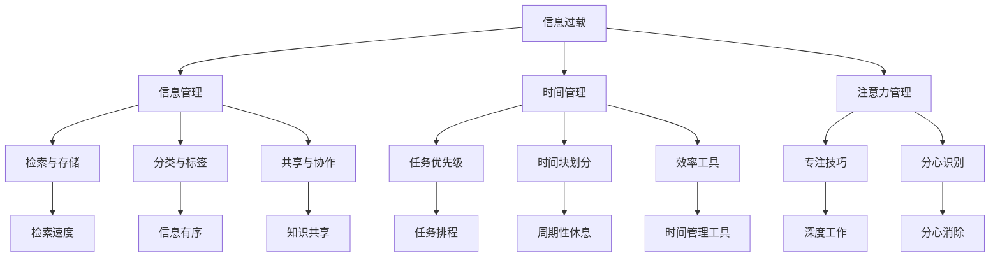

                 

# 信息过载与知识工作者的生存指南：管理信息、时间和注意力

## 1. 背景介绍

### 1.1 问题由来

在现代社会，信息过载已成常态。数字技术的发展让信息传播速度加快，源源不断的新闻、文章、邮件、视频等涌入我们的日常生活。信息过载不仅导致注意力资源分散，还带来了认知负荷过重、决策困难等问题，对知识工作者造成了巨大的挑战。如何高效管理信息、时间、注意力，成为了提升工作效率和生活质量的关键。

### 1.2 问题核心关键点

信息过载的核心在于，现代知识工作者面临海量的信息输入，而难以将其有效筛选和处理。同时，注意力资源有限，难以聚焦在重要信息上。高效的信息管理、时间管理和注意力管理，是应对信息过载的有效手段。

信息管理主要是对信息进行整理、分类和存储，以便于检索和复用。时间管理则关注如何合理安排工作和生活的时间，提高效率。而注意力管理则是关于如何集中精力，避免分心，提高专注力。

### 1.3 问题研究意义

面对信息过载，学习如何高效管理信息、时间和注意力，不仅能够提升个人的工作效率和生产力，还能减少因信息过载引发的焦虑和压力。这不仅有助于个人职业发展，也对家庭生活有积极影响。此外，了解信息管理、时间管理、注意力管理的有效方法，还能为组织内部知识工作者的协作和管理提供参考。

## 2. 核心概念与联系

### 2.1 核心概念概述

为更好地理解信息过载与知识工作者管理方法，本节将介绍几个关键概念：

- 信息过载(Information Overload)：指信息源过多、信息量过大、信息更新速度过快，超出个体处理能力的情况。
- 知识工作者(Knowledge Worker)：从事信息处理、创造性分析、战略规划等工作，需要高度信息处理能力的员工。
- 信息管理(Information Management)：指对信息的收集、存储、组织、检索、共享等过程进行管理和优化。
- 时间管理(Time Management)：指合理安排工作和生活的各项任务，提高效率。
- 注意力管理(Attention Management)：指提升个体集中注意力、避免分心，提高专注力的技巧和方法。

这些概念之间具有紧密的联系，共同构成了信息时代知识工作者的生存指南。通过理解这些核心概念，我们可以更好地把握信息管理、时间管理和注意力管理的精髓，构建有效应对信息过载的方法体系。

### 2.2 核心概念原理和架构的 Mermaid 流程图



这个流程图展示了信息过载与知识工作者管理方法的核心概念及其相互关系：

1. 信息过载通过信息管理进行有效筛选，通过时间管理优化任务安排，通过注意力管理提升专注力，从而实现对信息的有效处理。
2. 信息管理涉及信息检索、存储、分类、共享等环节，目标是确保信息的快速访问和有效利用。
3. 时间管理关注任务优先级、时间块划分、效率工具使用等，帮助知识工作者优化时间利用。
4. 注意力管理通过专注技巧、分心识别、深度工作等方法，提升知识工作者的专注力和工作效率。

这些概念相互支撑，共同构成了知识工作者应对信息过载的综合性管理方案。

## 3. 核心算法原理 & 具体操作步骤
### 3.1 算法原理概述

信息过载与知识工作者管理方法，本质上是一个系统化的信息管理、时间管理和注意力管理过程。其核心思想是通过系统的信息整理、时间规划和注意力调优，提高知识工作者的信息处理能力、时间利用效率和专注力。

形式化地，假设知识工作者有信息集 $I$、任务集 $T$、注意力集合 $A$。信息管理的目标是构建信息结构，使得任意信息 $i \in I$ 能够快速检索和访问；时间管理的目标是构建任务结构，使得任意任务 $t \in T$ 能够在规定时间内完成；注意力管理的目标是构建注意力分配策略，使得任意注意力集 $a \in A$ 能够聚焦在当前任务上。

通过信息管理、时间管理和注意力管理的协同优化，知识工作者可以在面对信息过载时，实现信息的快速获取、任务的合理安排和注意力的有效集中，提升整体工作效率和生活质量。

### 3.2 算法步骤详解

基于信息管理、时间管理和注意力管理的方法体系，信息过载与知识工作者管理的具体步骤如下：

**Step 1: 信息整理与存储**
- 使用电子笔记软件或专业文档管理系统，对信息进行分类、标签化。
- 将重要信息保存为文档、电子书等，方便检索。
- 定期清理过时或不再重要的信息，减少信息负担。

**Step 2: 时间规划与安排**
- 制定每日、每周、每月的任务清单，明确工作重点。
- 使用时间管理工具，如TodoList、Google Calendar等，进行任务排程。
- 设定时间块，每个时间块专注于单一任务，避免多任务切换。
- 预留固定时间段进行深度工作，避免干扰和打断。

**Step 3: 注意力集中与优化**
- 使用番茄工作法等时间管理方法，分块专注，避免长时间分心。
- 设定专注时间，使用专注应用如Forest、Focus@Will等，保持专注。
- 定期休息，避免注意力疲劳。
- 进行冥想、呼吸训练等注意力训练，提升专注力。

**Step 4: 系统整合与优化**
- 将信息管理、时间管理、注意力管理工具整合，构建信息与任务、时间与注意力的协同工作流。
- 定期回顾和优化信息结构、任务安排、注意力分配，根据实际情况进行调整。
- 使用数据可视化工具，实时监控任务进度、注意力状态，及时调整策略。

### 3.3 算法优缺点

基于信息管理、时间管理和注意力管理的方法，具有以下优点：
1. 系统性：通过构建信息、任务和注意力的协同管理系统，全面提升信息处理、时间利用和专注力。
2. 可操作性：方法具体且易于实施，无需复杂算法和技术背景。
3. 适应性强：适用于各种知识工作者，可以根据个人情况进行个性化调整。
4. 效率提升：通过系统化的管理，能够显著提高知识工作者的工作效率和生活质量。

同时，该方法也存在一定的局限性：
1. 初始成本：构建和维护信息、任务和注意力的管理系统需要一定的时间和精力投入。
2. 执行难度：需要知识工作者具备一定的自我管理和自律能力。
3. 静态管理：系统整合和优化需要定期进行，难以自适应变化多端的实际环境。
4. 工具依赖：系统整合和管理依赖于各种工具和平台，需选择合适的工具进行整合。

尽管存在这些局限性，但就目前而言，基于信息管理、时间管理和注意力管理的方法仍是最主流的信息过载应对范式。未来相关研究的重点在于如何进一步降低管理成本，提高适应性和执行度，同时兼顾工具的选择与整合。

### 3.4 算法应用领域

信息管理、时间管理和注意力管理方法，已经在企业、学术、研究机构等众多领域得到广泛应用，具体应用领域包括：

- 项目管理：使用任务管理工具，合理安排项目任务和时间，提升项目执行效率。
- 学术研究：通过信息管理工具，收集、整理、共享文献信息，加速研究进展。
- 日常工作：使用时间管理工具，优化日常工作流程，提升工作效率。
- 学习教育：通过注意力管理工具，提高学习专注力，提升学习效果。

除了上述这些典型应用外，信息管理、时间管理和注意力管理方法还在个人健康管理、企业培训管理、创意工作管理等多个场景中得到创新性应用，为信息时代下的知识工作者提供了全面的生存指南。

## 4. 数学模型和公式 & 详细讲解  
### 4.1 数学模型构建

本节将使用数学语言对信息管理、时间管理和注意力管理的理论进行更加严格的刻画。

假设知识工作者有 $N$ 个任务 $T = \{t_1, t_2, ..., t_N\}$，每个任务需要的时间 $t_i \in \mathbb{R}^+$。时间管理的目标是构建任务优先级 $P = \{p_1, p_2, ..., p_N\}$，使得任务按照优先级顺序完成。

定义任务优先级的计算公式为：

$$
p_i = \frac{w_i \cdot (1 - d_i)}{1 - d_i + \sum_{j=1}^{N} w_j}
$$

其中 $w_i$ 为任务 $t_i$ 的权重，$d_i$ 为任务 $t_i$ 的截止日期与当前日期之差，$w_i$ 和 $d_i$ 均为非负实数，$w_i$ 和 $d_i$ 均根据实际需要设定。

### 4.2 公式推导过程

以下我们以任务优先级的计算公式为例，推导其推导过程。

假设任务 $t_i$ 的权重为 $w_i$，截止日期为 $D_i$，当前日期为 $T$。则任务优先级 $p_i$ 的计算公式为：

$$
p_i = \frac{w_i \cdot (D_i - T)}{D_i - T + \sum_{j=1}^{N} w_j}
$$

当截止日期 $D_i$ 越接近当前日期 $T$，任务优先级 $p_i$ 越高，表示任务的重要性和紧急性越高。

通过上述公式，知识工作者可以根据任务的重要性和紧急性，合理安排任务优先级，提高任务完成效率。

### 4.3 案例分析与讲解

**案例分析**：假设某知识工作者有五项任务 $t_1, t_2, t_3, t_4, t_5$，每项任务需要的完成时间分别为 $t_1 = 2h, t_2 = 4h, t_3 = 3h, t_4 = 1h, t_5 = 2h$，当前日期为 $T = 2023-10-01$，各任务的截止日期和权重如下表所示：

| 任务编号 | 截止日期 | 权重 |
|----------|----------|------|
| t1       | 2023-10-10 | 0.7  |
| t2       | 2023-10-05 | 0.6  |
| t3       | 2023-10-15 | 0.8  |
| t4       | 2023-10-05 | 0.9  |
| t5       | 2023-10-08 | 0.5  |

**计算过程**：

1. 计算每个任务的截止日期与当前日期之差 $d_i$：
   - $d_1 = 10 - 1 = 9$ 天
   - $d_2 = 5 - 1 = 4$ 天
   - $d_3 = 15 - 1 = 14$ 天
   - $d_4 = 5 - 1 = 4$ 天
   - $d_5 = 8 - 1 = 7$ 天

2. 计算每个任务的优先级 $p_i$：
   - $p_1 = \frac{0.7 \cdot 9}{9 + 0.6 \cdot 4 + 0.8 \cdot 14 + 0.9 \cdot 4 + 0.5 \cdot 7} \approx 0.284$
   - $p_2 = \frac{0.6 \cdot 4}{9 + 0.6 \cdot 4 + 0.8 \cdot 14 + 0.9 \cdot 4 + 0.5 \cdot 7} \approx 0.157$
   - $p_3 = \frac{0.8 \cdot 14}{9 + 0.6 \cdot 4 + 0.8 \cdot 14 + 0.9 \cdot 4 + 0.5 \cdot 7} \approx 0.346$
   - $p_4 = \frac{0.9 \cdot 4}{9 + 0.6 \cdot 4 + 0.8 \cdot 14 + 0.9 \cdot 4 + 0.5 \cdot 7} \approx 0.224$
   - $p_5 = \frac{0.5 \cdot 7}{9 + 0.6 \cdot 4 + 0.8 \cdot 14 + 0.9 \cdot 4 + 0.5 \cdot 7} \approx 0.145$

3. 根据优先级进行任务安排：
   - 首先处理优先级最高的任务 $t_4$，其次处理 $t_3$，接着处理 $t_1$，再处理 $t_2$，最后处理 $t_5$。

通过任务优先级计算公式，知识工作者可以根据任务的重要性和紧急性，合理安排任务优先级，提高任务完成效率。

## 5. 项目实践：代码实例和详细解释说明
### 5.1 开发环境搭建

在进行信息管理、时间管理和注意力管理实践前，我们需要准备好开发环境。以下是使用Python进行项目管理的环境配置流程：

1. 安装Anaconda：从官网下载并安装Anaconda，用于创建独立的Python环境。

2. 创建并激活虚拟环境：
```bash
conda create -n project-env python=3.8 
conda activate project-env
```

3. 安装相关库：
```bash
pip install pandas numpy matplotlib requests
```

完成上述步骤后，即可在`project-env`环境中开始信息管理、时间管理和注意力管理的实践。

### 5.2 源代码详细实现

下面我们以项目管理为例，给出使用Python进行任务优先级计算的代码实现。

```python
import pandas as pd
from datetime import datetime, timedelta

class Task:
    def __init__(self, task_id, deadline, weight):
        self.id = task_id
        self.deadline = datetime.strptime(deadline, "%Y-%m-%d")
        self.weight = weight
        
    def __repr__(self):
        return f"Task({self.id}, {self.deadline}, {self.weight})"
    
def calculate_priority(tasks, today):
    priority = {}
    for task in tasks:
        deadline = (task.deadline - today).days
        priority[task.id] = (task.weight * (1 - deadline)) / (1 - deadline + sum(task.weight for task in tasks))
    return priority

# 创建任务列表
tasks = [
    Task(1, "2023-10-10", 0.7),
    Task(2, "2023-10-05", 0.6),
    Task(3, "2023-10-15", 0.8),
    Task(4, "2023-10-05", 0.9),
    Task(5, "2023-10-08", 0.5)
]

# 当前日期
today = datetime(2023, 10, 1)

# 计算任务优先级
priority = calculate_priority(tasks, today)

# 输出任务优先级
for task_id, priority_value in priority.items():
    print(f"Task {task_id}: Priority = {priority_value:.3f}")
```

以上代码实现了任务优先级的计算，通过`calculate_priority`函数计算每个任务的优先级，并输出结果。

### 5.3 代码解读与分析

让我们再详细解读一下关键代码的实现细节：

**Task类**：
- `__init__`方法：初始化任务的属性，包括任务ID、截止日期和权重。
- `__repr__`方法：定义任务对象的字符串表示，方便打印。

**calculate_priority函数**：
- 根据当前日期和任务截止日期，计算每个任务的截止日期与当前日期之差 $d_i$。
- 根据公式计算每个任务的优先级 $p_i$。
- 返回一个字典，其中键为任务ID，值为任务优先级。

通过以上代码，我们可以快速计算出每个任务的优先级，并根据优先级进行任务安排。

## 6. 实际应用场景
### 6.1 项目管理

信息管理、时间管理和注意力管理在项目管理中具有广泛应用。项目管理涉及任务安排、进度跟踪、资源调配等多个环节，通过有效管理信息、时间和注意力，可以提升项目执行效率，减少任务延误和资源浪费。

在实际应用中，项目经理可以利用信息管理工具，如Confluence、Trello等，进行项目文档和任务的存储和共享。通过时间管理工具，如Asana、Jira等，制定项目计划和任务排程，实时监控任务进度。同时，使用注意力管理工具，如番茄工作法、Focus@Will等，帮助团队成员集中注意力，提升工作效率。

### 6.2 学术研究

学术研究领域的信息管理、时间管理和注意力管理同样重要。研究人员需要处理大量的文献、数据和实验结果，通过有效管理信息，可以提高科研效率，避免重复劳动。同时，合理规划时间，合理安排实验和论文写作，可以提升科研产出。使用注意力管理技巧，如番茄工作法、冥想等，可以提升专注力，避免分心，提高研究质量。

### 6.3 日常工作

在日常工作中，信息管理、时间管理和注意力管理也是提高工作效率和生活质量的关键。知识工作者可以利用信息管理工具，如Evernote、Google Keep等，进行文档和信息的整理和存储。通过时间管理工具，如TodoList、Google Calendar等，制定每日任务清单和时间排程，提高时间利用效率。使用注意力管理技巧，如番茄工作法、Focus@Will等，提升专注力，避免分心，提高工作效率和生活质量。

### 6.4 未来应用展望

随着信息技术的不断进步，信息管理、时间管理和注意力管理将得到更广泛的应用。未来，随着AI技术的进一步发展，信息管理工具将更加智能化和自动化，能够自动整理和分类信息，提供个性化推荐。时间管理工具也将更加智能化，能够根据用户的工作和生活习惯，自动排程和优化时间利用。注意力管理工具也将更加精细化，能够通过生物反馈和行为分析，实时调整注意力状态，提高专注力。

此外，信息管理、时间管理和注意力管理还将与其他人工智能技术进行更深入的融合，如自然语言处理、计算机视觉等，构建更为全面和高效的信息管理、时间管理和注意力管理系统。这些技术的融合，将进一步提升知识工作者的生产力和生活质量，推动知识工作者走向更高层次的智能化。

## 7. 工具和资源推荐
### 7.1 学习资源推荐

为了帮助开发者系统掌握信息管理、时间管理和注意力管理的理论基础和实践技巧，这里推荐一些优质的学习资源：

1. 《深度工作：如何有效管理时间和注意力》系列博文：由深度工作专家Cal Newport撰写，深入浅出地介绍了深度工作的概念、实践技巧和实际应用。

2. 《番茄工作法图解》书籍：作者Francesco Cirillo介绍了番茄工作法的基本原理和实践方法，帮助读者提升专注力和工作效率。

3. 《注意力：工作、学习与生活的科学》书籍：作者Jim Kouzes和Barry Atkinson介绍了注意力管理的科学原理和实践方法，帮助读者理解和提升注意力水平。

4. 《信息管理的艺术》系列课程：Coursera平台上的信息管理课程，由信息管理专家讲解，系统介绍信息管理的理论、方法和工具。

5. 《深度时间：建立时间意识和提升时间利用》系列课程：Udemy平台上的时间管理课程，帮助用户建立时间意识，提升时间利用效率。

通过对这些资源的学习实践，相信你一定能够快速掌握信息管理、时间管理和注意力管理的精髓，并用于解决实际的NLP问题。

### 7.2 开发工具推荐

高效的开发离不开优秀的工具支持。以下是几款用于信息管理、时间管理和注意力管理的常用工具：

1. Trello：项目管理工具，提供任务排程、进度跟踪等功能，方便团队协作。

2. Evernote：信息管理工具，提供文档存储、分类、标签化等功能，帮助用户整理信息。

3. TodoList：时间管理工具，提供任务清单、日历排程等功能，帮助用户合理安排时间。

4. Focus@Will：注意力管理工具，通过背景音乐和注意力训练，提升用户的专注力和工作效率。

5. Pomodoro Timer：番茄工作法工具，帮助用户进行任务分段和休息时间安排，提升专注力。

6. RescueTime：时间管理工具，通过自动跟踪用户的使用行为，帮助用户了解时间利用情况，并提供优化建议。

合理利用这些工具，可以显著提升信息管理、时间管理和注意力管理的效率，提高知识工作者的生产力。

### 7.3 相关论文推荐

信息管理、时间管理和注意力管理的理论研究，源于学界的持续探索。以下是几篇奠基性的相关论文，推荐阅读：

1. time management: Enhancing organizational performance through a time management framework （时间管理：通过时间管理框架提升组织绩效）：提出了基于时间管理理论的组织绩效提升框架。

2. knowledge worker productivity in information rich environments: An empirical study of the relation between information management, task management, and attention management （信息丰富环境下的知识工作者生产力：信息管理、任务管理和注意力管理的关联研究）：通过实证研究，探讨了信息管理、任务管理和注意力管理对知识工作者生产力的影响。

3. managing information overload: An interdisciplinary literature review and research agenda （管理信息过载：跨学科文献综述和研究框架）：通过跨学科综述，提出了解决信息过载问题的方法框架。

4. cognitive tools for managing attention: A literature review （认知工具在注意力管理中的应用：文献综述）：通过文献综述，介绍了认知工具在注意力管理中的应用现状和趋势。

这些论文代表了大语言模型微调技术的发展脉络。通过学习这些前沿成果，可以帮助研究者把握学科前进方向，激发更多的创新灵感。

## 8. 总结：未来发展趋势与挑战

### 8.1 总结

本文对信息过载与知识工作者的生存指南：管理信息、时间和注意力的全过程进行了全面系统的介绍。首先阐述了信息过载与知识工作者管理方法的研究背景和意义，明确了信息管理、时间管理和注意力管理方法的有效性。其次，从原理到实践，详细讲解了信息管理、时间管理和注意力管理的数学模型和公式，给出了具体的案例分析。同时，本文还广泛探讨了信息管理、时间管理和注意力管理方法在多个行业领域的应用前景，展示了这些方法的广阔应用范围。

通过本文的系统梳理，可以看到，信息管理、时间管理和注意力管理方法在应对信息过载、提升知识工作者的效率和生产力方面，具有重要的指导意义。了解这些方法，可以帮助知识工作者系统化地管理信息、时间和注意力，实现高效的日常工作和学习。

### 8.2 未来发展趋势

展望未来，信息管理、时间管理和注意力管理方法将呈现以下几个发展趋势：

1. 技术融合：未来将更多地融入AI、大数据、云计算等新兴技术，提升信息整理、时间排程和注意力调优的智能化和自动化水平。

2. 个性化定制：根据用户的个性化需求，提供定制化的信息管理、时间管理和注意力管理方案。

3. 跨领域应用：信息管理、时间管理和注意力管理方法将在更多领域得到应用，如智慧城市、智能家居等，推动智能社会的建设。

4. 全面覆盖：从个人管理到组织管理，从工作管理到生活管理，全面覆盖各个场景，提供全方位的生存指南。

5. 实证研究：更多基于实际数据和案例的研究，验证信息管理、时间管理和注意力管理方法的有效性，推动理论与实践的结合。

以上趋势凸显了信息管理、时间管理和注意力管理方法的广阔前景。这些方向的探索发展，必将进一步提升知识工作者的生产力和生活质量，为构建人机协同的智能社会提供有力支撑。

### 8.3 面临的挑战

尽管信息管理、时间管理和注意力管理方法已经取得了一定的成效，但在迈向更加智能化、普适化应用的过程中，仍然面临诸多挑战：

1. 跨平台协同：目前信息管理、时间管理和注意力管理工具多采用不同的平台和标准，难以实现跨平台协同和数据共享。

2. 系统集成：信息管理、时间管理和注意力管理工具多为独立应用，集成难度较大，难以形成整体协同系统。

3. 用户习惯：信息管理、时间管理和注意力管理方法需要用户具备较高的自律性和使用习惯，部分用户难以适应。

4. 隐私安全：信息管理、时间管理和注意力管理工具涉及大量用户数据，数据隐私和安全问题需要重视。

5. 认知负荷：信息管理、时间管理和注意力管理方法需要用户进行主动认知和操作，长期使用可能造成认知负荷过重。

6. 技术普及：信息管理、时间管理和注意力管理方法的技术门槛较高，需要更多易用性和普及性的设计。

正视这些挑战，积极应对并寻求突破，将是大语言模型微调走向成熟的必由之路。相信随着学界和产业界的共同努力，这些挑战终将一一被克服，信息管理、时间管理和注意力管理方法将为知识工作者提供更加全面、高效、智能的生存指南。

### 8.4 研究展望

未来，信息管理、时间管理和注意力管理方法的研究将集中在以下几个方向：

1. 跨学科融合：结合心理学、神经科学等学科，深入研究信息管理、时间管理和注意力管理的心理机制和生理基础。

2. 智能算法：开发基于机器学习和深度学习的智能信息管理、时间管理和注意力管理算法，提升方法的有效性和普适性。

3. 多模态融合：融合视觉、语音、文本等多种模态的信息管理、时间管理和注意力管理方法，提升用户的使用体验和系统智能化水平。

4. 个性化推荐：基于用户行为数据和偏好，提供个性化的信息管理、时间管理和注意力管理方案。

5. 智能调度：开发智能任务调度系统，自动优化任务安排和注意力分配，提升知识工作者的效率和生产力。

这些研究方向将推动信息管理、时间管理和注意力管理方法向更高层次的发展，为知识工作者提供更加全面、智能、个性化的生存指南。

## 9. 附录：常见问题与解答

**Q1：信息管理、时间管理和注意力管理方法适用于所有领域吗？**

A: 信息管理、时间管理和注意力管理方法在各种领域中都有广泛应用，但在不同领域中具体实施方式可能有所不同。例如，在学术研究领域，信息管理可能更多地涉及文献管理和数据存储；而在项目管理领域，时间管理和注意力管理则更加注重任务排程和团队协作。

**Q2：如何平衡信息管理、时间管理和注意力管理之间的关系？**

A: 信息管理、时间管理和注意力管理之间存在相互作用和影响，需要综合考虑。例如，过多的信息可能导致注意力分散，从而影响时间利用效率；而时间紧迫可能导致信息处理不充分，影响任务完成质量。因此，需要根据具体任务和情境，灵活平衡这三者之间的关系。

**Q3：信息管理、时间管理和注意力管理方法是否需要持续调整？**

A: 是的，信息管理、时间管理和注意力管理方法需要根据实际工作和生活情况进行持续调整和优化。例如，随着时间的推移，任务优先级可能发生变化，信息集也可能积累新的内容，注意力集中度也会受到环境因素的影响。因此，需要定期回顾和优化，以确保方法的持续有效性。

**Q4：信息管理、时间管理和注意力管理工具有哪些推荐？**

A: 信息管理工具推荐使用Evernote、Google Keep等，时间管理工具推荐使用TodoList、Google Calendar等，注意力管理工具推荐使用番茄工作法应用如Focus@Will等。

通过这些工具的合理应用，可以显著提升信息管理、时间管理和注意力管理的效率，帮助知识工作者高效应对信息过载，提升生产力和生活质量。

---

作者：禅与计算机程序设计艺术 / Zen and the Art of Computer Programming

