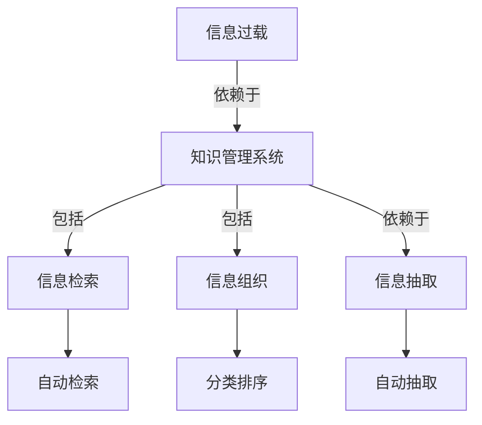

                 

# 信息过载与知识管理系统实施指南：有效组织和检索信息

在信息时代，大量的信息源充斥着我们的日常生活和工作。无论是来自网络、社交媒体、文献数据库还是企业内部的知识库，如何有效组织、管理和检索这些信息，成为了一个重大挑战。本文将深入探讨信息过载的成因、知识管理系统的核心概念与联系，以及如何通过核心算法和具体操作步骤，构建一套有效的信息组织和检索系统。通过深入的数学模型和公式讲解，并结合实际项目实践，本文将为你提供全面的实施指南，帮助你在实际应用中取得成功。

## 1. 背景介绍

### 1.1 问题由来

随着信息技术的迅猛发展，互联网和数字媒体的出现，人类的信息消费和生成方式发生了根本变化。信息的数量、质量和形式都得到了前所未有的提升。然而，海量的信息也带来了信息过载（Information Overload）的问题。

信息过载指的是信息输入的速度和数量远远超出了人们的接收、处理和记忆能力，导致人们难以有效处理这些信息，甚至产生心理压力和认知疲劳。据研究，信息过载已经成为企业员工、学生、科研工作者面临的主要挑战之一。信息过载不仅影响人们的工作效率和决策质量，还会对身心健康造成潜在威胁。

### 1.2 问题核心关键点

为了解决信息过载问题，企业、学校和科研机构等组织纷纷引入知识管理系统（Knowledge Management System, KMS）。知识管理系统是一种集成了软件工具和信息技术的管理手段，旨在整合、存储、检索和管理组织的知识资产，以支持个人和团队的高效工作。知识管理系统通过自动化和智能化的信息处理，帮助人们快速获取所需信息，降低信息过载带来的负面影响。

## 2. 核心概念与联系

### 2.1 核心概念概述

为了理解信息过载和知识管理系统的实施，我们需要首先掌握以下几个核心概念：

- **信息过载（Information Overload）**：指信息输入的速度和数量远远超过人们处理和吸收信息的能力，导致人们难以有效地组织和检索信息。
- **知识管理系统（Knowledge Management System, KMS）**：一种集成了软件工具和信息技术的管理手段，用于整合、存储、检索和管理组织的知识资产。
- **信息检索（Information Retrieval, IR）**：从信息集合中找出与用户查询最相关的信息的过程。
- **信息组织（Information Organization）**：对信息进行分类、排序、索引和结构化，以便于检索和管理。
- **信息抽取（Information Extraction）**：从文本或数据中自动提取结构化信息的过程。

这些概念之间存在紧密的联系。信息过载问题需要通过知识管理系统来解决，而知识管理系统需要依赖信息检索和信息组织技术来实现。信息抽取技术则可以帮助系统自动理解并提取信息，进一步提高信息检索的精度。

### 2.2 核心概念原理和架构的 Mermaid 流程图

以下是一个简化的Mermaid流程图，展示了信息过载、知识管理系统、信息检索、信息组织和信息抽取之间的联系：



## 3. 核心算法原理 & 具体操作步骤

### 3.1 算法原理概述

构建知识管理系统并有效组织和检索信息，主要依赖以下几类算法和技术：

1. **搜索引擎算法**：用于实现高效的信息检索，支持关键词检索、语义检索等。
2. **分类和聚类算法**：用于信息组织，将信息自动分类和聚类，建立有效的索引体系。
3. **信息抽取算法**：用于从文本和数据中自动抽取结构化信息，提高信息检索的精度。
4. **自然语言处理（NLP）技术**：用于理解和处理自然语言，支持信息检索、信息抽取、信息组织等。

这些算法和技术共同构成了知识管理系统的核心架构，通过协同工作，实现了信息的自动化处理和智能检索。

### 3.2 算法步骤详解

构建知识管理系统并有效组织和检索信息的详细步骤包括：

1. **需求分析**：明确组织的具体需求，如需要存储哪些类型的信息、需要哪些功能、信息检索的频率和精度等。
2. **系统设计**：根据需求，设计系统的架构和组件，包括搜索引擎、分类器、信息抽取器等。
3. **数据收集和预处理**：收集组织内部和外部信息源，进行清洗、去重和标注等预处理操作。
4. **模型训练和优化**：使用机器学习算法训练信息检索、分类和抽取模型，并根据效果进行优化。
5. **系统部署和测试**：将训练好的模型部署到生产环境，进行系统测试和优化。
6. **维护和升级**：定期更新信息源和模型，提升系统的性能和精度。

### 3.3 算法优缺点

知识管理系统的优点包括：

- **自动化和智能化**：通过自动化和智能化的信息处理，大大提高了信息检索和组织效率。
- **支持多用户协作**：多个用户可以共享和贡献信息，形成一个协作的知识社区。
- **提高信息利用率**：通过有效的信息组织，提高了信息的可访问性和利用率。

同时，知识管理系统也存在一些缺点：

- **系统复杂性**：知识管理系统的搭建和维护需要一定的技术储备和资源投入。
- **数据隐私和安全**：如何保护数据隐私和安全，是知识管理系统设计中需要重点考虑的问题。
- **技术依赖**：对技术实现和运维人员依赖较大，需要不断投入人力和技术支持。

### 3.4 算法应用领域

知识管理系统在多个领域都有广泛的应用，例如：

- **企业知识管理**：帮助企业组织和管理内部知识资产，支持员工的协作和创新。
- **科研知识管理**：支持科研团队的文献检索、数据管理和合作研究。
- **教育知识管理**：帮助教育机构组织和管理教学资源，促进知识共享和学习。
- **政府知识管理**：用于政府机构的文档管理、信息检索和政策制定。

## 4. 数学模型和公式 & 详细讲解 & 举例说明

### 4.1 数学模型构建

知识管理系统的数学模型通常包括以下几个部分：

- **信息检索模型**：用于计算信息与查询的相关性，常见的模型有TF-IDF、BM25、LDA等。
- **分类模型**：用于对信息进行分类和聚类，常用的算法有朴素贝叶斯、SVM、K-means等。
- **信息抽取模型**：用于从文本中抽取结构化信息，常用的模型有依存句法分析、命名实体识别等。

### 4.2 公式推导过程

以TF-IDF模型为例，其计算公式为：

$$
TF(x_t, t_i) = \frac{\text{词频}}{\text{文档长度}}
$$

$$
IDF(t) = \log\frac{N}{df(t)}
$$

其中，$TF(x_t, t_i)$表示词项$t_i$在文档$x_t$中的词频；$IDF(t)$表示词项$t_i$的逆文档频率，$N$表示文档总数，$df(t)$表示包含词项$t_i$的文档数。最终的相关度计算公式为：

$$
\text{相关度} = \sum_{t_i \in t} TF(x_t, t_i) \times IDF(t_i)
$$

### 4.3 案例分析与讲解

假设我们有一个包含数百万篇学术论文的知识库，需要帮助研究人员快速找到相关的研究论文。我们可以使用TF-IDF模型计算每篇论文与每个查询的相似度，从而找到最相关的论文。具体步骤如下：

1. **预处理**：对查询和论文进行分词、去停用词等预处理操作。
2. **计算TF-IDF值**：对查询和每篇论文分别计算TF-IDF值。
3. **计算相似度**：计算查询与每篇论文的相似度。
4. **排序和检索**：根据相似度对论文进行排序，找到最相关的论文。

## 5. 项目实践：代码实例和详细解释说明

### 5.1 开发环境搭建

为了进行信息检索和组织项目实践，我们需要搭建一个Python开发环境，安装必要的库和工具。具体步骤如下：

1. **安装Python**：从官网下载并安装Python。
2. **安装虚拟环境**：使用pip安装virtualenv，创建虚拟环境。
3. **安装库**：使用pip安装必要的库，如NLTK、scikit-learn、TensorFlow等。
4. **安装Web框架**：安装Flask或Django等Web框架，用于搭建信息检索和组织系统。

### 5.2 源代码详细实现

以下是一个简单的信息检索系统的Python代码实现：

```python
from sklearn.feature_extraction.text import TfidfVectorizer
from sklearn.metrics.pairwise import cosine_similarity

# 查询和文档
query = "机器学习"
documents = ["机器学习是人工智能的核心", "深度学习是机器学习的分支", "自然语言处理是人工智能的另一个重要领域"]

# 计算TF-IDF值
vectorizer = TfidfVectorizer()
tfidf_matrix = vectorizer.fit_transform([query] + documents)

# 计算相似度
similarity_matrix = cosine_similarity(tfidf_matrix[0], tfidf_matrix)

# 找到最相关的文档
similar_documents = [(i, similarity_matrix[0][i]) for i in range(len(documents)) if i != 0]
similar_documents.sort(key=lambda x: x[1], reverse=True)
```

### 5.3 代码解读与分析

上述代码中，我们使用了scikit-learn库中的TfidfVectorizer和cosine_similarity函数计算查询和文档的TF-IDF值和相似度。

首先，我们使用TfidfVectorizer对查询和文档进行TF-IDF值计算。然后，使用cosine_similarity函数计算查询与每篇文档的相似度。最后，我们按照相似度从高到低排序，找到最相关的文档。

## 6. 实际应用场景

### 6.1 企业知识管理

企业知识管理（Enterprise Knowledge Management, EKM）是知识管理系统在企业中的重要应用。企业知识管理系统可以帮助企业组织和管理内部知识资产，支持员工的协作和创新。常见的应用场景包括：

- **文档管理**：支持文档上传、分类、搜索和共享。
- **协作平台**：支持团队协作、项目管理、任务分配等功能。
- **知识图谱**：建立组织内部的知识网络，支持知识发现和协作。

### 6.2 科研知识管理

科研知识管理（Research Knowledge Management, RKM）用于支持科研团队的文献检索、数据管理和合作研究。常见的应用场景包括：

- **文献检索**：提供高效的文献检索和分类功能，支持研究人员快速获取所需文献。
- **数据管理**：支持数据的上传、标注、共享和分析。
- **合作研究**：支持团队协作和知识共享，促进科研创新。

### 6.3 教育知识管理

教育知识管理（Educational Knowledge Management, EKM）用于支持教育机构的知识管理和教学资源共享。常见的应用场景包括：

- **教学资源管理**：支持课程资源、课件和教学材料的上传、分类和搜索。
- **学习管理系统**：支持学生和教师的互动和协作，促进知识的共享和学习。
- **知识图谱**：建立教育机构的知识网络，支持知识发现和教学创新。

## 7. 工具和资源推荐

### 7.1 学习资源推荐

为了帮助开发者掌握信息过载和知识管理系统的知识，我们推荐以下学习资源：

1. **《信息检索基础》**：介绍了信息检索的基本概念、算法和技术，适合初学者。
2. **《知识管理系统设计与实现》**：详细讲解了知识管理系统的设计、实现和应用，适合中级开发者。
3. **《自然语言处理基础》**：介绍了自然语言处理的基本概念和算法，适合对NLP感兴趣的开发者。
4. **《TensorFlow实战》**：提供了TensorFlow的实战应用案例，适合对深度学习感兴趣的开发者。
5. **Coursera和edX等在线课程**：提供了大量高质量的在线课程，涵盖信息检索、知识管理、自然语言处理等多个领域。

### 7.2 开发工具推荐

信息过载和知识管理系统的开发需要使用多种工具和框架，以下是一些常用的工具和框架：

1. **Python**：Python是信息检索和知识管理系统的首选编程语言，提供了丰富的库和框架支持。
2. **TensorFlow和PyTorch**：这两个深度学习框架适用于信息抽取和自然语言处理任务。
3. **Flask和Django**：这两个Web框架适用于搭建信息检索和组织系统。
4. **Elasticsearch和Solr**：这两个搜索引擎用于支持高效的信息检索。
5. **Apache Lucene**：一个开源的搜索引擎库，支持高效的信息检索和组织。

### 7.3 相关论文推荐

为了深入了解信息过载和知识管理系统，我们推荐以下几篇经典论文：

1. **《信息检索基础》**：介绍了信息检索的基本概念、算法和技术。
2. **《知识管理系统的设计与实现》**：详细讲解了知识管理系统的设计、实现和应用。
3. **《自然语言处理基础》**：介绍了自然语言处理的基本概念和算法。
4. **《TensorFlow实战》**：提供了TensorFlow的实战应用案例。

## 8. 总结：未来发展趋势与挑战

### 8.1 总结

本文系统地介绍了信息过载和知识管理系统，探讨了信息检索、信息组织和信息抽取等核心技术，并提供了实际项目实践的代码示例。通过深入的数学模型和公式讲解，本文为你提供了全面的实施指南，帮助你在实际应用中取得成功。

### 8.2 未来发展趋势

展望未来，信息过载和知识管理系统的未来发展趋势包括：

1. **智能化和自动化**：未来的知识管理系统将更加智能化和自动化，能够自动发现和组织信息，支持更高效的检索和协作。
2. **多模态信息处理**：未来的知识管理系统将支持多种信息形态，如文本、图像、视频等，实现多模态信息融合。
3. **实时性和动态性**：未来的知识管理系统将具有实时性和动态性，能够动态更新和调整信息，支持即时检索和协作。
4. **跨领域应用**：未来的知识管理系统将应用于更多领域，如医疗、金融、教育等，为各行各业提供智能知识服务。

### 8.3 面临的挑战

尽管信息过载和知识管理系统已经取得了一定的进展，但在实际应用中仍面临以下挑战：

1. **数据隐私和安全**：如何保护数据隐私和安全，是知识管理系统设计中需要重点考虑的问题。
2. **技术复杂性**：知识管理系统的搭建和维护需要一定的技术储备和资源投入。
3. **用户体验**：如何提高用户体验，让用户更高效地使用系统，是知识管理系统设计中的重要课题。
4. **跨领域应用**：如何将知识管理系统应用于不同领域，满足不同行业的需求，仍需深入研究。

### 8.4 研究展望

为了克服上述挑战，未来的研究需要在以下几个方面寻求新的突破：

1. **数据隐私和安全技术**：开发更加安全的数据保护技术，确保数据隐私和安全。
2. **自动化和智能化算法**：开发更加自动化和智能化的算法，提高知识管理系统的效率和精度。
3. **用户体验设计**：设计和优化用户界面和交互方式，提高用户的使用体验。
4. **跨领域应用**：开发适用于不同领域的知识管理系统，支持多模态信息处理和跨领域知识融合。

这些研究方向将推动信息过载和知识管理系统的不断发展，为构建智能知识服务系统提供技术支持。相信随着技术的不断进步，知识管理系统将更好地服务于各行各业，帮助人们应对信息过载，提高工作效率和学习效果。

## 9. 附录：常见问题与解答

**Q1：什么是信息过载？**

A: 信息过载指的是信息输入的速度和数量远远超过人们处理和吸收信息的能力，导致人们难以有效地组织和检索信息。

**Q2：知识管理系统的主要功能有哪些？**

A: 知识管理系统的主要功能包括文档管理、协作平台、知识图谱、信息检索等。

**Q3：信息检索模型有哪些？**

A: 常见的信息检索模型包括TF-IDF、BM25、LDA等。

**Q4：信息抽取技术有哪些？**

A: 常见的信息抽取技术包括依存句法分析、命名实体识别等。

**Q5：如何保护数据隐私和安全？**

A: 保护数据隐私和安全需要采用加密、访问控制、数据脱敏等技术，确保数据的安全性和隐私性。

---

作者：禅与计算机程序设计艺术 / Zen and the Art of Computer Programming

