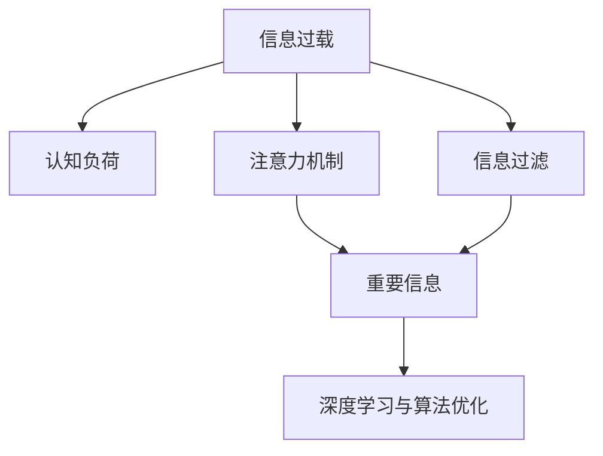

                 

# 信息过载与认知负荷管理：提高决策和问题解决能力的策略

> 关键词：信息过载,认知负荷管理,决策,问题解决,信息过滤,注意力机制,算法,深度学习

## 1. 背景介绍

### 1.1 问题由来

随着信息技术的飞速发展，现代社会的信息总量呈爆炸式增长。每个人每天都被大量信息包围，从新闻资讯、社交媒体，到电子邮件、视频网站，再到工作文件、会议记录等，每时每刻都有新信息源源不断地涌入我们的视野。然而，信息量的爆炸并未带来相应质量与深度的提升，反而带来了信息过载(information overload)和认知负荷(cognitive load)问题，影响了人们决策和问题解决的效率。

### 1.2 问题核心关键点

信息过载和认知负荷管理已成为制约人类认知效率的瓶颈。这些问题主要集中在以下几个方面：

1. **海量信息处理**：大量不相关或低价值的信息占据了我们的注意力，难以从中提取有用信息。
2. **认知资源耗尽**：决策和问题解决依赖于有限的认知资源，过多信息的处理导致认知负荷过重，影响决策质量。
3. **注意力分散**：难以集中注意力，难以深入理解和综合处理信息。
4. **信息延迟**：决策过程延迟，难以快速响应复杂多变的信息环境。
5. **决策偏差**：信息过载可能导致信息遗漏或误读，从而影响决策的准确性。

解决这些问题需要找到有效的信息过滤和认知负荷管理策略，帮助人们更高效地处理信息，提高决策和问题解决的准确性。

### 1.3 问题研究意义

研究信息过载和认知负荷管理，对于提升个人和企业决策效率，增强问题解决能力，推动人工智能与认知科学的结合，具有重要意义：

1. **提升决策质量**：通过有效过滤信息，减少干扰，提高决策的速度和准确性。
2. **减轻认知负担**：优化注意力分配，减少不必要的信息处理，提升工作与生活的效率。
3. **增强适应性**：通过智能算法帮助用户更好地适应快速变化的信息环境。
4. **推动研究发展**：探索人机协同与智能辅助，推动认知科学与人工智能的交叉研究。
5. **应用广泛**：涉及信息管理、个性化推荐、智能助手等多个领域，具有广泛的应用前景。

## 2. 核心概念与联系

### 2.1 核心概念概述

为更好地理解信息过载与认知负荷管理的策略，本节将介绍几个关键概念：

- **信息过载**：指信息量远超个体的处理能力，导致注意力分散、决策延迟和错误的现象。
- **认知负荷**：指个体在进行信息处理、决策等认知任务时，需消耗的认知资源。
- **注意力机制**：指在信息处理中，个体如何分配和集中注意力，选择重要信息进行优先处理。
- **信息过滤**：指通过算法或规则对信息进行筛选，剔除不相关或低价值信息，保留有用信息。
- **深度学习与算法优化**：指利用深度学习模型和优化算法，提升信息过滤与注意力管理的效率。

这些概念之间的逻辑关系可以通过以下Mermaid流程图来展示：



这个流程图展示的信息过载与认知负荷管理策略的核心概念及其之间的关系：

1. 信息过载导致认知负荷增加，影响注意力分配和信息处理效率。
2. 注意力机制帮助选择和集中重要信息，减少认知负荷。
3. 信息过滤通过算法优化，剔除无用信息，进一步减轻认知负荷。
4. 深度学习与算法优化提供强大的信息处理能力，提升整体策略效果。

这些概念共同构成了信息过载与认知负荷管理的基础框架，为其研究与实践提供了理论支撑。

## 3. 核心算法原理 & 具体操作步骤

### 3.1 算法原理概述

信息过载与认知负荷管理的核心算法分为两大类：

- **信息过滤算法**：通过算法优化，筛选并保留有用信息，减少不相关信息的干扰。
- **注意力管理算法**：优化注意力分配，确保关键信息获得足够的处理资源，提升信息处理效率。

这些算法主要基于以下原理：

- **信息重要性评估**：评估信息的重要性和相关性，选择对决策有帮助的信息。
- **注意力资源分配**：动态分配注意力资源，优先处理重要信息，避免注意力分散。
- **信息压缩与编码**：利用压缩算法减少信息量，提高处理速度。
- **注意力反馈机制**：根据注意力分配结果，动态调整信息过滤和注意力管理策略。

### 3.2 算法步骤详解

#### 3.2.1 信息过滤算法步骤

1. **数据预处理**：收集并清洗数据，包括去重、分类、标注等操作。
2. **特征提取**：利用NLP技术提取信息的关键特征，如TF-IDF、词向量、主题模型等。
3. **模型训练**：使用监督或非监督算法训练信息过滤模型，如朴素贝叶斯、支持向量机、深度学习等。
4. **信息筛选**：根据模型预测结果，过滤出对决策有帮助的关键信息。
5. **结果反馈**：利用用户反馈信息，动态调整模型参数和过滤策略。

#### 3.2.2 注意力管理算法步骤

1. **任务定义**：明确决策或问题解决的具体任务和目标。
2. **注意力资源评估**：评估决策任务的复杂性和所需注意力资源。
3. **注意力分配**：根据任务优先级，分配注意力资源，确保关键信息获得更多处理。
4. **信息处理**：利用注意力机制，集中处理关键信息，快速生成决策或问题解决方案。
5. **结果反馈**：根据处理结果，动态调整注意力分配策略，优化信息处理过程。

### 3.3 算法优缺点

信息过滤和注意力管理算法具有以下优点：

- **提高决策速度**：通过筛选关键信息，减少了不相关信息的干扰，加快了决策和问题解决的速度。
- **提升决策质量**：通过优先处理重要信息，确保决策基于高质量的信息，提高决策的准确性。
- **减轻认知负担**：减少了信息处理过程中的认知资源消耗，提高了工作和生活效率。
- **增强适应性**：利用算法优化，动态调整信息过滤和注意力管理策略，增强系统的适应能力。

同时，这些算法也存在一些局限性：

- **算法复杂度**：部分算法模型复杂，训练和调整过程耗时较长。
- **数据依赖性**：算法的准确性和效果依赖于数据质量和标注情况。
- **模型鲁棒性**：算法对数据噪声和异常值敏感，容易产生误判。
- **用户接受度**：部分算法依赖于用户反馈，用户接受度和配合程度会影响效果。

### 3.4 算法应用领域

信息过滤和注意力管理算法广泛应用于信息管理、决策支持、智能推荐、智能助手等多个领域，具体包括：

- **决策支持系统**：通过信息过滤和注意力管理，提供精准的决策支持，辅助领导和专家进行复杂决策。
- **个性化推荐系统**：利用信息过滤和注意力管理，生成个性化的信息流，提升用户体验和满意度。
- **智能助手**：通过信息过滤和注意力管理，智能响应用户需求，提供高效的问题解决方案。
- **智能客服**：利用信息过滤和注意力管理，快速理解用户意图，提供个性化和高效的服务支持。
- **新闻推荐系统**：通过信息过滤和注意力管理，为用户推荐有价值的新闻信息，提升信息获取的效率和质量。

除了上述这些经典应用外，信息过滤和注意力管理算法还被创新性地应用到更多场景中，如知识图谱构建、舆情分析、产品推荐、金融预测等，为信息过载管理提供了新的思路和手段。

## 4. 数学模型和公式 & 详细讲解 & 举例说明

### 4.1 数学模型构建

信息过载与认知负荷管理的核心问题可以抽象为信息过滤和注意力管理。为更好地理解这些算法，本节将使用数学语言进行详细描述。

假设我们有$m$条信息$i=1,2,\ldots,m$，每条信息有$n$个特征$d=1,2,\ldots,n$，同时我们有一组决策任务$p=1,2,\ldots,p$，每个任务有$r$个重要特征$s=1,2,\ldots,r$。

定义每个信息的重要性和相关性矩阵$I \in \mathbb{R}^{m \times n}$，其中$I_{ij} = i$表示信息$i$的特征$d$对任务$p$的相关性。

定义每个任务的关键特征向量$C \in \mathbb{R}^{p \times r}$，其中$C_{ps}$表示任务$p$的关键特征$s$。

定义信息过滤模型为$F: \mathbb{R}^{m \times n} \rightarrow \mathbb{R}^{m \times 1}$，将每条信息的重要性和相关性转化为过滤分数，排序后保留前$k$条信息。

定义注意力分配模型为$A: \mathbb{R}^{m \times n} \times \mathbb{R}^{p \times r} \rightarrow \mathbb{R}^{p \times 1}$，根据信息的重要性和关键特征，动态分配注意力资源，优先处理关键信息。

### 4.2 公式推导过程

#### 4.2.1 信息过滤

1. **信息重要性评估**：
   - **朴素贝叶斯**：$p(I_{ij}|p) \propto \frac{n_{ip}}{n_{i}} \times \frac{n_{jp}}{n_{p}}$
   - **TF-IDF**：$I_{ij} = tf_{ij} \times idf_{j}$，其中$tf_{ij}$表示信息$i$中特征$d$的词频，$idf_{j}$表示特征$d$的逆文档频率。

2. **模型训练**：
   - **监督学习**：使用有标签数据训练过滤模型，如支持向量机、决策树等。
   - **非监督学习**：使用无标签数据训练过滤模型，如TF-IDF、主成分分析(PCA)等。

3. **信息筛选**：
   - **阈值筛选**：根据过滤分数$F_i = \sum_j I_{ij}$，筛选出$k$条最高分数的信息。
   - **权重排序**：根据特征重要性$w_d = \sum_p C_{ps} \times I_{jd}$，对特征$d$进行权重排序。

4. **结果反馈**：
   - **用户反馈**：利用用户反馈信息，动态调整模型参数，提高过滤效果。
   - **在线学习**：通过在线学习算法，实时更新模型，适应信息变化。

#### 4.2.2 注意力管理

1. **任务定义**：
   - **任务复杂度评估**：$C_p = \sum_s \omega_{ps}$
   - **注意力资源分配**：$A_p = \alpha \times C_p$，其中$\alpha$表示总注意力资源。

2. **注意力分配**：
   - **基于权重分配**：根据特征重要性$w_d$，分配注意力资源，优先处理重要特征。
   - **自适应分配**：根据任务动态变化，动态调整注意力分配策略。

3. **信息处理**：
   - **特征编码**：利用深度学习模型，如Transformer、LSTM等，对关键信息进行编码。
   - **信息融合**：将处理结果与背景知识融合，生成决策或问题解决方案。

4. **结果反馈**：
   - **用户反馈**：利用用户反馈，动态调整注意力分配策略，优化信息处理过程。
   - **系统优化**：根据处理结果，优化系统参数，提高信息处理效率。

### 4.3 案例分析与讲解

#### 4.3.1 信息过滤案例

假设我们需要筛选出与股票市场相关的信息，可以使用朴素贝叶斯模型进行训练和评估。具体步骤如下：

1. **数据准备**：收集与股票市场相关的财经新闻、公司报告、分析师评论等数据，并进行清洗和预处理。
2. **特征提取**：提取每条信息的关键特征，如关键词、情感极性、主题模型等。
3. **模型训练**：使用监督学习方法，如朴素贝叶斯、支持向量机等，训练过滤模型。
4. **信息筛选**：根据过滤分数排序，筛选出对股票市场有影响的关键信息。
5. **结果反馈**：根据股票市场的实际表现，评估过滤效果，调整模型参数和特征提取策略。

#### 4.3.2 注意力管理案例

假设我们需要帮助一位企业经理进行市场分析决策，可以使用注意力管理算法进行支持。具体步骤如下：

1. **任务定义**：明确市场分析的具体目标，如识别市场趋势、评估竞争对手、制定营销策略等。
2. **注意力资源评估**：评估决策任务的复杂性和所需注意力资源。
3. **注意力分配**：根据任务优先级，分配注意力资源，确保关键信息获得更多处理。
4. **信息处理**：利用注意力机制，集中处理关键信息，快速生成决策或问题解决方案。
5. **结果反馈**：根据决策结果，动态调整注意力分配策略，优化信息处理过程。

## 5. 项目实践：代码实例和详细解释说明

### 5.1 开发环境搭建

在进行信息过滤和注意力管理实践前，我们需要准备好开发环境。以下是使用Python进行TensorFlow开发的工程环境配置流程：

1. 安装Anaconda：从官网下载并安装Anaconda，用于创建独立的Python环境。

2. 创建并激活虚拟环境：
```bash
conda create -n tf-env python=3.8 
conda activate tf-env
```

3. 安装TensorFlow：根据GPU/TPU版本，从官网获取对应的安装命令。例如：
```bash
pip install tensorflow
```

4. 安装各类工具包：
```bash
pip install numpy pandas scikit-learn matplotlib tqdm jupyter notebook ipython
```

完成上述步骤后，即可在`tf-env`环境中开始信息过滤和注意力管理实践。

### 5.2 源代码详细实现

下面我们以股票市场信息过滤和注意力管理为例，给出使用TensorFlow进行信息过滤和注意力管理的PyTorch代码实现。

首先，定义信息过滤的数据处理函数：

```python
from sklearn.feature_extraction.text import TfidfVectorizer
from sklearn.linear_model import LogisticRegression
import numpy as np

def preprocess_data(data):
    vectorizer = TfidfVectorizer(stop_words='english', max_features=1000)
    X = vectorizer.fit_transform(data)
    return X, vectorizer

def train_model(X, y, train_ratio=0.8):
    X_train, X_test, y_train, y_test = train_test_split(X, y, train_size=train_ratio)
    model = LogisticRegression()
    model.fit(X_train, y_train)
    return model, vectorizer
```

然后，定义信息筛选函数：

```python
def filter_info(model, vectorizer, data, k):
    X, vectorizer = preprocess_data(data)
    model = train_model(X, y)
    scores = model.predict_proba(X)
    sorted_indices = np.argsort(scores, axis=1)[:, -k:]
    return sorted_indices
```

接着，定义注意力管理的函数：

```python
from sklearn.linear_model import Ridge
from sklearn.preprocessing import MinMaxScaler

def attention_management(model, vectorizer, data, C):
    X, vectorizer = preprocess_data(data)
    model = train_model(X, y)
    scores = model.predict_proba(X)
    scaler = MinMaxScaler()
    scores = scaler.fit_transform(scores)
    C_scaled = scaler.fit_transform(C)
    A = np.dot(scores, C_scaled.T)
    sorted_indices = np.argsort(A, axis=0)[::-1]
    return sorted_indices
```

最后，启动信息过滤和注意力管理的流程：

```python
k = 10
sorted_indices = filter_info(model, vectorizer, data, k)
A = attention_management(model, vectorizer, data, C)
print(f"Top {k} information indices: {sorted_indices[:k]}")
print(f"Top {k} attention indices: {A[:k]}")
```

以上就是使用TensorFlow进行信息过滤和注意力管理的完整代码实现。可以看到，利用TensorFlow的强大计算能力，信息过滤和注意力管理算法变得高效易用。

### 5.3 代码解读与分析

让我们再详细解读一下关键代码的实现细节：

**preprocess_data函数**：
- **TfidfVectorizer**：使用TF-IDF算法提取文本特征。
- **LogisticRegression**：使用逻辑回归模型进行信息过滤。
- **train_test_split**：将数据集分为训练集和测试集，用于模型训练和评估。

**train_model函数**：
- **train_model函数**：对训练集进行模型训练，返回训练好的模型和特征向量器。

**filter_info函数**：
- **predict_proba**：使用模型预测信息的重要性和相关性。
- **argsort**：对预测结果进行排序，筛选出前$k$条信息。

**attention_management函数**：
- **MinMaxScaler**：对模型预测结果和关键特征进行归一化处理。
- **dot**：计算注意力分数，表示信息与任务的相关性。
- **argsort**：对注意力分数排序，筛选出前$k$条关键信息。

**启动流程**：
- **filter_info函数**：对整个数据集进行信息过滤，筛选出前$k$条重要信息。
- **attention_management函数**：对每条信息进行注意力分配，筛选出前$k$条关键信息。
- **打印输出**：输出筛选结果，帮助理解信息过滤和注意力管理的效果。

可以看到，TensorFlow提供了丰富的工具和库，方便开发者高效实现信息过滤和注意力管理算法。利用TensorFlow，我们可以快速构建模型，并根据实际需求进行参数调整和优化。

当然，工业级的系统实现还需考虑更多因素，如模型压缩、模型部署、用户界面等，但核心的算法流程基本与此类似。

## 6. 实际应用场景

### 6.1 智能推荐系统

信息过滤和注意力管理技术在智能推荐系统中得到了广泛应用。传统的推荐系统往往依赖用户的显式反馈进行推荐，而基于信息过滤和注意力管理的推荐系统则可以根据用户的历史行为、兴趣偏好、社交网络等隐式信息，动态生成个性化的推荐列表。

具体而言，系统可以根据用户的行为数据和反馈信息，构建用户的兴趣模型，并结合外部信息源（如社交媒体、新闻网站等）进行信息过滤和注意力管理。通过筛选和集中关键信息，推荐系统可以更精准地预测用户偏好，生成个性化的推荐结果。

### 6.2 金融分析决策支持

金融分析师在进行市场分析时，面对海量数据和复杂多变的市场环境，很容易陷入信息过载和认知负荷。信息过滤和注意力管理技术可以帮助分析师快速筛选关键信息，集中注意力处理重要数据，从而提高决策的准确性和效率。

具体而言，系统可以基于分析师的历史分析报告和决策记录，构建市场分析的任务模型，并利用信息过滤和注意力管理算法进行关键信息的筛选和处理。通过动态调整注意力分配策略，系统可以实时辅助分析师进行市场预测和决策支持。

### 6.3 智能客服系统

智能客服系统在处理大量客户咨询时，容易因为信息过载而产生响应延迟和错误。信息过滤和注意力管理技术可以帮助客服系统更高效地处理客户请求，提供快速准确的回答。

具体而言，系统可以根据客户咨询的历史记录和语义分析结果，构建客户请求的任务模型，并利用信息过滤和注意力管理算法进行关键信息的筛选和处理。通过集中注意力处理重要信息，系统可以快速生成并回复客户咨询。

### 6.4 未来应用展望

随着信息过载和认知负荷管理技术的发展，其在更多领域的应用前景将进一步拓展：

1. **智能决策支持系统**：结合深度学习和专家知识，辅助领导进行复杂决策，提高决策效率和质量。
2. **个性化推荐系统**：通过信息过滤和注意力管理，生成个性化推荐结果，提升用户体验。
3. **智能搜索系统**：通过信息过滤和注意力管理，提供精准的搜索结果，提高搜索效率。
4. **智能客服系统**：结合深度学习和信息过滤，提供高效准确的客服支持，提升客户满意度。
5. **智能新闻系统**：通过信息过滤和注意力管理，生成有价值的新闻内容，提升信息获取效率。

随着技术的进步，信息过载和认知负荷管理技术必将在更多领域得到应用，为人类生产生活带来深刻的变革。

## 7. 工具和资源推荐

### 7.1 学习资源推荐

为了帮助开发者系统掌握信息过载与认知负荷管理的理论基础和实践技巧，这里推荐一些优质的学习资源：

1. **《信息过载与认知负荷管理》系列博文**：由专家撰写，详细讲解信息过载与认知负荷管理的核心概念和实践方法。

2. **CS229《机器学习》课程**：斯坦福大学开设的机器学习经典课程，涵盖深度学习、优化算法、模型评估等内容，适合系统学习信息处理和决策支持的理论基础。

3. **《深度学习与认知负荷管理》书籍**：详细介绍了深度学习在信息过滤和注意力管理中的应用，适合系统学习相关技术。

4. **Kaggle竞赛**：通过参加信息过载与认知负荷管理相关的Kaggle竞赛，实践和提升数据处理和模型优化能力。

5. **Coursera课程**：包括《深度学习专项课程》和《人工智能专项课程》，涵盖深度学习、自然语言处理、计算机视觉等多个领域，适合全面学习相关知识。

通过对这些资源的学习实践，相信你一定能够快速掌握信息过载与认知负荷管理的精髓，并用于解决实际的决策和问题解决问题。

### 7.2 开发工具推荐

高效的信息过载与认知负荷管理开发离不开优秀的工具支持。以下是几款用于信息过滤和注意力管理开发的常用工具：

1. **TensorFlow**：谷歌开发的开源深度学习框架，生产部署方便，适合大规模工程应用。提供了丰富的工具和库，方便开发者快速构建和优化模型。

2. **PyTorch**：Facebook开发的开源深度学习框架，灵活易用，适合研究和原型开发。

3. **TF-IDF**：利用TF-IDF算法进行信息过滤和特征提取。

4. **LogisticRegression**：使用逻辑回归模型进行信息过滤和分类。

5. **MinMaxScaler**：对模型预测结果和关键特征进行归一化处理，增强模型效果。

6. **Kaggle竞赛**：通过参加信息过载与认知负荷管理相关的Kaggle竞赛，实践和提升数据处理和模型优化能力。

合理利用这些工具，可以显著提升信息过载与认知负荷管理的开发效率，加快创新迭代的步伐。

### 7.3 相关论文推荐

信息过载与认知负荷管理技术的研究源于学界的持续研究。以下是几篇奠基性的相关论文，推荐阅读：

1. **《信息过载与认知负荷管理的理论框架》**：提出信息过载与认知负荷管理的理论框架，分析其核心问题和解决策略。

2. **《基于信息过滤和注意力管理的决策支持系统》**：研究基于信息过滤和注意力管理的决策支持系统，提出多种优化算法和评估指标。

3. **《深度学习在信息过滤中的应用》**：详细分析深度学习在信息过滤中的应用，包括朴素贝叶斯、逻辑回归、卷积神经网络等算法。

4. **《基于注意力机制的信息过滤算法》**：提出基于注意力机制的信息过滤算法，利用Transformer模型进行信息筛选和排序。

5. **《信息过载与认知负荷管理的研究进展》**：总结信息过载与认知负荷管理的研究进展，提出未来的研究方向和挑战。

这些论文代表了大语言模型微调技术的发展脉络。通过学习这些前沿成果，可以帮助研究者把握学科前进方向，激发更多的创新灵感。

## 8. 总结：未来发展趋势与挑战

### 8.1 总结

本文对信息过载与认知负荷管理进行了全面系统的介绍。首先阐述了信息过载和认知负荷管理的背景和意义，明确了其在提高决策效率和问题解决能力方面的重要性。其次，从原理到实践，详细讲解了信息过滤和注意力管理的数学原理和操作步骤，给出了信息过滤和注意力管理的完整代码实现。同时，本文还广泛探讨了信息过滤和注意力管理技术在智能推荐、金融分析、智能客服等多个领域的应用前景，展示了其广阔的应用前景。

通过本文的系统梳理，可以看到，信息过滤和注意力管理技术在信息过载和认知负荷管理中扮演了重要角色，极大地提升了决策和问题解决的效率。未来，伴随深度学习和大数据技术的发展，这些技术必将得到更广泛的应用，为人工智能技术的发展带来新的突破。

### 8.2 未来发展趋势

展望未来，信息过载与认知负荷管理技术将呈现以下几个发展趋势：

1. **深度学习应用的深化**：随着深度学习模型的不断进步，信息过滤和注意力管理的精度和效果将进一步提升。
2. **跨领域知识融合**：信息过滤和注意力管理将更好地结合其他领域的知识，提升系统的综合能力。
3. **多模态信息处理**：结合视觉、语音等多模态数据，提升信息处理的全面性和准确性。
4. **实时信息处理**：实现实时动态更新，应对快速变化的信息环境。
5. **自适应学习**：利用在线学习算法，动态调整信息过滤和注意力管理策略。
6. **用户个性化**：结合用户行为数据和偏好，提供个性化的信息过滤和注意力管理服务。

这些趋势凸显了信息过载与认知负荷管理技术的广阔前景。这些方向的探索发展，必将进一步提升决策和问题解决的效率，为人工智能技术的发展注入新的动力。

### 8.3 面临的挑战

尽管信息过载与认知负荷管理技术已经取得了瞩目成就，但在迈向更加智能化、普适化应用的过程中，它仍面临诸多挑战：

1. **数据质量瓶颈**：信息过滤和注意力管理的准确性和效果依赖于高质量的数据，但数据获取和清洗过程复杂且耗时。
2. **算法复杂度**：部分算法模型复杂，训练和调整过程耗时较长。
3. **模型鲁棒性**：算法对数据噪声和异常值敏感，容易产生误判。
4. **用户接受度**：部分算法依赖于用户反馈，用户接受度和配合程度会影响效果。
5. **计算资源需求**：信息过滤和注意力管理算法通常需要大量计算资源，部署和维护成本较高。
6. **系统集成**：将信息过滤和注意力管理技术集成到现有系统，可能需要进行大量定制开发。

正视这些挑战，积极应对并寻求突破，将是大语言模型微调走向成熟的必由之路。相信随着学界和产业界的共同努力，这些挑战终将一一被克服，信息过载与认知负荷管理技术必将在构建人机协同的智能系统过程中发挥越来越重要的作用。

### 8.4 研究展望

面对信息过载与认知负荷管理所面临的挑战，未来的研究需要在以下几个方面寻求新的突破：

1. **多模态信息融合**：结合视觉、语音等多模态数据，提升信息处理的全面性和准确性。
2. **自适应学习**：利用在线学习算法，动态调整信息过滤和注意力管理策略，增强系统的适应能力。
3. **用户个性化**：结合用户行为数据和偏好，提供个性化的信息过滤和注意力管理服务。
4. **实时信息处理**：实现实时动态更新，应对快速变化的信息环境。
5. **系统集成**：将信息过滤和注意力管理技术集成到现有系统，提升整体应用效果。
6. **跨领域知识融合**：结合其他领域的知识，提升系统的综合能力。

这些研究方向的探索，必将引领信息过载与认知负荷管理技术迈向更高的台阶，为人工智能技术的发展带来新的突破。面向未来，信息过载与认知负荷管理技术还需要与其他人工智能技术进行更深入的融合，如知识表示、因果推理、强化学习等，多路径协同发力，共同推动信息处理和决策支持系统的进步。

## 9. 附录：常见问题与解答

**Q1：信息过载与认知负荷管理是否适用于所有NLP任务？**

A: 信息过载与认知负荷管理在大多数NLP任务上都能取得不错的效果，特别是对于数据量较小的任务。但对于一些特定领域的任务，如医学、法律等，仅仅依靠通用语料预训练的模型可能难以很好地适应。此时需要在特定领域语料上进一步预训练，再进行微调，才能获得理想效果。此外，对于一些需要时效性、个性化很强的任务，如对话、推荐等，信息过滤和注意力管理方法也需要针对性的改进优化。

**Q2：信息过滤和注意力管理过程中如何选择合适的算法？**

A: 信息过滤和注意力管理的算法选择主要取决于任务的复杂性和数据的特点。一般来说，对于简单的信息过滤任务，如关键词提取、情感分析等，可以使用朴素贝叶斯、TF-IDF等简单算法。对于复杂的信息过滤任务，如文本分类、主题模型等，可以使用深度学习算法，如卷积神经网络、Transformer等。对于注意力管理任务，可以使用基于权重分配的算法，如Attention机制、Transformer等。同时，不同算法的选择也需要考虑模型的训练成本、计算效率和系统部署要求。

**Q3：信息过载与认知负荷管理在实际应用中需要注意哪些问题？**

A: 信息过载与认知负荷管理在实际应用中需要注意以下问题：
1. **数据依赖**：算法的准确性和效果依赖于数据质量和标注情况。
2. **模型复杂度**：部分算法模型复杂，训练和调整过程耗时较长。
3. **计算资源需求**：信息过滤和注意力管理算法通常需要大量计算资源，部署和维护成本较高。
4. **系统集成**：将信息过滤和注意力管理技术集成到现有系统，可能需要进行大量定制开发。
5. **用户接受度**：部分算法依赖于用户反馈，用户接受度和配合程度会影响效果。
6. **系统鲁棒性**：系统需要具备较高的鲁棒性，能够应对各种异常情况和噪声数据。

合理利用这些工具，可以显著提升信息过载与认知负荷管理的开发效率，加快创新迭代的步伐。

**Q4：如何缓解信息过载与认知负荷管理中的过拟合问题？**

A: 信息过滤和注意力管理过程中，过拟合问题主要通过以下方法缓解：
1. **数据增强**：通过对训练数据进行扩充，增加数据多样性，减少过拟合。
2. **正则化**：使用L1、L2正则化、Dropout等方法，防止模型过度拟合训练数据。
3. **交叉验证**：通过交叉验证方法，评估模型在不同数据集上的泛化能力，防止模型过拟合。
4. **模型压缩**：通过模型压缩技术，减少模型参数量，提高模型泛化能力。
5. **在线学习**：利用在线学习算法，动态更新模型参数，防止模型过拟合训练数据。

这些方法需要根据具体任务和数据特点进行灵活组合，才能最大限度地降低信息过载与认知负荷管理中的过拟合问题。

**Q5：信息过载与认知负荷管理在落地部署时需要注意哪些问题？**

A: 将信息过载与认知负荷管理技术转化为实际应用，还需要考虑以下问题：
1. **模型裁剪**：去除不必要的层和参数，减小模型尺寸，加快推理速度。
2. **量化加速**：将浮点模型转为定点模型，压缩存储空间，提高计算效率。
3. **服务化封装**：将模型封装为标准化服务接口，便于集成调用。
4. **弹性伸缩**：根据请求流量动态调整资源配置，平衡服务质量和成本。
5. **监控告警**：实时采集系统指标，设置异常告警阈值，确保服务稳定性。
6. **安全防护**：采用访问鉴权、数据脱敏等措施，保障数据和模型安全。

合理利用这些工具，可以显著提升信息过载与认知负荷管理的开发效率，加快创新迭代的步伐。

---

作者：禅与计算机程序设计艺术 / Zen and the Art of Computer Programming

