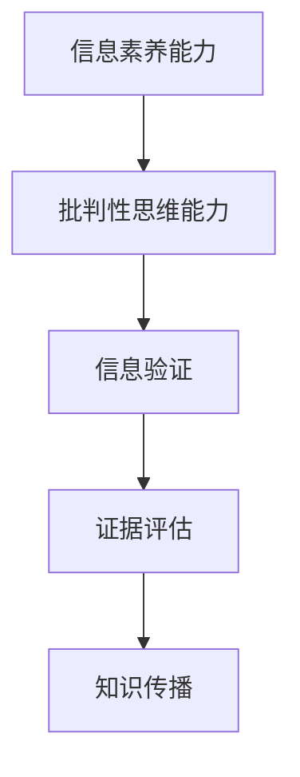

                 

## 1. 背景介绍

### 1.1 问题由来

在数字化和信息化的时代，信息量的爆炸式增长与信息素养能力的不足之间的矛盾日益突出。信息过载和信息噪声的泛滥，导致人们难以分辨真伪，容易受到虚假信息的影响，从而对个人和社会带来负面影响。因此，培养信息素养者、培养批判性思维者，成为数字时代的一个重要课题。

### 1.2 问题核心关键点

信息素养和批判性思维能力，指的是在面对海量的信息时，能够识别信息的真伪，判断信息的可靠性和适用性，并在此基础上进行有理有据的分析、评价和应用。信息验证，则是指通过科学的方法和工具，对信息进行甄别、评价和认证的过程。

在信息时代，信息验证和信息素养能力至关重要。一方面，能够帮助人们避免被虚假信息误导，保护个人和社会安全；另一方面，能够提升决策质量，促进科学研究和知识传播。

### 1.3 问题研究意义

研究信息验证和信息素养能力，对于提升公众的信息素养水平、提高决策质量、促进社会公正和稳定具有重要意义：

1. 提升信息素养水平：帮助公众掌握科学的信息处理和分析方法，提升信息甄别能力，减少被虚假信息误导的风险。
2. 提高决策质量：通过信息验证和信息素养能力的培养，提升决策依据的可靠性和适用性，减少决策失误。
3. 促进社会公正和稳定：减少信息不对称带来的不公，增强公众对信息的信任，构建和谐社会。

## 2. 核心概念与联系

### 2.1 核心概念概述

为更好地理解信息验证和信息素养能力，本节将介绍几个密切相关的核心概念：

- 信息素养能力(Information Literacy Skills)：指的是在获取、评估、利用和管理信息过程中所需的技能和知识。包括识别信息源、评估信息可靠性、使用信息工具等。
- 批判性思维能力(Critical Thinking Skills)：指对信息进行独立、分析和评价的能力，包括质疑、分析、推论等思维活动。
- 信息验证(Information Verification)：指通过科学的方法和工具，对信息的真伪进行甄别、评价和认证的过程。信息验证通常包括事实核查、逻辑分析、数据验证等步骤。
- 证据评估(Evidence Evaluation)：指对信息源和信息的可靠性进行评估，包括评估信息来源的权威性、数据的质量、证据的适用性等。
- 知识传播(Knowledge Dissemination)：指将科学知识和研究成果向公众传播，帮助公众理解和应用这些知识。

这些核心概念之间的逻辑关系可以通过以下Mermaid流程图来展示：



这个流程图展示了大语言模型的核心概念及其之间的关系：

1. 信息素养能力是信息验证和批判性思维能力的基础。
2. 信息验证是信息素养能力的重要组成部分，通过科学方法和工具对信息进行甄别。
3. 证据评估是信息验证的重要一环，通过评估信息源和数据的质量，提升信息可靠性。
4. 知识传播是将信息素养和批判性思维能力应用于实践的关键环节。

## 3. 核心算法原理 & 具体操作步骤

### 3.1 算法原理概述

信息验证和信息素养能力涉及多个领域，包括计算机科学、信息科学、心理学、社会学等。其核心思想是通过科学的方法和工具，对信息进行甄别、评价和认证。

在实践中，常用的信息验证方法包括事实核查、逻辑分析、数据验证等。这些方法通常需要借助计算机科学的技术手段，如自然语言处理、知识图谱、数据挖掘等，实现对信息的自动验证和分析。

### 3.2 算法步骤详解

信息验证和信息素养能力提升的算法步骤大致如下：

1. **数据收集**：通过爬虫、API等方式获取相关信息。
2. **信息预处理**：包括文本清洗、实体识别、关系抽取等步骤，使信息更具结构化和标准化。
3. **信息验证**：采用事实核查、逻辑分析、数据验证等方法，对信息进行甄别和评估。
4. **结果展示**：将验证结果以图表、报告等形式展示，辅助决策和知识传播。
5. **反馈和迭代**：根据验证结果，对信息源和信息传播方式进行反馈和调整，不断优化信息素养能力。

### 3.3 算法优缺点

信息验证和信息素养能力提升的算法具有以下优点：

- **高效性**：通过自动化工具和方法，可以显著提升信息验证的速度和精度。
- **全面性**：能够对海量信息进行全面验证，减少漏检和误判。
- **适用性广**：适用于多种信息类型和应用场景，如新闻报道、科学研究、社交媒体等。

但同时，也存在以下局限性：

- **依赖高质量数据源**：验证结果的可靠性依赖于数据源的质量，难以应对低质量、虚假的信息。
- **技术复杂度高**：需要掌握多种技术和工具，对技术门槛要求较高。
- **动态性不足**：信息验证通常需要定期更新和维护，难以应对信息动态变化的挑战。
- **主观性强**：部分验证方法依赖于专家知识和主观判断，存在一定的偏差和不确定性。

### 3.4 算法应用领域

信息验证和信息素养能力提升的算法在多个领域得到了广泛应用：

- **新闻和媒体**：通过事实核查和逻辑分析，提升新闻报道的准确性和可信度。
- **科学研究**：通过数据验证和证据评估，提升科学研究的严谨性和可靠性。
- **社交媒体**：通过文本分析和社会网络分析，识别和应对虚假信息和网络谣言。
- **商业决策**：通过信息验证和证据评估，辅助企业决策，提升市场竞争力。
- **教育培训**：通过知识传播和信息素养教育，提升公众的信息素养能力，培养批判性思维者。

## 4. 数学模型和公式 & 详细讲解 & 举例说明

### 4.1 数学模型构建

本节将使用数学语言对信息验证和信息素养能力提升的算法过程进行更加严格的刻画。

假设要验证一篇新闻报道的可靠性，可以通过以下数学模型构建：

- **输入**：新闻报道的文本 $x$。
- **输出**：报道的可靠性评分 $y \in [0,1]$，其中1表示完全可信，0表示完全不可信。

**模型构建**：
$$
f(x; \theta) = sigmoid(Wx + b)
$$
其中，$W$ 和 $b$ 为模型参数，$x$ 为新闻文本的向量表示，$sigmoid$ 为激活函数。

### 4.2 公式推导过程

**目标函数**：
$$
\mathcal{L}(\theta) = -\frac{1}{N}\sum_{i=1}^N (y_i \log f(x_i; \theta) + (1-y_i) \log (1-f(x_i; \theta)))
$$
其中，$y_i$ 为第$i$条新闻的可靠评分，$x_i$ 为第$i$条新闻的文本表示。

**优化算法**：
通常使用梯度下降法进行模型训练，具体公式为：
$$
\theta \leftarrow \theta - \eta \nabla_{\theta}\mathcal{L}(\theta)
$$
其中，$\eta$ 为学习率。

### 4.3 案例分析与讲解

以新闻事实核查为例，假设已有一个预训练的新闻事实核查模型，能够对新闻文本进行事实核查，输出每个声明的核查结果 $f_{fact}$，其中0表示声明不正确，1表示声明正确。通过将该结果与人工标注结果对比，得到模型的准确率 $acc$。

在实际应用中，可以通过以下步骤实现信息验证：

1. **数据收集**：使用爬虫工具从新闻网站上收集相关报道。
2. **预处理**：对文本进行分词、去停用词、命名实体识别等处理。
3. **核查**：将预处理后的文本输入到事实核查模型中，得到每个声明的核查结果 $f_{fact}$。
4. **验证结果展示**：将核查结果与人工标注结果进行对比，计算准确率 $acc$。
5. **反馈和优化**：根据验证结果，反馈给事实核查模型，不断优化模型性能。

## 5. 项目实践：代码实例和详细解释说明

### 5.1 开发环境搭建

在进行信息验证和信息素养能力提升的实践前，我们需要准备好开发环境。以下是使用Python进行TensorFlow开发的环境配置流程：

1. 安装Anaconda：从官网下载并安装Anaconda，用于创建独立的Python环境。

2. 创建并激活虚拟环境：
```bash
conda create -n tf-env python=3.8 
conda activate tf-env
```

3. 安装TensorFlow：根据CUDA版本，从官网获取对应的安装命令。例如：
```bash
conda install tensorflow -c pytorch -c conda-forge
```

4. 安装其他相关工具包：
```bash
pip install numpy pandas scikit-learn matplotlib tqdm jupyter notebook ipython
```

完成上述步骤后，即可在`tf-env`环境中开始项目实践。

### 5.2 源代码详细实现

这里以新闻事实核查为例，展示使用TensorFlow实现新闻核查的代码。

首先，定义数据处理函数：

```python
import tensorflow as tf
from tensorflow.keras.preprocessing.text import Tokenizer
from tensorflow.keras.preprocessing.sequence import pad_sequences
from tensorflow.keras.layers import Embedding, LSTM, Dense
from tensorflow.keras.models import Sequential
from tensorflow.keras.optimizers import Adam

def preprocess_text(texts):
    tokenizer = Tokenizer()
    tokenizer.fit_on_texts(texts)
    sequences = tokenizer.texts_to_sequences(texts)
    return pad_sequences(sequences, maxlen=100)

def build_model(vocab_size, embedding_dim, input_len):
    model = Sequential()
    model.add(Embedding(vocab_size, embedding_dim, input_length=input_len))
    model.add(LSTM(128, return_sequences=True))
    model.add(LSTM(128))
    model.add(Dense(1, activation='sigmoid'))
    return model
```

然后，定义训练和评估函数：

```python
def train_model(model, train_texts, train_labels, epochs=10, batch_size=32):
    model.compile(optimizer=Adam(), loss='binary_crossentropy', metrics=['accuracy'])
    model.fit(train_texts, train_labels, epochs=epochs, batch_size=batch_size, validation_split=0.2)

def evaluate_model(model, test_texts, test_labels):
    loss, accuracy = model.evaluate(test_texts, test_labels)
    print(f'Test loss: {loss:.4f}')
    print(f'Test accuracy: {accuracy:.4f}')
```

接着，启动训练流程并在测试集上评估：

```python
train_texts = preprocess_text(train_news)
train_labels = preprocess_labels(train_news)
test_texts = preprocess_text(test_news)
test_labels = preprocess_labels(test_news)

vocab_size = len(tokenizer.word_index) + 1
embedding_dim = 100
input_len = max([len(x) for x in train_texts])

model = build_model(vocab_size, embedding_dim, input_len)

train_model(model, train_texts, train_labels)
evaluate_model(model, test_texts, test_labels)
```

以上就是使用TensorFlow对新闻事实核查模型进行训练和评估的完整代码实现。可以看到，得益于TensorFlow的强大封装，我们可以用相对简洁的代码完成新闻核查模型的开发和训练。

### 5.3 代码解读与分析

让我们再详细解读一下关键代码的实现细节：

**preprocess_text函数**：
- 定义文本预处理函数，使用Keras的Tokenizer和pad_sequences对文本进行分词、去停用词和填充，使文本具有相同的长度。

**build_model函数**：
- 定义LSTM模型，包括嵌入层、LSTM层和输出层，其中嵌入层的词向量维度为100，LSTM层单元数为128，输出层为sigmoid激活函数，用于二分类任务。

**train_model和evaluate_model函数**：
- 定义训练和评估函数，使用Keras的compile方法定义模型，并使用fit和evaluate方法进行训练和评估。

**训练流程**：
- 定义训练集和测试集，分别对文本和标签进行预处理。
- 定义模型参数，包括词汇表大小、嵌入维度、输入长度等。
- 根据定义的参数和文本数据构建模型。
- 调用train_model函数进行模型训练，并使用evaluate_model函数在测试集上评估模型性能。

可以看到，TensorFlow提供了丰富的API和模型组件，可以方便地实现信息验证和信息素养能力提升的算法。开发者可以将更多精力放在数据处理和模型改进等高层逻辑上，而不必过多关注底层的实现细节。

当然，工业级的系统实现还需考虑更多因素，如模型的保存和部署、超参数的自动搜索、更灵活的任务适配层等。但核心的算法思想基本与此类似。

## 6. 实际应用场景

### 6.1 智能搜索系统

基于信息验证和信息素养能力提升的算法，智能搜索系统可以实时判断搜索结果的可靠性，提升信息检索的准确性和用户满意度。

在技术实现上，可以收集用户搜索的历史记录和点击行为，提取其中的关键词和关联信息。在每次搜索时，利用信息验证算法对搜索结果进行甄别，筛选出最可信的信息源。同时，系统还可以动态调整搜索结果的排序，优先展示可靠的信息源。如此构建的智能搜索系统，能显著减少虚假信息的干扰，提高搜索效率。

### 6.2 风险监测系统

金融、医疗等领域需要对数据进行严格验证，以确保数据的可靠性和安全性。基于信息验证和信息素养能力提升的算法，风险监测系统可以自动检测数据中的异常和风险，辅助决策者及时应对。

在实践中，可以收集领域内相关数据，构建信息验证模型。在每次数据输入时，利用模型对数据进行自动验证和分析，及时发现异常数据和潜在风险。同时，系统还可以结合专家知识库，对验证结果进行进一步的验证和优化，确保风险监测的准确性和全面性。

### 6.3 舆情分析系统

舆情分析系统需要实时监测和分析网络舆情，以便及时应对负面信息传播，规避潜在风险。基于信息验证和信息素养能力提升的算法，舆情分析系统可以自动筛选和验证舆情信息，提供可靠的舆情报告。

在实践中，可以收集网络上的新闻报道、评论、社交媒体等信息，构建信息验证模型。在每次舆情监测时，利用模型对信息进行自动验证和分析，筛选出可靠的信息源。同时，系统还可以结合专家知识库和舆情趋势，生成详细的舆情报告，辅助决策者及时应对舆情变化。

### 6.4 未来应用展望

随着信息验证和信息素养能力提升的算法不断发展，其在更多领域得到应用，为传统行业带来变革性影响。

在智慧医疗领域，基于信息验证和信息素养能力提升的算法，可以辅助医生进行诊断和治疗，减少误诊和误治的风险。同时，系统还可以监测患者的健康数据，及时发现异常，提升诊疗效果。

在智能教育领域，信息验证和信息素养能力提升的算法可以辅助教师进行知识传播和教学评估，提升教学质量。同时，系统还可以监测学生的学习行为，提供个性化的学习建议，帮助学生更好地掌握知识。

在智慧城市治理中，基于信息验证和信息素养能力提升的算法，可以自动监测和分析城市事件，提升城市管理的自动化和智能化水平。同时，系统还可以结合专家知识库和政策法规，生成科学合理的决策建议，辅助政府及时应对城市问题。

此外，在企业生产、社会治理、文娱传媒等众多领域，信息验证和信息素养能力提升的算法也将不断涌现，为人工智能落地应用提供新的技术路径。

## 7. 工具和资源推荐

### 7.1 学习资源推荐

为了帮助开发者系统掌握信息验证和信息素养能力提升的理论基础和实践技巧，这里推荐一些优质的学习资源：

1. 《信息验证和信息素养能力》系列博文：由信息素养专家撰写，深入浅出地介绍了信息验证和信息素养能力的定义、方法及应用，是信息素养培训的重要参考。

2. CS229《机器学习》课程：斯坦福大学开设的机器学习明星课程，涵盖信息检索、文本分类、机器翻译等多种信息素养相关算法，是理解信息素养技术的基础。

3. 《信息素养与批判性思维能力》书籍：全面介绍了信息素养与批判性思维能力的定义、理论、方法和工具，帮助读者系统掌握信息素养知识。

4. CLUE开源项目：中文语言理解测评基准，涵盖大量不同类型的中文信息素养相关数据集，并提供了基于信息验证和信息素养能力的baseline模型，助力中文信息素养技术发展。

通过对这些资源的学习实践，相信你一定能够快速掌握信息验证和信息素养能力提升的精髓，并用于解决实际的信息问题。

### 7.2 开发工具推荐

高效的开发离不开优秀的工具支持。以下是几款用于信息验证和信息素养能力提升的常用工具：

1. TensorFlow：基于Python的开源深度学习框架，灵活动态的计算图，适合快速迭代研究。常用的模型组件和API能够方便地实现信息验证和信息素养能力提升的算法。

2. PyTorch：基于Python的开源深度学习框架，灵活的动态图，适合复杂的模型构建和训练。常用的模型组件和API也能够方便地实现信息验证和信息素养能力提升的算法。

3. Keras：基于Python的高层次神经网络API，简化了模型构建和训练过程，适合快速原型开发和实验。常用的模型组件和API也能够方便地实现信息验证和信息素养能力提升的算法。

4. Weights & Biases：模型训练的实验跟踪工具，可以记录和可视化模型训练过程中的各项指标，方便对比和调优。与主流深度学习框架无缝集成。

5. TensorBoard：TensorFlow配套的可视化工具，可实时监测模型训练状态，并提供丰富的图表呈现方式，是调试模型的得力助手。

6. Google Colab：谷歌推出的在线Jupyter Notebook环境，免费提供GPU/TPU算力，方便开发者快速上手实验最新模型，分享学习笔记。

合理利用这些工具，可以显著提升信息验证和信息素养能力提升的开发效率，加快创新迭代的步伐。

### 7.3 相关论文推荐

信息验证和信息素养能力提升的研究源于学界的持续研究。以下是几篇奠基性的相关论文，推荐阅读：

1. Natural Language Processing in Information Retrieval（NLP在信息检索中的应用）：介绍了NLP技术在信息检索中的各种应用，包括信息抽取、实体识别、关系抽取等。

2. Fake News Detection with Deep Learning（深度学习在虚假新闻检测中的应用）：提出深度学习模型在虚假新闻检测中的应用，展示了深度学习在信息验证中的强大能力。

3. Towards a Unified Model for Multimodal Information Retrieval（多模态信息检索的统一模型）：提出多模态信息检索的统一模型，将文本、图像、视频等多种信息进行融合，提升信息检索的全面性和准确性。

4. Misinformation and Disinformation in Social Media（社交媒体上的虚假信息和谣言）：介绍了社交媒体上的虚假信息和谣言的传播机制，提出了虚假信息检测和处理的策略。

5. Debiasing Pre-trained Models（去除预训练模型的偏见）：提出去除预训练模型偏见的策略，确保模型输出的公正性和可靠性。

这些论文代表了大语言模型微调技术的发展脉络。通过学习这些前沿成果，可以帮助研究者把握学科前进方向，激发更多的创新灵感。

## 8. 总结：未来发展趋势与挑战

### 8.1 总结

本文对信息验证和信息素养能力提升的算法进行了全面系统的介绍。首先阐述了信息验证和信息素养能力提升的研究背景和意义，明确了信息验证和信息素养能力提升在信息时代的重要性。其次，从原理到实践，详细讲解了信息验证和信息素养能力提升的数学模型和算法步骤，给出了信息验证任务开发的完整代码实例。同时，本文还广泛探讨了信息验证和信息素养能力提升在多个行业领域的应用前景，展示了信息验证范式的巨大潜力。此外，本文精选了信息验证和信息素养能力提升的学习资源，力求为读者提供全方位的技术指引。

通过本文的系统梳理，可以看到，信息验证和信息素养能力提升在数字化和信息化时代具有重要的应用价值。其关键在于通过科学的方法和工具，对信息进行甄别、验证和评估，提升公众的信息素养水平和决策质量，构建安全、公正、透明的信息生态。

### 8.2 未来发展趋势

展望未来，信息验证和信息素养能力提升将呈现以下几个发展趋势：

1. 技术智能化。随着深度学习和大数据技术的发展，信息验证和信息素养能力提升的技术将更加智能化，能够更好地处理复杂的信息结构和多模态信息。

2. 应用场景多样化。信息验证和信息素养能力提升将广泛应用于新闻、金融、医疗、教育等多个领域，为各个行业的智能化转型提供技术支持。

3. 融合AI技术。信息验证和信息素养能力提升将与其他AI技术进行深度融合，如自然语言处理、计算机视觉、语音识别等，构建更加全面和可靠的信息验证系统。

4. 用户参与度提升。通过增强用户互动，如问答系统、反馈机制等，提升用户的信息素养能力和验证准确性。

5. 实时性增强。随着信息验证和信息素养能力提升技术的不断发展，将实现实时性、动态性，能够及时应对信息变化和更新。

6. 跨领域应用拓展。信息验证和信息素养能力提升技术将向更多领域扩展，如智慧城市、智能家居、智能交通等，为各行各业的信息管理提供技术保障。

以上趋势凸显了信息验证和信息素养能力提升技术的广阔前景。这些方向的探索发展，必将进一步提升信息验证和信息素养能力提升技术的性能和应用范围，为构建安全、可靠、高效的信息生态提供技术支撑。

### 8.3 面临的挑战

尽管信息验证和信息素养能力提升技术已经取得了瞩目成就，但在迈向更加智能化、普适化应用的过程中，它仍面临着诸多挑战：

1. 数据隐私保护。信息验证过程中，需要处理大量的个人和敏感数据，如何保护数据隐私和安全，是一个重要问题。

2. 模型透明性。信息验证模型通常是"黑盒"系统，难以解释其内部工作机制和决策逻辑，需要提升模型的透明性和可解释性。

3. 多模态信息融合。信息验证过程中，需要处理文本、图像、视频等多种信息，如何融合多模态信息，提升验证的全面性和准确性，是一个重要问题。

4. 跨语言验证。信息验证过程中，需要处理多种语言的信息，如何实现跨语言信息验证，提升验证的普适性，是一个重要问题。

5. 动态环境适应。信息验证过程中，需要适应不断变化的信息环境和数据分布，如何实现动态适应，提升验证的鲁棒性和泛化性，是一个重要问题。

6. 信息素养教育。信息素养能力的提升需要教育培训的支持，如何构建科学的信息素养教育体系，是一个重要问题。

面对信息验证和信息素养能力提升技术面临的这些挑战，未来的研究需要在以下几个方面寻求新的突破：

1. 加强数据隐私保护技术的研究，如差分隐私、联邦学习等，确保信息验证过程中数据隐私的保护。

2. 开发更加透明和可解释的模型，如可解释性模型、透明性评估工具等，提升模型的透明性和可解释性。

3. 研究和开发多模态信息融合技术，如深度学习、多模态特征融合等，提升信息验证的全面性和准确性。

4. 研究和开发跨语言信息验证技术，如多语言预训练模型、跨语言知识图谱等，提升信息验证的普适性。

5. 研究和开发动态信息验证技术，如自适应学习、动态模型更新等，提升信息验证的鲁棒性和泛化性。

6. 研究和开发科学的信息素养教育体系，如在线教育平台、信息素养评估工具等，提升公众的信息素养能力。

这些研究方向的探索，必将引领信息验证和信息素养能力提升技术迈向更高的台阶，为构建安全、可靠、高效的信息生态提供技术保障。面向未来，信息验证和信息素养能力提升技术还需要与其他AI技术进行更深入的融合，如自然语言处理、计算机视觉、语音识别等，多路径协同发力，共同推动信息验证和信息素养能力提升技术的进步。只有勇于创新、敢于突破，才能不断拓展信息验证和信息素养能力提升技术的边界，让智能技术更好地造福人类社会。

## 9. 附录：常见问题与解答

**Q1：如何训练一个信息验证模型？**

A: 训练信息验证模型的主要步骤如下：

1. 数据收集：收集需要验证的信息源和人工标注结果，构建训练集和测试集。
2. 数据预处理：对文本进行分词、去停用词、命名实体识别等处理。
3. 模型构建：选择适当的模型架构，如LSTM、BERT等，进行模型构建。
4. 模型训练：使用训练集对模型进行训练，调整超参数，优化模型性能。
5. 模型评估：使用测试集对模型进行评估，计算准确率、精确率、召回率等指标。
6. 模型优化：根据评估结果，对模型进行优化，调整模型参数，提升模型性能。

**Q2：信息验证模型的评估指标有哪些？**

A: 信息验证模型的评估指标主要包括：

1. 准确率(Accuracy)：模型正确验证的信息源占总验证样本的比例。
2. 精确率(Precision)：模型正确验证的信息源占所有验证为正的信息源的比例。
3. 召回率(Recall)：模型正确验证的信息源占所有真实信息源的比例。
4 F1-score：精确率和召回率的调和平均数，综合评估模型的性能。
5 ROC曲线和AUC：ROC曲线下面积，用于评估二分类模型的性能。

**Q3：信息验证模型在实际应用中需要注意哪些问题？**

A: 信息验证模型在实际应用中需要注意以下问题：

1. 数据隐私保护：信息验证过程中，需要处理大量的个人和敏感数据，如何保护数据隐私和安全，是一个重要问题。
2. 模型透明性：信息验证模型通常是"黑盒"系统，难以解释其内部工作机制和决策逻辑，需要提升模型的透明性和可解释性。
3. 多模态信息融合：信息验证过程中，需要处理文本、图像、视频等多种信息，如何融合多模态信息，提升验证的全面性和准确性，是一个重要问题。
4. 跨语言验证：信息验证过程中，需要处理多种语言的信息，如何实现跨语言信息验证，提升验证的普适性，是一个重要问题。
5. 动态环境适应：信息验证过程中，需要适应不断变化的信息环境和数据分布，如何实现动态适应，提升验证的鲁棒性和泛化性，是一个重要问题。
6. 信息素养教育：信息素养能力的提升需要教育培训的支持，如何构建科学的信息素养教育体系，是一个重要问题。

这些问题的解决，将有助于提升信息验证和信息素养能力提升技术的性能和应用范围，构建安全、可靠、高效的信息生态。

**Q4：如何提升信息验证模型的准确性？**

A: 提升信息验证模型的准确性可以从以下几个方面入手：

1. 数据预处理：对数据进行有效的预处理，去除噪音和冗余信息，提升模型的训练效果。
2. 模型选择：选择适当的模型架构，如LSTM、BERT等，进行模型构建。
3. 模型优化：调整模型参数，优化超参数，提升模型性能。
4. 数据增强：通过数据增强技术，如回译、近义词替换等，扩充训练集，提升模型泛化能力。
5. 模型融合：通过模型融合技术，如集成学习、模型栈等，提升模型综合性能。
6. 反馈机制：通过反馈机制，对模型进行不断优化，提升模型准确性。

通过这些方法的综合应用，可以显著提升信息验证模型的准确性，提高信息验证的可靠性。

---

作者：禅与计算机程序设计艺术 / Zen and the Art of Computer Programming

