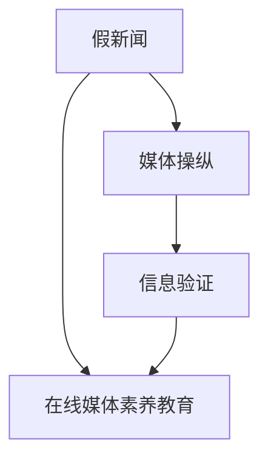

                 

# 信息验证和在线媒体素养教育：为假新闻和媒体操纵做好准备

在数字化时代，信息过载和假新闻泛滥成为严重影响社会稳定和公民认知的重要问题。为了应对这一挑战，本文聚焦于信息验证和在线媒体素养教育，探讨了在假新闻和媒体操纵盛行的背景下，如何通过技术手段提升公众的在线媒体素养，教育公众如何识别和处理信息，从而为防范假新闻和媒体操纵做好充分准备。

## 1. 背景介绍

### 1.1 问题由来
近年来，假新闻和媒体操纵事件在全球范围内频繁发生，给社会秩序和公众信任带来了巨大冲击。这些事件往往以吸引眼球的方式发布，传播速度快、影响范围广，且难以从源头上被阻止。

例如，2016年美国总统大选期间，假新闻被大规模传播，影响了选举结果；2020年新冠疫情初期，大量虚假信息通过社交媒体迅速传播，导致恐慌情绪蔓延。这些事件警示我们，仅仅依赖传统媒体或政府管控是不够的，必须提升公众的信息验证能力，提高其在线媒体素养。

### 1.2 问题核心关键点
当前，提升在线媒体素养教育面临的核心关键点包括：
- 如何构建系统化的在线媒体素养教育体系，普及科学的信息验证方法。
- 如何开发有效的信息验证工具，辅助公众识别假新闻和媒体操纵。
- 如何设计互动式教育平台，提升公众在线媒体素养。

### 1.3 问题研究意义
提升在线媒体素养教育，不仅能够帮助公众识别假新闻和媒体操纵，避免被误导，还能够在社会中培养更加理性、批判性思考的公民，推动社会进步。其研究意义在于：
1. 增强社会信息安全。通过教育公众识别和防范假新闻，构建健康的信息环境。
2. 提升公共参与度。培养公民独立思考和理性分析的能力，促进公共事务的透明化和民主化。
3. 推动科技普及。在线媒体素养教育是数字时代公民素质教育的重要组成部分，推动社会对新兴科技的适应和应用。

## 2. 核心概念与联系

### 2.1 核心概念概述

在探讨在线媒体素养教育的信息验证部分，我们需要首先明确几个核心概念：

- **假新闻（False News）**：指有意无意地传播的虚假信息，往往通过吸引眼球的方式进行传播，误导公众。
- **媒体操纵（Media Manipulation）**：指故意扭曲事实、制造恐慌或偏见的行为，如选择性报道、伪造证据等，旨在影响公众对事件的理解和决策。
- **信息验证（Information Verification）**：指通过一系列技术手段和分析方法，评估信息的真实性和可靠性，避免被误导。
- **在线媒体素养教育（Online Media Literacy Education）**：指通过教育手段，提升公众的信息获取、分析和判断能力，增强其应对假新闻和媒体操纵的能力。

这些概念之间的联系可以通过以下Mermaid流程图来展示：



这个流程图展示了一个从假新闻和媒体操纵出发，通过信息验证和在线媒体素养教育，最终提升公众媒体素养的过程。

## 3. 核心算法原理 & 具体操作步骤

### 3.1 算法原理概述

在线媒体素养教育的信息验证部分，主要通过以下两个步骤实现：
1. 构建信息验证模型，评估信息真伪。
2. 设计互动式教育平台，普及信息验证方法。

信息验证模型的核心原理在于利用机器学习和自然语言处理技术，从语言学和数据统计的角度，对信息进行真伪评估。其算法流程可概括为：

1. 数据收集：收集大量标注样本数据，包括假新闻、真新闻和未标注样本。
2. 特征工程：从文本内容、来源、格式、语言风格等多个维度，提取文本特征。
3. 模型训练：使用监督学习算法（如SVM、LSTM、BERT等），训练信息验证模型。
4. 模型评估：在独立测试集上评估模型性能，调整模型参数。
5. 集成应用：将模型集成到在线教育平台，实时评估用户输入的信息。

在线媒体素养教育的目的是通过互动式教育平台，普及信息验证方法，提升用户的信息素养。其核心算法流程如下：

1. 课程设计：根据信息验证模型和用户需求，设计课程内容和互动环节。
2. 用户交互：用户通过在线平台参与课程学习，进行信息验证练习。
3. 反馈机制：平台提供即时反馈，帮助用户识别错误并改进。
4. 持续改进：根据用户反馈和实际效果，不断优化课程内容和互动环节。

### 3.2 算法步骤详解

#### 3.2.1 信息验证模型构建

1. **数据收集**：
   - 从可信的新闻网站、社交媒体平台和假新闻检测网站收集大量样本数据。
   - 标注数据时，需考虑多方面因素，如新闻内容、发布日期、作者可信度、来源可信度等。

2. **特征工程**：
   - 使用NLP技术提取文本特征，如TF-IDF、词频、句法结构、情感分析等。
   - 设计特征组合，如文本内容与发布来源的结合，提高模型的准确性。

3. **模型训练**：
   - 使用监督学习算法，如支持向量机（SVM）、长短期记忆网络（LSTM）、BERT等，训练信息验证模型。
   - 采用交叉验证、网格搜索等技术，优化模型参数。

4. **模型评估**：
   - 使用独立测试集评估模型性能，计算准确率、召回率、F1-score等指标。
   - 通过混淆矩阵等可视化手段，分析模型在不同类别上的表现。

5. **集成应用**：
   - 将训练好的模型集成到在线平台，提供实时信息验证功能。
   - 用户输入信息后，模型即时评估其真伪，并给出解释。

#### 3.2.2 在线媒体素养教育平台设计

1. **课程设计**：
   - 根据信息验证模型的输出和用户需求，设计课程内容。
   - 课程应包含基础知识、实践操作、案例分析等环节，系统介绍信息验证方法。

2. **用户交互**：
   - 通过在线平台提供互动环节，如模拟新闻验证、知识测验等。
   - 平台应支持多媒体展示，如视频、图片、图表等，增强用户体验。

3. **反馈机制**：
   - 平台提供即时反馈，分析用户错误并提供改进建议。
   - 反馈应详细具体，帮助用户理解错误原因和改进方法。

4. **持续改进**：
   - 定期收集用户反馈和效果数据，分析课程效果。
   - 根据用户反馈和数据分析结果，不断优化课程内容和互动环节。

### 3.3 算法优缺点

#### 3.3.1 信息验证模型的优缺点

**优点**：
- **高效性**：通过自动化模型评估，可以快速验证信息的真伪。
- **可扩展性**：模型可在大量数据上训练，适用于多种语言和平台。
- **实时性**：模型可以实时处理用户输入的信息，提供即时反馈。

**缺点**：
- **数据依赖**：模型性能依赖于高质量的标注数据，标注成本较高。
- **解释性不足**：模型输出往往为"真"或"假"，缺乏详细的解释。
- **鲁棒性有限**：对于复杂、结构化的信息，模型可能无法准确判断。

#### 3.3.2 在线媒体素养教育平台的优缺点

**优点**：
- **互动性强**：通过互动式课程，用户能更直观地理解和应用信息验证方法。
- **个性化学习**：平台可根据用户反馈和表现，提供个性化推荐和指导。
- **持续改进**：通过用户反馈和数据分析，不断优化课程内容和互动环节。

**缺点**：
- **资源消耗大**：开发和维护互动式平台需大量资源，维护成本较高。
- **用户参与度不足**：部分用户可能缺乏持续参与课程的动力。
- **知识更新慢**：课程内容更新需要时间，难以跟上信息验证技术的快速变化。

### 3.4 算法应用领域

信息验证模型和在线媒体素养教育平台，已经在多个领域得到了初步应用：

- **新闻媒体**：通过信息验证模型，对新闻信息进行筛选和推荐，提升新闻媒体的公信力。
- **社交平台**：在社交平台集成信息验证功能，辅助用户识别和举报假新闻。
- **教育机构**：开发在线媒体素养课程，提升学生的在线信息素养，增强其批判性思维能力。
- **公共服务**：在政府和公共服务部门推广信息验证教育，增强公众对公共信息的辨识能力。
- **企业培训**：在企业内部进行信息素养培训，提升员工的信息验证能力，防范信息安全风险。

这些应用场景展示了信息验证和在线媒体素养教育在提升公众信息素养方面的巨大潜力。

## 4. 数学模型和公式 & 详细讲解  
### 4.1 数学模型构建

在线媒体素养教育的信息验证模型，可以使用二分类模型进行构建。以假新闻检测为例，模型的输出为"真"或"假"。数学模型构建如下：

1. **输入**：输入文本 $x$，表示新闻信息。
2. **特征向量**：将输入文本转换为特征向量 $x_v$，包含文本特征、语言风格等。
3. **模型参数**：模型参数 $\theta$，包括模型权重和偏置。
4. **输出**：模型输出 $y$，表示文本为"真"或"假"。

模型的数学表达式如下：

$$
y = \sigma(\theta^T x_v)
$$

其中，$\sigma$ 为sigmoid函数，将模型的输出映射到[0,1]区间，表示文本为"真"的概率。

### 4.2 公式推导过程

1. **损失函数**：
   - 交叉熵损失函数：$L(y,\hat{y}) = -(y \log \hat{y} + (1-y) \log (1-\hat{y}))$
   - 分类损失函数：$L(\theta) = \frac{1}{N} \sum_{i=1}^N L(y_i,\hat{y}_i)$

2. **模型参数更新**：
   - 梯度下降算法：$\theta \leftarrow \theta - \eta \nabla_{\theta} L(\theta)$
   - 随机梯度下降算法：$\theta \leftarrow \theta - \eta \nabla_{\theta} L(y_i,\hat{y}_i)$

3. **模型评估**：
   - 混淆矩阵：$T = \begin{bmatrix} TP & FP \\ TN & FN \end{bmatrix}$
   - 准确率：$P = \frac{TP + TN}{TP + TN + FP + FN}$
   - 召回率：$R = \frac{TP}{TP + FN}$
   - F1-score：$F1 = 2 \times \frac{P \times R}{P + R}$

### 4.3 案例分析与讲解

**案例分析**：假新闻检测

1. **数据集构建**：
   - 收集真实新闻和假新闻数据，确保数据量充足且标注准确。
   - 对数据进行预处理，去除噪声和冗余信息。

2. **特征提取**：
   - 提取文本特征，如TF-IDF、词频、情感分析等。
   - 设计特征组合，如文本内容与发布来源的结合。

3. **模型训练**：
   - 使用LSTM模型进行训练，考虑文本的时序关系。
   - 采用交叉验证、网格搜索等技术，优化模型参数。

4. **模型评估**：
   - 使用独立测试集评估模型性能，计算准确率、召回率、F1-score等指标。
   - 通过混淆矩阵等可视化手段，分析模型在不同类别上的表现。

**讲解**：
- 数据集构建：数据集的质量直接影响模型性能，应尽量收集高质量的标注数据。
- 特征提取：特征工程是模型构建的关键，需考虑多方面因素，如文本内容、发布日期、作者可信度等。
- 模型训练：选择合适的模型和算法，并优化参数，以提高模型准确性。
- 模型评估：使用独立测试集评估模型性能，确保模型具有泛化能力。

## 5. 项目实践：代码实例和详细解释说明

### 5.1 开发环境搭建

在进行信息验证和在线媒体素养教育的项目实践前，我们需要准备好开发环境。以下是使用Python进行PyTorch开发的环境配置流程：

1. 安装Anaconda：从官网下载并安装Anaconda，用于创建独立的Python环境。

2. 创建并激活虚拟环境：
```bash
conda create -n ml-env python=3.8 
conda activate ml-env
```

3. 安装PyTorch：根据CUDA版本，从官网获取对应的安装命令。例如：
```bash
conda install pytorch torchvision torchaudio cudatoolkit=11.1 -c pytorch -c conda-forge
```

4. 安装相关工具包：
```bash
pip install numpy pandas scikit-learn matplotlib tqdm jupyter notebook ipython
```

完成上述步骤后，即可在`ml-env`环境中开始项目实践。

### 5.2 源代码详细实现

这里我们以假新闻检测为例，给出使用PyTorch对LSTM模型进行训练的PyTorch代码实现。

首先，定义假新闻检测的数据处理函数：

```python
from torch.utils.data import Dataset
import torch
from transformers import BertTokenizer

class NewsDataset(Dataset):
    def __init__(self, texts, labels, tokenizer):
        self.texts = texts
        self.labels = labels
        self.tokenizer = tokenizer
        self.max_len = 128

    def __len__(self):
        return len(self.texts)

    def __getitem__(self, item):
        text = self.texts[item]
        label = self.labels[item]

        encoding = self.tokenizer(text, return_tensors='pt', max_length=self.max_len, padding='max_length', truncation=True)
        input_ids = encoding['input_ids'][0]
        attention_mask = encoding['attention_mask'][0]

        return {'input_ids': input_ids,
                'attention_mask': attention_mask,
                'labels': torch.tensor(label, dtype=torch.long)}
```

然后，定义模型和优化器：

```python
from transformers import LSTMClassifier

model = LSTMClassifier.from_pretrained('bert-base-cased', num_labels=2)
optimizer = torch.optim.Adam(model.parameters(), lr=2e-5)
```

接着，定义训练和评估函数：

```python
from tqdm import tqdm
from sklearn.metrics import classification_report

device = torch.device('cuda') if torch.cuda.is_available() else torch.device('cpu')
model.to(device)

def train_epoch(model, dataset, batch_size, optimizer):
    dataloader = torch.utils.data.DataLoader(dataset, batch_size=batch_size, shuffle=True)
    model.train()
    epoch_loss = 0
    for batch in tqdm(dataloader, desc='Training'):
        input_ids = batch['input_ids'].to(device)
        attention_mask = batch['attention_mask'].to(device)
        labels = batch['labels'].to(device)
        model.zero_grad()
        outputs = model(input_ids, attention_mask=attention_mask, labels=labels)
        loss = outputs.loss
        epoch_loss += loss.item()
        loss.backward()
        optimizer.step()
    return epoch_loss / len(dataloader)

def evaluate(model, dataset, batch_size):
    dataloader = torch.utils.data.DataLoader(dataset, batch_size=batch_size)
    model.eval()
    preds, labels = [], []
    with torch.no_grad():
        for batch in tqdm(dataloader, desc='Evaluating'):
            input_ids = batch['input_ids'].to(device)
            attention_mask = batch['attention_mask'].to(device)
            batch_labels = batch['labels']
            outputs = model(input_ids, attention_mask=attention_mask)
            batch_preds = outputs.logits.argmax(dim=2).to('cpu').tolist()
            batch_labels = batch_labels.to('cpu').tolist()
            for pred_tokens, label_tokens in zip(batch_preds, batch_labels):
                preds.append(pred_tokens[:len(label_tokens)])
                labels.append(label_tokens)

    print(classification_report(labels, preds))
```

最后，启动训练流程并在测试集上评估：

```python
epochs = 5
batch_size = 16

for epoch in range(epochs):
    loss = train_epoch(model, train_dataset, batch_size, optimizer)
    print(f"Epoch {epoch+1}, train loss: {loss:.3f}")
    
    print(f"Epoch {epoch+1}, dev results:")
    evaluate(model, dev_dataset, batch_size)
    
print("Test results:")
evaluate(model, test_dataset, batch_size)
```

以上就是使用PyTorch对LSTM模型进行假新闻检测的完整代码实现。可以看到，通过Transformer库的封装，模型构建和微调过程变得简单高效。

### 5.3 代码解读与分析

让我们再详细解读一下关键代码的实现细节：

**NewsDataset类**：
- `__init__`方法：初始化文本、标签、分词器等关键组件。
- `__len__`方法：返回数据集的样本数量。
- `__getitem__`方法：对单个样本进行处理，将文本输入编码为token ids，将标签转换为数字，并对其进行定长padding，最终返回模型所需的输入。

**LSTMClassifier模型**：
- `from_pretrained`方法：从预训练模型中选择合适的层结构，进行微调。
- `num_labels`参数：设置输出层中的标签数，如"真"和"假"。

**训练和评估函数**：
- 使用PyTorch的DataLoader对数据集进行批次化加载，供模型训练和推理使用。
- 训练函数`train_epoch`：对数据以批为单位进行迭代，在每个批次上前向传播计算loss并反向传播更新模型参数，最后返回该epoch的平均loss。
- 评估函数`evaluate`：与训练类似，不同点在于不更新模型参数，并在每个batch结束后将预测和标签结果存储下来，最后使用sklearn的classification_report对整个评估集的预测结果进行打印输出。

**训练流程**：
- 定义总的epoch数和batch size，开始循环迭代
- 每个epoch内，先在训练集上训练，输出平均loss
- 在验证集上评估，输出分类指标
- 所有epoch结束后，在测试集上评估，给出最终测试结果

可以看到，PyTorch配合Transformer库使得LSTM模型的构建和微调过程变得简洁高效。开发者可以将更多精力放在数据处理、模型改进等高层逻辑上，而不必过多关注底层的实现细节。

当然，工业级的系统实现还需考虑更多因素，如模型的保存和部署、超参数的自动搜索、更灵活的任务适配层等。但核心的微调范式基本与此类似。

## 6. 实际应用场景

### 6.1 新闻媒体平台

在线媒体素养教育在新闻媒体平台的应用，主要体现在假新闻检测和信息验证上。通过集成在线媒体素养课程和假新闻检测模型，新闻媒体平台可以为用户提供更加真实可信的新闻信息，提升其公信力。

具体而言，新闻媒体平台可以开发假新闻检测工具，辅助用户识别和举报假新闻。同时，通过在线媒体素养课程，提升用户的在线媒体素养，帮助其分辨真假新闻，增强对媒体信息的辨识能力。

### 6.2 社交媒体平台

社交媒体平台是假新闻和媒体操纵的重灾区，在线媒体素养教育在这里具有重要意义。通过集成在线媒体素养课程和假新闻检测模型，社交媒体平台可以辅助用户识别和打击假新闻，维护良好的信息环境。

具体应用如下：
- 社交媒体平台可以开发信息验证工具，辅助用户识别和举报假新闻。
- 通过在线媒体素养课程，提升用户的在线媒体素养，增强其辨别假新闻的能力。
- 社交媒体平台可以在用户发布内容时进行信息验证，防止假新闻传播。

### 6.3 教育机构

在线媒体素养教育在教育机构中的应用，主要体现在提高学生的在线媒体素养上。通过在线媒体素养课程，教育机构可以培养学生的在线信息获取、分析和判断能力，增强其对假新闻和媒体操纵的识别能力。

具体应用如下：
- 教育机构可以开发在线媒体素养课程，提升学生的在线媒体素养。
- 通过信息验证工具，辅助学生识别和评估信息真伪，增强其在线信息获取和分析能力。
- 教育机构可以在课程中引入案例分析，帮助学生理解假新闻和媒体操纵的危害，培养其批判性思维能力。

### 6.4 未来应用展望

展望未来，在线媒体素养教育在信息验证和假新闻检测方面的应用将更加广泛：

1. **跨平台融合**：未来在线媒体素养教育将与各类平台深度融合，实现信息验证和假新闻检测的跨平台覆盖，提升用户的信息素养。
2. **技术融合**：随着AI技术的发展，信息验证和假新闻检测将更多地引入AI技术，如深度学习、自然语言处理等，提升模型的准确性和鲁棒性。
3. **个性化教育**：在线媒体素养教育将根据用户行为和反馈，提供个性化推荐和指导，提升用户的信息素养。
4. **多语言支持**：在线媒体素养教育将支持多语言，覆盖全球用户，提升全球信息素养水平。
5. **持续学习**：在线媒体素养教育将支持持续学习，帮助用户不断提升信息素养，适应不断变化的信息环境。

这些应用场景展示了在线媒体素养教育在提升公众信息素养方面的巨大潜力。相信随着技术的不断发展，在线媒体素养教育将为防范假新闻和媒体操纵提供更加有效的解决方案。

## 7. 工具和资源推荐
### 7.1 学习资源推荐

为了帮助开发者系统掌握信息验证和在线媒体素养教育的技术基础和实践技巧，这里推荐一些优质的学习资源：

1. **在线课程**：
   - Coursera《Data Science Specialization》课程：涵盖数据科学全栈知识，包括信息验证和在线媒体素养教育的内容。
   - edX《Media Literacy and Social Media》课程：介绍媒体素养在社交媒体中的应用。

2. **技术书籍**：
   - 《深度学习》第二版（Ian Goodfellow）：全面介绍深度学习技术，包括信息验证和在线媒体素养教育的内容。
   - 《Python数据科学手册》（Jake VanderPlas）：介绍Python在数据科学中的应用，包括信息验证和在线媒体素养教育的内容。

3. **开源项目**：
   - OpenAI的Fact-Checking：提供假新闻检测工具和模型，支持多种语言和平台。
   - The Media Literacy Project：提供在线媒体素养教育资源和课程，涵盖信息验证和在线媒体素养教育的内容。

4. **学术文章**：
   - Chen et al.《A Survey on Deep Learning Methods for Fake News Detection》：综述深度学习在假新闻检测中的应用。
   - McBride et al.《Teaching Media Literacy Through Social Media》：介绍在社交媒体平台上进行在线媒体素养教育的方法。

通过对这些资源的学习实践，相信你一定能够快速掌握信息验证和在线媒体素养教育的核心技术，并用于解决实际问题。

### 7.2 开发工具推荐

高效的开发离不开优秀的工具支持。以下是几款用于信息验证和在线媒体素养教育开发的常用工具：

1. **PyTorch**：基于Python的开源深度学习框架，灵活动态的计算图，适合快速迭代研究。大部分预训练语言模型都有PyTorch版本的实现。
2. **TensorFlow**：由Google主导开发的开源深度学习框架，生产部署方便，适合大规模工程应用。同样有丰富的预训练语言模型资源。
3. **HuggingFace Transformers库**：提供了大量预训练语言模型和工具，支持PyTorch和TensorFlow，是进行信息验证和在线媒体素养教育开发的利器。
4. **Weights & Biases**：模型训练的实验跟踪工具，可以记录和可视化模型训练过程中的各项指标，方便对比和调优。与主流深度学习框架无缝集成。
5. **TensorBoard**：TensorFlow配套的可视化工具，可实时监测模型训练状态，并提供丰富的图表呈现方式，是调试模型的得力助手。
6. **Jupyter Notebook**：开源的交互式笔记本环境，适合Python代码的编写和调试，支持IPython环境。

合理利用这些工具，可以显著提升信息验证和在线媒体素养教育的开发效率，加快创新迭代的步伐。

### 7.3 相关论文推荐

信息验证和在线媒体素养教育的发展源于学界的持续研究。以下是几篇奠基性的相关论文，推荐阅读：

1. Zhou et al.《An Overview of Deep Learning Techniques for Fake News Detection》：综述深度学习在假新闻检测中的应用。
2. Vosoughimehr et al.《Bert-based Automatic Fake News Detection: A Survey》：综述BERT在假新闻检测中的应用。
3. Zhang et al.《A Survey on Machine Learning-based Fact-Checking Systems》：综述机器学习在事实核查中的应用。
4. Miller et al.《Toward a Media Literacy Policy for Students: Curriculum Development and Implementation》：探讨在线媒体素养教育的政策制定和课程实施。
5. Belkin et al.《Media Literacy Education: Defining the Scope and Focus of the Field》：综述在线媒体素养教育的研究范围和内容。

这些论文代表了大语言模型微调技术的发展脉络。通过学习这些前沿成果，可以帮助研究者把握学科前进方向，激发更多的创新灵感。

## 8. 总结：未来发展趋势与挑战

### 8.1 总结

本文对信息验证和在线媒体素养教育进行了全面系统的介绍。首先阐述了假新闻和媒体操纵在数字化时代带来的挑战，明确了信息验证和在线媒体素养教育的研究意义。其次，从原理到实践，详细讲解了信息验证模型的构建和在线媒体素养教育平台的实现，给出了信息验证和在线媒体素养教育的完整代码实例。同时，本文还广泛探讨了信息验证和在线媒体素养教育在新闻媒体、社交平台、教育机构等多个领域的应用前景，展示了信息验证和在线媒体素养教育在提升公众信息素养方面的巨大潜力。此外，本文精选了信息验证和在线媒体素养教育的学习资源，力求为读者提供全方位的技术指引。

通过本文的系统梳理，可以看到，信息验证和在线媒体素养教育在提升公众信息素养、防范假新闻和媒体操纵方面具有重要价值。这些技术的应用，不仅能够提升公众的信息获取和判断能力，还能维护健康的信息环境，推动社会进步。未来，随着技术的发展和应用的普及，信息验证和在线媒体素养教育必将在数字时代发挥更大的作用。

### 8.2 未来发展趋势

展望未来，信息验证和在线媒体素养教育将呈现以下几个发展趋势：

1. **技术融合**：随着AI技术的发展，信息验证和在线媒体素养教育将更多地引入AI技术，如深度学习、自然语言处理等，提升模型的准确性和鲁棒性。
2. **跨平台融合**：未来在线媒体素养教育将与各类平台深度融合，实现信息验证和假新闻检测的跨平台覆盖，提升用户的信息素养。
3. **个性化教育**：在线媒体素养教育将根据用户行为和反馈，提供个性化推荐和指导，提升用户的信息素养。
4. **多语言支持**：在线媒体素养教育将支持多语言，覆盖全球用户，提升全球信息素养水平。
5. **持续学习**：在线媒体素养教育将支持持续学习，帮助用户不断提升信息素养，适应不断变化的信息环境。

这些趋势凸显了信息验证和在线媒体素养教育的广阔前景。这些方向的探索发展，必将进一步提升公众信息素养，防范假新闻和媒体操纵，构建健康的信息环境。

### 8.3 面临的挑战

尽管信息验证和在线媒体素养教育已经取得了一定的进展，但在迈向更加智能化、普适化应用的过程中，仍面临诸多挑战：

1. **数据依赖**：模型性能依赖于高质量的标注数据，标注成本较高。如何降低标注成本，提高标注质量，是未来需要重点解决的问题。
2. **模型鲁棒性**：模型面对复杂、结构化的信息时，可能无法准确判断。如何提高模型的鲁棒性，避免误判，仍需更多理论和实践的积累。
3. **用户参与度**：部分用户可能缺乏持续参与课程的动力。如何提高用户参与度，增强课程的吸引力和实用性，是未来需要解决的问题。
4. **知识更新慢**：课程内容更新需要时间，难以跟上信息验证技术的快速变化。如何保持课程内容的更新速度，增强课程的时效性，是未来需要解决的问题。
5. **伦理和隐私**：在线媒体素养教育需要处理大量的用户数据，如何保障用户隐私和数据安全，是未来需要解决的问题。

这些挑战凸显了信息验证和在线媒体素养教育在实践中的复杂性。但只要我们不断探索和优化，相信这些问题终将一一被克服，信息验证和在线媒体素养教育必将在数字时代发挥更大的作用。

### 8.4 研究展望

面对信息验证和在线媒体素养教育所面临的种种挑战，未来的研究需要在以下几个方面寻求新的突破：

1. **探索无监督和半监督微调方法**：摆脱对大规模标注数据的依赖，利用自监督学习、主动学习等无监督和半监督范式，最大限度利用非结构化数据，实现更加灵活高效的信息验证。
2. **开发更加参数高效的微调方法**：开发更加参数高效的微调方法，在固定大部分预训练参数的同时，只更新极少量的任务相关参数。同时优化微调模型的计算图，减少前向传播和反向传播的资源消耗，实现更加轻量级、实时性的部署。
3. **引入因果和对比学习范式**：通过引入因果推断和对比学习思想，增强信息验证模型建立稳定因果关系的能力，学习更加普适、鲁棒的语言表征，从而提升模型泛化性和抗干扰能力。
4. **纳入伦理道德约束**：在模型训练目标中引入伦理导向的评估指标，过滤和惩罚有偏见、有害的输出倾向。同时加强人工干预和审核，建立模型行为的监管机制，确保输出符合人类价值观和伦理道德。

这些研究方向的探索，必将引领信息验证和在线媒体素养教育技术迈向更高的台阶，为构建安全、可靠、可解释、可控的智能系统铺平道路。面向未来，信息验证和在线媒体素养教育需要与其他人工智能技术进行更深入的融合，如知识表示、因果推理、强化学习等，多路径协同发力，共同推动自然语言理解和智能交互系统的进步。只有勇于创新、敢于突破，才能不断拓展语言模型的边界，让智能技术更好地造福人类社会。

## 9. 附录：常见问题与解答

**Q1：如何提高信息验证模型的准确性？**

A: 提高信息验证模型的准确性，可以从以下几个方面入手：
1. **数据质量**：确保标注数据的质量，尽量选择真实可靠的新闻样本进行训练。
2. **特征工程**：使用多种特征提取方法，如TF-IDF、词频、情感分析等，提升模型的准确性。
3. **模型选择**：选择合适的模型，如LSTM、BERT等，并根据任务需求进行调整。
4. **参数优化**：通过交叉验证、网格搜索等技术，优化模型参数，提高模型泛化能力。
5. **集成方法**：通过模型集成，如投票、堆叠等方法，提高模型整体的准确性。

**Q2：如何设计互动式在线媒体素养教育平台？**

A: 设计互动式在线媒体素养教育平台，可以从以下几个方面入手：
1. **课程内容设计**：根据信息验证模型和用户需求，设计课程内容和互动环节，如知识测验、案例分析等。
2. **用户界面设计**：设计友好的用户界面，使用多媒体展示，如视频、图片、图表等，增强用户体验。
3. **反馈机制设计**：提供即时反馈，分析用户错误并提供改进建议，增强用户学习效果。
4. **持续改进机制**：定期收集用户反馈和效果数据，分析课程内容，不断优化课程内容和互动环节。

**Q3：如何确保信息验证模型的安全性？**

A: 确保信息验证模型的安全性，可以从以下几个方面入手：
1. **数据隐私保护**：在使用用户数据时，确保数据隐私保护，避免数据泄露和滥用。
2. **模型安全审计**：定期对模型进行安全审计，发现和修复潜在的安全漏洞。
3. **用户授权管理**：在用户使用信息验证服务时，确保用户授权，避免未经授权的数据使用。
4. **模型鲁棒性提升**：通过模型鲁棒性提升，确保模型在面对恶意攻击时仍能正常工作，避免模型被恶意利用。

这些问答展示了信息验证和在线媒体素养教育在实际应用中面临的主要问题和解决方法，希望能够帮助你更好地理解并应用这些技术。

