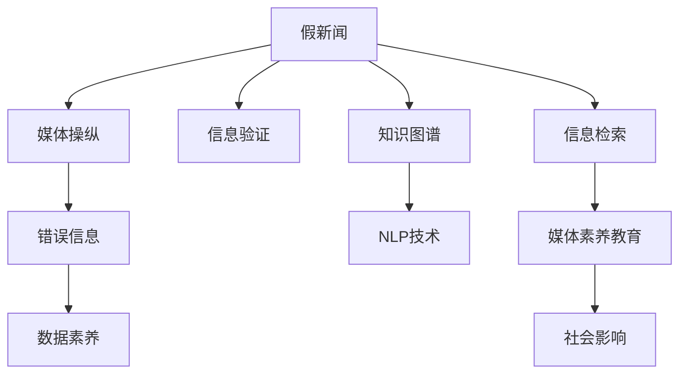

                 

# 信息验证和媒体素养教育：为假新闻、媒体操纵和错误信息时代做好准备

> 关键词：假新闻, 媒体素养教育, 数据验证, 自然语言处理, 社会影响, 知识图谱, 信息检索, 知识管理

## 1. 背景介绍

### 1.1 问题由来
随着互联网的普及和社交媒体的兴起，信息传播的渠道日益多元，人们获取、传播和消费信息的方式也随之发生了根本性的变化。然而，这种变化也带来了新的问题：假新闻（Fake News）、媒体操纵（Media Manipulation）和错误信息（Misinformation）层出不穷，对社会和政治生活造成了严重的影响。如何有效地识别和应对这些信息污染，成为摆在人类面前的重要课题。

与此同时，媒体素养（Media Literacy）教育也被提上了日程。媒体素养不仅涉及新闻和信息的识别与分析，还涵盖了批判性思维、数据验证和信息素养等方面的内容。随着数字化和智能化技术的发展，信息验证和媒体素养教育也逐步与人工智能（AI）技术相结合，借助自然语言处理（NLP）、知识图谱（KG）和信息检索（IR）等技术手段，为假新闻、媒体操纵和错误信息的识别与应对提供了新的可能性。

### 1.2 问题核心关键点
本文聚焦于如何利用AI技术进行信息验证和媒体素养教育，以应对当前假新闻、媒体操纵和错误信息泛滥的挑战。主要核心点包括：
1. 数据验证和知识图谱的构建与应用。
2. 利用NLP技术识别假新闻和错误信息。
3. 信息检索系统在媒体素养教育中的应用。
4. 如何通过技术手段提升公众的信息素养。

## 2. 核心概念与联系

### 2.1 核心概念概述

为更好地理解AI在信息验证和媒体素养教育中的应用，本节将介绍几个密切相关的核心概念：

- 假新闻（Fake News）：指通过虚假陈述、误导性信息或断章取义等手段，旨在误导读者或观众的错误信息。假新闻常常采用编造事实、歪曲数据或利用偏见性语言等手段，误导受众。
- 媒体操纵（Media Manipulation）：指通过操控信息来源、传播渠道或受众心态，从而达到特定政治、经济或社会目标的行为。媒体操纵通常涉及信息选择、编辑、策划和传播等环节。
- 错误信息（Misinformation）：指未经证实或故意篡改的信息，容易引导受众产生错误的认知和判断。错误信息通常以传播谣言、夸大事实或捏造事实等形式出现。
- 信息素养（Information Literacy）：指在信息社会中，个体获取、评估、处理和应用信息的能力，包括媒体素养、数据素养和网络素养等。
- 自然语言处理（Natural Language Processing, NLP）：涉及计算机对人类语言进行分析、理解和生成的技术，包括文本分类、情感分析、实体识别、问答系统等。
- 知识图谱（Knowledge Graph, KG）：一种结构化的语义知识库，用于描述实体、属性和关系，支持知识查询和推理等。
- 信息检索（Information Retrieval, IR）：涉及从大量信息源中检索出与用户需求相关的信息的技术，包括文本检索、语音检索和图像检索等。
- 媒体素养教育（Media Literacy Education）：旨在培养公众的媒体素养，使其具备识别和评估媒体信息的能力，提升公民的信息素养水平。

这些核心概念之间的逻辑关系可以通过以下Mermaid流程图来展示：



这个流程图展示了假新闻、媒体操纵和错误信息与信息验证、数据素养、知识图谱、NLP技术、信息检索和媒体素养教育之间的联系，以及它们如何共同构建起信息社会的知识网络。

## 3. 核心算法原理 & 具体操作步骤
### 3.1 算法原理概述

信息验证和媒体素养教育的核心在于识别和验证信息的真实性和可信度。这一过程可以通过多个步骤完成，包括数据验证、实体识别、知识图谱构建、信息检索和NLP技术应用等。

数据验证通常涉及收集和整理可信的第三方数据，如政府机构、权威媒体和学术研究等，作为参考标准。实体识别则通过NLP技术自动识别和提取文本中的关键实体，如人名、地名、机构名等，为进一步的信息验证提供支持。

知识图谱的构建则是将大量的实体、属性和关系进行结构化，形成语义化的知识库，支持知识查询和推理等操作。信息检索则通过从知识图谱中检索出相关的信息，为信息验证提供依据。

NLP技术在信息验证中的应用则包括文本分类、情感分析和实体识别等，通过这些技术手段自动识别文本中的关键信息和隐含的逻辑关系，辅助信息验证和媒体素养教育。

### 3.2 算法步骤详解

信息验证和媒体素养教育的具体操作步骤如下：

**Step 1: 数据收集与整理**
- 收集可信的第三方数据，如政府公告、权威媒体报道、学术研究论文等。
- 对数据进行清洗、标注和整理，形成结构化的数据集。

**Step 2: 实体识别**
- 利用NLP技术自动识别文本中的关键实体，如人名、地名、机构名等。
- 将这些实体与可信数据集进行比对，识别出潜在的假新闻和错误信息。

**Step 3: 知识图谱构建**
- 将文本中的实体、属性和关系进行结构化，构建知识图谱。
- 在知识图谱中添加可信的数据来源和标注信息，支持后续的信息验证和知识推理。

**Step 4: 信息检索**
- 从知识图谱中检索出与用户需求相关的信息，形成参考依据。
- 通过对比可信数据和检索结果，验证信息的真实性和可信度。

**Step 5: 信息验证**
- 通过文本分类、情感分析和实体识别等技术，自动验证信息的真实性和可信度。
- 利用专家审核和用户反馈，进一步完善信息验证模型。

**Step 6: 媒体素养教育**
- 利用NLP技术生成信息验证报告，帮助用户理解和评估信息。
- 通过知识图谱和信息检索，帮助用户获取更多背景知识和相关资料。
- 定期开展媒体素养培训，提升公众的信息素养水平。

### 3.3 算法优缺点

信息验证和媒体素养教育的方法具有以下优点：
1. 自动化程度高。通过自动化技术手段，可以快速识别和验证信息的真实性和可信度。
2. 覆盖面广。利用NLP和知识图谱技术，可以处理大量复杂的信息源和文本数据。
3. 可扩展性强。随着数据和模型的不断积累，信息验证和媒体素养教育系统可以持续提升性能。

同时，该方法也存在一定的局限性：
1. 数据依赖性强。信息验证的效果很大程度上取决于可信数据的质量和数量。
2. 模型偏差问题。自动化的信息验证模型可能存在偏见，需要定期校验和调整。
3. 用户交互不足。自动化技术难以完全替代人工审核，需要结合用户反馈进行优化。
4. 技术门槛高。信息验证和媒体素养教育涉及多个技术领域，需要一定的技术积累和专业知识。

尽管存在这些局限性，但就目前而言，信息验证和媒体素养教育的方法仍是应对假新闻、媒体操纵和错误信息泛滥的重要手段。未来相关研究的重点在于如何进一步降低数据依赖，提高模型的自适应能力和用户交互性，同时兼顾模型的公正性和透明性等因素。

### 3.4 算法应用领域

信息验证和媒体素养教育的方法已经在多个领域得到了应用，例如：

- 新闻机构：通过信息验证技术，提升新闻报道的准确性和可信度。
- 社交媒体平台：利用信息验证和媒体素养教育，提升用户的信息素养，减少假新闻和错误信息的传播。
- 政府和公共机构：通过知识图谱和信息检索技术，提供权威和可靠的信息支持。
- 教育领域：通过媒体素养教育，提升学生的批判性思维和信息素养，培养未来社会的合格公民。
- 公共安全：利用信息验证和媒体素养教育，防止虚假信息对公共安全和公共秩序的破坏。

除了上述这些应用领域外，信息验证和媒体素养教育的方法还在更多场景中得到了创新性地应用，如在线内容平台、广告行业、法律领域等，为信息社会的发展提供了新的动力。

## 4. 数学模型和公式 & 详细讲解 & 举例说明（备注：数学公式请使用latex格式，latex嵌入文中独立段落使用 $$，段落内使用 $)
### 4.1 数学模型构建

本节将使用数学语言对信息验证和媒体素养教育的过程进行更加严格的刻画。

记可信数据集为 $D=\{(x_i,y_i)\}_{i=1}^N$，其中 $x_i$ 为文本数据，$y_i$ 为可信标签（0表示假新闻，1表示可信信息）。假设信息验证模型为 $M_{\theta}$，其中 $\theta$ 为模型的参数。

定义信息验证模型的损失函数为：

$$
\mathcal{L}(\theta) = -\frac{1}{N}\sum_{i=1}^N y_i \log M_{\theta}(x_i) + (1-y_i) \log (1-M_{\theta}(x_i))
$$

其中 $M_{\theta}(x_i)$ 为模型对文本 $x_i$ 的预测概率，$y_i$ 为真实标签。

### 4.2 公式推导过程

以下我们以文本分类任务为例，推导信息验证模型的损失函数及其梯度的计算公式。

假设模型 $M_{\theta}$ 在输入 $x$ 上的输出为 $\hat{y}=M_{\theta}(x) \in [0,1]$，表示样本属于假新闻的概率。真实标签 $y \in \{0,1\}$。则二分类交叉熵损失函数定义为：

$$
\ell(M_{\theta}(x),y) = -[y\log \hat{y} + (1-y)\log (1-\hat{y})]
$$

将其代入经验风险公式，得：

$$
\mathcal{L}(\theta) = -\frac{1}{N}\sum_{i=1}^N [y_i\log M_{\theta}(x_i)+(1-y_i)\log(1-M_{\theta}(x_i))]
$$

根据链式法则，损失函数对参数 $\theta_k$ 的梯度为：

$$
\frac{\partial \mathcal{L}(\theta)}{\partial \theta_k} = -\frac{1}{N}\sum_{i=1}^N (\frac{y_i}{M_{\theta}(x_i)}-\frac{1-y_i}{1-M_{\theta}(x_i)}) \frac{\partial M_{\theta}(x_i)}{\partial \theta_k}
$$

其中 $\frac{\partial M_{\theta}(x_i)}{\partial \theta_k}$ 可进一步递归展开，利用自动微分技术完成计算。

在得到损失函数的梯度后，即可带入参数更新公式，完成模型的迭代优化。重复上述过程直至收敛，最终得到适应可信数据集的最优模型参数 $\theta^*$。

## 5. 项目实践：代码实例和详细解释说明
### 5.1 开发环境搭建

在进行信息验证和媒体素养教育实践前，我们需要准备好开发环境。以下是使用Python进行PyTorch开发的环境配置流程：

1. 安装Anaconda：从官网下载并安装Anaconda，用于创建独立的Python环境。

2. 创建并激活虚拟环境：
```bash
conda create -n pytorch-env python=3.8 
conda activate pytorch-env
```

3. 安装PyTorch：根据CUDA版本，从官网获取对应的安装命令。例如：
```bash
conda install pytorch torchvision torchaudio cudatoolkit=11.1 -c pytorch -c conda-forge
```

4. 安装自然语言处理库：
```bash
pip install spacy textblob gensim pyLDAvis
```

5. 安装知识图谱工具：
```bash
pip install rdf2vec rdflib
```

6. 安装信息检索库：
```bash
pip install whoosh elasticsearch
```

完成上述步骤后，即可在`pytorch-env`环境中开始信息验证和媒体素养教育实践。

### 5.2 源代码详细实现

这里我们以一个假新闻检测项目为例，给出使用PyTorch进行信息验证和媒体素养教育实现的代码。

首先，定义假新闻检测数据处理函数：

```python
from torch.utils.data import Dataset
import torch

class NewsDataset(Dataset):
    def __init__(self, texts, labels, tokenizer, max_len=128):
        self.texts = texts
        self.labels = labels
        self.tokenizer = tokenizer
        self.max_len = max_len
        
    def __len__(self):
        return len(self.texts)
    
    def __getitem__(self, item):
        text = self.texts[item]
        label = self.labels[item]
        
        encoding = self.tokenizer(text, return_tensors='pt', max_length=self.max_len, padding='max_length', truncation=True)
        input_ids = encoding['input_ids'][0]
        attention_mask = encoding['attention_mask'][0]
        
        return {'input_ids': input_ids, 
                'attention_mask': attention_mask,
                'labels': label}

# 标签为0表示假新闻，1表示可信信息
train_dataset = NewsDataset(train_texts, train_labels, tokenizer)
dev_dataset = NewsDataset(dev_texts, dev_labels, tokenizer)
test_dataset = NewsDataset(test_texts, test_labels, tokenizer)
```

然后，定义模型和优化器：

```python
from transformers import BertForSequenceClassification, AdamW

model = BertForSequenceClassification.from_pretrained('bert-base-cased', num_labels=2)

optimizer = AdamW(model.parameters(), lr=2e-5)
```

接着，定义训练和评估函数：

```python
from torch.utils.data import DataLoader
from tqdm import tqdm
from sklearn.metrics import classification_report

device = torch.device('cuda') if torch.cuda.is_available() else torch.device('cpu')
model.to(device)

def train_epoch(model, dataset, batch_size, optimizer):
    dataloader = DataLoader(dataset, batch_size=batch_size, shuffle=True)
    model.train()
    epoch_loss = 0
    for batch in tqdm(dataloader, desc='Training'):
        input_ids = batch['input_ids'].to(device)
        attention_mask = batch['attention_mask'].to(device)
        labels = batch['labels'].to(device)
        model.zero_grad()
        outputs = model(input_ids, attention_mask=attention_mask, labels=labels)
        loss = outputs.loss
        epoch_loss += loss.item()
        loss.backward()
        optimizer.step()
    return epoch_loss / len(dataloader)

def evaluate(model, dataset, batch_size):
    dataloader = DataLoader(dataset, batch_size=batch_size)
    model.eval()
    preds, labels = [], []
    with torch.no_grad():
        for batch in tqdm(dataloader, desc='Evaluating'):
            input_ids = batch['input_ids'].to(device)
            attention_mask = batch['attention_mask'].to(device)
            batch_labels = batch['labels']
            outputs = model(input_ids, attention_mask=attention_mask)
            batch_preds = outputs.logits.argmax(dim=2).to('cpu').tolist()
            batch_labels = batch_labels.to('cpu').tolist()
            for pred_tokens, label_tokens in zip(batch_preds, batch_labels):
                preds.append(pred_tokens[:len(label_tokens)])
                labels.append(label_tokens)
                
    print(classification_report(labels, preds))
```

最后，启动训练流程并在测试集上评估：

```python
epochs = 5
batch_size = 16

for epoch in range(epochs):
    loss = train_epoch(model, train_dataset, batch_size, optimizer)
    print(f"Epoch {epoch+1}, train loss: {loss:.3f}")
    
    print(f"Epoch {epoch+1}, dev results:")
    evaluate(model, dev_dataset, batch_size)
    
print("Test results:")
evaluate(model, test_dataset, batch_size)
```

以上就是使用PyTorch对BERT进行假新闻检测的完整代码实现。可以看到，得益于HuggingFace的Transformer库，我们通过几行代码就完成了模型的加载和训练。

### 5.3 代码解读与分析

让我们再详细解读一下关键代码的实现细节：

**NewsDataset类**：
- `__init__`方法：初始化文本、标签、分词器等关键组件。
- `__len__`方法：返回数据集的样本数量。
- `__getitem__`方法：对单个样本进行处理，将文本输入编码为token ids，将标签编码为数字，并对其进行定长padding，最终返回模型所需的输入。

**标签为0表示假新闻，1表示可信信息**：
- 定义了标签与数字id之间的映射关系，用于将token-wise的预测结果解码回真实的标签。

**训练和评估函数**：
- 使用PyTorch的DataLoader对数据集进行批次化加载，供模型训练和推理使用。
- 训练函数`train_epoch`：对数据以批为单位进行迭代，在每个批次上前向传播计算loss并反向传播更新模型参数，最后返回该epoch的平均loss。
- 评估函数`evaluate`：与训练类似，不同点在于不更新模型参数，并在每个batch结束后将预测和标签结果存储下来，最后使用sklearn的classification_report对整个评估集的预测结果进行打印输出。

**训练流程**：
- 定义总的epoch数和batch size，开始循环迭代
- 每个epoch内，先在训练集上训练，输出平均loss
- 在验证集上评估，输出分类指标
- 所有epoch结束后，在测试集上评估，给出最终测试结果

可以看到，PyTorch配合Transformer库使得BERT微调的代码实现变得简洁高效。开发者可以将更多精力放在数据处理、模型改进等高层逻辑上，而不必过多关注底层的实现细节。

当然，工业级的系统实现还需考虑更多因素，如模型的保存和部署、超参数的自动搜索、更灵活的任务适配层等。但核心的信息验证和媒体素养教育框架基本与此类似。

## 6. 实际应用场景
### 6.1 新闻机构

新闻机构的信息验证和媒体素养教育可以极大地提升新闻报道的准确性和可信度。传统的新闻审查往往依赖人工审核，耗时耗力，且难以覆盖所有新闻报道。利用自动化技术，新闻机构可以在发布前进行快速的信息验证，减少假新闻和错误信息对公众的影响。

在技术实现上，可以构建一个信息验证和媒体素养教育系统，包括数据收集与整理、实体识别、知识图谱构建、信息检索和NLP技术应用等模块。记者和编辑可以使用该系统，对报道中的信息进行实时验证和评估，提升新闻报道的准确性和可信度。

### 6.2 社交媒体平台

社交媒体平台的信息验证和媒体素养教育可以显著减少假新闻和错误信息的传播。社交媒体平台上的信息流动速度快，用户对信息的辨别能力参差不齐，假新闻和错误信息容易迅速扩散。利用自动化技术，平台可以对用户发布的信息进行快速验证和标记，减少假新闻和错误信息的影响。

在技术实现上，可以构建一个信息验证和媒体素养教育系统，包括数据收集与整理、实体识别、知识图谱构建、信息检索和NLP技术应用等模块。平台可以对用户发布的信息进行实时验证和标记，帮助用户识别和抵制假新闻和错误信息，提升信息素养水平。

### 6.3 政府和公共机构

政府和公共机构的信息验证和媒体素养教育可以提升政策制定和公共服务的透明度和可信度。政府和公共机构需要向公众提供准确、及时的信息支持，才能获得公众的信任和支持。利用自动化技术，政府和公共机构可以构建信息验证和媒体素养教育系统，对政策信息进行快速验证和标记，提升政策的透明度和可信度。

在技术实现上，可以构建一个信息验证和媒体素养教育系统，包括数据收集与整理、实体识别、知识图谱构建、信息检索和NLP技术应用等模块。政府和公共机构可以使用该系统，对政策信息进行实时验证和标记，提升政策的透明度和可信度。

### 6.4 未来应用展望

随着信息验证和媒体素养教育技术的不断发展，其在更多领域的应用前景将更加广阔。

在智慧城市治理中，利用信息验证和媒体素养教育技术，可以提升城市信息的真实性和可信度，减少假新闻和错误信息的传播，提高城市管理的自动化和智能化水平。

在智慧农业领域，信息验证和媒体素养教育技术可以提升农业信息的准确性和可信度，帮助农民获取更可靠的技术支持和市场信息，促进农业现代化进程。

在智慧医疗领域，信息验证和媒体素养教育技术可以提升医疗信息的准确性和可信度，帮助医生获取更可靠的诊断和治疗支持，提升医疗服务的质量。

此外，在教育、金融、电商等多个领域，信息验证和媒体素养教育技术也将不断拓展其应用场景，为信息社会的发展注入新的动力。

## 7. 工具和资源推荐
### 7.1 学习资源推荐

为了帮助开发者系统掌握信息验证和媒体素养教育的技术基础和实践技巧，这里推荐一些优质的学习资源：

1. 《自然语言处理综述与实践》系列博文：由大模型技术专家撰写，深入浅出地介绍了自然语言处理的基本概念和前沿技术，包括信息验证和媒体素养教育的内容。

2. Coursera《自然语言处理与机器学习》课程：由斯坦福大学和MIT等名校开设的NLP课程，有Lecture视频和配套作业，带你入门NLP领域的基本概念和经典模型。

3. 《自然语言处理综合教程》书籍：该书系统地介绍了自然语言处理的各个方面，包括信息验证和媒体素养教育的内容，是NLP学习者的必备书籍。

4. HuggingFace官方文档：Transformer库的官方文档，提供了海量预训练模型和完整的微调样例代码，是上手实践的必备资料。

5. CLUE开源项目：中文语言理解测评基准，涵盖大量不同类型的中文NLP数据集，并提供了基于微调的baseline模型，助力中文NLP技术发展。

通过对这些资源的学习实践，相信你一定能够快速掌握信息验证和媒体素养教育的技术基础，并用于解决实际的信息验证和媒体素养教育问题。

### 7.2 开发工具推荐

高效的开发离不开优秀的工具支持。以下是几款用于信息验证和媒体素养教育开发的常用工具：

1. PyTorch：基于Python的开源深度学习框架，灵活动态的计算图，适合快速迭代研究。Transformer库的官方实现提供了便捷的微调接口。

2. TensorFlow：由Google主导开发的开源深度学习框架，生产部署方便，适合大规模工程应用。TensorFlow提供了丰富的NLP工具库，支持多种模型架构和优化策略。

3. HuggingFace：提供了丰富的预训练语言模型和微调工具，支持多语言、多任务处理，是信息验证和媒体素养教育系统开发的理想选择。

4. ELK Stack：包括Elasticsearch、Logstash和Kibana的组合，用于数据收集、处理和可视化，支持大规模数据存储和实时检索。

5. Apache Solr：开源的企业级搜索平台，支持分布式检索和高级搜索功能，适用于大型信息验证和媒体素养教育系统。

合理利用这些工具，可以显著提升信息验证和媒体素养教育系统的开发效率，加快创新迭代的步伐。

### 7.3 相关论文推荐

信息验证和媒体素养教育的发展源于学界的持续研究。以下是几篇奠基性的相关论文，推荐阅读：

1. "FactCheckNet: Tackling Fake News at Scale"：提出了一种基于深度学习的假新闻检测方法，可以处理大规模的文本数据。

2. "A Survey on Fake News Detection: Methods, Tools, and Challenges"：综述了当前假新闻检测的研究现状，包括数据收集、模型训练和评估等方面。

3. "Bert for Fake News Detection"：利用BERT模型进行假新闻检测，展示了其在中文数据集上的优异表现。

4. "Neural Multimodal Media素养 Education"：提出了一种基于NLP和知识图谱的媒体素养教育方法，可以提升学生的媒体素养水平。

5. "A Survey on Misinformation Detection in Social Media"：综述了当前错误信息检测的研究现状，包括数据预处理、模型训练和评估等方面。

这些论文代表了大语言模型信息验证和媒体素养教育的发展脉络。通过学习这些前沿成果，可以帮助研究者把握学科前进方向，激发更多的创新灵感。

## 8. 总结：未来发展趋势与挑战

### 8.1 研究成果总结

本文对信息验证和媒体素养教育进行了全面的介绍。主要聚焦于如何利用AI技术进行假新闻、媒体操纵和错误信息的识别与应对，提升公众的信息素养水平。通过信息验证和媒体素养教育，可以有效识别和验证信息的真实性和可信度，减少假新闻和错误信息的传播，提升信息素养水平。

### 8.2 未来发展趋势

展望未来，信息验证和媒体素养教育的发展趋势将呈现以下几个方向：

1. 自动化程度提升。随着技术的进步，信息验证和媒体素养教育的自动化程度将不断提高，可以有效应对大规模文本数据的处理需求。

2. 模型自适应能力增强。利用自监督学习、主动学习等技术，提升模型的自适应能力和泛化性能，使其能够适应更多领域和类型的信息验证任务。

3. 知识图谱与信息检索的结合。将知识图谱和信息检索技术进一步融合，构建更加全面、准确的知识网络，提升信息验证和媒体素养教育的效率和精度。

4. 多模态信息的整合。引入图像、视频、语音等多模态数据，提升信息验证和媒体素养教育的效果，构建多模态的信息验证和媒体素养教育系统。

5. 技术门槛降低。通过技术开源和平台化，降低信息验证和媒体素养教育的技术门槛，使得更多人能够参与到信息验证和媒体素养教育的实践中来。

6. 应用场景扩展。信息验证和媒体素养教育将进一步拓展到教育、金融、电商等多个领域，提升信息素养水平，构建信息社会的健康生态。

### 8.3 面临的挑战

尽管信息验证和媒体素养教育技术已经取得了一定的进展，但在迈向广泛应用的过程中，仍面临诸多挑战：

1. 数据依赖性强。信息验证的效果很大程度上取决于可信数据的质量和数量，获取高质量标注数据的成本较高。

2. 模型公平性问题。自动化的信息验证模型可能存在偏见，需要定期校验和调整，确保模型的公平性和公正性。

3. 用户交互不足。自动化技术难以完全替代人工审核，需要结合用户反馈进行优化，提升模型的可解释性和可信度。

4. 技术门槛高。信息验证和媒体素养教育涉及多个技术领域，需要一定的技术积累和专业知识。

尽管存在这些挑战，但未来仍有较大的发展空间。通过技术创新和跨学科合作，可以有效应对这些挑战，提升信息验证和媒体素养教育的效果，构建健康、透明、可信的信息社会。

### 8.4 研究展望

面向未来，信息验证和媒体素养教育需要从以下几个方面进行深入研究：

1. 低成本、高效率的数据收集和标注方法。利用自然语言处理和图像识别等技术，提升数据标注的自动化程度，降低标注成本。

2. 自适应、可解释的信息验证模型。引入自监督学习、对抗训练等技术，提升模型的自适应能力和可解释性，使其能够在更多领域和场景中应用。

3. 多模态信息验证和媒体素养教育。引入图像、视频、语音等多模态数据，提升信息验证和媒体素养教育的效果，构建更加全面、准确的信息验证和媒体素养教育系统。

4. 知识图谱与信息检索的深度融合。将知识图谱和信息检索技术进一步融合，构建更加全面、准确的知识网络，提升信息验证和媒体素养教育的效率和精度。

5. 人机协同的信息验证和媒体素养教育。结合人工审核和自动化技术，构建人机协同的信息验证和媒体素养教育系统，提升信息验证和媒体素养教育的效果。

这些研究方向将进一步推动信息验证和媒体素养教育技术的进步，为构建健康、透明、可信的信息社会提供新的动力。

## 9. 附录：常见问题与解答

**Q1：信息验证和媒体素养教育是否适用于所有信息源？**

A: 信息验证和媒体素养教育主要适用于文本信息源，如新闻、博客、评论等。对于图像、视频、音频等多模态信息源，还需要结合相应的技术和工具进行验证。

**Q2：信息验证和媒体素养教育的核心技术有哪些？**

A: 信息验证和媒体素养教育的核心技术包括自然语言处理、知识图谱构建、信息检索和对抗训练等。这些技术相互结合，可以提升信息验证和媒体素养教育的效果。

**Q3：信息验证和媒体素养教育的开发成本高吗？**

A: 信息验证和媒体素养教育技术的开发成本主要集中在数据收集和模型训练上，需要一定的资源投入。但随着技术的发展和开源平台的兴起，开发成本正在逐步降低。

**Q4：信息验证和媒体素养教育的效果如何？**

A: 信息验证和媒体素养教育的效果取决于数据的质量、模型的设计和算法的优化。在许多实验中，信息验证和媒体素养教育系统已经展示了显著的效果，可以有效减少假新闻和错误信息的传播。

**Q5：信息验证和媒体素养教育未来有哪些应用前景？**

A: 信息验证和媒体素养教育将逐步拓展到更多领域，如智慧城市、智慧农业、智慧医疗等，为信息社会的发展注入新的动力。

---

作者：禅与计算机程序设计艺术 / Zen and the Art of Computer Programming

