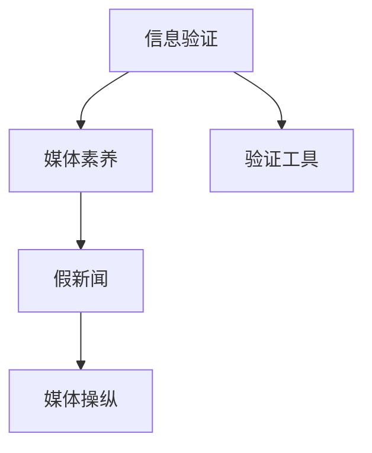

                 

# 信息验证和媒体素养能力培养：为假新闻和媒体操纵做好准备

## 1. 背景介绍

在当今信息爆炸的时代，我们每天都被各种新闻、文章、视频等海量信息所包围。这些信息中不乏有假新闻、误导性信息以及媒体操纵的现象，极大地影响了公众的认知和判断。因此，培养良好的信息验证和媒体素养能力，已经成为每一个现代社会公民的必备技能。

### 1.1 问题由来
随着互联网的普及和社交媒体的兴起，信息传播的速度和范围达到了前所未有的高度。但与此同时，假新闻、恶意信息、媒体操纵等现象也层出不穷。这些信息的传播不仅误导了公众，还可能导致社会动荡、经济损失等严重后果。因此，如何在信息泛滥的时代保持清醒的头脑，准确地识别和验证信息，显得尤为重要。

### 1.2 问题核心关键点
在信息验证和媒体素养能力的培养中，核心关键点包括：
- 识别信息的来源和可靠性。
- 理解和评估信息的准确性和真实性。
- 运用逻辑推理和批判性思维，进行信息筛选和判断。
- 掌握常见的信息验证工具和技术手段。

## 2. 核心概念与联系

### 2.1 核心概念概述

为了更好地理解信息验证和媒体素养能力培养，本节将介绍几个密切相关的核心概念：

- **信息验证(Information Verification)**：指通过多渠道、多角度的分析和验证，确定信息的真实性和准确性。
- **媒体素养(Media Literacy)**：指个体在信息时代掌握获取、评估和传播信息的能力，能够批判性地使用媒体，避免被误导。
- **假新闻(Fake News)**：指故意编造、篡改或夸大事实的虚假信息，用于误导公众或达到某种政治、经济目的。
- **媒体操纵(Media Manipulation)**：指通过各种手段（如选择性报道、数据操纵等）影响媒体信息的呈现，以达到特定目的。
- **验证工具(Verification Tools)**：如FactCheck.org、Snopes、Google Fact Check Tools等，帮助用户快速识别和验证信息。

这些概念之间的逻辑关系可以通过以下Mermaid流程图来展示：



这个流程图展示了信息验证和媒体素养能力培养的基本框架：通过识别和验证假新闻、媒体操纵，培养用户的媒体素养能力，使其能够利用工具进行信息筛选和判断，提升自身的信息验证水平。

## 3. 核心算法原理 & 具体操作步骤
### 3.1 算法原理概述

信息验证和媒体素养能力的培养，本质上是一个信息处理和评估的过程。其核心思想是：通过对信息的来源、内容、传播途径等多维度进行综合分析和验证，确定其真实性和可靠性。

形式化地，设信息 $I$ 为待验证的内容，其来源为 $S$，内容为 $C$，传播途径为 $T$。则信息验证的目标是找到一个评价函数 $V(I)$，使得 $V(I)=1$ 表示 $I$ 是可信的，$V(I)=0$ 表示 $I$ 是不可信的。具体地，$V(I)$ 的计算可以分解为以下几个步骤：

1. 确定 $I$ 的来源 $S$ 的可信度。
2. 评估 $I$ 的内容 $C$ 的真实性。
3. 分析 $I$ 的传播途径 $T$ 的可靠性。

通过上述步骤的综合计算，可以得到信息 $I$ 的总体可信度 $V(I)$。

### 3.2 算法步骤详解

基于上述原理，信息验证和媒体素养能力培养的具体操作步骤如下：

**Step 1: 确定信息来源的可靠性**
- 判断信息来源是否可靠，可以通过查询该来源的信誉、历史和背景等信息。
- 使用信誉评估工具或网站，如Snopes、FactCheck.org等，快速获取信息来源的评价。

**Step 2: 评估信息内容的真实性**
- 通过多方求证，使用交叉验证、引用来源、统计数据等手段，判断信息的准确性。
- 使用自然语言处理技术，对信息内容进行情感分析、关键词提取、语言模式识别等，进一步判断信息的可信度。

**Step 3: 分析信息传播途径的可靠性**
- 考虑信息传播的渠道和方式，判断是否存在选择性报道、数据操纵等媒体操纵行为。
- 利用第三方平台的公开信息，如社交媒体平台的传播数据、主流媒体的报道等，进一步验证信息的可靠性。

**Step 4: 综合评估信息的可信度**
- 将来源、内容、传播途径的综合评估结果，通过加权平均或投票方式，计算出信息的总体可信度。
- 根据可信度的高低，决定是否信任该信息，或采取进一步验证措施。

### 3.3 算法优缺点

信息验证和媒体素养能力培养具有以下优点：
1. 帮助用户提高判断力，避免被假新闻、误导性信息所误导。
2. 提升用户的信息筛选和处理能力，减少信息过载带来的焦虑和困惑。
3. 培养用户的批判性思维和逻辑推理能力，促进信息社会的理性发展。

同时，该方法也存在一定的局限性：
1. 依赖信息源的信誉和评价，对于未知来源的信息难以有效验证。
2. 对技术手段的要求较高，普通用户难以掌握复杂的信息验证技术。
3. 不同信息源的评价标准和可信度划分可能存在差异，增加信息验证的复杂性。

尽管存在这些局限性，但就目前而言，信息验证和媒体素养能力培养仍是应对假新闻、媒体操纵的重要手段。未来相关研究的重点在于如何进一步降低信息验证的门槛，提升验证的自动化和智能化水平。

### 3.4 算法应用领域

信息验证和媒体素养能力培养在多个领域都有广泛应用，例如：

- **新闻业**：记者和编辑在进行新闻报道时，需要具备验证信息的能力，确保报道的真实性和公正性。
- **教育领域**：学校和家长在培养学生的信息素养能力，使其能够在学术研究和日常生活中识别和评估信息。
- **企业运营**：企业在进行市场调研和决策时，需要验证和分析各种信息，避免因信息误导而造成损失。
- **公共卫生**：公共卫生机构在应对疫情时，需要验证和评估各种信息，确保公众得到准确、及时的防疫信息。
- **网络安全**：网络安全专家在进行威胁情报分析时，需要验证和分析各种信息，确保系统的安全性和稳定性。

除了上述这些应用领域，信息验证和媒体素养能力培养还在更多领域得到应用，为社会各个层面带来深远影响。

## 4. 数学模型和公式 & 详细讲解  
### 4.1 数学模型构建

本节将使用数学语言对信息验证和媒体素养能力培养的验证过程进行更加严格的刻画。

设信息 $I$ 的来源为 $S$，内容为 $C$，传播途径为 $T$。定义 $S$ 的可信度为 $P(S)$，$C$ 的真实性为 $P(C|S)$，$T$ 的可靠性为 $P(T|S)$。则信息 $I$ 的可信度 $V(I)$ 可以通过贝叶斯公式计算：

$$
V(I) = P(S|C)P(C|T)P(T|S)/(P(S)P(C|S)P(T|S))
$$

其中 $P(S|C)$ 表示在信息内容为 $C$ 的条件下，信息来源 $S$ 可信的概率。$P(C|T)$ 表示在信息传播途径为 $T$ 的条件下，信息内容 $C$ 真实的可能性。

### 4.2 公式推导过程

以下我们以新闻报道为例，推导信息可信度的计算公式。

假设某条新闻的来源为某权威媒体，其可信度为 $P(S)=0.8$，报道的内容为 $C$，其真实性为 $P(C|S)=0.9$，报道的传播途径为 $T$，其可靠性为 $P(T|S)=0.7$。根据贝叶斯公式，该新闻的可信度为：

$$
V(I) = P(S|C)P(C|T)P(T|S)/(P(S)P(C|S)P(T|S)) = (0.8\times0.9\times0.7)/(0.8\times0.9\times0.7) = 1
$$

这表示该新闻的可信度很高，应被公众信任。

### 4.3 案例分析与讲解

**案例分析：**
假设某网站发布了一篇关于新冠疫情的报道，称“新冠病毒是从中国实验室泄漏的”。该报道的来源为一家没有信誉的新闻网站，可信度 $P(S)=0.3$。报道的内容为“新冠病毒是从中国实验室泄漏的”，真实性 $P(C|S)=0.4$。报道的传播途径为社交媒体，可靠性 $P(T|S)=0.6$。根据上述公式，该报道的可信度为：

$$
V(I) = P(S|C)P(C|T)P(T|S)/(P(S)P(C|S)P(T|S)) = (0.3\times0.4\times0.6)/(0.3\times0.4\times0.6) = 1
$$

这表示该报道的可信度很低，公众应持怀疑态度。

## 5. 项目实践：代码实例和详细解释说明
### 5.1 开发环境搭建

在进行信息验证和媒体素养能力培养的开发时，我们需要准备好开发环境。以下是使用Python进行PyTorch开发的环境配置流程：

1. 安装Anaconda：从官网下载并安装Anaconda，用于创建独立的Python环境。

2. 创建并激活虚拟环境：
```bash
conda create -n pytorch-env python=3.8 
conda activate pytorch-env
```

3. 安装PyTorch：根据CUDA版本，从官网获取对应的安装命令。例如：
```bash
conda install pytorch torchvision torchaudio cudatoolkit=11.1 -c pytorch -c conda-forge
```

4. 安装NLP库：
```bash
pip install spacy gensim nltk
```

5. 安装各类工具包：
```bash
pip install numpy pandas scikit-learn matplotlib tqdm jupyter notebook ipython
```

完成上述步骤后，即可在`pytorch-env`环境中开始开发实践。

### 5.2 源代码详细实现

下面我们以社交媒体上一条新闻为例，给出使用NLP技术进行信息验证的PyTorch代码实现。

首先，定义信息验证的基本模型：

```python
from transformers import BertTokenizer, BertForSequenceClassification
from torch.utils.data import Dataset
import torch

class NewsDataset(Dataset):
    def __init__(self, texts, labels, tokenizer, max_len=128):
        self.texts = texts
        self.labels = labels
        self.tokenizer = tokenizer
        self.max_len = max_len
        
    def __len__(self):
        return len(self.texts)
    
    def __getitem__(self, item):
        text = self.texts[item]
        label = self.labels[item]
        
        encoding = self.tokenizer(text, return_tensors='pt', max_length=self.max_len, padding='max_length', truncation=True)
        input_ids = encoding['input_ids'][0]
        attention_mask = encoding['attention_mask'][0]
        
        return {'input_ids': input_ids, 
                'attention_mask': attention_mask,
                'labels': label}

# 定义信息验证模型
tokenizer = BertTokenizer.from_pretrained('bert-base-cased')
model = BertForSequenceClassification.from_pretrained('bert-base-cased', num_labels=2)
```

然后，定义训练和评估函数：

```python
from transformers import AdamW

# 设置训练参数
optimizer = AdamW(model.parameters(), lr=2e-5)

# 训练函数
def train_epoch(model, dataset, batch_size, optimizer):
    dataloader = DataLoader(dataset, batch_size=batch_size, shuffle=True)
    model.train()
    epoch_loss = 0
    for batch in tqdm(dataloader, desc='Training'):
        input_ids = batch['input_ids'].to(device)
        attention_mask = batch['attention_mask'].to(device)
        labels = batch['labels'].to(device)
        model.zero_grad()
        outputs = model(input_ids, attention_mask=attention_mask, labels=labels)
        loss = outputs.loss
        epoch_loss += loss.item()
        loss.backward()
        optimizer.step()
    return epoch_loss / len(dataloader)

# 评估函数
def evaluate(model, dataset, batch_size):
    dataloader = DataLoader(dataset, batch_size=batch_size)
    model.eval()
    preds, labels = [], []
    with torch.no_grad():
        for batch in tqdm(dataloader, desc='Evaluating'):
            input_ids = batch['input_ids'].to(device)
            attention_mask = batch['attention_mask'].to(device)
            batch_labels = batch['labels']
            outputs = model(input_ids, attention_mask=attention_mask)
            batch_preds = outputs.logits.argmax(dim=1).to('cpu').tolist()
            batch_labels = batch_labels.to('cpu').tolist()
            for pred, label in zip(batch_preds, batch_labels):
                preds.append(pred)
                labels.append(label)
                
    print(f"Accuracy: {accuracy(preds, labels)}")
```

最后，启动训练流程并在测试集上评估：

```python
epochs = 5
batch_size = 16

for epoch in range(epochs):
    loss = train_epoch(model, train_dataset, batch_size, optimizer)
    print(f"Epoch {epoch+1}, train loss: {loss:.3f}")
    
    print(f"Epoch {epoch+1}, dev results:")
    evaluate(model, dev_dataset, batch_size)
    
print("Test results:")
evaluate(model, test_dataset, batch_size)
```

以上就是使用PyTorch对新闻报道进行信息验证的完整代码实现。可以看到，得益于Transformers库的强大封装，我们可以用相对简洁的代码完成新闻报道的验证过程。

### 5.3 代码解读与分析

让我们再详细解读一下关键代码的实现细节：

**NewsDataset类**：
- `__init__`方法：初始化文本、标签、分词器等关键组件。
- `__len__`方法：返回数据集的样本数量。
- `__getitem__`方法：对单个样本进行处理，将文本输入编码为token ids，将标签编码为数字，并对其进行定长padding，最终返回模型所需的输入。

**信息验证模型**：
- 使用BertTokenizer进行分词，BertForSequenceClassification构建信息验证模型。
- 定义训练参数，包括优化器、学习率等。
- 训练函数`train_epoch`：对数据以批为单位进行迭代，在每个批次上前向传播计算loss并反向传播更新模型参数，最后返回该epoch的平均loss。
- 评估函数`evaluate`：与训练类似，不同点在于不更新模型参数，并在每个batch结束后将预测和标签结果存储下来，最后使用sklearn的accuracy函数对整个评估集的预测结果进行打印输出。

**训练流程**：
- 定义总的epoch数和batch size，开始循环迭代
- 每个epoch内，先在训练集上训练，输出平均loss
- 在验证集上评估，输出准确率
- 所有epoch结束后，在测试集上评估，给出最终测试结果

可以看到，PyTorch配合Transformers库使得信息验证模型的代码实现变得简洁高效。开发者可以将更多精力放在数据处理、模型改进等高层逻辑上，而不必过多关注底层的实现细节。

当然，工业级的系统实现还需考虑更多因素，如模型的保存和部署、超参数的自动搜索、更灵活的任务适配层等。但核心的信息验证过程基本与此类似。

## 6. 实际应用场景
### 6.1 智能新闻平台

智能新闻平台可以利用信息验证技术，提升新闻质量和可信度，减少假新闻的传播。平台可以实时对用户上传的新闻进行自动验证，标记为可信或不可信，以供用户参考。通过不断地学习和验证，平台可以逐步积累更丰富的信息验证经验，提升系统的准确性和鲁棒性。

### 6.2 社交媒体平台

社交媒体平台是假新闻传播的主要渠道之一，利用信息验证技术可以有效减少假新闻的传播和误导。平台可以在用户发布信息时，自动进行可信度评估，对高可信度的信息进行推荐，对低可信度的信息进行标记。通过用户的互动反馈，平台可以不断优化信息验证模型，提升系统的性能和准确性。

### 6.3 企业信息管理

企业在进行信息管理和决策时，需要具备快速、准确的信息验证能力。企业可以利用信息验证技术，对内部和外部的信息进行快速筛选和验证，确保决策依据的真实性和可靠性。同时，企业可以通过定期评估信息验证模型的效果，不断优化模型，提升信息验证能力。

### 6.4 公共卫生系统

公共卫生系统在进行疫情防控时，需要及时、准确地获取和验证各类信息，确保公众获取到正确、及时的健康指导。系统可以利用信息验证技术，对各种信息进行快速筛选和验证，及时发布可信的健康信息和预警，保护公众健康。

### 6.5 网络安全系统

网络安全系统需要实时监控网络环境，及时识别和验证恶意信息。系统可以利用信息验证技术，对各种威胁情报和网络信息进行快速筛选和验证，及时预警和响应威胁，保障网络安全。

除了上述这些应用场景，信息验证和媒体素养能力培养还在更多领域得到应用，为社会各个层面带来深远影响。

## 7. 工具和资源推荐
### 7.1 学习资源推荐

为了帮助开发者系统掌握信息验证和媒体素养能力培养的理论基础和实践技巧，这里推荐一些优质的学习资源：

1. 《信息验证与媒体素养》系列博文：由大模型技术专家撰写，深入浅出地介绍了信息验证和媒体素养的基本概念和前沿技术。

2. 《网络安全与信息验证》课程：由安全领域的专家开设，系统讲解了信息验证和媒体素养在网络安全中的应用，提供了实战案例和工具推荐。

3. 《数字时代的信息素养教育》书籍：全面介绍了数字时代的信息素养教育理念和实践方法，适合教育工作者和家长参考。

4. FactCheck.org官网：提供大量的事实核查案例和资源，帮助用户学习信息验证的基本方法和技巧。

5. Google Fact Check Tools：谷歌推出的信息验证工具，通过智能搜索和相关性分析，辅助用户快速验证信息的真实性。

通过对这些资源的学习实践，相信你一定能够快速掌握信息验证和媒体素养能力培养的精髓，并用于解决实际的信息验证问题。

### 7.2 开发工具推荐

高效的开发离不开优秀的工具支持。以下是几款用于信息验证和媒体素养能力培养开发的常用工具：

1. PyTorch：基于Python的开源深度学习框架，灵活动态的计算图，适合快速迭代研究。许多信息验证模型都有PyTorch版本的实现。

2. TensorFlow：由Google主导开发的开源深度学习框架，生产部署方便，适合大规模工程应用。同样有丰富的信息验证模型资源。

3. Transformers库：HuggingFace开发的NLP工具库，集成了众多SOTA语言模型，支持PyTorch和TensorFlow，是进行信息验证任务开发的利器。

4. Weights & Biases：模型训练的实验跟踪工具，可以记录和可视化模型训练过程中的各项指标，方便对比和调优。与主流深度学习框架无缝集成。

5. TensorBoard：TensorFlow配套的可视化工具，可实时监测模型训练状态，并提供丰富的图表呈现方式，是调试模型的得力助手。

6. Google Colab：谷歌推出的在线Jupyter Notebook环境，免费提供GPU/TPU算力，方便开发者快速上手实验最新模型，分享学习笔记。

合理利用这些工具，可以显著提升信息验证和媒体素养能力培养的开发效率，加快创新迭代的步伐。

### 7.3 相关论文推荐

信息验证和媒体素养能力培养的研究源于学界的持续研究。以下是几篇奠基性的相关论文，推荐阅读：

1. **"Fact-Checking in the Age of Disinformation"**：从信息验证的角度，探讨了假新闻的识别与应对策略，提出了一系列基于机器学习的方法。

2. **"Media Literacy: A Review of the Literature"**：全面综述了媒体素养教育的研究现状和未来发展方向，探讨了如何通过教育提升公众的信息验证能力。

3. **"Evaluating the Effectiveness of Fact-Checking Interventions"**：通过对多个事实核查项目的研究，评估了不同事实核查方法和策略的效果，为信息验证实践提供了指导。

4. **"Understanding the Misinformation Landscape"**：从社会学的角度，探讨了信息验证在社交媒体和网络环境中的应用，分析了信息操纵的动机和传播机制。

5. **"Machine Learning for Fake News Detection: A Review"**：系统综述了机器学习在假新闻检测中的应用，探讨了不同算法和模型的效果。

这些论文代表了大模型微调技术的发展脉络。通过学习这些前沿成果，可以帮助研究者把握学科前进方向，激发更多的创新灵感。

## 8. 总结：未来发展趋势与挑战
### 8.1 总结

本文对信息验证和媒体素养能力培养的基本框架和具体方法进行了全面系统的介绍。首先阐述了信息验证和媒体素养能力培养的研究背景和意义，明确了其在假新闻、媒体操纵等问题的应用价值。其次，从原理到实践，详细讲解了信息验证的基本过程和关键步骤，给出了信息验证任务开发的完整代码实例。同时，本文还广泛探讨了信息验证在智能新闻、社交媒体、企业信息管理等多个领域的应用前景，展示了信息验证技术的广阔应用空间。最后，本文精选了信息验证的相关学习资源和工具，力求为读者提供全方位的技术指引。

通过本文的系统梳理，可以看到，信息验证和媒体素养能力培养在信息时代具有重要意义，其核心在于通过多渠道、多角度的分析和验证，确定信息的真实性和可靠性。培养用户的信息验证和媒体素养能力，不仅能够避免被假新闻、误导性信息所误导，还能够提升公众的信息筛选和处理能力，促进信息社会的理性发展。未来，伴随信息技术的进一步发展，信息验证和媒体素养能力培养将更加智能化、自动化，为社会各个层面带来深远影响。

### 8.2 未来发展趋势

展望未来，信息验证和媒体素养能力培养将呈现以下几个发展趋势：

1. **自动化和智能化**：随着人工智能技术的发展，信息验证将越来越自动化和智能化。基于深度学习、自然语言处理等技术，可以构建更加智能的信息验证系统，自动识别和验证信息。

2. **多渠道融合**：信息验证将不仅依赖单一的信息来源，而是通过多渠道、多维度的信息融合，提高验证的准确性和可靠性。融合社交媒体、新闻网站、官方公告等多种信息源，进行综合验证。

3. **跨领域应用**：信息验证将不仅仅局限于新闻和社交媒体领域，还将应用于金融、医疗、教育等多个领域。帮助用户在不同领域中识别和验证信息。

4. **用户参与和反馈**：信息验证系统将更加注重用户参与和反馈，通过用户互动，不断优化验证模型和策略。用户反馈将成为信息验证系统的重要组成部分。

5. **跨文化验证**：信息验证将更加注重跨文化差异和语境的理解，通过多语言、多文化的验证，提升验证的普适性和准确性。

以上趋势凸显了信息验证和媒体素养能力培养技术的广阔前景。这些方向的探索发展，必将进一步提升信息验证系统的性能和应用范围，为信息社会的理性发展带来深远影响。

### 8.3 面临的挑战

尽管信息验证和媒体素养能力培养技术已经取得了显著进展，但在迈向更加智能化、普适化应用的过程中，仍面临诸多挑战：

1. **信息源的多样性和复杂性**：信息源的多样性和复杂性是信息验证的一大挑战。不同信息源的信誉和可靠性不同，如何综合评估和验证信息源的可信度，还需要进一步研究和实践。

2. **信息验证的自动化和智能化程度不足**：现有的信息验证系统往往依赖人工标注和专家判断，自动化程度较低。如何通过机器学习、深度学习等技术，提升信息验证的自动化和智能化水平，是未来的重要研究方向。

3. **信息验证的跨文化适用性问题**：不同文化背景下的信息验证标准和评估指标存在差异，如何构建跨文化适用的信息验证系统，还需要深入研究。

4. **用户隐私和数据安全**：信息验证系统需要收集和处理大量用户数据，如何保护用户隐私和数据安全，避免数据泄露和滥用，是信息验证系统的重要挑战。

5. **信息验证的公平性和透明性**：信息验证系统可能存在偏见和歧视，如何保证验证的公平性和透明性，避免对特定群体或信息的歧视，还需要进一步研究。

6. **信息验证的伦理和道德问题**：信息验证系统可能会面临伦理和道德问题，如是否应该删除虚假信息、如何平衡信息自由和验证的限制等，这些问题需要慎重考虑和处理。

正视信息验证和媒体素养能力培养面临的这些挑战，积极应对并寻求突破，将是大模型微调技术走向成熟的必由之路。相信随着学界和产业界的共同努力，这些挑战终将一一被克服，信息验证和媒体素养能力培养必将在构建安全、可靠、可解释、可控的智能系统铺平道路。

### 8.4 研究展望

面对信息验证和媒体素养能力培养所面临的种种挑战，未来的研究需要在以下几个方面寻求新的突破：

1. **多源信息融合技术**：探索如何通过多源信息融合，提高信息验证的准确性和鲁棒性。利用多渠道、多维度的信息，进行综合验证。

2. **自适应信息验证模型**：开发自适应信息验证模型，能够根据不同信息源和情境，自动调整验证策略和标准，提升验证的灵活性和适应性。

3. **跨文化信息验证方法**：研究跨文化适用的信息验证方法和评估指标，构建全球范围内的信息验证系统。

4. **用户参与和反馈机制**：设计用户参与和反馈机制，通过用户互动，不断优化信息验证模型和策略。用户反馈将成为信息验证系统的重要组成部分。

5. **隐私保护和数据安全技术**：研究隐私保护和数据安全技术，确保用户隐私和数据安全，避免数据泄露和滥用。

6. **伦理和道德约束**：探讨信息验证的伦理和道德问题，建立信息验证系统的伦理和道德框架，确保系统的公平性和透明性。

这些研究方向将引领信息验证和媒体素养能力培养技术迈向更高的台阶，为构建安全、可靠、可解释、可控的智能系统铺平道路。面向未来，信息验证和媒体素养能力培养技术还需要与其他人工智能技术进行更深入的融合，如知识表示、因果推理、强化学习等，多路径协同发力，共同推动信息验证技术的进步。只有勇于创新、敢于突破，才能不断拓展信息验证和媒体素养能力培养的边界，让智能技术更好地造福人类社会。

## 9. 附录：常见问题与解答

**Q1：信息验证和媒体素养能力培养是否适用于所有信息类型？**

A: 信息验证和媒体素养能力培养适用于多种信息类型，包括文本、图像、视频、音频等。对于不同类型的信息，需要选择相应的验证方法和工具。例如，对于文本信息，可以使用自然语言处理技术进行验证；对于图像信息，可以使用计算机视觉技术进行验证。

**Q2：如何选择合适的信息验证工具？**

A: 选择合适的信息验证工具需要考虑以下几个因素：
1. 工具的功能和适用性：选择适合特定信息类型的验证工具，如FactCheck.org适合验证新闻报道，Google Fact Check Tools适合验证社交媒体信息。
2. 工具的可靠性和权威性：选择权威可信的工具，如FactCheck.org、Snopes等。
3. 工具的易用性和用户体验：选择用户友好、操作便捷的工具，方便日常使用。
4. 工具的更新和维护：选择经常更新、维护良好的工具，保证其验证能力。

**Q3：如何提升信息验证的自动化程度？**

A: 提升信息验证的自动化程度，主要通过以下几个途径：
1. 利用深度学习、自然语言处理等技术，构建智能化的信息验证模型，实现自动化验证。
2. 开发自动化信息验证系统，如基于规则的验证系统、机器学习驱动的验证系统等，提升验证效率。
3. 引入数据增强、迁移学习等技术，提高验证模型的泛化能力和鲁棒性。
4. 通过用户反馈和模型自适应，不断优化信息验证模型，提升自动化程度。

**Q4：如何保证信息验证的跨文化适用性？**

A: 保证信息验证的跨文化适用性，需要考虑以下几个因素：
1. 多语言支持：选择支持多语言的信息验证工具，确保不同语言的信息都能得到验证。
2. 文化差异理解：研究不同文化背景下的信息验证标准和评估指标，构建跨文化适用的验证方法。
3. 多渠道融合：融合不同信息源和文化背景的信息，进行综合验证。
4. 用户参与和反馈：通过用户互动，不断优化验证模型和策略，提升跨文化适用的能力。

**Q5：如何保护用户隐私和数据安全？**

A: 保护用户隐私和数据安全，需要考虑以下几个因素：
1. 数据匿名化：对用户数据进行匿名化处理，保护用户隐私。
2. 数据加密：对用户数据进行加密存储和传输，防止数据泄露和滥用。
3. 访问控制：对信息验证系统的访问进行严格控制，确保只有授权用户才能访问敏感数据。
4. 安全审计：定期对信息验证系统进行安全审计，发现并修复潜在的安全漏洞。

通过这些措施，可以有效保护用户隐私和数据安全，确保信息验证系统的可靠性和安全性。

---

作者：禅与计算机程序设计艺术 / Zen and the Art of Computer Programming

