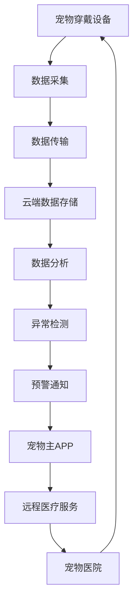

                 

**智能宠物健康监测创业：预防性宠物医疗**

**作者：禅与计算机程序设计艺术 / Zen and the Art of Computer Programming**

## 1. 背景介绍

当今社会，宠物已然成为家庭成员，宠物主对宠物的关爱和呵护也与日俱增。然而，宠物的健康状况监测和疾病预防仍面临着挑战。传统的宠物医疗模式以治疗为主，缺乏有效的预防手段。智能宠物健康监测系统的出现，为预防性宠物医疗提供了可能。

## 2. 核心概念与联系

智能宠物健康监测系统的核心是将物联网、人工智能和大数据技术相结合，实现对宠物健康状况的实时监测和预警。以下是系统的核心概念和架构：



## 3. 核心算法原理 & 具体操作步骤

### 3.1 算法原理概述

本系统的核心算法是基于机器学习的异常检测算法。它通过学习宠物的正常生理参数，建立模型，然后检测实时数据是否异常。

### 3.2 算法步骤详解

1. **数据预处理**：清洗、缺失值填充、特征工程等。
2. **模型训练**：使用正常数据训练异常检测模型。
3. **实时数据检测**：将实时数据输入模型，检测是否异常。
4. **预警通知**：当检测到异常时，发送预警通知。

### 3.3 算法优缺点

**优点**：能够及早发现宠物的异常状况，有助于预防疾病。

**缺点**：可能会出现误报或漏报，需要不断优化模型。

### 3.4 算法应用领域

除宠物健康监测外，该算法还可应用于人体健康监测、工业设备故障检测等领域。

## 4. 数学模型和公式 & 详细讲解 & 举例说明

### 4.1 数学模型构建

本系统使用异常检测算法中的 Isolation Forest 算法。其数学模型构建如下：

给定数据集 $D$ 和异常检测阈值 $\epsilon$。构建 Isolation Forest 算法的过程如下：

1. 从数据集 $D$ 中随机选择一个特征 $f_i$ 和一个阈值 $t$。
2. 将数据集 $D$ 按照 $f_i < t$ 和 $f_i \geq t$ 分成两个子集。
3. 重复步骤 1 和 2，直到构建出一棵决策树。
4. 计算每个样本的异常分数 $s(x) = 2^{-h(x)}$，其中 $h(x)$ 是样本 $x$ 到最近叶子节点的路径长度。
5. 如果异常分数 $s(x) < \epsilon$，则标记样本 $x$ 为异常。

### 4.2 公式推导过程

 Isolation Forest 算法的异常分数公式 $s(x) = 2^{-h(x)}$ 来自于以下推导：

设决策树的高度为 $h$。对于一棵随机构建的决策树，正常样本到最近叶子节点的平均路径长度为 $E[h] = O(\log(t))$，其中 $t$ 是样本数。而异常样本到最近叶子节点的路径长度为 $E[h'] = O(\log(\frac{1}{p}))$，其中 $p$ 是异常样本的比例。因此，异常样本的异常分数为 $s(x) = 2^{-h'}$。

### 4.3 案例分析与讲解

例如，在宠物体重监测中，如果宠物的体重在短时间内剧烈波动，则可能是异常情况。 Isolation Forest 算法可以检测出这种异常情况。

## 5. 项目实践：代码实例和详细解释说明

### 5.1 开发环境搭建

本项目使用 Python 语言开发，需要安装以下库：Pandas、Numpy、Scikit-learn、Matplotlib。

### 5.2 源代码详细实现

以下是 Isolation Forest 算法的 Python 实现：

```python
from sklearn.ensemble import IsolationForest
import numpy as np
import pandas as pd

# 读取数据
data = pd.read_csv('hpet_data.csv')

# 数据预处理
X = data.iloc[:, 1:].values

# 训练模型
clf = IsolationForest(contamination=0.01)
y_pred = clf.fit_predict(X)

# 检测异常
anomalies = X[y_pred == -1]
```

### 5.3 代码解读与分析

代码首先读取宠物数据，然后进行数据预处理。之后，使用 Scikit-learn 库中的 Isolation Forest 算法训练模型，并对数据进行异常检测。

### 5.4 运行结果展示

运行结果将显示出异常数据的特征值。

## 6. 实际应用场景

### 6.1 当前应用

智能宠物健康监测系统已在部分宠物医院和宠物主中推广应用，取得了良好的效果。

### 6.2 未来应用展望

未来，智能宠物健康监测系统有望与物联网、人工智能和大数据技术更深度地结合，实现对宠物的全方位监测和预防性医疗。

## 7. 工具和资源推荐

### 7.1 学习资源推荐

- 书籍：《机器学习》作者：Tom M. Mitchell
- 课程：[机器学习](https://www.coursera.org/learn/machine-learning) 由 Stanford University 提供

### 7.2 开发工具推荐

- Python：[Anaconda](https://www.anaconda.com/)
- 数据库：[MongoDB](https://www.mongodb.com/)

### 7.3 相关论文推荐

- [Isolation Forest](https://www.vldb.org/pvldb/vol8/p1768-liu.pdf) 由 Liu, F., Zhou, T., & Wang, Y. 提出

## 8. 总结：未来发展趋势与挑战

### 8.1 研究成果总结

智能宠物健康监测系统的研究成果为预防性宠物医疗提供了可能，有助于提高宠物的生命质量和寿命。

### 8.2 未来发展趋势

未来，智能宠物健康监测系统有望与更多技术结合，实现对宠物的更全面、更精确的监测和预防性医疗。

### 8.3 面临的挑战

挑战包括数据安全、模型准确性等。

### 8.4 研究展望

未来的研究方向包括模型优化、数据安全等。

## 9. 附录：常见问题与解答

**Q：如何避免误报或漏报？**

**A：不断优化模型，并结合专业医疗意见。**

**Q：如何保证数据安全？**

**A：使用加密技术保护数据，并遵循数据保护法规。**

**Q：如何使用该系统？**

**A：只需将宠物穿戴设备佩戴在宠物身上，并下载宠物主APP即可。**

**END**

