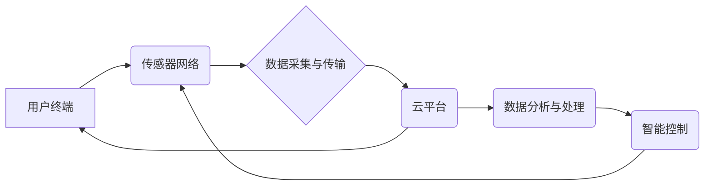

                 

## 智能居家植物照护创业：科技辅助的室内园艺管理

> 关键词：智能家居、植物照护、物联网、传感器、机器学习、数据分析、室内园艺

## 1. 背景介绍

近年来，随着人们生活水平的提高和对自然环境的关注度增强，室内园艺逐渐成为一种流行的休闲方式和生活方式。然而，室内植物的养护需要一定的专业知识和经验，许多人由于时间、精力或专业技能的限制，难以成功养护植物。

智能家居技术的快速发展为解决这一问题提供了新的机遇。通过传感器、物联网、人工智能等技术的融合，可以实现对植物生长环境的实时监测和智能控制，为用户提供科学、便捷的植物照护解决方案。

## 2. 核心概念与联系

智能居家植物照护系统主要基于以下核心概念：

* **物联网 (IoT):** 通过传感器、网络连接和数据传输技术，将植物、环境监测设备和用户终端连接起来，实现数据实时采集和远程控制。
* **传感器技术:** 用于监测植物生长环境的关键参数，例如光照强度、温度、湿度、土壤水分、营养元素含量等。
* **数据分析:** 对传感器采集到的数据进行分析和处理，识别植物生长状态、预警潜在问题，并提供个性化养护建议。
* **人工智能 (AI):** 利用机器学习算法，建立植物生长模型，预测植物需求，并自动调节环境参数，实现智能化养护。

**核心架构流程图:**



## 3. 核心算法原理 & 具体操作步骤

### 3.1  算法原理概述

智能居家植物照护系统中常用的算法包括：

* **植物生长模型:** 基于植物生理学原理，建立数学模型，模拟植物生长过程，预测植物对环境参数的需求。
* **机器学习算法:** 利用历史数据训练模型，识别植物生长状态、预警潜在问题，并提供个性化养护建议。常见的算法包括决策树、支持向量机、神经网络等。
* **控制算法:** 根据植物生长模型和机器学习算法的预测结果，自动调节环境参数，例如光照强度、温度、湿度、灌溉量等。

### 3.2  算法步骤详解

**以植物生长模型为例，详细说明算法步骤:**

1. **数据收集:** 收集植物生长环境参数（光照强度、温度、湿度、土壤水分等）和植物生长指标（高度、叶面积、开花时间等）的数据。
2. **数据预处理:** 对收集到的数据进行清洗、转换、归一化等处理，去除噪声和异常值，使数据更适合模型训练。
3. **模型构建:** 选择合适的数学模型，例如Logistic回归、线性回归、非线性回归等，并根据收集到的数据进行模型训练。
4. **模型评估:** 利用测试数据评估模型的准确性，并根据评估结果调整模型参数，提高模型性能。
5. **模型应用:** 将训练好的模型应用于实际场景，根据植物生长环境参数预测植物生长指标，并提供个性化养护建议。

### 3.3  算法优缺点

**植物生长模型的优缺点:**

* **优点:** 可以预测植物生长趋势，为用户提供科学的养护建议。
* **缺点:** 模型精度受数据质量和模型复杂度影响，难以完全模拟植物生长过程的复杂性。

### 3.4  算法应用领域

植物生长模型和机器学习算法在智能居家植物照护系统中广泛应用，例如：

* **植物生长状态监测:** 识别植物健康状况，预警病虫害和营养缺乏等问题。
* **个性化养护建议:** 根据植物种类、生长环境和用户需求，提供个性化的浇水、施肥、光照等养护建议。
* **自动控制:** 自动调节环境参数，例如光照强度、温度、湿度、灌溉量等，实现智能化养护。

## 4. 数学模型和公式 & 详细讲解 & 举例说明

### 4.1  数学模型构建

植物生长模型通常基于植物生理学原理，将植物生长过程描述为一系列数学方程。例如，可以建立一个描述植物光合作用的模型：

$$
P = \alpha I (1 - e^{-\beta I})
$$

其中：

* $P$：光合作用速率
* $I$：光照强度
* $\alpha$：光合作用效率
* $\beta$：光饱和度系数

### 4.2  公式推导过程

该公式的推导过程基于光合作用的生理机制：

* 光合作用速率与光照强度呈正相关，但存在饱和效应。
* 当光照强度较低时，光合作用速率随光照强度的增加而线性增加。
* 当光照强度较高时，光合作用速率趋于饱和，不再随着光照强度的增加而显著增加。

### 4.3  案例分析与讲解

假设一个植物的 $\alpha$ 值为 0.1，$\beta$ 值为 0.05，当光照强度为 1000 Lux 时，该植物的光合作用速率为：

$$
P = 0.1 * 1000 (1 - e^{-0.05 * 1000}) \approx 99.3
$$

该结果表明，当光照强度为 1000 Lux 时，该植物的光合作用速率较高，说明该光照强度适合该植物的生长。

## 5. 项目实践：代码实例和详细解释说明

### 5.1  开发环境搭建

智能居家植物照护系统开发环境通常包括：

* **硬件平台:** 基于微控制器或单片机的硬件平台，用于控制传感器和执行器。
* **软件平台:** 基于 Linux 或其他嵌入式操作系统的软件平台，用于数据采集、处理和控制。
* **云平台:** 用于数据存储、分析和用户交互的云平台。

### 5.2  源代码详细实现

以下是一个简单的 Python 代码示例，用于模拟植物生长模型：

```python
import numpy as np

class PlantGrowthModel:
    def __init__(self, alpha=0.1, beta=0.05):
        self.alpha = alpha
        self.beta = beta

    def photosynthesis(self, light_intensity):
        return self.alpha * light_intensity * (1 - np.exp(-self.beta * light_intensity))

# 实例化植物生长模型
model = PlantGrowthModel()

# 模拟光照强度变化
light_intensities = np.arange(0, 1000, 100)

# 计算光合作用速率
photosynthesis_rates = model.photosynthesis(light_intensities)

# 打印结果
print(f"Light Intensity (Lux) | Photosynthesis Rate")
print("---------------------------------------")
for i, intensity in enumerate(light_intensities):
    print(f"{intensity:10} | {photosynthesis_rates[i]:10.2f}")
```

### 5.3  代码解读与分析

该代码定义了一个 `PlantGrowthModel` 类，用于模拟植物光合作用。

* `__init__` 方法初始化模型参数 `alpha` 和 `beta`。
* `photosynthesis` 方法根据光照强度计算光合作用速率。
* 代码示例模拟了光照强度从 0 到 1000 Lux 的变化，并计算了相应的光合作用速率。

### 5.4  运行结果展示

运行该代码后，会输出一个表格，展示光照强度和光合作用速率之间的关系。

## 6. 实际应用场景

智能居家植物照护系统可以应用于以下场景：

* **家庭养花:** 为家庭用户提供智能化的植物养护解决方案，帮助用户轻松养护各种植物。
* **办公室绿化:** 为办公室环境提供绿化解决方案，改善空气质量，提升工作效率。
* **垂直农场:** 为垂直农场提供智能化的环境控制和植物管理解决方案，提高种植效率和产量。
* **教育科研:** 为植物学教育和科研提供数据采集和分析工具，促进植物科学研究。

### 6.4  未来应用展望

未来，智能居家植物照护系统将更加智能化、个性化和生态化。

* **更智能的算法:** 利用更先进的机器学习算法，实现更精准的植物生长预测和养护建议。
* **更个性化的服务:** 根据用户的喜好和需求，提供个性化的植物推荐和养护方案。
* **更生态的解决方案:** 与其他智能家居设备协同工作，实现更加智能、高效、环保的植物照护生态系统。

## 7. 工具和资源推荐

### 7.1  学习资源推荐

* **书籍:**
    * 《植物生理学》
    * 《人工智能导论》
    * 《物联网技术》
* **在线课程:**
    * Coursera: Machine Learning
    * edX: Introduction to Artificial Intelligence
    * Udacity: IoT Developer Nanodegree

### 7.2  开发工具推荐

* **硬件平台:** Arduino, Raspberry Pi
* **软件平台:** Python, Node.js
* **云平台:** AWS, Azure, Google Cloud

### 7.3  相关论文推荐

* **机器学习在植物生长预测中的应用:**
    * "Deep Learning for Plant Growth Prediction"
    * "A Machine Learning Approach to Predicting Plant Growth"
* **物联网在植物照护中的应用:**
    * "Smart Irrigation Systems for Indoor Plants Using IoT"
    * "A Review of IoT-Based Smart Agriculture Systems"

## 8. 总结：未来发展趋势与挑战

### 8.1  研究成果总结

智能居家植物照护系统是物联网、人工智能、植物生理学等多学科交叉融合的产物，具有巨大的发展潜力。

* **技术进步:** 随着人工智能、物联网等技术的不断发展，智能居家植物照护系统将更加智能化、精准化和个性化。
* **市场需求:** 随着人们对绿色生活的追求和对智能家居的接受度提高，智能居家植物照护系统的市场需求将不断增长。

### 8.2  未来发展趋势

* **更精准的植物生长预测:** 利用更先进的机器学习算法和传感器技术，实现更精准的植物生长预测，为用户提供更科学的养护建议。
* **更个性化的养护方案:** 根据用户的喜好、植物种类和生长环境，提供个性化的养护方案，满足不同用户的需求。
* **更智能的生态系统:** 与其他智能家居设备协同工作，实现更加智能、高效、环保的植物照护生态系统。

### 8.3  面临的挑战

* **数据获取和处理:** 收集高质量的植物生长数据和处理这些数据仍然是一个挑战。
* **模型精度:** 现有的植物生长模型仍然难以完全模拟植物生长过程的复杂性，模型精度需要进一步提高。
* **成本控制:** 智能居家植物照护系统的硬件和软件成本仍然较高，需要进一步降低成本，使其更加普及。

### 8.4  研究展望

未来，智能居家植物照护系统将朝着更加智能化、个性化、生态化的方向发展，为人们提供更加便捷、高效、环保的植物养护解决方案。


## 9. 附录：常见问题与解答

**Q1: 智能居家植物照护系统需要哪些硬件设备？**

**A1:** 智能居家植物照护系统通常需要以下硬件设备：

* **传感器:** 用于监测植物生长环境参数，例如光照强度、温度、湿度、土壤水分等。
* **执行器:** 用于控制环境参数，例如喷水器、加热器、通风扇等。
* **微控制器或单片机:** 用于数据采集、处理和控制执行器。
* **无线网络模块:** 用于将数据传输到云平台。

**Q2: 如何选择合适的植物生长模型？**

**A2:** 选择合适的植物生长模型需要考虑以下因素：

* **植物种类:** 不同植物的生长特性不同，需要选择相应的模型。
* **数据质量:** 模型精度受数据质量影响，需要确保数据准确可靠。
* **模型复杂度:** 模型复杂度越高，精度越高，但计算成本也越高。

**Q3: 智能居家植物照护系统有哪些安全隐患？**

**A3:** 智能居家植物照护系统存在以下安全隐患：

* **数据泄露:** 用户数据可能被黑客攻击或泄露。
* **设备被攻击:** 攻击者可能利用漏洞控制设备，造成安全隐患。
* **隐私问题:** 设备可能收集用户的个人信息，需要妥善处理用户隐私问题。


作者：禅与计算机程序设计艺术 / Zen and the Art of Computer Programming 
<end_of_turn>

