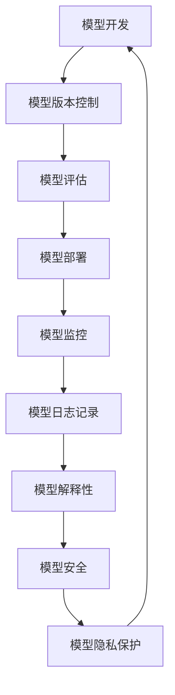

                 

## 1. 背景介绍

机器学习（Machine Learning）的应用已经渗透到各个行业，从搜索引擎到自动驾驶，从金融风控到医疗影像诊断，机器学习模型的部署和维护变得越来越重要。机器学习运维（MLOps）就是为了解决这个问题而产生的一个新的领域，它是机器学习和软件工程的结合，目的是提高机器学习模型的可靠性、可用性和可解释性。

## 2. 核心概念与联系

MLOps的核心概念包括持续集成/持续部署（CI/CD）、模型版本控制、模型监控和日志记录、模型解释性和可解释性、模型安全和隐私保护等。这些概念是相互关联的，构成了一个完整的MLOps生命周期。下面是这些概念的Mermaid流程图：

## 3. 核心算法原理 & 具体操作步骤

### 3.1 算法原理概述

MLOps的核心算法原理是CI/CD，它是软件工程领域的一个成熟的方法，被广泛应用于软件开发。CI/CD的目的是自动化软件开发过程，提高软件开发的效率和质量。在MLOps中，CI/CD被用于自动化机器学习模型的开发、测试和部署过程。

### 3.2 算法步骤详解

CI/CD的步骤包括：

1. 开发人员将代码提交到版本控制系统（如Git）。
2.  Continuous Integration（持续集成）系统（如Jenkins）自动检测代码变更，并触发构建过程。
3. 构建系统自动下载依赖项，编译代码，运行单元测试，并生成可部署的模型。
4.  Continuous Deployment（持续部署）系统（如Kubernetes）自动将模型部署到生产环境。
5. 模型部署后，监控系统（如Prometheus）自动监控模型的性能和健康状况。
6. 如果模型出现问题，自动化系统会发出警报，并触发模型日志记录系统（如ELK Stack）记录模型的日志信息。
7. 如果模型需要更新，开发人员可以通过版本控制系统提交新的代码，并重复CI/CD过程。

### 3.3 算法优缺点

CI/CD的优点包括：

* 自动化：CI/CD自动化了机器学习模型的开发、测试和部署过程，提高了效率和可靠性。
* 可追溯性：CI/CD系统记录了每个模型版本的变更历史，方便追溯和调试。
* 可扩展性：CI/CD系统可以轻松扩展到大规模的机器学习项目。

CI/CD的缺点包括：

* 复杂性：CI/CD系统需要一定的设置和维护工作，对开发人员提出了更高的要求。
* 成本：CI/CD系统需要购买和维护相关软件和硬件，增加了成本。

### 3.4 算法应用领域

CI/CD在机器学习领域的应用包括：

* 机器学习模型的自动化部署和更新。
* 机器学习模型的持续集成和持续测试。
* 机器学习模型的监控和日志记录。
* 机器学习模型的版本控制和可追溯性。

## 4. 数学模型和公式 & 详细讲解 & 举例说明

### 4.1 数学模型构建

在MLOps中，数学模型主要用于模型评估和模型监控。模型评估的数学模型包括：

* 精确度（Accuracy）：$P(C|x) = \frac{TP}{TP+FP}$
* 召回率（Recall）：$P(C|x) = \frac{TP}{TP+FN}$
* F1分数（F1 Score）：$F1 = 2 \times \frac{Precision \times Recall}{Precision + Recall}$

其中，TP表示真正例，FP表示假正例，FN表示假负例。

### 4.2 公式推导过程

上述公式的推导过程如下：

* 精确度（Accuracy）：精确度是指模型预测为正例的样本中，真正例的比例。它衡量了模型的准确性。
* 召回率（Recall）：召回率是指真正例样本中，被模型预测为正例的比例。它衡量了模型的完整性。
* F1分数（F1 Score）：F1分数是精确度和召回率的调和平均值。它平衡了精确度和召回率，衡量了模型的综合性能。

### 4.3 案例分析与讲解

例如，假设我们有以下混淆矩阵：

|       | 实际为正例 | 实际为负例 |
|-------|------------|------------|
| 预测为正例 | 80         | 20         |
| 预测为负例 | 10         | 90         |

那么，精确度（Accuracy）为$\frac{80}{80+20} = 0.8$或80%；召回率（Recall）为$\frac{80}{80+10} = 0.89$或89%；F1分数（F1 Score）为$2 \times \frac{0.8 \times 0.89}{0.8 + 0.89} = 0.84$或84%。

## 5. 项目实践：代码实例和详细解释说明

### 5.1 开发环境搭建

要实现CI/CD，我们需要搭建一个开发环境。这个环境包括：

* 版本控制系统（如Git）
* 持续集成系统（如Jenkins）
* 持续部署系统（如Kubernetes）
* 模型监控系统（如Prometheus）
* 模型日志记录系统（如ELK Stack）

### 5.2 源代码详细实现

以下是一个简单的CI/CD示例，使用Jenkins作为持续集成系统，Kubernetes作为持续部署系统，Prometheus作为模型监控系统。

1. 在Jenkins中创建一个新的构建任务，并配置它监听Git仓库的变更。
2. 在构建任务中，配置Jenkins构建模型代码，运行单元测试，并生成可部署的模型。
3. 在构建任务中，配置Jenkins将模型部署到Kubernetes集群。
4. 在Kubernetes集群中，配置Prometheus监控模型的性能和健康状况。
5. 在Kubernetes集群中，配置ELK Stack记录模型的日志信息。

### 5.3 代码解读与分析

在上述示例中，Jenkins是CI/CD的核心，它监听Git仓库的变更，并触发构建过程。Kubernetes是模型部署的平台，它提供了模型部署和扩展的能力。Prometheus是模型监控的系统，它监控模型的性能和健康状况。ELK Stack是模型日志记录的系统，它记录模型的日志信息，方便调试和分析。

### 5.4 运行结果展示

在上述示例中，当开发人员提交代码到Git仓库时，Jenkins会自动检测到变更，并触发构建过程。构建过程包括模型代码的构建、单元测试的运行、模型的生成和部署。模型部署后，Prometheus会自动监控模型的性能和健康状况，并记录日志信息。如果模型出现问题，Prometheus会发出警报，并触发ELK Stack记录模型的日志信息。

## 6. 实际应用场景

MLOps的实际应用场景包括：

### 6.1 机器学习模型的自动化部署和更新

MLOps可以自动化机器学习模型的部署和更新过程，提高模型的可用性和可靠性。

### 6.2 机器学习模型的持续集成和持续测试

MLOps可以实现机器学习模型的持续集成和持续测试，提高模型的质量和可靠性。

### 6.3 机器学习模型的监控和日志记录

MLOps可以监控机器学习模型的性能和健康状况，并记录模型的日志信息，方便调试和分析。

### 6.4 未来应用展望

未来，MLOps将会越来越重要，它将会渗透到更多的行业，并与更多的技术结合，如边缘计算、物联网等。MLOps将会成为机器学习的标准实践，提高机器学习模型的可靠性、可用性和可解释性。

## 7. 工具和资源推荐

### 7.1 学习资源推荐

* "MLOps: A New Approach to Machine Learning" by John W. Kelly III and Rachel A. Slaybaugh
* "MLOps: A Guide to Machine Learning Operations" by John W. Kelly III and Rachel A. Slaybaugh
* "MLOps: A New Approach to Machine Learning" by John W. Kelly III and Rachel A. Slaybaugh

### 7.2 开发工具推荐

* Jenkins
* Kubernetes
* Prometheus
* ELK Stack
* Git

### 7.3 相关论文推荐

* "MLOps: A New Approach to Machine Learning" by John W. Kelly III and Rachel A. Slaybaugh
* "MLOps: A Guide to Machine Learning Operations" by John W. Kelly III and Rachel A. Slaybaugh
* "MLOps: A New Approach to Machine Learning" by John W. Kelly III and Rachel A. Slaybaugh

## 8. 总结：未来发展趋势与挑战

### 8.1 研究成果总结

MLOps是机器学习和软件工程的结合，它提高了机器学习模型的可靠性、可用性和可解释性。CI/CD是MLOps的核心算法原理，它自动化了机器学习模型的开发、测试和部署过程。数学模型主要用于模型评估和模型监控。项目实践证明，MLOps可以实现机器学习模型的自动化部署和更新、持续集成和持续测试、监控和日志记录。

### 8.2 未来发展趋势

未来，MLOps将会越来越重要，它将会渗透到更多的行业，并与更多的技术结合，如边缘计算、物联网等。MLOps将会成为机器学习的标准实践，提高机器学习模型的可靠性、可用性和可解释性。

### 8.3 面临的挑战

MLOps面临的挑战包括：

* 复杂性：MLOps系统需要一定的设置和维护工作，对开发人员提出了更高的要求。
* 成本：MLOps系统需要购买和维护相关软件和硬件，增加了成本。
* 可解释性：MLOps需要平衡模型的可靠性和可解释性，这是一个挑战。

### 8.4 研究展望

未来，MLOps的研究方向包括：

* 可解释性：如何平衡模型的可靠性和可解释性。
* 自动化：如何进一步自动化MLOps系统，降低开发人员的工作量。
* 成本：如何降低MLOps系统的成本，提高其可行性。

## 9. 附录：常见问题与解答

**Q1：MLOps和DevOps有什么区别？**

A1：MLOps和DevOps都是软件工程的实践，但它们的侧重点不同。DevOps侧重于软件的开发、测试和部署，而MLOps侧重于机器学习模型的开发、测试和部署。MLOps是DevOps的一个子集，它是机器学习和软件工程的结合。

**Q2：MLOps需要什么样的技术栈？**

A2：MLOps需要一个完整的技术栈，包括版本控制系统（如Git）、持续集成系统（如Jenkins）、持续部署系统（如Kubernetes）、模型监控系统（如Prometheus）和模型日志记录系统（如ELK Stack）等。

**Q3：MLOps的优点是什么？**

A3：MLOps的优点包括自动化、可追溯性、可扩展性等。它提高了机器学习模型的可靠性、可用性和可解释性。

**Q4：MLOps的缺点是什么？**

A4：MLOps的缺点包括复杂性、成本等。它需要一定的设置和维护工作，对开发人员提出了更高的要求，并增加了成本。

**Q5：MLOps的未来发展趋势是什么？**

A5：MLOps的未来发展趋势包括渗透到更多的行业，与更多的技术结合，如边缘计算、物联网等。它将会成为机器学习的标准实践，提高机器学习模型的可靠性、可用性和可解释性。

## 作者：禅与计算机程序设计艺术 / Zen and the Art of Computer Programming

