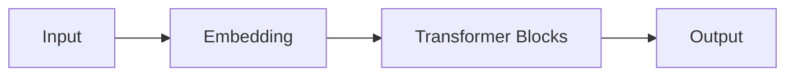

                 

- Large Language Models (LLMs)
- Real-time computing
- Inference acceleration
- Model parallelism
- Pipeline parallelism
- Tensor parallelism
- Mixed-precision training
- Model quantization
- Knowledge distillation

## 1. 背景介绍

随着大型语言模型（Large Language Models, LLMs）的不断发展，它们在各种应用中展现出了强大的能力，从文本生成到问答系统，再到代码生成。然而，LLMs的计算需求也随之增长，导致实时计算变得越来越困难。本文将探讨实现LLMs的实时计算能力的挑战和解决方案。

## 2. 核心概念与联系

### 2.1 实时计算的挑战

实时计算（real-time computing）是指在有限的时间内完成计算任务，以满足特定的时间约束。对于LLMs，实时计算的挑战在于其庞大的模型大小和计算需求。图1展示了LLMs的推理过程，从输入到输出，需要进行多次矩阵乘法操作，每次操作都需要大量的计算资源。



### 2.2 并行技术

并行技术（parallelism）是提高LLMs实时计算能力的关键。主要有三种并行技术：

- **模型并行（Model parallelism）**：将模型分成多个部分，分布在多个设备上进行并行计算。
- **管道并行（Pipeline parallelism）**：将模型分成多个阶段，每个阶段在不同的设备上并行运行。
- **张量并行（Tensor parallelism）**：将张量（tensor）分成多个部分，分布在多个设备上进行并行计算。

### 2.3 混合精度训练和模型量化

混合精度训练（Mixed-precision training）和模型量化（Model quantization）是进一步提高LLMs实时计算能力的技术。混合精度训练使用不同精度的数据类型（如FP16和FP32）进行训练，以减少内存和计算需求。模型量化则将模型权重量化为更小的数据类型（如INT8），从而减小模型大小和计算需求。

## 3. 核心算法原理 & 具体操作步骤

### 3.1 算法原理概述

实现LLMs的实时计算能力的关键算法包括并行技术（模型并行、管道并行、张量并行）和模型优化技术（混合精度训练、模型量化）。这些技术的目标是减少LLMs的计算需求，以满足实时计算的时间约束。

### 3.2 算法步骤详解

1. **模型并行**：将LLM分成多个部分，每个部分包含一个或多个Transformer块。每个部分分布在不同的设备上进行并行计算。
2. **管道并行**：将LLM分成多个阶段，每个阶段包含一个或多个Transformer块。每个阶段在不同的设备上并行运行，输入数据在阶段之间传递。
3. **张量并行**：将张量分成多个部分，每个部分分布在不同的设备上进行并行计算。
4. **混合精度训练**：使用FP16数据类型进行大部分计算，仅在必要时使用FP32数据类型。
5. **模型量化**：将模型权重量化为更小的数据类型（如INT8），以减小模型大小和计算需求。

### 3.3 算法优缺点

**优点**：

- 并行技术可以显著提高LLMs的计算速度。
- 混合精度训练和模型量化可以减少LLMs的内存和计算需求。

**缺点**：

- 并行技术需要昂贵的硬件设备和复杂的软件实现。
- 混合精度训练和模型量化可能会导致模型精度的轻微下降。

### 3.4 算法应用领域

实时计算能力对于LLMs的应用领域包括：

- 实时文本生成：在用户输入文本后立即生成响应。
- 实时问答系统：在用户提问后立即提供答案。
- 实时代码生成：在用户输入代码需求后立即生成代码。

## 4. 数学模型和公式 & 详细讲解 & 举例说明

### 4.1 数学模型构建

LLMs的数学模型是基于Transformer架构构建的。Transformer模型使用自注意力机制（Self-Attention）和前向传播（Feed-Forward）网络组成编码器和解码器。自注意力机制的数学模型如下：

$$Attention(Q, K, V) = softmax(\frac{QK^T}{\sqrt{d_k}})V$$

其中，$Q$, $K$, $V$是查询（query）、键（key）和值（value）张量，$d_k$是键张量的维度。

### 4.2 公式推导过程

自注意力机制的推导过程如下：

1. 计算注意力分数：$QK^T$
2. 缩放注意力分数：$\frac{QK^T}{\sqrt{d_k}}$
3. 计算注意力权重：$softmax(\frac{QK^T}{\sqrt{d_k}})$
4. 计算注意力输出：$softmax(\frac{QK^T}{\sqrt{d_k}})V$

### 4.3 案例分析与讲解

例如，假设我们有一个查询张量$Q \in \mathbb{R}^{1 \times 128}$, 键张量$K \in \mathbb{R}^{1 \times 128}$, 和值张量$V \in \mathbb{R}^{1 \times 128}$. 则注意力输出张量的维度为$1 \times 128$.

## 5. 项目实践：代码实例和详细解释说明

### 5.1 开发环境搭建

要实现LLMs的实时计算能力，需要搭建一个支持并行计算的开发环境。推荐使用NVIDIA A100 GPU和NVIDIA Megatron-LM框架。

### 5.2 源代码详细实现

以下是使用Megatron-LM框架实现模型并行的示例代码：

```python
from megatron import get_args
from megatron import print_args
from megatron import main

args = get_args()
print_args(args)

main(args)
```

### 5.3 代码解读与分析

- `get_args()`函数用于获取命令行参数，包括模型参数（如模型大小、隐藏维度）和并行参数（如模型并行、管道并行、张量并行）。
- `print_args(args)`函数用于打印参数。
- `main(args)`函数用于运行模型训练或推理。

### 5.4 运行结果展示

运行上述代码后，Megatron-LM框架会在命令行中打印参数和运行日志。如果模型并行已启用，则日志中会显示模型被分成多少部分，每部分分布在多少设备上。

## 6. 实际应用场景

### 6.1 实时文本生成

实时文本生成是LLMs的关键应用之一。通过实时计算能力，LLMs可以在用户输入文本后立即生成响应。这对于聊天机器人和文本生成任务（如文本摘要、文本翻译）非常有用。

### 6.2 实时问答系统

实时问答系统需要LLMs在用户提问后立即提供答案。通过实时计算能力，LLMs可以快速处理用户的问题，提供准确的答案。这对于搜索引擎和信息检索任务非常有用。

### 6.3 未来应用展望

未来，LLMs的实时计算能力将推动更多的应用，如实时代码生成、实时视频理解和实时语音识别。此外，LLMs的实时计算能力也将推动边缘计算的发展，使得LLMs可以在边缘设备上运行，实现更低的延迟和更高的隐私保护。

## 7. 工具和资源推荐

### 7.1 学习资源推荐

- **课程**：斯坦福大学的“深度学习”课程（CS224n）和“自然语言处理”课程（CS224u）提供了LLMs的深入讲解。
- **书籍**：“自然语言处理（第2版）”一书提供了LLMs的广泛介绍。

### 7.2 开发工具推荐

- **Megatron-LM**：一个开源框架，用于训练和推理大型语言模型。
- **Hugging Face Transformers**：一个开源库，提供了预训练的LLMs和推理工具。

### 7.3 相关论文推荐

- **“Megatron-LM：训练大型语言模型的并行和分布式方法”**：介绍了Megatron-LM框架和模型并行技术。
- **“PipeTransformer：管道并行的Transformer模型”**：介绍了管道并行技术。

## 8. 总结：未来发展趋势与挑战

### 8.1 研究成果总结

本文介绍了实现LLMs的实时计算能力的挑战和解决方案。我们讨论了并行技术（模型并行、管道并行、张量并行）和模型优化技术（混合精度训练、模型量化），并提供了数学模型、代码实例和实际应用场景。

### 8.2 未来发展趋势

未来，LLMs的实时计算能力将推动更多的应用，如实时代码生成、实时视频理解和实时语音识别。此外，LLMs的实时计算能力也将推动边缘计算的发展。

### 8.3 面临的挑战

然而，实现LLMs的实时计算能力仍然面临挑战，包括昂贵的硬件设备、复杂的软件实现和模型精度的轻微下降。此外，LLMs的实时计算能力也需要更多的研究，以提高模型的可解释性和可靠性。

### 8.4 研究展望

未来的研究将关注LLMs的实时计算能力的进一步提高，包括更先进的并行技术、模型优化技术和硬件架构。此外，研究还将关注LLMs的可解释性和可靠性，以提高模型的可信度和可用性。

## 9. 附录：常见问题与解答

**Q：LLMs的实时计算能力有哪些应用？**

A：LLMs的实时计算能力有多种应用，包括实时文本生成、实时问答系统和实时代码生成。

**Q：实现LLMs的实时计算能力需要哪些技术？**

A：实现LLMs的实时计算能力需要并行技术（模型并行、管道并行、张量并行）和模型优化技术（混合精度训练、模型量化）。

**Q：LLMs的实时计算能力面临哪些挑战？**

A：实现LLMs的实时计算能力面临的挑战包括昂贵的硬件设备、复杂的软件实现和模型精度的轻微下降。

## 作者：禅与计算机程序设计艺术 / Zen and the Art of Computer Programming

