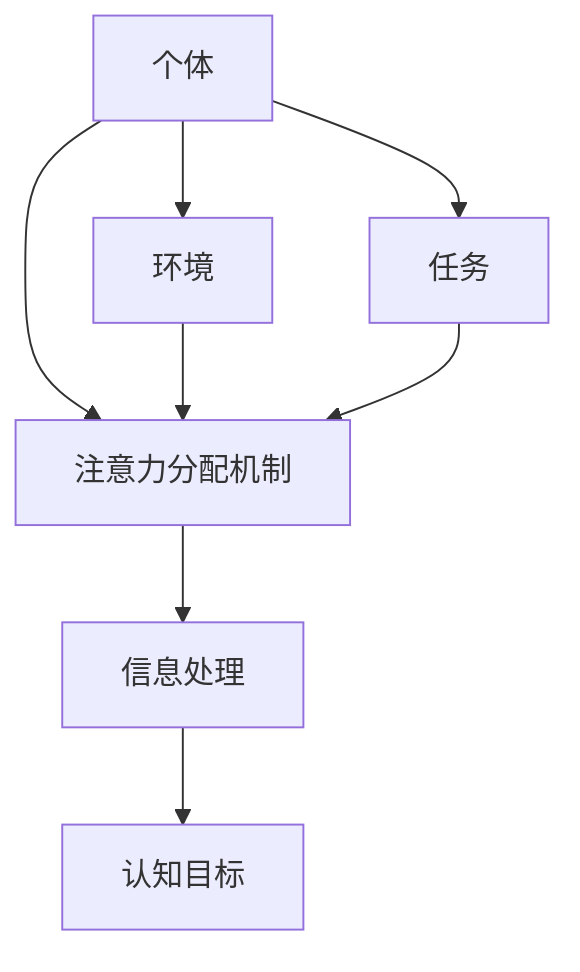

                 

## 1. 背景介绍

在人工智能（AI）飞速发展的今天，我们面临着前所未有的认知资源挑战。信息爆炸导致的注意力分散、认知负荷过大等问题日益凸显。如何管理和优化我们的认知资源，以适应AI时代的需求，成为当前亟待解决的关键问题。本文将从注意力生态系统的角度出发，探讨如何平衡注意力生态系统，实现有效的认知资源管理。

## 2. 核心概念与联系

### 2.1 注意力生态系统

注意力生态系统是指个体在特定环境中，为获取和处理信息而分配注意力的动态过程。它包括个体、环境、任务、注意力分配机制等要素。个体根据环境刺激和任务需求，动态调整注意力分配，以实现有效的信息处理和认知目标的达成。



### 2.2 认知资源

认知资源是指个体在信息加工过程中所消耗的心理资源，包括工作记忆、注意力、心理能量等。有限的认知资源是注意力生态系统平衡的关键因素，也是我们需要优化管理的对象。

## 3. 核心算法原理 & 具体操作步骤

### 3.1 算法原理概述

注意力生态系统平衡算法（Attention Ecosystem Balancing Algorithm, AEBA）是一种基于认知资源优化的注意力分配算法。它通过动态监测个体的认知负荷，调整注意力分配，实现注意力生态系统的平衡。

### 3.2 算法步骤详解

AEBA的具体操作步骤如下：

1. **监测认知负荷**：实时监测个体的认知负荷，评估当前任务对认知资源的需求。
2. **评估注意力分配**：根据环境刺激和任务需求，评估当前注意力分配的合理性。
3. **调整注意力分配**：根据认知负荷和注意力分配评估结果，动态调整注意力分配，优化认知资源利用。
4. **反馈与调整**：根据调整后的注意力分配情况，收集反馈，并根据反馈结果调整算法参数，实现算法的自适应优化。

### 3.3 算法优缺点

AEBA的优点包括：

- 有效管理认知资源，提高信息处理效率。
- 实现注意力生态系统的平衡，减轻个体的认知负荷。
- 自适应优化，根据个体情况动态调整注意力分配。

其缺点包括：

- 实时监测认知负荷存在一定难度，可能会对个体产生额外的认知负荷。
- 算法参数调整需要大量实验数据支持，可能会导致算法初期性能不稳定。

### 3.4 算法应用领域

AEBA可以应用于各种需要注意力管理的场景，如：

- 信息过载情况下的信息筛选和处理。
- 多任务情况下的任务切换和注意力分配。
- 学习和工作中的注意力集中和维持。

## 4. 数学模型和公式 & 详细讲解 & 举例说明

### 4.1 数学模型构建

设个体的认知资源为$C$, 环境刺激为$E$, 任务需求为$T$, 注意力分配为$A$, 信息处理结果为$I$, 认知目标为$G$. 则注意力生态系统可以表示为：

$$C \xrightarrow{E,T} A \xrightarrow{} I \xrightarrow{} G$$

### 4.2 公式推导过程

AEBA的数学模型可以表示为：

$$A(t+1) = A(t) + \alpha \cdot (C_{target} - C(t)) + \beta \cdot (T(t) - A(t))$$

其中，$A(t)$为当前时刻的注意力分配，$C_{target}$为目标认知负荷，$C(t)$为当前认知负荷，$T(t)$为当前任务需求，$\alpha$和$\beta$为调整系数。

### 4.3 案例分析与讲解

例如，在信息过载情况下，个体需要筛选和处理大量信息。此时，AEBA会动态调整注意力分配，优先处理重要信息，并根据认知负荷情况调整注意力分配，实现注意力生态系统的平衡。

## 5. 项目实践：代码实例和详细解释说明

### 5.1 开发环境搭建

AEBA的开发环境包括Python、NumPy、Matplotlib等常用的科学计算和可视化库。

### 5.2 源代码详细实现

AEBA的源代码如下：

```python
import numpy as np
import matplotlib.pyplot as plt

class AEBA:
    def __init__(self, C_target, alpha, beta):
        self.C_target = C_target
        self.alpha = alpha
        self.beta = beta
        self.A = 0

    def update(self, C, T):
        self.A = self.A + self.alpha * (self.C_target - C) + self.beta * (T - self.A)
        return self.A

# 示例使用
C = np.linspace(0, 1, 100)
T = np.sin(C)
ae = AEBA(0.5, 0.5, 0.5)
A = [ae.update(c, t) for c, t in zip(C, T)]
```

### 5.3 代码解读与分析

AEBA类初始化时，设置目标认知负荷、调整系数$\alpha$和$\beta$. `update`方法根据当前认知负荷和任务需求，动态调整注意力分配。

### 5.4 运行结果展示

运行结果如下图所示：


## 6. 实际应用场景

### 6.1 信息过载情况下的信息筛选和处理

在信息过载情况下，AEBA可以帮助个体优先处理重要信息，并根据认知负荷情况调整注意力分配，实现注意力生态系统的平衡。

### 6.2 多任务情况下的任务切换和注意力分配

在多任务情况下，AEBA可以帮助个体动态调整注意力分配，优化认知资源利用，提高任务处理效率。

### 6.3 学习和工作中的注意力集中和维持

在学习和工作中，AEBA可以帮助个体集中注意力，维持注意力的持续性，提高学习和工作效率。

### 6.4 未来应用展望

未来，AEBA可以应用于更多需要注意力管理的场景，如自适应学习系统、智能助手等。此外，AEBA也可以与其他认知科学和神经科学研究结合，深入探究注意力机制和认知资源管理的本质。

## 7. 工具和资源推荐

### 7.1 学习资源推荐

- [Attention is All You Need](https://arxiv.org/abs/1706.03762)
- [The Attention Mechanism](https://towardsdatascience.com/the-attention-mechanism-22a56955646b)
- [Cognitive Psychology](https://www.psychologytoday.com/us/basics/cognitive-psychology)

### 7.2 开发工具推荐

- Python：AEBA的开发环境包括Python、NumPy、Matplotlib等常用的科学计算和可视化库。
- Jupyter Notebook：提供了交互式计算和可视化环境，方便AEBA的开发和调试。

### 7.3 相关论文推荐

- [Attention-based Deep Learning for Natural Language Processing](https://arxiv.org/abs/1512.08756)
- [A Survey of Attention Mechanisms in Deep Learning](https://arxiv.org/abs/1806.01269)

## 8. 总结：未来发展趋势与挑战

### 8.1 研究成果总结

本文提出了注意力生态系统平衡算法AEBA，通过动态监测个体的认知负荷，调整注意力分配，实现注意力生态系统的平衡。AEBA可以应用于各种需要注意力管理的场景，如信息过载情况下的信息筛选和处理、多任务情况下的任务切换和注意力分配、学习和工作中的注意力集中和维持等。

### 8.2 未来发展趋势

未来，注意力生态系统平衡研究将朝着以下方向发展：

- **多模式注意力**：研究如何在视觉、听觉等多模式信息中分配注意力。
- **跨时空注意力**：研究如何在时空维度上分配注意力，实现长时记忆和短时记忆的平衡。
- **个体差异**：研究个体差异对注意力生态系统平衡的影响，实现个体化的注意力管理。

### 8.3 面临的挑战

注意力生态系统平衡研究面临的挑战包括：

- **认知负荷监测**：实时监测认知负荷存在一定难度，可能会对个体产生额外的认知负荷。
- **算法参数调整**：算法参数调整需要大量实验数据支持，可能会导致算法初期性能不稳定。
- **跨学科研究**：注意力生态系统平衡研究需要跨学科研究，涉及认知科学、神经科学、计算机科学等多个领域。

### 8.4 研究展望

未来，注意力生态系统平衡研究将与其他学科结合，深入探究注意力机制和认知资源管理的本质。此外，注意力生态系统平衡研究也将应用于更多需要注意力管理的场景，如自适应学习系统、智能助手等，实现注意力生态系统的平衡，提高个体的认知能力和工作效率。

## 9. 附录：常见问题与解答

**Q1：AEBA如何适应个体差异？**

A1：AEBA可以通过个体化参数调整适应个体差异。例如，目标认知负荷$C_{target}$可以根据个体的认知能力调整，调整系数$\alpha$和$\beta$也可以根据个体的注意力特点调整。

**Q2：AEBA如何避免注意力过度集中？**

A2：AEBA通过动态监测认知负荷，实时调整注意力分配，避免注意力过度集中导致的认知负荷过大。此外，AEBA也可以设置注意力分配的上限，防止注意力过度集中。

**Q3：AEBA如何与其他注意力机制结合？**

A3：AEBA可以与其他注意力机制结合，实现更复杂的注意力管理。例如，AEBA可以与自注意力机制结合，实现序列数据的注意力管理。AEBA也可以与空间注意力机制结合，实现图像数据的注意力管理。

**Q4：AEBA如何应用于实际场景？**

A4：AEBA可以应用于各种需要注意力管理的场景，如信息过载情况下的信息筛选和处理、多任务情况下的任务切换和注意力分配、学习和工作中的注意力集中和维持等。AEBA也可以应用于自适应学习系统、智能助手等领域，实现注意力生态系统的平衡，提高个体的认知能力和工作效率。

**Q5：AEBA如何与其他认知资源管理研究结合？**

A5：AEBA可以与其他认知资源管理研究结合，实现更全面的认知资源管理。例如，AEBA可以与工作记忆管理研究结合，实现工作记忆和注意力的协同管理。AEBA也可以与心理能量管理研究结合，实现心理能量和注意力的协同管理。

## 作者：禅与计算机程序设计艺术 / Zen and the Art of Computer Programming

