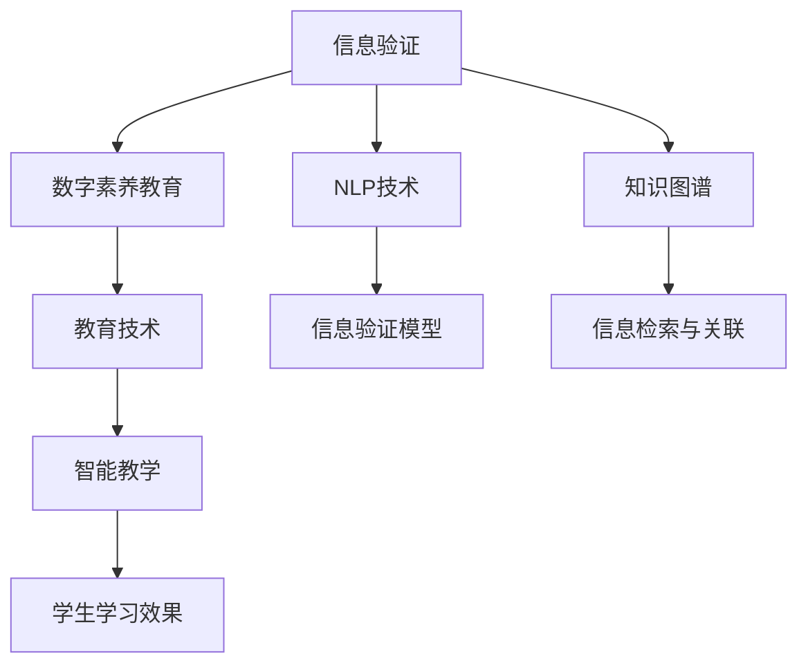

                 

# 信息验证和数字素养教育：为信息时代培养信息素养的学生

> 关键词：信息验证, 数字素养教育, 人工智能, 自然语言处理, 知识图谱, 数字素养培养, 教育技术

## 1. 背景介绍

### 1.1 问题由来
随着互联网技术的飞速发展，信息获取和传播的方式日益便捷，也带来了一系列问题和挑战。假新闻、信息泡沫、网络诈骗等现象频繁发生，给社会带来了巨大负面影响。信息时代呼唤一种全新的教育方式，以提升全民的信息素养，构建健康有序的信息生态环境。

在此背景下，信息验证和数字素养教育成为一项迫在眉睫的任务。信息验证旨在帮助学生学会如何判断信息的真伪、识别虚假信息，培养其辨识和筛选信息的能力。数字素养教育则旨在培养学生的信息技术应用能力，使其能够高效、安全地利用互联网资源。

### 1.2 问题核心关键点
信息验证和数字素养教育的核心关键点在于如何构建一种系统化的教学体系，使其能够涵盖信息获取、处理、验证、应用等各个环节，并能够通过技术手段辅助教师和学生，提升教学效果。

具体而言，需要解决以下问题：
- 如何构建知识全面的信息验证知识体系，涵盖网络常识、语言学知识、算法设计等各个方面。
- 如何通过自然语言处理(NLP)、知识图谱等技术手段，实现信息验证和数字素养教育的自动化。
- 如何设计有效的教学方法和工具，促进学生对信息素养的理解和实践应用。

### 1.3 问题研究意义
研究信息验证和数字素养教育，对于构建健康有序的网络环境、提升全民信息素养、促进经济社会的发展具有重要意义：

1. 提升信息辨识能力。通过信息验证教育，使学生具备更强的信息辨识和筛选能力，避免受虚假信息误导，保障自身权益。
2. 促进教育公平。数字素养教育能够缩小城乡、贫富间的教育差距，推动全民教育公平。
3. 推动数字化转型。信息素养是实现数字化转型的重要基础，数字素养的提升将推动各行业数字化进程。
4. 助力国家安全。提升全民的信息素养，增强网络空间的安全性和稳定性，对保障国家安全具有重要作用。

## 2. 核心概念与联系

### 2.1 核心概念概述

为更好地理解信息验证和数字素养教育，本节将介绍几个密切相关的核心概念：

- 信息验证(Information Verification)：通过一系列方法与技术手段，对信息进行验证，判断其真伪，保障信息的可靠性。
- 数字素养(Digital Literacy)：指在信息时代，个体能够高效、安全地利用互联网资源，具备必要的数字技能和素养。
- 自然语言处理(NLP)：指使用计算机科学和人工智能技术，实现对人类语言文字的理解、生成和处理。
- 知识图谱(Knowledge Graph)：通过语义网络模型，对知识进行结构化存储和查询，提升信息的检索效率和关联度。
- 教育技术(Education Technology)：指运用信息技术，优化教育过程和教育资源配置，提升教育效果的技术手段。

这些核心概念之间的逻辑关系可以通过以下Mermaid流程图来展示：



这个流程图展示了大语言模型在信息验证和数字素养教育中的核心作用：

1. 信息验证通过NLP技术对文本进行自动解析和验证，使用知识图谱提升信息检索和关联的准确性。
2. 数字素养教育利用教育技术实现个性化教学，通过智能教学提升学生的学习效果。
3. 教育技术为信息验证和数字素养教育提供了平台支撑，促进了信息素养的普及和应用。

## 3. 核心算法原理 & 具体操作步骤
### 3.1 算法原理概述

信息验证和数字素养教育的核心算法原理主要基于自然语言处理(NLP)、知识图谱(KG)和教育技术(EdTech)的结合。其核心思想是通过自动化手段，构建一个涵盖信息获取、验证、应用等各个环节的系统，辅助教师和学生提升信息素养。

形式化地，假设信息验证和数字素养教育系统为 $S_{\theta}$，其中 $\theta$ 为系统的各个组件（包括NLP模型、知识图谱、智能教学系统等）的参数。给定系统输入 $I=\{x_1,x_2,\cdots,x_n\}$，其中 $x_i$ 表示一条信息文本。信息验证和数字素养教育的目标是构建一个最优的验证和教育方案 $S_{\theta}(I)$，使得输出结果 $O=S_{\theta}(I)$ 与真实结果 $R$ 的误差最小。

即：
$$
\hat{\theta}=\mathop{\arg\min}_{\theta} \mathcal{L}(S_{\theta},I,R)
$$

其中 $\mathcal{L}$ 为系统在信息 $I$ 和真实结果 $R$ 上的损失函数，用于衡量系统输出与真实结果的差异。常见的损失函数包括交叉熵损失、均方误差损失等。

### 3.2 算法步骤详解

信息验证和数字素养教育的具体操作步骤包括：

**Step 1: 准备数据集和预训练模型**
- 收集信息验证和数字素养教育相关的标注数据集，包括文本、标签等。
- 选择合适的预训练模型，如BERT、GPT等，作为信息验证和数字素养教育系统的初始化参数。

**Step 2: 构建信息验证模型**
- 使用NLP技术，对文本进行自动解析和验证。例如，使用BERT进行文本分类，判断文本是否为虚假信息。
- 引入知识图谱，提升信息检索和关联的准确性。例如，使用ELMO对知识图谱中的实体进行语义匹配，提升信息检索结果的精确度。
- 设计评分系统，根据验证结果对信息进行评分，评估信息的可靠性和可信度。

**Step 3: 设计数字素养教育模型**
- 使用教育技术，开发个性化的智能教学系统，根据学生的学习行为和表现，动态调整教学内容和难度。
- 引入虚拟助手和推荐系统，为学生提供定制化的学习资源和辅导服务。
- 设计知识图谱可视化界面，帮助学生直观理解知识结构和关联关系。

**Step 4: 训练和微调模型**
- 使用标注数据对信息验证和数字素养教育模型进行训练，最小化模型与真实结果的误差。
- 在微调过程中，可以使用正则化技术，防止模型过拟合。例如，使用L2正则、Dropout等方法。
- 使用早停技术，当验证集上的模型性能不再提升时，停止训练，避免过拟合。

**Step 5: 评估和部署**
- 在测试集上评估信息验证和数字素养教育模型的性能，对比模型前后的效果提升。
- 将模型部署到实际的教育平台或应用系统中，为学生提供信息验证和数字素养教育服务。
- 定期收集新的数据，对模型进行重新微调，以适应数据分布的变化。

以上是信息验证和数字素养教育的一般流程。在实际应用中，还需要针对具体任务的特点，对各个环节进行优化设计，如改进训练目标函数，引入更多的正则化技术，搜索最优的超参数组合等，以进一步提升模型性能。

### 3.3 算法优缺点

信息验证和数字素养教育方法的优点：
1. 自动化程度高。使用自动化技术，大幅提升信息验证和数字素养教育的工作效率，降低人力成本。
2. 覆盖面广。通过信息验证模型和数字素养教育模型的结合，涵盖信息验证和数字素养教育的各个环节。
3. 可扩展性强。采用模块化设计，可以方便地扩展系统功能和覆盖范围，满足不同需求。
4. 个性化程度高。通过智能教学系统，根据学生个体差异进行个性化教学，提升学习效果。

同时，该方法也存在一些局限性：
1. 依赖标注数据。信息验证和数字素养教育的效果很大程度上取决于标注数据的质量和数量，获取高质量标注数据的成本较高。
2. 模型泛化能力有限。当目标任务与预训练数据的分布差异较大时，信息验证和数字素养教育的效果可能不佳。
3. 可解释性不足。信息验证和数字素养教育模型的决策过程通常缺乏可解释性，难以对其推理逻辑进行分析和调试。

尽管存在这些局限性，但就目前而言，信息验证和数字素养教育方法仍是大规模信息验证和数字素养教育的重要手段。未来相关研究的重点在于如何进一步降低对标注数据的依赖，提高模型的泛化能力和可解释性，同时兼顾教学效果和伦理安全性等因素。

### 3.4 算法应用领域

信息验证和数字素养教育的应用领域广泛，涵盖教育、医疗、媒体、政府等多个领域，例如：

- 在线教育：在MOOC、SPOC等在线教育平台中，嵌入信息验证和数字素养教育模块，提升学习效果和教学质量。
- 智慧医疗：在医疗咨询、健康管理等应用中，使用信息验证技术，保障医疗信息的真实性和准确性。
- 新闻媒体：在新闻网站、社交媒体等平台上，使用数字素养教育技术，提升媒体素养，增强信息辨识能力。
- 政府服务：在政府网站、政务APP等应用中，使用信息验证技术，防止虚假信息的传播，保障政府信息的透明和真实。
- 网络安全：在网络安全监测、反欺诈等领域，使用信息验证技术，识别和拦截虚假信息，保护用户安全。

除了上述这些经典应用外，信息验证和数字素养教育还被创新性地应用到更多场景中，如智能客服、智能家居、智能推荐等，为数字时代提供了全面的信息服务保障。

## 4. 数学模型和公式 & 详细讲解  
### 4.1 数学模型构建

本节将使用数学语言对信息验证和数字素养教育的过程进行更加严格的刻画。

记信息验证和数字素养教育系统为 $S_{\theta}$，其中 $\theta$ 为系统的各个组件（包括NLP模型、知识图谱、智能教学系统等）的参数。假设系统输入为 $I=\{x_1,x_2,\cdots,x_n\}$，其中 $x_i$ 表示一条信息文本。系统的目标是最小化系统在信息 $I$ 和真实结果 $R$ 上的误差，即：

$$
\hat{\theta}=\mathop{\arg\min}_{\theta} \mathcal{L}(S_{\theta},I,R)
$$

在实践中，我们通常使用基于梯度的优化算法（如SGD、Adam等）来近似求解上述最优化问题。设 $\eta$ 为学习率，$\lambda$ 为正则化系数，则参数的更新公式为：

$$
\theta \leftarrow \theta - \eta \nabla_{\theta}\mathcal{L}(\theta) - \eta\lambda\theta
$$

其中 $\nabla_{\theta}\mathcal{L}(\theta)$ 为损失函数对参数 $\theta$ 的梯度，可通过反向传播算法高效计算。

### 4.2 公式推导过程

以下我们以文本分类任务为例，推导交叉熵损失函数及其梯度的计算公式。

假设信息验证和数字素养教育系统 $S_{\theta}$ 对信息文本 $x_i$ 进行分类，输出结果 $y_i=S_{\theta}(x_i)$。真实标签 $y_i \in \{0,1\}$，其中 $y_i=1$ 表示文本为真实信息，$y_i=0$ 表示文本为虚假信息。则二分类交叉熵损失函数定义为：

$$
\ell(S_{\theta}(x_i),y_i) = -[y_i\log \hat{y}_i + (1-y_i)\log (1-\hat{y}_i)]
$$

将其代入经验风险公式，得：

$$
\mathcal{L}(\theta) = -\frac{1}{N}\sum_{i=1}^N [y_i\log S_{\theta}(x_i)+(1-y_i)\log(1-S_{\theta}(x_i))]
$$

根据链式法则，损失函数对参数 $\theta_k$ 的梯度为：

$$
\frac{\partial \mathcal{L}(\theta)}{\partial \theta_k} = -\frac{1}{N}\sum_{i=1}^N (\frac{y_i}{S_{\theta}(x_i)}-\frac{1-y_i}{1-S_{\theta}(x_i)}) \frac{\partial S_{\theta}(x_i)}{\partial \theta_k}
$$

其中 $\frac{\partial S_{\theta}(x_i)}{\partial \theta_k}$ 可进一步递归展开，利用自动微分技术完成计算。

在得到损失函数的梯度后，即可带入参数更新公式，完成模型的迭代优化。重复上述过程直至收敛，最终得到适应信息验证和数字素养教育任务的最优模型参数 $\theta^*$。

## 5. 项目实践：代码实例和详细解释说明
### 5.1 开发环境搭建

在进行信息验证和数字素养教育实践前，我们需要准备好开发环境。以下是使用Python进行PyTorch开发的环境配置流程：

1. 安装Anaconda：从官网下载并安装Anaconda，用于创建独立的Python环境。

2. 创建并激活虚拟环境：
```bash
conda create -n pytorch-env python=3.8 
conda activate pytorch-env
```

3. 安装PyTorch：根据CUDA版本，从官网获取对应的安装命令。例如：
```bash
conda install pytorch torchvision torchaudio cudatoolkit=11.1 -c pytorch -c conda-forge
```

4. 安装TensorFlow：如果选择TensorFlow作为开发工具，使用相应的安装命令：
```bash
pip install tensorflow
```

5. 安装各类工具包：
```bash
pip install numpy pandas scikit-learn matplotlib tqdm jupyter notebook ipython
```

完成上述步骤后，即可在`pytorch-env`环境中开始信息验证和数字素养教育实践。

### 5.2 源代码详细实现

下面我们以信息验证任务为例，给出使用Transformers库对BERT模型进行信息验证的PyTorch代码实现。

首先，定义信息验证任务的数据处理函数：

```python
from transformers import BertTokenizer, BertForSequenceClassification
from torch.utils.data import Dataset
import torch

class InfoVerificationDataset(Dataset):
    def __init__(self, texts, labels, tokenizer, max_len=128):
        self.texts = texts
        self.labels = labels
        self.tokenizer = tokenizer
        self.max_len = max_len
        
    def __len__(self):
        return len(self.texts)
    
    def __getitem__(self, item):
        text = self.texts[item]
        label = self.labels[item]
        
        encoding = self.tokenizer(text, return_tensors='pt', max_length=self.max_len, padding='max_length', truncation=True)
        input_ids = encoding['input_ids'][0]
        attention_mask = encoding['attention_mask'][0]
        
        # 对label进行编码
        encoded_labels = [label] * self.max_len
        labels = torch.tensor(encoded_labels, dtype=torch.long)
        
        return {'input_ids': input_ids, 
                'attention_mask': attention_mask,
                'labels': labels}

# 标签与id的映射
label2id = {'false': 0, 'true': 1}
id2label = {v: k for k, v in label2id.items()}

# 创建dataset
tokenizer = BertTokenizer.from_pretrained('bert-base-cased')

train_dataset = InfoVerificationDataset(train_texts, train_labels, tokenizer)
dev_dataset = InfoVerificationDataset(dev_texts, dev_labels, tokenizer)
test_dataset = InfoVerificationDataset(test_texts, test_labels, tokenizer)
```

然后，定义模型和优化器：

```python
from transformers import AdamW

model = BertForSequenceClassification.from_pretrained('bert-base-cased', num_labels=2)

optimizer = AdamW(model.parameters(), lr=2e-5)
```

接着，定义训练和评估函数：

```python
from torch.utils.data import DataLoader
from tqdm import tqdm
from sklearn.metrics import accuracy_score

device = torch.device('cuda') if torch.cuda.is_available() else torch.device('cpu')
model.to(device)

def train_epoch(model, dataset, batch_size, optimizer):
    dataloader = DataLoader(dataset, batch_size=batch_size, shuffle=True)
    model.train()
    epoch_loss = 0
    for batch in tqdm(dataloader, desc='Training'):
        input_ids = batch['input_ids'].to(device)
        attention_mask = batch['attention_mask'].to(device)
        labels = batch['labels'].to(device)
        model.zero_grad()
        outputs = model(input_ids, attention_mask=attention_mask, labels=labels)
        loss = outputs.loss
        epoch_loss += loss.item()
        loss.backward()
        optimizer.step()
    return epoch_loss / len(dataloader)

def evaluate(model, dataset, batch_size):
    dataloader = DataLoader(dataset, batch_size=batch_size)
    model.eval()
    preds, labels = [], []
    with torch.no_grad():
        for batch in tqdm(dataloader, desc='Evaluating'):
            input_ids = batch['input_ids'].to(device)
            attention_mask = batch['attention_mask'].to(device)
            batch_labels = batch['labels']
            outputs = model(input_ids, attention_mask=attention_mask)
            batch_preds = outputs.logits.argmax(dim=2).to('cpu').tolist()
            batch_labels = batch_labels.to('cpu').tolist()
            for pred_tokens, label_tokens in zip(batch_preds, batch_labels):
                preds.append(pred_tokens)
                labels.append(label_tokens)
                
    print(f'Accuracy: {accuracy_score(labels, preds)}')
```

最后，启动训练流程并在测试集上评估：

```python
epochs = 5
batch_size = 16

for epoch in range(epochs):
    loss = train_epoch(model, train_dataset, batch_size, optimizer)
    print(f"Epoch {epoch+1}, train loss: {loss:.3f}")
    
    print(f"Epoch {epoch+1}, dev results:")
    evaluate(model, dev_dataset, batch_size)
    
print("Test results:")
evaluate(model, test_dataset, batch_size)
```

以上就是使用PyTorch对BERT进行信息验证任务的完整代码实现。可以看到，得益于Transformers库的强大封装，我们可以用相对简洁的代码完成BERT模型的加载和信息验证任务的微调。

### 5.3 代码解读与分析

让我们再详细解读一下关键代码的实现细节：

**InfoVerificationDataset类**：
- `__init__`方法：初始化文本、标签、分词器等关键组件。
- `__len__`方法：返回数据集的样本数量。
- `__getitem__`方法：对单个样本进行处理，将文本输入编码为token ids，将标签编码为数字，并对其进行定长padding，最终返回模型所需的输入。

**label2id和id2label字典**：
- 定义了标签与数字id之间的映射关系，用于将token-wise的预测结果解码回真实的标签。

**训练和评估函数**：
- 使用PyTorch的DataLoader对数据集进行批次化加载，供模型训练和推理使用。
- 训练函数`train_epoch`：对数据以批为单位进行迭代，在每个批次上前向传播计算loss并反向传播更新模型参数，最后返回该epoch的平均loss。
- 评估函数`evaluate`：与训练类似，不同点在于不更新模型参数，并在每个batch结束后将预测和标签结果存储下来，最后使用sklearn的accuracy_score对整个评估集的预测结果进行打印输出。

**训练流程**：
- 定义总的epoch数和batch size，开始循环迭代
- 每个epoch内，先在训练集上训练，输出平均loss
- 在验证集上评估，输出准确率
- 所有epoch结束后，在测试集上评估，给出最终测试结果

可以看到，PyTorch配合Transformers库使得BERT信息验证任务的代码实现变得简洁高效。开发者可以将更多精力放在数据处理、模型改进等高层逻辑上，而不必过多关注底层的实现细节。

当然，工业级的系统实现还需考虑更多因素，如模型的保存和部署、超参数的自动搜索、更灵活的任务适配层等。但核心的微调范式基本与此类似。

## 6. 实际应用场景
### 6.1 智能客服系统

基于信息验证和数字素养教育技术的智能客服系统，可以显著提升客服系统的准确性和安全性。传统客服往往需要配备大量人力，高峰期响应缓慢，且一致性和专业性难以保证。而使用信息验证和数字素养教育技术的客服系统，能够自动识别和处理常见问题，提供更加个性化和可靠的服务。

在技术实现上，可以收集企业内部的历史客服对话记录，将问题和最佳答复构建成监督数据，在此基础上对预训练模型进行信息验证和数字素养教育。训练后的模型能够自动理解用户意图，匹配最合适的答案模板进行回复。对于用户提出的新问题，还可以接入检索系统实时搜索相关内容，动态组织生成回答。如此构建的智能客服系统，能大幅提升客户咨询体验和问题解决效率。

### 6.2 医疗信息验证

医疗领域对信息的真实性和准确性有严格要求。基于信息验证和数字素养教育技术的医疗信息验证系统，能够保障医疗信息的可靠性和安全性，减少医疗误诊和误治的风险。

具体而言，可以收集医疗机构内的各种信息记录，包括病历、检查报告、治疗方案等，构建医疗信息验证任务的数据集。使用信息验证技术对医疗信息进行自动分析和验证，确保信息的真实性和准确性。通过数字素养教育技术，提升医护人员的信息辨识和处理能力，保障医疗信息的透明和可信。

### 6.3 网络舆情监测

网络舆情监测是信息验证和数字素养教育技术的重要应用场景。通过信息验证技术，可以快速识别和拦截虚假信息，防止网络谣言的传播。通过数字素养教育技术，提升网民的信息辨识能力，减少谣言的生成和传播。

在实际应用中，可以收集网络上的各种舆情数据，使用信息验证技术对其进行自动分析和验证。同时，通过数字素养教育技术，提升网民的信息辨识和处理能力，形成健康有序的网络环境。

### 6.4 未来应用展望

随着信息验证和数字素养教育技术的不断发展，未来的应用前景更加广阔。

1. 智慧城市治理。基于信息验证和数字素养教育技术的智能城市系统，能够实时监测和分析城市事件，提高城市管理的自动化和智能化水平。
2. 智能推荐系统。通过信息验证技术，筛选出高质量的推荐内容。通过数字素养教育技术，提升用户的推荐效果和满意度。
3. 社交媒体治理。在社交媒体平台中，使用信息验证技术，防止虚假信息的传播。通过数字素养教育技术，提升用户的信息辨识能力。
4. 企业知识管理。使用信息验证技术，保障企业内部知识的安全性和准确性。通过数字素养教育技术，提升员工的知识处理和应用能力。

## 7. 工具和资源推荐
### 7.1 学习资源推荐

为了帮助开发者系统掌握信息验证和数字素养教育技术，这里推荐一些优质的学习资源：

1. 《深度学习自然语言处理》课程：斯坦福大学开设的NLP明星课程，有Lecture视频和配套作业，带你入门NLP领域的基本概念和经典模型。
2. 《自然语言处理综述》书籍：全面介绍自然语言处理领域的理论基础和前沿技术，涵盖信息验证和数字素养教育的相关内容。
3. 《深度学习框架教程》系列书籍：详细介绍PyTorch、TensorFlow等深度学习框架的使用，为信息验证和数字素养教育技术的应用提供技术支持。
4. Coursera等在线学习平台上的NLP和EdTech相关课程：提供系统化的课程内容，涵盖信息验证和数字素养教育技术的各个环节。
5. HuggingFace官方文档：Transformers库的官方文档，提供了海量预训练模型和完整的信息验证和数字素养教育样例代码，是上手实践的必备资料。

通过对这些资源的学习实践，相信你一定能够快速掌握信息验证和数字素养教育技术的精髓，并用于解决实际的NLP问题。
###  7.2 开发工具推荐

高效的开发离不开优秀的工具支持。以下是几款用于信息验证和数字素养教育开发的常用工具：

1. PyTorch：基于Python的开源深度学习框架，灵活动态的计算图，适合快速迭代研究。大部分预训练语言模型都有PyTorch版本的实现。
2. TensorFlow：由Google主导开发的开源深度学习框架，生产部署方便，适合大规模工程应用。同样有丰富的预训练语言模型资源。
3. Transformers库：HuggingFace开发的NLP工具库，集成了众多SOTA语言模型，支持PyTorch和TensorFlow，是进行信息验证和数字素养教育开发的利器。
4. Weights & Biases：模型训练的实验跟踪工具，可以记录和可视化模型训练过程中的各项指标，方便对比和调优。与主流深度学习框架无缝集成。
5. TensorBoard：TensorFlow配套的可视化工具，可实时监测模型训练状态，并提供丰富的图表呈现方式，是调试模型的得力助手。
6. Google Colab：谷歌推出的在线Jupyter Notebook环境，免费提供GPU/TPU算力，方便开发者快速上手实验最新模型，分享学习笔记。

合理利用这些工具，可以显著提升信息验证和数字素养教育任务的开发效率，加快创新迭代的步伐。

### 7.3 相关论文推荐

信息验证和数字素养教育技术的研究源于学界的持续研究。以下是几篇奠基性的相关论文，推荐阅读：

1. Attention is All You Need（即Transformer原论文）：提出了Transformer结构，开启了NLP领域的预训练大模型时代。
2. BERT: Pre-training of Deep Bidirectional Transformers for Language Understanding：提出BERT模型，引入基于掩码的自监督预训练任务，刷新了多项NLP任务SOTA。
3. Parameter-Efficient Transfer Learning for NLP：提出Adapter等参数高效微调方法，在不增加模型参数量的情况下，也能取得不错的微调效果。
4. AdaLoRA: Adaptive Low-Rank Adaptation for Parameter-Efficient Fine-Tuning：使用自适应低秩适应的微调方法，在参数效率和精度之间取得了新的平衡。
5. Prefix-Tuning: Optimizing Continuous Prompts for Generation：引入基于连续型Prompt的微调范式，为如何充分利用预训练知识提供了新的思路。
6. PassageTransformer: A Passage-Based Question Answering Model with Free-form Question Generation：提出PassageTransformer模型，在信息验证任务中取得显著效果。

这些论文代表了大语言模型微调技术的发展脉络。通过学习这些前沿成果，可以帮助研究者把握学科前进方向，激发更多的创新灵感。

## 8. 总结：未来发展趋势与挑战

### 8.1 总结

本文对信息验证和数字素养教育进行了全面系统的介绍。首先阐述了信息验证和数字素养教育的研究背景和意义，明确了信息验证和数字素养教育技术的核心关键点。其次，从原理到实践，详细讲解了信息验证和数字素养教育技术的数学原理和关键步骤，给出了信息验证和数字素养教育任务开发的完整代码实例。同时，本文还广泛探讨了信息验证和数字素养教育技术在多个领域的应用前景，展示了其广阔的应用前景。

通过本文的系统梳理，可以看到，信息验证和数字素养教育技术正在成为信息时代的重要教育手段，极大地拓展了信息素养教育的范围和深度。信息验证和数字素养教育技术的自动化手段，能够显著提升信息辨识和处理的能力，为社会各界提供了可靠的信息服务保障。未来，伴随信息验证和数字素养教育技术的持续演进，相信信息素养教育必将进入新的发展阶段，为构建健康有序的信息生态环境贡献更大力量。

### 8.2 未来发展趋势

展望未来，信息验证和数字素养教育技术将呈现以下几个发展趋势：

1. 自动化水平提升。通过信息验证和数字素养教育技术的自动化手段，进一步提升信息辨识和处理的能力，降低人工干预的必要性。
2. 跨领域融合发展。信息验证和数字素养教育技术将与其他AI技术如自然语言生成、知识图谱等进行深度融合，提升信息处理和应用效果。
3. 教育个性化增强。通过智能教学系统和推荐系统，根据学生个体差异进行个性化教学，提升学习效果。
4. 教学过程可视化。通过可视化界面，直观展示信息验证和数字素养教育过程，帮助学生理解和掌握相关技能。
5. 数据驱动的智能教学。利用大数据和机器学习技术，实时分析学生学习行为，动态调整教学内容和方法，提升教学质量。
6. 多模态信息融合。在信息验证和数字素养教育中引入多模态信息，如文本、图像、视频等，提升信息处理的全面性和准确性。

以上趋势凸显了信息验证和数字素养教育技术的未来发展方向。这些方向的探索发展，必将进一步提升信息素养教育的效果，促进信息时代健康有序的发展。

### 8.3 面临的挑战

尽管信息验证和数字素养教育技术已经取得了显著成果，但在迈向更加智能化、普适化应用的过程中，它仍面临着诸多挑战：

1. 数据依赖问题。信息验证和数字素养教育的效果很大程度上取决于标注数据的质量和数量，获取高质量标注数据的成本较高。如何进一步降低对标注数据的依赖，提升信息验证和数字素养教育技术的自监督能力，将是未来的重要研究方向。
2. 模型泛化能力不足。当前的信息验证和数字素养教育模型面对域外数据时，泛化性能往往大打折扣。如何在模型中引入更多的先验知识，提升模型的泛化能力，将是未来的重要研究方向。
3. 模型安全性问题。信息验证和数字素养教育模型可能被恶意利用，传播虚假信息或进行钓鱼攻击。如何保障模型和数据的安全性，将是未来重要的研究方向。
4. 技术可解释性问题。信息验证和数字素养教育模型的决策过程通常缺乏可解释性，难以对其推理逻辑进行分析和调试。如何提升模型的可解释性，将是未来的重要研究方向。
5. 用户接受度问题。信息验证和数字素养教育技术虽然具有重要意义，但部分用户可能对其产生抵触情绪。如何提升用户接受度和满意度，将是未来重要的研究方向。

尽管存在这些挑战，但信息验证和数字素养教育技术仍具有广阔的应用前景。相信随着学界和产业界的共同努力，这些挑战终将一一被克服，信息验证和数字素养教育技术必将在构建健康有序的信息生态环境中发挥更大的作用。

### 8.4 研究展望

面对信息验证和数字素养教育所面临的种种挑战，未来的研究需要在以下几个方面寻求新的突破：

1. 探索无监督和半监督信息验证方法。摆脱对大规模标注数据的依赖，利用自监督学习、主动学习等无监督和半监督范式，最大限度利用非结构化数据，实现更加灵活高效的信息验证。
2. 研究信息验证和数字素养教育的联合模型。将信息验证和数字素养教育模型进行联合训练，提升信息处理的全面性和准确性。
3. 引入更多先验知识。将符号化的先验知识，如知识图谱、逻辑规则等，与神经网络模型进行巧妙融合，引导信息验证和数字素养教育过程学习更准确、合理的语言模型。
4. 结合因果分析和博弈论工具。将因果分析方法引入信息验证和数字素养教育模型，识别出模型决策的关键特征，增强输出解释的因果性和逻辑性。借助博弈论工具刻画人机交互过程，主动探索并规避模型的脆弱点，提高系统稳定性。
5. 纳入伦理道德约束。在模型训练目标中引入伦理导向的评估指标，过滤和惩罚有偏见、有害的输出倾向。同时加强人工干预和审核，建立模型行为的监管机制，确保输出符合人类价值观和伦理道德。

这些研究方向的探索，必将引领信息验证和数字素养教育技术迈向更高的台阶，为构建安全、可靠、可解释、可控的信息素养教育系统铺平道路。面向未来，信息验证和数字素养教育技术还需要与其他人工智能技术进行更深入的融合，如自然语言生成、知识图谱、强化学习等，多路径协同发力，共同推动信息素养教育技术的进步。只有勇于创新、敢于突破，才能不断拓展信息验证和数字素养教育技术的边界，让信息素养教育技术更好地造福信息时代。

## 9. 附录：常见问题与解答

**Q1：信息验证和数字素养教育技术是否适用于所有应用场景？**

A: 信息验证和数字素养教育技术在大多数应用场景上都能取得不错的效果，特别是在需要信息辨识和处理的应用中。但对于一些特定领域的任务，如医学、法律等，仅仅依靠通用语料预训练的模型可能难以很好地适应。此时需要在特定领域语料上进一步预训练，再进行微调，才能获得理想效果。此外，对于一些需要时效性、个性化很强的任务，如对话、推荐等，信息验证和数字素养教育方法也需要针对性的改进优化。

**Q2：信息验证和数字素养教育技术的实现需要哪些技术栈？**

A: 信息验证和数字素养教育技术的实现主要依赖以下技术栈：
1. 深度学习框架：如PyTorch、TensorFlow等。
2. 自然语言处理工具：如HuggingFace的Transformers库、SpaCy等。
3. 知识图谱工具：如OWL、RDF等。
4. 教育技术工具：如Keras、TensorBoard等。
5. 数据处理工具：如Pandas、NumPy等。
6. 可视化工具：如Matplotlib、Seaborn等。

这些技术栈的选择和组合，需要根据具体的项目需求进行灵活设计。

**Q3：信息验证和数字素养教育技术的应用有哪些限制？**

A: 信息验证和数字素养教育技术的应用存在以下限制：
1. 依赖标注数据。信息验证和数字素养教育的效果很大程度上取决于标注数据的质量和数量，获取高质量标注数据的成本较高。
2. 模型泛化能力有限。当目标任务与预训练数据的分布差异较大时，信息验证和数字素养教育的效果可能不佳。
3. 模型安全性问题。信息验证和数字素养教育模型可能被恶意利用，传播虚假信息或进行钓鱼攻击。
4. 技术可解释性问题。信息验证和数字素养教育模型的决策过程通常缺乏可解释性，难以对其推理逻辑进行分析和调试。
5. 用户接受度问题。信息验证和数字素养教育技术虽然具有重要意义，但部分用户可能对其产生抵触情绪。

尽管存在这些限制，但信息验证和数字素养教育技术仍具有广阔的应用前景。未来相关研究的重点在于如何进一步降低对标注数据的依赖，提升模型的泛化能力和安全性，同时增强模型的可解释性，提升用户接受度。

**Q4：如何提升信息验证和数字素养教育技术的自监督能力？**

A: 提升信息验证和数字素养教育技术的自监督能力，可以通过以下方法：
1. 利用未标注数据进行预训练。通过自监督学习任务，如掩码语言模型、自回归模型等，对模型进行预训练，使其具备更强的语言理解能力。
2. 引入多模态信息。在信息验证和数字素养教育中引入多模态信息，如文本、图像、视频等，提升信息处理的全面性和准确性。
3. 利用对抗性训练。通过对抗性训练，增强模型对虚假信息的识别能力，提升模型的鲁棒性。
4. 引入先验知识。将符号化的先验知识，如知识图谱、逻辑规则等，与神经网络模型进行巧妙融合，引导信息验证和数字素养教育过程学习更准确、合理的语言模型。

这些方法都可以帮助信息验证和数字素养教育技术进一步提升自监督能力，减少对标注数据的依赖。

**Q5：信息验证和数字素养教育技术的未来发展方向是什么？**

A: 信息验证和数字素养教育技术的未来发展方向包括：
1. 自动化水平提升。通过信息验证和数字素养教育技术的自动化手段，进一步提升信息辨识和处理的能力，降低人工干预的必要性。
2. 跨领域融合发展。信息验证和数字素养教育技术将与其他AI技术如自然语言生成、知识图谱等进行深度融合，提升信息处理和应用效果。
3. 教育个性化增强。通过智能教学系统和推荐系统，根据学生个体差异进行个性化教学，提升学习效果。
4. 教学过程可视化。通过可视化界面，直观展示信息验证和数字素养教育过程，帮助学生理解和掌握相关技能。
5. 数据驱动的智能教学。利用大数据和机器学习技术，实时分析学生学习行为，动态调整教学内容和方法，提升教学质量。
6. 多模态信息融合。在信息验证和数字素养教育中引入多模态信息，如文本、图像、视频等，提升信息处理的全面性和准确性。

这些方向的发展，将进一步提升信息验证和数字素养教育的效果，促进信息时代健康有序的发展。

---

作者：禅与计算机程序设计艺术 / Zen and the Art of Computer Programming

