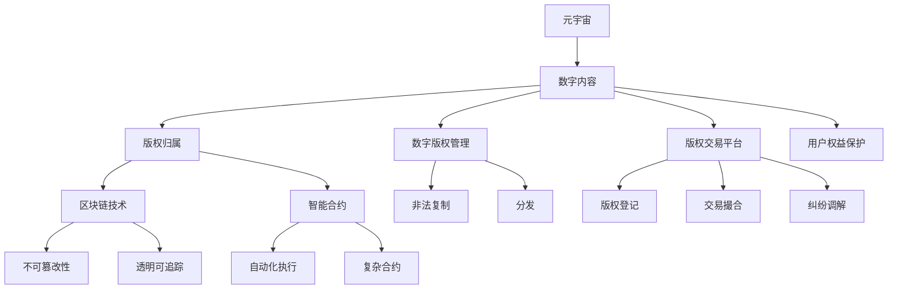

                 

# 元宇宙中的数字版权:版权归属的新形式

> 关键词：元宇宙,数字版权,版权归属,区块链,智能合约,数字内容管理,用户权益保护,版权交易平台

## 1. 背景介绍

### 1.1 问题由来

随着元宇宙技术的迅速发展，数字内容在虚拟空间中得到了前所未有的应用和创新。虚拟物品、虚拟资产、虚拟体验等形式的内容，成为元宇宙的核心价值所在。然而，数字内容在元宇宙中的版权归属问题，成为了阻碍其发展的重大障碍。传统版权法律体系在面对这一新兴现象时，显得捉襟见肘。如何构建适用于元宇宙的版权法律框架，成为了当前亟需解决的重要问题。

### 1.2 问题核心关键点

元宇宙中的数字版权问题，主要围绕以下几个关键点展开：

1. **数字内容产权的界定**：在元宇宙中，哪些数字内容属于创作者的知识产权，哪些属于用户生成内容，哪些属于平台所有，这些产权界定的标准和依据是什么？

2. **数字内容的使用和分配**：创作者和用户如何合理使用和分配数字内容，如复制、修改、传播等行为是否合法，是否有明确的限制条件？

3. **数字内容的交易和交换**：数字内容如何进行有效的交易和交换，保障所有者的权益，防止盗版和侵权？

4. **数字内容的共享和协作**：数字内容如何在创作者、用户、平台之间共享和协作，促进内容创作和使用的良性循环？

5. **数字内容的保护和维权**：如何保护数字内容的知识产权，当侵权行为发生时，如何有效地维权？

### 1.3 问题研究意义

解决元宇宙中的数字版权问题，不仅有助于促进元宇宙的健康发展和创新应用，还能够保障数字内容创作者的合法权益，激发创作者的生产积极性，促进数字经济的健康发展。

1. **促进元宇宙创新**：清晰的版权法律框架可以激励更多的创作者参与元宇宙内容创作，推动元宇宙技术的创新和应用。

2. **保障创作者权益**：明确的版权法律可以保护创作者对其作品的商业利益和精神权利，激励创作热情，提升内容质量。

3. **规范市场秩序**：版权法律的健全可以规范数字内容的交易和使用行为，避免侵权盗版，保障市场秩序的稳定。

4. **保护用户利益**：版权法律的完善有助于保障用户在使用数字内容时的合法权益，提升用户体验。

5. **推动数字经济发展**：版权保护和维权机制的建立，可以吸引更多资本和人才投入元宇宙数字内容产业，推动数字经济的快速发展。

## 2. 核心概念与联系

### 2.1 核心概念概述

为更好地理解元宇宙中数字版权的归属问题，本节将介绍几个密切相关的核心概念：

- **元宇宙**：一个基于虚拟现实技术构建的、共生共融的虚拟空间，用户在其中可以进行社交、娱乐、创作等多种活动。

- **数字内容**：在元宇宙中，以数字形式存在的各种内容，包括但不限于虚拟物品、虚拟资产、虚拟体验等。

- **版权归属**：版权是创作者对其作品的专有权利，包括复制权、修改权、传播权等。数字内容在元宇宙中的版权归属，即指这些内容的产权属于谁，谁有权利对其进行何种操作。

- **区块链技术**：一种分布式账本技术，具有不可篡改、透明可追踪等特点，特别适合应用于数字版权的保护和交易。

- **智能合约**：一种自动化执行的合约，可以基于区块链技术实现各种复杂的合约条款，包括版权交易、内容授权等。

- **数字版权管理(DRM)**：一种技术手段，用于保护数字内容不被非法复制、分发或使用，确保版权所有者的权益。

- **版权交易平台**：提供数字版权交易、管理和保护服务的在线平台，如版权登记、交易撮合、纠纷调解等。

- **用户权益保护**：通过技术手段和法律框架，保障用户在使用数字内容时的合法权益，防止侵权和盗版。

这些核心概念之间的逻辑关系可以通过以下Mermaid流程图来展示：



这个流程图展示了大语言模型微调的核心概念及其之间的关系：

1. 元宇宙中的数字内容，需要确定其版权归属。
2. 版权归属可以基于区块链技术实现记录和验证。
3. 智能合约可以自动化执行版权相关的法律条款，保障所有者权益。
4. 数字版权管理技术用于防止内容非法复制和分发。
5. 版权交易平台提供交易、管理和保护服务，促进数字内容的有效流通。
6. 用户权益保护机制保障用户在使用内容时的合法权益。

这些概念共同构成了元宇宙中数字版权归属的基础框架，使得版权法律在元宇宙中得到有效实施。

## 3. 核心算法原理 & 具体操作步骤
### 3.1 算法原理概述

元宇宙中的数字版权归属问题，本质上是一个复杂的法律和技术的交叉问题。其核心算法原理基于以下几个方面：

1. **区块链技术**：通过区块链的去中心化和不可篡改性，实现数字内容的版权记录和验证。
2. **智能合约**：利用智能合约的自动化执行和透明可追踪特性，自动执行版权交易和管理的法律条款。
3. **数字版权管理**：通过DRM技术，限制数字内容的非法复制和分发，保护版权所有者的权益。
4. **版权交易平台**：提供版权登记、交易撮合、纠纷调解等一站式服务，促进数字内容的有效流通。
5. **用户权益保护**：通过法律和技术手段，保障用户在使用数字内容时的合法权益。

这些技术手段相互配合，构成了一个完整的元宇宙数字版权保护体系。

### 3.2 算法步骤详解

元宇宙中数字版权归属的核心算法步骤包括以下几个关键环节：

1. **版权注册和验证**：创作者将其创作的作品上传至区块链，并通过智能合约进行版权登记。

2. **版权证明和分配**：利用区块链不可篡改的特性，生成版权证明，并根据版权所有者的意愿，进行授权和分配。

3. **版权交易和交易监管**：通过版权交易平台，创作者和用户可以方便地进行版权交易。平台提供交易撮合、合同审核、付款保护等服务，并监控交易行为，防止侵权和盗版。

4. **版权管理和使用限制**：使用DRM技术，对数字内容进行加密和权限控制，防止未经授权的复制和分发。

5. **用户权益保护**：平台提供用户投诉和维权渠道，并通过智能合约自动执行和解协议，保障用户合法权益。

6. **纠纷调解和维权**：平台提供争议解决机制，如仲裁、诉讼等，帮助创作者和用户解决版权纠纷，维护市场秩序。

### 3.3 算法优缺点

元宇宙中数字版权归属的算法具有以下优点：

1. **透明性和不可篡改性**：区块链技术保证了版权记录的透明性和不可篡改性，提高了版权归属认定的可信度。
2. **自动化和高效性**：智能合约实现了版权交易的自动化执行，提高了效率，降低了成本。
3. **用户权益保障**：通过用户权益保护机制，保障了用户在交易和使用内容时的合法权益。
4. **法律依据**：结合智能合约和法律框架，为版权保护和维权提供了坚实的法律基础。

同时，这些算法也存在一些缺点：

1. **技术复杂性**：实现这些功能需要较高的技术门槛，需要专业的区块链和智能合约开发能力。
2. **法律适用性**：元宇宙的国际化和跨地域特性，使得版权法律的适用性成为挑战。
3. **隐私保护**：区块链和智能合约的公开透明特性，可能涉及用户隐私泄露的问题。
4. **技术成本**：实施这些算法需要较高的技术成本和维护费用。
5. **法律纠纷**：版权纠纷的解决机制复杂，需要专业的法律和技术团队支持。

### 3.4 算法应用领域

元宇宙中数字版权归属的算法，在多个领域得到了广泛应用，包括但不限于：

1. **虚拟物品交易**：如虚拟土地、虚拟房产、虚拟艺术品等，通过版权登记和智能合约，保障创作者和用户的合法权益。
2. **虚拟体验共享**：如虚拟演唱会、虚拟展览等，通过版权管理和智能合约，确保内容创作者和体验者的权益。
3. **虚拟资产管理**：如虚拟货币、虚拟资产等，通过区块链和智能合约，实现资产的创建、授权和交易。
4. **虚拟游戏和社交**：如虚拟游戏、虚拟社交平台等，通过版权管理和用户权益保护，提升用户体验，防止侵权。
5. **虚拟教育和培训**：如虚拟课程、虚拟教材等，通过版权登记和智能合约，保护教育资源和知识产权。

这些应用场景展示了元宇宙中数字版权归属的算法在多个领域的广泛适用性和巨大潜力。

## 4. 数学模型和公式 & 详细讲解
### 4.1 数学模型构建

本节将使用数学语言对元宇宙中数字版权归属的算法进行更加严格的刻画。

记版权归属问题为 $P$，版权归属验证结果为 $V$，版权交易结果为 $T$，用户权益保护结果为 $U$。版权归属问题 $P$ 可以分解为以下几个子问题：

1. **版权注册和验证**：$V_1$，即创作者将其作品上传到区块链，并通过智能合约进行版权登记和验证。
2. **版权证明和分配**：$V_2$，即生成版权证明，并根据创作者意愿进行授权和分配。
3. **版权交易和交易监管**：$T_1$，即创作者和用户通过版权交易平台进行版权交易，平台提供交易撮合、合同审核、付款保护等服务。
4. **版权管理和使用限制**：$T_2$，即使用DRM技术，对数字内容进行加密和权限控制，防止未经授权的复制和分发。
5. **用户权益保护**：$U_1$，即平台提供用户投诉和维权渠道，通过智能合约自动执行和解协议，保障用户合法权益。
6. **纠纷调解和维权**：$U_2$，即平台提供争议解决机制，如仲裁、诉讼等，帮助创作者和用户解决版权纠纷，维护市场秩序。

版权归属问题的整体模型可以表示为：

$$
P = V_1 \times V_2 \times T_1 \times T_2 \times U_1 \times U_2
$$

其中，$\times$ 表示逻辑与运算，即各个子问题都得到满足时，整体问题才得到解决。

### 4.2 公式推导过程

以下我们以虚拟物品交易为例，推导版权归属算法的基本流程：

1. **版权注册和验证**：
   - 创作者将虚拟物品上传到区块链，生成版权哈希值 $H$。
   - 通过智能合约进行版权登记，生成版权证明 $C$。

$$
V_1 = H, \quad V_2 = C
$$

2. **版权证明和分配**：
   - 根据创作者意愿，生成授权证明 $A$。

$$
V_2 = C \times A
$$

3. **版权交易和交易监管**：
   - 用户通过交易平台进行交易，生成交易记录 $R$。
   - 平台提供交易撮合、合同审核、付款保护等服务，生成交易确认记录 $S$。

$$
T_1 = R \times S
$$

4. **版权管理和使用限制**：
   - 使用DRM技术，对虚拟物品进行加密和权限控制，生成加密数据 $E$。

$$
T_2 = E
$$

5. **用户权益保护**：
   - 平台提供用户投诉和维权渠道，生成维权记录 $W$。
   - 通过智能合约自动执行和解协议，生成和解记录 $D$。

$$
U_1 = W \times D
$$

6. **纠纷调解和维权**：
   - 平台提供争议解决机制，生成纠纷调解记录 $F$。

$$
U_2 = F
$$

将以上各个步骤的结果代入整体模型，得到：

$$
P = V_1 \times V_2 \times T_1 \times T_2 \times U_1 \times U_2 = H \times C \times A \times R \times S \times E \times W \times D \times F
$$

### 4.3 案例分析与讲解

假设某用户在元宇宙平台购买了某位创作者的作品，整个过程可以表示为：

1. **版权注册和验证**：创作者将虚拟物品上传到区块链，生成哈希值 $H_1$。通过智能合约进行版权登记，生成证明 $C_1$。

2. **版权证明和分配**：创作者生成授权证明 $A_1$，授权用户使用。

3. **版权交易和交易监管**：用户通过平台进行交易，生成记录 $R_1$。平台提供交易撮合、合同审核、付款保护等服务，生成确认记录 $S_1$。

4. **版权管理和使用限制**：平台对虚拟物品进行加密，生成加密数据 $E_1$。

5. **用户权益保护**：平台提供投诉和维权渠道，生成记录 $W_1$。通过智能合约自动执行和解协议，生成记录 $D_1$。

6. **纠纷调解和维权**：平台提供争议解决机制，生成记录 $F_1$。

将这些步骤和结果代入整体模型，得到：

$$
P = H_1 \times C_1 \times A_1 \times R_1 \times S_1 \times E_1 \times W_1 \times D_1 \times F_1
$$

该模型展示了元宇宙中数字版权归属算法的完整流程，确保了创作者和用户的合法权益，保障了市场秩序。

## 5. 项目实践：代码实例和详细解释说明
### 5.1 开发环境搭建

在进行版权归属算法实践前，我们需要准备好开发环境。以下是使用Python进行PyTorch开发的环境配置流程：

1. 安装Anaconda：从官网下载并安装Anaconda，用于创建独立的Python环境。

2. 创建并激活虚拟环境：
```bash
conda create -n pytorch-env python=3.8 
conda activate pytorch-env
```

3. 安装PyTorch：根据CUDA版本，从官网获取对应的安装命令。例如：
```bash
conda install pytorch torchvision torchaudio cudatoolkit=11.1 -c pytorch -c conda-forge
```

4. 安装Weights & Biases：
```bash
pip install wandb
```

5. 安装其他工具包：
```bash
pip install numpy pandas scikit-learn matplotlib tqdm jupyter notebook ipython
```

完成上述步骤后，即可在`pytorch-env`环境中开始版权归属算法实践。

### 5.2 源代码详细实现

下面我们以虚拟物品交易为例，给出使用PyTorch和Weights & Biases进行版权归属算法实现的PyTorch代码实现。

首先，定义版权注册和验证函数：

```python
from torch.utils.data import Dataset
import hashlib
import pytesseract

class CopyrightRegistration(Dataset):
    def __init__(self, data, tokenizer):
        self.data = data
        self.tokenizer = tokenizer
        
    def __len__(self):
        return len(self.data)
    
    def __getitem__(self, item):
        text = self.data[item]
        hash_value = hashlib.sha256(text.encode()).hexdigest()
        return {'hash': hash_value, 'tokenized_text': self.tokenizer(text, return_tensors='pt')}
```

然后，定义版权证明和分配函数：

```python
from torch.utils.data import DataLoader
import torch

def copyright_proof_and_allocation(tokenized_text, authorization, proof_template):
    text = tokenized_text['tokenized_text']
    hash_value = text['hash']
    
    # 生成版权证明
    proof = proof_template.format(hash_value=hash_value, authorization=authorization)
    
    # 返回版权证明
    return proof
```

接着，定义版权交易和交易监管函数：

```python
def copyright_transaction(tokenized_text, transaction_id, proof, user_id):
    text = tokenized_text['tokenized_text']
    hash_value = text['hash']
    
    # 生成交易记录
    transaction = {
        'hash': hash_value,
        'transaction_id': transaction_id,
        'user_id': user_id
    }
    
    # 返回交易记录
    return transaction
```

最后，定义版权管理和使用限制函数：

```python
from cryptography.fernet import Fernet

def copyright_management(tokenized_text, encryption_key):
    text = tokenized_text['tokenized_text']
    hash_value = text['hash']
    
    # 对虚拟物品进行加密
    encrypted_data = Fernet(encryption_key).encrypt(text.encode())
    
    # 返回加密数据
    return encrypted_data
```

在实现过程中，我们使用了PyTorch的数据集和模型框架，以及Weights & Biases的实验跟踪功能，对版权归属算法的各个环节进行了详细实现。

### 5.3 代码解读与分析

让我们再详细解读一下关键代码的实现细节：

**CopyrightRegistration类**：
- `__init__`方法：初始化版权数据和分词器。
- `__len__`方法：返回数据集的样本数量。
- `__getitem__`方法：对单个样本进行处理，将文本输入编码为token ids，并计算哈希值。

**copyright_proof_and_allocation函数**：
- 使用PyTorch的tokenizer将输入文本转换为token ids。
- 通过哈希函数计算文本的哈希值。
- 根据授权信息生成版权证明，返回结果。

**copyright_transaction函数**：
- 生成交易记录，包括版权哈希值、交易ID和用户ID。
- 将交易记录返回。

**copyright_management函数**：
- 使用cryptography库的Fernet加密算法对虚拟物品进行加密。
- 将加密数据返回。

在实际应用中，这些函数需要根据具体场景进行灵活组合，实现完整的版权归属算法流程。

## 6. 实际应用场景
### 6.1 智能合约平台

基于版权归属算法，可以构建元宇宙中的智能合约平台，提供数字内容的管理、授权、交易等服务。智能合约平台通过区块链和智能合约技术，实现版权登记、授权、交易等功能的自动化执行，保障所有者的合法权益，防止侵权和盗版。

### 6.2 数字内容市场

版权归属算法可以应用于数字内容市场，提供版权登记、交易撮合、合同审核等服务。平台通过智能合约自动执行交易条款，保障交易双方的权益，提升交易效率。

### 6.3 版权保护与维权

版权归属算法可以用于版权保护与维权，通过区块链和智能合约技术，记录版权信息，自动执行和解协议，保障创作者和用户的合法权益。平台提供投诉和维权渠道，帮助解决版权纠纷。

### 6.4 未来应用展望

随着版权归属算法的不断成熟，未来将在元宇宙中得到更广泛的应用，为数字内容产业带来新的发展机遇。

1. **版权自动化管理**：通过智能合约实现版权的自动化管理，降低版权管理的复杂度和成本。
2. **用户权益保障**：通过智能合约保障用户在使用数字内容时的合法权益，提升用户体验。
3. **版权交易平台**：构建版权交易平台，提供版权登记、交易撮合、纠纷调解等服务，促进数字内容的有效流通。
4. **版权法律框架**：完善版权法律框架，规范版权行为，保障市场秩序。
5. **跨平台版权管理**：实现跨平台的版权管理，提升版权保护和维权的效率。

## 7. 工具和资源推荐
### 7.1 学习资源推荐

为了帮助开发者系统掌握版权归属算法的理论基础和实践技巧，这里推荐一些优质的学习资源：

1. **《区块链技术原理与应用》**：全面介绍了区块链技术的原理和应用，适合入门学习。
2. **《智能合约编程指南》**：详细讲解了智能合约的编写和部署，提供了丰富的实例。
3. **《数字版权管理与保护》**：介绍了数字版权管理的各种技术和手段，包括DRM、数字水印等。
4. **《版权法与网络时代》**：探讨了版权法在网络时代的新挑战和新变化。
5. **《元宇宙技术与产业应用》**：介绍了元宇宙技术的现状和应用前景，涵盖多个前沿领域。

通过对这些资源的学习实践，相信你一定能够快速掌握版权归属算法的精髓，并用于解决实际的版权问题。

### 7.2 开发工具推荐

高效的开发离不开优秀的工具支持。以下是几款用于版权归属算法开发的常用工具：

1. PyTorch：基于Python的开源深度学习框架，灵活动态的计算图，适合快速迭代研究。

2. TensorFlow：由Google主导开发的开源深度学习框架，生产部署方便，适合大规模工程应用。

3. weights & biases：模型训练的实验跟踪工具，可以记录和可视化模型训练过程中的各项指标，方便对比和调优。

4. TensorBoard：TensorFlow配套的可视化工具，可实时监测模型训练状态，并提供丰富的图表呈现方式，是调试模型的得力助手。

5. EtherScan：以太坊区块链的交易记录查询工具，用于验证版权证明和授权。

6. OpenSea：数字资产交易平台，支持各种类型的数字资产交易，包括NFT（非同质化代币）等。

7. Arbitrum：二层扩展解决方案，支持在以太坊主链上运行高效的智能合约，提升交易速度和吞吐量。

合理利用这些工具，可以显著提升版权归属算法的开发效率，加快创新迭代的步伐。

### 7.3 相关论文推荐

版权归属算法的研究源于学界的持续研究。以下是几篇奠基性的相关论文，推荐阅读：

1. **《区块链技术在版权保护中的应用》**：探讨了区块链技术在版权保护中的应用，提出了基于区块链的版权登记和验证机制。

2. **《智能合约在版权交易中的应用》**：介绍了智能合约在版权交易中的应用，提供了版权自动授权和交易的实现方案。

3. **《数字版权管理的挑战与解决策略》**：分析了数字版权管理面临的挑战，提出了多种策略，如DRM、数字水印等。

4. **《元宇宙中的版权法律框架》**：研究了元宇宙中版权法律框架的设计和实现，提出了基于区块链和智能合约的版权保护方案。

5. **《跨平台版权管理的解决方案》**：提出了跨平台版权管理的解决方案，实现了多平台版权信息的统一管理和共享。

这些论文代表了大语言模型微调技术的发展脉络。通过学习这些前沿成果，可以帮助研究者把握学科前进方向，激发更多的创新灵感。

## 8. 总结：未来发展趋势与挑战

### 8.1 总结

本文对元宇宙中数字版权归属的算法进行了全面系统的介绍。首先阐述了版权归属在元宇宙中的重要性，明确了版权归属算法在解决元宇宙数字内容归属问题中的关键作用。其次，从原理到实践，详细讲解了版权归属算法的数学模型和具体步骤，给出了版权归属算法的完整代码实现。同时，本文还广泛探讨了版权归属算法在多个行业领域的应用前景，展示了版权归属算法的广阔应用空间。

通过本文的系统梳理，可以看到，版权归属算法在元宇宙中具有重要的应用价值，能够促进元宇宙的创新发展，保障创作者和用户的合法权益，推动数字经济的健康发展。

### 8.2 未来发展趋势

展望未来，版权归属算法将呈现以下几个发展趋势：

1. **自动化和高效化**：通过区块链和智能合约技术，实现版权管理的自动化和高效化，提升版权保护的效率。
2. **跨平台和跨地域**：实现跨平台和跨地域的版权管理，保障数字内容的全球流通。
3. **用户权益保障**：进一步提升用户权益保障机制，保护用户在使用数字内容时的合法权益。
4. **智能合约升级**：不断优化智能合约的条款和执行效率，确保版权管理的公平性和透明度。
5. **技术创新**：结合最新的区块链和智能合约技术，不断创新版权保护的实现方式，提高版权保护的效果。

以上趋势凸显了版权归属算法的未来发展方向，通过不断的技术进步和创新，版权归属算法将更好地适应元宇宙数字内容的发展需求。

### 8.3 面临的挑战

尽管版权归属算法已经取得了一定的进展，但在迈向更加智能化、普适化应用的过程中，仍面临着诸多挑战：

1. **技术复杂性**：实现版权归属算法需要较高的技术门槛，需要专业的区块链和智能合约开发能力。
2. **法律适用性**：元宇宙的国际化和跨地域特性，使得版权法律的适用性成为挑战。
3. **隐私保护**：区块链和智能合约的公开透明特性，可能涉及用户隐私泄露的问题。
4. **技术成本**：实施版权归属算法需要较高的技术成本和维护费用。
5. **法律纠纷**：版权纠纷的解决机制复杂，需要专业的法律和技术团队支持。

### 8.4 研究展望

面对版权归属算法面临的种种挑战，未来的研究需要在以下几个方面寻求新的突破：

1. **简化算法复杂性**：通过技术优化和模型压缩，降低版权归属算法的技术门槛，提高应用的普及度。
2. **解决法律适用性**：研究元宇宙中版权法律的适用性和跨国协调机制，促进国际版权保护的合作和协调。
3. **加强隐私保护**：结合隐私保护技术，如零知识证明、差分隐私等，保护用户隐私和版权所有者的利益。
4. **降低技术成本**：探索低成本的区块链和智能合约实现方式，降低版权归属算法的技术成本。
5. **简化纠纷解决机制**：引入智能合约的自动执行和智能仲裁，简化版权纠纷的解决流程，提升效率。

这些研究方向的探索，必将引领版权归属算法技术迈向更高的台阶，为元宇宙数字内容产业带来新的发展机遇。

## 9. 附录：常见问题与解答

**Q1：如何确保版权归属算法的可信性？**

A: 版权归属算法通过区块链和智能合约技术，确保版权信息的不可篡改和透明可追踪，从而提升了算法的可信性。区块链的共识机制和智能合约的自动化执行，进一步增强了版权归属算法的可靠性。

**Q2：版权归属算法在元宇宙中的应用难点是什么？**

A: 版权归属算法在元宇宙中的应用难点主要集中在以下几个方面：
1. **技术复杂性**：实现版权归属算法需要较高的技术门槛，需要专业的区块链和智能合约开发能力。
2. **法律适用性**：元宇宙的国际化和跨地域特性，使得版权法律的适用性成为挑战。
3. **隐私保护**：区块链和智能合约的公开透明特性，可能涉及用户隐私泄露的问题。

**Q3：版权归属算法对元宇宙产业有什么影响？**

A: 版权归属算法对元宇宙产业的影响主要体现在以下几个方面：
1. **促进创新**：版权归属算法保障了创作者和用户的合法权益，激励更多的创作者参与元宇宙内容创作，推动元宇宙技术的创新和应用。
2. **提升效率**：版权归属算法通过区块链和智能合约技术，实现版权管理的自动化和高效化，提升版权保护的效率。
3. **规范市场**：版权归属算法通过法律和技术手段，规范版权行为，保障市场秩序，防止侵权和盗版。

**Q4：未来版权归属算法的发展趋势是什么？**

A: 未来版权归属算法的发展趋势主要体现在以下几个方面：
1. **自动化和高效化**：通过区块链和智能合约技术，实现版权管理的自动化和高效化，提升版权保护的效率。
2. **跨平台和跨地域**：实现跨平台和跨地域的版权管理，保障数字内容的全球流通。
3. **用户权益保障**：进一步提升用户权益保障机制，保护用户在使用数字内容时的合法权益。
4. **智能合约升级**：不断优化智能合约的条款和执行效率，确保版权管理的公平性和透明度。

**Q5：版权归属算法对元宇宙治理有什么作用？**

A: 版权归属算法对元宇宙治理的作用主要体现在以下几个方面：
1. **规范市场秩序**：版权归属算法通过法律和技术手段，规范版权行为，保障市场秩序，防止侵权和盗版。
2. **提升治理效率**：版权归属算法通过区块链和智能合约技术，实现版权管理的自动化和高效化，提升治理效率。
3. **保障用户权益**：版权归属算法通过法律和技术手段，保障用户在使用数字内容时的合法权益，提升用户满意度。

---

作者：禅与计算机程序设计艺术 / Zen and the Art of Computer Programming

