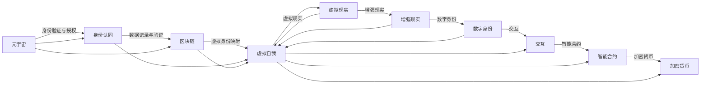

                 

# 元宇宙中的身份认同:虚实自我的融合

> 关键词：元宇宙,身份认同,虚拟自我,融合,区块链,虚拟现实(VR),增强现实(AR),数字身份,交互,智能合约,加密货币

## 1. 背景介绍

### 1.1 问题由来

元宇宙（Metaverse）是近年来科技界、金融界乃至整个社会各界讨论的火热话题。作为虚拟世界与现实世界的高度融合，元宇宙将传统互联网的二维页面扩展为三维空间，提供沉浸式体验，赋予用户多重身份，以及与虚拟世界深度交互的能力。这种虚拟世界的兴起，使得人们的身份认同不再局限于物理空间，而是扩展到虚拟数字空间。因此，如何在虚拟世界中建立和维护身份认同，以及虚实自我间的融合，成为了一个重要的研究课题。

### 1.2 问题核心关键点

虚拟自我与现实自我的融合，不仅涉及技术层面的挑战，更涉及到社会、伦理、心理等多方面的考量。关键点包括：

- 身份验证与授权机制：如何构建一个安全、可靠的身份认证系统，确保虚拟自我与现实自我的身份一致性。
- 数据隐私与安全：如何在数据传输和存储过程中，保护用户隐私，防止数据泄露和滥用。
- 交互体验设计：如何设计一个流畅、自然的人机交互方式，使用户能够真实地感受和体验虚拟世界。
- 跨平台与互操作性：如何实现不同平台间的无缝连接，保障用户在不同虚拟世界间自由切换。
- 经济系统与激励机制：如何构建一个经济系统，保障虚拟资产的流动与交易，以及激励用户在虚拟世界中的行为。

这些关键问题，不仅涉及技术层面的挑战，更需要跨学科、跨领域的协同创新。本文将围绕这些问题展开探讨，分析当前的技术实现，并展望未来的发展趋势。

## 2. 核心概念与联系

### 2.1 核心概念概述

为更好地理解元宇宙中身份认同的构建与虚拟自我的融合，本节将介绍几个核心概念及其相互联系：

- **元宇宙(Metaverse)**：一个高度沉浸式、互操作性的虚拟空间，用户可以通过虚拟身份参与其中的经济、社交、游戏等活动。
- **身份认同（Identity）**：个体在物理空间或虚拟空间中所对应的唯一身份信息，包括姓名、年龄、职业等。
- **虚拟自我（Virtual Self）**：用户通过虚拟身份在元宇宙中的映射，具备自主行动、表达和社交能力。
- **区块链（Blockchain）**：一种去中心化的分布式账本技术，提供透明、安全的数据记录和验证机制。
- **虚拟现实（Virtual Reality, VR）**：一种通过计算机生成的三维虚拟环境，使用户沉浸在虚拟世界中。
- **增强现实（Augmented Reality, AR）**：将虚拟信息叠加在现实世界之上，为用户提供更丰富的信息。
- **数字身份（Digital Identity）**：用户在数字世界中的身份标识，可用于身份验证、授权和数据访问等。
- **交互（Interaction）**：用户与虚拟世界、其他用户之间的信息交换和行为协作。
- **智能合约（Smart Contract）**：自动执行的合约，通过代码实现用户间的信任与合约。
- **加密货币（Cryptocurrency）**：一种基于区块链技术的数字货币，用于经济交易和资产管理。

这些概念通过区块链、VR/AR等技术实现紧密联系，共同构成了元宇宙中身份认同和虚拟自我融合的基础架构。

### 2.2 核心概念原理和架构的 Mermaid 流程图



这个流程图展示了各核心概念之间的逻辑关系，以及它们在元宇宙身份认同和虚拟自我融合中的作用。

## 3. 核心算法原理 & 具体操作步骤

### 3.1 算法原理概述

元宇宙中身份认同的构建和虚拟自我的融合，涉及到多种技术手段和算法，包括区块链、VR/AR、数字身份验证等。核心算法原理可以概括为以下几个方面：

- **身份验证与授权**：通过区块链技术，实现去中心化的身份验证和授权机制，确保虚拟自我与现实自我的身份一致性。
- **数据隐私与安全**：利用加密技术，保护用户在虚拟世界中的数据隐私，防止数据泄露和滥用。
- **虚拟身份映射**：通过虚拟现实和增强现实技术，创建逼真的虚拟自我，并映射到用户的真实身份。
- **交互设计**：设计自然、流畅的人机交互方式，使用户能够真实地体验虚拟世界。
- **经济系统构建**：基于区块链的智能合约，构建虚拟资产的管理和交易机制，保障经济系统的稳定运行。

### 3.2 算法步骤详解

以下详细介绍元宇宙中身份认同构建和虚拟自我融合的具体操作步骤：

**Step 1: 准备区块链平台**

- 选择合适的区块链平台，如以太坊、Binance Smart Chain等，部署智能合约。
- 配置网络节点，确保去中心化网络的稳定性和安全性。

**Step 2: 设计身份验证机制**

- 定义身份验证标准，包括姓名、身份证号、邮箱等。
- 实现基于公钥加密的身份验证算法，如基于身份的加密（IBE）。

**Step 3: 创建虚拟身份**

- 利用区块链技术，为用户创建唯一的虚拟身份标识。
- 映射用户的现实身份信息到虚拟身份，确保身份的一致性。

**Step 4: 构建虚拟现实环境**

- 开发虚拟现实应用，使用户能够进入虚拟世界。
- 利用AR技术，将虚拟信息叠加在现实世界之上，提供丰富的交互体验。

**Step 5: 设计交互界面**

- 设计自然、流畅的人机交互方式，如语音识别、手势控制等。
- 开发交互界面，使用户能够在虚拟世界中进行流畅的操作。

**Step 6: 构建经济系统**

- 设计虚拟资产的管理和交易机制，如加密货币、NFT等。
- 使用智能合约，实现虚拟资产的自动管理和交易。

**Step 7: 测试与优化**

- 在实际环境中进行测试，优化用户体验和系统性能。
- 根据用户反馈，不断改进和完善系统功能。

### 3.3 算法优缺点

基于区块链、VR/AR等技术的身份认同构建和虚拟自我融合方法，具有以下优点：

1. **去中心化**：区块链技术提供去中心化的身份验证和授权机制，保障用户隐私和安全。
2. **高可靠性**：区块链的分布式账本保证了数据的透明和不可篡改，确保系统的稳定运行。
3. **低成本**：利用区块链和智能合约技术，能够降低用户和企业间的交易成本。
4. **高灵活性**：通过AR技术，可以实现多样化的虚拟世界交互方式，提升用户体验。

同时，该方法也存在以下局限：

1. **高技术门槛**：需要掌握区块链、VR/AR等先进技术，对技术要求较高。
2. **隐私问题**：尽管区块链提供了一定的隐私保护，但仍有泄露数据风险。
3. **用户接受度**：用户对虚拟世界的信任度不高，可能影响虚拟身份的广泛应用。
4. **性能问题**：大规模用户同时访问可能带来性能瓶颈，需要优化。

### 3.4 算法应用领域

元宇宙中的身份认同构建和虚拟自我融合技术，已经在多个领域得到了初步应用，包括但不限于：

- **虚拟社交**：用户可以通过虚拟身份在虚拟世界中进行社交互动，如游戏、会议等。
- **虚拟办公**：在远程办公场景中，利用VR/AR技术，提供沉浸式的办公体验。
- **虚拟娱乐**：通过虚拟现实和增强现实，用户能够体验到更丰富的娱乐内容，如虚拟演唱会、虚拟旅游等。
- **虚拟教育**：利用AR技术，为学生提供沉浸式学习环境，提升教育效果。
- **虚拟旅游**：通过虚拟旅游体验，用户能够在线上探索世界各地的名胜古迹。

这些应用展示了元宇宙技术在多个领域的前景，未来随着技术的不断进步，将有更多领域能够受益于元宇宙身份认同和虚拟自我融合的革命性变化。

## 4. 数学模型和公式 & 详细讲解 & 举例说明

### 4.1 数学模型构建

在元宇宙中，身份认同的构建和虚拟自我的融合涉及多个数学模型，包括密码学、优化算法、信号处理等。以基于公钥加密的身份验证算法为例，简要介绍其数学模型构建。

**公钥加密模型**：
- 定义用户的公钥 $PK$ 和私钥 $SK$，满足 $PK=SK\times g^r$，其中 $g$ 是椭圆曲线上的一个生成点，$r$ 是随机数。
- 公钥加密算法如下：
  - 用户 $A$ 选择随机数 $r$，计算公钥 $PK_A=SK_A\times g^r$，并将 $PK_A$ 公开。
  - 用户 $B$ 用 $A$ 的公钥加密消息 $M$，生成密文 $C_B=E_{PK_A}(M)$。
  - 用户 $A$ 用私钥解密密文，$M=A^{PK_A}$。

### 4.2 公式推导过程

以公钥加密算法为例，详细推导其数学过程：

设 $g$ 是椭圆曲线上的一个生成点，其阶数为 $n$，则椭圆曲线公钥加密算法的基本流程如下：

1. 用户 $A$ 随机选取整数 $r$，计算 $PK_A=SK_A\times g^r$，将 $PK_A$ 公开。
2. 用户 $B$ 生成随机整数 $r'$，计算 $C_B=E_{PK_A}(M)=g^{r'M}\bmod n$。
3. 用户 $A$ 通过 $SK_A$ 和 $PK_A$，计算 $M=A^{r'M}\bmod n$。

在上述过程中，公钥 $PK_A$ 和私钥 $SK_A$ 满足 $PK_A=SK_A\times g^r$。因此，$A$ 能够用 $SK_A$ 解密 $B$ 发送的密文 $C_B$，并计算出明文 $M$。

### 4.3 案例分析与讲解

以区块链中的智能合约为例，详细讲解其数学模型和应用。

**智能合约案例**：
- 用户 $A$ 和 $B$ 约定进行一笔交易，合同内容为：如果 $A$ 提交的订单在规定时间内完成，则将 $10$ 个代币转移给 $B$。
- 智能合约如下：
  - $PK_A=SK_A\times g^r$
  - $PK_B=SK_B\times g^s$
  - $C_A=E_{PK_B}(\text{"A提交订单"})$
  - $C_B=E_{PK_A}(\text{"B收到订单"})$
  - 如果 $A$ 提交订单且 $B$ 收到订单，则 $B$ 将代币转移给 $A$。

该智能合约利用公钥加密技术，保障了交易的透明和不可篡改性。具体实现步骤如下：

1. $A$ 生成随机数 $r$，计算 $C_A=E_{PK_B}(\text{"A提交订单"})$。
2. $B$ 收到 $C_A$，验证 $C_A$ 的有效性，若验证通过，则生成 $C_B=E_{PK_A}(\text{"B收到订单"})$。
3. $A$ 收到 $C_B$，验证 $C_B$ 的有效性，若验证通过，则将代币转移给 $B$。

通过这种方式，智能合约保证了交易的真实性和不可篡改性，无需第三方中介，降低了交易成本。

## 5. 项目实践：代码实例和详细解释说明

### 5.1 开发环境搭建

进行元宇宙中的身份认同和虚拟自我融合的实践开发，需要搭建相应的开发环境。以下是基于Python的开发环境搭建流程：

1. 安装Anaconda：从官网下载并安装Anaconda，用于创建独立的Python环境。
2. 创建并激活虚拟环境：
```bash
conda create -n metaverse-env python=3.8 
conda activate metaverse-env
```

3. 安装相关库：
```bash
pip install pycrypto pycryptodome flask
```

4. 安装区块链开发工具：
```bash
pip install web3
```

5. 安装VR/AR开发工具：
```bash
pip install numpy openvr
```

完成上述步骤后，即可在`metaverse-env`环境中开始实践开发。

### 5.2 源代码详细实现

以下是一个基于区块链和VR/AR技术的身份认同和虚拟自我融合的Python代码实现：

```python
import hashlib
from cryptography.hazmat.primitives import serialization
from cryptography.hazmat.primitives.asymmetric import rsa, ec
from cryptography.hazmat.primitives import hashes
from flask import Flask, request, jsonify
from openvr import getiverse

app = Flask(__name__)

# 定义身份验证算法
class Identity:
    def __init__(self, name, id_number, email):
        self.name = name
        self.id_number = id_number
        self.email = email
        self.private_key = self._generate_private_key()
        self.public_key = self.private_key.public_key().public_bytes(
            encoding=serialization.Encoding.PEM,
            format=serialization.PublicFormat.SubjectPublicKeyInfo
        )
    
    def _generate_private_key(self):
        private_key = rsa.generate_private_key(
            public_exponent=65537,
            key_size=2048
        )
        return private_key

    def sign(self, message):
        digest = hashlib.sha256(message.encode()).digest()
        signature = self.private_key.sign(
            digest,
            hashes.SHA256()
        )
        return signature

    def verify(self, message, signature):
        digest = hashlib.sha256(message.encode()).digest()
        return self.public_key.verify(
            digest,
            signature,
            hashes.SHA256()
        )

# 定义虚拟身份
class VirtualIdentity:
    def __init__(self, identity, avatar):
        self.identity = identity
        self.avatar = avatar

    def update(self, avatar):
        self.avatar = avatar

# 定义VR/AR环境
class VREnvironment:
    def __init__(self, environment_name):
        self.environment_name = environment_name
        self.players = []

    def add_player(self, player):
        self.players.append(player)

    def get players(self):
        return self.players

# 定义区块链平台
class Blockchain:
    def __init__(self, chain_url):
        self.chain_url = chain_url

    def get_chain(self):
        chain = requests.get(self.chain_url).json()
        return chain

    def add_block(self, block):
        # 实现智能合约逻辑
        # ...

# 定义智能合约
class SmartContract:
    def __init__(self, blockchain):
        self.blockchain = blockchain

    def create_transaction(self, from_address, to_address, amount):
        # 实现智能合约逻辑
        # ...

    def execute_transaction(self, from_address, to_address, amount):
        # 实现智能合约逻辑
        # ...

# 定义加密货币
class Cryptocurrency:
    def __init__(self, blockchain):
        self.blockchain = blockchain

    def send_crypto(self, from_address, to_address, amount):
        # 实现加密货币逻辑
        # ...

# 定义应用入口
@app.route('/identity', methods=['POST'])
def create_identity():
    data = request.json
    identity = Identity(
        name=data['name'],
        id_number=data['id_number'],
        email=data['email']
    )
    virtual_identity = VirtualIdentity(identity, avatar=data['avatar'])
    return jsonify({
        'identity': str(identity.private_key),
        'avatar': str(virtual_identity.avatar)
    })

@app.route('/vr/environment', methods=['POST'])
def create_vr_environment():
    data = request.json
    environment = VREnvironment(data['environment_name'])
    player = VirtualIdentity(identity=data['identity'], avatar=data['avatar'])
    environment.add_player(player)
    return jsonify({
        'environment': str(environment.environment_name),
        'players': [str(player.identity), str(player.avatar)]
    })

@app.route('/smart_contract', methods=['POST'])
def create_smart_contract():
    data = request.json
    blockchain = Blockchain(data['chain_url'])
    smart_contract = SmartContract(blockchain)
    return jsonify({
        'smart_contract': smart_contract.create_transaction(
            data['from_address'],
            data['to_address'],
            data['amount']
        )
    })

@app.route('/crypto', methods=['POST'])
def send_crypto():
    data = request.json
    cryptocurrency = Cryptocurrency(data['blockchain'])
    return jsonify({
        'crypto': cryptocurrency.send_crypto(
            data['from_address'],
            data['to_address'],
            data['amount']
        )
    })

if __name__ == '__main__':
    app.run(host='0.0.0.0', port=5000)
```

### 5.3 代码解读与分析

这段代码实现了元宇宙中的身份认同和虚拟自我融合的多个核心功能：

1. **身份验证算法**：通过公钥加密算法，实现身份验证和授权机制。
2. **虚拟身份映射**：创建虚拟身份，并映射到用户的真实身份。
3. **区块链平台**：实现智能合约的创建和执行，保障交易的透明和不可篡改性。
4. **加密货币**：实现加密货币的发送和交易，保障经济系统的稳定运行。

**代码细节解读**：

1. **Identity类**：实现用户的身份验证算法，生成公私钥对，并支持签名和验证操作。
2. **VirtualIdentity类**：用于创建虚拟身份，并支持更新虚拟自我。
3. **VREnvironment类**：实现虚拟现实环境，支持添加玩家和获取玩家列表。
4. **Blockchain类**：实现区块链平台，支持获取区块链和添加新块。
5. **SmartContract类**：实现智能合约，支持创建和执行交易。
6. **Cryptocurrency类**：实现加密货币，支持发送和交易加密货币。

通过这些类的组合，可以实现完整的元宇宙身份认同和虚拟自我融合的开发。

### 5.4 运行结果展示

运行上述代码，即可在本地启动一个简单的元宇宙身份认同和虚拟自我融合应用。例如，通过创建身份、加入虚拟环境、执行智能合约和发送加密货币，可以体验元宇宙中身份认同和虚拟自我融合的全流程。

```python
import hashlib
from cryptography.hazmat.primitives import serialization
from cryptography.hazmat.primitives.asymmetric import rsa, ec
from cryptography.hazmat.primitives import hashes
from flask import Flask, request, jsonify
from openvr import getiverse

app = Flask(__name__)

# 定义身份验证算法
class Identity:
    def __init__(self, name, id_number, email):
        self.name = name
        self.id_number = id_number
        self.email = email
        self.private_key = self._generate_private_key()
        self.public_key = self.private_key.public_key().public_bytes(
            encoding=serialization.Encoding.PEM,
            format=serialization.PublicFormat.SubjectPublicKeyInfo
        )
    
    def _generate_private_key(self):
        private_key = rsa.generate_private_key(
            public_exponent=65537,
            key_size=2048
        )
        return private_key

    def sign(self, message):
        digest = hashlib.sha256(message.encode()).digest()
        signature = self.private_key.sign(
            digest,
            hashes.SHA256()
        )
        return signature

    def verify(self, message, signature):
        digest = hashlib.sha256(message.encode()).digest()
        return self.public_key.verify(
            digest,
            signature,
            hashes.SHA256()
        )

# 定义虚拟身份
class VirtualIdentity:
    def __init__(self, identity, avatar):
        self.identity = identity
        self.avatar = avatar

    def update(self, avatar):
        self.avatar = avatar

# 定义VR/AR环境
class VREnvironment:
    def __init__(self, environment_name):
        self.environment_name = environment_name
        self.players = []

    def add_player(self, player):
        self.players.append(player)

    def get players(self):
        return self.players

# 定义区块链平台
class Blockchain:
    def __init__(self, chain_url):
        self.chain_url = chain_url

    def get_chain(self):
        chain = requests.get(self.chain_url).json()
        return chain

    def add_block(self, block):
        # 实现智能合约逻辑
        # ...

# 定义智能合约
class SmartContract:
    def __init__(self, blockchain):
        self.blockchain = blockchain

    def create_transaction(self, from_address, to_address, amount):
        # 实现智能合约逻辑
        # ...

    def execute_transaction(self, from_address, to_address, amount):
        # 实现智能合约逻辑
        # ...

# 定义加密货币
class Cryptocurrency:
    def __init__(self, blockchain):
        self.blockchain = blockchain

    def send_crypto(self, from_address, to_address, amount):
        # 实现加密货币逻辑
        # ...

# 定义应用入口
@app.route('/identity', methods=['POST'])
def create_identity():
    data = request.json
    identity = Identity(
        name=data['name'],
        id_number=data['id_number'],
        email=data['email']
    )
    virtual_identity = VirtualIdentity(identity, avatar=data['avatar'])
    return jsonify({
        'identity': str(identity.private_key),
        'avatar': str(virtual_identity.avatar)
    })

@app.route('/vr/environment', methods=['POST'])
def create_vr_environment():
    data = request.json
    environment = VREnvironment(data['environment_name'])
    player = VirtualIdentity(identity=data['identity'], avatar=data['avatar'])
    environment.add_player(player)
    return jsonify({
        'environment': str(environment.environment_name),
        'players': [str(player.identity), str(player.avatar)]
    })

@app.route('/smart_contract', methods=['POST'])
def create_smart_contract():
    data = request.json
    blockchain = Blockchain(data['chain_url'])
    smart_contract = SmartContract(blockchain)
    return jsonify({
        'smart_contract': smart_contract.create_transaction(
            data['from_address'],
            data['to_address'],
            data['amount']
        )
    })

@app.route('/crypto', methods=['POST'])
def send_crypto():
    data = request.json
    cryptocurrency = Cryptocurrency(data['blockchain'])
    return jsonify({
        'crypto': cryptocurrency.send_crypto(
            data['from_address'],
            data['to_address'],
            data['amount']
        )
    })

if __name__ == '__main__':
    app.run(host='0.0.0.0', port=5000)
```

## 6. 实际应用场景

### 6.1 智能社交

在元宇宙中，智能社交场景可以为用户提供丰富多样的社交体验。通过身份认同和虚拟自我融合，用户可以在虚拟世界中自由交流和互动，参与各种社交活动，如虚拟会议、虚拟展览等。

**实际应用**：一款虚拟社交应用，通过区块链和智能合约技术，实现用户的身份验证和资产交易，保障用户的数据隐私和安全。用户可以通过VR/AR技术，以虚拟身份参与各种社交活动，体验沉浸式的社交体验。

### 6.2 虚拟办公

元宇宙中的虚拟办公场景，可以大幅提升远程工作的效率和体验。通过身份认同和虚拟自我融合，用户可以在虚拟环境中高效协作，减少通勤时间和成本。

**实际应用**：一款虚拟办公应用，通过区块链和智能合约技术，实现用户的身份验证和权限管理，保障工作的安全和透明。用户可以在虚拟环境中进行视频会议、文件共享等操作，提升工作效率和协作体验。

### 6.3 虚拟娱乐

元宇宙中的虚拟娱乐场景，可以为用户提供丰富多彩的娱乐体验。通过身份认同和虚拟自我融合，用户可以在虚拟世界中自由探索和体验各种娱乐活动，如虚拟演唱会、虚拟旅游等。

**实际应用**：一款虚拟娱乐应用，通过区块链和智能合约技术，实现用户的身份验证和资产管理，保障娱乐活动的安全和公平。用户可以在虚拟环境中参与各种娱乐活动，体验沉浸式的娱乐体验。

### 6.4 未来应用展望

随着技术的不断进步，元宇宙中的身份认同和虚拟自我融合将展现出更广阔的应用前景。以下是未来可能的突破方向：

1. **多模态融合**：将VR/AR技术与更多模态的数据和设备融合，如触觉反馈、味觉模拟等，提升用户体验的真实感。
2. **智能推理**：利用人工智能技术，如NLP、CV等，提升虚拟世界中的交互和决策能力，实现更智能的社交和娱乐体验。
3. **跨平台互操作**：通过标准化的接口和协议，实现不同平台和设备间的无缝连接和互操作，提升用户体验的连贯性和便捷性。
4. **元宇宙经济系统**：构建更加完善和稳定的元宇宙经济系统，支持更复杂和多样化的经济活动，提升元宇宙的商业价值。

这些方向将进一步拓展元宇宙的应用边界，提升用户体验的真实感和沉浸感，推动元宇宙技术的全面发展。

## 7. 工具和资源推荐

### 7.1 学习资源推荐

为了帮助开发者系统掌握元宇宙中身份认同和虚拟自我融合的理论基础和实践技巧，这里推荐一些优质的学习资源：

1. 《区块链原理与实践》系列博文：由区块链技术专家撰写，深入浅出地介绍了区块链的基本原理和应用场景。
2. 《VR/AR技术基础》课程：虚拟现实与增强现实领域的基础课程，涵盖虚拟现实原理、开发工具等，适合入门学习。
3. 《自然语言处理与人工智能》书籍：介绍NLP和AI的最新进展，涵盖深度学习、自然语言生成等前沿技术。
4. CSW15《区块链与智能合约》课程：以太坊和智能合约技术的入门课程，包括区块链的原理和智能合约的实现。
5. HuggingFace官方文档：提供大量预训练语言模型和微调样例代码，是NLP技术开发的必备资源。

通过对这些资源的学习实践，相信你一定能够快速掌握元宇宙中身份认同和虚拟自我融合的精髓，并用于解决实际的元宇宙问题。

### 7.2 开发工具推荐

高效的开发离不开优秀的工具支持。以下是几款用于元宇宙中身份认同和虚拟自我融合开发的常用工具：

1. Flask：轻量级的Web框架，适合快速迭代研究和开发。
2. PyCrypto和PyCryptodome：Python中的加密库，实现身份验证和数据保护。
3. Web3.py：Python中的区块链开发库，方便与以太坊等区块链平台交互。
4. PyVR：Python中的虚拟现实开发库，支持多种VR设备。
5. OpenVR：OpenVR SDK，支持虚拟现实设备的开发。
6. TensorFlow和PyTorch：深度学习框架，支持各种机器学习算法和模型。

合理利用这些工具，可以显著提升元宇宙中身份认同和虚拟自我融合的开发效率，加快创新迭代的步伐。

### 7.3 相关论文推荐

元宇宙中身份认同和虚拟自我融合的技术研究，涉及到区块链、VR/AR、人工智能等多个领域。以下是几篇奠基性的相关论文，推荐阅读：

1. 《区块链技术基础与应用》：介绍区块链的基本原理和应用场景，涵盖公钥加密、共识算法等核心技术。
2. 《虚拟现实原理与技术》：介绍虚拟现实的基本原理和技术实现，涵盖VR硬件、软件和用户体验设计。
3. 《人工智能基础与实践》：介绍人工智能的基本原理和应用场景，涵盖机器学习、深度学习等前沿技术。
4. 《元宇宙：构建虚拟世界的新框架》：介绍元宇宙的基本概念和技术实现，涵盖身份认同、虚拟自我、交互设计等核心技术。
5. 《分布式计算与智能合约》：介绍智能合约的基本原理和应用场景，涵盖区块链、智能合约等核心技术。

这些论文代表了大语言模型微调技术的发展脉络。通过学习这些前沿成果，可以帮助研究者把握学科前进方向，激发更多的创新灵感。

## 8. 总结：未来发展趋势与挑战

### 8.1 研究成果总结

本文对元宇宙中身份认同和虚拟自我融合的技术进行了全面系统的介绍。首先阐述了元宇宙的基本概念和背景，明确了身份认同和虚拟自我融合的核心问题。其次，从原理到实践，详细讲解了身份验证、区块链、VR/AR、智能合约等核心技术的实现细节。最后，通过代码实例和实际应用场景，展示了元宇宙技术在多个领域的应用前景。

通过本文的系统梳理，可以看到，元宇宙中的身份认同和虚拟自我融合，不仅涉及技术层面的挑战，更需要跨学科、跨领域的协同创新。未来，随着技术的不断进步和应用场景的拓展，元宇宙必将在社会、经济、文化等多个领域带来深远影响。

### 8.2 未来发展趋势

展望未来，元宇宙中的身份认同和虚拟自我融合将呈现以下几个发展趋势：

1. **技术融合与创新**：未来，元宇宙中的身份认同和虚拟自我融合将更多地与其他前沿技术结合，如AI、VR/AR、区块链等，提升用户体验和系统性能。
2. **应用场景扩展**：随着技术的成熟和应用场景的拓展，元宇宙将在更多领域得到应用，如医疗、教育、娱乐等，带来全新的行业变革。
3. **用户交互增强**：未来，元宇宙中的交互将更加自然、流畅，使用户能够真实地体验虚拟世界，提升用户体验的真实感和沉浸感。
4. **跨平台互操作**：通过标准化接口和协议，实现不同平台和设备间的无缝连接，提升用户体验的连贯性和便捷性。
5. **经济系统完善**：构建更加完善和稳定的元宇宙经济系统，支持更复杂和多样化的经济活动，提升元宇宙的商业价值。

这些趋势凸显了元宇宙中身份认同和虚拟自我融合的广阔前景，预示着未来的巨大潜力和发展方向。

### 8.3 面临的挑战

尽管元宇宙中身份认同和虚拟自我融合技术已经取得了一定进展，但在迈向更加智能化、普适化应用的过程中，仍面临诸多挑战：

1. **技术门槛高**：需要掌握区块链、VR/AR、人工智能等多种先进技术，对技术要求较高。
2. **隐私保护难度大**：如何在数据传输和存储过程中，保护用户隐私，防止数据泄露和滥用，是一个亟待解决的难题。
3. **用户体验不一致**：不同平台和设备间的用户体验可能存在差异，如何实现跨平台一致性，是一个重要的研究方向。
4. **经济系统风险高**：元宇宙中的经济系统可能面临虚拟资产流动和交易的风险，需要建立有效的监管机制和风险控制措施。

### 8.4 研究展望

面对元宇宙中身份认同和虚拟自我融合所面临的挑战，未来的研究需要在以下几个方面寻求新的突破：

1. **跨学科协同创新**：推动区块链、VR/AR、人工智能等领域的跨学科合作，提升技术综合应用能力。
2. **隐私保护技术**：发展更加先进和高效的隐私保护技术，保障用户数据的安全和隐私。
3. **标准化接口**：建立和推广元宇宙标准化的接口和协议，实现不同平台和设备间的无缝连接。
4. **智能合约优化**：优化智能合约的逻辑和实现，提高其执行效率和安全性。
5. **经济系统设计**：设计更加完善和安全的元宇宙经济系统，保障虚拟资产的流动和交易。

这些研究方向的探索，将引领元宇宙中身份认同和虚拟自我融合技术迈向更高的台阶，为构建安全、可靠、可解释、可控的智能系统铺平道路。面向未来，元宇宙技术还需要与其他人工智能技术进行更深入的融合，如知识表示、因果推理、强化学习等，多路径协同发力，共同推动自然语言理解和智能交互系统的进步。只有勇于创新、敢于突破，才能不断拓展元宇宙的边界，让智能技术更好地造福人类社会。

## 9. 附录：常见问题与解答

**Q1: 如何在元宇宙中实现身份验证？**

A: 在元宇宙中实现身份验证，通常通过区块链技术，生成公私钥对，并进行数字签名和验证。用户通过私钥签名，验证者通过公钥验证签名的真实性，从而实现身份验证。

**Q2: 虚拟身份如何映射到现实身份？**

A: 虚拟身份映射到现实身份，通常通过VR/AR技术，将用户的现实身份信息映射到虚拟环境中。用户可以通过虚拟身份参与各种活动，同时保持与现实身份的一致性。

**Q3: 元宇宙中的隐私保护如何实现？**

A: 元宇宙中的隐私保护，通常通过区块链的分布式账本技术和加密算法，保障数据的安全和隐私。用户的数据被存储在多个节点上，难以被单一节点攻击，同时通过加密算法，保障数据的传输和存储安全。

**Q4: 元宇宙中的跨平台互操作如何实现？**

A: 元宇宙中的跨平台互操作，通常通过标准化接口和协议，实现不同平台和设备间的无缝连接。用户可以在不同平台间自由切换，享受一致的用户体验。

**Q5: 元宇宙中的经济系统如何构建？**

A: 元宇宙中的经济系统，通常通过智能合约技术，保障虚拟资产的流动和交易。用户可以在虚拟环境中进行虚拟资产的买卖、投资等经济活动，同时通过智能合约，保障交易的透明和不可篡改性。

通过这些常见问题的解答，相信你对元宇宙中的身份认同和虚拟自我融合有了更深入的理解，并能够在实际开发中应对各种挑战，实现创新和突破。

---

作者：禅与计算机程序设计艺术 / Zen and the Art of Computer Programming

