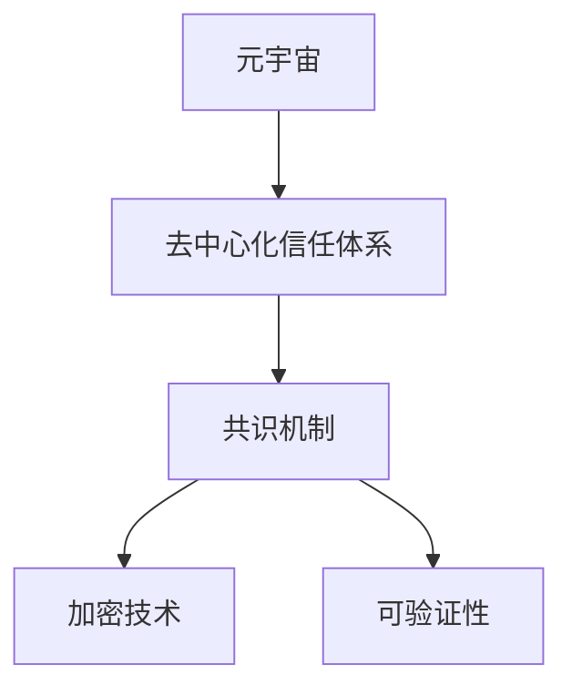

                 

# 元宇宙中的身份认证：去中心化信任体系的构建

在蓬勃发展的元宇宙（Metaverse）中，身份认证成为不可或缺的关键技术。不同于传统的基于中心化信任体系的身份认证方式，去中心化信任体系（Decentralized Trust System）成为构建元宇宙身份认证的新范式。本文将深入探讨去中心化信任体系的构建原理、核心算法、具体操作步骤、实际应用场景，并总结未来发展趋势与面临的挑战。

## 1. 背景介绍

### 1.1 问题由来

随着虚拟现实（VR）、增强现实（AR）技术的不断成熟，元宇宙正在成为连接虚拟与现实的新世界。元宇宙是一个高度自由、开放、持续进化的虚拟空间，支持用户创建、体验和交互各种虚拟环境和应用。

然而，随着元宇宙环境的虚拟化和复杂化，传统的基于中心化信任体系的身份认证方式难以适应。中心化方式依赖于单一的身份认证机构（如大型互联网公司），容易产生信息泄露、数据垄断等问题。

与此同时，元宇宙用户需要具备高度的隐私保护、自由表达和多样化身份等特点，传统的中心化身份认证方式无法满足这些需求。去中心化信任体系应运而生，为元宇宙身份认证提供了新的可能性。

### 1.2 问题核心关键点

去中心化信任体系的核心关键点在于：

- **去中心化**：去除单一的中心化信任机构，实现信任的分布式、点对点管理。
- **共识机制**：通过分布式算法确保网络中的每个节点（用户、设备）达成一致。
- **加密技术**：保障身份信息和数据传输的安全性。
- **可验证性**：保证身份信息在网络中的可验证性和不可篡改性。

## 2. 核心概念与联系

### 2.1 核心概念概述

- **元宇宙（Metaverse）**：由多个用户通过虚拟现实、增强现实技术共同构建和互动的虚拟空间。
- **去中心化信任体系（Decentralized Trust System）**：基于区块链和分布式算法，去除单一的中心化认证机构，实现信任的分布式管理。
- **共识机制（Consensus Mechanism）**：通过分布式算法确保网络中的每个节点达成一致。
- **加密技术（Cryptographic Techniques）**：保障身份信息和数据传输的安全性。
- **可验证性（Verifiability）**：保证身份信息在网络中的可验证性和不可篡改性。

这些概念之间的逻辑关系可以通过以下Mermaid流程图来展示：



这个流程图展示了大模型微调的各个核心概念及其之间的关系：

1. 元宇宙通过去中心化信任体系，去除单一的中心化认证机构，实现信任的分布式管理。
2. 去中心化信任体系依赖共识机制，通过分布式算法确保网络中的每个节点达成一致。
3. 共识机制依赖加密技术，保障身份信息和数据传输的安全性。
4. 共识机制确保身份信息的可验证性和不可篡改性。

这些概念共同构成了元宇宙身份认证的核心框架，使得元宇宙用户能够在虚拟环境中自由地创建和管理身份。

## 3. 核心算法原理 & 具体操作步骤

### 3.1 算法原理概述

去中心化信任体系的构建，主要依赖于区块链技术和分布式算法。以下将详细阐述其核心算法原理：

#### 3.1.1 区块链技术

区块链是一种分布式账本技术，具有去中心化、不可篡改、透明公开等特点。每个区块包含若干交易信息，通过加密哈希算法形成链条，保障数据的安全性和不可篡改性。

#### 3.1.2 共识机制

共识机制是区块链的核心技术，通过算法确保网络中的每个节点达成一致。常见的共识机制包括：

- **工作量证明（Proof of Work, PoW）**：通过计算哈希值解决数学难题，保证网络中大部分节点对区块链状态的共识。
- **权益证明（Proof of Stake, PoS）**：通过持币数量和持有时间来选择节点，保证网络中的权益共识。
- **委托权益证明（Delegated Proof of Stake, DPoS）**：在权益证明的基础上，引入节点权益委托，优化共识效率。

#### 3.1.3 加密技术

加密技术是区块链的基础，通过非对称加密算法保障身份信息和数据传输的安全性。常见的加密算法包括：

- **公钥加密算法（Public Key Cryptography）**：使用公钥和私钥对数据进行加密和解密。
- **哈希函数（Hash Functions）**：将任意长度的消息转换为固定长度的哈希值，保障数据的完整性。

### 3.2 算法步骤详解

以下是去中心化信任体系构建的具体操作步骤：

#### 3.2.1 用户身份注册

用户通过生成随机私钥和公钥对，并存储在钱包（Wallet）中。私钥用于签名和加密，公钥用于验证和解密。

1. 生成私钥和公钥对：
   $$
   (\text{私钥}, \text{公钥}) = \text{生成随机私钥和公钥}
   $$

2. 用户身份注册：
   $$
   (\text{公钥}, \text{身份信息}) \rightarrow \text{区块链} \quad // 公钥和身份信息上链
   $$

#### 3.2.2 身份验证

用户在虚拟环境中进行身份验证时，需要提交公钥和身份信息，并通过共识机制进行验证。

1. 用户提交公钥和身份信息：
   $$
   \text{公钥}, \text{身份信息} \rightarrow \text{验证方}
   $$

2. 验证方通过共识机制验证公钥和身份信息：
   $$
   \text{公钥} \rightarrow \text{区块链} \quad // 查询公钥是否在区块链上
   $$
   $$
   \text{身份信息} \rightarrow \text{验证规则} \quad // 验证身份信息是否符合规则
   $$

3. 验证结果返回用户：
   $$
   \text{验证结果} \rightarrow \text{用户}
   $$

#### 3.2.3 身份更新和恢复

用户可以通过更新公钥和身份信息，实现身份的动态管理。同时，可以通过私钥恢复公钥和身份信息，保障用户身份的安全性。

1. 用户身份更新：
   $$
   (\text{新公钥}, \text{新身份信息}) \rightarrow \text{区块链} \quad // 更新公钥和身份信息
   $$

2. 用户身份恢复：
   $$
   \text{私钥} \rightarrow (\text{公钥}, \text{身份信息})
   $$

### 3.3 算法优缺点

去中心化信任体系具有以下优点：

1. **去中心化**：去除单一的中心化认证机构，实现信任的分布式管理。
2. **安全性**：通过共识机制和加密技术保障身份信息和数据传输的安全性。
3. **可扩展性**：分布式算法支持大规模网络节点，实现可扩展性。
4. **透明度**：所有交易记录公开透明，提升系统的透明度。

然而，去中心化信任体系也存在以下缺点：

1. **复杂性**：系统实现较为复杂，需要设计分布式算法和共识机制。
2. **性能问题**：由于区块链网络中的节点众多，可能存在性能瓶颈。
3. **安全风险**：共识机制和加密技术的漏洞可能被攻击者利用。
4. **资源消耗**：共识机制和加密算法需要消耗大量计算资源。

### 3.4 算法应用领域

去中心化信任体系在多个领域都有广泛应用，例如：

- **数字身份认证**：基于区块链的数字身份认证，实现用户身份的去中心化管理和验证。
- **电子投票系统**：使用共识机制和加密技术，确保选举过程的透明和公平。
- **供应链管理**：通过区块链记录供应链中的所有交易，实现去中心化的信任管理。
- **智能合约**：在智能合约中使用去中心化信任体系，确保合同的执行和验证。

## 4. 数学模型和公式 & 详细讲解 & 举例说明

### 4.1 数学模型构建

#### 4.1.1 区块链账本结构

区块链账本由若干个区块组成，每个区块包含若干交易信息。交易信息包括发件人、收件人、金额等，通过哈希算法连接成链条。

### 4.2 公式推导过程

#### 4.2.1 交易计算

设交易信息为 $(tx)$，交易哈希值为 $(tx)$，交易区块为 $(b)$，区块哈希值为 $(b)$。

交易计算公式为：
$$
(tx) \rightarrow \text{哈希}(tx) \rightarrow \text{区块} \quad // 将交易信息计算哈希值，并加入区块
$$
$$
(b) \rightarrow \text{哈希}(b) \rightarrow \text{下一个区块} \quad // 将区块计算哈希值，并连接成链条
$$

#### 4.2.2 共识算法

以工作量证明（PoW）为例，共识算法通过计算哈希值解决数学难题，确保网络中的大部分节点对区块链状态的共识。

设某个区块 $(b)$ 的难度为 $d$，计算哈希值的随机数（称为“挖矿”）为 $(num)$，当前时间戳为 $(t)$。

挖矿过程如下：
$$
\text{随机数} = \text{挖矿} \quad // 通过计算随机数解决数学难题
$$
$$
\text{区块哈希值} = \text{哈希}(b, num, t) \quad // 计算区块哈希值
$$

当区块哈希值满足难度要求时，该区块被添加到区块链中。

### 4.3 案例分析与讲解

#### 4.3.1 数字身份认证

设用户的公钥为 $(pk)$，私钥为 $(zk)$，身份信息为 $(id)$。

数字身份认证流程如下：

1. 用户生成公钥和私钥对，并上链存储公钥和身份信息。
   $$
   (\text{公钥}, \text{身份信息}) \rightarrow \text{区块链} \quad // 公钥和身份信息上链
   $$

2. 用户在虚拟环境中进行身份验证时，提交公钥和身份信息。
   $$
   \text{公钥}, \text{身份信息} \rightarrow \text{验证方}
   $$

3. 验证方查询区块链上的公钥，并通过验证规则验证身份信息。
   $$
   \text{公钥} \rightarrow \text{区块链} \quad // 查询公钥是否在区块链上
   $$
   $$
   \text{身份信息} \rightarrow \text{验证规则} \quad // 验证身份信息是否符合规则
   $$

4. 验证结果返回用户。
   $$
   \text{验证结果} \rightarrow \text{用户}
   $$

## 5. 项目实践：代码实例和详细解释说明

### 5.1 开发环境搭建

在进行去中心化信任体系的开发实践前，需要准备好开发环境。以下是使用Python进行Blockchain开发的环境配置流程：

1. 安装Anaconda：从官网下载并安装Anaconda，用于创建独立的Python环境。

2. 创建并激活虚拟环境：
```bash
conda create -n blockchain-env python=3.8 
conda activate blockchain-env
```

3. 安装Blockchain开发库：
```bash
pip install pyblockchain
```

4. 安装各类工具包：
```bash
pip install numpy pandas scikit-learn matplotlib tqdm jupyter notebook ipython
```

完成上述步骤后，即可在`blockchain-env`环境中开始区块链开发的实践。

### 5.2 源代码详细实现

这里我们以数字身份认证为例，给出使用PyBlockchain库实现数字身份认证的PyTorch代码实现。

```python
from pyblockchain import Block, Blockchain, cryptography

# 创建区块链
blockchain = Blockchain()

# 生成公钥和私钥
private_key = cryptography.generate_private_key()
public_key = private_key.public_key()

# 用户身份信息
id = 'Alice'

# 注册身份信息到区块链
blockchain.add_block(public_key, id)

# 验证身份信息
def verify_identity(public_key, id, blockchain):
    # 查询区块链上的公钥
    query_public_key = blockchain.get_blockchain()[0][0]
    
    # 验证公钥是否一致
    if query_public_key != public_key:
        return False
    
    # 验证身份信息是否符合规则
    if blockchain.get_blockchain()[0][1] != id:
        return False
    
    return True

# 验证
if verify_identity(public_key, id, blockchain):
    print('身份验证成功')
else:
    print('身份验证失败')
```

以上就是使用PyBlockchain库进行数字身份认证的完整代码实现。可以看到，得益于PyBlockchain库的强大封装，我们可以用相对简洁的代码完成区块链的开发。

### 5.3 代码解读与分析

让我们再详细解读一下关键代码的实现细节：

**Blockchain类**：
- 定义区块链的基本结构，包括区块的创建、添加和查询等操作。

**cryptography库**：
- 提供生成公钥和私钥的函数，用于生成数字身份认证所需的关键对。

**verify_identity函数**：
- 通过查询区块链上的公钥和身份信息，验证用户提交的公钥和身份信息是否一致。

**代码实现**：
- 创建区块链对象，生成公钥和私钥对。
- 注册用户的身份信息到区块链。
- 验证用户的公钥和身份信息是否一致，给出验证结果。

可以看到，PyBlockchain库使得区块链开发的代码实现变得简洁高效。开发者可以将更多精力放在分布式算法和共识机制等高层逻辑上，而不必过多关注底层的实现细节。

## 6. 实际应用场景

### 6.1 智能合约

基于区块链的去中心化信任体系，可以构建智能合约，实现自动化的合约执行和验证。智能合约是一种基于区块链的自动化合约，通过代码实现合同条款，确保合同的执行和验证。

在实际应用中，智能合约被广泛应用于金融、供应链、医疗等多个领域。例如，在金融领域，可以使用智能合约进行自动化借贷、股权管理等操作。在供应链领域，可以使用智能合约记录货物交易信息，实现去中心化的信任管理。

### 6.2 电子投票系统

电子投票系统利用区块链和共识机制，确保选举过程的透明和公平。选举过程通过智能合约和区块链技术进行记录和验证，每个选民使用私钥进行投票，投票结果通过共识机制验证，确保选举过程的公正性。

例如，在地方政府的选举过程中，可以通过电子投票系统记录每个选民的投票信息，并使用共识机制验证投票结果，确保选举过程的公正性和透明性。

### 6.3 供应链管理

区块链技术在供应链管理中的应用，可以实现去中心化的信任管理。供应链中的每个环节（如供应商、制造商、分销商等）都可以通过区块链记录交易信息，实现供应链的透明化和可追溯性。

例如，在食品供应链中，可以通过区块链记录食品的生产、运输、存储等环节，确保食品的质量和安全。一旦发生食品安全问题，可以通过区块链查询相关信息，快速定位问题源头，保障消费者的权益。

### 6.4 未来应用展望

随着区块链技术和去中心化信任体系的不断演进，未来将会在更多领域得到应用，为传统行业带来变革性影响。

在智慧医疗领域，基于区块链的数字身份认证和智能合约，可以实现病历信息的共享和安全管理，辅助医生诊疗，加速新药开发进程。

在智能教育领域，区块链技术可以用于学生成绩和学历的验证，确保教育公平和公正，提高教育质量。

在智慧城市治理中，区块链技术可以用于城市事件监测、舆情分析、应急指挥等环节，提高城市管理的自动化和智能化水平，构建更安全、高效的未来城市。

此外，在企业生产、社会治理、文娱传媒等众多领域，区块链技术也将不断涌现，为传统行业数字化转型升级提供新的技术路径。相信随着技术的日益成熟，区块链技术将成为构建安全、可靠、可解释、可控的智能系统的重要支撑。

## 7. 工具和资源推荐

### 7.1 学习资源推荐

为了帮助开发者系统掌握区块链技术的基础和实践，这里推荐一些优质的学习资源：

1. 《区块链原理与技术》书籍：全面介绍了区块链的基本原理、核心算法和实际应用。
2. CS448《分布式系统》课程：斯坦福大学开设的分布式系统课程，涵盖区块链、共识机制等核心内容。
3. Ethereum官方文档：以太坊区块链的官方文档，提供详细的区块链开发指南和API接口。
4. Hyperledger Fabric官方文档：Hyperledger Fabric区块链的官方文档，提供详细的分布式账本和智能合约开发指南。
5. 区块链开发者社区：如Bitcoin Stack Exchange、Blockchain Stack Exchange等，提供丰富的区块链开发资源和问题解答。

通过对这些资源的学习实践，相信你一定能够快速掌握区块链技术的精髓，并用于解决实际的区块链开发问题。

### 7.2 开发工具推荐

高效的开发离不开优秀的工具支持。以下是几款用于区块链开发的工具：

1. Ethereum开发套件：由以太坊基金会提供的开发环境，支持智能合约和区块链的开发和测试。
2. Hyperledger Fabric开发套件：Hyperledger Fabric区块链的开发环境，支持分布式账本和智能合约的开发和测试。
3. PyBlockchain库：基于Python的区块链开发库，提供简单易用的API接口，适合区块链开发初学者。
4. Web3.js：基于JavaScript的区块链开发库，支持以太坊等区块链平台的开发和测试。

合理利用这些工具，可以显著提升区块链开发的效率，加快创新迭代的步伐。

### 7.3 相关论文推荐

区块链技术的发展源于学界的持续研究。以下是几篇奠基性的相关论文，推荐阅读：

1. Bitcoin: A Peer-to-Peer Electronic Cash System（比特币白皮书）：比特币区块链的开创性论文，介绍了区块链的基本原理和核心算法。
2. Ethereum Yellow Paper：以太坊区块链的白皮书，介绍了以太坊智能合约和共识机制的设计思路。
3. Secure Scalable Smart Contracts（安全可扩展的智能合约）：智能合约领域的经典论文，介绍了智能合约的实现方法和安全策略。
4. Hyperledger Fabric Consensus Protocol Specification：Hyperledger Fabric区块链的共识协议规范，介绍了分布式账本和共识机制的设计思路。
5. ZK-SNARKs: towards scalable transparent protocols：零知识证明领域的奠基性论文，介绍了零知识证明的基本原理和实际应用。

这些论文代表了大模型微调技术的发展脉络。通过学习这些前沿成果，可以帮助研究者把握学科前进方向，激发更多的创新灵感。

## 8. 总结：未来发展趋势与挑战

### 8.1 总结

本文对去中心化信任体系的构建原理、核心算法、具体操作步骤、实际应用场景进行了全面系统的介绍。首先阐述了去中心化信任体系的背景和重要性，明确了区块链和分布式算法在元宇宙身份认证中的核心价值。其次，从原理到实践，详细讲解了去中心化信任体系的核心算法和操作步骤，给出了区块链开发的完整代码实例。同时，本文还广泛探讨了区块链技术在多个领域的应用前景，展示了去中心化信任体系的广泛潜力。

通过本文的系统梳理，可以看到，基于区块链技术去中心化信任体系的构建，为元宇宙身份认证提供了新的可能性。区块链技术通过分布式算法和共识机制，实现了信任的分布式管理，保障了身份信息和数据传输的安全性。未来，伴随区块链技术的持续演进，去中心化信任体系必将在更多领域得到应用，为传统行业带来变革性影响。

### 8.2 未来发展趋势

展望未来，去中心化信任体系将呈现以下几个发展趋势：

1. **可扩展性**：区块链技术在处理大规模交易数据方面具有局限性，未来将开发更高效的可扩展性解决方案，如Layer 2扩展、侧链技术等。
2. **安全性**：随着区块链技术的广泛应用，其安全性也面临越来越多的挑战，如51%攻击、智能合约漏洞等。未来将进一步加强区块链的安全性研究，开发更高效的安全保障机制。
3. **互操作性**：不同区块链平台之间的互操作性问题，阻碍了区块链技术的应用普及。未来将开发跨链技术，实现不同区块链平台之间的信息共享和互操作。
4. **隐私保护**：区块链技术在数据透明性的同时也带来了隐私泄露的风险。未来将开发隐私保护技术，如零知识证明、同态加密等，保护用户数据隐私。
5. **智能合约**：智能合约作为区块链的重要组成部分，未来将不断发展，实现更复杂、更安全的自动化合约执行。
6. **去中心化应用**：基于区块链的去中心化应用（DApps）将成为未来的重要应用形式，涵盖金融、供应链、医疗等多个领域。

以上趋势凸显了区块链技术的广阔前景。这些方向的探索发展，必将进一步提升区块链系统的性能和应用范围，为构建安全、可靠、可解释、可控的智能系统铺平道路。面向未来，区块链技术还需要与其他人工智能技术进行更深入的融合，如智能合约、去中心化存储等，多路径协同发力，共同推动人工智能技术的发展。

### 8.3 面临的挑战

尽管区块链技术已经取得了瞩目成就，但在迈向更加智能化、普适化应用的过程中，它仍面临着诸多挑战：

1. **性能瓶颈**：区块链网络中的节点众多，可能存在性能瓶颈。如何优化共识算法和共识机制，提升网络效率，是未来的重要研究方向。
2. **安全性问题**：区块链技术面临的安全威胁仍然存在，如51%攻击、智能合约漏洞等。如何提升区块链的安全性，防止攻击和欺诈，是未来的重要课题。
3. **隐私保护**：区块链技术在数据透明性的同时也带来了隐私泄露的风险。如何保护用户数据隐私，同时保障区块链的透明性和可追溯性，是未来的重要研究方向。
4. **资源消耗**：共识机制和加密算法需要消耗大量计算资源，如何优化算法，减少资源消耗，是未来的重要研究方向。
5. **互操作性问题**：不同区块链平台之间的互操作性问题，阻碍了区块链技术的应用普及。如何开发跨链技术，实现不同区块链平台之间的信息共享和互操作，是未来的重要课题。

### 8.4 研究展望

面对区块链技术面临的种种挑战，未来的研究需要在以下几个方面寻求新的突破：

1. **可扩展性优化**：开发更高效的可扩展性解决方案，如Layer 2扩展、侧链技术等，提升区块链的吞吐量和处理速度。
2. **安全性提升**：加强区块链的安全性研究，开发更高效的安全保障机制，如分片技术、共识机制优化等，防止攻击和欺诈。
3. **隐私保护技术**：开发隐私保护技术，如零知识证明、同态加密等，保护用户数据隐私，同时保障区块链的透明性和可追溯性。
4. **跨链技术开发**：开发跨链技术，实现不同区块链平台之间的信息共享和互操作，促进区块链技术的广泛应用。
5. **智能合约设计**：开发更复杂、更安全的智能合约，保障合约的执行和验证，提高区块链的应用效率。

这些研究方向的探索，必将引领区块链技术迈向更高的台阶，为构建安全、可靠、可解释、可控的智能系统提供新的可能性。相信随着学界和产业界的共同努力，这些挑战终将一一被克服，区块链技术必将在构建安全、可靠、可解释、可控的智能系统中扮演越来越重要的角色。

## 9. 附录：常见问题与解答

**Q1：如何避免区块链网络中的51%攻击？**

A: 51%攻击是指攻击者控制超过50%的网络节点，从而篡改区块链的记录。为避免51%攻击，可以采用以下措施：

1. 增加共识机制的难度：通过增加挖矿难度，降低攻击者控制网络节点的可能性。
2. 实施多币种交易：通过多币种交易，降低攻击者控制所有节点的可能性。
3. 引入去中心化节点：通过引入更多的独立节点，增加攻击者的成本。
4. 实施隐私保护措施：通过隐私保护技术，如零知识证明、同态加密等，防止攻击者获取敏感信息。

**Q2：区块链中的智能合约如何确保安全？**

A: 智能合约的安全性需要考虑以下几个方面：

1. 代码审计：在编写智能合约前，进行代码审计和测试，确保代码的健壮性和安全性。
2. 权限控制：在智能合约中，设置合理的权限控制，防止攻击者篡改合约参数。
3. 数据验证：在智能合约中，进行数据验证，确保输入数据的合法性和正确性。
4. 日志记录：在智能合约中，记录关键操作，便于后续审计和问题排查。
5. 多签名机制：在智能合约中，引入多签名机制，增加合约执行的安全性。

**Q3：区块链中的隐私保护有哪些方法？**

A: 区块链中的隐私保护方法包括：

1. 零知识证明：通过零知识证明，验证用户身份，保护用户数据隐私。
2. 同态加密：通过同态加密，在加密数据上进行计算，保护用户数据隐私。
3. 差分隐私：通过差分隐私，在数据收集和处理过程中，保护用户隐私。
4. 链上链下分离：将敏感数据存储在链下，链上只存储摘要信息，保护用户数据隐私。
5. 匿名化处理：通过匿名化处理，在数据处理过程中，保护用户隐私。

**Q4：区块链中的共识机制有哪些类型？**

A: 区块链中的共识机制包括以下几种类型：

1. 工作量证明（PoW）：通过计算哈希值解决数学难题，保证网络中的大部分节点对区块链状态的共识。
2. 权益证明（PoS）：通过持币数量和持有时间来选择节点，保证网络中的权益共识。
3. 委托权益证明（DPoS）：在权益证明的基础上，引入节点权益委托，优化共识效率。
4. 权益证明+共识（PoW+PoS）：结合工作量证明和权益证明，保证网络中的权益和共识。
5. 基于拜占庭容错（Byzantine Fault Tolerance）的共识机制：通过拜占庭容错算法，保证网络中的少数恶意节点不会影响共识。

这些共识机制各有优缺点，应根据具体应用场景选择适合的共识机制。

**Q5：区块链中的代币（Token）有何作用？**

A: 区块链中的代币（Token）主要有以下几个作用：

1. 交易媒介：代币可以作为交易媒介，进行价值交换。
2. 投票机制：代币可以用于投票机制，确保网络中的权益共识。
3. 激励机制：代币可以用于激励机制，鼓励节点参与网络维护。
4. 智能合约：代币可以用于智能合约，执行特定的合约操作。
5. 隐私保护：代币可以用于隐私保护，保护用户数据隐私。

这些代币的作用，使得区块链技术在各个领域都有广泛的应用。

---

作者：禅与计算机程序设计艺术 / Zen and the Art of Computer Programming

