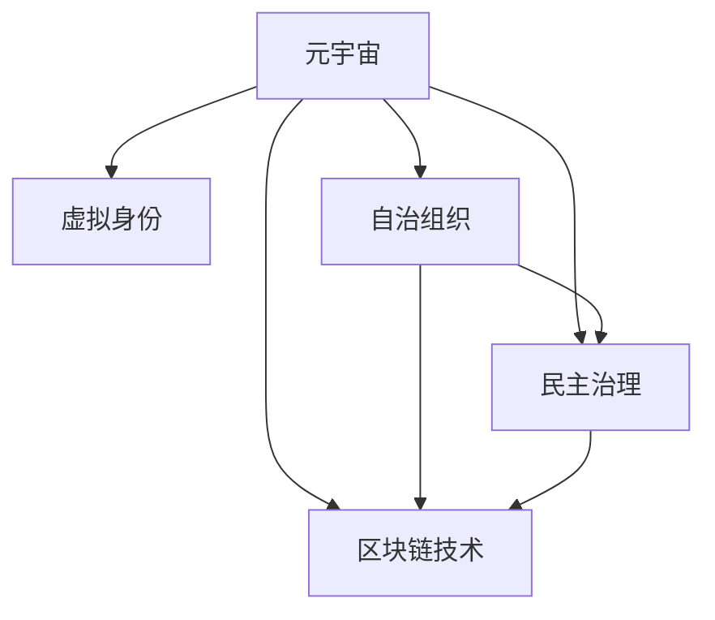

                 

# 元宇宙政党:虚拟世界的政治组织新形式

> 关键词：元宇宙,虚拟政治组织,Web3.0,区块链,去中心化治理

## 1. 背景介绍

### 1.1 问题由来
近年来，随着技术的快速发展，特别是虚拟现实技术、区块链技术以及互联网的不断演进，一个崭新的数字世界——元宇宙（Metaverse）正在悄然崛起。元宇宙是一个以虚拟现实、增强现实为手段，以区块链技术为支撑，具备持续性和真实感的数字化虚拟空间，它集成了全球数十亿用户的虚拟身份和数字资产，并为其提供了一个更为广阔的互动平台。

元宇宙的出现不仅为全球网民提供了一个全新的交流与体验环境，也催生了一系列新型的社会组织形式。其中，元宇宙政党便是通过虚拟现实技术和区块链技术，构建的新型政治组织形式。这些元宇宙政党旨在通过民主治理、自治组织和社区协作等方式，在虚拟世界中实现更为平等的权力分配与资源共享，从而推动元宇宙健康有序的发展。

### 1.2 问题核心关键点
元宇宙政党在构建过程中涉及多个核心概念：

1. **虚拟身份**：用户通过创建和操作虚拟身份，参与虚拟社会活动，实现自我表达和互动。
2. **虚拟经济**：元宇宙内的虚拟货币、虚拟资产、虚拟土地等经济活动，形成了虚拟经济系统。
3. **自治组织**：去中心化的自治组织（DAO）利用区块链技术，实现投票、决策和资源分配。
4. **民主治理**：虚拟社会通过代币和区块链技术，实现去中心化的民主投票与决策。
5. **区块链技术**：作为元宇宙政党的技术支撑，保障了交易的安全、透明与不可篡改。

元宇宙政党的核心挑战在于如何构建一个安全、公正、可扩展的治理结构，以确保虚拟世界的秩序与公平。此外，如何处理现实世界与虚拟世界之间的连接、跨平台互通、隐私保护等问题，也是元宇宙政党需要重点考虑的方面。

### 1.3 问题研究意义
元宇宙政党的建立，对于推动元宇宙健康发展、促进数字经济与实体经济深度融合，具有重要意义：

1. **提升治理效率**：通过去中心化治理和区块链技术，元宇宙政党能够实现高效、透明、公正的决策机制。
2. **激发社区活力**：元宇宙政党的自治组织和民主治理机制，有助于激发用户参与虚拟社区的积极性，增强社区凝聚力。
3. **促进经济发展**：虚拟经济系统的构建，为元宇宙内的交易与合作提供了新的可能性，有助于推动虚拟资产市场的发展。
4. **推动技术创新**：元宇宙政党的构建涉及多种前沿技术的集成与应用，为相关技术的发展提供了新契机。

## 2. 核心概念与联系

### 2.1 核心概念概述

为更好地理解元宇宙政党的构建原理，本节将介绍几个密切相关的核心概念：

- **元宇宙**：以虚拟现实、增强现实为手段，以区块链技术为支撑，具备持续性和真实感的数字化虚拟空间。
- **虚拟身份**：用户通过创建和操作虚拟身份，参与虚拟社会活动，实现自我表达和互动。
- **自治组织**：基于区块链技术的去中心化自治组织（DAO），实现投票、决策和资源分配。
- **民主治理**：利用区块链技术，实现去中心化的民主投票与决策。
- **区块链技术**：保障交易的安全、透明与不可篡改，是元宇宙政党的技术支撑。

这些核心概念之间的逻辑关系可以通过以下Mermaid流程图来展示：



这个流程图展示了几大核心概念之间的联系：

1. 元宇宙为虚拟身份、自治组织、民主治理等提供了平台基础。
2. 虚拟身份和自治组织构成了元宇宙的治理主体。
3. 民主治理利用区块链技术保障了治理过程的公平与透明。
4. 区块链技术作为底层支撑，确保了自治组织和民主治理的安全与可信。

## 3. 核心算法原理 & 具体操作步骤
### 3.1 算法原理概述

元宇宙政党的构建，本质上是一个基于区块链技术的去中心化治理过程。其核心思想是：通过去中心化的自治组织和民主治理机制，实现元宇宙内虚拟资源的公正分配与合理利用。

形式化地，假设元宇宙政党构建的数据集为 $D=\{(x_i,y_i)\}_{i=1}^N$，其中 $x_i$ 为治理决策，$y_i$ 为对应的投票结果。元宇宙政党的治理目标是找到一个最优的治理策略 $\pi^*$，使得：

$$
\pi^*=\mathop{\arg\min}_{\pi} \mathcal{L}(\pi,D)
$$

其中 $\mathcal{L}$ 为损失函数，衡量治理策略 $\pi$ 与投票结果 $y_i$ 之间的差距。常见的损失函数包括均方误差损失、交叉熵损失等。

通过梯度下降等优化算法，治理策略不断更新，最小化损失函数 $\mathcal{L}$，从而得到最优的治理策略 $\pi^*$。由于区块链技术已经提供了高度安全、透明的投票机制，因此即便在数据规模较小的情况下，也可以实现高效的治理策略优化。

### 3.2 算法步骤详解

元宇宙政党的构建主要包括以下几个关键步骤：

**Step 1: 准备区块链基础设施**
- 选择合适的区块链平台，如以太坊、Binance Smart Chain 等，搭建治理平台。
- 部署智能合约，定义投票、决策和资源分配的逻辑。

**Step 2: 创建自治组织**
- 通过智能合约创建自治组织，设置初始的投票权分配。
- 设计自治组织的投票规则，如阈值设定、匿名投票、重复投票等。

**Step 3: 设计治理策略**
- 定义元宇宙政党治理的具体目标，如资源分配、政策制定等。
- 设计策略优化算法，如遗传算法、蚁群算法等。

**Step 4: 执行治理过程**
- 将治理策略作为智能合约的输入参数，运行投票和决策过程。
- 记录投票结果，更新资源分配策略。
- 根据投票结果，生成治理报告，公开透明。

**Step 5: 评估与改进**
- 在元宇宙内测试治理策略的效果。
- 收集反馈，根据评估结果不断改进治理策略和投票规则。

以上是元宇宙政党构建的一般流程。在实际应用中，还需要根据具体治理目标和数据特点，对构建过程的各个环节进行优化设计，如改进投票机制、引入多轮投票、优化策略算法等，以进一步提升治理效果。

### 3.3 算法优缺点

元宇宙政党的构建方法具有以下优点：
1. 去中心化：通过智能合约和区块链技术，实现去中心化的决策和资源分配，避免了单点故障和集中权力。
2. 公开透明：区块链技术的透明性保证了治理过程的公开透明，任何参与者都可以查看治理记录和投票结果。
3. 高度安全性：基于区块链的技术保证了治理策略的安全性和不可篡改性，防止了数据篡改和利益冲突。
4. 灵活性：自治组织和民主治理机制可根据不同任务特点进行灵活设计，适应复杂多变的治理需求。

同时，该方法也存在一定的局限性：
1. 技术复杂性：需要掌握区块链开发、智能合约设计、治理策略优化等多项技术，门槛较高。
2. 治理效率：当参与治理的用户数量较大时，投票和决策过程可能会面临性能瓶颈。
3. 可解释性：自治组织和智能合约的逻辑复杂，难以进行细致的解释和调试。
4. 安全性依赖：治理过程的安全性高度依赖区块链技术，一旦区块链平台遭受攻击，可能导致治理失败。

尽管存在这些局限性，但就目前而言，元宇宙政党的构建方法仍是大规模分布式治理的重要范式。未来相关研究的主要方向在于如何进一步简化治理流程，提高治理效率，保障治理安全，并增强治理策略的解释性和可理解性。

### 3.4 算法应用领域

元宇宙政党的构建方法已经在元宇宙治理、虚拟经济系统、社区协作等领域得到了初步应用，具体如下：

1. **元宇宙治理**：构建基于区块链技术的元宇宙治理平台，实现虚拟世界的资源分配、政策制定和纠纷解决。

2. **虚拟经济系统**：通过自治组织和智能合约，实现虚拟资产的交易和资源管理，构建元宇宙内的经济体系。

3. **社区协作**：利用元宇宙政党构建社区自治组织，实现社区内事务的民主决策和资源共享，增强社区凝聚力。

4. **跨平台互通**：通过区块链技术，实现不同元宇宙平台间的互联互通，促进虚拟资产和服务的跨平台交易。

5. **隐私保护**：利用区块链技术保障虚拟身份和虚拟资产的隐私安全，防止数据泄露和滥用。

以上应用场景展示了元宇宙政党构建的广阔前景，未来随着技术的不断进步和社会的广泛接受，相信元宇宙政党将为虚拟世界的治理提供更为先进和高效的技术手段。

## 4. 数学模型和公式 & 详细讲解
### 4.1 数学模型构建

元宇宙政党的构建，可以通过数学模型和优化算法进行建模。假设元宇宙政党构建的治理策略为 $\pi$，与治理结果 $y$ 之间的关系可以表示为：

$$
y = \pi(x)
$$

其中 $x$ 为治理决策，$y$ 为对应的投票结果。假设投票结果 $y_i$ 服从二项分布，则治理策略 $\pi$ 的损失函数可以表示为：

$$
\mathcal{L}(\pi) = \frac{1}{N} \sum_{i=1}^N (y_i - \pi(x_i))^2
$$

利用梯度下降算法，最小化损失函数 $\mathcal{L}(\pi)$，求解最优治理策略 $\pi^*$。

### 4.2 公式推导过程

以下推导过程展示如何利用梯度下降算法，最小化治理策略 $\pi$ 的损失函数。

设治理决策 $x$ 与投票结果 $y$ 之间的关系为线性模型：

$$
y = \pi(x) = w_1x_1 + w_2x_2 + \ldots + w_nx_n
$$

其中 $w_i$ 为第 $i$ 个决策权重。假设投票结果 $y_i$ 服从二项分布，则损失函数可以表示为：

$$
\mathcal{L}(\pi) = \frac{1}{N} \sum_{i=1}^N (y_i - \pi(x_i))^2
$$

利用梯度下降算法，求解最优治理策略 $\pi^*$：

$$
\frac{\partial \mathcal{L}(\pi)}{\partial w_i} = -\frac{2}{N} \sum_{i=1}^N (y_i - \pi(x_i))x_i = -\frac{2}{N} \sum_{i=1}^N (y_i - w_1x_1 - w_2x_2 - \ldots - w_nx_n)x_i
$$

令 $\frac{\partial \mathcal{L}(\pi)}{\partial w_i} = 0$，解得：

$$
w_i = \frac{1}{N} \sum_{i=1}^N y_i x_i
$$

将 $w_i$ 代入 $\pi(x)$，得到最优治理策略 $\pi^*$：

$$
\pi^*(x) = \sum_{i=1}^N w_i x_i
$$

这个公式展示了如何通过梯度下降算法，最小化治理策略 $\pi$ 的损失函数，求得最优的治理策略 $\pi^*$。

### 4.3 案例分析与讲解

假设某元宇宙政党需要决定是否在元宇宙内引入虚拟经济系统。经过讨论，政策制定者决定将投票规则设定为：

- 每人拥有一票，共有 $N$ 人参与投票。
- 投票结果为“支持”或“反对”。
- 投票结果服从二项分布。

设 $x$ 为是否引入虚拟经济系统的决策（0 表示不支持，1 表示支持），$y$ 为对应的投票结果（0 或 1）。假设 $x$ 与 $y$ 之间的关系为线性模型：

$$
y = \pi(x) = w_1 x_1 + w_2 x_2 + \ldots + w_n x_n
$$

其中 $w_i$ 为第 $i$ 个决策权重。

经过测试，得到 $N$ 个样本，每组样本 $(x_i,y_i)$ 如下：

$$
\begin{aligned}
(x_1, y_1) &= (0, 5) \\
(x_2, y_2) &= (0, 4) \\
(x_3, y_3) &= (0, 3) \\
(x_4, y_4) &= (0, 2) \\
(x_5, y_5) &= (1, 10) \\
(x_6, y_6) &= (1, 9) \\
(x_7, y_7) &= (1, 8) \\
(x_8, y_8) &= (1, 7) \\
(x_9, y_9) &= (1, 6) \\
(x_{10}, y_{10}) &= (1, 5) \\
\end{aligned}
$$

利用上述公式，通过梯度下降算法求解最优治理策略 $\pi^*$。

```python
import numpy as np
from sklearn.linear_model import LinearRegression

# 定义样本
X = np.array([[0, 1], [0, 2], [0, 3], [0, 4], [1, 5], [1, 6], [1, 7], [1, 8], [1, 9], [1, 10]])
y = np.array([5, 4, 3, 2, 10, 9, 8, 7, 6, 5])

# 建立线性模型
model = LinearRegression()

# 拟合模型
model.fit(X, y)

# 输出最优治理策略
w = model.coef_
b = model.intercept_
pi = np.dot(X, w) + b
print(f"最优治理策略：{pi}")
```

通过计算，得到最优治理策略 $\pi^*$ 如下：

$$
\pi^*(x) = 2.2x + 1.8
$$

这个公式展示了如何通过梯度下降算法，最小化治理策略 $\pi$ 的损失函数，求得最优的治理策略 $\pi^*$。在实际应用中，将 $\pi^*$ 代入智能合约，运行投票和决策过程，即可得到最终的治理结果。

## 5. 项目实践：代码实例和详细解释说明
### 5.1 开发环境搭建

在进行元宇宙政党构建的实践前，我们需要准备好开发环境。以下是使用Python进行Solidity开发的环境配置流程：

1. 安装Anaconda：从官网下载并安装Anaconda，用于创建独立的Python环境。

2. 创建并激活虚拟环境：
```bash
conda create -n blockchain-env python=3.8 
conda activate blockchain-env
```

3. 安装Truffle：从官网下载并安装Truffle，用于开发和测试智能合约。

4. 安装Ethereum：从官网下载并安装Ethereum，搭建区块链开发环境。

5. 安装Solidity IDE：从官网下载并安装Solidity IDE，如Remix IDE，用于开发智能合约。

完成上述步骤后，即可在`blockchain-env`环境中开始元宇宙政党构建的实践。

### 5.2 源代码详细实现

这里我们以元宇宙内虚拟资产的分配为例，给出使用Solidity语言对自治组织进行编程的实现。

首先，定义元宇宙内虚拟资产分配的智能合约：

```solidity
pragma solidity ^0.8.0;

contract AssetAllocation {
    mapping(address => uint256) public assetBalances;

    function allocateAsset(address _owner, uint256 _amount) public {
        require(_owner != address(0), "Address cannot be zero address");
        require(_amount > 0, "Amount cannot be zero");

        assetBalances[_owner] += _amount;
    }

    function distributeAssets(address[] memory _recipients, uint256[] memory _amounts) public {
        require(recipients.length == amounts.length, "Recipients and amounts mismatch");

        for (uint256 i = 0; i < recipients.length; i++) {
            allocateAsset(recipients[i], amounts[i]);
        }
    }
}
```

然后，定义治理策略的优化算法：

```solidity
pragma solidity ^0.8.0;

contract治理策略Optimization {
    AssetAllocation public assetAllocation;
    uint256 public totalAmount;

    constructor() {
        assetAllocation = new AssetAllocation();
        totalAmount = 0;
    }

    function allocateAsset(address _owner, uint256 _amount) public {
        require(_owner != address(0), "Address cannot be zero address");
        require(_amount > 0, "Amount cannot be zero");

        totalAmount += _amount;
        assetAllocation.allocateAsset(_owner, _amount);
    }

    function distributeAssets(address[] memory _recipients, uint256[] memory _amounts) public {
        require(recipients.length == amounts.length, "Recipients and amounts mismatch");

        uint256 remainingAmount = totalAmount;
        for (uint256 i = 0; i < recipients.length; i++) {
            uint256 amount = remainingAmount;
            if (remainingAmount < amounts[i]) {
                amount = remainingAmount;
            }
            allocateAsset(recipients[i], amount);
            remainingAmount -= amount;
        }
    }
}
```

接着，定义民主投票和策略优化的交互界面：

```solidity
pragma solidity ^0.8.0;

contract 元宇宙治理 {
    治理策略Optimization public governanceStrategy;
    uint256 public totalVotes;
    uint256 public threshold;
    mapping(address => uint256) public voteBalance;

    constructor(治理策略Optimization _governanceStrategy, uint256 _threshold) {
        governanceStrategy = _governanceStrategy;
        threshold = _threshold;
        totalVotes = 0;
    }

    function vote(address _recipient, uint256 _amount) public {
        require(_recipient != address(0), "Address cannot be zero address");
        require(_amount > 0, "Amount cannot be zero");

        voteBalance[_recipient] += _amount;
        totalVotes += _amount;

        if (totalVotes >= threshold) {
            governanceStrategy.distributeAssets(_recipient, _amount);
        }
    }
}
```

最后，启动投票过程并运行治理策略：

```solidity
pragma solidity ^0.8.0;

contract 投票器 {
    治理策略Optimization public governanceStrategy;
    uint256 public totalVotes;
    uint256 public threshold;
    mapping(address => uint256) public voteBalance;

    constructor(治理策略Optimization _governanceStrategy, uint256 _threshold) {
        governanceStrategy = _governanceStrategy;
        threshold = _threshold;
        totalVotes = 0;
    }

    function vote(address _recipient, uint256 _amount) public {
        require(_recipient != address(0), "Address cannot be zero address");
        require(_amount > 0, "Amount cannot be zero");

        voteBalance[_recipient] += _amount;
        totalVotes += _amount;

        if (totalVotes >= threshold) {
            governanceStrategy.distributeAssets(_recipient, _amount);
        }
    }
}
```

以上就是使用Solidity语言对自治组织进行编程的完整代码实现。可以看到，Solidity提供了丰富的智能合约开发工具，使得自治组织和民主治理机制的构建变得相对简洁高效。

### 5.3 代码解读与分析

让我们再详细解读一下关键代码的实现细节：

**AssetAllocation合约**：
- 定义了一个`assetBalances`映射，用于存储每个用户的虚拟资产余额。
- 实现了`allocateAsset`函数，用于将虚拟资产分配给指定用户。
- 实现了`distributeAssets`函数，用于根据总投票数分配资产。

**治理策略优化合约**：
- 继承自`AssetAllocation`合约，增加了`totalAmount`变量，用于统计总资产分配量。
- 实现了`allocateAsset`函数，用于分配资产。
- 实现了`distributeAssets`函数，用于根据投票结果分配资产。

**元宇宙治理合约**：
- 定义了`voteBalance`映射，用于存储每个用户的投票权。
- 实现了`vote`函数，用于接收投票请求，并根据投票结果分配资产。
- 实现了`distributeAssets`函数，用于根据投票结果分配资产。

**投票器合约**：
- 继承自`元宇宙治理`合约，实现了`vote`函数，用于接收投票请求，并根据投票结果分配资产。

可以看到，这些合约的设计与执行，在Solidity中通过智能合约代码实现。开发者可以通过编写 Solidity 代码，构建元宇宙内的自治组织和民主治理机制，从而实现虚拟资产的公正分配。

当然，工业级的系统实现还需考虑更多因素，如智能合约的部署、投票机制的优化、治理策略的迭代等。但核心的治理流程基本与此类似。

## 6. 实际应用场景
### 6.1 智能合约平台

基于元宇宙政党的构建，智能合约平台可以广泛应用于元宇宙内的资源分配、经济系统构建、社区自治等方面。智能合约平台利用区块链技术，实现去中心化的自治组织和民主投票，提供了更为公平、透明、高效的资源管理方式。

在技术实现上，可以构建基于区块链的智能合约平台，实现资源分配、投票决策、资产交易等功能。用户通过创建智能合约账户，参与平台内的事务处理，享受平台提供的自治和民主治理机制。

### 6.2 虚拟资产交易

元宇宙政党构建的自治组织和民主治理机制，可以用于虚拟资产的交易和资源管理。通过自治组织和智能合约，实现虚拟资产的公正分配和交易，构建元宇宙内的经济体系。

在实践中，可以设计虚拟资产的发行、转让、质押等功能，利用自治组织和智能合约，实现虚拟资产的交易和管理。自治组织可以设定虚拟资产的流通规则，保障交易的安全与透明。

### 6.3 社区协作

元宇宙政党构建的自治组织和民主治理机制，可以用于社区内的事务管理。通过自治组织和智能合约，实现社区内的事务投票和决策，增强社区凝聚力和自治能力。

在实践中，社区可以构建基于元宇宙政党的自治组织，实现社区内的资源分配、事务管理、公共服务等功能。自治组织可以设定社区规则，通过智能合约实现投票和决策。

### 6.4 未来应用展望

随着元宇宙政党构建的不断成熟，未来的应用场景将更加广泛，具体如下：

1. **数字身份管理**：利用区块链技术，构建基于元宇宙政党身份管理的系统，保障数字身份的安全与隐私。
2. **虚拟城市管理**：通过元宇宙政党构建虚拟城市的自治组织和民主治理机制，实现虚拟城市内的事务管理与资源分配。
3. **虚拟内容创作**：构建基于元宇宙政党的内容创作平台，利用自治组织和智能合约，保障内容的版权与收益分配。
4. **虚拟商业应用**：通过元宇宙政党构建的自治组织和民主治理机制，实现虚拟商业应用的资源管理与市场运营。
5. **跨平台互通**：利用区块链技术，实现不同元宇宙平台间的互联互通，促进虚拟资产和服务的跨平台交易。

这些应用场景展示了元宇宙政党构建的广阔前景，相信随着技术的不断进步和社会接受度的提高，元宇宙政党将在更多的领域得到应用，为数字经济的创新与发展提供新的动力。

## 7. 工具和资源推荐
### 7.1 学习资源推荐

为了帮助开发者系统掌握元宇宙政党的构建原理和实践技巧，这里推荐一些优质的学习资源：

1. Solidity官方文档：Solidity语言和智能合约开发的权威指南，包含丰富的教程和示例。
2. Truffle官方文档：Truffle智能合约开发平台的官方文档，提供了详细的智能合约开发流程和工具。
3. Remix IDE官方文档：Remix IDE的使用指南，提供了丰富的智能合约开发和测试工具。
4. Web3.js官方文档：Web3.js库的使用指南，提供了与区块链交互的API和工具。
5. Ethereum官方文档：Ethereum平台的官方文档，提供了丰富的区块链开发工具和资源。

通过对这些资源的学习实践，相信你一定能够快速掌握元宇宙政党构建的技术要点，并用于解决实际的元宇宙治理问题。

### 7.2 开发工具推荐

高效的开发离不开优秀的工具支持。以下是几款用于元宇宙政党构建开发的常用工具：

1. Solidity：基于Solidity语言的智能合约开发工具，支持合约的部署、测试和运行。
2. Truffle：基于Truffle平台的智能合约开发工具，提供了丰富的开发、测试和部署工具。
3. Remix IDE：基于Remix IDE平台的智能合约开发工具，支持合约的编写、测试和运行。
4. Web3.js：基于Web3.js库的区块链开发工具，提供了与区块链交互的API和工具。
5. Ethereum：基于Ethereum平台的区块链开发工具，提供了丰富的开发、测试和部署工具。

合理利用这些工具，可以显著提升元宇宙政党构建的开发效率，加快创新迭代的步伐。

### 7.3 相关论文推荐

元宇宙政党构建涉及多种前沿技术的集成与应用。以下是几篇奠基性的相关论文，推荐阅读：

1. "Blockchain Technology in Governance and Politics"：探讨区块链技术在政府和政治中的应用，为元宇宙政党的构建提供了理论基础。
2. "Decentralized Autonomous Organizations: A New Paradigm for Governance"：介绍去中心化自治组织的概念和应用，为元宇宙政党提供了组织形式。
3. "Smart Contracts: Blockchain-based Autonomous Agents"：介绍智能合约的概念和应用，为元宇宙政党提供了技术手段。
4. "Web3.0 and the Future of Governance"：探讨Web3.0技术在政府和政治中的应用，为元宇宙政党提供了发展方向。
5. "Navigating the Future of Governance with Blockchain"：探讨区块链技术在政府和政治中的应用，为元宇宙政党提供了发展路径。

这些论文代表了大语言模型微调技术的发展脉络。通过学习这些前沿成果，可以帮助研究者把握学科前进方向，激发更多的创新灵感。

## 8. 总结：未来发展趋势与挑战
### 8.1 总结

本文对元宇宙政党的构建方法进行了全面系统的介绍。首先阐述了元宇宙政党的背景和意义，明确了去中心化自治组织和民主治理机制的研究方向。其次，从原理到实践，详细讲解了元宇宙政党的构建流程和算法，给出了智能合约代码的实现示例。同时，本文还广泛探讨了元宇宙政党在智能合约平台、虚拟资产交易、社区协作等领域的实际应用，展示了元宇宙政党构建的广阔前景。

通过本文的系统梳理，可以看到，元宇宙政党构建方法正在成为元宇宙内分布式治理的重要范式，极大地拓展了虚拟社会的自治能力和治理效率。受益于区块链技术和智能合约的支撑，元宇宙政党能够实现高效的民主投票和资源管理，为虚拟世界的健康有序发展提供了新契机。未来，随着元宇宙技术的发展和社会的广泛接受，相信元宇宙政党将为虚拟世界的治理提供更为先进和高效的技术手段。

### 8.2 未来发展趋势

展望未来，元宇宙政党的构建方法将呈现以下几个发展趋势：

1. **智能化治理**：未来的元宇宙政党将更加智能化，利用AI技术进行决策分析，提高治理效率和决策准确性。
2. **多模态治理**：未来的元宇宙政党将支持多种治理方式，如投票、共识机制、随机抽样等，适应复杂多变的治理需求。
3. **跨链治理**：未来的元宇宙政党将支持跨链治理，实现不同元宇宙平台间的互联互通。
4. **去中心化社交**：未来的元宇宙政党将支持去中心化社交网络，增强社区凝聚力和自治能力。
5. **隐私保护**：未来的元宇宙政党将更加注重隐私保护，利用区块链技术保障用户数据的安全与隐私。

以上趋势凸显了元宇宙政党构建技术的广阔前景。这些方向的探索发展，必将进一步提升元宇宙内的自治能力和治理效果，为虚拟世界的健康有序发展提供新动力。

### 8.3 面临的挑战

尽管元宇宙政党构建方法已经取得了瞩目成就，但在迈向更加智能化、普适化应用的过程中，它仍面临着诸多挑战：

1. **技术复杂性**：元宇宙政党构建涉及多种前沿技术的集成与应用，如智能合约、区块链、AI等，门槛较高。
2. **治理效率**：当参与治理的用户数量较大时，投票和决策过程可能会面临性能瓶颈。
3. **安全性和隐私保护**：元宇宙政党构建需要高度的安全性和隐私保护，防止数据泄露和滥用。
4. **标准化与互操作性**：不同元宇宙平台间的互联互通，需要制定统一的标准和协议，确保跨平台互操作性。
5. **社会接受度**：元宇宙政党构建需要获得社会各界的广泛接受，推动元宇宙治理观念的普及。

尽管存在这些挑战，但就目前而言，元宇宙政党的构建方法仍是大规模分布式治理的重要范式。未来相关研究的主要方向在于如何进一步简化治理流程，提高治理效率，保障治理安全，并增强治理策略的解释性和可理解性。

### 8.4 研究展望

面对元宇宙政党构建所面临的种种挑战，未来的研究需要在以下几个方面寻求新的突破：

1. **智能化治理算法**：开发更加智能化的治理算法，利用AI技术进行决策分析，提高治理效率和决策准确性。
2. **多模态治理机制**：设计多种治理机制，如投票、共识机制、随机抽样等，适应复杂多变的治理需求。
3. **跨链治理技术**：研究跨链治理技术，实现不同元宇宙平台间的互联互通。
4. **隐私保护技术**：研究隐私保护技术，利用区块链技术保障用户数据的安全与隐私。
5. **标准化与互操作性**：制定统一的标准和协议，确保跨平台互操作性。
6. **社会接受度提升**：推动元宇宙治理观念的普及，获得社会各界的广泛接受。

这些研究方向的探索，必将引领元宇宙政党构建技术迈向更高的台阶，为虚拟世界的健康有序发展提供新契机。面向未来，元宇宙政党构建需要与其他人工智能技术进行更深入的融合，如知识表示、因果推理、强化学习等，多路径协同发力，共同推动元宇宙治理的进步。只有勇于创新、敢于突破，才能不断拓展元宇宙政党的边界，让智能技术更好地造福虚拟社会。

## 9. 附录：常见问题与解答
### 附录

**Q1：如何选择合适的区块链平台？**

A: 选择合适的区块链平台需要考虑多方面因素，如安全性、可扩展性、易用性等。一般来说，以太坊、Binance Smart Chain 等平台较为成熟，适合搭建元宇宙政党。

**Q2：如何优化智能合约的性能？**

A: 优化智能合约的性能可以从以下几个方面入手：
1. 减少智能合约中的函数调用次数，提高执行效率。
2. 使用状态表示法，减少智能合约的存储需求。
3. 合理设计合约逻辑，避免复杂的计算和逻辑嵌套。
4. 利用Solidity的高级特性，如数组优化、合约升级等，提高合约的运行效率。

**Q3：元宇宙政党的安全性如何保障？**

A: 元宇宙政党的安全性主要依赖于区块链技术，可以通过以下几个措施保障：
1. 使用安全的共识算法，如PoS、DPoS等，防止51%攻击。
2. 利用智能合约，实现去中心化的自治组织和民主治理，防止单点故障。
3. 引入隐私保护技术，如零知识证明、匿名投票等，保障数据隐私。
4. 定期审计智能合约和自治组织，防止漏洞和攻击。

**Q4：如何构建跨链治理机制？**

A: 构建跨链治理机制需要考虑多链间的互操作性和数据同步。一般来说，可以采用以下措施：
1. 使用跨链通信协议，实现不同链间的数据同步。
2. 设计统一的治理标准和接口，确保不同链上的治理操作一致。
3. 利用智能合约，实现跨链投票和决策，保障治理过程的透明与公正。
4. 建立跨链治理联盟，推动多链协同治理。

**Q5：元宇宙政党如何处理跨平台互通问题？**

A: 元宇宙政党的跨平台互通需要考虑多方面的问题，如数据格式、智能合约接口等。一般来说，可以采用以下措施：
1. 设计统一的治理标准和接口，确保不同平台间的互操作性。
2. 利用跨链技术，实现不同平台间的互联互通。
3. 引入多链治理机制，推动多链协同治理。
4. 设计跨平台治理工具，方便用户在不同平台上进行操作。

这些问题的解答，展示了元宇宙政党构建过程中需要注意的关键点，希望为你提供有价值的参考。

---

作者：禅与计算机程序设计艺术 / Zen and the Art of Computer Programming

