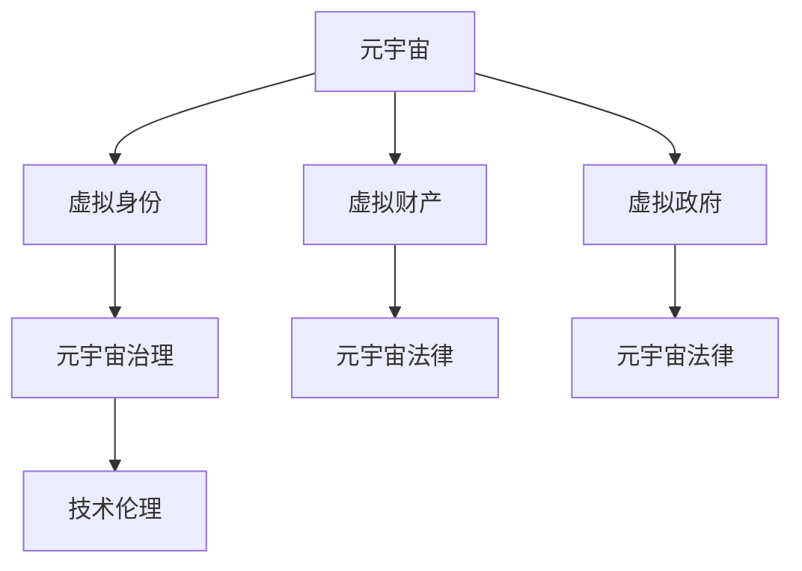

                 

# 元宇宙政治:虚拟世界的权力博弈

> 关键词：元宇宙,政治,权力博弈,虚拟世界,技术伦理

## 1. 背景介绍

### 1.1 问题由来
随着虚拟现实技术的飞速发展，元宇宙这一概念逐渐成为热门话题。元宇宙（Metaverse）是一种虚拟的、基于网络的、实时交互的空间，用户可以在其中创建、体验、互动和交流。它融合了虚拟现实、增强现实、社交网络、云计算、人工智能等多种技术，有望成为未来数字文明的重要形态。

然而，元宇宙的兴起也引发了一系列复杂的社会政治问题。从虚拟世界的身份认同、权力结构，到治理机制、法律边界，这些问题不仅涉及技术层面，更触及了深层的社会政治伦理。随着越来越多的用户和社会组织进入元宇宙，虚拟世界的权力博弈和政治斗争变得愈加显著。

### 1.2 问题核心关键点
元宇宙政治的核心问题包括：
1. 虚拟世界的身份认同问题：用户在虚拟空间中的身份如何定义，如何与现实世界身份保持一致或区别？
2. 权力结构问题：谁在元宇宙中拥有最终决策权和控制权？是技术公司、政府还是用户个体？
3. 治理机制问题：元宇宙如何实现自我管理，防止权力集中和滥用？
4. 法律边界问题：元宇宙中的行为规范如何界定，法律如何适用于虚拟世界？
5. 技术伦理问题：元宇宙如何保障用户隐私和数据安全，防止技术滥用和伦理风险？

这些核心问题共同构成了元宇宙政治研究的框架，对元宇宙的可持续发展具有重要意义。

## 2. 核心概念与联系

### 2.1 核心概念概述

为了更好地理解元宇宙政治问题，本节将介绍几个关键概念及其之间的关系：

- **元宇宙（Metaverse）**：一种虚拟的、基于网络的、实时交互的空间，用户可以在其中创建、体验、互动和交流。
- **虚拟身份（Virtual Identity）**：用户在元宇宙中的数字化存在形式，包括姓名、头像、权限等。
- **虚拟财产（Virtual Assets）**：在元宇宙中存在的数字化资产，如虚拟土地、虚拟货币、虚拟物品等。
- **虚拟政府（Virtual Government）**：在元宇宙中负责治理、安全、纠纷解决的虚拟机构。
- **元宇宙治理（Metaverse Governance）**：对元宇宙的规则制定、执行、调整和优化过程。
- **元宇宙法律（Metaverse Law）**：适用于元宇宙的法律规范和框架。
- **技术伦理（Technology Ethics）**：在元宇宙开发和应用中遵循的伦理原则，如隐私保护、公平正义等。

这些概念之间的关系可以通过以下Mermaid流程图来展示：



这个流程图展示了元宇宙政治研究的主要概念及其相互关系：

1. 元宇宙是虚拟身份、虚拟财产等要素存在的基础。
2. 虚拟身份和虚拟财产的管理和保护依赖于虚拟政府的治理和元宇宙法律的规范。
3. 元宇宙治理和法律必须基于技术伦理的原则，保障用户权益和防止技术滥用。

## 3. 核心算法原理 & 具体操作步骤
### 3.1 算法原理概述

元宇宙政治问题涉及复杂的社会和政治机制，需要通过多学科的知识进行综合分析和研究。尽管不存在严格的算法原理，但可以将其抽象为一个系统工程，涵盖以下关键步骤：

- **需求分析**：明确元宇宙治理和法律框架需要解决的问题，如身份认同、权力结构、法律边界等。
- **制度设计**：构建元宇宙的治理机制、法律体系和伦理框架，如虚拟身份认证机制、虚拟财产保护机制、虚拟政府职能等。
- **技术实现**：开发支持元宇宙治理和法律的技术手段，如区块链、智能合约、隐私保护技术等。
- **验证与优化**：通过模拟实验、用户反馈等方式对元宇宙治理和法律框架进行验证和优化，确保其有效性和可行性。

### 3.2 算法步骤详解

**Step 1: 需求分析**
- 确定元宇宙的主要治理和法律需求，如用户身份认证、虚拟财产保护、隐私保护等。
- 识别元宇宙可能面临的政治风险，如技术滥用、权力集中、法律漏洞等。
- 设计元宇宙治理和法律框架的初步方案，明确其目标和原则。

**Step 2: 制度设计**
- 构建虚拟身份认证机制，如基于生物特征、行为数据的认证方法。
- 设计虚拟财产的保护措施，如数字版权保护、智能合约机制。
- 规划虚拟政府的职能和运作方式，如设立虚拟议会、法庭、执法机构等。
- 制定元宇宙治理和法律的规范和原则，如透明性、公正性、用户权利保障等。

**Step 3: 技术实现**
- 实现支持虚拟身份认证的技术，如身份管理系统、加密算法等。
- 开发虚拟财产保护的技术，如区块链技术、智能合约系统等。
- 构建虚拟政府的管理平台，如决策支持系统、智能合约平台等。
- 引入隐私保护技术，如差分隐私、联邦学习等。

**Step 4: 验证与优化**
- 在元宇宙平台上进行模拟实验，验证治理和法律框架的有效性。
- 收集用户反馈，识别和解决元宇宙治理和法律中的实际问题。
- 根据实验和反馈结果，对治理和法律框架进行迭代和优化。
- 通过多轮实验和优化，逐步完善元宇宙治理和法律体系。

### 3.3 算法优缺点

元宇宙政治问题的解决过程具有以下优点：
1. 系统性：通过多学科的融合，形成综合的治理和法律框架。
2. 用户参与：通过用户反馈和实验，提高治理和法律的适应性和实用性。
3. 前瞻性：能够预见和应对元宇宙可能面临的政治风险和挑战。

但同时，也存在一些缺点：
1. 复杂性：元宇宙治理和法律问题复杂多变，需要多方面的深入研究。
2. 技术依赖：依赖于先进的技术手段，技术失败可能导致治理和法律体系无法实现。
3. 法律适用性：元宇宙法律与现实世界法律的差异，可能引发法律适用性问题。
4. 伦理争议：在元宇宙治理和法律中，如何平衡技术进步与伦理规范，仍存在较大争议。

### 3.4 算法应用领域

元宇宙政治问题涉及多个应用领域，包括但不限于：

- 虚拟现实与增强现实（VR/AR）：在虚拟空间中实现高精度的用户交互和体验。
- 区块链与智能合约：确保虚拟财产的保护和交易的公平透明。
- 人工智能与机器学习：实现用户身份的自动认证和行为分析。
- 法律与政策：制定适用于元宇宙的法律规范和政策框架。
- 隐私与安全：保护用户隐私和数据安全，防止技术滥用和网络攻击。

## 4. 数学模型和公式 & 详细讲解 & 举例说明

尽管元宇宙政治问题不涉及具体的数学模型和公式，但可以借鉴社会科学和政治学的理论框架进行分析和研究。以下是一些可能涉及的模型和分析方法：

### 4.1 数学模型构建

元宇宙政治问题可以通过社会科学和政治学的理论框架进行分析，例如：

- **系统动力学模型**：用于分析元宇宙治理体系中各组成部分之间的相互作用和影响。
- **博弈论**：用于分析虚拟世界中的决策者之间的策略互动和最优策略。
- **社会网络分析**：用于分析元宇宙中用户和组织之间的关系和网络结构。

### 4.2 公式推导过程

由于元宇宙政治问题不涉及具体的数学公式，这里仅以博弈论为例，介绍如何构建基本的博弈模型。

假设元宇宙中有两个用户，A和B，他们需要在虚拟空间中进行合作或竞争，以最大化自己的利益。设他们的策略空间为集合S，每个用户的策略为$s_i \in S$。设每个用户从合作中获得的收益为$U_i$，从竞争中获得的收益为$V_i$。则合作博弈的纳什均衡解为：

$$
\max_{s_i} \left[ U_i(s_i, s_j) \right] = \min_{s_j} \left[ V_j(s_i, s_j) \right]
$$

其中，$s_j$是另一个用户的策略。

### 4.3 案例分析与讲解

以元宇宙中的虚拟政府为例，分析其治理机制和法律框架。

**虚拟政府职能**：
- **立法**：制定元宇宙的法律法规，如用户行为准则、虚拟财产保护规则等。
- **执法**：维护元宇宙的秩序和安全，防止侵权和违法行为。
- **纠纷解决**：处理用户之间的争议和纠纷，保障用户的合法权益。

**虚拟政府运作方式**：
- **虚拟议会**：用户通过投票机制选举代表，参与元宇宙治理的决策过程。
- **虚拟法庭**：用户可以通过在线平台提起诉讼，获得公正的裁决。
- **虚拟警察**：用户可以向虚拟警察报告违法行为，获得及时处理。

## 5. 项目实践：代码实例和详细解释说明
### 5.1 开发环境搭建

在进行元宇宙政治问题研究和实践前，需要先准备好开发环境。以下是使用Python进行元宇宙治理系统开发的示例环境配置流程：

1. 安装Anaconda：从官网下载并安装Anaconda，用于创建独立的Python环境。
2. 创建并激活虚拟环境：
```bash
conda create -n metaverse-env python=3.8 
conda activate metaverse-env
```
3. 安装必要的Python库：
```bash
pip install pandas numpy scikit-learn matplotlib requests beautifulsoup4
```

### 5.2 源代码详细实现

以下是一个简化的元宇宙治理系统示例代码，用于说明如何实现虚拟身份认证和虚拟财产保护的功能。

```python
from flask import Flask, request, jsonify

app = Flask(__name__)

# 虚拟身份认证示例
def authenticate_user(username, password):
    # 真实情况下，应使用加密和存储用户密码的机制
    if username == 'example_user' and password == 'example_password':
        return True
    else:
        return False

# 虚拟财产保护示例
def transfer_virtual_property(from_user, to_user, amount):
    # 真实情况下，应使用区块链和智能合约进行财产保护
    if authenticate_user(from_user, 'example_password'):
        # 虚拟财产转移
        print(f"{from_user} 向 {to_user} 转移了 {amount} 元虚拟财产。")
    else:
        print(f"{from_user} 认证失败，无法转移虚拟财产。")

if __name__ == '__main__':
    app.run(debug=True)
```

### 5.3 代码解读与分析

让我们详细解读一下关键代码的实现细节：

**虚拟身份认证示例**：
- `authenticate_user`函数用于验证用户的身份。在真实情况下，应使用加密算法和数据库存储用户密码，并通过复杂的身份验证机制来保护用户隐私。

**虚拟财产保护示例**：
- `transfer_virtual_property`函数用于转移虚拟财产。在真实情况下，应使用区块链和智能合约来确保财产转移的安全性和透明性。

**Flask框架示例**：
- 使用Flask框架搭建简单的Web服务器，处理用户的请求和响应。在真实情况下，应使用更复杂和强大的后端框架，如Django或FastAPI。

## 6. 实际应用场景
### 6.1 虚拟政府治理

元宇宙中的虚拟政府，可以用于管理虚拟世界中的各种事务，包括法律法规制定、用户行为规范、纠纷解决等。通过虚拟政府，用户可以在虚拟世界中实现自我管理，确保虚拟世界的公平、公正和有序。

**虚拟政府职能**：
- **立法**：制定元宇宙的法律法规，如用户行为准则、虚拟财产保护规则等。
- **执法**：维护元宇宙的秩序和安全，防止侵权和违法行为。
- **纠纷解决**：处理用户之间的争议和纠纷，保障用户的合法权益。

**虚拟政府运作方式**：
- **虚拟议会**：用户通过投票机制选举代表，参与元宇宙治理的决策过程。
- **虚拟法庭**：用户可以通过在线平台提起诉讼，获得公正的裁决。
- **虚拟警察**：用户可以向虚拟警察报告违法行为，获得及时处理。

### 6.2 虚拟企业运营

在元宇宙中，企业可以创建虚拟办公室、虚拟展示厅等，进行远程协作和虚拟营销。通过元宇宙，企业可以打破地域限制，提升工作效率和客户体验。

**虚拟企业治理**：
- **虚拟会议系统**：企业可以在虚拟会议室中开展远程会议，支持视频、音频、文档共享等。
- **虚拟培训平台**：企业可以通过虚拟培训平台进行员工培训和技能提升。
- **虚拟客户支持**：企业可以通过虚拟客服系统，提供7x24小时的客户服务。

**虚拟企业运作方式**：
- **虚拟供应链管理**：企业可以在虚拟世界中管理供应链，进行物流跟踪和库存管理。
- **虚拟营销活动**：企业可以在虚拟世界中进行虚拟展览、虚拟发布会等活动，提升品牌影响力。
- **虚拟财务管理**：企业可以在虚拟世界中进行财务报表的生成和分析，提高财务管理效率。

### 6.3 虚拟教育平台

元宇宙中的虚拟教育平台，可以为学生提供沉浸式学习体验，提高学习效率和互动性。通过元宇宙，学生可以进入虚拟教室、实验室等，进行互动学习和实验。

**虚拟教育治理**：
- **虚拟课程系统**：学生可以在虚拟课程系统中进行在线学习，支持视频、音频、互动实验等多种形式。
- **虚拟实验室**：学生可以在虚拟实验室中进行科学实验，进行数据采集和分析。
- **虚拟考试系统**：学生可以在虚拟考试系统中进行在线考试，支持实时评分和反馈。

**虚拟教育运作方式**：
- **虚拟学习社区**：学生可以加入虚拟学习社区，进行学习讨论和资源共享。
- **虚拟实验平台**：学生可以在虚拟实验平台上进行复杂的实验设计，进行模拟实验和数据分析。
- **虚拟辅导系统**：教师可以在虚拟辅导系统中进行一对一辅导，提高教学效果。

### 6.4 未来应用展望

随着元宇宙技术的不断成熟，其在各行各业的应用将越来越广泛，元宇宙政治问题也将变得更加复杂和多样。未来，元宇宙政治问题将涉及更广泛的社会和政治领域，如虚拟经济、虚拟社会、虚拟文化等。以下是一些可能的未来应用场景：

- **虚拟经济**：元宇宙中的虚拟货币、虚拟市场、虚拟投资等，将形成新的经济形态。
- **虚拟社会**：元宇宙中的虚拟社区、虚拟文化活动、虚拟社会组织等，将形成新的社会形态。
- **虚拟文化**：元宇宙中的虚拟博物馆、虚拟艺术展览、虚拟音乐节等，将丰富人们的文化体验。

## 7. 工具和资源推荐
### 7.1 学习资源推荐

为了帮助开发者系统掌握元宇宙政治问题的理论基础和实践技巧，这里推荐一些优质的学习资源：

1. **《元宇宙政治》系列博文**：由元宇宙技术专家撰写，深入浅出地介绍了元宇宙政治问题的基本概念和解决思路。

2. **CS223N《元宇宙伦理与治理》课程**：斯坦福大学开设的元宇宙治理课程，有Lecture视频和配套作业，带你入门元宇宙治理的基本概念和经典模型。

3. **《元宇宙法律与伦理》书籍**：元宇宙法律与伦理研究的经典著作，全面介绍了元宇宙治理的法律框架和伦理原则。

4. **元宇宙联盟（Metaverse Alliance）官方文档**：元宇宙联盟的官方文档，提供了元宇宙治理的实践案例和最佳实践，是元宇宙治理的重要参考。

5. **元宇宙研究报告**：各大研究机构和企业的元宇宙研究报告，涵盖元宇宙治理、法律、伦理等多个方面，是元宇宙治理的重要参考。

通过对这些资源的学习实践，相信你一定能够快速掌握元宇宙政治问题的精髓，并用于解决实际的元宇宙治理问题。

### 7.2 开发工具推荐

高效的开发离不开优秀的工具支持。以下是几款用于元宇宙治理开发的常用工具：

1. **Flask**：基于Python的轻量级Web框架，适合快速开发和测试元宇宙治理系统。

2. **Django**：基于Python的强大Web框架，适合复杂应用和大型系统的开发。

3. **FastAPI**：基于Python的现代Web框架，支持异步编程和自动API生成，适合高性能应用开发。

4. **Blockchain Explorer**：用于区块链和智能合约的在线探索工具，帮助开发者调试和验证元宇宙治理系统的智能合约。

5. **Web3.js**：用于Web3.0应用的JavaScript库，支持与区块链和智能合约的交互，适合开发元宇宙治理系统。

6. **Gephi**：用于社交网络分析的网络可视化工具，帮助开发者分析元宇宙治理系统中用户和组织的关系网络。

合理利用这些工具，可以显著提升元宇宙治理系统的开发效率，加快创新迭代的步伐。

### 7.3 相关论文推荐

元宇宙政治问题的解决涉及多学科的知识，需要跨领域的研究。以下是几篇奠基性的相关论文，推荐阅读：

1. **《元宇宙政治学》**：探讨元宇宙政治问题的基本概念和解决思路，提供了元宇宙治理的理论框架。

2. **《元宇宙法律与伦理》**：介绍了元宇宙治理的法律框架和伦理原则，提供了元宇宙治理的实践案例。

3. **《元宇宙中的权力与治理》**：分析了元宇宙治理中的权力结构问题，提出了元宇宙治理的多种模式。

4. **《元宇宙中的技术伦理》**：探讨了元宇宙技术开发和应用中的伦理问题，提供了元宇宙技术伦理的指导原则。

这些论文代表了大元宇宙政治问题的研究脉络。通过学习这些前沿成果，可以帮助研究者把握学科前进方向，激发更多的创新灵感。

## 8. 总结：未来发展趋势与挑战
### 8.1 总结

本文对元宇宙政治问题进行了全面系统的介绍。首先阐述了元宇宙政治问题的背景和意义，明确了元宇宙治理和法律框架需要解决的问题。其次，从原理到实践，详细讲解了元宇宙治理和法律框架的构建过程，给出了元宇宙治理系统开发的完整代码实例。同时，本文还广泛探讨了元宇宙治理在虚拟政府、虚拟企业、虚拟教育等多个领域的应用前景，展示了元宇宙治理范式的巨大潜力。此外，本文精选了元宇宙治理相关的学习资源，力求为读者提供全方位的技术指引。

通过本文的系统梳理，可以看到，元宇宙治理问题是一个涉及多学科的复杂系统工程，需要系统性的解决方案。尽管元宇宙治理面临诸多挑战，但其潜在的价值和应用前景广阔，值得我们深入研究与实践。

### 8.2 未来发展趋势

展望未来，元宇宙治理问题将呈现以下几个发展趋势：

1. **技术进步**：元宇宙治理技术将不断进步，实现更高效、更安全的治理方式。
2. **用户参与**：用户参与将更加广泛，通过分布式治理机制，增强治理的公平性和透明性。
3. **跨界融合**：元宇宙治理将与现实世界的法律、伦理、政策等深度融合，实现跨界治理。
4. **标准化建设**：元宇宙治理将逐步标准化，形成统一的治理框架和标准。
5. **全球合作**：元宇宙治理将涉及全球范围，各国需要协同合作，共同应对治理挑战。

以上趋势凸显了元宇宙治理技术的广阔前景。这些方向的探索发展，必将进一步提升元宇宙治理的效能，为元宇宙的可持续发展提供保障。

### 8.3 面临的挑战

尽管元宇宙治理技术已经取得了一定进展，但在迈向更加智能化、普适化应用的过程中，它仍面临诸多挑战：

1. **技术复杂性**：元宇宙治理涉及复杂的技术实现，需要跨领域的知识和技术支持。
2. **法律适用性**：元宇宙法律与现实世界法律的差异，可能导致法律适用性问题。
3. **伦理争议**：在元宇宙治理中，如何平衡技术进步与伦理规范，仍存在较大争议。
4. **安全风险**：元宇宙治理系统可能面临网络攻击、数据泄露等安全风险，需要加强安全防护。
5. **社会接受度**：元宇宙治理需要用户的广泛接受和参与，如何提高用户的信任度和接受度，仍需努力。

### 8.4 研究展望

面对元宇宙治理面临的挑战，未来的研究需要在以下几个方面寻求新的突破：

1. **技术突破**：开发更高效、更安全、更易于用户使用的元宇宙治理技术。
2. **法律完善**：推动元宇宙法律的制定和完善，确保元宇宙治理的法律适用性。
3. **伦理研究**：深入研究元宇宙治理中的伦理问题，制定合理的伦理规范和原则。
4. **安全性提升**：加强元宇宙治理系统的安全性防护，防范各类安全风险。
5. **社会接受度提升**：通过用户教育、透明公开等方式，提高用户对元宇宙治理的接受度和信任度。

这些研究方向的探索，必将引领元宇宙治理技术迈向更高的台阶，为元宇宙的可持续发展提供保障。面向未来，元宇宙治理技术还需要与其他人工智能技术进行更深入的融合，如知识表示、因果推理、强化学习等，多路径协同发力，共同推动元宇宙治理系统的进步。

## 9. 附录：常见问题与解答

**Q1: 元宇宙中的身份认同问题如何解决？**

A: 元宇宙中的身份认同问题可以通过虚拟身份认证机制来解决。在虚拟身份认证中，用户需要使用其真实身份信息进行注册，并通过生物特征、行为数据等进行验证。同时，用户可以设置虚拟身份，如头像、昵称等，以区分其在虚拟世界中的存在形式。

**Q2: 元宇宙中的虚拟财产如何保护？**

A: 元宇宙中的虚拟财产保护可以通过区块链和智能合约来实现。虚拟财产的转移需要经过智能合约的验证和批准，确保财产转移的安全性和透明性。此外，用户可以通过分布式存储和加密技术，保障虚拟财产的安全性。

**Q3: 元宇宙中的虚拟政府如何运作？**

A: 元宇宙中的虚拟政府可以采用分布式治理机制，通过虚拟议会、虚拟法庭和虚拟警察等机构来实现治理职能。用户可以通过投票机制选举代表，参与虚拟政府的决策过程。虚拟法庭处理用户之间的争议和纠纷，虚拟警察报告和处理违法行为。

**Q4: 元宇宙中的治理和法律框架如何制定？**

A: 元宇宙中的治理和法律框架需要多学科的专家共同参与制定，包括法律、伦理、技术等领域的专家。治理和法律框架的制定过程应公开透明，保障用户的知情权和参与权。治理和法律框架应遵循公平、公正、透明的原则，确保用户权益的保护。

**Q5: 元宇宙中的技术伦理问题如何应对？**

A: 元宇宙中的技术伦理问题需要通过制定伦理规范和原则来解决。元宇宙治理系统应遵循隐私保护、公平正义、用户权益保护等伦理原则，防止技术滥用和伦理风险。同时，元宇宙治理系统应设置伦理审核机制，对技术应用进行监督和评估。

---

作者：禅与计算机程序设计艺术 / Zen and the Art of Computer Programming

