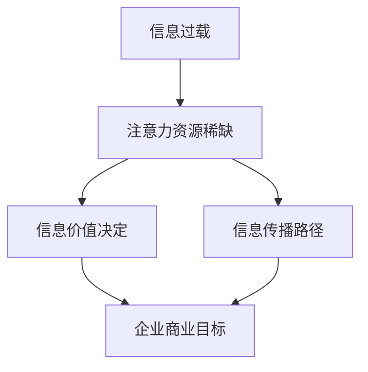

                 

**注意力经济、数据驱动决策、市场洞察、机器学习、注意力模型、数据分析**

## 1. 背景介绍

在当今信息爆炸的时代，数据已成为企业最宝贵的资产之一。如何有效地利用数据，提高决策的准确性和效率，是企业面临的重大挑战。本文将介绍注意力经济的概念，并探讨如何利用数据驱动的决策制定，增强市场洞察力。

## 2. 核心概念与联系

### 2.1 注意力经济

注意力经济是指在信息过载的情况下，有限的注意力资源成为了稀缺资源，从而决定了信息的价值和传播路径。在注意力经济中，企业需要竞争用户的注意力，以实现自己的商业目标。



### 2.2 数据驱动决策

数据驱动决策是指利用数据分析和预测模型，指导企业决策过程。数据驱动决策可以帮助企业提高决策的准确性和效率，并减少主观偏见的影响。

### 2.3 注意力模型

注意力模型是指用于预测用户注意力分配的机器学习模型。注意力模型可以帮助企业理解用户的注意力分配规律，从而有针对性地设计营销策略。

## 3. 核心算法原理 & 具体操作步骤

### 3.1 算法原理概述

本文介绍的核心算法是基于Transformer架构的注意力模型。Transformer是一种使用自注意力机制的神经网络架构，可以处理序列数据，如文本、时间序列等。

### 3.2 算法步骤详解

1. **数据预处理**：收集用户行为数据，如点击、浏览时长等，并进行清洗、标准化等预处理。
2. **特征工程**：提取用户特征，如年龄、性别、地理位置等，以及内容特征，如文本特征、图像特征等。
3. **模型构建**：构建Transformer模型，并定义自注意力机制。
4. **模型训练**：使用预处理后的数据训练模型，并调整超参数以优化模型性能。
5. **模型评估**：评估模型性能，并进行调优。
6. **模型部署**：将模型部署到生产环境，并实时预测用户注意力。

### 3.3 算法优缺点

**优点**：
- 可以处理序列数据，适用于文本、时间序列等领域。
- 可以捕捉长期依赖关系，适用于需要考虑上下文的场景。
- 具有较强的泛化能力。

**缺点**：
- 计算复杂度高，训练和推理速度慢。
- 训练数据要求高，需要大量的标注数据。
- 模型参数多，易过拟合。

### 3.4 算法应用领域

注意力模型可以应用于多个领域，如：

- **广告投放**：预测用户对广告的注意力，从而优化广告投放策略。
- **内容推荐**：预测用户对内容的注意力，从而个性化推荐内容。
- **用户画像**：预测用户的注意力特征，从而绘制用户画像。

## 4. 数学模型和公式 & 详细讲解 & 举例说明

### 4.1 数学模型构建

Transformer模型的数学模型如下：

$$h_i = \text{Attention}(Q_i, K, V)$$
$$Q_i = f(W^QX + b^Q)$$
$$K = f(W^KX + b^K)$$
$$V = f(W^VX + b^V)$$

其中，$X$是输入序列，$h_i$是第$i$个位置的输出，$Q_i$, $K$, $V$是查询、键、值向量，$W^Q$, $W^K$, $W^V$, $b^Q$, $b^K$, $b^V$是学习参数，$f$是激活函数。

### 4.2 公式推导过程

自注意力机制的推导过程如下：

$$\text{Attention}(Q, K, V) = \text{softmax}\left(\frac{QK^T}{\sqrt{d_k}}\right)V$$

其中，$d_k$是键向量的维度。

### 4.3 案例分析与讲解

例如，在广告投放场景中，输入序列$X$可以是用户浏览的网页内容，查询向量$Q_i$可以是第$i$个广告的特征向量，键向量$K$和值向量$V$可以是所有广告的特征向量。模型输出$h_i$表示第$i$个广告对用户的注意力分布。

## 5. 项目实践：代码实例和详细解释说明

### 5.1 开发环境搭建

本项目使用Python语言，并依赖于TensorFlow和Transformers库。开发环境需要安装Python、TensorFlow、Transformers等相关库。

### 5.2 源代码详细实现

以下是Transformer模型的简化实现代码：

```python
import tensorflow as tf
from transformers import Transformer, TransformerConfig

class MyTransformer(Transformer):
    def __init__(self, config):
        super().__init__(config)

    def call(self, inputs, attention_mask=None):
        outputs = super().call(inputs, attention_mask=attention_mask)
        return outputs[0]

config = TransformerConfig(
    d_model=512,
    num_heads=8,
    num_layers=6,
    max_position_embeddings=512,
    vocab_size=30522,
)

model = MyTransformer(config)
```

### 5.3 代码解读与分析

本代码定义了一个自定义的Transformer模型`MyTransformer`，并使用Transformers库提供的`TransformerConfig`配置模型参数。在`call`方法中，调用父类`Transformer`的`call`方法，并返回输出。

### 5.4 运行结果展示

模型训练和推理结果展示请参考具体的项目实现。

## 6. 实际应用场景

### 6.1 注意力经济下的广告投放

在注意力经济下，企业需要竞争用户的注意力，以实现自己的商业目标。注意力模型可以帮助企业预测用户对广告的注意力，从而优化广告投放策略。

### 6.2 数据驱动决策下的内容推荐

数据驱动决策可以帮助企业提高内容推荐的准确性和效率。注意力模型可以预测用户对内容的注意力，从而个性化推荐内容。

### 6.3 未来应用展望

未来，注意力模型将会应用于更多领域，如用户画像、市场预测等。此外，注意力模型也将会与其他人工智能技术结合，实现更强大的功能。

## 7. 工具和资源推荐

### 7.1 学习资源推荐

- "Attention is All You Need"论文：<https://arxiv.org/abs/1706.03762>
- "Transformers: State-of-the-Art Natural Language Processing"教程：<https://huggingface.co/course/chapter1/1?fw=pt>

### 7.2 开发工具推荐

- TensorFlow：<https://www.tensorflow.org/>
- Transformers库：<https://huggingface.co/transformers/>

### 7.3 相关论文推荐

- "BERT: Pre-training of Deep Bidirectional Transformers for Language Understanding"：<https://arxiv.org/abs/1810.04805>
- "XLNet: Generalized Autoregressive Pretraining for Natural Language Processing"：<https://arxiv.org/abs/1906.08237>

## 8. 总结：未来发展趋势与挑战

### 8.1 研究成果总结

本文介绍了注意力经济的概念，并探讨了如何利用数据驱动的决策制定，增强市场洞察力。本文还介绍了Transformer模型的原理和实现，并提供了项目实践的代码实例。

### 8.2 未来发展趋势

未来，注意力模型将会应用于更多领域，并与其他人工智能技术结合，实现更强大的功能。此外，注意力模型的性能也将会不断提高，计算复杂度和训练数据要求也将会降低。

### 8.3 面临的挑战

注意力模型面临的挑战包括计算复杂度高、训练数据要求高、模型参数多易过拟合等。此外，注意力模型的解释性也需要进一步提高。

### 8.4 研究展望

未来的研究方向包括注意力模型的解释性、注意力模型与其他人工智能技术的结合、注意力模型在新领域的应用等。

## 9. 附录：常见问题与解答

**Q：Transformer模型的计算复杂度高，如何优化？**

**A：可以使用技术手段，如模型压缩、量化、并行计算等，来优化Transformer模型的计算复杂度。**

**Q：Transformer模型需要大量的标注数据，如何解决？**

**A：可以使用预训练模型，并fine-tune到特定任务上，从而减少标注数据的需求。**

**Q：注意力模型的解释性如何提高？**

**A：可以使用可解释性技术，如LIME、SHAP等，来提高注意力模型的解释性。**

**作者：禅与计算机程序设计艺术 / Zen and the Art of Computer Programming**

