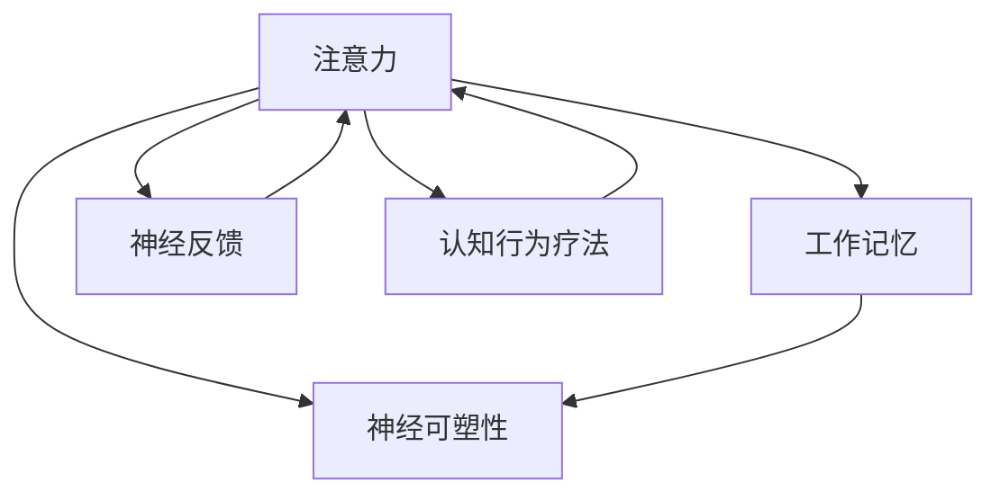

                 

**关键词：**注意力训练、大脑健康、认知能力、神经可塑性、专注力、工作记忆、脑成像、神经反馈、认知行为疗法、注意力缺陷多动障碍（ADHD）

## 1. 背景介绍

在信息爆炸的数字时代，保持注意力和提高认知能力变得尤为重要。注意力训练是一种有效的方法，可以帮助我们增强认知能力，改善大脑健康，并提高神经可塑性。本文将深入探讨注意力训练的原理、方法，以及其在大脑健康和认知能力提升中的作用。我们还将介绍注意力训练在实际应用中的成功案例，并提供相关学习资源和工具推荐。

## 2. 核心概念与联系

### 2.1 核心概念

- **注意力（Attention）**：指个体有选择地将认知资源分配给特定刺激或任务的能力。
- **工作记忆（Working Memory）**：一种暂时存储和处理信息的系统，是注意力的关键组成部分。
- **神经可塑性（Neuroplasticity）**：大脑结构和功能在一生中都可以改变的能力。
- **神经反馈（Neurofeedback）**：一种生物反馈技术，通过实时监测和反馈大脑活动，帮助个体调节注意力和情绪。
- **认知行为疗法（Cognitive Behavioral Therapy, CBT）**：一种心理治疗方法，旨在改变不良的思维和行为模式。

### 2.2 核心概念联系

注意力训练通过改善工作记忆，增强注意力，从而提高认知能力和神经可塑性。神经反馈技术和认知行为疗法等方法可以辅助注意力训练，帮助个体更有效地控制注意力和情绪。下图展示了注意力训练的核心概念及其联系：



## 3. 核心算法原理 & 具体操作步骤

### 3.1 算法原理概述

注意力训练的核心原理是通过一系列练习和技巧，改善工作记忆，增强注意力，从而提高认知能力。这些练习旨在刺激大脑，促进神经元连接的建立和强化，进而提高神经可塑性。

### 3.2 算法步骤详解

1. **意识觉察（Mindfulness）**：首先，个体需要意识到自己的注意力状态，学会觉察自己的思维和情绪。
2. **专注力训练（Focused Attention）**：通过集中注意力于单一刺激（如呼吸、视觉刺激等），训练大脑保持专注的能力。
3. **开放式注意力训练（Open Monitoring）**：扩展注意力，觉察周围环境和内在思维，但不陷入其中。
4. **情感调节（Emotion Regulation）**：学习识别和调节情绪，以帮助保持注意力和工作记忆。
5. **认知行为疗法（CBT）**：结合CBT技巧，改变不良思维模式，帮助个体更有效地控制注意力和情绪。

### 3.3 算法优缺点

**优点：**

- 有效改善注意力和工作记忆。
- 提高认知能力和神经可塑性。
- 可以帮助缓解注意力缺陷多动障碍（ADHD）等注意力相关障碍。
- 无副作用，安全有效。

**缺点：**

- 需要长期坚持，才能看到明显效果。
- 个体差异较大，效果可能因人而异。
- 部分人群（如老年人或认知障碍患者）可能需要额外支持和指导。

### 3.4 算法应用领域

注意力训练适用于各个年龄段和背景的人群，包括：

- 学生：提高学习能力和注意力。
- 成年人：改善工作效率和注意力。
- 老年人：延缓认知衰退，改善注意力。
- ADHD患者：缓解注意力和情绪控制方面的困难。
- 运动员和艺术家：提高专注力和创造力。

## 4. 数学模型和公式 & 详细讲解 & 举例说明

### 4.1 数学模型构建

注意力训练的数学模型可以基于工作记忆模型构建，如Baddeley和Hitch（1974）提出的多组分工作记忆模型。该模型包括：

- **中央执行系统（Central Executive）**：负责监控和调节注意力、工作记忆和认知控制过程。
- **语音环路（Phonological Loop）**：存储和处理语音信息。
- **视觉环路（Visuospatial Sketchpad）**：存储和处理视觉和空间信息。
- **情感环路（Emotional Loop）**：存储和处理情感信息。

### 4.2 公式推导过程

注意力训练的数学模型可以使用动态系统模型表示，其中注意力（A）和工作记忆（WM）是关键变量。假设注意力和工作记忆之间存在正反馈关系，可以表示为：

$$\frac{dA}{dt} = k_1 \cdot WM \cdot (A_0 - A)$$
$$\frac{dWM}{dt} = k_2 \cdot A \cdot (WM_0 - WM)$$

其中，$k_1$和$k_2$是反应速率常数，$A_0$和$WM_0$是注意力和工作记忆的平衡水平。

### 4.3 案例分析与讲解

假设某个个体的注意力和工作记忆水平分别为$A_1$和$WM_1$，通过注意力训练后，分别提高到$A_2$和$WM_2$. 根据上述动态系统模型，我们可以预测注意力和工作记忆的变化趋势。通过调整训练强度和频率，个体可以不断提高注意力和工作记忆水平，从而改善认知能力。

## 5. 项目实践：代码实例和详细解释说明

### 5.1 开发环境搭建

为实现注意力训练的数学模型，我们将使用Python和Matplotlib库。首先，安装必要的库：

```bash
pip install numpy matplotlib
```

### 5.2 源代码详细实现

创建一个名为`attention_training.py`的文件，并添加以下代码：

```python
import numpy as np
import matplotlib.pyplot as plt

# 定义参数
k1, k2 = 0.5, 0.3
A0, WM0 = 1, 1
A1, WM1 = 0.5, 0.5
A2, WM2 = 0.8, 0.8

# 定义时间步长和总时间
dt, T = 0.1, 100

# 初始化注意力和工作记忆
A, WM = np.zeros(T), np.zeros(T)
A[0], WM[0] = A1, WM1

# 仿真注意力和工作记忆变化
for t in range(1, T):
    dA = k1 * WM[t-1] * (A0 - A[t-1])
    dWM = k2 * A[t-1] * (WM0 - WM[t-1])
    A[t] = A[t-1] + dA * dt
    WM[t] = WM[t-1] + dWM * dt

# 绘制注意力和工作记忆变化曲线
plt.plot(np.arange(T)*dt, A, label='Attention')
plt.plot(np.arange(T)*dt, WM, label='Working Memory')
plt.xlabel('Time (s)')
plt.ylabel('Value')
plt.legend()
plt.show()
```

### 5.3 代码解读与分析

该代码使用数值方法（Euler方法）仿真注意力和工作记忆的变化过程。通过调整参数$k_1$, $k_2$, $A_0$, $WM_0$, $A_1$, $WM_1$, $A_2$, $WM_2$, 个体可以模拟不同注意力训练强度和频率下的注意力和工作记忆变化。

### 5.4 运行结果展示

运行代码后，将生成注意力和工作记忆变化的曲线图。个体可以根据曲线图分析注意力和工作记忆的变化趋势，从而调整注意力训练计划。

## 6. 实际应用场景

### 6.1 项目实践

注意力训练已成功应用于各种实际项目，例如：

- **Brain Workshop（<https://brainworkshop.sourceforge.io/>）**：一款开源注意力训练软件，提供多种注意力和工作记忆练习。
- **ADHD Smartphone-Based Attention Training（<https://www.ncbi.nlm.nih.gov/pmc/articles/PMC6126766/>）**：一项研究使用智能手机应用进行注意力训练，帮助缓解ADHD症状。

### 6.2 未来应用展望

未来，注意力训练将继续结合新技术和方法，如：

- **脑机接口（Brain-Computer Interface, BCI）**：结合BCI技术，实时监测和反馈大脑活动，帮助个体调节注意力和情绪。
- **人工智能（Artificial Intelligence, AI）**：开发AI驱动的注意力训练系统，提供个性化的注意力训练计划和实时反馈。

## 7. 工具和资源推荐

### 7.1 学习资源推荐

- **书籍：**
  - "Focus: The Hidden Driver of Excellence" by Daniel Goleman
  - "The Now Habit: A Strategic Program for Overcoming Procrastination and Enjoying Guilt-Free Play" by Neil Fiore
- **在线课程：**
  - Coursera - "Mindfulness for Wellbeing and Peak Performance" by Brown University
  - edX - "The Science of Happiness" by University of California, Berkeley

### 7.2 开发工具推荐

- **Python**：用于实现注意力训练数学模型和数据分析。
- **Matplotlib**：用于绘制注意力和工作记忆变化曲线。
- **EEGLAB（<https://sccn.ucsd.edu/eeglab/>）**：用于脑电图（EEG）数据处理和分析。

### 7.3 相关论文推荐

- "Attention training improves working memory capacity and fluid intelligence" by Söderqvist et al. (2012)
- "Neurofeedback training of attentional networks" by Arns et al. (2009)
- "Cognitive training improves working memory and fluid intelligence in older adults" by Borella et al. (2010)

## 8. 总结：未来发展趋势与挑战

### 8.1 研究成果总结

注意力训练已被证明是一种有效的方法，可以改善注意力和工作记忆，提高认知能力和神经可塑性。神经反馈技术和认知行为疗法等方法可以辅助注意力训练，帮助个体更有效地控制注意力和情绪。

### 8.2 未来发展趋势

未来，注意力训练将继续结合新技术和方法，如脑机接口和人工智能，提供更个性化和有效的注意力训练计划。此外，注意力训练将被广泛应用于各种年龄段和背景的人群，帮助缓解注意力相关障碍和改善大脑健康。

### 8.3 面临的挑战

注意力训练面临的挑战包括：

- **个体差异**：注意力训练的效果可能因人而异，需要开发个性化的注意力训练计划。
- **长期坚持**：注意力训练需要长期坚持，才能看到明显效果，如何帮助个体保持动力和坚持是一个挑战。
- **资源限制**：注意力训练可能需要昂贵的设备和技术支持，如何降低成本和扩大受益人群是一个挑战。

### 8.4 研究展望

未来的研究将关注于：

- **个性化注意力训练**：开发个性化的注意力训练计划，根据个体的注意力和工作记忆水平、学习风格和偏好进行定制。
- **注意力训练与神经可塑性**：进一步研究注意力训练对神经可塑性的影响，以及如何最大化注意力训练的长期效果。
- **注意力训练与脑机接口**：结合脑机接口技术，实时监测和反馈大脑活动，帮助个体调节注意力和情绪。

## 9. 附录：常见问题与解答

**Q1：注意力训练需要多长时间才能看到效果？**

A1：注意力训练需要长期坚持，通常需要数周或数月才能看到明显效果。个体差异较大，效果可能因人而异。

**Q2：注意力训练是否适合所有年龄段和背景的人群？**

A2：注意力训练适用于各个年龄段和背景的人群，包括学生、成年人、老年人、ADHD患者等。但是，部分人群（如老年人或认知障碍患者）可能需要额外支持和指导。

**Q3：注意力训练是否有副作用？**

A3：注意力训练无副作用，安全有效。但是，个体在进行注意力训练时，可能会感到疲劳或焦虑。如果出现严重不适，请咨询医生或心理咨询师。

**Q4：如何选择注意力训练的工具和资源？**

A4：选择注意力训练的工具和资源时，请考虑其科学依据、用户评价和成本。推荐参考本文提供的学习资源、开发工具和相关论文推荐。

**Q5：如何最大化注意力训练的效果？**

A5：最大化注意力训练效果的方法包括：

- 保持长期坚持，定期进行注意力训练。
- 结合认知行为疗法和神经反馈技术等方法，帮助个体更有效地控制注意力和情绪。
- 根据个体的注意力和工作记忆水平、学习风格和偏好进行定制，开发个性化的注意力训练计划。

**作者：禅与计算机程序设计艺术 / Zen and the Art of Computer Programming**

